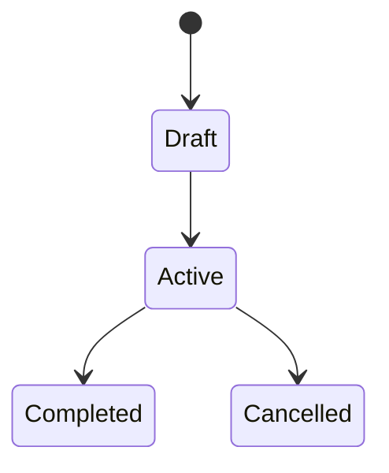

---
description:
  Generate technical implementation plan with architecture and contracts
---

# Gofer Plan

You are creating a detailed technical implementation plan. This is the **third
stage** of the unified Gofer pipeline, combining architecture design, data
modeling, and API contracts.

## User Input

```text
$ARGUMENTS
```

You **MUST** consider the user input before proceeding (if not empty).

## Prerequisites

This command expects in `.specify/specs/{feature}/`:

- `research.md` - Codebase analysis (from /1_gofer_research)
- `spec.md` - Feature specification (from /2_gofer_specify)

If missing, prompt user to run the prerequisite stage.

---

## Outline

1. Context health check
2. Load research and spec context
3. Design technical architecture
4. Generate data models and API contracts
5. Create implementation plan with phases
6. Output: `plan.md`, `data-model.md`, `contracts/`, `quickstart.md`

---

## Step 0: Context Health Check

Before starting planning, assess context window health:

```bash
.specify/scripts/bash/check-context-health.sh
```

- If **< 50%**: Proceed normally
- If **50-70%**: Consider `/compact` - planning loads multiple documents
- If **> 70%**: Start new session with handoff summary

Planning loads research.md, spec.md, and constitution.md - monitor context.

---

## Step 1: Load Context

1. **Run setup script**:

   ```bash
   .specify/scripts/bash/setup-plan.sh --json
   ```

   Parse JSON for FEATURE_DIR, FEATURE_SPEC, BRANCH

2. **Load existing documents**:
   - `research.md` - Technology decisions, integration points, patterns
   - `spec.md` - User stories, requirements, success criteria
   - `.specify/memory/constitution.md` - Project principles (if exists)

3. **Load plan template**: `.specify/templates/plan-template.md`

4. **Load sequence diagram option** (if exists):

   ```bash
   ls -la {FEATURE_DIR}/sequence-diagrams/selected-option.md 2>/dev/null
   ```

   If selected-option.md exists:
   - Load the selected implementation option
   - Extract: option number, efficiency/innovation scores, complexity target
   - Note Gen AI touchpoints for integration planning
   - Use effort estimate to calibrate phase planning

---

## Step 2: Technical Context Analysis

Fill out the Technical Context section:

### 2.1 From Research

Extract from research.md:

- **Integration Points**: Where new code connects to existing
- **Patterns to Follow**: Architectural patterns from codebase
- **Technology Decisions**: Libraries, frameworks chosen
- **Constraints**: Limitations identified

### 2.2 Identify Unknowns

For any gaps, mark as "NEEDS CLARIFICATION" then research:

```
For each unknown:
  Task: "Research {unknown} for {feature context}"
For each technology choice:
  Task: "Find best practices for {tech} in {domain}"
```

### 2.3 Resolve All Unknowns

All NEEDS CLARIFICATION must be resolved before proceeding. Document in
research.md (update it) with:

- Decision: [what was chosen]
- Rationale: [why]
- Alternatives considered: [what else evaluated]

---

## Step 3: Design Data Model

If the feature involves data entities, create `{FEATURE_DIR}/data-model.md`:

````markdown
# Data Model: [Feature Name]

## Entities

### [Entity 1]

| Field   | Type        | Required | Description       |
| ------- | ----------- | -------- | ----------------- |
| id      | string/uuid | Yes      | Unique identifier |
| [field] | [type]      | [Yes/No] | [Description]     |

**Validation Rules**:

- [Rule 1]
- [Rule 2]

**Relationships**:

- [Relationship to other entities]

### [Entity 2]

...

## State Transitions


````

## Database Considerations

- [Indexing strategy]
- [Migration approach]

````

---

## Step 4: Design API Contracts

If the feature has APIs, create contracts in `{FEATURE_DIR}/contracts/`:

### For REST APIs

Create `{FEATURE_DIR}/contracts/api.md`:

```markdown
# API Contract: [Feature Name]

## Endpoints

### POST /api/[resource]

**Description**: [What it does]

**Request**:

```json
{
  "field1": "string",
  "field2": 123
}
````

**Response** (201 Created):

```json
{
  "id": "uuid",
  "field1": "string",
  "createdAt": "ISO-8601"
}
```

**Errors**:

| Code | Description             |
| ---- | ----------------------- |
| 400  | Invalid request body    |
| 401  | Unauthorized            |
| 409  | Resource already exists |

### GET /api/[resource]/{id}

...

````

### For Internal APIs

Create `{FEATURE_DIR}/contracts/internal-api.md` for service-to-service
contracts.

---

## Step 5: Generate Implementation Plan

Write `{FEATURE_DIR}/plan.md`:

```markdown
---
feature: [Feature Name]
spec: spec.md
research: research.md
status: ready
created: [ISO date]
---

# Implementation Plan: [Feature Name]

## Technical Context

### Tech Stack

- **Language**: [From research/codebase analysis]
- **Framework**: [Framework used]
- **Database**: [If applicable]
- **Testing**: [Test framework]

### Architecture

[Diagram or description of how components fit together]

### Integration Points

| Component | File | Integration Type |
|-----------|------|------------------|
| [Component] | `path/to/file.ts` | [Type] |

### Key Dependencies

- [Existing module to use]
- [Library to integrate]

## Selected Implementation Approach

{If selected-option.md exists, include this section:}

This plan implements **Option {N}: {Name}** as selected during specification.

| Metric | Value |
|--------|-------|
| Efficiency Score | {score}% |
| Innovation Score | {score}% |
| Complexity Target | {low/medium/high} |
| Estimated Effort | {from option} |

### Gen AI Touchpoints

{List Gen AI integration points from selected option, or "None" for Minimal option}

- **{Touchpoint 1}**: {Implementation approach}
- **{Touchpoint 2}**: {Implementation approach}

### Approach Rationale

{Brief explanation of why this option was selected and how it shapes the plan}

---

## Constitution Check

[If constitution.md exists, verify alignment with project principles]

- [ ] Principle 1: [How this aligns]
- [ ] Principle 2: [How this aligns]

## Implementation Phases

### Phase 1: Setup & Foundation

**Goal**: Establish project structure and base configuration

**Tasks**:

- [ ] Create directory structure per architecture
- [ ] Set up configuration files
- [ ] Install dependencies
- [ ] Create base types/interfaces

**Verification**:

- [ ] Project builds successfully
- [ ] Linting passes

### Phase 2: Data Layer

**Goal**: Implement data models and persistence

**Tasks**:

- [ ] Implement entities from data-model.md
- [ ] Set up database migrations (if applicable)
- [ ] Create repository/data access layer
- [ ] Add validation logic

**Verification**:

- [ ] Unit tests for models pass
- [ ] Database operations work

### Phase 3: Business Logic

**Goal**: Implement core feature functionality

**Tasks**:

- [ ] Implement services for each user story
- [ ] Add business validation rules
- [ ] Implement integration with existing code

**Verification**:

- [ ] Unit tests for services pass
- [ ] Integration tests pass

### Phase 4: API/Interface Layer

**Goal**: Expose functionality through APIs or UI

**Tasks**:

- [ ] Implement API endpoints per contracts
- [ ] Add request validation
- [ ] Implement error handling
- [ ] Add authentication/authorization

**Verification**:

- [ ] API contract tests pass
- [ ] Manual endpoint testing works

### Phase 5: Polish & Integration

**Goal**: Finalize and integrate with rest of system

**Tasks**:

- [ ] Add logging and monitoring
- [ ] Update documentation
- [ ] Performance optimization
- [ ] Final integration testing

**Verification**:

- [ ] All tests pass
- [ ] Code coverage meets target
- [ ] Performance meets criteria

## File Structure

````

src/ ├── [component]/ │ ├── [file].ts │ └── [file].test.ts ├── ...

```

## Risk Assessment

| Risk | Impact | Mitigation |
|------|--------|------------|
| [Risk 1] | [High/Med/Low] | [How to mitigate] |

## Notes

- [Implementation note 1]
- [Implementation note 2]
```

---

## Step 5.3: Multi-Perspective Plan Review (Optional)

After generating the initial plan, optionally run multi-perspective strategies
to stress-test architectural decisions. **Skip this step if the plan is
straightforward or time-constrained.**

### Strategy #2: Solution Architecture Diverger

For features with significant architectural decisions, spawn 5 agents each using
a different pattern:

```
Task: subagent_type="plan-architecture-diverger", model="sonnet"
Prompt: "Design architecture for [FEATURE] using Pattern [1-5].
Pattern 1: Microservices/modular  2: Monolithic/cohesive  3: Event-sourced
4: CQRS  5: Plugin-based
Spec: [FEATURE_DIR]/spec.md  Plan context: [summary of current plan]"
```

Run all 5 in parallel, then judge:

```
Task: subagent_type="multi-perspective-judge", model="opus"
Prompt: "Judge verdict type: architecture selection.
Select the best architecture for this feature considering codebase fit, complexity, and testability.
[paste all 5 agent outputs]"
```

### Strategy #5: API Design Comparator

For features with API surfaces, compare paradigms:

```
Task: subagent_type="plan-api-comparator", model="sonnet"
Prompt: "Design API for [FEATURE] using Paradigm [1-4].
Paradigm 1: REST  2: GraphQL  3: RPC  4: Event-based
Requirements: [API requirements from spec]"
```

Run 3-4 in parallel, then judge:

```
Task: subagent_type="multi-perspective-judge", model="opus"
Prompt: "Judge verdict type: API paradigm selection.
[paste all agent outputs]"
```

### Strategy #7: Refactor vs Rewrite Advisor

For features that modify existing code significantly:

```
Task: subagent_type="plan-refactor-rewrite-advisor", model="sonnet"
Prompt: "Perspective [1/2] for changing [CODE AREA].
Perspective 1: Plan minimal incremental refactor
Perspective 2: Plan clean rewrite
Current code: [file paths and summary]"
```

Run both in parallel, then judge:

```
Task: subagent_type="multi-perspective-judge", model="opus"
Prompt: "Judge verdict type: refactor vs rewrite decision.
[paste both agent outputs]"
```

### Strategy #12: Migration Path Finder

When the feature requires migrating existing code or data:

```
Task: subagent_type="plan-migration-path-finder", model="sonnet"
Prompt: "Design migration for [CHANGE] using Strategy [1-4].
Strategy 1: Big bang  2: Strangler fig  3: Feature-flagged  4: Adapter/facade
Migration scope: [what needs changing]"
```

Run all 4 in parallel, then judge:

```
Task: subagent_type="multi-perspective-judge", model="opus"
Prompt: "Judge verdict type: migration strategy selection.
[paste all 4 agent outputs]"
```

### Strategy #16: Data Model Stress Tester

For features with data models, stress-test before finalizing:

```
Task: subagent_type="plan-data-model-stress-tester", model="haiku"
Prompt: "Stress-test data model from Perspective [1-4].
Perspective 1: 10x scale  2: Concurrent access  3: Schema evolution  4: Edge-case shapes
Data model: [entities and relationships from plan]"
```

Run all 4 in parallel, then judge:

```
Task: subagent_type="multi-perspective-judge", model="sonnet"
Prompt: "Judge verdict type: data model robustness assessment.
[paste all 4 agent outputs]"
```

Incorporate judge recommendations into the plan before proceeding to validation.

---

## Step 5.5: Spec Coverage Validation (GAP-01)

**CRITICAL**: Before completing plan.md, validate that the plan covers ALL user
stories and requirements from spec.md. This prevents partial implementations.

### 5.5.1 User Story Coverage Matrix

For EACH user story in spec.md, verify plan coverage:

| User Story | Priority | Plan Phase(s) | Components       | Data Entities     | APIs             |
| ---------- | -------- | ------------- | ---------------- | ----------------- | ---------------- |
| US1        | P1       | Phase 3       | [list from plan] | [from data-model] | [from contracts] |
| US2        | P2       | Phase 3       | [list from plan] | [from data-model] | [from contracts] |

**Validation Rules**:

1. Every user story MUST have at least one plan phase covering it
2. Every acceptance criterion MUST map to a plan component
3. ERROR if any user story has NO plan coverage

If validation fails:

- ERROR: "User story '[USx]' has no implementation coverage in plan"
- Add missing components/phases before proceeding

### 5.5.2 Acceptance Criteria Mapping

For EACH acceptance criterion in spec.md user stories:

| User Story | Acceptance Criterion | Plan Component        | Implementation Approach      |
| ---------- | -------------------- | --------------------- | ---------------------------- |
| US1        | [AC1 text]           | [Component from plan] | [How it will be implemented] |
| US1        | [AC2 text]           | [Component from plan] | [How it will be implemented] |

**Validation Rule**: Every acceptance criterion MUST have a corresponding plan
component. If not, add the missing component to the plan.

### 5.5.3 Functional Requirement Coverage

For EACH functional requirement (FR-XXX) in spec.md:

| FR-ID  | Plan Component | Phase   | Implementation Approach |
| ------ | -------------- | ------- | ----------------------- |
| FR-001 | [component]    | Phase X | [how addressed]         |
| FR-002 | [component]    | Phase X | [how addressed]         |

**Validation Rule**: Every FR MUST have plan coverage. ERROR if any FR is
unaddressed.

### 5.5.4 Data Model Completeness

If spec.md defines Key Entities, verify data-model.md covers them:

| Spec Entity | In data-model.md? | Fields Complete? |
| ----------- | ----------------- | ---------------- |
| [Entity 1]  | Yes/No            | Yes/No           |

**Validation Rule**: All Key Entities from spec MUST appear in data-model.md
with appropriate fields.

### 5.5.5 API Contract Completeness

If spec.md implies API endpoints (from FRs or user stories):

| Implied API     | In contracts/? | Matches Requirement? |
| --------------- | -------------- | -------------------- |
| [GET /resource] | Yes/No         | Yes/No               |

**Validation Rule**: All implied APIs MUST have corresponding contracts.

### 5.5.6 Generate Spec Coverage Report

Add to end of plan.md:

```markdown
## Spec Traceability

### User Story Coverage

| Story    | Status  | Plan References          |
| -------- | ------- | ------------------------ |
| US1 (P1) | COVERED | Phase 3, Components X, Y |
| US2 (P2) | COVERED | Phase 4, Components Z    |

### Requirement Coverage

| Requirement | Status  | Plan Reference        |
| ----------- | ------- | --------------------- |
| FR-001      | COVERED | Phase 3, Task group A |
| FR-002      | COVERED | Phase 4, Task group B |

Coverage: 100% of user stories, 100% of functional requirements
```

**Proceed only when ALL spec items are traced to plan components.**

---

## Step 6: Create Quickstart Guide

Write `{FEATURE_DIR}/quickstart.md`:

````markdown
# Quickstart: [Feature Name]

## Prerequisites

- [Prerequisite 1]
- [Prerequisite 2]

## Setup

1. [Setup step 1]
2. [Setup step 2]

## Testing the Feature

### Manual Testing

1. [How to test manually]
2. [Expected result]

### Automated Tests

```bash
npm test -- path/to/tests
```
````

## Key Files

| File                 | Purpose     |
| -------------------- | ----------- |
| `path/to/main.ts`    | Entry point |
| `path/to/service.ts` | Core logic  |

## Common Issues

### Issue 1

**Problem**: [Description] **Solution**: [How to fix]

````

---

## Step 7: Update Agent Context

Run the agent context update script:

```bash
.specify/scripts/bash/update-agent-context.sh claude
````

This updates AI agent context files with new technology from this plan.

---

## Step 8: Report and Continue

After all artifacts are created:

```
✓ Plan complete: {FEATURE_DIR}/plan.md

Artifacts created:
- plan.md: Implementation phases and architecture
- data-model.md: Entity definitions
- contracts/: API specifications
- quickstart.md: Testing guide
```

**AUTO-CHAIN (MANDATORY)**: You MUST immediately invoke the next pipeline stage
by calling the Skill tool with skill="/4_gofer_tasks". Do NOT ask the user for
confirmation. Do NOT output "Ready for next stage". Just invoke the skill NOW.

---

## LLM Council Integration (Optional)

When council mode is enabled for `gofer_plan` stage:

1. Technical research queries go to all configured LLM providers
2. Different perspectives on architecture decisions
3. Chairman synthesizes best practices from multiple sources
4. Usage logged to `.specify/logs/council-usage.jsonl`

---

## Observability Logging

At stage completion, log metrics:

```bash
.specify/scripts/bash/log-stage.sh 3_plan --complete --tokens [N] --compactions [N]
```

Logs to: `.specify/logs/pipeline.jsonl`

---

## Key Rules

- Use absolute paths for all file references
- ERROR if constitution gates fail without justification
- All NEEDS CLARIFICATION must be resolved before completing
- Plan must be specific enough for task generation
- Log stage completion for observability tracking
