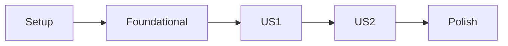

# Gofer Tasks

You are generating an actionable, dependency-ordered task breakdown. This is the
**fourth stage** of the unified Gofer pipeline.

## User Input

```text
$ARGUMENTS
```

You **MUST** consider the user input before proceeding (if not empty).

## Prerequisites

This command expects in `.specify/specs/{feature}/`:

- `research.md` - Codebase analysis (from /1_gofer_research)
- `spec.md` - Feature specification (from /2_gofer_specify)
- `plan.md` - Implementation plan (from /3_gofer_plan)

If missing, prompt user to run the prerequisite stage.

---

## Outline

1. Context health check
2. Load plan and spec context
3. Extract task structure from all artifacts
4. Generate dependency-ordered tasks by user story
5. Create parallel execution opportunities
6. Output: `tasks.md`, `issues.md`

---

## Step 0: Context Health Check

Before generating tasks, assess context window health:

```bash
.specify/scripts/bash/check-context-health.sh
```

- If **< 50%**: Proceed normally
- If **50-70%**: Consider `/compact` before loading all artifacts
- If **> 70%**: Start new session with handoff summary

Task generation loads plan.md, spec.md, data-model.md, and contracts/.

---

## Step 1: Load Context

1. **Run setup script**:

   ```bash
   .specify/scripts/bash/check-prerequisites.sh --json
   ```

   Parse JSON for FEATURE_DIR, AVAILABLE_DOCS

2. **Load design documents** from FEATURE_DIR:
   - **Required**: plan.md (tech stack, architecture, file structure)
   - **Required**: spec.md (user stories with priorities)
   - **Optional**: data-model.md (entities)
   - **Optional**: contracts/ (API endpoints)
   - **Optional**: research.md (technology decisions)
   - **Optional**: quickstart.md (test scenarios)

3. **Load tasks template**: `.specify/templates/tasks-template.md`

---

## Step 2: Extract Task Sources

### 2.1 From Spec (User Stories)

Extract from spec.md:

- User stories with priorities (P1, P2, P3...)
- Acceptance criteria for each story
- These become the PRIMARY organization structure

### 2.2 From Plan (Architecture)

Extract from plan.md:

- Tech stack and libraries
- File structure and components
- Integration points
- Implementation phases

### 2.3 From Data Model (if exists)

Extract from data-model.md:

- Entities and fields
- Relationships
- Validation rules
- Map each entity to user story(ies) that need it

### 2.4 From Contracts (if exists)

Extract from contracts/:

- API endpoints
- Request/response schemas
- Map each endpoint to user story it serves

---

## Step 3: Generate Task Breakdown

### Task Organization Rules

Tasks MUST be organized by user story to enable independent implementation:

1. **Phase 1: Setup** - Project initialization, shared infrastructure
2. **Phase 2: Foundational** - Blocking prerequisites for all user stories
3. **Phase 3+: User Stories** - One phase per story in priority order
4. **Final Phase: Polish** - Cross-cutting concerns, documentation

### Task Format (REQUIRED)

Every task MUST follow this format:

```text
- [ ] [TaskID] [P?] [Story?] Description with file path
```

**Components**:

1. **Checkbox**: Always `- [ ]`
2. **Task ID**: Sequential (T001, T002...)
3. **[P] marker**: Only if parallelizable
4. **[Story] label**: [US1], [US2] etc. for user story phases only
5. **Description**: Clear action with exact file path

**Examples**:

- `- [ ] T001 Create project structure per implementation plan`
- `- [ ] T005 [P] Implement auth middleware in src/middleware/auth.ts`
- `- [ ] T012 [P] [US1] Create User model in src/models/user.ts`

---

## Step 4: Write Tasks Document

Write to `{FEATURE_DIR}/tasks.md`:

````markdown
---
feature: [Feature Name]
spec: spec.md
plan: plan.md
status: ready
created: [ISO date]
---

# Tasks: [Feature Name]

## Overview

- **Total Tasks**: [N]
- **Parallel Opportunities**: [N] tasks marked [P]
- **User Stories**: [N] phases (US1-USn)

## Dependencies


````

## Phase 1: Setup

**Goal**: Initialize project structure and configuration

- [ ] T001 Create directory structure per plan.md
- [ ] T002 [P] Set up configuration files
- [ ] T003 [P] Install dependencies
- [ ] T004 Create base types/interfaces

**Verification**: Project builds successfully

## Phase 2: Foundational

**Goal**: Complete blocking prerequisites

- [ ] T005 [Shared component needed by all stories]
- [ ] T006 [P] [Another shared component]

**Verification**: Foundation ready for user stories

## Phase 3: User Story 1 (P1)

**Goal**: [US1 description from spec]

**Story**: As a [user], I want to [action] so that [benefit]

**Independent Test Criteria**:

- [How to verify this story works independently]

### Implementation

- [ ] T010 [US1] Implement [component] in path/to/file.ts
- [ ] T011 [P] [US1] Create [service] in path/to/service.ts
- [ ] T012 [US1] Add [endpoint] in path/to/routes.ts

**Verification**:

- [ ] Acceptance criteria 1 met
- [ ] Acceptance criteria 2 met

## Phase 4: User Story 2 (P2)

**Goal**: [US2 description from spec]

[Similar structure...]

## Phase N: Polish & Integration

**Goal**: Finalize and prepare for deployment

- [ ] T050 Add logging and monitoring
- [ ] T051 [P] Update documentation
- [ ] T052 [P] Performance optimization
- [ ] T053 Final integration testing

**Verification**: All tests pass, ready for deployment

## Parallel Execution Guide

Tasks marked [P] can run concurrently if they:

- Modify different files
- Have no dependencies on incomplete tasks

**Example parallel groups**:

- T002, T003 (config and deps)
- T010, T011 (independent US1 components)

## Implementation Strategy

1. **MVP First**: Complete Phase 1-3 (Setup + Foundation + US1)
2. **Incremental Delivery**: Each user story is a deployable increment
3. **Polish Last**: Save optimization for final phase

````

---

## Step 4.5: Plan & Spec Coverage Validation (GAP-02 & GAP-03)

**CRITICAL**: Before presenting tasks for approval, validate that tasks cover ALL
plan phases AND ALL spec acceptance criteria. This prevents incomplete implementations.

### 4.5.1 Plan Phase Coverage (GAP-02)

Cross-reference tasks against plan.md phases:

| Plan Phase | Task Count | Task IDs | Status |
|------------|------------|----------|--------|
| Phase 1: Setup | [N] | T001, T002... | COVERED/MISSING |
| Phase 2: Foundational | [N] | T005, T006... | COVERED/MISSING |
| Phase 3: Business Logic | [N] | T010... | COVERED/MISSING |
| Phase 4: API Layer | [N] | T020... | COVERED/MISSING |
| Phase 5: Polish | [N] | T050... | COVERED/MISSING |

**Validation Rules**:
1. Every plan phase MUST have at least one task
2. Tasks MUST cover ALL items listed in each phase
3. ERROR and HALT if any plan phase has NO tasks

If validation fails:
- ERROR: "Plan phase '[Phase X]' has no implementing tasks"
- Add missing tasks before proceeding

### 4.5.2 Plan Task Item Coverage

For EACH task item listed in plan.md phases:

| Plan Task Item | Implementing Task(s) | Status |
|----------------|---------------------|--------|
| "Create directory structure" | T001 | COVERED |
| "Set up configuration files" | T002 | COVERED |
| "Implement services for each user story" | T010, T011, T012 | COVERED |

**Validation Rule**: Every plan task item MUST have a corresponding task in
tasks.md.

### 4.5.3 Acceptance Criteria Traceability (GAP-03)

For EACH acceptance criterion in spec.md user stories:

| User Story | Acceptance Criterion | Task(s) Implementing | Status |
|------------|---------------------|---------------------|--------|
| US1 | "User can login with email" | T012, T015 | COVERED |
| US1 | "Error shown on invalid credentials" | T016 | COVERED |
| US2 | "User can view dashboard" | T020, T021 | COVERED |

**Validation Rules**:
1. Every acceptance criterion MUST map to at least one task
2. Tasks implementing criteria MUST be in the correct user story phase
3. ERROR if any criterion has NO implementing task

If validation fails:
- ERROR: "Acceptance criterion '[AC text]' from [USx] has no implementing task"
- Add task to implement the missing criterion

### 4.5.4 File Structure Alignment

Cross-reference task file paths against plan.md file structure:

For each task with a file path:
- [ ] Path exists in plan.md "File Structure" section OR
- [ ] Path follows project structure conventions

| Task | File Path | In Plan Structure? |
|------|-----------|-------------------|
| T010 | src/models/user.ts | Yes |
| T012 | src/services/auth.ts | Yes |

**If mismatch found**:
- Either update task paths to match plan
- Or update plan structure (requires re-approval of plan)

### 4.5.5 Data Model Task Coverage

If data-model.md exists, verify tasks implement all entities:

| Entity | Implementing Task(s) | Fields Covered? |
|--------|---------------------|-----------------|
| User | T010 | Yes |
| Session | T011 | Yes |

**Validation Rule**: Every data model entity MUST have implementing task(s).

### 4.5.6 API Contract Task Coverage

If contracts/ exist, verify tasks implement all endpoints:

| Endpoint | Contract File | Implementing Task(s) |
|----------|--------------|---------------------|
| POST /api/auth/login | contracts/api.md | T015 |
| GET /api/users/:id | contracts/api.md | T020 |

**Validation Rule**: Every API contract endpoint MUST have implementing task(s).

### 4.5.7 Generate Traceability Artifact

Write `{FEATURE_DIR}/traceability.md`:

```markdown
# Requirement Traceability: [Feature Name]

Generated: [ISO timestamp]

## Spec → Plan → Tasks Mapping

### User Story Coverage
| User Story | Priority | Plan Phase | Tasks | Acceptance Criteria Status |
|------------|----------|------------|-------|---------------------------|
| US1 | P1 | Phase 3 | T010-T015 | 5/5 covered |
| US2 | P2 | Phase 4 | T020-T025 | 3/3 covered |

### Acceptance Criteria Detail
| ID | Criterion | Task(s) | Phase |
|----|-----------|---------|-------|
| US1-AC1 | User can login | T012 | Phase 3 |
| US1-AC2 | Error on failure | T016 | Phase 3 |

### Plan Phase Coverage
| Phase | Task Count | Coverage |
|-------|------------|----------|
| Setup | 4 | 100% |
| Foundational | 3 | 100% |
| US1 (P1) | 6 | 100% |
| US2 (P2) | 5 | 100% |
| Polish | 4 | 100% |

## Coverage Summary

- Plan Phases: [N]/[N] covered (100%)
- User Stories: [N]/[N] covered (100%)
- Acceptance Criteria: [N]/[N] covered (100%)
- Data Entities: [N]/[N] covered (100%)
- API Endpoints: [N]/[N] covered (100%)

**Status**: VALIDATION PASSED ✓
```

**Proceed to approval gate ONLY when ALL validations pass.**

---

## Step 4.7: Engineer Review Gate

Run the engineer-review agent to cross-reference spec, plan, and tasks for alignment gaps:

```
Task: subagent_type="engineer-review", model="sonnet"
Prompt: "Review alignment between spec.md, plan.md, and tasks.md in [FEATURE_DIR].
Find every gap, inconsistency, and misalignment. Report Red/Yellow/Gray findings."
```

**If Red findings exist** (blocking):
1. Apply fixes to tasks.md (max 3 correction iterations)
2. Re-run engineer-review after each fix
3. If issues persist after 3 iterations, generate escalation report and halt for human review

**If only Yellow/Gray findings**: Proceed. Note recommendations for future improvement.

---

## Step 4.8: Multi-Perspective Task Review

After task validation, run multi-perspective strategies.

### Strategy #14: Cross-Cutting Concern Scanner

Spawn 5 agents scanning for missing cross-cutting concerns:

```
Task: subagent_type="tasks-cross-cutting-scanner", model="haiku"
Prompt: "Scan tasks.md at [FEATURE_DIR]/tasks.md for missing cross-cutting concerns.
Dimension [1-5]:
1: Logging/observability  2: Accessibility  3: Internationalization
4: Backward compatibility  5: Documentation
Spec: [FEATURE_DIR]/spec.md"
```

Run all 5 in parallel, then synthesize with judge:

```
Task: subagent_type="multi-perspective-judge", model="sonnet"
Prompt: "Judge verdict type: cross-cutting concern gap analysis.
Identify which missing concerns should be added as tasks before implementation.
[paste all 5 agent outputs]"
```

Add HIGH priority missing tasks to tasks.md if the judge recommends them.

### Strategy #18: Rollback Strategy Planner

Plan rollback for each implementation phase:

```
Task: subagent_type="tasks-rollback-planner", model="sonnet"
Prompt: "Analyze tasks.md at [FEATURE_DIR]/tasks.md.
For each phase, design a rollback plan. Identify irreversible steps that need checkpoints."
```

Include rollback notes in the task document's "Implementation Strategy" section.

---

## Step 5: Generate GitHub Issues

Run the issues generator:

```bash
node .specify/scripts/node/generate-issues.js "$FEATURE_DIR"
````

This creates `{FEATURE_DIR}/issues.md` with GitHub-ready issue definitions.

---

## Step 6: Approval Gate

**IMPORTANT**: Tasks MUST be reviewed and approved before implementation begins.

### 6.1 Update Task Status

Set the frontmatter status to `review`:

```yaml
---
feature: [Feature Name]
spec: spec.md
plan: plan.md
status: review # Changed from 'draft' to 'review'
created: [ISO date]
---
```

### 6.2 Present for Approval

Display the task summary and request explicit approval:

```
════════════════════════════════════════════════════════════════
  TASKS READY FOR REVIEW: [Feature Name]
════════════════════════════════════════════════════════════════

  📋 Task Summary:
  - Total tasks: [N]
  - Tasks by story:
    - US1 (P1): [N] tasks
    - US2 (P2): [N] tasks
    - ...
  - Parallel opportunities: [N] tasks
  - MVP scope: Phase 1-3 (Setup + Foundation + US1)

  📁 Files created:
  - {FEATURE_DIR}/tasks.md
  - {FEATURE_DIR}/issues.md ([N] GitHub issues)

════════════════════════════════════════════════════════════════
  ⚠️  APPROVAL REQUIRED BEFORE IMPLEMENTATION
════════════════════════════════════════════════════════════════

  Please review tasks.md and confirm:
  1. Task breakdown is complete and accurate
  2. Protected files list is correct
  3. Phase dependencies make sense
  4. Scope boundaries are appropriate

  Reply with:
  - "approved" or "lgtm" to proceed to implementation
  - "modify [feedback]" to request changes
  - "stop" to halt the pipeline

════════════════════════════════════════════════════════════════
```

### 6.3 Handle Approval Response

| Response                    | Action                                                       |
| --------------------------- | ------------------------------------------------------------ |
| `approved` / `lgtm` / `yes` | Update status to `approved`, proceed to `/5_gofer_implement` |
| `modify [feedback]`         | Update tasks based on feedback, re-present for approval      |
| `stop`                      | Halt pipeline, document reason in tasks.md                   |

### 6.4 Record Approval

When approved, update frontmatter:

```yaml
---
feature: [Feature Name]
spec: spec.md
plan: plan.md
status: approved
approvedBy: '[user]'
approvedAt: '[ISO timestamp]'
created: [ISO date]
---
```

---

## Step 7: Continue to Implementation

After approval received:

```
✓ Tasks APPROVED: {FEATURE_DIR}/tasks.md

Ready for next stage: /5_gofer_implement
```

If orchestrated by `/0_business_scenario`, the orchestrator will automatically
invoke `/5_gofer_implement` next.

---

## LLM Council Integration

When council mode is configured in `.specify/memory/council-config.yaml` for
task generation:

1. Multiple LLMs analyze the plan for task completeness
2. Different perspectives on dependency ordering
3. Chairman synthesizes optimal task breakdown
4. Usage logged to `.specify/logs/council-usage.jsonl`

---

## Observability Logging

At stage completion, log metrics:

```bash
.specify/scripts/bash/log-stage.sh 4_tasks --complete --tokens [N] --compactions [N]
```

Logs to: `.specify/logs/pipeline.jsonl`

---

## Key Rules

- Use absolute paths for all file references
- Every task must have a file path
- Tasks must be specific enough for LLM execution
- Each user story phase must be independently testable
- Tests are OPTIONAL - only include if specified in requirements
- Log stage completion for observability tracking
