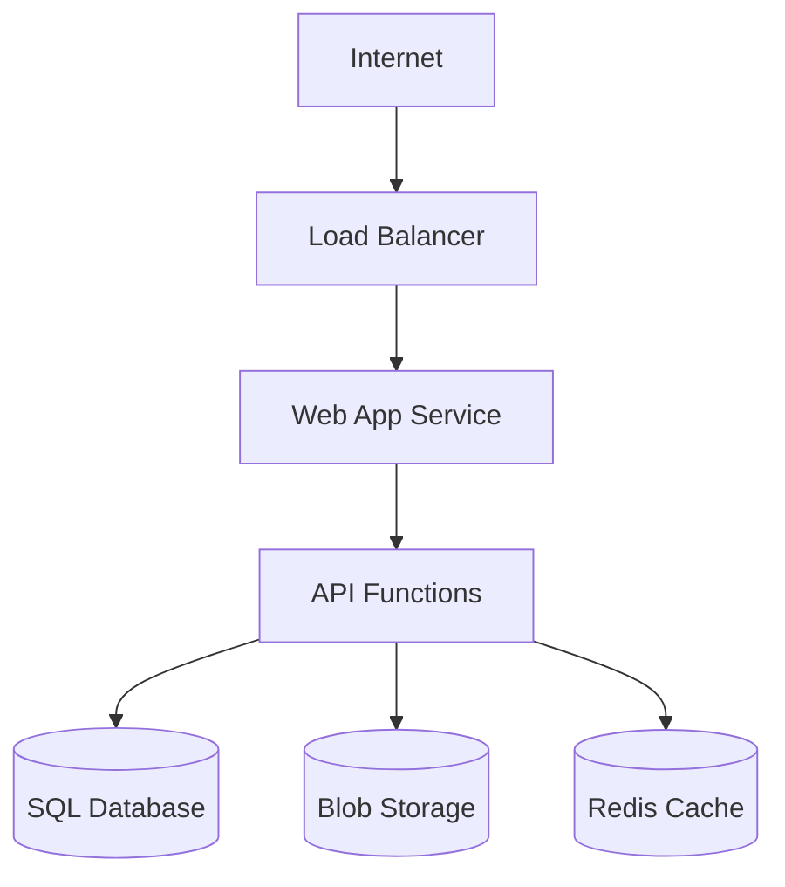

# Gofer Cloud

You are conducting comprehensive READ-ONLY analysis of cloud deployments and
infrastructure using cloud-specific CLI tools (az, aws, gcloud, etc.).

## User Input

```text
$ARGUMENTS
```

You **MUST** consider the user input before proceeding (if not empty).

---

## SAFETY NOTICE

**This command only executes READ-ONLY cloud CLI operations.**

All commands are safe inspection operations that do not modify any cloud
resources. This is critical for agentic coding - agents must never accidentally
modify production infrastructure.

---

## When to Use This Command

- Understanding deployment architecture before feature work
- Analyzing costs and optimization opportunities
- Security and compliance audits
- Performance analysis
- Documenting existing infrastructure
- Planning infrastructure changes

---

## Step 1: Initial Setup

Ask the user:

```
I'm ready to analyze your cloud infrastructure. Please specify:
1. Which cloud platform (Azure/AWS/GCP/other)
2. What aspect to focus on (or "all" for comprehensive analysis):
   - Resources and architecture
   - Security and compliance
   - Cost optimization
   - Performance and scaling
   - Specific services or resource groups
```

Wait for user response.

---

## Step 2: Verify Cloud CLI Access

### Azure

```bash
# Check CLI installed
az version

# Verify authentication
az account show

# List subscriptions
az account list --output table
```

### AWS

```bash
# Check CLI installed
aws --version

# Verify authentication
aws sts get-caller-identity

# List profiles
aws configure list-profiles
```

### GCP

```bash
# Check CLI installed
gcloud version

# Verify authentication
gcloud auth list

# List projects
gcloud projects list
```

If not authenticated, guide user through login process.

---

## Step 3: Execute Cloud Inspection (READ-ONLY)

### Allowed Operations (SAFE)

- `list`, `show`, `describe`, `get` operations
- View configurations and settings
- Read metrics and logs
- Query costs and billing (read-only)
- Inspect security settings (without modifying)

### Forbidden Operations (NEVER EXECUTE)

- Any command with: `create`, `delete`, `update`, `set`, `put`, `post`, `patch`,
  `remove`
- Starting/stopping services or resources
- Scaling operations
- Backup or restore operations
- IAM modifications
- Configuration changes

---

## Step 4: Systematic Resource Inspection

### 4.1 Compute Resources

**Azure:**

```bash
az vm list --output table
az container list --output table
az functionapp list --output table
az webapp list --output table
```

**AWS:**

```bash
aws ec2 describe-instances --output table
aws ecs list-clusters
aws lambda list-functions
aws elasticbeanstalk describe-environments
```

**GCP:**

```bash
gcloud compute instances list
gcloud run services list
gcloud functions list
gcloud app instances list
```

### 4.2 Storage Resources

**Azure:**

```bash
az storage account list --output table
az cosmosdb list --output table
az sql server list --output table
```

**AWS:**

```bash
aws s3 ls
aws dynamodb list-tables
aws rds describe-db-instances
```

**GCP:**

```bash
gcloud storage buckets list
gcloud firestore databases list
gcloud sql instances list
```

### 4.3 Networking

**Azure:**

```bash
az network vnet list --output table
az network nsg list --output table
az network lb list --output table
az network application-gateway list --output table
```

**AWS:**

```bash
aws ec2 describe-vpcs
aws ec2 describe-security-groups
aws elbv2 describe-load-balancers
aws apigateway get-rest-apis
```

**GCP:**

```bash
gcloud compute networks list
gcloud compute firewall-rules list
gcloud compute forwarding-rules list
```

### 4.4 Security Analysis

**Azure:**

```bash
az role assignment list --output table
az keyvault list --output table
az network nsg rule list --nsg-name [name] --resource-group [rg]
```

**AWS:**

```bash
aws iam list-users
aws iam list-roles
aws kms list-keys
aws secretsmanager list-secrets
```

**GCP:**

```bash
gcloud iam roles list
gcloud kms keyrings list --location global
gcloud secrets list
```

### 4.5 Cost Analysis

**Azure:**

```bash
az consumption usage list --start-date [date] --end-date [date]
az advisor recommendation list --category Cost
```

**AWS:**

```bash
aws ce get-cost-and-usage --time-period Start=[date],End=[date] --granularity MONTHLY --metrics BlendedCost
aws ce get-reservation-utilization --time-period Start=[date],End=[date]
```

**GCP:**

```bash
gcloud billing accounts list
gcloud recommender recommendations list --project=[project] --location=global --recommender=google.compute.instance.MachineTypeRecommender
```

---

## Step 5: Generate Cloud Research Document

Write to `{FEATURE_DIR}/cloud-analysis.md` (or `.specify/cloud/[environment].md`
for general analysis):

````markdown
---
date: [ISO timestamp]
researcher: Claude
platform: [Azure/AWS/GCP]
environment: [Production/Staging/Dev]
subscription: [Subscription/Account ID]
status: complete
---

# Cloud Infrastructure Analysis: [Environment Name]

## Executive Summary

[High-level findings, critical issues, and key recommendations]

## Analysis Scope

- **Platform**: [Cloud Provider]
- **Subscription/Project**: [ID]
- **Regions**: [List]
- **Focus Areas**: [What was analyzed]

## Resource Inventory

| Category   | Resource Type | Count | Region  | Est. Monthly Cost |
| ---------- | ------------- | ----- | ------- | ----------------- |
| Compute    | VMs           | 12    | East US | $1,200            |
| Compute    | Functions     | 5     | East US | $50               |
| Storage    | Blob Storage  | 3     | East US | $200              |
| Database   | SQL Server    | 2     | East US | $800              |
| Networking | Load Balancer | 1     | East US | $100              |

**Total Estimated Monthly Cost**: $X,XXX

## Architecture Overview


````

## Detailed Findings

### Compute Infrastructure

| Resource      | Type     | Size        | State   | Notes         |
| ------------- | -------- | ----------- | ------- | ------------- |
| prod-web-01   | VM       | Standard_D4 | Running | Web server    |
| prod-api-func | Function | Consumption | Active  | API endpoints |

**Observations**:

- [Finding about compute resources]
- [Optimization opportunity]

### Data Layer

| Resource  | Type    | Size  | Tier     | Backup Status |
| --------- | ------- | ----- | -------- | ------------- |
| prod-sql  | SQL DB  | 50GB  | Standard | Daily         |
| prod-blob | Storage | 200GB | Hot      | GRS enabled   |

**Observations**:

- [Finding about data resources]
- [Compliance consideration]

### Networking

| Resource  | Type | Configuration        | Security     |
| --------- | ---- | -------------------- | ------------ |
| prod-vnet | VNet | 10.0.0.0/16          | NSG attached |
| prod-lb   | LB   | Standard, Zone-aware | HTTPS only   |

**Observations**:

- [Network topology findings]
- [Security considerations]

## Security Analysis

### IAM Review

| Principal | Role        | Scope        | Risk Level |
| --------- | ----------- | ------------ | ---------- |
| dev-team  | Contributor | Subscription | Medium     |
| ci-cd-sp  | Owner       | Resource Grp | High       |

### Security Findings

| Finding               | Severity | Resource        | Recommendation  |
| --------------------- | -------- | --------------- | --------------- |
| Public blob container | High     | storage-account | Enable private  |
| Open SSH port         | Medium   | prod-web-01     | Restrict to VPN |
| Missing encryption    | Medium   | prod-sql        | Enable TDE      |

### Compliance Status

- [ ] Encryption at rest enabled
- [ ] Encryption in transit enforced
- [ ] Backup retention meets policy
- [ ] Access logging enabled
- [ ] Network segmentation in place

## Cost Analysis

### Current Monthly Cost: $X,XXX

| Category   | Cost   | % of Total |
| ---------- | ------ | ---------- |
| Compute    | $1,250 | 50%        |
| Storage    | $200   | 8%         |
| Database   | $800   | 32%        |
| Networking | $250   | 10%        |

### Optimization Opportunities

| Opportunity           | Current   | Recommended | Savings |
| --------------------- | --------- | ----------- | ------- |
| Right-size VMs        | D4 x 2    | D2 x 2      | $400/mo |
| Reserved instances    | On-demand | 1-year RI   | $300/mo |
| Delete unused storage | 50GB      | 0GB         | $25/mo  |

**Potential Monthly Savings**: $725

## Risk Assessment

### Critical Issues

1. **[Issue]**: [Description and impact]
2. **[Issue]**: [Description and impact]

### Warnings

1. **[Warning]**: [Description and recommendation]
2. **[Warning]**: [Description and recommendation]

## Recommendations

### Immediate Actions (This Week)

1. [ ] [Security fix or critical issue]
2. [ ] [Another urgent item]

### Short-term Improvements (This Month)

1. [ ] [Cost optimization]
2. [ ] [Performance enhancement]

### Long-term Strategy (This Quarter)

1. [ ] [Architecture improvement]
2. [ ] [Migration consideration]

## CLI Commands for Verification

```bash
# Key commands used in this analysis
az vm list --output table
az storage account list --output table
# ... other commands run
```

## Integration with Feature Development

If analyzing for a specific feature:

### Deployment Target

- **Environment**: [Where feature will deploy]
- **Resource Group**: [Target RG]
- **Required Services**: [What feature needs]

### Constraints for Implementation

- [Constraint 1]: How this affects the feature
- [Constraint 2]: Another consideration

### Infrastructure Changes Needed

- [ ] [New resource needed]
- [ ] [Configuration change]
- [ ] [Permission update]

```

---

## Step 6: Report Completion

```

================================================================ CLOUD ANALYSIS
COMPLETE: [Environment Name]
================================================================

Platform: [Azure/AWS/GCP] Resources Analyzed: [N] resources across [N]
categories

Key Findings:

- [Critical finding 1]
- [Warning 1]
- [Optimization opportunity]

Cost Summary:

- Current: $X,XXX/month
- Potential Savings: $XXX/month

Security Status:

- Critical Issues: [N]
- Warnings: [N]
- Compliance: [X]/[Total] checks passed

Report: [output file path]

Recommended Actions:

1. [Most important action]
2. [Second priority]

================================================================

```

---

## Error Handling

### CLI Not Installed

```

[Platform] CLI not found. Please install:

Azure: https://docs.microsoft.com/cli/azure/install-azure-cli AWS:
https://aws.amazon.com/cli/ GCP: https://cloud.google.com/sdk/docs/install

```

### Not Authenticated

```

Not authenticated to [Platform]. Please run:

Azure: az login AWS: aws configure GCP: gcloud auth login

```

### Insufficient Permissions

```

Warning: Insufficient permissions for some operations. Missing permissions:
[list]

Analysis will continue with available access. Results may be incomplete for:
[affected areas]

````

### Rate Limited

If rate limited, implement exponential backoff and continue with available data.

---

## Observability Logging

```bash
.specify/scripts/bash/log-stage.sh 10_cloud --complete --tokens [N] --compactions [N]
````

---

## Key Rules

- **READ-ONLY OPERATIONS ONLY** - never create, modify, or delete
- **Always verify CLI authentication** before running commands
- **Use --output json** for structured data parsing
- **Handle API rate limits** by spacing requests
- **Respect security** - never expose sensitive data in reports
- **Generate actionable insights**, not just resource lists
