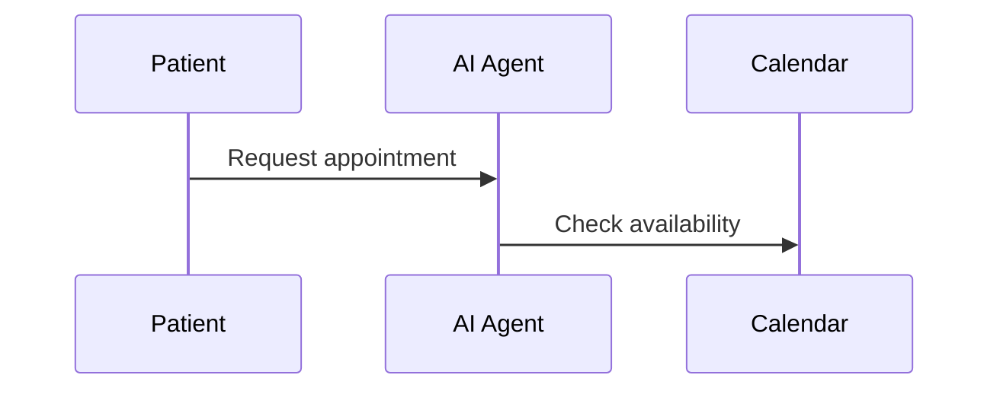

# Gofer Research

You are conducting comprehensive research to understand the codebase before
specifying a new feature. This combines deep codebase exploration with
technology research.

## Outline

This is the **first stage** of the unified Gofer pipeline. Your job is to:

1. Check context health
2. Understand what the user wants to build
3. Research the codebase to find where it should be implemented
4. Identify patterns, existing code, and integration points
5. Document technology decisions and constraints

**Output**: `.specify/specs/{feature}/research.md`

---

## Step 1: Get Feature Context

If no feature description provided:

1. Ask: **"What feature or change would you like to work on?"**
2. Wait for user response

Once you have the feature description:

1. **Generate a short name** (2-4 words) for the feature
2. Run `.specify/scripts/bash/create-new-feature.sh --json "$DESCRIPTION"` with
   `--short-name "your-short-name"` to create the feature directory
3. Parse JSON output for FEATURE_DIR and BRANCH_NAME

---

## Step 2: Conduct Parallel Research

Launch these specialized research tasks:

### Task 1: Codebase Location

Find all code related to the feature area in this codebase. Identify: entry
points, related files, directory structure, key classes/functions.

### Task 2: Codebase Analysis

Analyze how related functionality is implemented in this codebase. Explain:
architecture patterns, data flow, key abstractions.

### Task 3: Pattern Discovery

Find examples of similar patterns in this codebase. Show: similar
implementations we should model after. Include: file paths, code snippets,
conventions used.

---

## Step 3: Technology Research

Research any technology questions:

1. **Identify unknowns** from the feature description:
   - New libraries or frameworks needed?
   - Integration patterns to research?
   - Best practices to follow?

2. **Document decisions**:
   - Decision: [what to use]
   - Rationale: [why chosen]
   - Alternatives: [what else considered]

---

## Step 3.5: Journey Variant Generation (New)

If a base journey was confirmed in `/0_business_scenario`:

1. **Generate a random count** between 10-50 variants
2. **Distribute proportionally** across 10 industries:
   - retail, healthcare, finance, education, hospitality
   - logistics, manufacturing, legal, real_estate, entertainment

3. **For each variant**:
   - Adapt the base journey to the industry context
   - Identify industry-specific innovations
   - Document what can be learned from this industry

4. **Save variants** to
   `.specify/specs/{feature}/journeys/variants/{industry}-{number}.md`

Example variant structure:

````markdown
---
industry: healthcare
variantNumber: 1
baseJourney: base-journey.md
---

# Journey Variant: Healthcare Appointment Scheduling

## Adaptations

- [How journey changes for healthcare]

## Innovations

- [What healthcare does that we can learn from]

## Sequence Diagram


````

````

---

## Step 4: Generate Research Document

Write to `{FEATURE_DIR}/research.md`:

```markdown
---
date: [ISO timestamp]
researcher: Copilot
feature: '[Feature Name]'
status: complete
---

# Research: [Feature Name]

## Feature Summary

[Brief description of what we're building]

## Codebase Analysis

### Where to Implement

| Component     | Location         | Purpose        |
| ------------- | ---------------- | -------------- |
| [Component 1] | path/to/location | [What it does] |

### Existing Patterns

[Code patterns found that we should follow]

### Integration Points

[Where new code connects to existing code]

## Technology Decisions

| Decision | Choice | Rationale |
| -------- | ------ | --------- |
| [Area]   | [Tech] | [Why]     |

## Constraints & Considerations

- [Constraint 1]
- [Constraint 2]

## Next Steps

Proceed to `/2_gofer_specify` to create the feature specification.
````

---

## Pipeline Continuation

After completing research.md, automatically proceed to `/2_gofer_specify` to
create the feature specification informed by this research.
