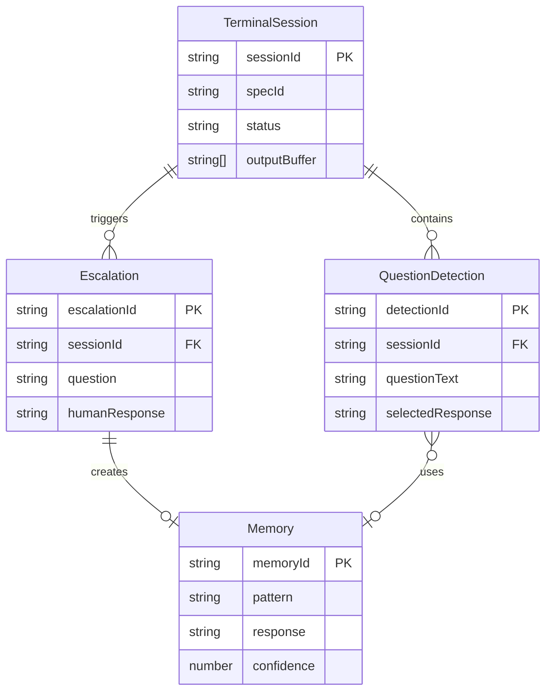

# Data Model: Claude Code Terminal Integration

**Date**: 2025-11-03 **Feature**: 001-claude-terminal-integration

## Core Entities

### 1. TerminalSession

**Purpose**: Represents an active Claude Code terminal session

```typescript
interface TerminalSession {
  // Identification
  sessionId: string; // UUID v4
  specId: string; // e.g., "001-claude-terminal-integration"
  featureBranch: string; // e.g., "feature/001-claude-terminal-integration"

  // Process Management
  pid: number | null; // Process ID from node-pty
  ptyProcess: any; // node-pty instance (not serializable)
  status: 'initializing' | 'running' | 'stopped' | 'crashed';

  // Timing
  startedAt: string; // ISO 8601 timestamp
  stoppedAt: string | null; // ISO 8601 timestamp
  lastActivity: string; // ISO 8601 timestamp

  // Output Management
  outputBuffer: string[]; // Circular buffer (max 10,000 lines)
  tokenCount: number; // Estimated token usage
  currentCommand: string | null;

  // Queue Management
  queuePosition: number; // 0 = currently running, 1+ = queued
}
```

**Validation Rules**:

- sessionId must be unique UUID v4
- specId must match existing spec directory
- featureBranch must exist or be creatable
- outputBuffer limited to 10,000 entries (FIFO)
- tokenCount resets at context window limit

**State Transitions**:

```
initializing → running → stopped
     ↓           ↓
   crashed    crashed
```

### 2. Escalation

**Purpose**: Represents a question requiring human intervention

```typescript
interface Escalation {
  // Identification
  escalationId: string; // UUID v4
  sessionId: string; // Reference to TerminalSession

  // Question Context
  question: string; // Natural language question from Claude
  detectedAt: string; // ISO 8601 timestamp
  context: {
    specId: string;
    currentTask: string; // e.g., "T001: Setup terminal integration"
    recentOutput: string[]; // Last 20 lines before question
    confidence: number; // 0.0 to 1.0
  };

  // Violation/Uncertainty
  reason: 'low_confidence' | 'constitution_violation' | 'error';
  violationDetails?: string; // If constitution violation

  // Response
  status: 'pending' | 'responded' | 'timeout' | 'fallback';
  responseChannel: 'whatsapp' | 'vscode' | null;
  humanResponse: string | null;
  respondedAt: string | null; // ISO 8601 timestamp
  responseTime: number | null; // Milliseconds
}
```

**Validation Rules**:

- escalationId must be unique UUID v4
- confidence must be between 0.0 and 1.0
- timeout after 5 minutes (300,000ms)
- recentOutput limited to 20 lines
- reason must match enumerated values

**State Transitions**:

```
pending → responded
   ↓
timeout → fallback → responded
```

### 3. Memory

**Purpose**: Stores learned patterns from human decisions

```typescript
interface Memory {
  // Identification
  memoryId: string; // UUID v4
  createdAt: string; // ISO 8601 timestamp

  // Pattern Information
  category: 'decision_patterns';
  pattern: {
    question: string; // Original question pattern
    response: string; // Human-provided response
    context: {
      taskType: string; // e.g., "file_creation", "api_integration"
      specId: string;
      taskId: string; // e.g., "T001"
    };
  };

  // Metadata
  scope: 'spec' | 'project' | 'global';
  confidence: number; // Starts at 0.5, increases with use
  usageCount: number; // Times this memory was applied
  lastUsed: string | null; // ISO 8601 timestamp

  // Learning
  source: 'human_escalation' | 'manual_entry';
  tags: string[]; // e.g., ['autonomous', 'file_operations']
}
```

**Validation Rules**:

- memoryId must be unique UUID v4
- confidence starts at 0.5, max 1.0
- confidence increases by 0.1 per successful use
- scope determines pattern application breadth
- tags must be lowercase, alphanumeric with underscores

### 4. QuestionDetection

**Purpose**: Tracks detected questions for analysis

```typescript
interface QuestionDetection {
  // Detection Info
  detectionId: string; // UUID v4
  sessionId: string;
  detectedAt: string; // ISO 8601 timestamp

  // Question Analysis
  rawText: string; // Original terminal output
  questionText: string; // Extracted question
  questionType: 'confirmation' | 'choice' | 'open_ended';
  suggestedResponses: string[]; // e.g., ["yes", "no", "continue"]

  // Decision
  decisionMethod: 'auto' | 'memory' | 'escalation';
  selectedResponse: string;
  confidence: number;

  // Validation
  constitutionCheck: {
    passed: boolean;
    violations: string[];
  };
}
```

**Validation Rules**:

- Must extract question from surrounding text
- questionType determines response validation
- confidence threshold: 0.8 for auto-response
- constitution violations force escalation

## Relationships



## Storage Strategy

### In-Memory (Runtime)

- `TerminalSession`: Active sessions only
- `QuestionDetection`: Last 100 detections
- PTY process handles

### File System (Persistent)

- `Memory`: `.specify/memory/decisions/[memoryId].json`
- `Escalation`: `.specify/logs/escalations/[date]/[escalationId].json`
- Session logs: `.specify/logs/sessions/[date]/[sessionId].log`

### VSCode Global State

- Queue status
- Active session ID
- WhatsApp configuration

## Data Flow

1. **Session Creation**:

   ```
   User clicks Play → Create TerminalSession → Queue if needed → Launch PTY
   ```

2. **Question Detection**:

   ```
   Terminal output → Parse for questions → Create QuestionDetection →
   Check memories → Validate constitution → Auto-respond or escalate
   ```

3. **Escalation Flow**:

   ```
   Create Escalation → Send WhatsApp → Wait for response →
   Create Memory → Apply response to terminal
   ```

4. **Memory Application**:
   ```
   New question → Search memories by context →
   Score similarity → Apply if confidence > 0.8
   ```

## Performance Considerations

- **Output Buffer**: Circular buffer prevents memory overflow
- **Memory Search**: Index by tags and context for O(log n) lookup
- **Queue Management**: Max 10 queued sessions
- **Escalation Timeout**: 5 minutes prevents indefinite waiting
- **Context Window**: Monitor token count, reset at 90% limit

## Security & Privacy

- No credentials in TerminalSession
- Sanitize terminal output before WhatsApp
- UUID v4 for all identifiers (no sequential IDs)
- Memory patterns anonymized (no PII)
- Session logs rotated daily

## Migration Path

This is a new feature, no data migration required. However:

1. Existing AutonomousDriver state will be preserved
2. OutputMonitor patterns will be extended, not replaced
3. MemoryManager will add new category for decisions
