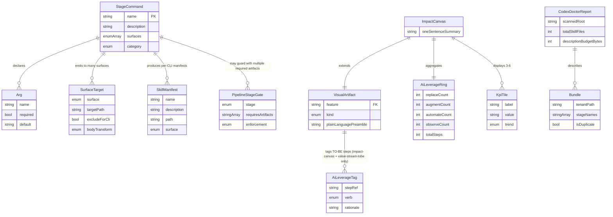
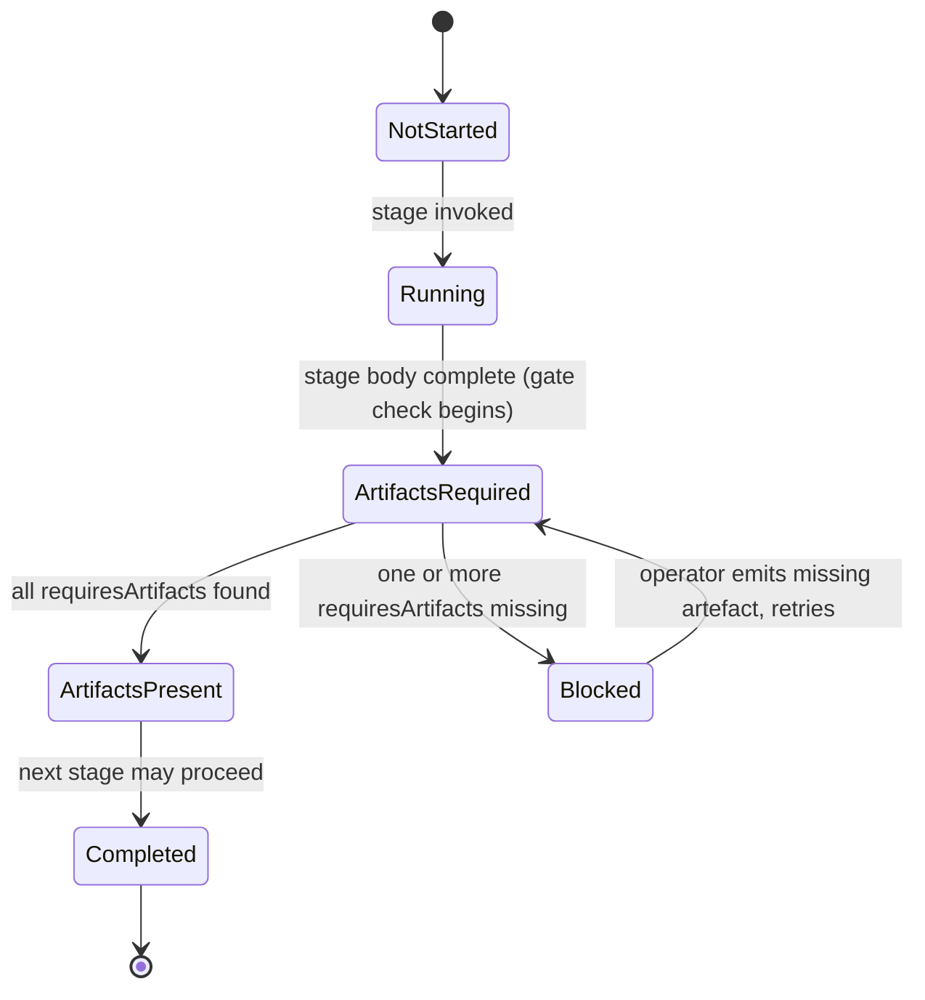

# Data Model — CLI Innovations + Multi-Persona Visual Artifacts

This feature is a tooling/pipeline feature. There is **no database**. The "data
model" below defines the schema of file-based artefacts that the source-of-truth
generator and the persona-pack visual writers produce and consume. Each entity
is realised as a Markdown / YAML / TOML / JSON file under `.specify/`,
`.claude/`, `.agents/`, `.gemini/`, `extension/`, or `.github/`. Schemas are
strongly typed so the generator can reject malformed input rather than silently
emit drift.

---

## 1. Entity Definitions

### 1.1 StageCommand

The canonical, single-source-of-truth file for every Gofer stage. Lives at
`.specify/commands/<name>.md` as YAML frontmatter + Markdown body. All other CLI
surfaces are emitted from this entity.

| Field         | Type     | Required | Description                                                                                                                            | Validation                                                                                                                  |
| ------------- | -------- | -------- | -------------------------------------------------------------------------------------------------------------------------------------- | --------------------------------------------------------------------------------------------------------------------------- |
| `name`        | string   | yes      | Canonical kebab-case stage name, e.g. `1_gofer_research`.                                                                              | MUST match `^[0-9]{1,2}[a-z]?_[a-z_]+$` OR `^gofer_[a-z_]+$`. Unique across `.specify/commands/`.                           |
| `aliases`     | string[] | no       | Additive command aliases, e.g. `["/gofer:research"]`.                                                                                  | If `surfaces` includes `claude`, MUST include at least one `/gofer:<short>` alias (no-regression invariant).                |
| `description` | string   | yes      | One-sentence summary used for picker, plugin manifest, and Codex skill index.                                                          | UTF-8 byte length ≤ 140. Generator REJECTS emission if exceeded (FR-006).                                                   |
| `surfaces`    | enum[]   | yes      | Subset of `{claude, copilot, gemini, codex, vscode, github-prompts}`.                                                                  | Non-empty. MUST exclude `codex` and `gemini` for Claude-only stages (see cross-entity rule §2.3).                           |
| `args`        | Arg[]    | no       | Typed argument list (see §1.2). Defaults to `[]`.                                                                                      | Each entry validates per `Arg` schema.                                                                                      |
| `includes`    | string[] | no       | Relative paths or `@{path}` refs the body injects at emit time.                                                                        | Each entry resolvable from repo root; `@{}` syntax preserved literally for Gemini emit; relative paths resolved for others. |
| `body`        | string   | yes      | Markdown prompt content, after the `---` frontmatter terminator.                                                                       | Non-empty. MUST not contain a literal `skills_context_budget_percent` token (FR-011).                                       |
| `category`    | enum     | yes      | One of: `orchestrator, research, specify, plan, tasks, implement, validate, comms, save, resume, tests, cloud, hydrate, constitution`. | Used by generator to drive PipelineStageGate wiring.                                                                        |

**File location**: `.specify/commands/<name>.md` **Example**:
`.specify/commands/2_gofer_specify.md`

---

### 1.2 Arg (embedded in StageCommand)

| Field         | Type           | Required | Description                                    | Validation                                     |
| ------------- | -------------- | -------- | ---------------------------------------------- | ---------------------------------------------- |
| `name`        | string         | yes      | Argument name as users type it.                | Matches `^[a-z][a-z0-9-]*$`.                   |
| `required`    | bool           | yes      | Whether the user MUST supply this arg.         | —                                              |
| `description` | string         | yes      | One-sentence purpose, surfaced in picker/help. | UTF-8 byte length ≤ 140.                       |
| `default`     | string \| null | no       | Default value when omitted.                    | Null permitted; ignored when `required: true`. |

---

### 1.3 SurfaceTarget (emit-time computed)

Computed by the generator for every (StageCommand × surface) pair. Not persisted
on disk as a discrete file — exists as an in-memory plan that drives writes.

| Field                 | Type   | Required | Description                                                                                                   | Validation                                                                                                               |
| --------------------- | ------ | -------- | ------------------------------------------------------------------------------------------------------------- | ------------------------------------------------------------------------------------------------------------------------ |
| `surface`             | enum   | yes      | One of `{claude, copilot, gemini, codex, vscode, github-prompts}`.                                            | MUST appear in the source `StageCommand.surfaces[]`.                                                                     |
| `targetPath`          | string | yes      | Absolute path the generator writes (e.g. `.claude/commands/<name>.md`, `.gemini/commands/gofer/<name>.toml`). | Path uniquely determined by `(surface, name)`.                                                                           |
| `excludeForCli`       | bool   | yes      | True when this stage is Claude-only AND `surface != claude` (skip emission).                                  | Computed from cross-entity rule §2.3.                                                                                    |
| `descriptionMaxBytes` | int    | yes      | Per-surface description budget (default = 140).                                                               | MUST equal 140 for all surfaces in this release.                                                                         |
| `bodyTransform`       | enum   | yes      | One of `{passthrough, codex-shortened, copilot-prompt, claude-skill, gemini-toml}`.                           | Determines how the Markdown body is rewritten for the surface (e.g. Gemini wraps body inside TOML `prompt = """..."""`). |

---

### 1.4 SkillManifest

The per-CLI skill registry entry produced when a stage's surfaces include
`codex`. Codex discovers skills under `.agents/skills/<name>/SKILL.md` (and the
system/admin/user/plugin locations enumerated by Codex). **Claude does NOT have
a SkillManifest emit target in this feature** — Claude commands are emitted as
`.claude/commands/<name>.md` (handled by `SurfaceTarget`, not `SkillManifest`);
Claude skill bundles are only emitted via the Phase 3
`.claude-plugin/plugin.json` packaging path and are not modelled as
`SkillManifest` here. This separation is deliberate: the Codex skill-budget
hygiene invariant applies to Codex paths only, and conflating Claude
`.claude/skills/` with `.claude/commands/` is what produced the original
2026-04-25 incident's misdiagnosis.

| Field         | Type   | Required | Description                                                                                                 | Validation                                                                                                                 |
| ------------- | ------ | -------- | ----------------------------------------------------------------------------------------------------------- | -------------------------------------------------------------------------------------------------------------------------- |
| `name`        | string | yes      | Canonical short name (kebab-case).                                                                          | Matches `^[a-z0-9_-]+$`.                                                                                                   |
| `description` | string | yes      | One-sentence summary used by Codex for implicit selection.                                                  | UTF-8 byte length ≤ 140 (FR-006). Cumulative bytes across all Codex-emitted manifests ≤ 2KB (NFR-004).                     |
| `enabled`     | bool   | yes      | Default `true`. Generator may emit `false` only via the doctor's TOML snippet, not via the manifest itself. | —                                                                                                                          |
| `path`        | string | yes      | Path relative to the Codex skills root (`.agents/skills/`).                                                 | MUST be FLAT — matches `^[^/]+/SKILL\.md$` OR `^[^/]+\.md$`. Two `/` separators are rejected (no nested tenants — FR-008). |
| `surface`     | enum   | yes      | Always `codex` for this entity (Claude surfaces use `SurfaceTarget` instead).                               | Reject any value other than `codex`.                                                                                       |

**File location** (Codex): `.agents/skills/<name>/SKILL.md` (flat, no
`<tenant>/<stage>/` nesting per FR-008). **Claude command location** (handled by
`SurfaceTarget`, not this entity): `.claude/commands/<name>.md`. **Claude plugin
bundle** (Phase 3 only): declared inside `.claude-plugin/plugin.json`, not via
`SkillManifest`.

---

### 1.5 VisualArtifact (base)

The base schema every persona-pack file extends. Each persona-pack artifact is a
Markdown file with one or more Mermaid blocks plus a plain-language preamble.

| Field                   | Type            | Required | Description                                                                                                                                                                                | Validation                                                                                                                                             |
| ----------------------- | --------------- | -------- | ------------------------------------------------------------------------------------------------------------------------------------------------------------------------------------------ | ------------------------------------------------------------------------------------------------------------------------------------------------------ |
| `feature`               | string          | yes      | Feature folder slug (FK to `.specify/specs/<feature>/`).                                                                                                                                   | MUST match an existing feature directory.                                                                                                              |
| `kind`                  | enum            | yes      | One of: `impact-canvas, c4-context, c4-container, value-stream-asis, value-stream-tobe, capability-heatmap, bounded-context, data-model-erd, risk-heatmap, roi-xychart, stakeholder-pack`. | Drives gate wiring and assembler ordering.                                                                                                             |
| `createdAt`             | ISO 8601 string | yes      | Timestamp of creation.                                                                                                                                                                     | RFC 3339 format.                                                                                                                                       |
| `generatedBy`           | string          | yes      | Sub-agent name (e.g. `visual-canvas-writer`).                                                                                                                                              | MUST match a registered visual-writer sub-agent.                                                                                                       |
| `mermaidBlocks`         | string[]        | yes      | One or more Mermaid code-block bodies (without fence).                                                                                                                                     | At least one block required for every kind except `stakeholder-pack` (assembler).                                                                      |
| `plainLanguagePreamble` | string          | yes      | Plain-language paragraph(s) preceding the first Mermaid block — novice guardrail (FR-027).                                                                                                 | ≥30 words AND ≤200 words (canonical rule, unified across plan, contracts, and data-model). Empty or out-of-range preamble FAILS the persona-pack lint. |
| `aiLeverageTags`        | AiLeverageTag[] | cond.    | Required ONLY for `kind ∈ {value-stream-tobe, impact-canvas}`; otherwise MUST be empty.                                                                                                    | See §1.6 for per-tag rules.                                                                                                                            |

**File locations**:

- `.specify/specs/<feature>/impact-canvas.md`
- `.specify/specs/<feature>/value-stream-asis.md`
- `.specify/specs/<feature>/value-stream-tobe.md`
- `.specify/specs/<feature>/c4-context.md`
- `.specify/specs/<feature>/c4-container.md`
- `.specify/specs/<feature>/capability-heatmap.md`
- `.specify/specs/<feature>/bounded-context.md`
- `.specify/specs/<feature>/data-model-erd.md`
- `.specify/specs/<feature>/risk-heatmap.md`
- `.specify/specs/<feature>/stakeholder-pack.md`

---

### 1.6 AiLeverageTag (embedded)

| Field                  | Type   | Required | Description                                                                                | Validation                                                                         |
| ---------------------- | ------ | -------- | ------------------------------------------------------------------------------------------ | ---------------------------------------------------------------------------------- |
| `stepRef`              | string | yes      | Identifier of the value-stream step the tag applies to (e.g. `step-3` or `lane-a/step-3`). | MUST resolve to a node id present in the `value-stream-tobe.md` Mermaid flowchart. |
| `verb`                 | enum   | yes      | EXACTLY one of `{Replace, Augment, Automate, Observe}`.                                    | Exactly-one constraint enforced (Decision 6, FR-018, SC-010).                      |
| `rationale`            | string | yes      | One-sentence justification for the chosen verb.                                            | UTF-8 byte length ≤ 200.                                                           |
| `bestPracticeAdoption` | string | no       | Optional reference to an EnterpriseAI best practice or pattern adopted at this step.       | Free-form; ≤ 200 chars when present.                                               |

**Cross-entity invariant**: every TO-BE step in `value-stream-tobe.md` MUST have
**exactly one** `AiLeverageTag`. Orphan steps (no tag) and over-tagged steps
(more than one verb) FAIL the `/2_gofer_specify` → `/3_gofer_plan` gate.

---

### 1.7 ImpactCanvas (extends VisualArtifact)

The headline executive one-pager. Hard gate before `/3_gofer_plan`.

| Field                | Type           | Required | Description                                                                                | Validation                                        |
| -------------------- | -------------- | -------- | ------------------------------------------------------------------------------------------ | ------------------------------------------------- |
| `oneSentenceSummary` | string         | yes      | Headline summarising the change in plain English.                                          | UTF-8 byte length ≤ 200.                          |
| `kpiTiles`           | KpiTile[]      | yes      | 3–6 KPI tiles surfacing the most material business metrics.                                | `kpiTiles.length ∈ [3,6]`.                        |
| `aiLeverageRing`     | AiLeverageRing | yes      | Per-verb counts aggregated from `value-stream-tobe.md` (FR-026 — never freeform-restated). | Sum of counts MUST equal `totalSteps` (see §1.9). |
| `poster`             | string         | yes      | A Mermaid `mindmap` block of stakeholders.                                                 | Non-empty; valid Mermaid mindmap syntax.          |

**Inherits** all base `VisualArtifact` fields. `kind` is fixed to
`impact-canvas`.

---

### 1.8 KpiTile (embedded)

| Field   | Type   | Required | Description                                | Validation                                       |
| ------- | ------ | -------- | ------------------------------------------ | ------------------------------------------------ |
| `label` | string | yes      | KPI display label (e.g. "Cycle time").     | Non-empty; ≤ 60 chars.                           |
| `value` | string | yes      | Display-formatted value (e.g. "3.2 days"). | Non-empty.                                       |
| `trend` | enum   | yes      | One of `{up, down, flat, n/a}`.            | Drives the up/down chevron in the rendered tile. |
| `unit`  | string | yes      | Unit string (e.g. "days", "%", "USD/mo").  | Non-empty.                                       |

---

### 1.9 AiLeverageRing (embedded)

Rendered as a Mermaid `pie` block in the Impact Canvas (NOT `xychart-beta`). One
segment per verb (`Replace`, `Augment`, `Automate`, `Observe`) sized by the
corresponding count below. `pie` is a stable (non-beta) Mermaid construct,
matching the four-segment ring shape naturally.

| Field           | Type | Required | Description                                      | Validation                                                 |
| --------------- | ---- | -------- | ------------------------------------------------ | ---------------------------------------------------------- |
| `replaceCount`  | int  | yes      | Count of TO-BE steps tagged `Replace`.           | ≥ 0.                                                       |
| `augmentCount`  | int  | yes      | Count of TO-BE steps tagged `Augment`.           | ≥ 0.                                                       |
| `automateCount` | int  | yes      | Count of TO-BE steps tagged `Automate`.          | ≥ 0.                                                       |
| `observeCount`  | int  | yes      | Count of TO-BE steps tagged `Observe`.           | ≥ 0.                                                       |
| `totalSteps`    | int  | yes      | Total number of steps in `value-stream-tobe.md`. | Equals the sum of the four counts above (parser-enforced). |

---

### 1.10 CodexDoctorReport

The output of `gofer codex doctor`. A read-only diagnostic — never modifies disk
(FR-009). Written to `.specify/specs/<feature>/codex-doctor-report.md` (or
emitted to stdout when run interactively).

| Field                    | Type     | Required | Description                                                                                                     | Validation                                                                                                                              |
| ------------------------ | -------- | -------- | --------------------------------------------------------------------------------------------------------------- | --------------------------------------------------------------------------------------------------------------------------------------- |
| `scannedRoot`            | string   | yes      | Absolute path scanned (defaults to `~/.codex/skills`).                                                          | MUST exist and be readable.                                                                                                             |
| `totalSkillFiles`        | int      | yes      | Total count of `SKILL.md` files discovered under `scannedRoot`.                                                 | ≥ 0.                                                                                                                                    |
| `goferBundles`           | Bundle[] | yes      | One entry per Gofer bundle detected (canonical or duplicate).                                                   | See §1.11.                                                                                                                              |
| `descriptionBudgetBytes` | int      | yes      | Cumulative observed description bytes across all Gofer-emitted manifests.                                       | ≤ 2048 (NFR-004, SC-006).                                                                                                               |
| `warnings`               | string[] | no       | Operator-facing warnings (e.g. budget overruns, duplicate bundles, `skills_context_budget_percent` references). | Each entry ≤ 280 chars.                                                                                                                 |
| `suggestedConfig`        | string   | yes      | Paste-ready TOML block for `~/.codex/config.toml` using `[[skills.config]] enabled = false`.                    | MUST contain only `[[skills.config]] path = "..." enabled = false` blocks; MUST NOT reference `skills_context_budget_percent` (FR-011). |

---

### 1.11 Bundle (embedded in CodexDoctorReport)

| Field         | Type     | Required | Description                                                          | Validation                                                                                                           |
| ------------- | -------- | -------- | -------------------------------------------------------------------- | -------------------------------------------------------------------------------------------------------------------- |
| `tenantPath`  | string   | yes      | The directory containing this bundle (e.g. `~/.codex/skills/acme/`). | Path under `scannedRoot`.                                                                                            |
| `stageNames`  | string[] | yes      | The set of stage names found in this bundle.                         | Sorted set, used as the duplicate-detection key.                                                                     |
| `totalBytes`  | int      | yes      | Cumulative byte size of the bundle's `SKILL.md` files.               | ≥ 0.                                                                                                                 |
| `isDuplicate` | bool     | yes      | True when another bundle has the **exact same** `stageNames` set.    | Computed across all bundles in the report; canonical bundle is the one whose path matches the generator's emit root. |

---

### 1.12 PipelineStageGate

An invariant entity used by the generator and stage scripts to enforce
artefact-completeness gates between stages (e.g. block `/3_gofer_plan` if
`impact-canvas.md` is missing).

| Field               | Type     | Required | Description                                                                                  | Validation                                                          |
| ------------------- | -------- | -------- | -------------------------------------------------------------------------------------------- | ------------------------------------------------------------------- |
| `stage`             | enum     | yes      | StageCommand whose completion the gate guards (e.g. `2_gofer_specify`).                      | MUST match an existing StageCommand.                                |
| `requiresArtifacts` | string[] | yes      | Relative paths under `.specify/specs/<feature>/` that MUST exist before the next stage runs. | Non-empty; each path MUST end in `.md`.                             |
| `enforcement`       | enum     | yes      | One of `{hard-gate, soft-warn}`.                                                             | `hard-gate` blocks the next stage; `soft-warn` logs a warning only. |

**Concrete gates** (derived from FR-016 / FR-018):

| Stage                   | requiresArtifacts                                                | enforcement |
| ----------------------- | ---------------------------------------------------------------- | ----------- |
| `0a_problem_validation` | `["value-stream-asis.md", "capability-heatmap.md"]`              | soft-warn   |
| `1_gofer_research`      | `["c4-context.md"]`                                              | soft-warn   |
| `2_gofer_specify`       | `["impact-canvas.md", "value-stream-tobe.md"]`                   | hard-gate   |
| `3_gofer_plan`          | `["c4-container.md", "bounded-context.md", "data-model-erd.md"]` | soft-warn   |
| `6_gofer_validate`      | `["risk-heatmap.md", "spec-summary.md"]`                         | soft-warn   |

---

## 2. Validation Rules (cross-entity)

The generator enforces every rule below at emit time and FAILS the build with a
human-readable error pointing at the offending file/line.

1. **Description byte budget**: every `StageCommand.description` MUST be ≤ 140
   bytes (UTF-8). Generator REJECTS over-budget descriptions and points the
   author at the offending line in `.specify/commands/<name>.md` (FR-006, Edge
   Case "Description-length overrun").

2. **Cumulative Codex description budget**: the sum of
   `SkillManifest.description` byte lengths across all Codex-emitted manifests
   MUST be ≤ 2KB / 2048 bytes (NFR-004, SC-006). Generator computes this at the
   end of emission and FAILS if exceeded.

3. **Per-CLI exclusion (Claude-only stages)**: `StageCommand.surfaces[]` MUST
   NOT include `codex` or `gemini` for any stage where
   `name ∈ {0_business_scenario, gofer_constitution, gofer_hydrate, 7_gofer_save, 8_gofer_resume}`
   (FR-007, SC-012, Edge Case "Per-CLI exclusion violation").

4. **Plain-language preamble (novice guardrail)**: every `VisualArtifact` MUST
   have a `plainLanguagePreamble` of **≥30 words AND ≤200 words** regardless of
   `kind` (FR-027, Assumption 12). This is the canonical bound — same in
   `contracts/sub-agent-contracts.md` Universal-1 and in plan.md FR-027
   coverage. Empty or out-of-range preamble fails the persona-pack lint.

5. **AI-leverage tagging completeness (TO-BE gate)**: every step in
   `value-stream-tobe.md` MUST have **exactly one** `AiLeverageTag`. Orphans
   FAIL the `/2_gofer_specify` → `/3_gofer_plan` gate (FR-018, FR-026, SC-010).
   This is the explicit AiLeverageTag enforcement validation rule.

6. **Codex flat-tree (no tenants)**: every `SkillManifest.path` MUST match the
   regex `^[^/]+/SKILL\.md$` OR `^[^/]+\.md$`. Any path containing two or more
   `/` separators (e.g. `<tenant>/<stage>/SKILL.md`) is REJECTED at emit time
   (FR-008, SC-012, Edge Case "Codex over-budget on first install"). This is the
   explicit Codex flat-tree validation rule.

7. **Additive `/gofer:*` alias**: for every `StageCommand` whose `surfaces[]`
   includes `claude`, `aliases[]` MUST contain at least one entry of the form
   `/gofer:<short>`. The numbered name is preserved; the `/gofer:*` namespace is
   purely additive (Invariant 1, FR-005, Decision 5).

8. **No fake Codex config key**: neither `StageCommand.body` nor any emitted
   artefact may contain the literal string `skills_context_budget_percent`
   (FR-011, SC-011). Repo-wide search must return zero matches.

9. **AiLeverageRing reconciliation**: `ImpactCanvas.aiLeverageRing.totalSteps`
   MUST equal the count of TO-BE steps parsed from `value-stream-tobe.md`, and
   the four verb counts MUST sum to `totalSteps` (FR-026).

10. **Source-of-truth divergence**: when the generator detects a hand-edit on an
    emitted target whose canonical `.specify/commands/<name>.md` is unchanged,
    it REFUSES to overwrite without `--force-emit` and logs the divergence (Edge
    Case "Source-of-truth divergence").

---

## 3. Relationships

**Cardinalities at a glance**:

- `StageCommand 1—* SurfaceTarget` — one source-of-truth file emits to many
  surfaces.
- `StageCommand 1—* SkillManifest` — one source produces many per-CLI skill
  manifests.
- `StageCommand 1—* PipelineStageGate` — a stage may have multiple required
  artifacts.
- `VisualArtifact 1—* AiLeverageTag` — only on `impact-canvas` and
  `value-stream-tobe` kinds; empty for all others.
- `ImpactCanvas 1—1 AiLeverageRing` — exactly one ring per canvas.
- `ImpactCanvas 1—* KpiTile` — between 3 and 6 tiles per canvas.
- `CodexDoctorReport 1—* Bundle` — one report describes many discovered bundles.

---

## 4. State Transitions

`PipelineStageGate` is the only entity with explicit state. It transitions as
each stage runs and the generator (or stage script) checks artefact presence.

**Notes**:

- `Blocked` is only reachable when `enforcement = hard-gate`; for `soft-warn`,
  the gate transitions directly from `ArtifactsRequired` to `ArtifactsPresent`
  with a logged warning.
- `Completed` writes a hook event (FR-034) capturing time-to-stage for picker
  measurement against baseline.

---

## 5. Storage Considerations

This feature has **no database**. All state is held in version-controlled files.

### 5.1 File Layout

| Artefact class                | Location                                                                                |
| ----------------------------- | --------------------------------------------------------------------------------------- |
| Source-of-truth StageCommand  | `.specify/commands/<name>.md`                                                           |
| Generator                     | `.specify/scripts/node/generate-commands.mjs`                                           |
| Machine-readable index        | `.specify/commands/index.json` (produced by generator; consumed by CI)                  |
| Claude command emit           | `.claude/commands/<name>.md`                                                            |
| Copilot prompt emit           | `extension/resources/copilot-prompts/<name>.prompt.md`                                  |
| GitHub prompt emit            | `.github/prompts/<name>.prompt.md`                                                      |
| Claude-commands mirror        | `extension/resources/claude-commands/<name>.md` (existing mirror)                       |
| Codex skill emit              | `.agents/skills/<name>/SKILL.md`                                                        |
| System skill emit             | `.system/skills/<name>/SKILL.md`                                                        |
| Gemini TOML emit              | `.gemini/commands/gofer/<name>.toml` (NEW)                                              |
| Gemini extension manifest     | `.gemini/extension.json` (NEW)                                                          |
| Codex AGENTS.md + config      | `AGENTS.md`, `codex-config.toml` (NEW, both at repo root)                               |
| Claude plugin manifest        | `.claude-plugin/plugin.json` (NEW)                                                      |
| Persona-pack visual artifacts | `.specify/specs/<feature>/<kind>.md`                                                    |
| Stakeholder pack              | `.specify/specs/<feature>/stakeholder-pack.md` + optional `.png`/`.svg`/`.pdf` siblings |
| Codex doctor report           | `.specify/specs/<feature>/codex-doctor-report.md` (or stdout)                           |
| Persona-pack templates        | `.specify/templates/<kind>-template.md`                                                 |

### 5.2 Indexing

The generator produces `.specify/commands/index.json` — a machine-readable list
of every StageCommand, its description, surfaces, and emit paths. CI consumes
this for byte-equivalence diff verification and to assert NFR-011 (determinism).

### 5.3 Migration Approach

1. Author the generator at `.specify/scripts/node/generate-commands.mjs`.
2. Migrate the 16 existing commands by parsing the current
   `.claude/commands/*.md` files into YAML frontmatter + Markdown body, then
   placing the canonical files at `.specify/commands/<name>.md`.
3. Run the generator and **emit-and-diff** against the current files at all five
   emit paths until the diff is byte-equivalent (modulo description shortening
   required by FR-006).
4. Cut over: subsequent edits flow only through `.specify/commands/<name>.md`;
   downstream copies are emitted, never hand-edited.

### 5.4 Concurrent-Write Protection

The generator writes through an **atomic temp+rename pattern**: write to
`<targetPath>.tmp`, `fsync`, then `rename(tmp, target)`. This prevents partial
files when the generator runs concurrently with VSCode's Mermaid preview or a
hot-reloading dev server.

### 5.5 Schema Evolution

- **YAML frontmatter** is forward-compatible: unknown keys are ignored by the
  generator with a single warning, allowing pilot fields (e.g. future
  `disable-model-invocation`, `context: fork`) to land in canonical files before
  the generator understands them.
- **Markdown body** is back-compatible: any string is valid; downstream surfaces
  apply per-surface `bodyTransform` without altering authoring intent.
- **Skill manifests** evolve via additive optional fields (`enabled`,
  `surface`); breaking changes require a generator major-version bump.

### 5.6 Database Considerations

> **No database.** The file system is the source-of-truth.
>
> - **Versioning** is handled by git. Every emit is committed alongside its
>   canonical source-of-truth file.
> - **Concurrent-write protection** uses the atomic temp+rename pattern (§5.4).
> - **Schema evolution** is YAML-frontmatter forward-compatible (unknown keys
>   ignored with warning) and Markdown-body back-compatible.
> - **Determinism** (NFR-011): re-running the generator on unchanged
>   source-of-truth files produces byte-identical output across all emit paths.

---

## 6. Entity ↔ User-Story Mapping

| Entities                                                                                  | User Stories                                                                                                                                                                                                                   |
| ----------------------------------------------------------------------------------------- | ------------------------------------------------------------------------------------------------------------------------------------------------------------------------------------------------------------------------------ |
| `StageCommand`, `Arg`, `SurfaceTarget`, `SkillManifest`                                   | **US3** (developer implements with precise architectural context), **US5** (pipeline operator picker UX), **US6** (Codex incident)                                                                                             |
| `VisualArtifact` (base) + `ImpactCanvas` + `KpiTile` + `AiLeverageRing` + `AiLeverageTag` | **US1** (consultant reads spec on one page), **US2** (business owner approves without dev jargon), **US4** (architect maps capabilities and bounded contexts), **US7** (stakeholder pack assembled for executive distribution) |
| `CodexDoctorReport`, `Bundle`                                                             | **US6** specifically (Codex user with too many skills recovers a working environment)                                                                                                                                          |
| `PipelineStageGate`                                                                       | **US2** (TO-BE gate ensures business-owner readability before plan), **US1** (Impact Canvas gate)                                                                                                                              |

---

## 7. Summary

- **Entity count**: 12 entities defined — `StageCommand`, `Arg`,
  `SurfaceTarget`, `SkillManifest`, `VisualArtifact`, `AiLeverageTag`,
  `ImpactCanvas`, `KpiTile`, `AiLeverageRing`, `CodexDoctorReport`, `Bundle`,
  `PipelineStageGate`.
- **Relationship count**: 9 relationships diagrammed (`StageCommand` → `Arg`,
  `StageCommand` → `SurfaceTarget`, `StageCommand` → `SkillManifest`,
  `StageCommand` → `PipelineStageGate`, `VisualArtifact` → `AiLeverageTag`,
  `ImpactCanvas` → `AiLeverageRing`, `ImpactCanvas` → `KpiTile`, `ImpactCanvas`
  → `VisualArtifact` (extension), `CodexDoctorReport` → `Bundle`).
- **Entities with state machines**: 1 — `PipelineStageGate` (NotStarted →
  Running → ArtifactsRequired → {ArtifactsPresent | Blocked} → Completed).
- **AiLeverageTag enforcement encoded as a validation rule**: YES — see §2 rule
  5: "every step in `value-stream-tobe.md` MUST have **exactly one**
  `AiLeverageTag`. Orphans FAIL the `/2_gofer_specify` → `/3_gofer_plan` gate."
- **Codex flat-tree (no tenants) encoded as a validation rule**: YES — see §2
  rule 6: "every `SkillManifest.path` MUST match `^[^/]+/SKILL\.md$` OR
  `^[^/]+\.md$`. Any path containing two or more `/` separators is REJECTED at
  emit time."
