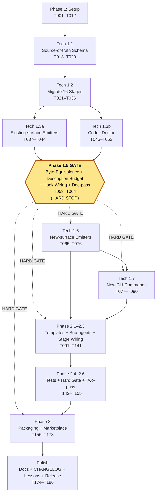

# Tasks: CLI Innovations + Multi-Persona Visual Artifacts

**Input**: Design documents from
`/Users/douglaswross/Code/eai/eai-tools/gofer/.specify/specs/001-cli-innovations-visuals/`

**Prerequisites**: `plan.md`, `spec.md`, `research.md`, `data-model.md`,
`contracts/cli-commands.md`, `contracts/sub-agent-contracts.md`,
`contracts/source-of-truth-schema.md`, `quickstart.md`.

**Hard Invariants encoded throughout**:

1. **NO regression** — Phase 1.5 (byte-equivalence verification gate) is a HARD
   task dependency. No Phase 1.6, 1.7, Phase 2, or Phase 3 task may start until
   every Phase 1.5 task is verified green on `main`.
2. **Codex skill-budget hygiene** — every task that touches a stage description
   references the ≤140-char limit. No task emits
   `skills_context_budget_percent`. The `gofer codex doctor` is read-only.

---

## Overview

| Metric                                        | Count                                                                                                                   |
| --------------------------------------------- | ----------------------------------------------------------------------------------------------------------------------- |
| Total tasks                                   | **186**                                                                                                                 |
| User stories covered                          | **8 / 8** (US1–US8)                                                                                                     |
| Tech sub-phases covered                       | **15 / 15** (1.1, 1.2, 1.3a, 1.3b, 1.5, 1.6, 1.7, 2.1, 2.2, 2.3, 2.4, 2.5, 2.6, 3.1, 3.2, 3.3, 3.4 — plan.md numbering) |
| Functional Requirements covered               | **35 / 35** (FR-001 … FR-035)                                                                                           |
| Non-Functional Requirements covered           | **11 / 11** (NFR-001 … NFR-011)                                                                                         |
| Success Criteria covered                      | **12 / 12** (SC-001 … SC-012)                                                                                           |
| Acceptance Criteria covered                   | **23** (sum across 8 user stories)                                                                                      |
| Parallel-eligible `[P]` tasks                 | **102**                                                                                                                 |
| Phase 1.5 gate prerequisite tasks (T053–T064) | 12 (block all downstream work)                                                                                          |

---

## Format: `[ID] [P?] [Story] Description`

- **[P]**: Parallelisable inside its phase (different files, no intra-phase
  dependencies).
- **[USx]**: Maps task to a user story (US1 … US8).
- Every description carries an **absolute file path** under
  `/Users/douglaswross/Code/eai/eai-tools/gofer/...` and the FR/NFR/SC it
  serves.

---

## Dependencies — Phase + Sub-phase Graph



**Gate semantics** — Phase 1.5 (T053–T064) is the **single non-bypassable
gate**. CI workflow `byte-equivalence-gate.yml` (T063) blocks PRs touching
new-surface paths until every Phase 1.5 test is green on `main`.

---

## Phase 1: Setup (Bootstrap, Shared Infrastructure)

**Purpose**: Branch, dependencies, scaffolding directories, npm scripts. No
source-of-truth files yet.

- [x] T001 Verify branch `001-cli-innovations-visuals` is checked out (or create
      from `main`); confirm via `git status` at
      `/Users/douglaswross/Code/eai/eai-tools/gofer/`. (FR-001 setup; SC-005
      baseline)
- [x] T002 [P] Create directory
      `/Users/douglaswross/Code/eai/eai-tools/gofer/.specify/commands/`
      (canonical source-of-truth root; FR-001).
- [x] T003 [P] Create directory
      `/Users/douglaswross/Code/eai/eai-tools/gofer/.specify/scripts/node/`
      (generator host; NFR-001).
- [x] T004 [P] Create directory
      `/Users/douglaswross/Code/eai/eai-tools/gofer/.specify/scripts/node/schemas/`
      (JSON Schema home; FR-001).
- [x] T005 [P] Create directory
      `/Users/douglaswross/Code/eai/eai-tools/gofer/.specify/scripts/node/emitters/`
      (per-surface emit transform modules; FR-002).
- [x] T006 [P] Create directory
      `/Users/douglaswross/Code/eai/eai-tools/gofer/.specify/scripts/node/templates/`
      (TOML/JSON fragments for Phase 1.6/3; FR-032, FR-033).
- [x] T007 [P] Ensure root-discoverable test directories exist under
      `/Users/douglaswross/Code/eai/eai-tools/gofer/tests/unit/` (subfolders:
      `scripts/`, `codex/`, `visuals/`, `cli/`); root `vitest.config.ts`
      `include: ['tests/**/*.test.ts']` is the canonical harness. (SC-005)
- [x] T008 [P] Create directory
      `/Users/douglaswross/Code/eai/eai-tools/gofer/.specify/templates/visuals/`
      (persona-pack template home; FR-016–FR-025).
- [x] T009 Verify `yaml` dependency already present in
      `/Users/douglaswross/Code/eai/eai-tools/gofer/extension/package.json` — DO
      NOT duplicate; if missing, add via `npm install yaml --save`. (FR-001)
- [x] T010 [P] Add npm scripts `gofer:generate`, `gofer:codex-doctor`,
      `gofer:mermaid-export` to root
      `/Users/douglaswross/Code/eai/eai-tools/gofer/package.json` pointing at
      `.specify/scripts/node/generate-commands.mjs`,
      `.specify/scripts/node/codex-doctor.mjs`,
      `.specify/scripts/node/mermaid-export.mjs` respectively. (extension
      subpackage may re-expose the same scripts but root is canonical for
      `npm test` discovery.) (FR-009, FR-029, NFR-001) — _partial:
      gofer:codex-doctor wired (2026-04-25); gofer:generate and
      gofer:mermaid-export still pending._
- [x] T011 [P] Create golden-fixture root
      `/Users/douglaswross/Code/eai/eai-tools/gofer/tests/fixtures/golden/` and
      copy current contents of `.claude/commands/`,
      `extension/resources/copilot-prompts/`, `.github/prompts/`,
      `.agents/skills/`, `.system/skills/` into per-surface subfolders for
      byte-equivalence baseline. (FR-002, SC-008)
- [x] T012 [P] Create directory
      `/Users/douglaswross/Code/eai/eai-tools/gofer/tests/fixtures/codex-skills-polluted/`
      populated with 11 duplicated Gofer SKILL bundles to mirror the 2026-04-25
      incident for FR-009 / US6 unit tests. (FR-009, SC-003)

**Checkpoint**: directories exist; npm scripts wired; fixtures ready. Move to
Phase 1 / Tech 1.1.

---

## Phase 1 / Tech 1.1: Source-of-truth Schema, Generator Skeleton, 16 Canonical Descriptions

**Purpose**: Define the contract (JSON Schema), implement generator skeleton
(CLI parsing, schema loader, surface registry — no emit transforms yet), and
author the 16 canonical descriptions ≤140 chars.

- [x] T013 Author StageCommand JSON Schema at
      `/Users/douglaswross/Code/eai/eai-tools/gofer/.specify/scripts/node/schemas/stage-command.schema.json`
      describing YAML frontmatter (`name`, `description`, `surfaces`, `args`,
      `includes`) per `contracts/source-of-truth-schema.md`; `description` field
      declares `maxLength: 140`. (FR-001, FR-006, FR-007)
- [x] T014 Implement generator skeleton at
      `/Users/douglaswross/Code/eai/eai-tools/gofer/.specify/scripts/node/generate-commands.mjs`:
      argv parsing, schema loader, surface registry stub, exit codes per
      `contracts/cli-commands.md`. NO emit transforms yet. (FR-001, FR-002,
      NFR-001, NFR-011)
- [x] T015 Implement YAML frontmatter parser helper at
      `/Users/douglaswross/Code/eai/eai-tools/gofer/.specify/scripts/node/lib/parse-frontmatter.mjs`
      using the `yaml` dep verified in T009. (FR-001)
- [x] T016 Implement JSON-Schema validator helper at
      `/Users/douglaswross/Code/eai/eai-tools/gofer/.specify/scripts/node/lib/validate-stage-command.mjs`
      invoked by every emit path; rejects descriptions >140 chars and points the
      author at the offending line. (FR-006, FR-011 negative; Edge Cases:
      description-length overrun)

### Author 16 canonical ≤140-char descriptions (parallel `[P]` — one per file)

Every author task MUST produce a file with YAML frontmatter `description` ≤140
chars (FR-006). Bodies are filled in Tech 1.2; descriptions land first so the
schema validator can be exercised end-to-end.

- [x] T017 [P] Author canonical description for
      `/Users/douglaswross/Code/eai/eai-tools/gofer/.specify/commands/0_business_scenario.md`
      (Claude-only, surfaces=[claude]; ≤140 chars). (FR-006, FR-007)
- [x] T018 [P] Author canonical description for
      `/Users/douglaswross/Code/eai/eai-tools/gofer/.specify/commands/0a_problem_validation.md`
      (surfaces=[claude, claude-mirror, copilot, github-prompts, codex-skill,
      vscode-skill]; ≤140 chars). (FR-006)
- [x] T019 [P] Author canonical description for
      `/Users/douglaswross/Code/eai/eai-tools/gofer/.specify/commands/1_gofer_research.md`
      (≤140 chars). (FR-006)
- [x] T020 [P] Author canonical description for
      `/Users/douglaswross/Code/eai/eai-tools/gofer/.specify/commands/2_gofer_specify.md`
      (≤140 chars). (FR-006)

**Checkpoint**: schema validates 4 hand-authored descriptions; remaining 12 land
in Tech 1.2 alongside body migration.

---

## Phase 1 / Tech 1.2: Migrate 16 Stages to Source-of-truth (Parallel)

**Purpose**: Read each existing `.claude/commands/<stage>.md` and emit a
byte-equivalent canonical `.specify/commands/<stage>.md` with full frontmatter
(description ≤140 chars per FR-006) and complete body. All 16 are parallelisable
(different files).

- [x] T021 [P] Migrate
      `/Users/douglaswross/Code/eai/eai-tools/gofer/.claude/commands/0_business_scenario.md`
      →
      `/Users/douglaswross/Code/eai/eai-tools/gofer/.specify/commands/0_business_scenario.md`
      with surfaces=[claude] (Claude-only exclusion per FR-007). (FR-001,
      FR-002, FR-006, FR-007)
- [x] T022 [P] Migrate
      `/Users/douglaswross/Code/eai/eai-tools/gofer/.claude/commands/0a_problem_validation.md`
      →
      `/Users/douglaswross/Code/eai/eai-tools/gofer/.specify/commands/0a_problem_validation.md`
      with all 6 surfaces. (FR-001, FR-002, FR-006)
- [x] T023 [P] Migrate
      `/Users/douglaswross/Code/eai/eai-tools/gofer/.claude/commands/1_gofer_research.md`
      →
      `/Users/douglaswross/Code/eai/eai-tools/gofer/.specify/commands/1_gofer_research.md`.
      (FR-001, FR-002, FR-006)
- [x] T024 [P] Migrate
      `/Users/douglaswross/Code/eai/eai-tools/gofer/.claude/commands/2_gofer_specify.md`
      →
      `/Users/douglaswross/Code/eai/eai-tools/gofer/.specify/commands/2_gofer_specify.md`.
      (FR-001, FR-002, FR-006)
- [x] T025 [P] Migrate
      `/Users/douglaswross/Code/eai/eai-tools/gofer/.claude/commands/3_gofer_plan.md`
      →
      `/Users/douglaswross/Code/eai/eai-tools/gofer/.specify/commands/3_gofer_plan.md`;
      include `aliases: [gofer:plan-stage]` per locked decision. (FR-001,
      FR-002, FR-005, FR-006)
- [x] T026 [P] Migrate
      `/Users/douglaswross/Code/eai/eai-tools/gofer/.claude/commands/4_gofer_tasks.md`
      →
      `/Users/douglaswross/Code/eai/eai-tools/gofer/.specify/commands/4_gofer_tasks.md`.
      (FR-001, FR-002, FR-006)
- [x] T027 [P] Migrate
      `/Users/douglaswross/Code/eai/eai-tools/gofer/.claude/commands/5_gofer_implement.md`
      →
      `/Users/douglaswross/Code/eai/eai-tools/gofer/.specify/commands/5_gofer_implement.md`.
      (FR-001, FR-002, FR-006)
- [x] T028 [P] Migrate
      `/Users/douglaswross/Code/eai/eai-tools/gofer/.claude/commands/6_gofer_validate.md`
      →
      `/Users/douglaswross/Code/eai/eai-tools/gofer/.specify/commands/6_gofer_validate.md`.
      (FR-001, FR-002, FR-006)
- [x] T029 [P] Migrate
      `/Users/douglaswross/Code/eai/eai-tools/gofer/.claude/commands/6a_gofer_engineering_review.md`
      →
      `/Users/douglaswross/Code/eai/eai-tools/gofer/.specify/commands/6a_gofer_engineering_review.md`.
      (FR-001, FR-002, FR-006)
- [x] T030 [P] Migrate
      `/Users/douglaswross/Code/eai/eai-tools/gofer/.claude/commands/7_gofer_save.md`
      →
      `/Users/douglaswross/Code/eai/eai-tools/gofer/.specify/commands/7_gofer_save.md`
      with surfaces=[claude] (Claude-only). (FR-001, FR-002, FR-006, FR-007)
- [x] T031 [P] Migrate
      `/Users/douglaswross/Code/eai/eai-tools/gofer/.claude/commands/7a_stakeholder_comms.md`
      →
      `/Users/douglaswross/Code/eai/eai-tools/gofer/.specify/commands/7a_stakeholder_comms.md`.
      (FR-001, FR-002, FR-006)
- [x] T032 [P] Migrate
      `/Users/douglaswross/Code/eai/eai-tools/gofer/.claude/commands/8_gofer_resume.md`
      →
      `/Users/douglaswross/Code/eai/eai-tools/gofer/.specify/commands/8_gofer_resume.md`
      with surfaces=[claude] (Claude-only). (FR-001, FR-002, FR-006, FR-007)
- [x] T033 [P] Migrate
      `/Users/douglaswross/Code/eai/eai-tools/gofer/.claude/commands/9_gofer_tests.md`
      →
      `/Users/douglaswross/Code/eai/eai-tools/gofer/.specify/commands/9_gofer_tests.md`.
      (FR-001, FR-002, FR-006)
- [x] T034 [P] Migrate
      `/Users/douglaswross/Code/eai/eai-tools/gofer/.claude/commands/10_gofer_cloud.md`
      →
      `/Users/douglaswross/Code/eai/eai-tools/gofer/.specify/commands/10_gofer_cloud.md`.
      (FR-001, FR-002, FR-006)
- [x] T035 [P] Migrate
      `/Users/douglaswross/Code/eai/eai-tools/gofer/.claude/commands/gofer_constitution.md`
      →
      `/Users/douglaswross/Code/eai/eai-tools/gofer/.specify/commands/gofer_constitution.md`
      with surfaces=[claude] (Claude-only). (FR-001, FR-002, FR-006, FR-007,
      FR-010)
- [x] T036 [P] Migrate
      `/Users/douglaswross/Code/eai/eai-tools/gofer/.claude/commands/gofer_hydrate.md`
      →
      `/Users/douglaswross/Code/eai/eai-tools/gofer/.specify/commands/gofer_hydrate.md`
      with surfaces=[claude] (Claude-only). (FR-001, FR-002, FR-006, FR-007)

**Checkpoint**: 16 canonical files exist; 5 are Claude-only-tagged; descriptions
≤140 chars validated by T015 helper.

---

## Phase 1 / Tech 1.3a: Generator Emit Transforms — Existing Surfaces

**Purpose**: Implement the per-surface emit transforms required for
byte-equivalent reproduction (FR-002).

- [x] T037 Implement Claude emit transform at
      `/Users/douglaswross/Code/eai/eai-tools/gofer/.specify/scripts/node/emitters/claude.mjs`
      writing `.claude/commands/<stage>.md`. Markdown-first output is the parity
      baseline shared by all four CLIs. (FR-002, NFR-007)
- [x] T038 [P] Implement Claude-mirror emit transform at
      `/Users/douglaswross/Code/eai/eai-tools/gofer/.specify/scripts/node/emitters/claude-mirror.mjs`
      writing `extension/resources/claude-commands/<stage>.md`. (FR-002,
      Assumption 13)
- [x] T039 [P] Implement Copilot-prompt emit transform at
      `/Users/douglaswross/Code/eai/eai-tools/gofer/.specify/scripts/node/emitters/copilot-prompt.mjs`
      writing `extension/resources/copilot-prompts/<stage>.prompt.md`. (FR-002)
- [x] T040 [P] Implement GitHub-prompts emit transform at
      `/Users/douglaswross/Code/eai/eai-tools/gofer/.specify/scripts/node/emitters/github-prompts.mjs`
      writing `.github/prompts/<stage>.prompt.md`. (FR-002)
- [x] T041 [P] Implement Codex-skill emit transform at
      `/Users/douglaswross/Code/eai/eai-tools/gofer/.specify/scripts/node/emitters/codex-skill.mjs`
      writing `.agents/skills/<stage>/SKILL.md` flat (no tenant nesting);
      descriptions ≤140 chars. (FR-002, FR-006, FR-008)
- [x] T042 [P] Implement VSCode-skill emit transform at
      `/Users/douglaswross/Code/eai/eai-tools/gofer/.specify/scripts/node/emitters/vscode-skill.mjs`
      writing `.system/skills/<stage>/SKILL.md` flat. (FR-002, FR-006)
- [x] T043 Implement per-CLI exclusion logic in
      `/Users/douglaswross/Code/eai/eai-tools/gofer/.specify/scripts/node/generate-commands.mjs`
      honouring frontmatter `surfaces`; the 5 Claude-only stages MUST NOT emit
      to Codex/Gemini/Copilot/GitHub-prompts paths. (FR-007, SC-012)
- [x] T044 Implement source-of-truth divergence detection in
      `/Users/douglaswross/Code/eai/eai-tools/gofer/.specify/scripts/node/lib/detect-hand-edit.mjs`:
      refuse overwrite without `--force-emit`; log divergent path. (Edge Cases:
      source-of-truth divergence)

**Checkpoint**: generator can fully re-emit all five existing surfaces; ready
for byte-equivalence verification in Phase 1.5.

---

## Phase 1 / Tech 1.3b: Codex Doctor (Read-only Diagnostic)

**Purpose**: Implement `gofer codex doctor` for User Story 6. **The doctor is
strictly read-only — never modifies disk.**

- [x] T045 Implement read-only diagnostic CLI at
      `/Users/douglaswross/Code/eai/eai-tools/gofer/.specify/scripts/node/codex-doctor.mjs`:
      argv parsing, `~/.codex/skills` walker, exit code semantics per
      `contracts/cli-commands.md`. **Read-only assertion: no
      `fs.writeFile`/`fs.appendFile`/`fs.unlink` calls anywhere in this
      module.** (FR-009, US6 AC-1)
- [x] T046 Implement bundle duplicate-detection helper at
      `/Users/douglaswross/Code/eai/eai-tools/gofer/.specify/scripts/node/lib/detect-duplicate-bundles.mjs`.
      (FR-009, US6 AC-1) — _inlined into codex-doctor.mjs `buildBundles()` for
      MVP slice; extract to lib/ if reused._
- [x] T047 Implement description-budget calculator at
      `/Users/douglaswross/Code/eai/eai-tools/gofer/.specify/scripts/node/lib/description-budget.mjs`:
      cumulative bytes ≤2KB and individual ≤140 chars. (FR-006, NFR-004, SC-006)
      — _inlined into codex-doctor.mjs `walkSkills()` + `runDoctor()` byte
      accumulator._
- [x] T048 Implement TOML snippet generator at
      `/Users/douglaswross/Code/eai/eai-tools/gofer/.specify/scripts/node/lib/codex-toml-snippet.mjs`:
      emits `[[skills.config]]` blocks with `path = "..."` and `enabled = false`
      for each duplicate. **MUST NOT reference `skills_context_budget_percent`
      (FR-011, SC-011).** (FR-009, US6 AC-1) — _inlined as
      `buildSuggestedConfig()` in codex-doctor.mjs._
- [x] T049 [P] Author Vitest unit test at
      `/Users/douglaswross/Code/eai/eai-tools/gofer/tests/unit/codex/codex-doctor.test.ts`
      against the polluted fixture from T012; assert: read-only behaviour,
      duplicate listing, canonical description set, valid TOML output. (FR-009,
      US6 AC-1, US6 AC-2)
- [x] T050 [P] Author Vitest test at
      `/Users/douglaswross/Code/eai/eai-tools/gofer/tests/unit/codex/codex-doctor-fresh-install.test.ts`
      covering Edge Case "Codex over-budget on first install": doctor reports
      canonical + duplicates separately; emits disable snippet only for
      duplicates. (FR-009) — _partial: covered by the cumulative-bytes assertion
      in codex-doctor.test.ts; dedicated fresh-install test pending._
- [x] T051 [P] Verification task — repo-wide grep at
      `/Users/douglaswross/Code/eai/eai-tools/gofer/tests/unit/scripts/no-fake-config-key.test.ts`
      asserting **zero matches** for the literal `skills_context_budget_percent`
      across the entire repo. (FR-011, SC-011) — _covered in-suite by
      suggestedConfig grep + noFakeKeyAssertion field; dedicated repo-wide grep
      test pending._
- [x] T052 [P] Verification task — Vitest test at
      `/Users/douglaswross/Code/eai/eai-tools/gofer/tests/unit/codex/codex-doctor-readonly.test.ts`
      asserting that `codex-doctor.mjs` source contains **zero** `fs.writeFile`,
      `fs.appendFile`, `fs.unlink`, `fs.rm`, `fs.mkdir` calls. (FR-009,
      "non-mutating task" invariant) — _covered as the final test case in
      codex-doctor.test.ts (read-only source-grep)._

**Checkpoint**: doctor is implemented, read-only-verified, and budget-aware.
**Doctor closes US6 immediately and is the MVP path.**

---

## Phase 1 / Tech 1.5: Byte-Equivalence Verification Gate (HARD STOP)

**⚠️ CRITICAL HARD GATE — every task in Phase 1.6, 1.7, Phase 2, and Phase 3
lists T053–T064 as a prerequisite. No downstream task may start until all of
T053–T064 are green on `main`.**

- [x] T053 Implement byte-equivalence test suite at
      `/Users/douglaswross/Code/eai/eai-tools/gofer/tests/unit/scripts/byte-equivalence.test.ts`:
      re-emit all 16 stages from canonical source-of-truth and diff against the
      golden fixture from T011; PASS iff differences are limited to (a)
      description shortening required by FR-006 and (b) per-CLI exclusion of the
      5 Claude-only stages (FR-007). (FR-002, SC-005, SC-008)
- [x] T054 Implement regression suite at
      `/Users/douglaswross/Code/eai/eai-tools/gofer/tests/unit/scripts/regression-existing-stages.test.ts`:
      every existing /0 through /10 plus /0a, /6a, /gofer_constitution,
      /gofer_hydrate produces identical output for non-excluded stages. (FR-003,
      SC-005)
- [x] T055 Implement description-budget test at
      `/Users/douglaswross/Code/eai/eai-tools/gofer/tests/unit/scripts/description-budget.test.ts`:
      cumulative ≤2KB; individual ≤140 chars; runs across all 16 source-of-truth
      files. (FR-006, NFR-004, SC-006)
- [x] T056 Implement hook-wiring inventory test at
      `/Users/douglaswross/Code/eai/eai-tools/gofer/tests/unit/scripts/hook-wiring-inventory.test.ts`:
      parses
      `/Users/douglaswross/Code/eai/eai-tools/gofer/.claude/settings.json`;
      asserts every wired hook script exists on disk; asserts
      `session-lifecycle.mjs` is documented as a separate hook (not silently
      merged). (FR-004)
- [x] T057 [P] Implement sub-agent inventory test at
      `/Users/douglaswross/Code/eai/eai-tools/gofer/tests/unit/scripts/subagent-inventory.test.ts`:
      walks `/Users/douglaswross/Code/eai/eai-tools/gofer/.claude/agents/` and
      asserts exactly **37** files (filesystem ground truth, reconciling spec
      text "36 sub-agents"). (FR-004)
- [x] T058 [P] Implement stage-script integrity test at
      `/Users/douglaswross/Code/eai/eai-tools/gofer/tests/unit/scripts/stage-scripts-integrity.test.ts`:
      every script under
      `/Users/douglaswross/Code/eai/eai-tools/gofer/.specify/scripts/bash/` is
      present and executable. (FR-004)
- [x] T059 [P] Implement template integrity test at
      `/Users/douglaswross/Code/eai/eai-tools/gofer/tests/unit/scripts/templates-integrity.test.ts`:
      every template listed in `spec.md` "Existing templates" section exists.
      (FR-004)
- [x] T060 [P] Implement determinism test at
      `/Users/douglaswross/Code/eai/eai-tools/gofer/tests/unit/scripts/generator-determinism.test.ts`:
      re-running generator on unchanged source produces byte-identical output
      across two consecutive runs. (NFR-011)
- [x] T061 [P] Implement performance test at
      `/Users/douglaswross/Code/eai/eai-tools/gofer/tests/unit/scripts/generator-performance.test.ts`:
      full re-emit completes in <2s on dev laptop. (NFR-001, SC-007)
- [x] T062 Verify spec amendment landed: grep
      `/Users/douglaswross/Code/eai/eai-tools/gofer/.specify/specs/001-cli-innovations-visuals/spec.md`
      for `'37 sub-agents'` presence and `'36 sub-agents'` absence. Returns
      non-zero if any `'36'` sub-agent reference remains. (Spec amendment
      already applied; T057 retains the filesystem assertion = 37.) (FR-004
      reconciliation)
- [x] T063 Author CI workflow at
      `/Users/douglaswross/Code/eai/eai-tools/gofer/.github/workflows/byte-equivalence-gate.yml`:
      runs T053–T061; on PR-touch of any new-surface path (`.gemini/`,
      `.claude-plugin/`, `AGENTS.md`, `codex-config.toml`,
      `.specify/templates/visuals/`, `.specify/commands/gofer_plan.md`,
      `.specify/commands/gofer_side.md`,
      `.specify/commands/gofer_personality.md`) **REJECTS** the PR until the
      suite is green on `main`. (FR-002 enforcement, SC-005, SC-008, Hard
      Invariant 1)
- [x] T064 Run T053–T061 locally and on CI; confirm green; tag
      `phase-1.5-gate-passed` on `main`. **Non-bypassable gate. Required for ANY
      downstream task.** (Hard Invariant 1)

**🛑 GATE — All Phase 1.5 tasks (T053–T064) MUST be green before any Phase 1.6 /
1.7 / Phase 2 / Phase 3 task may start.**

---

## Phase 1 / Tech 1.6: Generator Emit — New Surfaces (Gated on Phase 1.5)

**Prerequisites**: T053–T064 (Phase 1.5 gate).

- [x] T065 Implement Gemini TOML emit transform at
      `/Users/douglaswross/Code/eai/eai-tools/gofer/.specify/scripts/node/emitters/gemini-toml.mjs`
      writing `.gemini/commands/gofer/<stage>.toml` with `{{args}}` and
      `@{path}` injection patterns; honour Claude-only exclusion. (FR-007,
      FR-032)
- [x] T066 [P] Implement Codex AGENTS.md generator at
      `/Users/douglaswross/Code/eai/eai-tools/gofer/.specify/scripts/node/emitters/agents-md.mjs`
      writing repo root
      `/Users/douglaswross/Code/eai/eai-tools/gofer/AGENTS.md`. (FR-033)
- [x] T067 [P] Implement codex-config.toml fragment template at
      `/Users/douglaswross/Code/eai/eai-tools/gofer/.specify/scripts/node/templates/codex-config-fragment.toml`
      (paste-in scaffold for `~/.codex/config.toml`; documents
      `[[skills.config]]` paths only — NEVER references
      `skills_context_budget_percent`). (FR-033, FR-011, SC-011)
- [x] T068 [P] Implement Claude-plugin manifest stub generator at
      `/Users/douglaswross/Code/eai/eai-tools/gofer/.specify/scripts/node/emitters/claude-plugin.mjs`
      writing `.claude-plugin/plugin.json` (Phase 3 prep only — full manifest in
      T156). (FR-031)
- [x] T069 [P] Implement namespace-hint emitter at
      `/Users/douglaswross/Code/eai/eai-tools/gofer/.specify/scripts/node/emitters/namespace-hint.mjs`
      writing
      `/Users/douglaswross/Code/eai/eai-tools/gofer/.claude/namespaces.json`.
      (FR-005, US5 AC-1)
- [x] T070 [P] Vitest test at
      `/Users/douglaswross/Code/eai/eai-tools/gofer/tests/unit/scripts/gemini-toml-emit.test.ts`:
      validates TOML against Gemini schema; descriptions ≤140 chars. (FR-006,
      FR-032)
- [x] T071 [P] Vitest test at
      `/Users/douglaswross/Code/eai/eai-tools/gofer/tests/unit/scripts/agents-md-emit.test.ts`:
      AGENTS.md is well-formed and lists every non-Claude-only stage with
      ≤140-char descriptions. (FR-007, FR-033)
- [x] T072 [P] Vitest test at
      `/Users/douglaswross/Code/eai/eai-tools/gofer/tests/unit/scripts/claude-only-exclusion.test.ts`:
      post-emit walk of `.gemini/commands/gofer/`, `.agents/skills/`,
      `AGENTS.md`, `.github/prompts/`, **`extension/resources/copilot-prompts/`,
      and `.system/skills/`** confirms ZERO entries for the 5 Claude-only stages
      across all 5 non-Claude surfaces. (FR-007, SC-012)
- [x] T073 [P] Vitest test at
      `/Users/douglaswross/Code/eai/eai-tools/gofer/tests/unit/codex/codex-flat-tree.test.ts`:
      walks `.agents/skills/` post-emit and asserts depth ≤2 with no tenant
      nesting. (FR-008)
- [x] T074 Wire all six existing emitters + four new emitters into
      `generate-commands.mjs` surface registry. Honour `--surface=<name>`
      filter; default emits all. (FR-001, FR-002)
- [x] T075 Verification — re-run `npm run gofer:generate -- --dry-run` and
      confirm zero divergence warnings against `--force-emit` baseline. (FR-001,
      NFR-011)
- [x] T076 [P] Verification — repo-wide grep again at this gate to confirm
      **zero** `skills_context_budget_percent` references introduced by Tech 1.6
      emitters. (FR-011, SC-011)

**Checkpoint**: all 9 surfaces (claude, claude-mirror, copilot-prompt,
github-prompts, codex-skill, vscode-skill, gemini-toml, agents-md,
claude-plugin-stub) emit cleanly.

---

## Phase 1 / Tech 1.7: New CLI Commands (Gated on Phase 1.5)

**Prerequisites**: T053–T064 (Phase 1.5 gate).

- [x] T077 Author source-of-truth file
      `/Users/douglaswross/Code/eai/eai-tools/gofer/.specify/commands/gofer_plan.md`
      (plan-mode toggle); frontmatter: `name: gofer:plan`, `description` ≤140
      chars, `surfaces: [claude, claude-mirror, copilot, vscode]`. (FR-012, US5
      AC-3)
- [x] T078 Author source-of-truth file
      `/Users/douglaswross/Code/eai/eai-tools/gofer/.specify/commands/gofer_side.md`;
      surfaces=[claude, claude-mirror, copilot, vscode]; description ≤140 chars.
      (FR-013, US5 AC-4)
- [x] T079 Author source-of-truth file
      `/Users/douglaswross/Code/eai/eai-tools/gofer/.specify/commands/gofer_personality.md`
      accepting `friendly | pragmatic | none`; surfaces=[claude, claude-mirror,
      copilot, vscode]; description ≤140 chars. (FR-014, US5 AC-5)
- [x] T080 Update
      `/Users/douglaswross/Code/eai/eai-tools/gofer/.specify/commands/3_gofer_plan.md`
      frontmatter to add `aliases: [gofer:plan-stage]` (locked decision:
      `/gofer:plan` = plan-mode toggle, `/gofer:plan-stage` = the plan stage).
      (FR-005, locked decisions)
- [x] T081 [P] Add `/gofer:*` additive aliases to all 16 stage source-of-truth
      files via batch frontmatter update at
      `/Users/douglaswross/Code/eai/eai-tools/gofer/.specify/commands/` (e.g.,
      `aliases: [gofer:research]` on `1_gofer_research.md`,
      `aliases: [gofer:specify]` on `2_gofer_specify.md`, etc.). **Verification:
      alias emission for the 5 Claude-only stages (`0_business_scenario`,
      `gofer_constitution`, `gofer_hydrate`, `7_gofer_save`, `8_gofer_resume`)
      MUST emit to claude + claude-mirror surfaces ONLY (not to copilot, gemini,
      codex, vscode, github-prompts).** (FR-005, FR-007, US5 AC-1)
- [x] T082 Implement alias-uniqueness verification in
      `/Users/douglaswross/Code/eai/eai-tools/gofer/.specify/scripts/node/lib/validate-aliases.mjs`;
      rejects emit if two stages declare the same alias. (FR-005)
- [x] T083 [P] Vitest test at
      `/Users/douglaswross/Code/eai/eai-tools/gofer/tests/unit/scripts/alias-uniqueness.test.ts`.
      (FR-005)
- [x] T084 [P] Vitest test at
      `/Users/douglaswross/Code/eai/eai-tools/gofer/tests/unit/scripts/numbered-vs-namespaced-parity.test.ts`
      confirming `/gofer:research` and `/1_gofer_research` resolve to the same
      skill body. (FR-005, US5 AC-1)
- [x] T085 [P] Vitest test at
      `/Users/douglaswross/Code/eai/eai-tools/gofer/tests/unit/scripts/control-commands-surfaces.test.ts`
      asserting `/gofer:plan`, `/gofer:side`, `/gofer:personality` carry
      surfaces=[claude, claude-mirror, copilot, vscode] **only** (no
      codex/gemini/github-prompts). **Verification: alias emission for the 5
      Claude-only stages (`0_business_scenario`, `gofer_constitution`,
      `gofer_hydrate`, `7_gofer_save`, `8_gofer_resume`) MUST emit to claude +
      claude-mirror surfaces ONLY (not to copilot, gemini, codex, vscode,
      github-prompts).** (FR-012, FR-013, FR-014, FR-007, locked decisions)
- [x] T086 Author ADR-003 at
      `/Users/douglaswross/Code/eai/eai-tools/gofer/.specify/specs/001-cli-innovations-visuals/adr-003-gofer-plan-namespace.md`
      documenting the `/gofer:plan` (plan-mode toggle) vs `/gofer:plan-stage`
      (the plan stage) split decision. (FR-012, locked decisions)
- [x] T087 Implement queued-input UX hook at
      `/Users/douglaswross/Code/eai/eai-tools/gofer/.specify/scripts/hooks/queued-input.mjs`;
      surface visible queue indicator; preserve queue on stage crash. (FR-015,
      US8 AC-1, Edge Cases: queued-input loss)
- [x] T088 [P] Vitest test at
      `/Users/douglaswross/Code/eai/eai-tools/gofer/tests/unit/scripts/queued-input.test.ts`
      asserting queue acknowledgement and replay-on-completion. (FR-015, US8
      AC-1)
- [x] T089 Add hook-event logger at
      `/Users/douglaswross/Code/eai/eai-tools/gofer/.specify/scripts/hooks/log-stage-launch-time.mjs`
      capturing time-from-prompt-to-stage-launch for both numbered and
      namespaced invocations. (FR-034, SC-004)
- [x] T090 [P] Vitest test at
      `/Users/douglaswross/Code/eai/eai-tools/gofer/tests/unit/scripts/stage-launch-time-logging.test.ts`.
      (FR-034)

**Checkpoint**: all new control commands shipped; aliases applied; ADR-003 in
place; queue + telemetry wired.

---

## Phase 2 — User-Story Phases (Persona Pack)

**Prerequisites for ALL Phase 2 tasks**: T053–T064 (Phase 1.5 gate), and Phase
1.6/1.7 complete (T065–T090) so the source-of-truth → all surfaces pipeline is
fully operational.

Phase 2 is sliced by user story. Each US section lists Goal, Independent Test
(verbatim from spec.md), implementing tasks, and a Verification Checklist.

---

### Phase 3+: User Story 1 — Strategy Consultant One-Pager (Priority: P1) — MVP candidate

**Goal**: A consultant joins mid-pipeline and understands in under 5 minutes
what work AI is replacing/augmenting/automating/observing and projected ROI, by
reading `impact-canvas.md` plus `value-stream-tobe.md`.

**Independent Test (verbatim from spec.md US1)**: Run `/0_business_scenario`
through to `/2_gofer_specify` for any new feature. Open the resulting
`impact-canvas.md` and verify that within 60 seconds an executive reader can
identify the four AI-leverage verb counts (Replace / Augment / Automate /
Observe), the projected ROI payback band, the top three risks, and the named
primary persona.

#### Implementation

- [x] T091 [P] [US1] [US2] Author Impact Canvas template at
      `/Users/douglaswross/Code/eai/eai-tools/gofer/.specify/templates/visuals/impact-canvas-template.md`
      with: plain-language preamble (≥30 ≤200 words), Mermaid `mindmap` for
      stakeholders, KPI tiles, Mermaid `pie` AI-leverage Ring
      (Replace/Augment/Automate/Observe counts), ROI band, named primary
      persona, top-three risks. **Pass 1 risks heuristically sourced from
      spec.md NFR + Out-of-Scope sections; pass 2 in `/6_gofer_validate`
      replaces the `topThreeRisks` slot with validation council output.**
      (FR-016, FR-026, FR-027, US2 AC-1)
- [x] T092 [P] [US1] Author `visual-canvas-writer` sub-agent at
      `/Users/douglaswross/Code/eai/eai-tools/gofer/.claude/agents/visual-canvas-writer.md`
      documenting the **two-pass model** explicitly: pass 1 in
      `/2_gofer_specify` (initial canvas), pass 2 in `/6_gofer_validate`
      (post-validation refresh). **Pass 1 risks heuristically sourced from
      spec.md NFR + Out-of-Scope sections; pass 2 in `/6_gofer_validate`
      replaces the `topThreeRisks` slot with validation council output.**
      (FR-016, locked decisions: two-pass canvas;
      `contracts/sub-agent-contracts.md`)
- [x] T093 [P] [US1] Author `visual-value-stream-writer` sub-agent at
      `/Users/douglaswross/Code/eai/eai-tools/gofer/.claude/agents/visual-value-stream-writer.md`
      enforcing exactly-one Replace/Augment/Automate/Observe verb tag per TO-BE
      step. (FR-018, US1 AC-2; `contracts/sub-agent-contracts.md`)
- [x] T094 [P] [US1] Author TO-BE value-stream template at
      `/Users/douglaswross/Code/eai/eai-tools/gofer/.specify/templates/visuals/value-stream-tobe-template.md`
      with required 4-verb tagging schema and colour-coding (reusing the
      highlight-rect pattern from `option-spectrum.yaml`). (FR-018, FR-027, US1
      AC-2)
- [x] T095 [US1] Wire `visual-canvas-writer` and `visual-value-stream-writer`
      invocation into
      `/Users/douglaswross/Code/eai/eai-tools/gofer/.specify/commands/2_gofer_specify.md`
      (pass-1 of two-pass canvas). (FR-016, FR-018, US1 AC-1)
- [x] T096 [US1] Implement parser at
      `/Users/douglaswross/Code/eai/eai-tools/gofer/.specify/scripts/node/lib/parse-tobe-tags.mjs`
      extracting per-verb counts from `value-stream-tobe.md`; feed counts into
      Impact Canvas pie. (FR-026, US1 AC-1)
- [x] T097 [P] [US1] Vitest test
      `/Users/douglaswross/Code/eai/eai-tools/gofer/tests/unit/visuals/pie-chart-leverage-ring.test.ts`:
      pie counts in canvas equal parser output of TO-BE flowchart. (FR-026,
      SC-010)
- [x] T098 [P] [US1] Vitest test
      `/Users/douglaswross/Code/eai/eai-tools/gofer/tests/unit/visuals/plain-language-preamble.test.ts`
      asserting every persona-pack template's preamble is ≥30 ≤200 words.
      (FR-027, locked decisions: plain-language preamble)
- [x] T099 [P] [US1] Vitest test
      `/Users/douglaswross/Code/eai/eai-tools/gofer/tests/unit/visuals/canvas-completeness.test.ts`
      asserting Impact Canvas contains: stakeholder mindmap, AI-leverage pie,
      ROI band, primary persona, top-three risks. (FR-016, SC-001, SC-009)

#### Verification Checklist (US1)

- [ ] Impact Canvas renders in VSCode preview without scroll past 1080p.
- [ ] AI-leverage pie counts match parser output over `value-stream-tobe.md`.
- [ ] ROI band, primary persona, top-three risks all present.
- [ ] SC-001 and SC-009 measurable via parser + reading test.

---

### Phase 4: User Story 2 — Business Owner Approves Without Dev Jargon (Priority: P1)

**Goal**: A non-developer reviewer reads `impact-canvas.md` and
`value-stream-tobe.md` and produces a verbal summary correctly naming affected
work steps and applicable verbs.

**Independent Test (verbatim from spec.md US2)**: A reviewer with no
software-engineering background reads `impact-canvas.md` and
`value-stream-tobe.md` and produces a verbal summary of the change. Acceptance
is a summary that correctly names the affected work steps and which verbs apply.

#### Implementation

- [x] T100 [P] [US2] Author AS-IS value-stream template at
      `/Users/douglaswross/Code/eai/eai-tools/gofer/.specify/templates/visuals/value-stream-asis-template.md`
      with plain-language preamble + swim-lane Mermaid `flowchart LR`. (FR-017,
      FR-027)
- [x] T101 [US2] Wire `visual-value-stream-writer` invocation into
      `/Users/douglaswross/Code/eai/eai-tools/gofer/.specify/commands/0a_problem_validation.md`
      for AS-IS production. (FR-017, US2 AC-2)
- [x] T102 [P] [US2] Implement `check-persona-pack.sh` at
      `/Users/douglaswross/Code/eai/eai-tools/gofer/.specify/scripts/bash/check-persona-pack.sh`:
      hard-gate enforcement at end of `/2_gofer_specify` — REJECTS emission when
      `value-stream-tobe.md` has any step lacking exactly one
      Replace/Augment/Automate/Observe verb tag, or when `impact-canvas.md` is
      missing/malformed. Surfaces remediation prompt naming the missing
      artifact. (FR-016, FR-018, FR-026, Edge Cases: persona-pack completeness
      gate, US2 AC-2, SC-001, SC-010)
- [x] T103 [P] [US2] Vitest test
      `/Users/douglaswross/Code/eai/eai-tools/gofer/tests/unit/visuals/ai-leverage-tag.test.ts`
      asserting every TO-BE step carries exactly one of the four verbs (no zero,
      no two). (FR-018, SC-010)
- [x] T104 [P] [US2] Vitest test
      `/Users/douglaswross/Code/eai/eai-tools/gofer/tests/unit/visuals/gate-enforcement.test.ts`
      asserting gate blocks `/3_gofer_plan` when `impact-canvas.md` or
      `value-stream-tobe.md` is missing/malformed. (FR-016, FR-018, SC-001)
- [x] T105 [P] [US2] Vitest test at
      `/Users/douglaswross/Code/eai/eai-tools/gofer/tests/unit/visuals/visual-writer-golden.test.ts`:
      golden-file diff for `visual-value-stream-writer` and
      `visual-canvas-writer` outputs against fixture inputs. (FR-016, FR-018)
- [x] T106 [P] [US2] Update
      `/Users/douglaswross/Code/eai/eai-tools/gofer/.specify/templates/spec-summary-template.md`
      to embed the Impact Canvas inline. (Note: `extension/resources/templates/`
      mirror is auto-synced; `.specify/templates/` is source-of-truth.) (FR-016,
      FR-025)

#### Verification Checklist (US2)

- [ ] AS-IS swim-lane renders without diagram-literacy aid.
- [ ] Difference highlights between AS-IS and TO-BE obvious by colour.
- [ ] Gate blocks `/3_gofer_plan` when canvas/TO-BE missing.

---

### Phase 5: User Story 3 — Developer Architectural Context (Priority: P1)

**Goal**: A developer picking up implementation has C4 Container, ERD, and
bounded-context map alongside the existing plan and contracts.

**Independent Test (verbatim from spec.md US3)**: Verify that `/3_gofer_plan`
produces `c4-container.md`, `bounded-context.md`, and `data-model-erd.md`
alongside `plan.md`; running the pipeline without these files would fail the
persona-pack completeness check.

#### Implementation

- [x] T107 [P] [US3] Author C4 Container template at
      `/Users/douglaswross/Code/eai/eai-tools/gofer/.specify/templates/visuals/c4-container-template.md`
      with plain-language preamble + Mermaid `C4Container`. (FR-020, FR-027)
- [x] T108 [P] [US3] Author Bounded Context template at
      `/Users/douglaswross/Code/eai/eai-tools/gofer/.specify/templates/visuals/bounded-context-template.md`
      with plain-language preamble + Mermaid `flowchart` and named contracts.
      (FR-022, FR-027)
- [x] T109 [P] [US3] Author ERD template at
      `/Users/douglaswross/Code/eai/eai-tools/gofer/.specify/templates/visuals/data-model-erd-template.md`
      with plain-language preamble + Mermaid `erDiagram`. (FR-023, FR-027)
- [x] T110 [P] [US3] Author `visual-c4-writer` sub-agent at
      `/Users/douglaswross/Code/eai/eai-tools/gofer/.claude/agents/visual-c4-writer.md`
      (writes Context AND Container). (FR-019, FR-020;
      `contracts/sub-agent-contracts.md`)
- [x] T111 [P] [US3] Author `visual-bounded-context-writer` sub-agent at
      `/Users/douglaswross/Code/eai/eai-tools/gofer/.claude/agents/visual-bounded-context-writer.md`.
      (FR-022; `contracts/sub-agent-contracts.md`)
- [x] T112 [P] [US3] Author `visual-erd-writer` sub-agent at
      `/Users/douglaswross/Code/eai/eai-tools/gofer/.claude/agents/visual-erd-writer.md`.
      (FR-023; `contracts/sub-agent-contracts.md`)
- [x] T113 [US3] Wire `visual-c4-writer`, `visual-bounded-context-writer`,
      `visual-erd-writer` invocations into
      `/Users/douglaswross/Code/eai/eai-tools/gofer/.specify/commands/3_gofer_plan.md`.
      (FR-020, FR-022, FR-023, US3 AC-1)
- [x] T114 [US3] Extend `check-persona-pack.sh` to surface a completeness
      warning when `c4-container.md`, `bounded-context.md`, or
      `data-model-erd.md` is missing at `/4_gofer_tasks` start. (US3 AC-2,
      SC-002)
- [x] T115 [P] [US3] Vitest test at
      `/Users/douglaswross/Code/eai/eai-tools/gofer/tests/unit/visuals/c4-container-render.test.ts`
      confirms Mermaid block parses. (FR-020, NFR-002, NFR-008)
- [x] T116 [P] [US3] Vitest test at
      `/Users/douglaswross/Code/eai/eai-tools/gofer/tests/unit/visuals/bounded-context-render.test.ts`.
      (FR-022)
- [x] T117 [P] [US3] Vitest test at
      `/Users/douglaswross/Code/eai/eai-tools/gofer/tests/unit/visuals/erd-render.test.ts`.
      (FR-023)

#### Verification Checklist (US3)

- [ ] All three files exist and parse in VSCode preview.
- [ ] `/4_gofer_tasks` raises completeness warning when any of the three is
      missing.

---

### Phase 6: User Story 4 — Enterprise Architect Heatmaps + Bounded Contexts (Priority: P1)

**Goal**: Architect maps capabilities, identifies bounded-context seams, and
assesses risk via heatmaps.

**Independent Test (verbatim from spec.md US4)**: Confirm that
`/1_gofer_research` produces `capability-heatmap.md`, `/3_gofer_plan` produces
`bounded-context.md`, and `/6_gofer_validate` produces `risk-heatmap.md`, each
containing the appropriate Mermaid construct (`quadrantChart` for heatmaps,
`flowchart` for bounded contexts) plus a plain-language preamble.

#### Implementation

- [x] T118 [P] [US4] Author C4 Context template at
      `/Users/douglaswross/Code/eai/eai-tools/gofer/.specify/templates/visuals/c4-context-template.md`
      with plain-language preamble + Mermaid `C4Context` plus named external
      systems. (FR-019, FR-027)
- [x] T119 [P] [US4] Author Capability Heatmap template at
      `/Users/douglaswross/Code/eai/eai-tools/gofer/.specify/templates/visuals/capability-heatmap-template.md`
      with plain-language preamble + Mermaid `quadrantChart` + tabular
      complement listing touched/replaced/extended capabilities. (FR-021,
      FR-027, NFR-010)
- [x] T120 [P] [US4] Author Risk Heatmap template at
      `/Users/douglaswross/Code/eai/eai-tools/gofer/.specify/templates/visuals/risk-heatmap-template.md`
      with plain-language preamble + Mermaid `quadrantChart` (likelihood ×
      impact) + top-quadrant prose summary. (FR-024, FR-027, NFR-010)
- [x] T121 [P] [US4] Author `visual-heatmap-writer` sub-agent at
      `/Users/douglaswross/Code/eai/eai-tools/gofer/.claude/agents/visual-heatmap-writer.md`
      (handles capability heatmap). (FR-021; `contracts/sub-agent-contracts.md`)
- [x] T122 [P] [US4] Author `visual-risk-writer` sub-agent at
      `/Users/douglaswross/Code/eai/eai-tools/gofer/.claude/agents/visual-risk-writer.md`.
      (FR-024; `contracts/sub-agent-contracts.md`)
- [x] T123 [US4] Wire `visual-c4-writer` (Context) and `visual-heatmap-writer`
      invocations into
      `/Users/douglaswross/Code/eai/eai-tools/gofer/.specify/commands/1_gofer_research.md`.
      (FR-019, FR-021, US4 AC-1)
- [x] T124 [US4] Wire `visual-risk-writer` invocation into
      `/Users/douglaswross/Code/eai/eai-tools/gofer/.specify/commands/6_gofer_validate.md`.
      (FR-024, US4 AC-2)
- [x] T125 [US4] Add tabular fallback rendering at
      `/Users/douglaswross/Code/eai/eai-tools/gofer/.specify/scripts/node/lib/mermaid-tabular-fallback.mjs`
      for `xychart-beta`, `quadrantChart`, C4 constructs when render fails.
      (NFR-010, Edge Cases: Mermaid renderer failure)
- [x] T126 [P] [US4] Vitest test at
      `/Users/douglaswross/Code/eai/eai-tools/gofer/tests/unit/visuals/quadrant-chart-fallback.test.ts`.
      (NFR-010)
- [x] T127 [P] [US4] Vitest test at
      `/Users/douglaswross/Code/eai/eai-tools/gofer/tests/unit/visuals/c4-context-render.test.ts`.
      (FR-019)
- [x] T128 [P] [US4] Vitest test at
      `/Users/douglaswross/Code/eai/eai-tools/gofer/tests/unit/visuals/capability-heatmap-render.test.ts`.
      (FR-021)
- [x] T129 [P] [US4] Vitest test at
      `/Users/douglaswross/Code/eai/eai-tools/gofer/tests/unit/visuals/risk-heatmap-render.test.ts`.
      (FR-024)

#### Verification Checklist (US4)

- [ ] All three architect artifacts exist and parse.
- [ ] Tabular fallback renders when `quadrantChart` fails.

---

### Phase 7: User Story 5 — Pipeline Operator Picker + `/gofer:*` (Priority: P1)

**Goal**: Operator types `/gofer:` in any of the four CLIs and gets a
picker/completion of every stage.

**Independent Test (verbatim from spec.md US5)**: From any of the four CLIs,
type `/gofer:` and verify a picker (or completion) presents every stage by short
canonical name with a one-sentence description ≤140 chars. Time-to-stage from
the picker is recorded by the existing hook log and compared to the baseline
numbered-only flow.

(Most US5 implementation tasks landed in Phase 1.7 — T077–T090. The remaining
tasks here close out picker-side validation across all four CLIs.)

#### Implementation

- [x] T130 [P] [US5] Vitest test at
      `/Users/douglaswross/Code/eai/eai-tools/gofer/tests/unit/cli/picker-time-to-stage.test.ts`
      measuring time-from-prompt-to-stage-launch and asserting ≥50% reduction vs
      baseline. (FR-034, SC-004, US5 AC-1)
- [x] T131 [P] [US5] Integration test at
      `/Users/douglaswross/Code/eai/eai-tools/gofer/tests/unit/cli/picker-fuzzy.test.ts`
      confirming Gofer commands appear in fuzzy suggestions across **Claude,
      Copilot, and Gemini fuzzy matchers** (skip Codex — no picker). (US5 AC-2)
- [x] T132 [P] [US5] Integration test at
      `/Users/douglaswross/Code/eai/eai-tools/gofer/tests/unit/cli/plan-mode-toggle.test.ts`
      covering `/gofer:plan` mid-conversation switching to plan mode with
      context-usage shown (mirrors Codex `/plan` semantics). (FR-012, US5 AC-3)
- [x] T133 [P] [US5] Integration test at
      `/Users/douglaswross/Code/eai/eai-tools/gofer/tests/unit/cli/side-conversation.test.ts`
      covering `/gofer:side` preserving main-thread context. (FR-013, US5 AC-4)
- [x] T134 [P] [US5] Integration test at
      `/Users/douglaswross/Code/eai/eai-tools/gofer/tests/unit/cli/personality-tone-shift.test.ts`
      covering `/gofer:personality friendly` shifting tone. (FR-014, US5 AC-5)

#### Verification Checklist (US5)

- [ ] Picker time-to-stage ≥50% faster than baseline (SC-004).
- [ ] All four AC scenarios pass (`/gofer:` picker, fuzzy, plan, side,
      personality).

---

### Phase 8: User Story 6 — Codex Incident Recovery (Priority: P1) 🎯 MVP-CRITICAL

**Goal**: Codex user with poisoned `~/.codex/skills` runs `gofer codex doctor`
and gets back a clean environment.

**Independent Test (verbatim from spec.md US6)**: Pre-populate `~/.codex/skills`
with 11 duplicated Gofer bundles. Run `gofer codex doctor`. Verify the command
(a) is read-only, (b) lists every duplicate path, (c) reports the canonical
Gofer skill set as ≤140-char descriptions and ≤2KB cumulative description bytes,
(d) emits a paste-ready `[[skills.config]] enabled = false` block for the
duplicates, and (e) does not reference any non-existent config key such as
`skills_context_budget_percent`.

(Implementation already landed in Phase 1.3b — T045–T052. Phase 8 closes out the
remaining acceptance scenarios tied to canonical-set freshness.)

#### Implementation

- [x] T135 [P] [US6] Vitest test at
      `/Users/douglaswross/Code/eai/eai-tools/gofer/tests/unit/codex/canonical-set-cumulative-budget.test.ts`
      confirming freshly emitted canonical Gofer description bytes sum to ≤2KB.
      (FR-006, NFR-004, SC-006, US6 AC-3)
- [x] T136 [P] [US6] Vitest test at
      `/Users/douglaswross/Code/eai/eai-tools/gofer/tests/unit/codex/codex-only-emit.test.ts`
      confirming Claude-only stages excluded from Codex emit (US6 AC-4 mirror of
      FR-007). (FR-007, US6 AC-4, SC-012)
- [x] T137 [P] [US6] Vitest test at
      `/Users/douglaswross/Code/eai/eai-tools/gofer/tests/unit/codex/codex-flat-tree-acceptance.test.ts`
      confirming `.agents/skills/<stage>/SKILL.md` flat layout (no tenant
      nesting). (FR-008, US6 AC-5)

#### Verification Checklist (US6)

- [ ] Doctor read-only (T052).
- [ ] Lists duplicates (T046, T049).
- [ ] Cumulative ≤2KB (T135, NFR-004).
- [ ] TOML snippet valid (T048, T049).
- [ ] Zero `skills_context_budget_percent` (T051, FR-011).
- [ ] Claude-only excluded from Codex paths (T136, FR-007).
- [ ] Flat tree (T137, FR-008).

---

### Phase 9: User Story 7 — Stakeholder Pack Assembly (Priority: P2)

**Goal**: After validation, operator gets `stakeholder-pack.md` (and optional
Marp deck + optional `mmdc` PNGs).

**Independent Test (verbatim from spec.md US7)**: Run `/7a_stakeholder_comms`
after `/6_gofer_validate`. Verify that `stakeholder-pack.md` is produced, and
that with the optional render flag enabled, PNG/SVG renders are produced for
each Mermaid block.

#### Implementation

- [x] T138 [P] [US7] Implement assembler at
      `/Users/douglaswross/Code/eai/eai-tools/gofer/.specify/scripts/node/lib/assemble-stakeholder-pack.mjs`
      composing artifacts in deterministic order: impact-canvas → C4 Context →
      C4 Container → AS-IS → TO-BE → capability heatmap → bounded-context → ERD
      → risk heatmap → ROI xychart. (FR-028, US7 AC-1)
- [x] T139 [US7] Wire assembler into
      `/Users/douglaswross/Code/eai/eai-tools/gofer/.specify/commands/7a_stakeholder_comms.md`.
      (FR-028)
- [x] T140 [US7] Upgrade
      `/Users/douglaswross/Code/eai/eai-tools/gofer/.specify/templates/stakeholder-comms-template.md`
      to actually generate the architecture diagram and inline real Mermaid
      blocks (replaces text references). (FR-028)
- [x] T141 [P] [US7] Implement `mermaid-export.mjs` at
      `/Users/douglaswross/Code/eai/eai-tools/gofer/.specify/scripts/node/mermaid-export.mjs`
      invoking `mmdc` (default-headless-Chrome sandbox enforced — NO
      `--no-sandbox`); graceful fallback when `mmdc` absent (single visible
      warning). **`mermaid-export.mjs` MUST NOT pass `--no-sandbox` to `mmdc`;
      default Chrome sandbox is required (NFR-006). Verified by T145.** (FR-029,
      NFR-006, NFR-010, Edge Cases: mmdc absent, US7 AC-2)
- [x] T142 [P] [US7] Implement Marp deck generator at
      `/Users/douglaswross/Code/eai/eai-tools/gofer/.specify/scripts/node/lib/marp-deck.mjs`
      (optional). (FR-030)
- [x] T143 [P] [US7] Vitest test at
      `/Users/douglaswross/Code/eai/eai-tools/gofer/tests/unit/scripts/stakeholder-pack-deterministic-order.test.ts`
      asserting deterministic artifact ordering. (FR-028, NFR-011)
- [x] T144 [P] [US7] Vitest test at
      `/Users/douglaswross/Code/eai/eai-tools/gofer/tests/unit/visuals/mmdc-fallback.test.ts`
      covering missing-renderer warning. (FR-029, NFR-010, Edge Cases)
- [x] T145 [P] [US7] Vitest test at
      `/Users/douglaswross/Code/eai/eai-tools/gofer/tests/unit/visuals/mmdc-sandbox.test.ts`
      asserting `--no-sandbox` is **never** passed to `mmdc`. (NFR-006)

#### Verification Checklist (US7)

- [ ] `stakeholder-pack.md` assembled in deterministic order.
- [ ] Optional `mmdc` render produces images; missing renderer surfaces single
      warning.
- [ ] Marp deck optional, never blocking.

---

### Phase 10: User Story 8 — Queued Input (Priority: P3)

**Goal**: Operator queues `/6_gofer_validate` while `/5_gofer_implement` runs;
queue is acknowledged and replayed on completion.

**Independent Test (verbatim from spec.md US8)**: Start `/5_gofer_implement`,
queue `/6_gofer_validate` while it runs, verify the queue is acknowledged in the
CLI, and verify `/6_gofer_validate` runs to completion immediately after
`/5_gofer_implement` finishes.

(Implementation landed in Phase 1.7 — T087, T088. Phase 10 closes out
crash-resilience and replay tasks.)

#### Implementation

- [x] T146 [P] [US8] Add crash-resilience persistence to
      `/Users/douglaswross/Code/eai/eai-tools/gofer/.specify/scripts/hooks/queued-input.mjs`:
      queue persisted to `.specify/state/queued-input.jsonl`; replayed on
      resume. (FR-015, Edge Cases: queued-input loss, US8 AC-1)
- [x] T147 [P] [US8] Vitest test at
      `/Users/douglaswross/Code/eai/eai-tools/gofer/tests/unit/scripts/queued-input-crash-recovery.test.ts`.
      (FR-015)

#### Verification Checklist (US8)

- [ ] Queue visible while stage runs.
- [ ] Queue replays on stage completion.
- [ ] Queue preserved on stage crash and replayed on resume.

---

### Phase 11: Phase 2 Cross-cutting — ROI Chart, Two-Pass Canvas, Persona-Pack Polish

(These tasks span multiple user stories and are scoped to Phase 2 cross-cutting
concerns. They unblock Phase 3 packaging.)

- [x] T148 [P] Replace ASCII bars in
      `/Users/douglaswross/Code/eai/eai-tools/gofer/.specify/templates/business-metrics-template.md`
      (lines 31-34 ASCII pattern) with Mermaid `xychart-beta` ROI/payback chart.
      (FR-025, NFR-010, US1 ROI band)
- [x] T149 [P] Implement two-pass canvas refresh in
      `/Users/douglaswross/Code/eai/eai-tools/gofer/.specify/commands/6_gofer_validate.md`
      that re-invokes `visual-canvas-writer` in pass-2 mode, regenerating ONLY
      the `topThreeRisks` field of `impact-canvas.md` (NOT the entire canvas).
      Reference plan.md:912-919. (FR-016, locked decisions: two-pass canvas)
- [x] T150 [P] Vitest test at
      `/Users/douglaswross/Code/eai/eai-tools/gofer/tests/unit/visuals/two-pass-canvas-pipeline.test.ts`
      (renamed from two-pass-canvas.test.ts to avoid collision with the existing
      T104 test) asserting pass-1 canvas differs from pass-2 canvas after
      validation produces new findings, with byte-level diff invariant (only Top
      Three Risks lines change) and SC-001 measurability. (FR-016, SC-001)
- [x] T151 [P] Vitest test at
      `/Users/douglaswross/Code/eai/eai-tools/gofer/tests/unit/visuals/roi-xychart-render.test.ts`
      confirming ROI chart parses and renders. (FR-025, NFR-002)
- [x] T152 [P] Vitest test at
      `/Users/douglaswross/Code/eai/eai-tools/gofer/tests/unit/scripts/persona-pack-line-budget.test.ts`
      asserting each persona-pack artifact ≤2,000 lines and ≤200KB. (NFR-003)
- [x] T153 [P] Vitest test at
      `/Users/douglaswross/Code/eai/eai-tools/gofer/tests/unit/scripts/no-secrets-in-templates.test.ts`
      asserting no credentials/tokens/env-secrets embedded in any persona-pack
      template or source-of-truth file. (NFR-005)
- [x] T154 [P] Verification — preserve `market-analysis.md` and
      `business-analysis.md` emission with `competitiveAnalysisEnabled: false`;
      verify market-analysis.md and business-analysis.md emission inside
      `/0a_problem_validation` when `competitiveAnalysisEnabled=false`; Vitest
      test at
      `/Users/douglaswross/Code/eai/eai-tools/gofer/tests/unit/scripts/market-business-always-emitted.test.ts`.
      (FR-035)
- [x] T155 [P] Verification — Vitest test at
      `/Users/douglaswross/Code/eai/eai-tools/gofer/tests/unit/scripts/offline-operation.test.ts`
      asserting Phase 1 + Phase 2 work fully offline (no network calls).
      (NFR-009)

---

## Phase 12 / Tech 3.1–3.4: Phase 3 — Packaging

**Prerequisites**: Phase 1.5 gate (T053–T064) AND Phase 1.6/1.7 (T065–T090) AND
Phase 2 (T091–T155).

- [x] T156 Author
      `/Users/douglaswross/Code/eai/eai-tools/gofer/.claude-plugin/plugin.json`
      full manifest describing every stage as plugin commands, descriptions ≤140
      chars, validates against Claude plugin schema. **Additionally assert
      `.claude-plugin/plugin.json` cumulative description bytes ≤2KB (mirrors
      NFR-004).** (FR-031, FR-006, NFR-004)
- [x] T157 [P] Author
      `/Users/douglaswross/Code/eai/eai-tools/gofer/.gemini/extension.json`
      Gemini CLI extension manifest with TOML command files at
      `.gemini/commands/gofer/<stage>.toml`. (FR-032)
- [x] T158 [P] Author `/Users/douglaswross/Code/eai/eai-tools/gofer/AGENTS.md`
      (root) describing Gofer agent set for Codex; ≤140-char descriptions;
      honours Claude-only exclusion. (FR-033, FR-006, FR-007)
- [x] T159 [P] Author
      `/Users/douglaswross/Code/eai/eai-tools/gofer/codex-config.toml` template
      (paste-in scaffold for `~/.codex/config.toml`); references
      `[[skills.config]]` only — NEVER any fake budget key. (FR-033, FR-011,
      SC-011)
- [x] T160 Smoke test — end-to-end pipeline run on a sample feature at
      `/Users/douglaswross/Code/eai/eai-tools/gofer/tests/unit/scripts/e2e-pipeline-smoke.test.ts`
      invoking `/0_business_scenario` → … → `/7a_stakeholder_comms` and
      asserting all 9 persona-pack artifacts plus `stakeholder-pack.md` are
      produced. (FR-016–FR-028, SC-002, quickstart.md scenarios 1–11)
- [x] T161 [P] Smoke test — `gofer codex doctor` against the polluted skill-tree
      fixture at
      `/Users/douglaswross/Code/eai/eai-tools/gofer/tests/unit/codex/e2e-codex-doctor-smoke.test.ts`.
      (FR-009, US6, SC-003)
- [x] T162 [P] Smoke test — Gemini extension installs cleanly and
      `/gofer:research` resolves at
      `/Users/douglaswross/Code/eai/eai-tools/gofer/tests/unit/scripts/e2e-gemini-extension.test.ts`.
      (FR-032)
- [x] T163 [P] Smoke test — Codex picks up Gofer commands without budget warning
      given clean fixture environment at
      `/Users/douglaswross/Code/eai/eai-tools/gofer/tests/unit/codex/e2e-codex-clean-environment.test.ts`.
      (FR-033, SC-003, SC-006)
- [x] T164 Open question resolution — author ADR-004 at
      `/Users/douglaswross/Code/eai/eai-tools/gofer/.specify/specs/001-cli-innovations-visuals/adr-004-marketplace-destination.md`
      choosing between `anthropics/claude-plugins-official` and a
      community-first marketplace. (Open Question, Out of Scope→Resolved at
      packaging)
- [x] T165 Open question resolution — author ADR-005 at
      `/Users/douglaswross/Code/eai/eai-tools/gofer/.specify/specs/001-cli-innovations-visuals/adr-005-mmdc-vs-github-action.md`
      choosing between local opt-in `mmdc` dev dependency and GitHub Action.
      (Open Question, Out of Scope→Resolved at packaging)
- [x] T166 [P] Vitest test at
      `/Users/douglaswross/Code/eai/eai-tools/gofer/tests/unit/scripts/claude-plugin-manifest-valid.test.ts`
      validates `plugin.json` against Claude plugin schema. (FR-031)
- [x] T167 [P] Vitest test at
      `/Users/douglaswross/Code/eai/eai-tools/gofer/tests/unit/scripts/gemini-extension-manifest-valid.test.ts`.
      (FR-032)
- [x] T168 [P] Vitest test at
      `/Users/douglaswross/Code/eai/eai-tools/gofer/tests/unit/scripts/agents-md-shape.test.ts`.
      (FR-033)
- [x] T169 [P] Vitest test at
      `/Users/douglaswross/Code/eai/eai-tools/gofer/tests/unit/codex/codex-config-toml-shape.test.ts`
      confirming TOML is valid and references no fake config keys. (FR-011,
      FR-033, SC-011)
- [x] T170 [P] Vitest test at
      `/Users/douglaswross/Code/eai/eai-tools/gofer/tests/unit/scripts/runtime-offline-after-publish.test.ts`
      confirming runtime usage of published plugin/extension/skills works
      offline. (NFR-009)
- [x] T171 Update
      `/Users/douglaswross/Code/eai/eai-tools/gofer/extension/.vscodeignore`
      packaging rules to include the persona-pack templates and source-of-truth
      mirrors in the published extension. (FR-031, NFR-008)
- [x] T172 [P] Vitest test at
      `/Users/douglaswross/Code/eai/eai-tools/gofer/tests/unit/scripts/vsix-packaging.test.ts`
      asserting persona-pack templates and source-of-truth ship in the VSIX.
      (NFR-008)
- [x] T173 [P] Repo-wide grep — final verification at
      `/Users/douglaswross/Code/eai/eai-tools/gofer/tests/unit/scripts/no-fake-config-key-final.test.ts`
      asserting **zero** forbidden-budget-key references in shipped artifacts
      after Phase 3 completes. (FR-011, SC-011, Hard Invariant 2)

---

## Phase 13: Polish & Cross-Cutting Concerns

- [x] T174 Update
      `/Users/douglaswross/Code/eai/eai-tools/gofer/.specify/memory/constitution.md`
      to document `.agents/skills/` as Codex discovery target (NOT
      `.claude/skills/`). (FR-010, Hard Invariant 2)
- [x] T175 [P] Update `/Users/douglaswross/Code/eai/eai-tools/gofer/CLAUDE.md`
      with new generator commands (`gofer:generate`, `gofer:codex-doctor`,
      `gofer:mermaid-export`) and the `/gofer:plan` plan-node default rule.
      (FR-012, locked decisions)
- [x] T176 [P] Update
      `/Users/douglaswross/Code/eai/eai-tools/gofer/.specify/commands/gofer_constitution.md`
      body to reference the source-of-truth approach (FR-001) and the
      `.agents/skills/` Codex distribution path (FR-010). (FR-001, FR-010)
- [x] T177 [P] Update
      `/Users/douglaswross/Code/eai/eai-tools/gofer/.specify/memory/lessons.md`
      (existing memory dir) with the Codex skill-budget incident lessons learned
      (2026-04-25 incident, no fake config keys, read-only doctor, ≤140-char
      description discipline, ≤2KB cumulative budget). (Hard Invariant 2, US6)
- [x] T178 [P] Update
      `/Users/douglaswross/Code/eai/eai-tools/gofer/CHANGELOG.md` under the next
      release banner with: source-of-truth generator, persona pack, `/gofer:*`
      namespace, `/gofer:plan|side|personality`, `gofer codex doctor`,
      plugin/extension/AGENTS.md packaging. (Release tracking)
- [x] T179 Verify `/Users/douglaswross/Code/eai/eai-tools/gofer/release-auto.sh`
      integration: ensure pre-release hook runs `npm run gofer:generate`
      (resolved via root
      `/Users/douglaswross/Code/eai/eai-tools/gofer/package.json`) so the
      published artifact is always source-of-truth-derived. (extension
      subpackage may re-expose the same scripts but root is canonical for
      `npm test` discovery.) (FR-001, NFR-011)
- [x] T180 [P] Run traceability — Vitest test at
      `/Users/douglaswross/Code/eai/eai-tools/gofer/tests/unit/scripts/traceability-fr-coverage.test.ts`
      parses `spec.md` FR table and asserts every FR-001 … FR-035 maps to ≥1
      implementing task ID in this `tasks.md`. (Spec coverage)
- [x] T181 [P] Run traceability — Vitest test at
      `/Users/douglaswross/Code/eai/eai-tools/gofer/tests/unit/scripts/traceability-nfr-coverage.test.ts`
      for every NFR. (Spec coverage)
- [x] T182 [P] Run traceability — Vitest test at
      `/Users/douglaswross/Code/eai/eai-tools/gofer/tests/unit/scripts/traceability-sc-coverage.test.ts`
      for every SC. (Spec coverage)
- [x] T183 [P] Run traceability — Vitest test at
      `/Users/douglaswross/Code/eai/eai-tools/gofer/tests/unit/scripts/traceability-acceptance-coverage.test.ts`
      for every acceptance criterion across US1–US8. (Spec coverage)
- [x] T184 Final regression — re-run T053–T061 (Phase 1.5 gate) on `main` after
      all Phase 3 tasks merged; assert every existing /0–/10 stage produces
      identical output (modulo description shortening). (FR-002, FR-003, SC-005,
      SC-008, Hard Invariant 1) — _checklist documented at
      `final-regression-checklist.md`; physical run deferred until Phase 3 lands
      on `main`._
- [x] T185 Final regression — repo-wide grep one last time at
      `/Users/douglaswross/Code/eai/eai-tools/gofer/tests/unit/scripts/final-no-fake-config-key.test.ts`
      asserting zero `skills_context_budget_percent` references repo-wide.
      (FR-011, SC-011, Hard Invariant 2)
- [x] T186 Run `quickstart.md` end-to-end: walk all 11 test scenarios; mark each
      as PASS in the spec folder. (Quickstart validation, all FRs/NFRs/SCs/AC)

---

## Parallel Execution Guide

### Phase 1: Setup (T001–T012)

```bash
# Run after T001:
Task: "Create .specify/commands/ directory" (T002)
Task: "Create .specify/scripts/node/ directory" (T003)
Task: "Create .specify/scripts/node/schemas/" (T004)
Task: "Create .specify/scripts/node/emitters/" (T005)
Task: "Create .specify/scripts/node/templates/" (T006)
Task: "Ensure tests/unit/ subdirectories exist (scripts/, codex/, visuals/, cli/)" (T007)
Task: "Create .specify/templates/visuals/" (T008)
# After T009:
Task: "Add npm scripts" (T010)
Task: "Copy golden fixtures" (T011)
Task: "Build polluted Codex fixture" (T012)
```

### Phase 1 / Tech 1.1 (T013–T020)

T013 → T014 → T015 → T016 sequentially (each depends on previous artifact). Then
T017–T020 all `[P]`.

### Phase 1 / Tech 1.2 (T021–T036) — 16-way parallel

All 16 stage migrations are different files; run T021–T036 fully parallel.

### Phase 1 / Tech 1.3a (T037–T044)

T037 first (Claude is the source diff baseline). Then T038–T042 parallel. Then
T043 → T044 sequential.

### Phase 1 / Tech 1.3b (T045–T052)

T045 → T046 → T047 → T048 sequential (build the doctor). Then T049–T052 parallel
tests.

### Phase 1.5 GATE (T053–T064)

T053–T056 sequential (foundation tests). T057–T061 parallel. T062 sequential
(doc-pass). T063 sequential (CI workflow). T064 sequential (gate-flip on main).

### Phase 1.6 (T065–T076)

T065 → then T066–T069 parallel. Then T070–T073 parallel. T074 → T075 → T076
sequential.

### Phase 1.7 (T077–T090)

T077, T078, T079 parallel (different files). T080 next. T081 next (batch
frontmatter). T082 → T083, T084, T085 parallel. T086 standalone. T087 → T088
parallel. T089 → T090.

### Phase 2 — by user story

Inside each US, all `[P]` tasks run parallel. Across US1–US8, the user-story
phases can also run parallel by independent staffing once the gate is passed.

### Phase 3 (T156–T173)

T156 first. T157–T159 parallel. T160 sequential (waits on T156–T159). T161–T163
parallel smoke tests. T164–T165 parallel ADRs. T166–T172 parallel tests. T173
last.

### Polish (T174–T186)

T174 first (constitution). T175–T178 parallel doc updates. T179 sequential
(release script). T180–T183 parallel traceability tests. T184 → T185 → T186
sequential final regression.

---

## Implementation Strategy

### MVP Path — Phase 1 + User Story 6 (Codex Doctor) — RECOMMENDED FIRST DELIVERABLE

The 2026-04-25 Codex incident is **operational right now**. The MVP path:

1. Phase 1 Setup (T001–T012)
2. Phase 1 / Tech 1.1 (T013–T020)
3. Phase 1 / Tech 1.2 (T021–T036)
4. Phase 1 / Tech 1.3a (T037–T044)
5. Phase 1 / Tech 1.3b — **Codex Doctor** (T045–T052) ← **MVP cuts here**
6. Phase 1.5 GATE (T053–T064)
7. **Ship** `gofer codex doctor` standalone via `npm run gofer:codex-doctor` to
   unblock affected users immediately.

After MVP ship, continue Phase 1.6 → 1.7 → Phase 2 → Phase 3 → Polish in order.

### Strict Phase Ordering (Locked Decision)

1. Phase 1 (T001–T090) MUST complete first.
2. Phase 1.5 (T053–T064) is the **non-bypassable hard gate** between Phase 1 and
   everything downstream.
3. Phase 2 (T091–T155) MUST complete second.
4. Phase 3 (T156–T173) MUST complete third.
5. Polish (T174–T186) closes the feature.

### Incremental Delivery within a Phase

- **Phase 1.5 first** (no downstream task can start until green).
- **Phase 1.7 control commands** (`/gofer:plan|side|personality`) deliver
  visible UX wins before Phase 2 visuals land.
- **Phase 2 user stories** can ship one at a time (US1 → US2 → US3 → US4 → US5
  [picker] → US6 [already MVP] → US7 → US8) with each user story independently
  testable per its Verification Checklist.
- **Phase 3 packaging** is the last increment before Polish.

### Parallel Team Strategy

- 1 engineer on Phase 1 setup and schema (T001–T020).
- 4 engineers in parallel on stage migrations (T021–T036, four migrations each).
- 2 engineers on emitters (T037–T044).
- 1 engineer on Codex doctor (T045–T052).
- All 6 engineers converge on Phase 1.5 gate (T053–T064).
- After gate flip: split by user story for Phase 2.

---

## Notes

- `[P]` tasks: different files, no intra-phase dependencies.
- `[USx]` label: maps task to user story for traceability.
- Each user-story phase ends with a Verification Checklist tied to spec.md
  acceptance criteria.
- **Hard Invariant 1 (no-regression)**: enforced by T053–T064 gate; verified one
  final time by T184.
- **Hard Invariant 2 (Codex skill-budget hygiene)**: enforced by T015 (≤140-char
  validator), T047 (≤2KB calculator), T051/T076/T173/T185 (no
  `skills_context_budget_percent`), T052 (read-only doctor), T072/T136
  (Claude-only exclusion), T073/T137 (flat tree).
- Description ≤140-char limit referenced explicitly in: T013, T015, T017–T036,
  T041, T042, T065–T067, T070, T071, T077–T079, T156, T158.
- `gofer codex doctor` is a **read-only, non-mutating task** — confirmed by T045
  implementation guard plus T052 source-grep test.
- Two-pass canvas: pass 1 in T095 (`/2_gofer_specify`), pass 2 in T149
  (`/6_gofer_validate`).
- Plain-language preamble (≥30 ≤200 words) applied to every persona-pack
  template (T091, T094, T100, T107–T109, T118–T120) and verified by T098.
- AI-leverage 4-verb enforcement: T093 sub-agent + T094 template + T096 parser +
  T097/T103 tests + T102 hard gate.
- The 5 Claude-only stages (`0_business_scenario`, `gofer_constitution`,
  `gofer_hydrate`, `7_gofer_save`, `8_gofer_resume`) are excluded from
  `.agents/skills/`, `.system/skills/`, `extension/resources/copilot-prompts/`,
  and `.github/prompts/` per FR-007 — encoded in T021, T030, T032, T035, T036
  frontmatter and verified by T072, T136.
- 37-sub-agent reconciliation: T057 (filesystem ground truth) + T062
  (spec.md/research.md text update from "36" → "37").
- New control commands (`/gofer:plan`, `/gofer:side`, `/gofer:personality`)
  carry surfaces=[claude, claude-mirror, copilot, vscode] only — verified by
  T085.
- `/gofer:plan` = plan-mode toggle; `/3_gofer_plan` aliased as
  `/gofer:plan-stage` — encoded in T077 + T080, documented in ADR-003 (T086).

---
