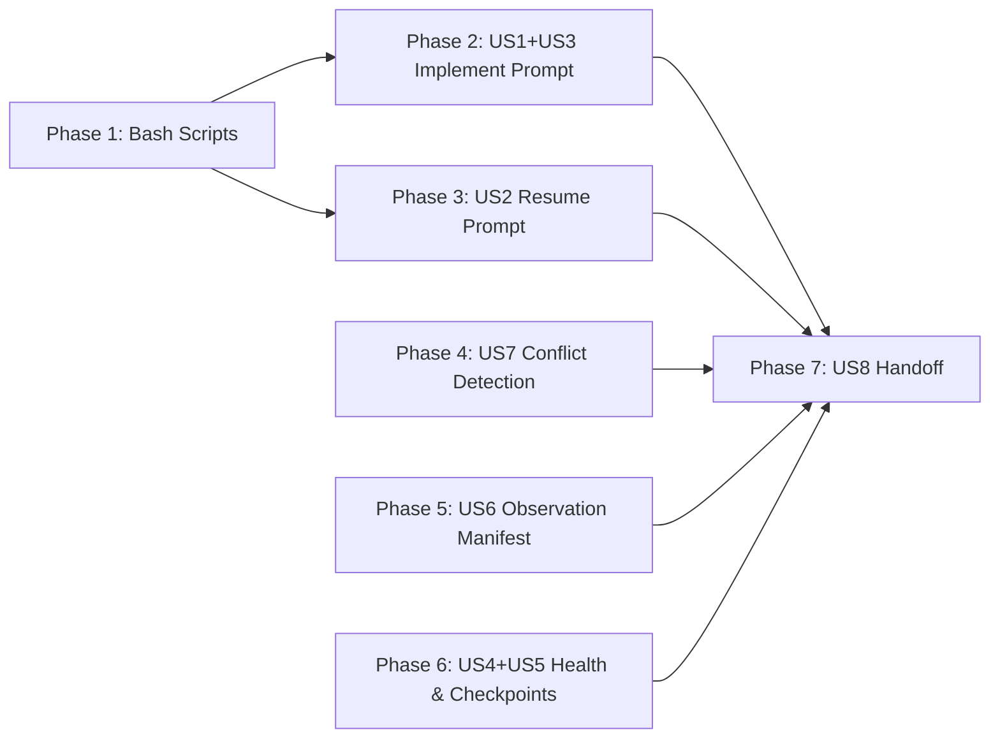

# Tasks: Context Continuity Overhaul

## Overview

- **Total Tasks**: 42
- **Parallel Opportunities**: 16 tasks marked [P]
- **User Stories**: 8 (US1-US8)
- **Phases**: 7 (Setup, then by user story priority)

## Dependencies

## Protected Files

- `extension/src/autonomous/AutonomousDriver.ts` — Out of scope
- `extension/src/autonomous/ContextBuilder.ts` — Out of scope (14-step pipeline
  not changed)
- `extension/src/autonomous/MemoryManager.ts` — Out of scope
- `extension/src/autonomous/MemoryStorage.ts` — Out of scope (only
  MemoryConsolidator extended)
- `extension/src/council/` — Out of scope (LLM Council not touched)

---

## Phase 1: Bash Script Infrastructure

**Goal**: Create the bash scripts that bridge prompt-layer commands to JSONL
files

- [x] T001 Create `write-session-memory.sh` in `.specify/scripts/bash/` —
      accepts --task-id, --feature-id, --type, --content, --session-id, --files
      arguments; appends JSON line to `.specify/logs/session-memory.jsonl`; lazy
      directory creation; always exits 0
- [x] T002 [P] Create `write-failed-approach.sh` in `.specify/scripts/bash/` —
      accepts --task-id, --feature-id, --approach, --reason, --files,
      --session-id arguments; appends JSON line to
      `.specify/logs/failed-approaches.jsonl`; always exits 0
- [x] T003 [P] Create `write-periodic-checkpoint.sh` in `.specify/scripts/bash/`
      — accepts --feature-id, --task-number, --total-tasks, --completed,
      --decisions, --files-modified arguments; writes JSON to
      `.specify/memory/checkpoints/periodic-{timestamp}.json`
- [x] T004 Create `read-session-memories.sh` in `.specify/scripts/bash/` —
      accepts --feature-id, --limit arguments; reads
      `.specify/logs/session-memory.jsonl`, filters by feature, formats output
      for prompt consumption
- [x] T005 [P] Create `read-failed-approaches.sh` in `.specify/scripts/bash/` —
      accepts --feature-id, --sessions arguments; reads
      `.specify/logs/failed-approaches.jsonl`, filters by feature and last N
      sessions, formats output as warnings
- [x] T006 [P] Copy all 5 new bash scripts to
      `extension/resources/bash-scripts/` for bundled distribution

**Verification**:

- [ ] Each script runs without errors on macOS/Linux
- [ ] Scripts create correct JSONL/JSON output structure
- [ ] Scripts handle missing directories with lazy `mkdir -p`
- [ ] All scripts exit 0 even on failure

---

## Phase 2: US1 + US3 — /5_gofer_implement Prompt Modifications

**Goal**: Add incremental memory extraction, failed approach logging, and
periodic checkpoints to the implementation loop

- [x] T007 [US1] Add session-memory extraction instruction to
      `.claude/commands/5_gofer_implement.md` after step 7 (task completion
      mark) — instruct the agent to call `write-session-memory.sh` with a 1-3
      sentence learning after each `- [X]` mark
- [x] T008 [US3] Add failed approach logging instruction to
      `.claude/commands/5_gofer_implement.md` in the Feedback Loop error
      handling section — instruct the agent to call `write-failed-approach.sh`
      when an approach fails before trying an alternative
- [x] T009 [US5] Add periodic checkpoint instruction to
      `.claude/commands/5_gofer_implement.md` — add instruction to call
      `write-periodic-checkpoint.sh` every 5 completed tasks (after the existing
      "every 5 tasks context health check" at line 75-77)

**Verification**:

- [ ] Prompt instructions are clear and unambiguous
- [ ] Bash script paths are correct relative to repo root
- [ ] Memory extraction fires after task marking, not before
- [ ] Checkpoint instruction fires at correct 5-task intervals

---

## Phase 3: US2 — /8_gofer_resume Stage-Aware Loading

**Goal**: Make resume stage-aware and load session memories + failed approaches

- [x] T010 [US2] Add stage detection logic to
      `.claude/commands/8_gofer_resume.md` — detect current stage from session
      checkpoint YAML `stage` field, or infer from artifact presence (tasks.md
      exists → implement, plan.md but no tasks → plan, etc.)
- [x] T011 [US2] Add Stage Loading Matrix to
      `.claude/commands/8_gofer_resume.md` — define which artifacts to fully
      read, summarize, or skip per stage (implement: full-load tasks.md+plan.md,
      summary spec.md+research.md; validate: full-load tasks.md+spec.md, summary
      plan.md, skip research.md)
- [x] T012 [US1] Add session-memory loading step to
      `.claude/commands/8_gofer_resume.md` — instruct the agent to run
      `read-session-memories.sh --feature-id {feature} --limit 20` and display
      learnings from previous sessions
- [x] T013 [US3] Add failed-approaches loading step to
      `.claude/commands/8_gofer_resume.md` — instruct the agent to run
      `read-failed-approaches.sh --feature-id {feature} --sessions 3` and
      display as "Approaches Already Tried" warnings before resuming work
- [x] T014 [US5] Add periodic checkpoint fallback to
      `.claude/commands/8_gofer_resume.md` — if no session-checkpoint.md exists,
      load the most recent `periodic-*.json` from `.specify/memory/checkpoints/`
      and use its tasksCompleted list to determine resume point

**Verification**:

- [ ] Stage detection works for all 6 pipeline stages
- [ ] Correct artifacts loaded/skipped per stage
- [ ] Session memories displayed in chronological order
- [ ] Failed approaches displayed as warnings before work begins

---

## Phase 4: US7 — MemoryConsolidator Conflict Detection

**Goal**: Extend MemoryConsolidator with UPDATE operation for contradictory
memories

- [x] T015 [US7] Write tests for conflict detection in
      `tests/unit/autonomous/MemoryConsolidator.test.ts` — test findConflicts()
      identifies memories with Jaccard overlap ≥0.5 and shared tags; test
      conflict resolution archives older memory with supersededBy field
- [x] T016 [US7] Add `CONFLICT_OVERLAP_THRESHOLD = 0.5` constant to
      `extension/src/autonomous/MemoryConsolidator.ts`
- [x] T017 [US7] Add `findConflicts(memories: Memory[])` private method to
      `extension/src/autonomous/MemoryConsolidator.ts` — returns pairs of
      conflicting memories where Jaccard overlap is ≥0.5 but <0.8 (below dedup
      threshold) AND they share at least one tag
- [x] T018 [US7] Add conflict resolution step to `consolidate()` in
      `extension/src/autonomous/MemoryConsolidator.ts` — between step 1
      (duplicate detection) and step 2 (stale detection); archive older memory
      with `supersededBy` field pointing to newer memory ID
- [x] T019 [US7] Add `conflictsResolved: number` field to `ConsolidationResult`
      interface in `extension/src/autonomous/MemoryConsolidator.ts`
- [x] T020 [P] [US7] Add consolidation log entry for each conflict resolution —
      log both memory IDs, resolution action, and timestamp to console.log
      following existing pattern at line 212-217

**Verification**:

- [ ] Tests pass for conflict detection with known contradictory memories
- [ ] Older memory archived with supersededBy field
- [ ] ConsolidationResult includes conflictsResolved count
- [ ] Existing duplicate detection (≥0.8) still works correctly
- [ ] TypeScript compiles without errors

---

## Phase 5: US6 — Observation Manifest Persistence

**Goal**: Add save/load methods to ObservationMasker for cross-session cache
persistence

- [x] T021 [US6] Write tests for manifest save/load in
      `tests/unit/autonomous/ObservationMasker.test.ts` — test saveManifest
      writes JSONL with correct hashes; test loadManifest verifies hashes and
      restores valid entries; test stale entries are discarded; test missing
      files handled gracefully
- [x] T022 [US6] Add `saveManifest(outputPath?: string): void` method to
      `extension/src/autonomous/ObservationMasker.ts` — serialize all cached
      observations to `.specify/memory/observation-cache/manifest.jsonl` with
      SHA-256 content hashes; use sync I/O (consistent with existing cache save)
- [x] T023 [US6] Add
      `loadManifest(inputPath?: string): { restored: number; stale: number; missing: number }`
      method to `extension/src/autonomous/ObservationMasker.ts` — read manifest,
      verify file hashes with 2-tier checking (mtime first, SHA-256 second),
      restore valid entries to cache, discard stale/missing
- [x] T024 [P] [US6] Add manifest types — `ObservationManifestEntry` interface
      to `extension/src/autonomous/ObservationMasker.ts` with fields: filePath,
      contentHash, summary, tokenEstimate, turnNumber, timestamp, type

**Verification**:

- [ ] Tests pass for manifest save, load, stale detection, missing file handling
- [ ] Manifest file created at correct path
- [ ] 2-tier hash verification works (mtime shortcut + SHA-256 fallback)
- [ ] TypeScript compiles without errors

---

## Phase 6: US4 + US5 — Context Health Estimation Fix

**Goal**: Fix context health script to use real data and improve
CheckpointValidator

- [x] T025 [US4] Modify `.specify/scripts/bash/check-context-health.sh` — add
      function to check `context-health-state.json` freshness (< 5 minutes); if
      fresh, use its `tokensUsed` and `tokensLimit` directly
- [x] T026 [US4] Modify `.specify/scripts/bash/check-context-health.sh` — fix
      fallback estimation to count only: current feature spec artifacts
      (spec.md, plan.md, tasks.md, research.md) + CLAUDE.md + AGENTS.md; remove
      `calculate_source_context()` function that counts all source files from
      recent commits
- [x] T027 [P] [US4] Add `dataSource` field to JSON output in
      `.specify/scripts/bash/check-context-health.sh` — value is "real" when
      using context-health-state.json, "estimated" when using filesystem
      fallback
- [x] T028 [P] [US4] Copy updated `check-context-health.sh` to
      `extension/resources/bash-scripts/check-context-health.sh`
- [x] T029 [US8] Write tests for CheckpointValidator token budget increase in
      `tests/unit/autonomous/CheckpointValidator.test.ts` — test warning at 8000
      tokens (not 5000); test empty section detection for "Key Decisions" and
      "Next Steps"
- [x] T030 [US8] Update `MAX_TOKEN_BUDGET` constant from 5000 to 8000 in
      `extension/src/autonomous/CheckpointValidator.ts`
- [x] T031 [US8] Add empty section validation to `validate()` method in
      `extension/src/autonomous/CheckpointValidator.ts` — warn if "Key
      Decisions" or "Next Steps" sections exist but have no content after the
      heading

**Verification**:

- [ ] Health script uses real data when context-health-state.json is fresh
- [ ] Fallback estimation produces < 200% for typical projects
- [ ] JSON output includes dataSource field
- [ ] CheckpointValidator warns at 8000 tokens
- [ ] Empty section detection works
- [ ] All tests pass

---

## Phase 7: US8 — Handoff Document Quality

**Goal**: Enrich handoff documents and unify format

- [x] T032 [US8] Add "Failed Approaches" section to
      `.claude/commands/7_gofer_save.md` — instruct the agent to run
      `read-failed-approaches.sh` and include output in the handoff document
      under "## Failed Approaches"
- [x] T033 [US8] Add "Session Memories" section to
      `.claude/commands/7_gofer_save.md` — instruct the agent to run
      `read-session-memories.sh` and include top-priority learnings under "##
      Session Memories"
- [x] T034 [P] [US8] Update token budget guidance in
      `.claude/commands/7_gofer_save.md` — change budget reference from 5,000 to
      8,000 tokens
- [x] T035 [US8] Align handoff format in
      `extension/src/autonomous/AutoHandoffTrigger.ts`
      `generateHandoffDocument()` method — ensure the generated markdown
      includes "Failed Approaches" and "Session Memories" sections by reading
      the JSONL files if they exist
- [x] T036 [P] [US8] Write test for AutoHandoffTrigger handoff format alignment
      in `tests/unit/autonomous/AutoHandoffTrigger.test.ts` — test that
      generateHandoffDocument output includes Failed Approaches and Session
      Memories sections

**Verification**:

- [ ] Handoff documents include Failed Approaches section when entries exist
- [ ] Handoff documents include Session Memories section when entries exist
- [ ] Token budget guidance updated
- [ ] Format consistent between /7_gofer_save and AutoHandoffTrigger
- [ ] All tests pass

---

## Phase 8: Polish & Integration

**Goal**: Final integration, build verification, and cleanup

- [x] T037 [P] Verify all bash scripts are executable — run `chmod +x` on all
      new scripts in `.specify/scripts/bash/` and
      `extension/resources/bash-scripts/`
- [x] T038 Run full test suite — `npm test` to verify no regressions
- [x] T039 Run TypeScript type check — `npx tsc --noEmit` to verify all type
      additions compile
- [x] T040 Run ESLint — `npm run lint` to verify code quality
- [x] T041 [P] Verify JSONL file creation — run write scripts manually, verify
      output format matches data-model.md entity definitions
- [x] T042 End-to-end prompt flow test — simulate /5_gofer_implement task
      completion and verify session-memory.jsonl is populated, then simulate
      /8_gofer_resume and verify memories are loaded

**Verification**:

- [ ] All tests pass
- [ ] TypeScript compiles
- [ ] Lint passes
- [ ] JSONL files have correct structure
- [ ] Prompt flow produces expected artifacts

---

## Parallel Execution Guide

Tasks marked [P] can run concurrently if they modify different files:

**Phase 1 parallel groups**:

- T002, T003 (write-failed-approach.sh and write-periodic-checkpoint.sh —
  different files)
- T005, T006 (read-failed-approaches.sh and bundled copies — different
  directories)

**Phase 4 parallel group**:

- T020 (log entry) after T018 is complete

**Phase 5 parallel group**:

- T024 (manifest types) can run with T021 (tests)

**Phase 6 parallel groups**:

- T027, T028 (dataSource field and bundled copy — different files)
- T029 is independent of T025-T026

**Phase 7 parallel group**:

- T034, T036 (token budget and test — different files)

**Phase 8 parallel groups**:

- T037, T041 (chmod and manual verification — independent)

## Implementation Strategy

1. **Infrastructure First**: Phase 1 creates the bash bridge that all prompt
   modifications depend on
2. **Prompt Layer Next**: Phases 2-3 modify the markdown commands that drive the
   developer workflow
3. **TypeScript In Parallel**: Phases 4-6 are independent of each other and can
   be done concurrently
4. **Integration Last**: Phase 7-8 brings everything together
