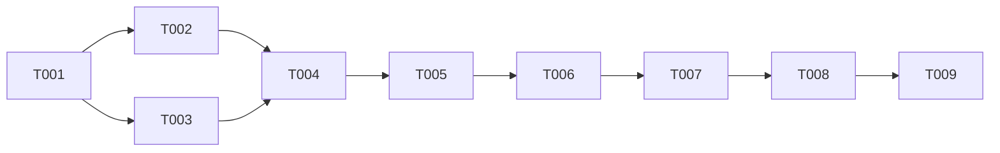

# Tasks: Engineer Review Gate

## Overview

- **Total Tasks**: 9
- **Parallel Opportunities**: 3 tasks marked [P]
- **User Stories**: US1 (alignment validation), US2 (correction loop), US3
  (pipeline integration)

## Dependencies

## Phase 1: Create Agent File

**Goal**: Create the engineer-review agent definition with all 7 required
sections

- [x] T001 [US1] Create engineer-review agent file at
      .claude/agents/engineer-review.md with YAML frontmatter (name:
      engineer-review, description, tools: Read/Grep/Glob/LS) and opening
      adversarial reviewer paragraph
- [x] T002 [US1] Write Core Responsibilities and Analysis Strategy sections in
      .claude/agents/engineer-review.md covering 5 alignment areas (Spec↔Tasks,
      Plan↔Tasks, Contracts↔Tasks, DataModel↔Tasks, Architecture↔Tasks) with
      step-by-step analysis instructions and artifact regex patterns
- [x] T003 [P] [US1] Write Output Format, Blocking Criteria, Important
      Guidelines, and LLM Council Mode sections in
      .claude/agents/engineer-review.md with structured report template (<2000
      tokens), Red/Yellow/Gray severity definitions, adversarial tone
      guidelines, and standard council mode paragraph

**Verification**:

- [x] Agent file has YAML frontmatter with name, description, tools (Read, Grep,
      Glob, LS only)
- [x] Agent file has all 7 sections: Core Responsibilities, Analysis Strategy,
      Output Format, Blocking Criteria, Important Guidelines, LLM Council Mode
- [x] Output format specifies <2000 token cap
- [x] All 5 alignment areas are covered in Analysis Strategy

## Phase 2: Integrate into /4_gofer_tasks Command

**Goal**: Add Step 4.6 (Engineer Review Gate) with correction loop to the task
generation command

- [x] T004 [US2] [US3] Insert new Step 4.6 "Engineer Review Gate" section in
      .claude/commands/4_gofer_tasks.md between the traceability step (Step 4.5,
      ending around line 404) and the GitHub issues step (currently Step 5,
      around line 408). Include Task tool invocation with
      subagent_type="engineer-review" and prompt template passing feature
      directory, spec, plan, tasks, and traceability paths
- [x] T005 [US2] Add correction loop logic to Step 4.6 in
      .claude/commands/4_gofer_tasks.md: parse Red/Yellow/Gray findings from
      agent output, apply fixes to affected artifacts (add missing tasks, update
      task descriptions, fix phase scope), re-run traceability (Step 4.5),
      re-run engineer-review agent, max 3 iterations
- [x] T006 [US2] Add escalation handling to Step 4.6 in
      .claude/commands/4_gofer_tasks.md: if Red findings persist after 3
      iterations, generate engineer-review-escalation.md in feature directory,
      display escalation message, halt pipeline before approval gate

**Verification**:

- [x] Step 4.6 appears between traceability (Step 4.5) and GitHub issues
      (Step 5)
- [x] Agent is spawned using Task tool with subagent_type="engineer-review"
- [x] Correction loop has MAX_ITERATIONS = 3
- [x] Escalation report generated on 3rd failure
- [x] Auto-chaining to /5_gofer_implement is preserved when review passes

## Phase 3: Bundle for Distribution

**Goal**: Ensure agent is distributed with the VSCode extension

- [x] T007 [P] [US3] Copy .claude/agents/engineer-review.md to
      extension/resources/claude-agents/engineer-review.md (identical content,
      bundled for VSIX distribution via existing goferMigrator setupClaudeAgents
      auto-copy)

**Verification**:

- [x] File exists at extension/resources/claude-agents/engineer-review.md
- [x] Content is identical to .claude/agents/engineer-review.md

## Phase 4: Update Documentation

**Goal**: Update pipeline documentation to reflect the engineer review gate

- [x] T008 [P] [US3] Update CLAUDE.md pipeline ASCII diagram to mention engineer
      review gate in the /4_gofer_tasks row (e.g., "Dependency-ordered task
      breakdown + engineer review gate")
- [x] T009 [US3] Update CLAUDE.md command table or description for
      /4_gofer_tasks to note the engineer review gate runs as the final quality
      check before implementation begins

**Verification**:

- [x] CLAUDE.md pipeline diagram mentions engineer review
- [x] No disruption to existing documentation structure

## Parallel Execution Guide

Tasks marked [P] can run concurrently if they:

- Modify different files
- Have no dependencies on incomplete tasks

**Parallel groups**:

- T002, T003 (different sections of engineer-review.md — can be written
  simultaneously then merged)
- T007, T008 (independent files: bundled agent copy and CLAUDE.md)

## Implementation Strategy

1. **Agent First**: Complete Phase 1 (T001-T003) to establish the agent file
2. **Command Integration**: Complete Phase 2 (T004-T006) to wire the agent into
   the pipeline
3. **Distribution + Docs**: Complete Phase 3-4 (T007-T009) for packaging and
   documentation
