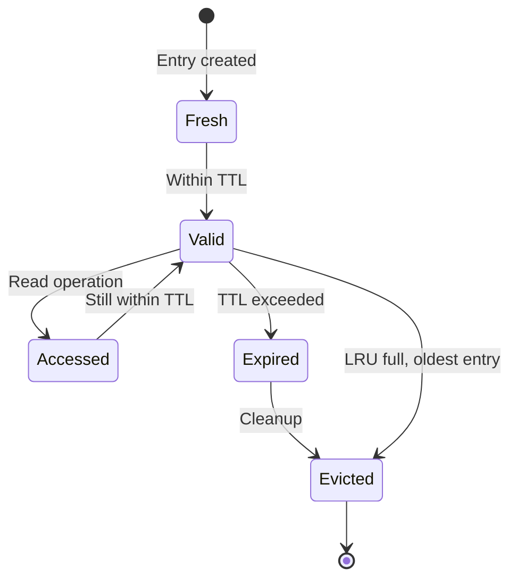
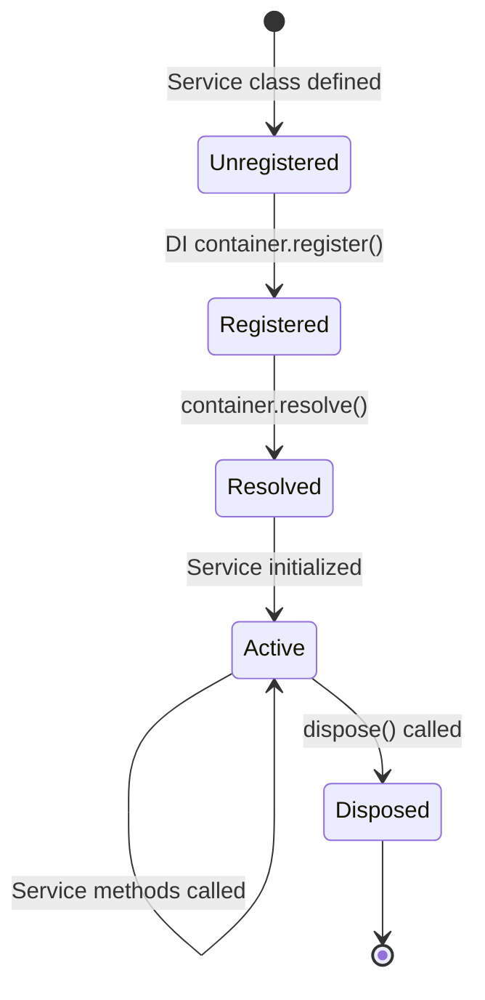

# Data Model: Gofer Engineering Remediation

## Overview

This remediation project does not introduce new data entities. It refactors
existing code while preserving all data structures. This document catalogs
existing entities that are referenced or modified during refactoring.

## Existing Entities (Preserved)

### CacheEntry

Used in SpecCache pattern (template for all cache implementations).

| Field       | Type        | Required | Description                        |
| ----------- | ----------- | -------- | ---------------------------------- |
| key         | string      | Yes      | Unique cache key                   |
| value       | T (generic) | Yes      | Cached value                       |
| timestamp   | number      | Yes      | Unix timestamp when cached         |
| accessCount | number      | Yes      | Number of times accessed (for LRU) |

**Validation Rules**:

- timestamp must be valid Unix milliseconds
- accessCount must be non-negative integer

**Relationships**:

- Part of Map<string, CacheEntry> in cache implementations

### CacheStats

Metrics for cache performance monitoring.

| Field     | Type   | Required | Description               |
| --------- | ------ | -------- | ------------------------- |
| hits      | number | Yes      | Number of cache hits      |
| misses    | number | Yes      | Number of cache misses    |
| evictions | number | Yes      | Number of entries evicted |

**Validation Rules**:

- All counters must be non-negative integers

**Relationships**:

- Owned by cache implementations
- Reset when cache cleared

### Memory

Existing entity from MemoryStorage (preserved, optimized).

| Field     | Type                    | Required | Description              |
| --------- | ----------------------- | -------- | ------------------------ |
| id        | string                  | Yes      | Unique memory identifier |
| content   | string                  | Yes      | Memory content text      |
| category  | string                  | Yes      | Memory category/tag      |
| priority  | number                  | Yes      | Priority score (0-1)     |
| timestamp | number                  | Yes      | Creation timestamp       |
| metadata  | Record<string, unknown> | No       | Additional metadata      |

**Validation Rules**:

- content must not be empty
- priority must be between 0 and 1
- timestamp must be valid Unix milliseconds

**Relationships**:

- Indexed by MemoryStorage
- Subject to token budget eviction (new in remediation)

### Observation

Existing entity from ObservationMasker (preserved).

| Field   | Type    | Required | Description                                        |
| ------- | ------- | -------- | -------------------------------------------------- |
| id      | string  | Yes      | Unique observation identifier                      |
| type    | string  | Yes      | Observation type (file_read, command_output, etc.) |
| content | string  | Yes      | Observation content                                |
| tokens  | number  | Yes      | Estimated token count                              |
| turn    | number  | Yes      | Conversation turn number                           |
| masked  | boolean | Yes      | Whether observation is masked                      |

**Validation Rules**:

- content must not be empty
- tokens must be positive integer
- turn must be non-negative integer

**Relationships**:

- Tracked by ObservationMasker
- Subject to LRU eviction (new in remediation)

## New Configuration Structures

### TimeoutConstants

Exported from `extension/src/config/timeouts.ts`.

```typescript
export const TIMEOUTS = {
  WATCHER_START_DELAY: 500, // ms - Delay before starting file watcher
  CONTEXT_BUILD_TIMEOUT: 10000, // ms - Maximum time for context building
  COMMAND_EXECUTION_TIMEOUT: 5000, // ms - Maximum time for command execution
  INITIALIZATION_TIMEOUT: 200, // ms - Delay for initialization
  SHORT_DELAY: 100, // ms - Short delay for UI updates
  // ... (40+ constants total)
} as const;
```

### ThresholdConstants

Exported from `extension/src/config/thresholds.ts`.

```typescript
export const THRESHOLDS = {
  CONTEXT_WARNING: 0.5, // 50% context usage warning
  CONTEXT_CRITICAL: 0.7, // 70% context usage critical
  MEMORY_PRIORITY_CUTOFF: 0.65, // Minimum priority for memory retention
  COVERAGE_MINIMUM: 0.3, // 30% minimum test coverage
  // ... (10+ constants total)
} as const;
```

### LimitConstants

Exported from `extension/src/config/limits.ts`.

```typescript
export const LIMITS = {
  MAX_MEMORY_COUNT: 200, // Maximum memories to store
  MAX_CACHE_SIZE: 100, // Maximum cache entries (LRU)
  MAX_TOKEN_BUDGET: 50000, // Maximum tokens for memory storage
  MAX_OBSERVATION_WINDOW: 5, // Maximum turns to keep observations
  MAX_RETRIES: 10, // Maximum retry attempts
  // ... (10+ constants total)
} as const;
```

### IntervalConstants

Exported from `extension/src/config/intervals.ts`.

```typescript
export const INTERVALS = {
  CACHE_CHECK_INTERVAL: 60000, // ms - 1 minute
  STALENESS_CHECK_INTERVAL: 180000, // ms - 3 minutes
  TTL_DEFAULT: 300000, // ms - 5 minutes
  // ... (10+ constants total)
} as const;
```

## Service Interfaces (New)

### Logger

Injectable service for error logging with context.

```typescript
interface ILogger {
  error(
    context: string,
    error: Error,
    metadata?: Record<string, unknown>
  ): void;
  warn(
    context: string,
    message: string,
    metadata?: Record<string, unknown>
  ): void;
  info(
    context: string,
    message: string,
    metadata?: Record<string, unknown>
  ): void;
}
```

### DisposalService

Injectable service for managing resource disposal.

```typescript
interface IDisposalService extends vscode.Disposable {
  registerDisposable(disposable: vscode.Disposable): void;
  dispose(): void;
}
```

## State Transitions

### Cache Entry Lifecycle



### Service Lifecycle



## Database Considerations

N/A - Gofer uses file-based storage only. No database migrations required.

## Migration Strategy

1. **Constants**: Extract in Phase 0 without changing values. All references
   updated atomically.
2. **Caches**: Replace unbounded structures with bounded caches. Existing cache
   entries preserved where possible.
3. **Services**: Extract modules behind facades. Existing call sites unchanged
   until Phase 3/4 completion.
4. **Global State**: Move to services in DI container. Access patterns
   unchanged, only storage location changes.

## Backward Compatibility

All existing data structures preserved. No breaking changes to:

- Memory storage format
- Observation format
- Configuration file formats
- Task file formats
- Spec file formats

## Validation Changes

New validations added in Phase 5:

- Configuration validated against JSON schema on extension activation
- File paths validated for traversal attempts before operations
- Command inputs validated for special characters before execution
- Rate limits enforced on expensive operations (10 context builds/min, 5
  generations/min)

All validations include graceful fallbacks - invalid inputs log warnings and use
defaults rather than crashing.
