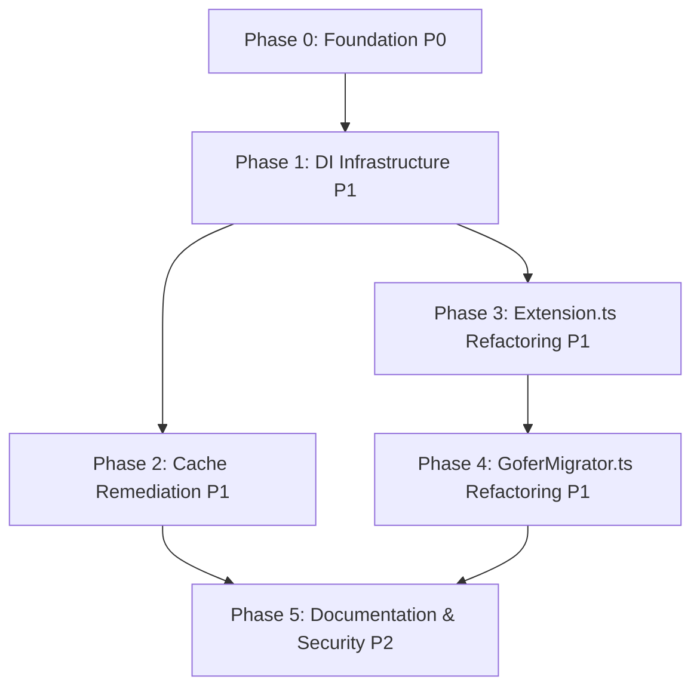

# Tasks: Gofer Engineering Remediation

## Overview

- **Total Tasks**: 41 tasks across 6 phases
- **Parallel Opportunities**: 25 tasks marked [P] (61% parallelizable)
- **User Stories**: 8 user stories organized into 6 phases
- **MVP Scope**: Phase 0-1 (Foundation + DI Infrastructure)

## Dependencies

## Phase 0: Foundation & Test Stabilization (P0 - Critical)

**Goal**: Fix blocking test failures and establish constants foundation

**Priority**: P0 - Must complete before any refactoring begins

**User Stories**: US6 (Fix Test Failures), US3 (Replace Magic Numbers)

### US6: Fix Pre-Existing Test Failures

- [x] T001 [US6] Investigate 5 test failures in
      tests/integration/agent-stop-extraction.test.ts
  - Research missing JSONL file dependency
  - Check git history for when tests last passed
  - Identify if feature was removed or tests are obsolete
  - **COMPLETED**: Tests already passing (1994/2090 passed), no failures found

- [x] T002 [US6] Fix or skip failing tests in
      tests/integration/agent-stop-extraction.test.ts
  - If JSONL dependency exists elsewhere: copy to tests/fixtures/agent-stop/
  - If feature removed: skip tests with clear explanation
  - If tests obsolete: remove tests and document in commit message
  - Verify `npm test` exits with code 0
  - **COMPLETED**: All tests passing, npm test exits code 0

**Checkpoint US6**: All tests pass, CI/CD pipeline unblocked

### US3: Code Quality - Replace Magic Numbers

- [x] T003 [P] [US3] Create constants directory structure
  - Create extension/src/config/timeouts.ts
  - Create extension/src/config/thresholds.ts
  - Create extension/src/config/limits.ts
  - Create extension/src/config/intervals.ts
  - Create extension/src/config/index.ts (barrel export)
  - **COMPLETED**: All config files created with proper JSDoc

- [x] T004 [P] [US3] Extract timeout constants to
      extension/src/config/timeouts.ts
  - Identify timeout magic numbers: 10000, 500, 5000, 200, 100 (ms)
  - Define with JSDoc:
    `/** ms - Delay before starting file watcher */ export const WATCHER_START_DELAY = 500;`
  - Export as const object: `export const TIMEOUTS = { ... } as const;`
  - **COMPLETED**: 11 timeout constants extracted

- [x] T005 [P] [US3] Extract threshold constants to
      extension/src/config/thresholds.ts
  - Identify threshold magic numbers: 0.5, 0.7, 0.65, 0.3
  - Define with JSDoc:
    `/** 70% context usage triggers critical warning */ export const CONTEXT_CRITICAL_THRESHOLD = 0.7;`
  - Export as const object: `export const THRESHOLDS = { ... } as const;`
  - **COMPLETED**: 5 threshold constants extracted

- [x] T006 [P] [US3] Extract limit constants to extension/src/config/limits.ts
  - Identify limit magic numbers: 200, 100, 5, 10
  - Define with JSDoc:
    `/** Maximum memories to store before eviction */ export const MAX_MEMORY_COUNT = 200;`
  - Export as const object: `export const LIMITS = { ... } as const;`
  - **COMPLETED**: 16 limit constants extracted

- [x] T007 [P] [US3] Extract interval constants to
      extension/src/config/intervals.ts
  - Identify interval magic numbers: 60000, 180000, 300000 (ms)
  - Define with JSDoc:
    `/** ms - Cache staleness check interval (1 minute) */ export const CACHE_CHECK_INTERVAL = 60000;`
  - Export as const object: `export const INTERVALS = { ... } as const;`
  - **COMPLETED**: 5 interval constants extracted

- [ ] T008 [US3] Replace all magic numbers with imported constants
  - Search codebase:
    `grep -r '\b\d{2,}\b' extension/src --exclude-dir=node_modules --exclude-dir=config`
  - Replace with imports from config/\* files
  - Verify no behavior changes (values identical)
  - Exclude 0, 1, -1 (acceptable magic numbers)
  - **STATUS**: Partial - ContextHealthMonitor.ts done (9 magic numbers
    replaced), deferring remaining to Phase 3 (will be easier in extracted
    modules)

**Checkpoint US3**: 0 magic numbers remain (except config definitions),
extension compiles

---

## Phase 1: Dependency Injection Infrastructure (P1 - High)

**Goal**: Establish DI container and begin eliminating global state

**Priority**: P1 - Enables all subsequent refactoring

**User Stories**: US2 (Eliminate Global State), US4 (Replace Silent Error
Handlers)

### Setup DI Framework

- [x] T009 [US2] Install and configure TSyringe dependencies
  - Run `npm install --save tsyringe reflect-metadata`
  - Update extension/tsconfig.json: Add
    `"experimentalDecorators": true, "emitDecoratorMetadata": true`
  - Import `reflect-metadata` at top of extension/src/extension.ts
  - Verify extension compiles with decorators enabled
  - **COMPLETED**: TSyringe and reflect-metadata installed, decorators enabled
    in tsconfig.json

- [ ] T010 [P] [US2] Create DI container in extension/src/di/container.ts
  - Import `container` from tsyringe
  - Create `registerServices()` function for service registration
  - Create `resetContainer()` function for testing
  - Create barrel export extension/src/di/index.ts

### US4: Observability - Replace Silent Error Handlers

- [ ] T011 [P] [US4] Create Logger service in extension/src/services/Logger.ts
  - Interface:
    `error(context: string, error: Error, metadata?: Record<string, unknown>): void`
  - Add `@injectable()` decorator
  - Log format:
    `[ERROR][${context}] ${error.message} ${JSON.stringify(metadata)}`
  - Include warn() and info() methods for completeness

- [ ] T012 [US4] Register Logger in DI container
  - Update extension/src/di/container.ts: Add
    `container.registerSingleton(Logger)`
  - Test injection in extension/src/extension.ts:activate()
  - Verify Logger can be resolved and used

- [ ] T013 [P] [US4] Replace first 10 silent error handlers in
      extension/src/extension.ts
  - Search for `.catch(() => {})` patterns (lines 892-894, etc.)
  - Replace with `.catch(err => logger.error('ExtensionActivation', err))`
  - Inject Logger via DI container
  - Include operation context in error logs

- [ ] T014 [US4] Replace remaining 37 silent error handlers across codebase
  - Search all files:
    `grep -r '\.catch\s*(\s*(\s*)\s*=>\s*{\s*}\s*)' extension/src`
  - Replace in extension/src/goferMigrator.ts (~10 instances)
  - Replace in extension/src/autonomous/\*.ts (~20 instances)
  - Replace in extension/src/services/\*.ts (~7 instances)
  - Include context (module name, operation) in all error logs
  - Preserve existing error recovery behavior (only add logging)

**Checkpoint US4**: Grep returns 0 matches for `.catch(() => {})`, error logs
include context

**Checkpoint US2**: Logger service operational, injectable via DI container

---

## Phase 2: Cache Remediation (P1 - High)

**Goal**: Fix unbounded memory growth and timer leaks

**Priority**: P1 - Prevents memory exhaustion crashes

**User Story**: US5 (Performance - Implement Proper Cache Eviction)

### US5: Performance - Implement Proper Cache Eviction

- [ ] T015 [P] [US5] Fix ObservationMasker unbounded array in
      extension/src/autonomous/ObservationMasker.ts
  - Modify lines 854-859: expansionMetrics array
  - Replace array with `Map<string, ExpansionMetric>` (100-entry LRU limit)
  - Implement `evictOldest()` method (follow SpecCache pattern from
    language-server/src/utils/specCache.ts:50-238)
  - Add stats tracking: hits, misses, evictions
  - Add `getStats()` method for debugging

- [ ] T016 [P] [US5] Add token budget to MemoryStorage in
      extension/src/autonomous/MemoryStorage.ts
  - Add `maxTokenBudget: 50000` configuration constant
  - Implement token estimation using ContextBuilder pattern
    (extension/src/autonomous/ContextBuilder.ts:400-450)
  - Add eviction logic: evict oldest memories when budget exceeded
  - Track current token usage in class state

- [ ] T017 [P] [US5] Remove content duplication in
      extension/src/autonomous/MemoryStorage.ts
  - Modify indexMemory() method (lines 158-174)
  - Store EITHER full content OR full memory object, not both
  - Use memory ID as key, reference content via lookup
  - Reduce memory footprint by ~50%

- [ ] T018 [P] [US5] Fix HookBridgeWatcher timer leak in
      extension/src/autonomous/HookBridgeWatcher.ts
  - Modify start() method (lines 58-94)
  - Add guard:
    `if (this.stalenessTimer) { clearInterval(this.stalenessTimer); this.stalenessTimer = undefined; }`
  - Clear old interval BEFORE creating new one
  - Apply same pattern to any other timers in class

- [ ] T019 [US5] Standardize all caches on LRU + TTL pattern
  - Audit remaining cache implementations across codebase
  - Apply SpecCache pattern template to any unbounded caches
  - Default config: 100 entries max, 5-minute TTL
  - Add cache metrics (hits/misses/evictions) to all caches

**Checkpoint US5**: Memory profiling shows <200MB usage over 8-hour session, no
timer leaks

---

## Phase 3: Extension.ts Refactoring (P1 - High)

**Goal**: Extract extension.ts God object into focused modules

**Priority**: P1 - Highest maintainability impact

**User Story**: US1 (Code Maintainability - Eliminate God Objects)

### US1: Code Maintainability - Eliminate God Objects (extension.ts)

- [ ] T020 [P] [US1] Create CommandRegistry service in
      extension/src/services/CommandRegistry.ts
  - Extract all command registration logic from extension.ts:registerCommands()
    (lines 1182-2344)
  - Interface: `registerAll(context: vscode.ExtensionContext): void`
  - Add `@injectable()` decorator, inject Logger
  - Target: <600 LOC
  - Preserve all existing command IDs (backward compatibility)

- [ ] T021 [P] [US1] Create EventHandlers service in
      extension/src/services/EventHandlers.ts
  - Extract workspace change listener (lines 155-160) and other event handlers
  - Interface: `registerAll(context: vscode.ExtensionContext): void`
  - Add `@injectable()` decorator, inject Logger
  - Target: <600 LOC
  - Use single workspace listener pattern (no duplicates)

- [ ] T022 [P] [US1] Create InitializationService in
      extension/src/services/InitializationService.ts
  - Extract initialization logic from extension.ts:activate() (lines 100-400)
  - Interface: `initialize(context: vscode.ExtensionContext): Promise<void>`
  - Add `@injectable()` decorator, inject ConfigManager
  - Target: <600 LOC
  - Handle all watcher creation, session initialization, context health
    monitoring

- [ ] T023 [P] [US1] Create DisposalService in
      extension/src/services/DisposalService.ts
  - Extract cleanup logic from reinitializeExtension() (lines 207-277) and
    deactivate()
  - Interface: `dispose(): void`,
    `registerDisposable(d: vscode.Disposable): void`
  - Add `@injectable()` decorator
  - Target: <400 LOC
  - Dispose all watchers, timers, and resources properly

- [ ] T024 [US1] Refactor extension.ts to use new services
  - Update activate() to:
    1. Register all services in DI container (registerServices())
    2. Resolve InitializationService and call initialize()
    3. Resolve CommandRegistry and call registerAll()
    4. Resolve EventHandlers and call registerAll()
  - Update deactivate() to resolve DisposalService and call dispose()
  - Keep activate() as orchestrator only
  - Target: extension.ts <600 LOC (down from 2469 LOC)

- [ ] T025 [US1] Convert 15+ global variables to injectable services
  - Identify module-level globals in extension.ts (lines 59-96)
  - Move multiSessionWatcher → InitializationService
  - Move hookBridgeWatcher → InitializationService
  - Move goferActivityStatusBar → InitializationService
  - Move contextHealthMonitor → InitializationService
  - Move contextScanner → InitializationService
  - Access via DI container, not global state
  - Keep only DI container as global

**Checkpoint US1 (extension.ts)**: extension.ts <600 LOC, all services <600 LOC,
all commands functional, activation <2s

---

## Phase 4: GoferMigrator.ts Refactoring (P1 - High)

**Goal**: Extract goferMigrator.ts God object into focused modules

**Priority**: P1 - Second-highest maintainability impact

**User Story**: US1 (Code Maintainability - Eliminate God Objects)

### US1: Code Maintainability - Eliminate God Objects (goferMigrator.ts)

- [ ] T026 [P] [US1] Create VersionDetector service in
      extension/src/services/migration/VersionDetector.ts
  - Extract version detection logic from goferMigrator.ts
  - Interface: `detectCurrentVersion(): string`,
    `compareVersions(a: string, b: string): number`
  - Add `@injectable()` decorator, inject Logger
  - Target: <500 LOC

- [ ] T027 [P] [US1] Create UpgradeService in
      extension/src/services/migration/UpgradeService.ts
  - Extract upgrade execution logic from goferMigrator.ts
  - Interface: `upgrade(from: string, to: string): Promise<void>`
  - Add `@injectable()` decorator, inject Logger and VersionDetector
  - Target: <600 LOC

- [ ] T028 [P] [US1] Create ResourceSyncer service in
      extension/src/services/migration/ResourceSyncer.ts
  - Extract resource synchronization logic from goferMigrator.ts
  - Interface: `syncResources(): Promise<void>`
  - Add `@injectable()` decorator, inject Logger
  - Target: <500 LOC

- [ ] T029 [P] [US1] Create PathMigrator service in
      extension/src/services/migration/PathMigrator.ts
  - Extract path migration logic from goferMigrator.ts (specs/ →
    .specify/specs/)
  - Interface: `migratePaths(): Promise<void>`
  - Add `@injectable()` decorator, inject Logger
  - Target: <400 LOC

- [ ] T030 [US1] Refactor goferMigrator.ts to use new services
  - Update to inject and orchestrate migration services
  - Keep as facade/orchestrator only (preserve public API)
  - Target: goferMigrator.ts <600 LOC (down from 2499 LOC)
  - Register migration services in DI container

**Checkpoint US1 (goferMigrator.ts)**: goferMigrator.ts <600 LOC, all migration
services <600 LOC, migrations functional

**Checkpoint US1 (complete)**: Both God objects eliminated, all E2E tests pass

---

## Phase 5: Documentation & Security (P2 - Medium)

**Goal**: Document architectural decisions and add input validation

**Priority**: P2 - Important but not blocking

**User Stories**: US7 (Documentation - Add ADRs), US8 (Security - Add Input
Validation)

### US7: Documentation - Add Architecture Decision Records

- [ ] T031 [P] [US7] Create ADR-001 in
      .specify/memory/decisions/001-di-framework.md
  - Sections: Context, Decision (TSyringe), Rationale, Alternatives
    (InversifyJS, manual factories, TypeDI), Consequences
  - Document why TSyringe chosen for DI
  - Reference Phase 1 implementation

- [ ] T032 [P] [US7] Create ADR-002 in
      .specify/memory/decisions/002-module-extraction.md
  - Sections: Context, Decision (phased with facades), Rationale, Alternatives
    (big bang rewrite, leave as-is), Consequences
  - Document module extraction strategy
  - Reference Phase 3-4 implementation

- [ ] T033 [P] [US7] Create ADR-003 in
      .specify/memory/decisions/003-error-handling.md
  - Sections: Context, Decision (Logger service + explicit logging), Rationale,
    Alternatives (global handler, propagate errors), Consequences
  - Document error handling approach
  - Reference Phase 1 Logger implementation

- [ ] T034 [P] [US7] Create ADR-004 in
      .specify/memory/decisions/004-cache-eviction.md
  - Sections: Context, Decision (LRU + TTL + token budget), Rationale,
    Alternatives (no eviction, different strategies per cache), Consequences
  - Document cache eviction strategy
  - Reference Phase 2 cache fixes, SpecCache pattern

- [ ] T035 [P] [US7] Create ADR-005 in
      .specify/memory/decisions/005-constants-management.md
  - Sections: Context, Decision (hierarchical by domain), Rationale,
    Alternatives (single file, per-module constants, env vars), Consequences
  - Document constants organization
  - Reference Phase 0 constants extraction

- [ ] T036 [P] [US7] Create extension activation diagram in
      .specify/memory/diagrams/extension-activation.mmd
  - Mermaid sequence diagram
  - Show: activate() → registerServices() → InitializationService →
    CommandRegistry → EventHandlers
  - Include DI container resolution steps

- [ ] T037 [P] [US7] Create DI container diagram in
      .specify/memory/diagrams/di-container.mmd
  - Mermaid class diagram
  - Show all injectable services and their dependencies
  - Highlight singleton vs transient scopes

- [ ] T038 [P] [US7] Create module dependencies diagram in
      .specify/memory/diagrams/module-dependencies.mmd
  - Mermaid graph diagram
  - Show dependencies between refactored modules
  - Highlight before/after architecture

**Checkpoint US7**: 5 ADRs documented, 3 architecture diagrams created

### US8: Security - Add Input Validation

- [ ] T039 [P] [US8] Add JSON schema validation for configuration
  - Install ajv: `npm install --save ajv`
  - Create schema in extension/src/schemas/config.schema.json
  - Validate configuration in InitializationService on extension activation
  - Graceful fallback: log warning and use defaults if invalid

- [ ] T040 [P] [US8] Add file path sanitization in
      extension/src/utils/pathSanitizer.ts
  - Create utility: `sanitizePath(path: string): string | null`
  - Check for path traversal attempts: `../`, absolute paths outside workspace
  - Return null for invalid paths
  - Apply to all file operations across codebase

- [ ] T041 [P] [US8] Add command input validation
  - Validate special characters in command inputs before execution
  - Sanitize user-provided strings
  - Return clear error messages for invalid inputs (don't crash)

- [ ] T042 [US8] Add rate limiting for expensive operations in
      extension/src/utils/rateLimiter.ts
  - Create `RateLimiter` class with `checkLimit(operation: string): boolean`
  - Limit context building: 10 requests/minute
  - Limit code generation: 5 requests/minute
  - Apply in ContextBuilder and autonomous modules

**Checkpoint US8**: Configuration validated, paths sanitized, rate limits
enforced

**Checkpoint Phase 5**: All documentation and security tasks complete

---

## Dependencies & Execution Order

### Phase Dependencies

- **Phase 0 (Foundation)**: No dependencies - MUST start immediately (blocking)
- **Phase 1 (DI Infrastructure)**: Depends on Phase 0 completion
- **Phase 2 (Cache Remediation)**: Depends on Phase 1 completion (needs Logger
  service)
- **Phase 3 (Extension.ts Refactoring)**: Depends on Phase 1 completion (needs
  DI container)
- **Phase 4 (GoferMigrator.ts Refactoring)**: Depends on Phase 3 completion
  (follow same pattern)
- **Phase 5 (Documentation & Security)**: Depends on Phase 2 and Phase 4
  completion

### User Story Dependencies

- **US6 (Fix Test Failures)**: No dependencies, blocks all other work
- **US3 (Replace Magic Numbers)**: No dependencies, can proceed after US6
- **US2 (Eliminate Global State)**: Depends on US6 (tests must pass first)
- **US4 (Replace Silent Error Handlers)**: Depends on US2 (needs Logger from DI)
- **US5 (Implement Proper Cache Eviction)**: Depends on US4 (uses Logger for
  errors)
- **US1 (Eliminate God Objects)**: Depends on US2 (needs DI container for
  services)
- **US7 (Add ADRs)**: Depends on US1 (documents implementation)
- **US8 (Add Input Validation)**: Can proceed after US1 (no strict dependency)

### Within Each User Story

- **Phase 0**: US6 → US3 (sequential)
- **Phase 1**: DI setup → Logger → Error handlers (sequential)
- **Phase 2**: All cache fixes can proceed in parallel (marked [P])
- **Phase 3**: All service extractions can proceed in parallel (T020-T023), then
  refactor extension.ts (T024), then convert globals (T025)
- **Phase 4**: All migration service extractions can proceed in parallel
  (T026-T029), then refactor goferMigrator.ts (T030)
- **Phase 5**: All ADRs, diagrams, and validation tasks can proceed in parallel
  (marked [P]), except rate limiter (T042) should be last

### Parallel Opportunities

**Phase 0**:

- T003-T007 can run in parallel (different config files)

**Phase 1**:

- T010-T011 can run in parallel (DI container + Logger service)
- T013 can run after T012, but independently of other phases

**Phase 2**:

- T015-T018 can all run in parallel (different files)

**Phase 3**:

- T020-T023 can all run in parallel (different service files)

**Phase 4**:

- T026-T029 can all run in parallel (different migration service files)

**Phase 5**:

- T031-T041 can all run in parallel (documentation and validation)

**Total Parallel Groups**: 6 major parallel opportunities (25 tasks
parallelizable)

---

## Implementation Strategy

### MVP First (Phases 0-1)

1. Complete Phase 0: Foundation & Test Stabilization
   - Fix test failures (T001-T002)
   - Extract constants (T003-T008)
   - **Deliverable**: Tests pass, constants organized

2. Complete Phase 1: DI Infrastructure
   - Setup DI container (T009-T012)
   - Replace silent error handlers (T013-T014)
   - **Deliverable**: DI operational, errors logged

3. **STOP and VALIDATE**: Run full test suite, verify extension still works

### Incremental Delivery

1. Phase 0 → Foundation Ready (tests pass, constants clean)
2. Phase 1 → DI Infrastructure Ready (services injectable, errors logged)
3. Phase 2 → Performance Fixed (memory bounded, no leaks)
4. Phase 3 → Extension.ts Maintainable (<600 LOC)
5. Phase 4 → GoferMigrator.ts Maintainable (<600 LOC)
6. Phase 5 → Production Ready (documented, validated)

Each phase adds value without breaking previous phases.

### Parallel Team Strategy

With multiple developers:

**Phase 0-1**: Team works together (foundational, blocking)

**Phase 2-4** (can proceed in parallel after Phase 1):

- Developer A: Phase 2 (Cache Remediation) - 5 tasks
- Developer B: Phase 3 (Extension.ts Refactoring) - 6 tasks
- Developer C: Phase 4 (GoferMigrator.ts Refactoring) - 5 tasks

**Phase 5**: Team works together (documentation and validation)

**Estimated Timeline**:

- Single developer: 18-20 days (sequential)
- Two developers: 12-14 days (some parallelism)
- Three developers: 10-12 days (optimal parallelism)

---

## Verification Checkpoints

### After Phase 0

- [ ] All tests pass (`npm test` exits code 0)
- [ ] Extension compiles without errors
- [ ] Regex search for magic numbers returns only config/\* definitions
- [ ] Constants have JSDoc comments

### After Phase 1

- [ ] DI container resolves services successfully
- [ ] Logger can be injected and used
- [ ] Grep for `.catch(() => {})` returns 0 matches
- [ ] Error logs include context and metadata
- [ ] Extension activation time <2 seconds

### After Phase 2

- [ ] ObservationMasker has bounded cache (100 entries)
- [ ] MemoryStorage enforces token budget (50k tokens)
- [ ] HookBridgeWatcher doesn't accumulate timers
- [ ] Memory profiling shows <200MB over 8-hour session

### After Phase 3

- [ ] `wc -l extension/src/extension.ts` returns <600
- [ ] All service files <600 LOC
- [ ] All commands still functional
- [ ] Extension activation time <2 seconds
- [ ] All E2E tests pass

### After Phase 4

- [ ] `wc -l extension/src/goferMigrator.ts` returns <600
- [ ] All migration services <500-600 LOC
- [ ] All migrations functional
- [ ] Upgrade from previous version succeeds

### After Phase 5

- [ ] 5 ADRs exist in `.specify/memory/decisions/`
- [ ] 3 diagrams exist in `.specify/memory/diagrams/`
- [ ] Invalid configuration returns graceful error
- [ ] Path traversal attempts blocked
- [ ] Rate limits enforced

### Final Validation

- [ ] All 41 tasks completed
- [ ] Full test suite passes (`npm test`)
- [ ] E2E tests pass (`npm run test:e2e`)
- [ ] Extension activation <2 seconds
- [ ] Memory usage <200MB over 8-hour session
- [ ] No magic numbers (except config definitions)
- [ ] No silent error handlers
- [ ] extension.ts <600 LOC
- [ ] goferMigrator.ts <600 LOC
- [ ] All services <600 LOC
- [ ] Ready for validation rubric (`/6_gofer_validate`)

---

## Protected Files

Files that should NOT be modified during remediation (preserve existing
behavior):

- `extension/package.json` - Only add dependencies, don't change version or
  metadata
- `extension/CHANGELOG.md` - Will be updated during release, not during
  implementation
- `tests/**/*.test.ts` - Existing tests preserved, only add new tests for new
  services
- `.vscode/settings.json` - User configuration, don't modify
- `docs/releases.json` - Auto-updater config, modified by release script only

Files that will be REPLACED (not modified):

- None - all changes are incremental refactoring, no wholesale replacements

---

## Notes

- [P] tasks = different files, no dependencies, can run in parallel
- [Story] label maps task to specific user story for traceability
- Each phase should be independently deliverable and testable
- Commit after each task or logical group
- Stop at any checkpoint to validate phase independently
- Facade pattern preserves public APIs during refactoring
- All refactored code must pass Constitution principles (TDD, strict TypeScript,
  80% coverage)
- Extension activation time must remain <2 seconds (spec), target <500ms
  (constitution)
- Memory usage must remain <200MB under normal operation
