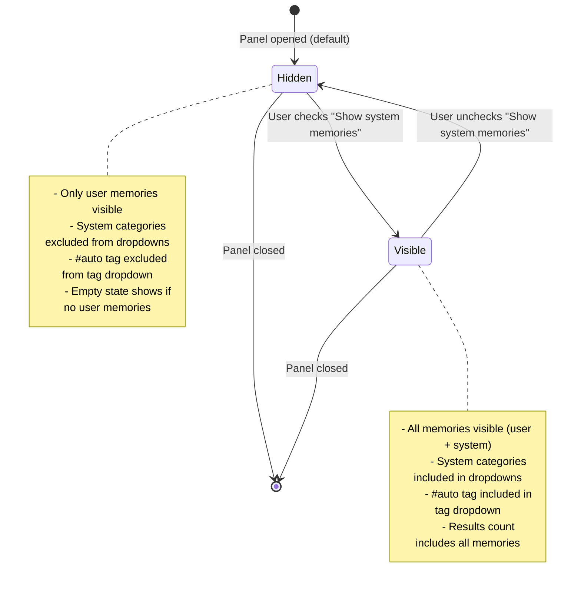
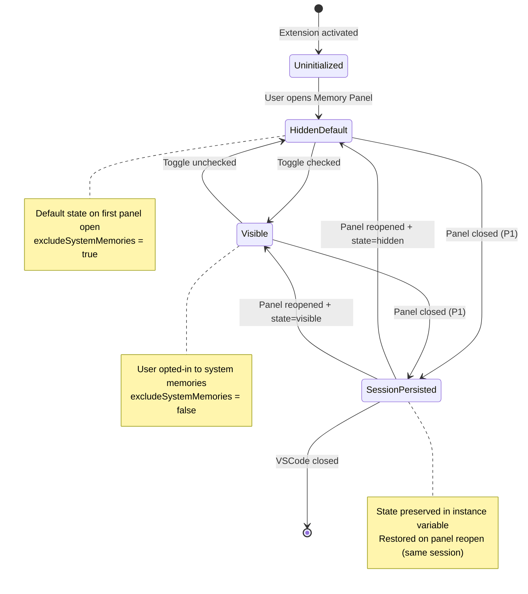
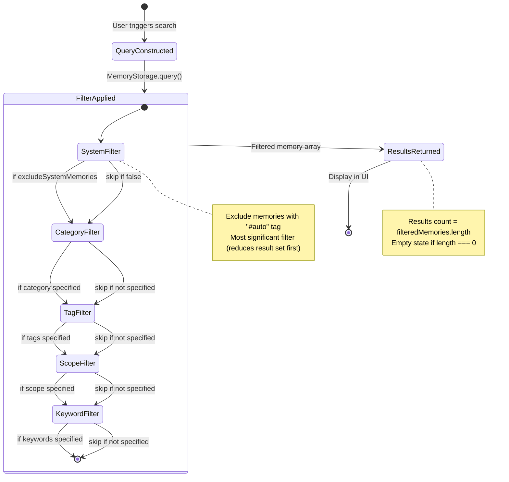

# Data Model: Memory Panel Usability Fix

## Overview

This feature introduces UI-level filtering to distinguish between user-created
memories and system-generated telemetry. The data model extends existing memory
structures with filter state management while maintaining backward
compatibility. No storage format changes are required - all filtering occurs
in-memory at the UI layer.

## Entity Definitions

### 1. User Memory

**Description**: Knowledge entry explicitly created by users via "Gofer:
Remember" command. Represents intentional learning captures like coding
patterns, architectural decisions, and gotchas.

**Storage Location**: `.specify/memory/memories.jsonl` (existing storage, no
changes)

| Field       | Type                | Required | Description                                                                         |
| ----------- | ------------------- | -------- | ----------------------------------------------------------------------------------- |
| id          | string              | Yes      | Unique identifier (UUID format)                                                     |
| content     | string              | Yes      | Memory text content (markdown supported)                                            |
| category    | string              | Yes      | User-assigned category (e.g., "pattern", "decision", "gotcha")                      |
| tags        | string[]            | Yes      | User-applied tags for organization (NEVER includes "#auto")                         |
| timestamp   | ISO 8601 string     | Yes      | Creation timestamp                                                                  |
| scope       | 'local' \| 'global' | Yes      | Workspace scope (local = current workspace, global = all workspaces)                |
| learnedFrom | 'user_interaction'  | No       | Source indicator (optional field, defaults to 'user_interaction' for user memories) |
| metadata    | object              | No       | Additional context (file paths, line numbers, etc.)                                 |

**Validation Rules**:

- `content`: Must be non-empty string (1-10,000 characters)
- `category`: Must be non-empty string, matches pattern `^[a-z0-9_]+$`
- `tags`: Array must not be empty, each tag matches pattern `^#?[a-zA-Z0-9_]+$`,
  must NOT include "#auto"
- `timestamp`: Must be valid ISO 8601 format
- `scope`: Must be either "local" or "global"
- `learnedFrom`: If present, must be "user_interaction" (enforced at creation
  time)

**Distinguishing Characteristics**:

- **NEVER** contains "#auto" tag in tags array
- Created exclusively via "Gofer: Remember" command
- Intended for knowledge management and pattern recognition
- Visible by default in Memory Panel

---

### 2. System Memory

**Description**: Telemetry entry automatically generated by Gofer's autonomous
subsystems. Includes budget warnings, scope violations, discovery events, and
autonomous decision logs.

**Storage Location**: `.specify/memory/memories.jsonl` (same file as User
Memory, distinguished by tags)

| Field       | Type                | Required | Description                                                                 |
| ----------- | ------------------- | -------- | --------------------------------------------------------------------------- |
| id          | string              | Yes      | Unique identifier (UUID format)                                             |
| content     | string              | Yes      | Telemetry log content (system-generated text)                               |
| category    | string              | Yes      | System category ("auto_decision" \| "discovery")                            |
| tags        | string[]            | Yes      | System tags, ALWAYS includes "#auto"                                        |
| timestamp   | ISO 8601 string     | Yes      | Event timestamp                                                             |
| scope       | 'local' \| 'global' | Yes      | Workspace scope                                                             |
| learnedFrom | 'system'            | No       | Source indicator (optional field, defaults to 'system' for system memories) |
| metadata    | object              | No       | Telemetry context (budget thresholds, violation details, etc.)              |

**Validation Rules**:

- `content`: Must be non-empty string (1-10,000 characters)
- `category`: Must be "auto_decision" or "discovery" (system categories only)
- `tags`: Array must include "#auto" tag (enforced at creation time by
  ContinuousMemoryWriter)
- `timestamp`: Must be valid ISO 8601 format
- `scope`: Must be either "local" or "global"
- `learnedFrom`: If present, must be "system"

**Distinguishing Characteristics**:

- **ALWAYS** contains "#auto" tag in tags array
- Created automatically by ContinuousMemoryWriter
  (extension/src/autonomous/ContinuousMemoryWriter.ts:258-275)
- Intended for debugging, audit trails, and autonomous behavior transparency
- Hidden by default in Memory Panel (opt-in via toggle)

**System Categories**:

- `auto_decision`: Autonomous decisions (budget warnings, loading decisions,
  scope violations)
- `discovery`: Research completion events, discovery logs

---

### 3. Toggle State

**Description**: Boolean preference indicating whether system memories are
visible in the Memory Panel. Controls filtering behavior for all memory queries
and dropdown population.

**Storage Location**: In-memory instance variable in MemoryPanel class
(session-scoped)

| Field              | Type    | Required | Description                                                              |
| ------------------ | ------- | -------- | ------------------------------------------------------------------------ |
| showSystemMemories | boolean | Yes      | Whether system memories are visible (true = show all, false = user only) |

**Validation Rules**:

- `showSystemMemories`: Must be boolean value (true or false)

**Default Value**: `false` (system memories hidden by default)

**Persistence**:

- **P1 (MVP)**: Session-scoped - persists within single VSCode session, resets
  on panel close
- **P3 (Future)**: Workspace-scoped - persists across VSCode restarts via
  `vscode.workspace.getState()`

**State Transitions**:



**Behavior Impact**:

- **When false (Hidden)**:
  - Filters out memories with "#auto" tag
  - Category dropdown excludes "auto_decision", "discovery"
  - Tag dropdown excludes "#auto"
  - Empty state message: "No user memories yet"
- **When true (Visible)**:
  - Shows all memories (no filtering)
  - Category dropdown includes all categories
  - Tag dropdown includes all tags
  - Empty state message: "No memories found"

---

### 4. Memory Filter Query

**Description**: Search parameters combining category, tags, keywords, scope,
and system memory exclusion flag. Passed from UI through MemoryManager to
MemoryStorage for filtering.

**Storage Location**: Transient query object (not persisted, constructed per
search operation)

| Field                 | Type                          | Required | Description                                                       |
| --------------------- | ----------------------------- | -------- | ----------------------------------------------------------------- |
| keywords              | string                        | No       | Keyword search (searches content field)                           |
| category              | string                        | No       | Filter by category (exact match)                                  |
| tags                  | string[]                      | No       | Filter by tags (OR logic - matches if any tag matches)            |
| scope                 | 'local' \| 'global' \| 'both' | No       | Filter by workspace scope                                         |
| excludeSystemMemories | boolean                       | No       | Exclude memories tagged with "#auto" (new field for this feature) |

**Validation Rules**:

- `keywords`: If present, must be non-empty string (1-1000 characters)
- `category`: If present, must be non-empty string
- `tags`: If present, must be non-empty array
- `scope`: If present, must be "local", "global", or "both"
- `excludeSystemMemories`: If present, must be boolean

**Filter Application Order** (implemented in MemoryStorage.query()):

1. Exclude system memories (if `excludeSystemMemories: true`)
2. Filter by category (if specified)
3. Filter by tags (if specified)
4. Filter by scope (if specified)
5. Filter by keywords (if specified)

**Default Values**:

- `excludeSystemMemories`: `true` (default to hiding system memories)
- `scope`: `'both'` (show all scopes unless filtered)
- All other fields: `undefined` (no filtering applied)

---

## Relationships

### 1. User Memory ↔ System Memory

**Relationship Type**: Disjoint Sets (mutually exclusive)

**Distinguishing Rule**: Presence of "#auto" tag

```
IF "#auto" ∈ memory.tags THEN System Memory
ELSE User Memory
```

**Cardinality**:

- 1 Memory entity → 1 classification (User OR System, never both)

**Validation**: No memory should exist with "#auto" tag AND user-created origin
(enforced by creation commands)

---

### 2. Toggle State → Memory Filter Query

**Relationship Type**: State Controls Query Construction

**Rule**: Toggle state determines `excludeSystemMemories` field value in queries

```
toggleState.showSystemMemories === false
  → query.excludeSystemMemories = true

toggleState.showSystemMemories === true
  → query.excludeSystemMemories = false
```

**Cardinality**:

- 1 Toggle State → N Memory Filter Queries (toggle state read for each search
  operation)

**Lifecycle**: Toggle state persists across multiple queries within a session

---

### 3. Memory Filter Query → Memory Results

**Relationship Type**: Query Execution (one-to-many)

**Rule**: Query filters memories based on all specified criteria

```
filteredMemories = memories.filter(m => {
  if (query.excludeSystemMemories && m.tags.includes('#auto')) return false;
  if (query.category && m.category !== query.category) return false;
  if (query.tags && !query.tags.some(t => m.tags.includes(t))) return false;
  if (query.scope !== 'both' && m.scope !== query.scope) return false;
  if (query.keywords && !m.content.includes(query.keywords)) return false;
  return true;
});
```

**Cardinality**:

- 1 Memory Filter Query → 0..N Memory Results (query may return zero or more
  memories)

**Performance**: O(n) where n = total memories in storage (in-memory filtering)

---

## State Transition Diagrams

### Toggle State Lifecycle



---

### Memory Query Execution Flow



---

## Database Considerations

### Indexing

**Current State** (no changes required):

- In-memory Map index by memory ID (`Map<string, Memory>`)
- No additional indexes needed for tag filtering (already O(n) sequential scan)
- Category/tag dropdowns built from filtered result set (not indexed)

**Future Optimization** (out of scope for this feature):

- Separate storage files (memories.jsonl for user, telemetry.jsonl for system)
- Tag index (Map<string, Set<memoryId>>) for faster tag-based queries
- Category index (Map<string, Set<memoryId>>) for faster category filtering

---

### Migration Approach

**No migration required** - this is a UI-only feature with no storage format
changes.

**Backward Compatibility**:

- Existing memories.jsonl file remains unchanged
- New `excludeSystemMemories` field in MemoryQuery is optional (defaults to
  false for backward compat)
- If field is absent, behavior matches current "show all memories" logic

**Forward Compatibility**:

- If feature is removed, all memories remain accessible
- Toggle state is session-scoped, no persisted data to clean up
- Removing `excludeSystemMemories` check reverts to showing all memories

**Data Integrity**:

- No risk of data loss (filtering is read-only)
- No risk of corruption (no writes to storage)
- Rollback is trivial (remove filter logic, revert to current behavior)

---

## Entity-to-UserStory Mapping

### User Story 1: View User Memories Only (P1)

**Required Entities**:

- **User Memory**: Displayed in panel when filter active
- **System Memory**: Filtered out (excluded from display)
- **Toggle State**: Controls filtering (default: showSystemMemories = false)
- **Memory Filter Query**: Constructed with excludeSystemMemories = true

**Entity Usage**:

1. Panel opens → Toggle State initialized to false (hidden)
2. Memory Filter Query constructed with excludeSystemMemories = true
3. Query filters out System Memories (tagged with "#auto")
4. Only User Memories displayed in results list
5. Category/tag dropdowns populated from User Memories only

---

### User Story 2: Access System Telemetry (P2)

**Required Entities**:

- **User Memory**: Displayed in panel when toggle enabled
- **System Memory**: Displayed in panel when toggle enabled
- **Toggle State**: User changes to showSystemMemories = true
- **Memory Filter Query**: Constructed with excludeSystemMemories = false

**Entity Usage**:

1. User clicks "Show system memories" toggle
2. Toggle State changes to true (visible)
3. Panel refreshes, constructs new Memory Filter Query with
   excludeSystemMemories = false
4. Query returns both User Memories AND System Memories
5. Category dropdown includes system categories ("auto_decision", "discovery")
6. Tag dropdown includes "#auto" tag

---

### User Story 3: Persistent Filter Preference (P3)

**Required Entities**:

- **Toggle State**: Persisted across panel sessions

**Entity Usage**:

1. User enables "Show system memories" (Toggle State = true)
2. User closes Memory Panel
3. Toggle State saved to instance variable (P1) or workspace state (P3)
4. User reopens Memory Panel
5. Toggle State restored from saved value
6. Panel displays memories according to restored toggle state

---

## Summary

**Entity Count**: 4 entities

- User Memory (existing, no changes)
- System Memory (existing, no changes)
- Toggle State (new, session-scoped boolean)
- Memory Filter Query (extended with 1 new optional field)

**Relationship Count**: 3 relationships

- User Memory ↔ System Memory (disjoint sets via "#auto" tag)
- Toggle State → Memory Filter Query (state controls query construction)
- Memory Filter Query → Memory Results (query execution)

**Entities with State Machines**: 1 entity

- Toggle State (2-state machine: Hidden ↔ Visible with session persistence)

**Storage Impact**: Zero

- No new files created
- No existing files modified
- All filtering occurs in-memory at UI layer

**Migration Required**: None

- Fully backward compatible
- Optional query field (defaults to false if absent)
- Reversible without data loss
