# Tasks: Memory Panel Usability Fix

**Feature**: Filter Memory Panel to show only user-created memories by default,
hiding 533+ system telemetry entries that clutter the UI.

**Implementation Strategy**: Test-driven development (TDD) with user story
organization. Each phase builds incrementally, with tests written before
implementation. MVP (Phase 1-4) delivers core filtering, Phase 5 adds polish and
compliance.

**Total Tasks**: 35 tasks across 5 phases

**Parallel Opportunities**: 15 tasks marked [P] can run in parallel within their
phases

**Dependencies**: Linear progression through phases (Setup → Tests → Logic → UI
→ Polish), with parallelism within each phase.

---

## Overview

| Phase                          | Goal                                         | Task Count | Parallel Tasks | Dependencies          |
| ------------------------------ | -------------------------------------------- | ---------- | -------------- | --------------------- |
| **Phase 1: Setup**             | Type definitions and test scaffolding        | 6          | 2              | None                  |
| **Phase 2: Data Layer Tests**  | Write failing tests (TDD Red phase)          | 5          | 3              | Phase 1               |
| **Phase 3: Business Logic**    | Implement filtering logic (TDD Green phase)  | 5          | 0              | Phase 2               |
| **Phase 4: UI Implementation** | Add toggle, filter dropdowns, state handling | 11         | 5              | Phase 3               |
| **Phase 5: Polish**            | Refactor, document, validate                 | 8          | 5              | Phase 4               |
| **TOTAL**                      | **Complete feature**                         | **35**     | **15**         | **Sequential phases** |

---

## Dependencies

```mermaid
graph TB
    P1[Phase 1: Setup] --> P2[Phase 2: Tests]
    P2 --> P3[Phase 3: Logic]
    P3 --> P4[Phase 4: UI]
    P4 --> P5[Phase 5: Polish]

    P1 -.-> T001[T001: Feature branch]
    P1 -.-> T002[T002: MemoryQuery extension]
    P1 -.-> T003[T003: JSDoc]
    P1 -.-> T004[T004: Test files]
    P1 -.-> T005[T005: Test fixtures]
    P1 -.-> T006[T006: Compile check]

    P2 -.-> T007[T007: Filter test]
    P2 -.-> T008[T008: Include all test]
    P2 -.-> T009[T009: Backward compat test]
    P2 -.-> T010[T010: Combined filter test]
    P2 -.-> T011[T011: Verify tests fail]

    P3 -.-> T012[T012: Implement filter]
    P3 -.-> T013[T013: Manager passthrough]
    P3 -.-> T014[T014: Verify tests pass]
    P3 -.-> T015[T015: Integration test]
    P3 -.-> T016[T016: Coverage check]

    P4 -.-> T017[T017: Toggle state var]
    P4 -.-> T018[T018: Filter dropdowns]
    P4 -.-> T019[T019: HTML checkbox]
    P4 -.-> T020[T020: Wire checkbox event]
    P4 -.-> T021[T021: Toggle handler]
    P4 -.-> T022[T022: Search handler]
    P4 -.-> T023[T023: Empty state]
    P4 -.-> T024[T024: Toggle test]
    P4 -.-> T025[T025: Category dropdown test]
    P4 -.-> T026[T026: Tag dropdown test]
    P4 -.-> T027[T027: E2E test]

    P5 -.-> T028[T028: Extract template]
    P5 -.-> T029[T029: JSDoc]
    P5 -.-> T030[T030: CHANGELOG]
    P5 -.-> T031[T031: Performance test]
    P5 -.-> T032[T032: Coverage report]
    P5 -.-> T033[T033: Manual validation]
    P5 -.-> T034[T034: Traceability matrix]
    P5 -.-> T035[T035: Pull request]

    style P1 fill:#e1f5e1
    style P2 fill:#fff4e1
    style P3 fill:#e1f0ff
    style P4 fill:#f0e1ff
    style P5 fill:#ffe1f0
```

---

## Phase 1: Setup & Foundation

**Goal**: Prepare codebase structure, add type definitions, and set up test
scaffolding before implementation begins.

**User Stories**: Foundation for US1, US2, US3

**Verification Criteria**:

- ✅ MemoryQuery interface compiles without errors
- ✅ Test file structure exists with TODO markers
- ✅ Test fixtures load correctly in Vitest

### Tasks

- [x] T001 Create feature branch `001-memory-panel-filter` from `main`
- [x] T002 Extend `MemoryQuery` interface with `excludeSystemMemories?: boolean`
      field in
      `/Users/douglaswross/Code/gofer/extension/src/autonomous/memory.ts:212`
- [x] T003 Add JSDoc comment for `excludeSystemMemories`: "Exclude
      system-generated memories (tagged with #auto). When true, filters out all
      memories containing the '#auto' tag. Used by Memory Panel to show only
      user-created memories by default. @default false"
- [x] T004 [P] Create test file structure:
      `/Users/douglaswross/Code/gofer/tests/unit/ui/MemoryPanel.test.ts`,
      `/Users/douglaswross/Code/gofer/tests/unit/autonomous/MemoryStorage.filter.test.ts`,
      `/Users/douglaswross/Code/gofer/tests/integration/memory-panel-filtering.test.ts`
- [x] T005 [P] Set up test fixtures:
      `/Users/douglaswross/Code/gofer/tests/fixtures/memories-with-auto-tag.jsonl`
      (10 user memories without #auto tag, 100 system memories with #auto tag)
- [x] T006 Verify TypeScript compilation passes with new MemoryQuery field:
      `cd extension && npm run compile`

**Dependencies**: None (foundation phase)

---

## Phase 2: Data Layer (Test-First)

**Goal**: Write failing tests for MemoryStorage.query() filter logic BEFORE
implementing the filter (TDD Red phase).

**User Stories**: Tests for US1 (View User Memories Only)

**Verification Criteria**:

- ✅ 4 unit tests written with clear Arrange-Act-Assert structure
- ✅ All tests FAIL with "excludeSystemMemories filter not implemented" error
- ✅ Test coverage report shows 0% coverage of filter logic (not yet
  implemented)

### Tasks

- [x] T007 [P] Write unit test in
      `/Users/douglaswross/Code/gofer/tests/unit/autonomous/MemoryStorage.filter.test.ts`:
      `MemoryStorage.query()` with `excludeSystemMemories: true` filters out
      memories tagged with `#auto` (Arrange: Load fixture with 10 user + 100
      system memories, Act: Call
      `storage.query({ excludeSystemMemories: true })`, Assert: Result contains
      exactly 10 memories, none have `#auto` tag)
- [x] T008 [P] Write unit test in
      `/Users/douglaswross/Code/gofer/tests/unit/autonomous/MemoryStorage.filter.test.ts`:
      `MemoryStorage.query()` with `excludeSystemMemories: false` includes all
      memories (Arrange: Same fixture as T007, Act: Call
      `storage.query({ excludeSystemMemories: false })`, Assert: Result contains
      110 memories)
- [x] T009 [P] Write unit test in
      `/Users/douglaswross/Code/gofer/tests/unit/autonomous/MemoryStorage.filter.test.ts`:
      `MemoryStorage.query()` with `excludeSystemMemories: undefined` includes
      all memories for backward compatibility (Arrange: Same fixture as T007,
      Act: Call `storage.query({})`, Assert: Result contains 110 memories)
- [x] T010 Write unit test in
      `/Users/douglaswross/Code/gofer/tests/unit/autonomous/MemoryStorage.filter.test.ts`:
      `excludeSystemMemories` combines with category filter (Arrange: Fixture
      with user memories in category "pattern", system memories in category
      "auto_decision", Act: Call
      `storage.query({ category: 'pattern', excludeSystemMemories: true })`,
      Assert: Result contains only user memories in "pattern" category)
- [x] T011 Run tests and verify ALL tests FAIL (Red phase of TDD):
      `cd extension && npm test -- MemoryStorage.filter.test.ts`

**Dependencies**: Phase 1 (T002 MemoryQuery interface extension)

---

## Phase 3: Business Logic Implementation

**Goal**: Implement MemoryStorage filter logic and MemoryManager pass-through to
make tests pass (TDD Green phase).

**User Stories**: Implements US1 (View User Memories Only)

**Verification Criteria**:

- ✅ All 4 unit tests from Phase 2 pass
- ✅ Integration test passes (T015)
- ✅ Code coverage ≥80% for modified code paths
- ✅ No regression in existing MemoryStorage tests

### Tasks

- [ ] T012 Implement `excludeSystemMemories` filter in
      `/Users/douglaswross/Code/gofer/extension/src/autonomous/MemoryStorage.ts`
      at line ~390: Add filter BEFORE existing category filter:
      `if (query.excludeSystemMemories) { results = results.filter((e) => !e.tags.includes('#auto')); }`
- [ ] T013 Update `MemoryManager.search()` in
      `/Users/douglaswross/Code/gofer/extension/src/autonomous/MemoryManager.ts:404-453`
      to forward `excludeSystemMemories` flag to `storage.query()` (no logic
      changes, just parameter pass-through)
- [ ] T014 Run unit tests and verify ALL tests PASS (Green phase of TDD):
      `cd extension && npm test -- MemoryStorage.filter.test.ts`
- [ ] T015 Add integration test in
      `/Users/douglaswross/Code/gofer/tests/integration/memory-panel-filtering.test.ts`:
      MemoryManager.search() respects `excludeSystemMemories` flag end-to-end
      (Arrange: Initialize MemoryManager with test storage, Act: Call
      `manager.search({ excludeSystemMemories: true })`, Assert:
      SearchResult.memories contains only user memories)
- [ ] T016 Verify test coverage ≥80% for MemoryStorage.query() and
      MemoryManager.search(): `cd extension && npm test -- --coverage`

**Dependencies**: Phase 2 (tests written and failing)

---

## Phase 4: UI Implementation

**Goal**: Implement MemoryPanel UI changes to add toggle, filter dropdowns,
handle state changes.

**User Stories**: Implements US1 (View User Memories Only), US2 (Access System
Telemetry), US3 (Persistent Filter Preference)

**Verification Criteria**:

- ✅ Toggle checkbox appears in Memory Panel toolbar
- ✅ Toggle change refreshes panel and updates results
- ✅ Category dropdown shows only user categories when toggle OFF
- ✅ Tag dropdown excludes "#auto" when toggle OFF
- ✅ Empty state message displays when no user memories exist
- ✅ All integration and E2E tests pass

### Implementation Tasks

- [ ] T017 [US1] [US3] Add instance variable to MemoryPanel class in
      `/Users/douglaswross/Code/gofer/extension/src/ui/MemoryPanel.ts` after
      line 19: `private showSystemMemories: boolean = false;` (default to false
      = hide system memories by default per FR-001)
- [ ] T018 [US1] Modify `getHtmlContent()` in
      `/Users/douglaswross/Code/gofer/extension/src/ui/MemoryPanel.ts:175-184`
      to filter memories before building dropdowns (after
      `const allMemories = await this.memoryManager.load('both');` add:
      `const visibleMemories = this.showSystemMemories ? allMemories : allMemories.filter(m => !m.tags.includes('#auto'));`,
      then replace `allMemories` with `visibleMemories` in category/tag
      extraction at lines 180, 183-184)
- [ ] T019 [P] [US1] [US2] Add HTML checkbox toggle to webview template in
      `/Users/douglaswross/Code/gofer/extension/src/ui/MemoryPanel.ts` after
      results-info div (~line 220-285 in toolbar section): Insert checkbox with
      label "Show system memories" and CSS styling matching VSCode theme
- [ ] T020 [P] [US2] Wire checkbox onchange event to postMessage in
      `/Users/douglaswross/Code/gofer/extension/src/ui/MemoryPanel.ts` webview
      script section: Add JavaScript listener that posts `toggleSystemMemories`
      command with checkbox state
- [ ] T021 [US2] Add message handler for 'toggleSystemMemories' command in
      `handleMessage()` in
      `/Users/douglaswross/Code/gofer/extension/src/ui/MemoryPanel.ts` at line
      ~104: Insert new case that sets
      `this.showSystemMemories = message.showSystemMemories` and calls
      `await this.update()` to rebuild webview with new filter state
- [ ] T022 [US1] Update 'search' message handler in
      `/Users/douglaswross/Code/gofer/extension/src/ui/MemoryPanel.ts:106-111`
      to include `excludeSystemMemories` in MemoryQuery: Add to query object:
      `excludeSystemMemories: !this.showSystemMemories`
- [ ] T023 [US1] Add empty state rendering in
      `/Users/douglaswross/Code/gofer/extension/src/ui/MemoryPanel.ts` webview
      template: Check filtered results count, if count === 0 and
      !showSystemMemories, display empty state HTML with guidance message: "No
      user memories yet. Create your first memory with 'Gofer: Remember'
      command. System memories are hidden. Toggle 'Show system memories' to see
      them."

### Test Tasks

- [ ] T024 [P] [US2] Write integration test in
      `/Users/douglaswross/Code/gofer/tests/unit/ui/MemoryPanel.test.ts`: Toggle
      change triggers search refresh (simulate toggle change, verify postMessage
      called with correct command, verify webview updated with filtered results)
- [ ] T025 [P] [US1] Write integration test in
      `/Users/douglaswross/Code/gofer/tests/unit/ui/MemoryPanel.test.ts`:
      Category dropdown excludes system categories when toggle OFF (load
      memories with "auto_decision" and "pattern" categories, verify dropdown
      options with toggle OFF shows only "pattern", toggle ON shows both)
- [ ] T026 [P] [US1] Write integration test in
      `/Users/douglaswross/Code/gofer/tests/unit/ui/MemoryPanel.test.ts`: Tag
      dropdown excludes "#auto" when toggle OFF
- [ ] T027 [US1] Write E2E test in
      `/Users/douglaswross/Code/gofer/tests/integration/memory-panel-filtering.test.ts`:
      Create user memory via "Gofer: Remember", verify it appears with system
      memories hidden, toggle system memories ON, verify system memories now
      appear

**Dependencies**: Phase 3 (MemoryStorage and MemoryManager logic implemented)

---

## Phase 5: Polish & Integration

**Goal**: Refactor for code quality compliance, add documentation, verify
performance, prepare for merge.

**User Stories**: Cross-cutting concerns for US1, US2, US3

**Verification Criteria**:

- ✅ MemoryPanel.ts file size <500 lines (constitution compliance)
- ✅ Performance test shows toggle <100ms for 1000 memories
- ✅ Test coverage ≥80% across all modified code
- ✅ Manual validation passes with real data
- ✅ All acceptance criteria from spec.md verified
- ✅ Pull request ready for review

### Tasks

- [ ] T028 [P] Extract HTML template generation from
      `/Users/douglaswross/Code/gofer/extension/src/ui/MemoryPanel.ts` to reduce
      file size below 500 lines: Create new file
      `/Users/douglaswross/Code/gofer/extension/src/ui/MemoryPanelTemplate.ts`,
      move HTML generation logic (lines ~186-600) to `generateHtml()` function,
      import and call from MemoryPanel.ts, verify MemoryPanel.ts <500 lines and
      MemoryPanelTemplate.ts <500 lines
- [ ] T029 [P] Add JSDoc comments to all new public methods in
      `/Users/douglaswross/Code/gofer/extension/src/ui/MemoryPanel.ts`:
      showSystemMemories field, toggleSystemMemories message handler
- [ ] T030 [P] Update `/Users/douglaswross/Code/gofer/CHANGELOG.md` with feature
      summary: Add entry under "Features": "Memory Panel now filters out system
      telemetry by default, showing only user-created memories. Toggle 'Show
      system memories' to view all."
- [ ] T031 [P] Run performance test with 1000 memories: Create fixture with 1000
      memories (900 system, 100 user) in
      `/Users/douglaswross/Code/gofer/tests/fixtures/memories-large.jsonl`,
      profile toggle change operation, verify <100ms target met
- [ ] T032 [P] Run full test suite and verify 80%+ coverage:
      `cd extension && npm test -- --coverage`, generate coverage report, verify
      line coverage ≥80% and branch coverage ≥80%
- [ ] T033 Manual validation with real `memories.jsonl` file: Load existing
      `/Users/douglaswross/Code/gofer/.specify/memory/memories.jsonl` (533+
      entries), verify user memories appear by default, verify toggle exposes
      system memories, test category/tag dropdowns, test keyword search respects
      filter
- [ ] T034 Update
      `/Users/douglaswross/Code/gofer/.specify/specs/001-memory-panel-filter/spec.md`
      traceability matrix with implementation references: Map each FR-### to
      implemented files/functions, verify 100% requirement coverage
- [ ] T035 Create pull request with summary of changes: Title: "feat: Filter
      system memories from Memory Panel by default", Body: Link to spec.md, list
      of changed files, testing summary, closes #[issue-number]

**Dependencies**: Phase 4 (UI implementation complete)

---

## Parallel Execution Guide

### Within Phase 1 (Setup)

**Parallel group**: Run these together after T001-T003 complete:

- T004: Create test file structure
- T005: Set up test fixtures

### Within Phase 2 (Tests)

**Parallel group**: Write all unit tests together after T011 dependencies met:

- T007: Filter test (excludeSystemMemories: true)
- T008: Include all test (excludeSystemMemories: false)
- T009: Backward compatibility test (undefined)

**Sequential**: T010 (combined filter test) → T011 (verify tests fail)

### Within Phase 3 (Logic)

**All sequential** - implementation must complete in order to achieve TDD Green
phase.

### Within Phase 4 (UI)

**Parallel group 1**: UI structure (after T017-T018 complete):

- T019: Add HTML checkbox toggle
- T020: Wire checkbox event

**Parallel group 2**: Tests (after T023 complete):

- T024: Toggle test
- T025: Category dropdown test
- T026: Tag dropdown test

**Sequential**: T017 → T018 → T019 → T020 → T021 → T022 → T023 → T024-T026
(parallel) → T027

### Within Phase 5 (Polish)

**Parallel group**: All polish tasks can run concurrently:

- T028: Extract template
- T029: JSDoc comments
- T030: CHANGELOG update
- T031: Performance test
- T032: Coverage report

**Sequential**: After all parallel tasks complete → T033 (manual validation) →
T034 (traceability) → T035 (pull request)

---

## Implementation Strategy

### MVP First (Phases 1-4 Only)

1. **Phase 1**: Setup & Foundation → Type definitions and test scaffolding ready
2. **Phase 2**: Data Layer Tests → TDD Red phase (tests fail)
3. **Phase 3**: Business Logic → TDD Green phase (tests pass)
4. **Phase 4**: UI Implementation → Complete user stories US1, US2, US3
5. **STOP and VALIDATE**: Test all user stories independently
6. Deploy/demo if ready (MVP complete)

### Incremental Delivery

- **After Phase 3**: Data layer filtering works → Can test in isolation
- **After Phase 4**: Full UI experience → MVP ready for users
- **After Phase 5**: Production-ready → Documentation, performance validation,
  PR creation

### Parallel Team Strategy

With multiple developers:

1. **Phase 1**: Team completes setup together
2. **Phase 2**: Developer A (T007-T009), Developer B (T010-T011) → Tests written
   in parallel
3. **Phase 3**: Single developer (sequential TDD Green phase)
4. **Phase 4**: Developer A (UI tasks T017-T023), Developer B (Test tasks
   T024-T027) → Parallel workstreams
5. **Phase 5**: Developer A (T028-T030), Developer B (T031-T032) → Polish in
   parallel

---

## Plan Phase Coverage

| Plan Phase                                                             | Task IDs     | Coverage Status          |
| ---------------------------------------------------------------------- | ------------ | ------------------------ |
| **Phase 1: Setup & Foundation** (plan.md:167-185)                      | T001-T006    | ✅ 6/6 tasks             |
| **Phase 2: Data Layer (Test-First)** (plan.md:187-218)                 | T007-T011    | ✅ 5/5 tasks             |
| **Phase 3: Business Logic Implementation** (plan.md:220-251)           | T012-T016    | ✅ 5/5 tasks             |
| **Phase 4: API/Interface Layer (UI Implementation)** (plan.md:253-328) | T017-T027    | ✅ 11/11 tasks           |
| **Phase 5: Polish & Integration** (plan.md:330-377)                    | T028-T035    | ✅ 8/8 tasks             |
| **TOTAL**                                                              | **35 tasks** | **✅ 5/5 phases (100%)** |

---

## Acceptance Criteria Coverage

| Criterion                                                                        | User Story         | Task IDs                                 | Coverage Status      |
| -------------------------------------------------------------------------------- | ------------------ | ---------------------------------------- | -------------------- |
| **US1-AC1**: See only 3 user memories when 200 auto_decision logs exist          | US1                | T007, T012, T018, T024                   | ✅ COVERED           |
| **US1-AC2**: Category dropdown excludes system categories                        | US1                | T018, T025                               | ✅ COVERED           |
| **US1-AC3**: Tag dropdown excludes "#auto" tag                                   | US1                | T018, T026                               | ✅ COVERED           |
| **US1-AC4**: Empty state when zero user memories exist                           | US1                | T023, T027                               | ✅ COVERED           |
| **US1-AC5**: Keyword search respects filter state                                | US1                | T022, T027                               | ✅ COVERED           |
| **US2-AC1**: Toggle ON shows both user and system memories                       | US2                | T021, T024                               | ✅ COVERED           |
| **US2-AC2**: Category dropdown includes system categories when toggle ON         | US2                | T025                                     | ✅ COVERED           |
| **US2-AC3**: Search for "budget_warning" includes system memories when toggle ON | US2                | T027                                     | ✅ COVERED           |
| **US2-AC4**: Filter by "auto_decision" category shows system logs                | US2                | T027                                     | ✅ COVERED           |
| **US2-AC5**: Toggle OFF returns to user-only mode                                | US2                | T021, T024                               | ✅ COVERED           |
| **US3-AC1**: Toggle state persists on panel close/reopen in same session         | US3                | T017                                     | ✅ COVERED           |
| **US3-AC2**: Toggle unchecked state persists on panel close/reopen               | US3                | T017                                     | ✅ COVERED           |
| **US3-AC3**: Toggle state persists across VSCode restarts                        | US3                | ⚠️ OUT OF SCOPE (P3, future enhancement) | ✅ DOCUMENTED        |
| **TOTAL**                                                                        | **3 user stories** | **13/13 scenarios**                      | **✅ 100% coverage** |

---

## Functional Requirement Coverage

| FR-ID      | Requirement                                                   | Task IDs        | Coverage Status |
| ---------- | ------------------------------------------------------------- | --------------- | --------------- |
| **FR-001** | Display only user-created memories by default                 | T017, T018      | ✅ COVERED      |
| **FR-002** | Provide "Show system memories" toggle in toolbar              | T019            | ✅ COVERED      |
| **FR-003** | Toggle between user-only and all-memories modes               | T020, T021      | ✅ COVERED      |
| **FR-004** | Category dropdown shows only categories in visible memory set | T018, T025      | ✅ COVERED      |
| **FR-005** | Tag dropdown shows only tags in visible memory set            | T018, T026      | ✅ COVERED      |
| **FR-006** | Keyword searches respect system memory filter state           | T022, T027      | ✅ COVERED      |
| **FR-007** | Display empty state when no user memories exist               | T023, T027      | ✅ COVERED      |
| **FR-008** | Results count reflects visible memories only                  | T018            | ✅ COVERED      |
| **FR-009** | System memory filter uses #auto tag exclusion                 | T012            | ✅ COVERED      |
| **FR-010** | Toggle state persists within VSCode session                   | T017            | ✅ COVERED      |
| **TOTAL**  | **10 functional requirements**                                | **All covered** | **✅ 100%**     |

---

## Data Model Entity Coverage

| Entity                  | Definition Location   | Implementing Tasks           | Coverage Status |
| ----------------------- | --------------------- | ---------------------------- | --------------- |
| **User Memory**         | data-model.md:17-47   | T007, T008, T009, T012, T027 | ✅ COVERED      |
| **System Memory**       | data-model.md:50-84   | T007, T008, T009, T012, T027 | ✅ COVERED      |
| **Toggle State**        | data-model.md:87-142  | T017, T021, T024             | ✅ COVERED      |
| **Memory Filter Query** | data-model.md:145-177 | T002, T012, T022             | ✅ COVERED      |
| **TOTAL**               | **4 entities**        | **All covered**              | **✅ 100%**     |

---

## API Contract Coverage

| Contract                                 | Location                | Implementing Tasks | Coverage Status |
| ---------------------------------------- | ----------------------- | ------------------ | --------------- |
| **MemoryQuery Interface Extension**      | internal-api.md:20-131  | T002, T003         | ✅ COVERED      |
| **MemoryStorage.query() Enhancement**    | internal-api.md:133-244 | T012               | ✅ COVERED      |
| **MemoryPanel Webview Message Protocol** | internal-api.md:247-330 | T020, T021, T022   | ✅ COVERED      |
| **MemoryPanel State Management**         | internal-api.md:333-423 | T017, T021         | ✅ COVERED      |
| **MemoryPanel HTML Toggle Control**      | internal-api.md:425-488 | T019, T020         | ✅ COVERED      |
| **MemoryPanel Empty State**              | internal-api.md:490-563 | T023               | ✅ COVERED      |
| **MemoryManager Passthrough**            | internal-api.md:565-616 | T013               | ✅ COVERED      |
| **Event: toggleSystemMemories**          | events.md:16-57         | T020, T021         | ✅ COVERED      |
| **Event: search (modified)**             | events.md:59-109        | T022               | ✅ COVERED      |
| **Event: searchResults**                 | events.md:113-186       | T022               | ✅ COVERED      |
| **TOTAL**                                | **10 contracts**        | **All covered**    | **✅ 100%**     |

---

## Coverage Gaps Analysis

### Plan Phase Coverage

- ✅ **5/5 phases covered (100%)** - All plan phases have corresponding tasks

### Acceptance Criteria Coverage

- ✅ **13/13 criteria covered (100%)** - All acceptance scenarios have
  implementing tasks
- ⚠️ US3-AC3 (VSCode restart persistence) marked as OUT OF SCOPE per spec P3
  priority

### Functional Requirement Coverage

- ✅ **10/10 requirements covered (100%)** - All FRs have implementing tasks

### Data Model Entity Coverage

- ✅ **4/4 entities covered (100%)** - All entities have implementing tasks

### API Contract Coverage

- ✅ **10/10 contracts covered (100%)** - All internal APIs and events have
  implementing tasks

### **NO COVERAGE GAPS FOUND** ✅

---

## Summary

**Total Task Count**: 35 tasks

**Tasks Per Phase**:

- Phase 1 (Setup): 6 tasks
- Phase 2 (Tests): 5 tasks
- Phase 3 (Logic): 5 tasks
- Phase 4 (UI): 11 tasks
- Phase 5 (Polish): 8 tasks

**Parallel Opportunity Count**: 15 tasks marked [P] across all phases

**Plan Phase Coverage**: 5/5 phases covered (100%)

**Acceptance Criteria Coverage**: 13/13 criteria covered (100%)

- US1: 5/5 scenarios covered
- US2: 5/5 scenarios covered
- US3: 2/2 MVP scenarios covered (AC3 out of scope, documented)

**Functional Requirement Coverage**: 10/10 requirements covered (100%)

**Data Model Entity Coverage**: 4/4 entities covered (100%)

**API Contract Coverage**: 10/10 contracts covered (100%)

**Coverage Gaps Found**: None ✅

**Implementation Approach**:

- **TDD Workflow**: Phase 2 writes failing tests → Phase 3 implements logic →
  Tests pass (Red-Green-Refactor)
- **MVP Delivery**: Phases 1-4 deliver complete user stories US1, US2, US3
- **Polish Last**: Phase 5 adds documentation, performance validation,
  constitution compliance
- **Incremental Validation**: Each phase has verification checkpoints

**Key Architecture Decisions**:

1. UI-level filtering (no storage changes) - Tasks T012, T018
2. Tag-based exclusion using #auto tag - Task T012
3. Default hide system memories (opt-in to show) - Task T017
4. Extract HTML template for file size compliance - Task T028
5. Test-driven development (TDD) - Phase 2 before Phase 3
6. Session-level persistence only for MVP - Task T017

**Ready for Implementation**: Yes ✅

- All tasks have clear descriptions with exact file paths
- Dependencies are well-defined and mapped
- Parallelization opportunities identified
- 100% coverage of plan, spec, data model, and contracts
