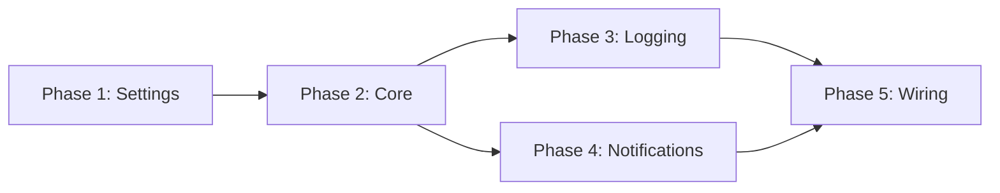

# Tasks: YOLO Slop Reduction Mode

## Overview

- **Total Tasks**: 21
- **Parallel Opportunities**: 8 tasks marked [P]
- **User Stories**: 5 (US1-US5)
- **Phases**: 5 (Setup → Core → Logging → Notifications → Wiring)

## Dependencies

## Phase 1: Settings & Config [US4]

**Goal**: Declare VSCode settings and add ConfigManager getters

**Story**: As a developer, I want to enable/disable slop reduction via VSCode
Settings

- [x] T001 [P] [US4] Add `gofer.yoloSlopReduction.enabled` boolean setting
      (default `false`) to `extension/package.json`
      contributes.configuration.properties
- [x] T002 [P] [US4] Add `gofer.yoloSlopReduction.notifyEvery` number setting
      (default `10`, min `1`) to `extension/package.json`
      contributes.configuration.properties
- [x] T003 [US4] Add `yoloSlopReductionEnabled` and
      `yoloSlopReductionNotifyEvery` to CONFIG_KEYS in `extension/src/config.ts`
- [x] T004 [US4] Add `yoloSlopReductionEnabled: false` and
      `yoloSlopReductionNotifyEvery: 10` to DEFAULTS in
      `extension/src/config.ts`
- [x] T005 [P] [US4] Add `getSlopReductionEnabled(): boolean` method to
      ConfigManager in `extension/src/config.ts`
- [x] T006 [P] [US4] Add `getSlopReductionNotifyEvery(): number` method to
      ConfigManager in `extension/src/config.ts`

**Verification**:

- [x] AC4.1: Settings appear in VSCode Settings UI under Gofer section
- [x] AC4.2: Both settings have correct types and defaults
- [x] AC4.4: ConfigManager provides typed getters for both settings

## Phase 2: SlopReducer Core [US1, US5]

**Goal**: Implement auto-fix engine with pattern registry and safety guards

**Story**: As a developer, I want slop patterns automatically fixed when I save
a file

- [x] T007 [US1] Create `extension/src/autonomous/SlopReducer.ts` with class
      skeleton, constructor taking `workspacePath: string`
- [x] T008 [US5] Define `FixPattern` interface in
      `extension/src/autonomous/SlopReducer.ts`:
      `{ name: string; regex: RegExp; fix: ((line: string) => string | null) | null; reason: string }`
- [x] T009 [US5] Define `FIX_PATTERNS` constant array with 3 fixable patterns in
      `extension/src/autonomous/SlopReducer.ts`:
  - `console-log`: regex `/^\s*console\.log\(.*\);\s*$/`, fix returns `null`
    (remove line)
  - `debugger`: regex `/^\s*debugger;\s*$/`, fix returns `null` (remove line)
  - `ts-ignore`: regex `/\/\/\s*@ts-ignore/`, fix replaces with
    `// @ts-expect-error`
- [x] T010 [US1] Implement `isTestFile(filePath: string): boolean` in
      SlopReducer — returns true for `**/tests/**`, `**/*.test.ts`,
      `**/*.spec.ts`, `**/test-*/**`
- [x] T011 [US1] Implement `reduceFile(filePath: string): FixResult` in
      SlopReducer — reads file, applies fix patterns line-by-line, writes only
      if changed, returns `{ fixCount, fixes }`
- [x] T012 [US1] Add re-entrant guard (`private reducing = new Set<string>()`)
      to SlopReducer — skip if file already being reduced, clear after write

**Verification**:

- [x] AC1.2: `console.log(...)` lines removed entirely
- [x] AC1.3: `debugger` lines removed entirely
- [x] AC1.4: `// @ts-ignore` replaced with `// @ts-expect-error`
- [x] AC1.5: Test files NOT auto-fixed
- [x] AC1.6: Non-slop lines remain untouched
- [x] AC1.7: No infinite save loop
- [x] AC5.1: Fix patterns defined in declarative registry
- [x] AC5.2: Patterns without fix function are detection-only
- [x] AC5.3: Adding new pattern requires only one registry entry

## Phase 3: JSONL Logging [US2]

**Goal**: Log every fix to audit trail

**Story**: As a developer, I want every auto-fix logged with timestamp, file,
pattern, and before/after snippets

- [x] T013 [US2] Define `FixLogEntry` interface in SlopReducer:
      `{ timestamp, file, line, pattern, originalSnippet, replacement, reason }`
- [x] T014 [US2] Implement `private logFix(entry: FixLogEntry): void` in
      SlopReducer — lazy mkdir for `.specify/logs/`, append JSONL to
      `slop-reduction.jsonl`, catch errors silently

**Verification**:

- [x] AC2.1: Each fix logged as single JSON line to
      `.specify/logs/slop-reduction.jsonl`
- [x] AC2.2: Entry contains all required fields
- [x] AC2.3: Log directory created lazily
- [x] AC2.4: Logging failures non-fatal

## Phase 4: Notifications [US3]

**Goal**: Batched notification every N fixes

**Story**: As a developer, I want a notification every N fixes so I'm aware
without being overwhelmed

- [x] T015 [US3] Add `private sessionFixCount = 0` counter to SlopReducer
- [x] T016 [US3] Implement `private maybeNotify(): void` in SlopReducer —
      increment counter, show notification when
      `sessionFixCount % notifyEvery === 0`
- [x] T017 [US3] Set notification text to
      `"Gofer: Reduced ${sessionFixCount} slop issues this session"` with "View
      Log" action
- [x] T018 [US3] Implement "View Log" action — opens JSONL file via
      `vscode.workspace.openTextDocument()` + `vscode.window.showTextDocument()`

**Verification**:

- [x] AC3.1: Notification appears every N fixes (default 10)
- [x] AC3.2: Shows cumulative session count
- [x] AC3.3: Includes "View Log" action
- [x] AC3.4: No notification between milestones

## Phase 5: Extension Wiring [US1]

**Goal**: Wire SlopReducer into extension activation and file save handler

- [x] T019 [US1] Import SlopReducer and create instance in
      `extension/src/extension.ts` during activation, passing `workspacePath`
- [x] T020 [US1] Register `vscode.workspace.onDidSaveTextDocument` handler in
      `extension/src/extension.ts` that checks enabled setting, file extension
      (`.ts/.tsx/.js/.jsx`), test file exclusion, then calls
      `slopReducer.reduceFile()`
- [x] T021 [US1] Add save handler disposable to `context.subscriptions` for
      cleanup in `extension/src/extension.ts`

**Verification**:

- [x] AC1.1: When enabled and file saved, fixable patterns auto-removed
- [x] AC4.3: Setting changes take effect immediately (re-read config on each
      save)

## Parallel Execution Guide

Tasks marked [P] can run concurrently:

- **Group A** (Phase 1): T001, T002 (independent package.json entries)
- **Group B** (Phase 1): T005, T006 (independent ConfigManager getters)

**Sequential constraints**:

- Phase 2 depends on Phase 1 (SlopReducer uses ConfigManager)
- Phase 3 and 4 depend on Phase 2 (need SlopReducer class)
- Phase 5 depends on Phase 3 + 4 (wires everything together)

## Implementation Strategy

1. **MVP First**: Phase 1 + 2 + 5 gives working auto-fix on save
2. **Audit Trail**: Phase 3 adds JSONL logging
3. **Polish**: Phase 4 adds batched notifications
4. All phases total ~120 lines of new code in SlopReducer.ts + ~20 lines config
   changes
