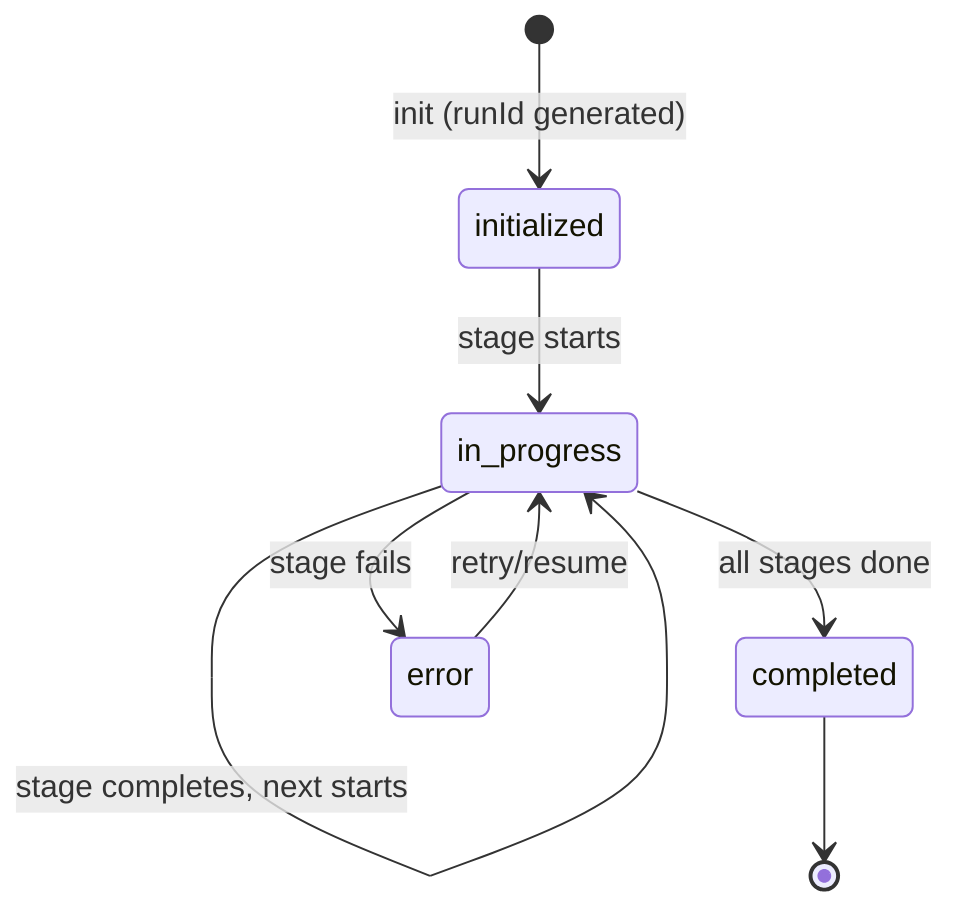
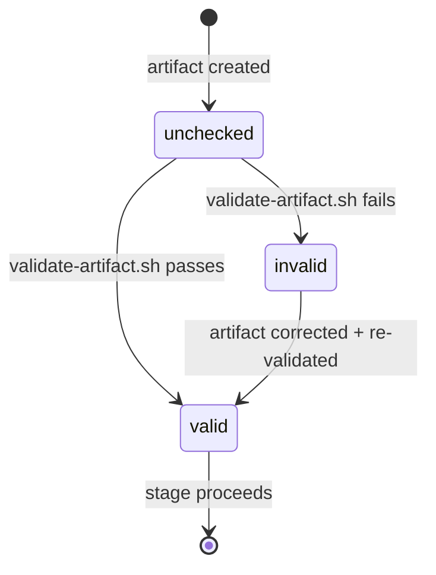

# Data Model: Gofer Engineering Gap Remediation

## Entities

### PipelineState

Persisted at `.specify/specs/{feature}/pipeline-state.json`.

| Field           | Type              | Required | Description                                                |
| --------------- | ----------------- | -------- | ---------------------------------------------------------- |
| runId           | string (UUID v4)  | Yes      | Unique identifier for this pipeline execution              |
| featureId       | string            | Yes      | Feature directory name (e.g., "002-gofer-gap-remediation") |
| featureDir      | string            | Yes      | Absolute path to feature spec directory                    |
| currentStage    | string            | Yes      | Current pipeline stage (e.g., "3_plan")                    |
| completedStages | string[]          | Yes      | Ordered list of completed stage names                      |
| startedAt       | string (ISO-8601) | Yes      | When the pipeline run began                                |
| updatedAt       | string (ISO-8601) | Yes      | Last state update timestamp                                |
| status          | PipelineStatus    | Yes      | Current run status                                         |
| runMetrics      | RunMetrics        | No       | Accumulated metrics for this run                           |

**Validation Rules**:

- `runId` must be a valid UUID v4
- `currentStage` must be one of: `1_research`, `2_specify`, `3_plan`, `4_tasks`,
  `5_implement`, `6_validate`
- `completedStages` must be a subset of valid stage names, in order
- `startedAt` <= `updatedAt`

**Example**:

```json
{
  "runId": "a1b2c3d4-e5f6-7890-abcd-ef1234567890",
  "featureId": "002-gofer-gap-remediation",
  "featureDir": "/Users/dev/Code/gofer/.specify/specs/002-gofer-gap-remediation",
  "currentStage": "3_plan",
  "completedStages": ["1_research", "2_specify"],
  "startedAt": "2026-02-28T14:00:00Z",
  "updatedAt": "2026-02-28T15:30:00Z",
  "status": "in_progress",
  "runMetrics": {
    "totalTokens": 92000,
    "estimatedCostUsd": 1.84,
    "compactionCount": 0,
    "stageTimings": {
      "1_research": "PT15M",
      "2_specify": "PT10M"
    }
  }
}
```

### ArtifactSchema

Stored as JSON Schema files in `extension/src/schemas/`.

| Field       | Type     | Required | Description                                           |
| ----------- | -------- | -------- | ----------------------------------------------------- |
| $schema     | string   | Yes      | JSON Schema draft reference                           |
| $id         | string   | Yes      | Schema identifier (e.g., "artifact-spec.schema.json") |
| title       | string   | Yes      | Human-readable schema title                           |
| description | string   | Yes      | What this schema validates                            |
| type        | "object" | Yes      | Always "object" for frontmatter                       |
| properties  | object   | Yes      | Field definitions with types and constraints          |
| required    | string[] | Yes      | List of required field names                          |

**Schemas to create**:

1. `artifact-spec.schema.json` — spec.md frontmatter
   - Required: `id`, `title`, `status`, `created`
   - Optional: `updated`, `author`, `priority`, `assignee`, `dependencies`

2. `artifact-plan.schema.json` — plan.md frontmatter
   - Required: `feature`, `spec`, `status`, `created`
   - Optional: `research`, `updated`

3. `artifact-tasks.schema.json` — tasks.md frontmatter
   - Required: `feature`, `plan`, `status`, `created`
   - Optional: `updated`, `totalTasks`, `completedTasks`

### RunLedgerEntry

Appended to `.specify/logs/gofer-run-ledger.jsonl`.

| Field     | Type                           | Required | Description                                                         |
| --------- | ------------------------------ | -------- | ------------------------------------------------------------------- |
| runId     | string (UUID)                  | Yes      | Correlates to PipelineState.runId                                   |
| timestamp | string (ISO-8601)              | Yes      | When the event occurred                                             |
| eventType | RunLedgerEventType             | Yes      | Category of event                                                   |
| stage     | string                         | Yes      | Pipeline stage that generated the event                             |
| feature   | string                         | Yes      | Feature directory name                                              |
| source    | string                         | Yes      | Subsystem name (e.g., "log-stage", "context-health", "scope-guard") |
| severity  | "info" \| "warning" \| "error" | Yes      | Event severity                                                      |
| data      | object                         | No       | Event-specific payload                                              |

**Event Types**:

- `stage_start` — Pipeline stage began
- `stage_complete` — Pipeline stage finished
- `stage_error` — Pipeline stage encountered an error
- `health_warning` — Context health crossed warning threshold
- `health_critical` — Context health crossed critical threshold
- `scope_violation` — ScopeGuard detected a boundary violation
- `slop_fix` — SlopReducer applied an auto-fix
- `validation_finding` — Validation agent reported a finding
- `budget_warning` — Cost approaching budget limit
- `budget_exceeded` — Cost exceeded budget limit

### ToolAuditEntry

Appended to `.specify/logs/tool-audit.jsonl`.

| Field            | Type                               | Required | Description                                          |
| ---------------- | ---------------------------------- | -------- | ---------------------------------------------------- |
| timestamp        | string (ISO-8601)                  | Yes      | When the check occurred                              |
| runId            | string (UUID)                      | Yes      | Correlates to PipelineState.runId                    |
| agent            | string                             | Yes      | Name of the agent/component that triggered the check |
| filePath         | string                             | Yes      | File path that was checked                           |
| protectedPattern | string \| null                     | Yes      | Matching pattern, or null if no violation            |
| enforcement      | ScopeEnforcementMode               | Yes      | Mode at time of check                                |
| outcome          | "allowed" \| "warned" \| "blocked" | Yes      | Result of the check                                  |

### CostBudget

Configuration in VSCode settings, tracked at runtime.

| Field            | Type                                   | Required | Description                                |
| ---------------- | -------------------------------------- | -------- | ------------------------------------------ |
| maxCostUsd       | number                                 | Yes      | Maximum dollar spend per pipeline run      |
| maxTokensPerRun  | number                                 | Yes      | Maximum total tokens per pipeline run      |
| enforcementMode  | "advisory" \| "truncate" \| "blocking" | Yes      | What to do when budget exceeded            |
| currentCostUsd   | number                                 | Runtime  | Accumulated cost so far                    |
| currentTokens    | number                                 | Runtime  | Accumulated tokens so far                  |
| warningThreshold | number                                 | Yes      | Percentage at which to warn (default: 0.8) |

## State Transitions

### Pipeline State



### Artifact Validation



## Indexing / Query Patterns

- **Run Ledger by runId**: `grep '"runId":"UUID"' gofer-run-ledger.jsonl` —
  primary query
- **Run Ledger by stage**: `grep '"stage":"3_plan"' gofer-run-ledger.jsonl`
- **Run Ledger by eventType**:
  `grep '"eventType":"scope_violation"' gofer-run-ledger.jsonl`
- **Tool Audit by agent**: `grep '"agent":"autonomous-driver"' tool-audit.jsonl`
- **Pipeline State**: Direct JSON read (single file per feature)
