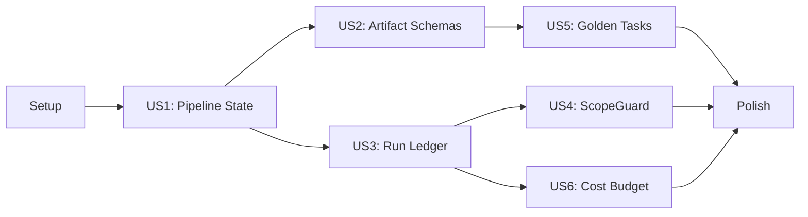

# Tasks: Gofer Engineering Gap Remediation

## Overview

- **Total Tasks**: 50
- **Parallel Opportunities**: 24 tasks marked [P]
- **User Stories**: 6 (US1-US6) across 8 phases
- **New Files**: ~20
- **Modified Files**: ~17

## Phase Mapping (tasks.md ↔ plan.md)

| tasks.md Phase  | plan.md Phase    | Content                       |
| --------------- | ---------------- | ----------------------------- |
| Phase 1: Setup  | Phase 1 (part 1) | Schema file only              |
| Phase 2: US1    | Phase 1 (part 2) | Pipeline state implementation |
| Phase 3: US2    | Phase 2          | Artifact schemas + validation |
| Phase 4: US3    | Phase 3          | Unified run ledger            |
| Phase 5: US4    | Phase 4          | ScopeGuard + tool audit       |
| Phase 6: US5    | Phase 5          | Golden task regression        |
| Phase 7: US6    | Phase 6          | Cost budget enforcement       |
| Phase 8: Polish | Phase 7          | Command file updates          |

## Dependencies



---

## Phase 1: Setup (Shared Infrastructure)

**Purpose**: Create JSON Schema for pipeline state — the foundation all other
phases depend on

- [ ] T001 [US1] Create `extension/src/schemas/pipeline-state.schema.json` with
      all fields from data-model.md: runId (UUID v4), featureId, featureDir,
      currentStage (enum of 6 values), completedStages[], startedAt (ISO-8601),
      updatedAt (ISO-8601), status (enum:
      initialized/in_progress/completed/error), runMetrics (optional)

**Verification**: Schema file validates against JSON Schema draft-07

---

## Phase 2: US1 — Pipeline State Machine (P1)

**Goal**: Persistent pipeline state with runId, readable from both bash and
TypeScript

**Story**: As a developer running the Gofer pipeline, I want persistent state
tracking so that context compression doesn't lose my pipeline position

**Independent Test**: Run `pipeline-state.sh init`, verify JSON output. Run
`pipeline-state.sh update --stage 3_plan`, verify stage transitions. Create
corrupt JSON, verify graceful fallback.

### Implementation

- [ ] T002 [US1] Create `.specify/scripts/bash/pipeline-state.sh` — bash script
      with `init`, `read`, `update`, `status` commands. Uses `jq` with Python3
      fallback. `init` generates UUID runId via
      `uuidgen || python3 -c 'import uuid; print(uuid.uuid4())'`. Validates
      stage names against enum. Includes `--feature-dir DIR` and `--json`
      options per contracts/internal-api.md
- [ ] T003 [P] [US1] Create `extension/src/autonomous/PipelineStateManager.ts`
      following ContextUsageLogger pattern — typed PipelineState interface,
      `async init(workspaceRoot, featureId)`, `async readState()`,
      `async updateStage(stage)`, `getRunId()`, lazy directory creation via
      `fs.promises.mkdir({recursive: true})`, graceful fallback on corrupt JSON
- [ ] T004 [P] [US1] Create `tests/unit/autonomous/PipelineStateManager.test.ts`
      — test init creates valid JSON with UUID runId, update transitions
      currentStage and appends to completedStages, corrupt file falls back to
      re-init, read returns typed PipelineState, concurrent writes don't corrupt
- [ ] T005 [US1] Create `tests/unit/scripts/pipeline-state.test.ts` — Vitest
      test that shells out to `pipeline-state.sh init`, verifies JSON output
      matches schema, tests `update --stage`, tests `status` returns stage name,
      tests invalid stage name rejection

**Verification**:

- [ ] AC-1.1: `pipeline-state.sh init` creates valid JSON with UUID runId
- [ ] AC-1.3: All four operations (init/read/update/status) work correctly
- [ ] AC-1.5: `pipeline-state.json` includes a UUID `runId`
- [ ] All unit tests pass

---

## Phase 3: US2 — Typed Artifact Schemas + Validation (P1)

**Goal**: JSON Schema definitions for artifacts + bash validation script +
command file schema sections

**Story**: As a developer, I want automatic validation of pipeline artifacts so
that malformed specs don't propagate through stages

**Independent Test**: Create spec.md with missing required sections, run
`validate-artifact.sh spec <path> --json` — expect specific error messages.
Create valid spec.md — expect pass.

**Depends on**: Phase 2 (T001 schema pattern established)

### Implementation

- [ ] T006 [P] [US2] Create `extension/src/schemas/artifact-spec.schema.json` —
      required: id (string), title (string), status (enum:
      draft/ready/approved), created (string, date format); optional: updated,
      author, priority, assignee, dependencies. No `additionalProperties: false`
      to allow extensibility
- [ ] T007 [P] [US2] Create `extension/src/schemas/artifact-plan.schema.json` —
      required: feature (string), spec (string), status (enum:
      draft/ready/approved), created (string); optional: research, updated. No
      `additionalProperties: false`
- [ ] T008 [P] [US2] Create `extension/src/schemas/artifact-tasks.schema.json` —
      required: feature (string), plan (string), status (enum:
      draft/review/approved/ready), created (string); optional: updated,
      totalTasks, completedTasks, approvedBy, approvedAt. No
      `additionalProperties: false`
- [ ] T009 [US2] Create `.specify/scripts/bash/validate-artifact.sh` — accepts
      `<artifact-type> <file-path> [--json] [--strict] [--schema-dir DIR]`.
      Parses YAML frontmatter between `---` markers with `sed`. Validates
      frontmatter fields against schema (report specific missing/invalid
      fields). Checks required markdown sections per artifact type (spec:
      `## User Scenarios` OR `## User Stories`, `## Functional Requirements` OR
      `## Requirements`, `## Success Criteria`; plan: `## Implementation Phases`
      OR `## Phases`, `## Tech Stack` OR `## Technical Context`; tasks: at least
      one `- [ ]` task line). Exit code 0 on pass, 1 on validation error, 2 on
      file not found. Legacy specs without frontmatter produce warning not error
- [ ] T010 [US2] Modify `.specify/scripts/bash/check-prerequisites.sh` — after
      existing file-existence checks, call `validate-artifact.sh` for each found
      artifact. Include validation results in `--json` output as
      `validationErrors[]` array. When `pipeline-state.json` exists, include
      `currentStage` and `runId` in JSON output. Non-blocking: validation
      warnings don't prevent pipeline continuation
- [ ] T011 [P] [US2] Add `## Required Output Schema` section to
      `.claude/commands/1_gofer_research.md` — document required research.md
      frontmatter (date, researcher, feature, status) and required sections
      (Feature Summary, Codebase Analysis, Technology Decisions)
- [ ] T012 [P] [US2] Add `## Required Output Schema` section to
      `.claude/commands/2_gofer_specify.md` — document required spec.md
      frontmatter (id, title, status, created) and required sections (User
      Stories/Scenarios, Functional Requirements, Success Criteria) that the LLM
      must produce
- [ ] T013 [P] [US2] Add `## Required Output Schema` section to
      `.claude/commands/3_gofer_plan.md` — document required plan.md frontmatter
      (feature, spec, status, created) and required sections (Technical Context,
      Implementation Phases)
- [ ] T014a [P] [US2] Add `## Required Output Schema` section to
      `.claude/commands/4_gofer_tasks.md` — document required tasks.md
      frontmatter (feature, plan, status, created) and format (at least one
      `- [ ]` task line)
- [ ] T014b [P] [US2] Add `## Required Output Schema` section to
      `.claude/commands/5_gofer_implement.md` — document that this stage
      produces source code files matching plan.md file structure (no structured
      artifact schema, but document expected output conventions)
- [ ] T014c [P] [US2] Add `## Required Output Schema` section to
      `.claude/commands/6_gofer_validate.md` — document required
      validation-report.md structure (scoring rubric output, findings format,
      pass/fail criteria)
- [ ] T014d [US2] Create `tests/unit/scripts/validate-artifact.test.ts` — test
      valid spec passes, missing frontmatter id field fails with specific error,
      missing `## Requirements` section fails with specific error, legacy spec
      without frontmatter produces warning not error, --json output is valid
      JSON, --strict treats warnings as errors

**Verification**:

- [ ] AC-2.1: JSON Schema files exist for spec, plan, and tasks
- [ ] AC-2.2: `validate-artifact.sh` validates frontmatter + sections
- [ ] AC-2.3: Error messages include specific field names
- [ ] AC-2.4: All 6 command files include Required Output Schema sections
- [ ] AC-2.5: `check-prerequisites.sh` calls validation
- [ ] AC-2.6: Extra fields/sections pass validation (additive)
- [ ] All unit tests pass

---

## Phase 4: US3 — Unified Run Ledger (P2)

**Goal**: Single JSONL log correlating all subsystem events under a shared runId

**Story**: As a Gofer maintainer, I want a unified event ledger so that I can
filter all pipeline events by a single runId to debug failures

**Independent Test**: Create a RunLedger instance, log 5 events with the same
runId, call `filterByRunId()` — verify all 5 returned. Log events with 2
different runIds — verify correct filtering.

**Depends on**: Phase 2 (runId comes from pipeline-state.json)

### Implementation

- [ ] T015 [US3] Create `extension/src/autonomous/RunLedger.ts` — typed
      `RunLedgerEntry` interface (runId, timestamp, eventType, stage, feature,
      source, severity, data?), `RunLedgerEventType` union type, class with
      `constructor(workspaceRoot)`, `async log(entry)` (non-blocking append to
      `.specify/logs/gofer-run-ledger.jsonl`), `async readLog(limit?)`,
      `async filterByRunId(runId)`, `async filterByEventType(eventType)`,
      `async filterByStage(stage)`, `getLogPath()`. Follow ContextUsageLogger
      pattern: lazy dir creation, `fs.promises.appendFile`, JSON.stringify per
      line
- [ ] T016 [US3] Modify `.specify/scripts/bash/log-stage.sh` — in addition to
      existing `pipeline.jsonl` write, append a JSONL entry to
      `gofer-run-ledger.jsonl` with `runId` read from `pipeline-state.json` (if
      available). Entry format matches RunLedgerEntry:
      `{"runId":"...", "timestamp":"...", "eventType":"stage_start|stage_complete|stage_error", "stage":"...", "feature":"...", "source":"log-stage", "severity":"info|error"}`
- [ ] T017 [US3] Modify `extension/src/autonomous/ContextUsageLogger.ts` — add
      `setRunLedger(ledger: RunLedger)` method. Add `private emitMilestone()`
      that emits to RunLedger on health status transitions (healthy→warning,
      warning→critical) only, NOT on every 10s poll. Event types:
      `health_warning`, `health_critical`
- [ ] T018 [P] [US3] Modify `extension/src/autonomous/SlopReducer.ts` — add
      `setRunLedger(ledger: RunLedger)` method. After each successful fix, emit
      a `slop_fix` event to RunLedger with data:
      `{pattern, filePath, fixDescription}`
- [ ] T019 [US3] Create `tests/unit/autonomous/RunLedger.test.ts` — test: log
      creates file on first write, entries are valid JSON per line, readLog
      returns all entries, filterByRunId returns only matching,
      filterByEventType returns only matching, filterByStage returns only
      matching, concurrent writes don't corrupt, readLog with limit returns
      correct count
- [ ] T020 [P] [US3] Create `tests/unit/scripts/log-stage-ledger.test.ts` —
      test: after `log-stage.sh 3_plan --complete`, both `pipeline.jsonl` and
      `gofer-run-ledger.jsonl` contain entries, ledger entry has runId from
      pipeline-state.json

**Verification**:

- [ ] AC-3.1: RunLedger writes to gofer-run-ledger.jsonl
- [ ] AC-3.2: Every entry has runId, timestamp, eventType, stage, feature
- [ ] AC-3.3: runId comes from pipeline-state.json
- [ ] AC-3.4: Existing loggers emit milestone events to ledger
- [ ] AC-3.5: Only milestones, not 10s polls
- [ ] AC-3.6: log-stage.sh writes to both log files
- [ ] AC-3.7: filterByRunId and filterByEventType work correctly
- [ ] All unit tests pass

---

## Phase 5: US4 — ScopeGuard Activation + Tool Audit (P2)

**Goal**: Activate dormant ScopeGuard, add tool audit logging, wire into
extension lifecycle

**Story**: As a developer using the autonomous pipeline, I want ScopeGuard
active so that I'm warned when agents modify files outside spec-defined
boundaries

**Independent Test**: Create spec.md with Protected Boundaries listing
`extension/src/extension.ts`. Instantiate ScopeGuard, load from spec, call
`check('extension/src/extension.ts')` — verify it returns the pattern, logs to
tool-audit.jsonl, and emits to run ledger.

**Depends on**: Phase 4 (RunLedger for audit emission)

### Implementation

- [ ] T021 [US4] Create `extension/src/autonomous/ToolAuditLogger.ts` — typed
      `ToolAuditEntry` interface (timestamp, runId, agent, filePath,
      protectedPattern, enforcement, outcome), class with
      `constructor(workspaceRoot, runLedger?)`, `async logCheck(entry)` (append
      to `.specify/logs/tool-audit.jsonl`), `async readLog(limit?)`,
      `getLogPath()`. If RunLedger provided, also emit `scope_violation` event
      to ledger on warned/blocked outcomes
- [ ] T022 [US4] Modify `extension/src/autonomous/ScopeGuard.ts` — change
      default enforcement from `'advisory'` to `'warning'` (line 29). Add
      `export class ScopeViolationError extends Error` with fields: `filePath`,
      `protectedPattern`, `enforcement`. In `check()` method: if mode is
      `blocking` and pattern matches, throw `ScopeViolationError` instead of
      returning pattern. Add `setToolAuditLogger(logger: ToolAuditLogger)`
      method. Call audit logger in `check()` for every invocation (outcome:
      allowed/warned/blocked)
- [ ] T023 [US4] Add `gofer.scopeGuard.mode` setting — follow ConfigManager
      3-step pattern: (1) add to `CONFIG_KEYS` in `extension/src/config.ts`, (2)
      add default `'warning'` to `DEFAULTS`, (3) add
      `getScopeGuardMode(): ScopeEnforcementMode` getter. Add property to
      `extension/package.json` `contributes.configuration.properties` with enum:
      `advisory`, `warning`, `blocking`
- [ ] T024 [US4] Modify `extension/src/extension.ts` `initializeForWorkspace()`
      — after workspace detection, instantiate ScopeGuard, call `loadFromSpec()`
      with current spec path (if spec exists), set mode from ConfigManager
      `getScopeGuardMode()`, create ToolAuditLogger and wire to ScopeGuard via
      `setToolAuditLogger()`. Verify that ScopeGuard violations flow through
      existing EventHandlers diagnostic mapping to produce VSCode diagnostics
      (Information/Warning/Error severity). Wire into StateManager if available.
      IMPORTANT: do this in the async `initializeForWorkspace()`, NOT in
      synchronous `activate()`
- [ ] T025 [P] [US4] Wire ToolAuditLogger into ScopeGuard — in
      `ScopeGuard.check()`, after determining match/no-match, call
      `this.auditLogger?.logCheck({timestamp, runId, agent, filePath, protectedPattern, enforcement, outcome})`.
      Agent name comes from a new `setAgentName(name)` method or constructor
      parameter
- [ ] T026 [P] [US4] Create `tests/unit/autonomous/ToolAuditLogger.test.ts` —
      test: logCheck appends to JSONL file, readLog returns entries, RunLedger
      receives scope_violation on warned outcome, allowed outcome not emitted to
      ledger, entries have all required fields
- [ ] T027 [US4] Create `tests/unit/autonomous/ScopeGuard.test.ts` — test:
      warning mode returns pattern and produces diagnostic-mappable result,
      blocking mode throws ScopeViolationError, advisory mode logs to
      console.warn only, audit entries created for every check, mode change via
      setter works

**Verification**:

- [ ] AC-4.1: ScopeGuard instantiated in initializeForWorkspace()
- [ ] AC-4.2: Default mode is 'warning'
- [ ] AC-4.3: Mode configurable via gofer.scopeGuard.mode setting
- [ ] AC-4.4: Violations produce diagnostics (via existing EventHandlers
      mapping)
- [ ] AC-4.5: tool-audit.jsonl created with proper entries
- [ ] AC-4.6: Audit entries emitted to run ledger
- [ ] AC-4.7: Blocking mode throws ScopeViolationError
- [ ] All unit tests pass

---

## Phase 6: US5 — Golden Task Regression Suite (P3)

**Goal**: Known-good feature specs validated on every test run

**Story**: As a maintainer, I want golden task regression tests so that changes
to validation scripts or command prompts don't silently break artifact quality

**Independent Test**: Run
`npx vitest run tests/regression/validate-golden-tasks.test.ts` — all golden
tasks pass. Intentionally remove a required frontmatter field from a golden task
— test fails with specific error.

**Depends on**: Phase 3 (artifact schemas exist for validation)

### Implementation

- [ ] T028 [US5] Create `tests/regression/golden-tasks/` directory structure and
      `tests/regression/golden-tasks/001-engineering-remediation/` subdirectory
- [ ] T029 [US5] Curate first golden task from
      `.specify/specs/001-gofer-engineering-remediation/` — copy spec.md,
      plan.md, tasks.md with minimal valid frontmatter. Ensure all required
      fields present per artifact schemas. Strip large content sections to keep
      fixtures small
- [ ] T030 [US5] Create `tests/regression/validate-golden-tasks.test.ts` — uses
      `fs.readdirSync` to iterate golden task dirs, for each dir runs
      `validate-artifact.sh` (via `child_process.execFile`) on
      spec.md/plan.md/tasks.md if they exist, asserts exit code 0, on failure
      reports specific golden task name + artifact + validation error from
      stderr/stdout
- [ ] T031 [P] [US5] Create at least 2 additional golden tasks — can be
      synthetic with valid structure (e.g., `002-sample-feature/spec.md` with
      minimal but valid frontmatter and required sections,
      `003-minimal-spec/spec.md` with just the required minimum). Must pass
      `validate-artifact.sh`
- [ ] T032 [P] [US5] Create `tests/regression/README.md` — document: what golden
      tasks are, how to add one (copy spec dir, verify with
      `validate-artifact.sh`, commit), minimum required artifacts, naming
      convention (NNN-description/), curation criteria (must pass all
      validation, should represent real usage patterns)
- [ ] T033 [US5] Verify golden task tests run as part of `npm test` — check
      `vitest.config.ts` `include` patterns cover
      `tests/regression/**/*.test.ts`. If not, add the pattern. Run `npm test`
      and verify golden task tests appear in output

**Verification**:

- [ ] AC-5.1: `tests/regression/golden-tasks/` contains ≥3 golden task
      directories
- [ ] AC-5.2: `validate-golden-tasks.test.ts` exists and iterates all golden
      tasks
- [ ] AC-5.3: First golden task curated from real 001-engineering-remediation
- [ ] AC-5.4: Test failures identify specific golden task + artifact + error
- [ ] AC-5.5: Golden tasks run as part of `npm test`
- [ ] AC-5.6: README.md documents the curation process
- [ ] All tests pass

---

## Phase 7: US6 — Cost Budget Enforcement (P3)

**Goal**: Configurable cost/token limits with enforcement via ContextBuilder

**Story**: As a developer, I want configurable cost budgets so that pipeline
runs don't exceed acceptable token/dollar limits

**Independent Test**: Create CostBudgetEnforcer with $1.00 budget. Record usage
of 400K input tokens + 100K output tokens (~$0.90). Verify status is 'warning'.
Record more usage exceeding $1.00. Verify canProceed() returns false in blocking
mode.

**Depends on**: Phase 4 (RunLedger for budget events)

### Implementation

- [ ] T034 [US6] Create `extension/src/autonomous/CostBudgetEnforcer.ts` — typed
      `CostBudgetConfig` interface (maxCostUsd default 10.0, maxTokensPerRun
      default 500000, enforcementMode, warningThreshold default 0.8),
      `CostSnapshot` interface (currentCostUsd, currentTokens, percentUsed,
      status), class with `constructor(config, runLedger?)`,
      `recordUsage(inputTokens, outputTokens, providerId?)` returns CostSnapshot
      and emits budget_warning/budget_exceeded to ledger when thresholds
      crossed, `canProceed()` returns boolean, `getSnapshot()`, `reset()`. Cost
      estimation: import per-provider rates from council UsageLogger (reuse,
      don't duplicate). On first warning threshold crossing, fire
      `vscode.window.showWarningMessage('Pipeline budget at X% ($Y.YY / $Z.ZZ)')`
      notification popup in addition to ledger event
- [ ] T035 [US6] Add budget settings to ConfigManager — follow 3-step pattern:
      (1) `CONFIG_KEYS` entries for `gofer.budgets.maxCostUsd`,
      `gofer.budgets.maxTokensPerRun`, `gofer.budgets.enforcementMode`; (2)
      `DEFAULTS` entries with 10.0, 500000, 'advisory'; (3) typed getters
      `getBudgetMaxCostUsd(): number`, `getBudgetMaxTokensPerRun(): number`,
      `getBudgetEnforcementMode(): string`. Add properties to
      `extension/package.json` contributes.configuration
- [ ] T036 [US6] Wire CostBudgetEnforcer into ContextBuilder — in
      `extension/src/autonomous/ContextBuilder.ts`, check budget on each context
      build. If `canProceed()` is false: advisory mode logs warning, truncate
      mode reduces context aggressively (lower budgets), blocking mode returns
      error result. Create enforcer in `initializeForWorkspace()` with config
      from ConfigManager
- [ ] T037 [US6] Modify `extension/src/ui/ContextHealthStatusBar.ts` — extend
      tooltip or status text to show budget info: "Budget: $X.XX / $Y.YY (Z%)"
      alongside existing context health. Show budget warning icon when status is
      'warning' or 'exceeded'
- [ ] T038 [P] [US6] Wire budget events to RunLedger — in
      CostBudgetEnforcer.recordUsage(), when status transitions to 'warning',
      emit `budget_warning` event to RunLedger. When status transitions to
      'exceeded', emit `budget_exceeded` event. Include
      `{currentCostUsd, maxCostUsd, percentUsed}` in event data
- [ ] T039 [US6] Create `tests/unit/autonomous/CostBudgetEnforcer.test.ts` —
      test: initial state is 'healthy', recordUsage accumulates correctly,
      warning at 80% threshold, exceeded at 100%, canProceed false when exceeded
      in blocking mode, canProceed true when exceeded in advisory mode, reset
      clears state, ledger receives budget events, getSnapshot returns current
      state

**Verification**:

- [ ] AC-6.1: maxCostUsd setting exists with default 10.0
- [ ] AC-6.2: maxTokensPerRun setting exists with default 500000
- [ ] AC-6.3: enforcementMode setting exists with advisory/truncate/blocking
- [ ] AC-6.4: ContextBuilder tracks cumulative cost
- [ ] AC-6.5: Warning at 80% threshold
- [ ] AC-6.6: Enforcement at 100% (behavior depends on mode)
- [ ] AC-6.7: Status bar shows budget info
- [ ] AC-6.8: Budget events emitted to ledger
- [ ] All unit tests pass

---

## Phase 8: Polish & Command File Updates

**Goal**: Update all command files with pipeline-state.sh calls, sync mirrors,
final integration

**Depends on**: Phases 2-7 (all core implementation complete)

### Command File Updates

- [x] T040 [US1] Modify `.claude/commands/0_business_scenario.md` — add
      instruction to read `pipeline-state.json` for resume logic: "Before
      file-existence checks, read pipeline-state.json with
      `pipeline-state.sh read --json`. If it exists and status is 'in_progress',
      resume from `currentStage`. This takes priority over file-existence
      heuristics."
- [x] T041 [P] Modify `.claude/commands/1_gofer_research.md` — add instruction
      at stage completion: "Run `pipeline-state.sh update --stage 1_research` to
      record stage completion in pipeline-state.json"
- [x] T042 [P] Modify `.claude/commands/2_gofer_specify.md` — add instruction at
      stage completion: "Run `pipeline-state.sh update --stage 2_specify`"
- [x] T043 [P] Modify `.claude/commands/3_gofer_plan.md` — add instruction at
      stage completion: "Run `pipeline-state.sh update --stage 3_plan`"
- [x] T044 [P] Modify `.claude/commands/4_gofer_tasks.md` — add instruction at
      stage completion: "Run `pipeline-state.sh update --stage 4_tasks`"
- [x] T045 [P] Modify `.claude/commands/5_gofer_implement.md` — add instruction
      at stage completion: "Run `pipeline-state.sh update --stage 5_implement`"
- [x] T046 [P] Modify `.claude/commands/6_gofer_validate.md` — add instruction
      at stage completion: "Run `pipeline-state.sh update --stage 6_validate`"

### Mirror Sync & Integration

- [x] T047 Verify all `extension/resources/claude-commands/` and
      `extension/resources/copilot-prompts/` mirrors are updated to match
      modified `.claude/commands/` files. If mirrors exist, copy updated files.
      If mirrors don't exist for these paths, skip.

**Verification**:

- [x] AC-1.2: Orchestrator reads pipeline-state.json for resume
- [x] AC-1.4: Each stage's command file calls pipeline-state.sh update
- [x] All command file mirrors stay in sync

---

## Parallel Execution Guide

Tasks marked [P] can run concurrently when they modify different files and have
no dependencies on incomplete tasks.

**Parallel groups by phase**:

| Group   | Tasks                                 | Rationale                                            |
| ------- | ------------------------------------- | ---------------------------------------------------- |
| Phase 2 | T003, T004                            | PipelineStateManager + its tests (independent files) |
| Phase 3 | T006, T007, T008                      | Three schema files (independent)                     |
| Phase 3 | T011, T012, T013, T014a, T014b, T014c | Six command file additions (independent)             |
| Phase 4 | T018, T020                            | SlopReducer mod + bash test (independent files)      |
| Phase 5 | T025, T026                            | Audit wiring + audit tests (independent)             |
| Phase 6 | T031, T032                            | Synthetic golden tasks + README (independent)        |
| Phase 8 | T041-T046                             | Six command file updates (independent files)         |

**Cross-phase parallelism**:

- Phase 5 (US4) and Phase 7 (US6) can run in parallel after Phase 4 (US3)
  completes
- Phase 6 (US5) can start as soon as Phase 3 (US2) schemas are done

---

## Implementation Strategy

1. **Foundation First**: Complete Phase 1-2 (Setup + Pipeline State) — this
   unblocks everything
2. **P1 Next**: Phase 3 (Artifact Schemas) — the #1 gap from the engineering
   review
3. **P2 Core**: Phase 4 (Run Ledger) — enables correlation for all later phases
4. **P2 Safety**: Phase 5 (ScopeGuard) — activate dormant protection
5. **P3 Quality**: Phase 6 (Golden Tasks) — regression safety net
6. **P3 Governance**: Phase 7 (Cost Budget) — spending guardrails
7. **Polish Last**: Phase 8 (Command Files) — wire everything together

**MVP Scope**: Phases 1-4 (Pipeline State + Artifact Schemas + Run Ledger)
delivers the two highest-priority gaps and the foundation.

---

## Dependencies & Execution Order

### Phase Dependencies

- **Phase 1 (Setup)**: No dependencies — start immediately
- **Phase 2 (US1 Pipeline State)**: Depends on Phase 1 (schema)
- **Phase 3 (US2 Artifact Schemas)**: Depends on Phase 1 pattern; can start in
  parallel with late Phase 2 tasks
- **Phase 4 (US3 Run Ledger)**: Depends on Phase 2 (runId from
  pipeline-state.json)
- **Phase 5 (US4 ScopeGuard)**: Depends on Phase 4 (RunLedger for audit
  emission)
- **Phase 6 (US5 Golden Tasks)**: Depends on Phase 3 (schemas for validation)
- **Phase 7 (US6 Cost Budget)**: Depends on Phase 4 (RunLedger for budget
  events)
- **Phase 8 (Polish)**: Depends on all previous phases

### Critical Path

```
T001 → T002 → T015 → T021 → T024 (longest chain: schema → state → ledger → audit → wiring)
```

### Within Each Phase

- Schema/interface tasks before implementation tasks
- Implementation tasks before integration tasks
- Integration tasks before test tasks (when tests validate the integration)
- Tests marked [P] can run in parallel with each other
