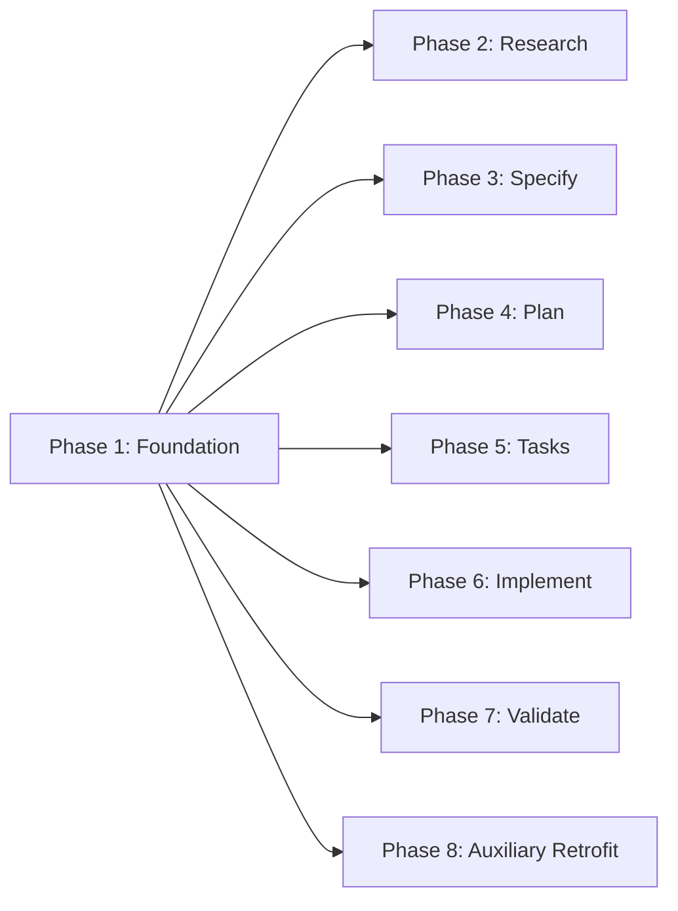

# Tasks: Multi-Perspective Sub-Agent Strategies

## Overview

- **Total Tasks**: 46
- **Parallel Opportunities**: 9 tasks marked [P]
- **User Stories**: 5 (US1-US5) across 8 phases

## Dependencies

## Protected Files

The following files must NOT be modified except as explicitly listed in tasks
below:

- `extension/src/council/**/*.ts` — Council module is not part of this feature
- `extension/src/progressProvider.ts` — No changes needed
- `extension/src/goferParser.ts` — Task parsing already works correctly
- `extension/src/autonomous/**/*.ts` — Autonomous mode is not part of this
  feature

---

## Phase 1: Foundation & Governance

**Goal**: Create the judge agent, add minimal-change enforcement, add tasks.md
file watcher

**Story**: US1 (Diverge-Converge Framework), US4 (Minimal Change Enforcement),
US5 (Task Progress Visibility)

- [x] T001 [US1] Create `multi-perspective-judge.md` agent file in
      `.claude/agents/` — the convergence/synthesis agent used by all strategies
      (FR2)
- [x] T002 [US4] Add Principle VIII "Minimal Necessary Changes" to
      `.specify/memory/constitution.md` (FR4, AC4.2)
- [x] T003 [US4] Add "Minimal Changes Only" rule to
      `.claude/commands/5_gofer_implement.md` before the `### For Each Task`
      section (line ~253) (FR4, AC4.1, AC4.3, AC4.4)
- [x] T004 [US5] Add tasks.md file watcher to
      `extension/src/services/EventHandlers.ts` alongside existing spec.md
      watcher — use `FILE_PATTERNS.TASK_MARKDOWN` from `config.ts:111`, call
      `progressProvider.refresh()` on change and create (FR5, AC5.2)
- [x] T005 [US5] Add unit test for tasks.md watcher in
      `tests/unit/services/EventHandlers.test.ts` (FR5)

**Verification**:

- [ ] Judge agent file has all 7 required sections
- [ ] Constitution has Principle VIII
- [ ] Implement command has minimal-change rule before task loop
- [ ] TypeScript compiles: `cd extension && npm run compile`
- [ ] Tests pass: `npm test`

---

## Phase 2: Research Stage Agents (Strategies #6, #9, #20)

**Goal**: Create 3 research-stage agent files, retrofit model params on existing
research agents, integrate into pipeline

**Story**: US1 (Agent Files), US2 (Model Selection), US3 (Pipeline Integration)

- [x] T006 [US1] Create `research-perspective-multiplier.md` in
      `.claude/agents/` — 5 perspectives: (1) existing codebase, (2) open-source
      projects, (3) latest docs, (4) anti-patterns, (5) emerging approaches.
      Model: haiku for search angles, sonnet for analysis angles. (FR1, #6)
- [x] T007 [US1] Create `research-dependency-evaluator.md` in `.claude/agents/`
      — 3 perspectives: (1) evaluate proposed library, (2) find alternatives,
      (3) prototype without library. Model: haiku. (FR1, #9)
- [x] T008 [US1] Create `research-horizon-scanner.md` in `.claude/agents/` —
      single agent searching web for emerging alternatives. Model: sonnet. (FR1,
      #20)
- [x] T009 [US2] Retrofit model parameters on existing 3 research agent
      invocations in `.claude/commands/1_gofer_research.md` — codebase-locator:
      haiku, codebase-analyzer: sonnet, codebase-pattern-finder: haiku (FR3,
      AC2.4)
- [x] T010 [US3] Add optional multi-perspective research step to
      `.claude/commands/1_gofer_research.md` after existing Step 2 — invoke #6
      (converge: sonnet), #9 (converge: sonnet), #20 (single agent, no converge)
      strategies with judge synthesis (FR6, AC3.1)
- [x] T011 [P] [US3] Sync `.claude/commands/1_gofer_research.md` changes to
      `.github/prompts/1_gofer_research.prompt.md`,
      `extension/resources/claude-commands/1_gofer_research.md`,
      `extension/resources/copilot-prompts/1_gofer_research.prompt.md` (AC3.7).
      Note: `.prompt.md` extension for GitHub/Copilot locations.

**Verification**:

- [ ] 3 new agent files have all 7 required sections
- [ ] Each agent specifies recommended model in Important Guidelines
- [ ] All 4 copies of `1_gofer_research` are identical
- [ ] Existing research agents have model parameters

---

## Phase 3: Specify Stage Agents (Strategies #10, #19)

**Goal**: Create 2 specify-stage agent files, integrate into pipeline

**Story**: US1 (Agent Files), US3 (Pipeline Integration)

- [x] T012 [US1] Create `specify-ambiguity-detector.md` in `.claude/agents/` — 3
      agents independently interpret spec and write pseudocode; comparator finds
      divergences. Model: sonnet diverge, opus converge. (FR1, #10)
- [x] T013 [US1] Create `specify-journey-stress-tester.md` in `.claude/agents/`
      — 4 persona agents: power user, first-timer, accessibility-dependent,
      adversarial. Model: haiku diverge, sonnet converge. (FR1, #19)
- [x] T014 [US3] Add multi-perspective specify step to
      `.claude/commands/2_gofer_specify.md` before quality checklist — invoke
      #10 (converge: opus), #19 (converge: sonnet) strategies (FR6, AC3.2)
- [x] T015 [P] [US3] Sync `.claude/commands/2_gofer_specify.md` changes to
      `.github/prompts/2_gofer_specify.prompt.md`,
      `extension/resources/claude-commands/2_gofer_specify.md`,
      `extension/resources/copilot-prompts/2_gofer_specify.prompt.md` (AC3.7).
      Note: `.prompt.md` extension for GitHub/Copilot locations.

**Verification**:

- [ ] 2 new agent files have all 7 required sections
- [ ] All 4 copies of `2_gofer_specify` are identical

---

## Phase 4: Plan Stage Agents (Strategies #2, #5, #7, #12, #16)

**Goal**: Create 5 plan-stage agent files, integrate into pipeline

**Story**: US1 (Agent Files), US3 (Pipeline Integration)

- [x] T016 [US1] Create `plan-architecture-diverger.md` in `.claude/agents/` — 5
      agents each using different architectural pattern (microservices,
      monolithic, event-sourced, CQRS, plugin-based). Model: sonnet diverge,
      opus converge. (FR1, #2)
- [x] T017 [US1] Create `plan-api-comparator.md` in `.claude/agents/` — 3-4
      agents each designing API in different paradigm (REST, GraphQL, RPC,
      event-based). Model: sonnet diverge, opus converge. (FR1, #5)
- [x] T018 [US1] Create `plan-refactor-rewrite-advisor.md` in `.claude/agents/`
      — 2 agents: one plans minimal refactor, other plans clean rewrite. Model:
      sonnet diverge, opus converge. (FR1, #7)
- [x] T019 [US1] Create `plan-migration-path-finder.md` in `.claude/agents/` — 4
      agents: big bang, strangler fig, feature-flagged, adapter/facade. Model:
      sonnet diverge, opus converge. (FR1, #12)
- [x] T020 [US1] Create `plan-data-model-stress-tester.md` in `.claude/agents/`
      — 4 agents: 10x scale, concurrent access, schema evolution, edge-case
      shapes. Model: haiku diverge, sonnet converge. (FR1, #16)
- [x] T021 [US3] Add multi-perspective plan step to
      `.claude/commands/3_gofer_plan.md` after initial architecture — invoke #2
      (converge: opus), #5 (converge: opus), #7 (converge: opus), #12 (converge:
      opus), #16 (converge: sonnet) strategies (FR6, AC3.3)
- [x] T022 [P] [US3] Sync `.claude/commands/3_gofer_plan.md` changes to
      `.github/prompts/3_gofer_plan.prompt.md`,
      `extension/resources/claude-commands/3_gofer_plan.md`,
      `extension/resources/copilot-prompts/3_gofer_plan.prompt.md` (AC3.7).
      Note: `.prompt.md` extension for GitHub/Copilot locations.

**Verification**:

- [ ] 5 new agent files have all 7 required sections
- [ ] All 4 copies of `3_gofer_plan` are identical

---

## Phase 5: Tasks Stage Agents (Strategies #14, #18)

**Goal**: Create 2 tasks-stage agent files, add engineer-review invocation with
model param, integrate into pipeline

**Story**: US1 (Agent Files), US2 (Model Selection), US3 (Pipeline Integration)

- [x] T023 [US1] Create `tasks-cross-cutting-scanner.md` in `.claude/agents/` —
      5 agents scanning for: logging/observability, accessibility, i18n,
      backward compatibility, documentation. Model: haiku diverge, sonnet
      converge. (FR1, #14)
- [x] T024 [US1] Create `tasks-rollback-planner.md` in `.claude/agents/` —
      single agent planning rollback for each phase. Model: sonnet. (FR1, #18)
- [x] T025 [US2] Add `Task: subagent_type="engineer-review"` invocation to
      `.claude/commands/4_gofer_tasks.md` with `model: "sonnet"` —
      engineer-review agent exists as `.claude/agents/engineer-review.md` but is
      NOT currently invoked via Task syntax in any command; this adds the
      invocation as described in CLAUDE.md's engineer review gate (FR3, AC2.4)
- [x] T026 [US3] Add multi-perspective tasks step to
      `.claude/commands/4_gofer_tasks.md` after task breakdown — invoke #14
      (converge: sonnet), #18 strategies (FR6, AC3.4)
- [x] T027 [P] [US3] Sync `.claude/commands/4_gofer_tasks.md` changes to
      `.github/prompts/4_gofer_tasks.prompt.md`,
      `extension/resources/claude-commands/4_gofer_tasks.md`,
      `extension/resources/copilot-prompts/4_gofer_tasks.prompt.md` (AC3.7).
      Note: `.prompt.md` extension for GitHub/Copilot locations.

**Verification**:

- [ ] 2 new agent files have all 7 required sections
- [ ] Engineer-review invocation added with model: sonnet
- [ ] All 4 copies of `4_gofer_tasks` are identical

---

## Phase 6: Implement Stage Agents (Strategies #1, #3, #4, #8, #11, #15, #17)

**Goal**: Create 7 implement-stage agent files, integrate as per-task options

**Story**: US1 (Agent Files), US3 (Pipeline Integration)

- [x] T028 [US1] Create `implement-variant-generator.md` in `.claude/agents/` —
      3-5 agents each coding differently (functional, OOP, library-based,
      hand-rolled, event-driven). Model: sonnet diverge, opus converge. (FR1,
      #1)
- [x] T029 [US1] Create `implement-bug-triangulator.md` in `.claude/agents/` — 3
      agents: backward from symptom, forward from inputs, search for similar
      bugs. Model: sonnet diverge, opus converge. (FR1, #3)
- [x] T030 [US1] Create `implement-test-diversifier.md` in `.claude/agents/` — 4
      agents: happy-path, adversarial, property-based, real-world scenarios.
      Model: haiku/sonnet diverge, sonnet converge. (FR1, #4)
- [x] T031 [US1] Create `implement-error-hardener.md` in `.claude/agents/` — 2
      agents: one injects failures at boundaries, one searches for real-world
      incident reports. Model: haiku diverge, sonnet converge. (FR1, #8)
- [x] T032 [US1] Create `implement-performance-explorer.md` in `.claude/agents/`
      — 3 agents: caching, lazy loading, parallel execution. Model: sonnet
      diverge, opus converge. (FR1, #11)
- [x] T033 [US1] Create `implement-code-review-council.md` in `.claude/agents/`
      — 3 agents: readability, correctness, performance. Model: sonnet diverge,
      opus converge. (FR1, #15)
- [x] T034 [US1] Create `implement-doc-writer.md` in `.claude/agents/` — 3
      agents: end-user guide, developer API reference, ops/troubleshooting.
      Model: haiku diverge, sonnet converge. (FR1, #17)
- [x] T035 [US3] Add multi-perspective implement options to
      `.claude/commands/5_gofer_implement.md` — per-task invocation of #1
      (converge: opus), #3 (converge: opus), #4 (converge: sonnet), #8
      (converge: sonnet), #11 (converge: opus), #15 (converge: opus), #17
      (converge: sonnet) strategies with trigger conditions (FR6, AC3.5)
- [x] T036 [P] [US3] Sync `.claude/commands/5_gofer_implement.md` changes to
      `.github/prompts/5_gofer_implement.prompt.md`,
      `extension/resources/claude-commands/5_gofer_implement.md`,
      `extension/resources/copilot-prompts/5_gofer_implement.prompt.md` (AC3.7).
      Note: `.prompt.md` extension for GitHub/Copilot locations.

**Verification**:

- [ ] 7 new agent files have all 7 required sections
- [ ] All 4 copies of `5_gofer_implement` are identical
- [ ] Minimal change rule (from Phase 1) still present and undamaged

---

## Phase 7: Validate Stage Agent (Strategy #13) + Existing Agent Retrofit

**Goal**: Create security red team agent, retrofit model params on 6 existing
validation agents, integrate into pipeline

**Story**: US1 (Agent Files), US2 (Model Selection), US3 (Pipeline Integration)

- [x] T037 [US1] Create `validate-security-red-team.md` in `.claude/agents/` — 3
      agents: OWASP Top 10, business logic abuse, CVE search for specific
      libraries. Model: sonnet diverge, opus converge. (FR1, #13)
- [x] T038 [US2] Retrofit model parameters on existing 6 validation agent
      invocations in `.claude/commands/6_gofer_validate.md` —
      validation-correctness: sonnet, validation-security: sonnet,
      validation-performance: haiku, validation-test-quality: haiku,
      validation-integration: sonnet, validation-standards: sonnet (FR3, AC2.4)
- [x] T039 [US3] Add security red team step to
      `.claude/commands/6_gofer_validate.md` alongside existing validation —
      invoke #13 (converge: opus) strategy (FR6, AC3.6)
- [x] T040 [P] [US3] Sync `.claude/commands/6_gofer_validate.md` changes to
      `.github/prompts/6_gofer_validate.prompt.md`,
      `extension/resources/claude-commands/6_gofer_validate.md`,
      `extension/resources/copilot-prompts/6_gofer_validate.prompt.md` (AC3.7).
      Note: `.prompt.md` extension for GitHub/Copilot locations.

**Verification**:

- [ ] 1 new agent file has all 7 required sections
- [ ] All 6 existing validation agents have model parameters
- [ ] All 4 copies of `6_gofer_validate` are identical
- [ ] Full pipeline test: `npm test` passes with no regressions

---

## Phase 8: Auxiliary Command Model Retrofit

**Goal**: Retrofit model parameters on all remaining Task invocations in
auxiliary commands to achieve 100% coverage per AC2.1/FR3

**Story**: US2 (Cost-Optimized Model Selection)

- [x] T041 [US2] Retrofit model parameters on 3 existing agent invocations in
      `.claude/commands/gofer_hydrate.md` — codebase-analyzer: sonnet (line 53),
      codebase-locator: haiku (line 66), codebase-pattern-finder: haiku
      (line 79) (FR3, AC2.4)
- [x] T042 [US2] Retrofit model parameters on 2 existing agent invocations in
      `.claude/commands/gofer_constitution.md` — codebase-pattern-finder: haiku
      (line 96), codebase-analyzer: sonnet (line 403) (FR3, AC2.4)
- [x] T043 [US2] Retrofit model parameter on 1 existing agent invocation in
      `.claude/commands/9_gofer_tests.md` — codebase-pattern-finder: haiku
      (line 78) (FR3, AC2.4)
- [x] T044 [P] [US2] Sync `.claude/commands/gofer_hydrate.md` changes to
      `.github/prompts/gofer_hydrate.prompt.md`,
      `extension/resources/claude-commands/gofer_hydrate.md`,
      `extension/resources/copilot-prompts/gofer_hydrate.prompt.md` (AC3.7).
      Note: `.prompt.md` extension for GitHub/Copilot locations.
- [x] T045 [P] [US2] Sync `.claude/commands/gofer_constitution.md` changes to
      `.github/prompts/gofer_constitution.prompt.md`,
      `extension/resources/claude-commands/gofer_constitution.md`,
      `extension/resources/copilot-prompts/gofer_constitution.prompt.md`
      (AC3.7). Note: `.prompt.md` extension for GitHub/Copilot locations.
- [x] T046 [P] [US2] Sync `.claude/commands/9_gofer_tests.md` changes to
      `.github/prompts/9_gofer_tests.prompt.md`,
      `extension/resources/claude-commands/9_gofer_tests.md`,
      `extension/resources/copilot-prompts/9_gofer_tests.prompt.md` (AC3.7).
      Note: `.prompt.md` extension for GitHub/Copilot locations.

**Verification**:

- [ ] All Task invocations in `gofer_hydrate.md` have model parameters
- [ ] All Task invocations in `gofer_constitution.md` have model parameters
- [ ] All Task invocations in `9_gofer_tests.md` have model parameters
- [ ] All 4 copies of each auxiliary command are identical
- [ ] `grep -rn 'subagent_type=' .claude/commands/*.md | grep -v model` returns
      no results

---

## Parallel Execution Guide

Tasks marked [P] can run concurrently if they modify different files and have no
dependencies on incomplete tasks.

**Parallel groups**:

- T011, T015, T022, T027, T036, T040, T044, T045, T046 — Sync tasks (each syncs
  a different command file to 3 locations)

**Sequential constraints**:

- Within each phase, agent file creation (T006-T008, T012-T013, etc.) should
  complete before command integration (T010, T014, etc.)
- T003 (minimal change rule) must complete before T035 (implement command
  integration) to avoid conflicts
- T004-T005 (file watcher + test) should complete before Phase 2 begins

---

## Implementation Strategy

1. **Foundation First**: Complete Phase 1 (T001-T005) — judge agent, governance,
   file watcher
2. **Stage by Stage**: Phases 2-7 can proceed in order, each adding agents +
   command integration for one pipeline stage
3. **Auxiliary Retrofit**: Phase 8 (T041-T046) retrofits model parameters on
   auxiliary commands
4. **Sync After Each Phase**: Each phase ends with a sync task to keep all 4
   command locations identical
5. **Verify After Each Phase**: Run `npm test` and check agent file format

---

## Task-to-Story Mapping

| Story                                | Tasks                                                             | Coverage                                              |
| ------------------------------------ | ----------------------------------------------------------------- | ----------------------------------------------------- |
| US1 (Diverge-Converge Framework)     | T001, T006-T008, T012-T013, T016-T020, T023-T024, T028-T034, T037 | 21 agent files                                        |
| US2 (Cost-Optimized Model Selection) | T009, T025, T038, T041-T046                                       | 15 existing Task calls retrofitted + 1 new invocation |
| US3 (Pipeline Stage Integration)     | T010-T011, T014-T015, T021-T022, T026-T027, T035-T036, T039-T040  | 6 command integrations + syncs                        |
| US4 (Minimal Change Enforcement)     | T002, T003                                                        | Constitution + implement command                      |
| US5 (Task Progress Visibility)       | T004, T005                                                        | File watcher + test                                   |
