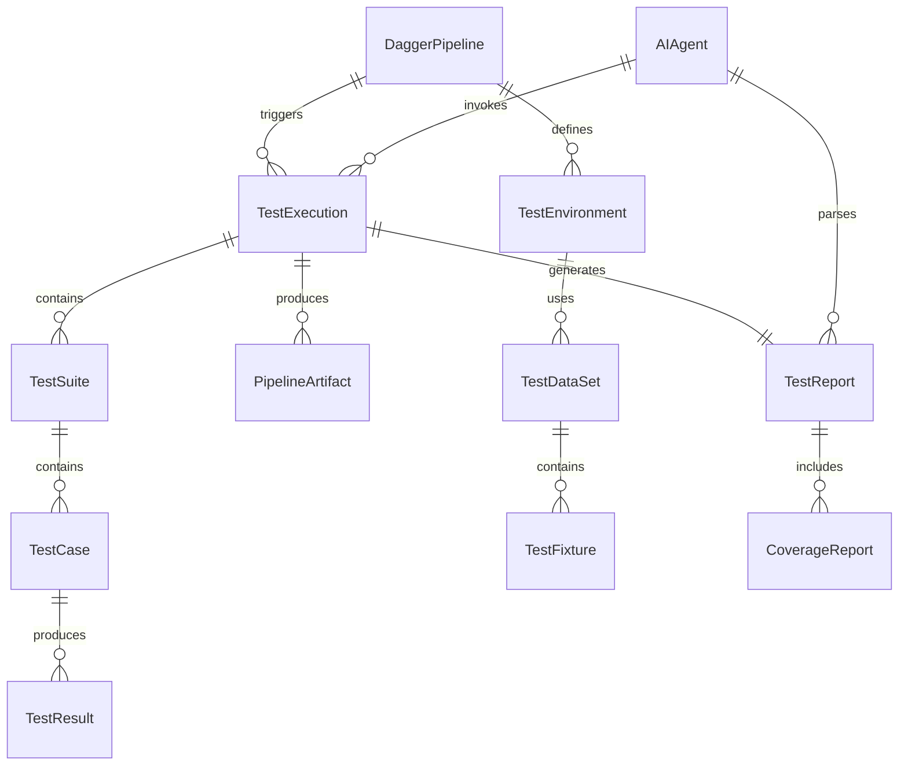
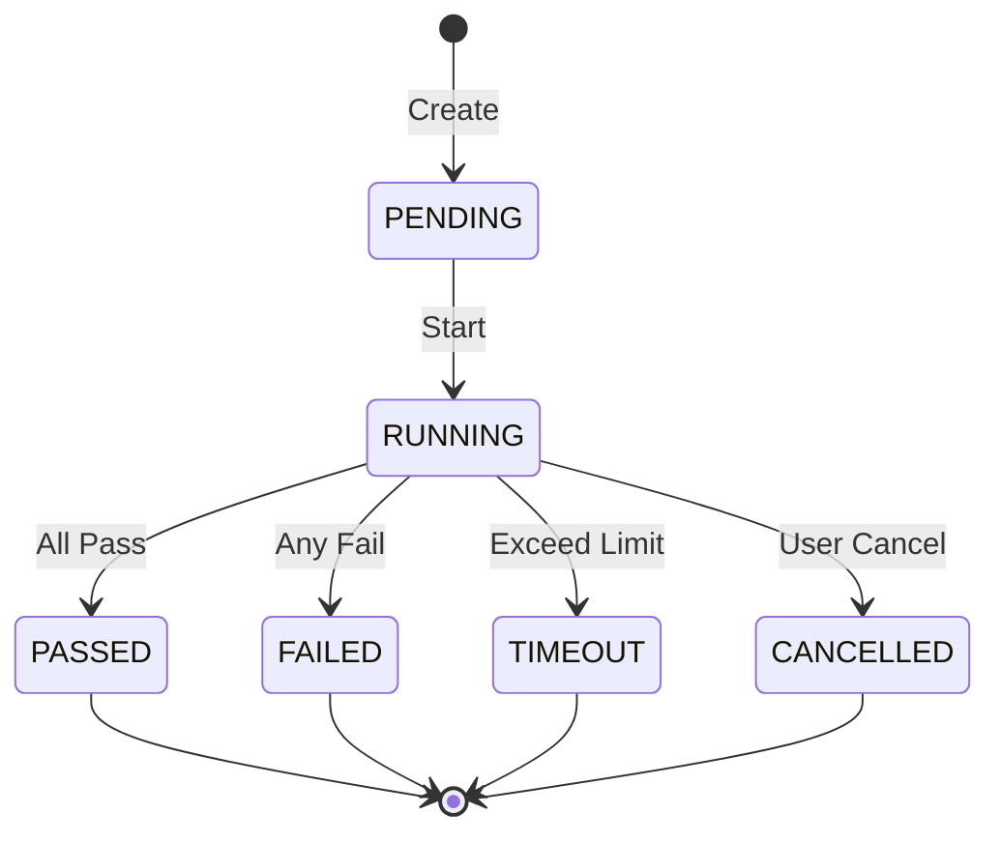
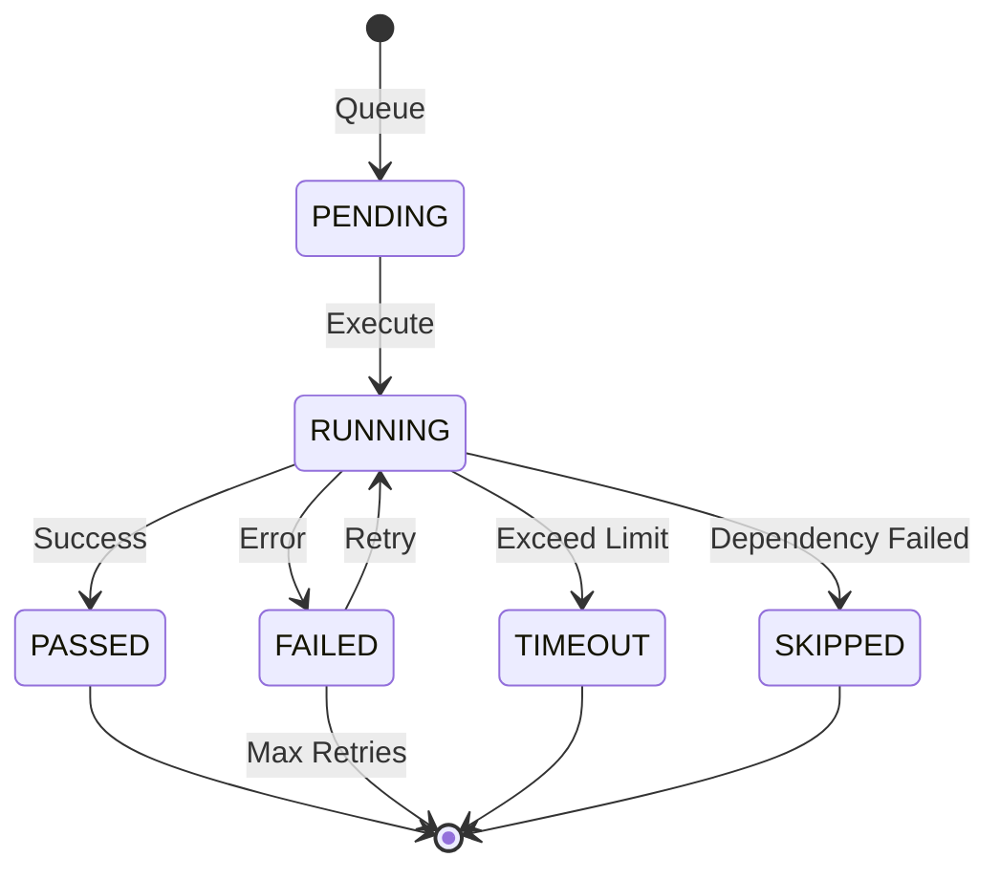

# Data Model: Dagger Test Orchestration

**Feature**: Dagger Test Orchestration for SpecGofer **Date**: 2025-11-02
**Version**: 1.0.0

## Entity Relationship Diagram



## Core Entities

### 1. DaggerPipeline

**Purpose**: Defines the complete test orchestration workflow

```typescript
interface DaggerPipeline {
  id: string; // UUID
  name: string; // e.g., "regression", "extension", "integration"
  version: string; // Semantic version
  description: string;
  configuration: {
    parallel: boolean; // Enable parallel execution
    maxConcurrency: number; // Max parallel containers
    timeout: number; // Pipeline timeout in seconds
    retryPolicy: {
      maxAttempts: number;
      backoffMultiplier: number;
      maxBackoff: number;
    };
  };
  stages: Array<{
    name: string;
    type: 'setup' | 'test' | 'teardown';
    dependencies: string[]; // Stage names that must complete first
    container: string; // Container configuration ID
  }>;
  triggers: Array<{
    type: 'manual' | 'commit' | 'schedule' | 'api';
    conditions?: Record<string, any>;
  }>;
  createdAt: Date;
  updatedAt: Date;
}
```

**Validation Rules**:

- `id`: UUID v4 format
- `name`: Alphanumeric with hyphens, max 50 chars
- `version`: Semantic versioning format
- `maxConcurrency`: Between 1 and 20
- `timeout`: Between 60 and 7200 seconds (1 min - 2 hours)

### 2. TestExecution

**Purpose**: Single run of a test pipeline

```typescript
interface TestExecution {
  id: string; // UUID
  pipelineId: string; // References DaggerPipeline
  status: TestExecutionStatus;
  startedAt: Date;
  completedAt?: Date;
  duration?: number; // milliseconds
  triggeredBy: {
    type: 'user' | 'ai_agent' | 'ci' | 'scheduled';
    identity: string; // User ID, agent ID, or system
    metadata?: Record<string, any>; // Additional context
  };
  environment: {
    nodeVersion: string;
    vscodeVersion: string;
    daggerVersion: string;
    containerRuntime: string;
  };
  summary: TestSummary;
  errors: TestError[];
  artifactPaths: string[];
  cacheHits: number; // Number of cache hits
  cacheMisses: number; // Number of cache misses
}

enum TestExecutionStatus {
  PENDING = 'pending',
  RUNNING = 'running',
  PASSED = 'passed',
  FAILED = 'failed',
  CANCELLED = 'cancelled',
  TIMEOUT = 'timeout',
}
```

**State Transitions**:

```
PENDING → RUNNING → {PASSED, FAILED, TIMEOUT}
         ↓
      CANCELLED
```

### 3. TestSuite

**Purpose**: Collection of related test cases

```typescript
interface TestSuite {
  id: string; // UUID
  executionId: string; // References TestExecution
  name: string; // e.g., "extension-commands", "language-server"
  type: 'unit' | 'integration' | 'e2e' | 'contract';
  filePath: string; // Source file location
  status: TestStatus;
  startedAt: Date;
  completedAt?: Date;
  duration?: number;
  testCases: TestCase[];
  beforeHooks: HookResult[];
  afterHooks: HookResult[];
  retryCount: number;
}

interface HookResult {
  name: string;
  status: 'passed' | 'failed' | 'skipped';
  duration: number;
  error?: TestError;
}
```

### 4. TestCase

**Purpose**: Individual test within a suite

```typescript
interface TestCase {
  id: string; // UUID
  suiteId: string; // References TestSuite
  name: string; // Test description
  fullName: string; // Full path including suite
  status: TestStatus;
  duration: number; // milliseconds
  retries: number; // Number of retry attempts
  error?: TestError;
  stdout?: string; // Captured console output
  stderr?: string; // Captured error output
  screenshots?: string[]; // Paths to screenshots if applicable
  videoPath?: string; // Path to video recording if applicable
  metadata: {
    tags?: string[]; // e.g., ["smoke", "critical"]
    requirements?: string[]; // Related requirement IDs
    flaky?: boolean; // Marked as flaky test
  };
}

enum TestStatus {
  PENDING = 'pending',
  RUNNING = 'running',
  PASSED = 'passed',
  FAILED = 'failed',
  SKIPPED = 'skipped',
  TIMEOUT = 'timeout',
}
```

### 5. TestEnvironment

**Purpose**: Container configuration for test execution

```typescript
interface TestEnvironment {
  id: string; // UUID
  name: string; // e.g., "vscode-linux", "node-20"
  baseImage: string; // Docker image reference
  packages: Array<{
    type: 'apt' | 'npm' | 'pip';
    name: string;
    version?: string;
  }>;
  environment: Record<string, string>; // Environment variables
  volumes: Array<{
    name: string;
    path: string;
    type: 'cache' | 'bind' | 'tmpfs';
  }>;
  resources: {
    cpuLimit?: number; // CPU cores
    memoryLimit?: number; // MB
    diskLimit?: number; // GB
  };
  display: {
    enabled: boolean; // Xvfb requirement
    resolution?: string; // e.g., "1920x1080x24"
  };
}
```

### 6. TestDataSet

**Purpose**: Versioned test data for scenarios

```typescript
interface TestDataSet {
  id: string; // UUID
  name: string; // e.g., "simple-project", "multi-spec"
  version: string; // Semantic version
  description: string;
  type: 'project' | 'fixture' | 'mock';
  path: string; // Relative path in test-data/
  size: number; // Bytes
  checksum: string; // SHA-256 hash
  fixtures: TestFixture[];
  tags: string[]; // e.g., ["basic", "edge-case"]
  createdAt: Date;
  updatedAt: Date;
}
```

### 7. TestFixture

**Purpose**: Individual test file or resource

```typescript
interface TestFixture {
  id: string; // UUID
  dataSetId: string; // References TestDataSet
  path: string; // Relative path within dataset
  type: 'spec' | 'code' | 'config' | 'data';
  content?: string; // For small text files
  contentPath?: string; // For large or binary files
  metadata: Record<string, any>;
}
```

### 8. TestReport

**Purpose**: Comprehensive test execution report

```typescript
interface TestReport {
  id: string; // UUID
  executionId: string; // References TestExecution
  format: 'json' | 'junit' | 'html' | 'markdown';
  summary: TestSummary;
  suites: TestSuiteSummary[];
  coverage?: CoverageReport;
  performance: {
    totalDuration: number;
    setupDuration: number;
    teardownDuration: number;
    avgTestDuration: number;
    slowestTests: Array<{
      name: string;
      duration: number;
    }>;
  };
  artifacts: {
    logs: string[];
    screenshots: string[];
    videos: string[];
    traces: string[];
  };
  generatedAt: Date;
}

interface TestSummary {
  total: number;
  passed: number;
  failed: number;
  skipped: number;
  flaky: number;
  duration: number;
  successRate: number; // Percentage
}

interface TestSuiteSummary {
  name: string;
  total: number;
  passed: number;
  failed: number;
  skipped: number;
  duration: number;
  failures: TestFailure[];
}
```

### 9. TestError

**Purpose**: Detailed error information

```typescript
interface TestError {
  type: ErrorType;
  message: string;
  stack?: string;
  file?: string;
  line?: number;
  column?: number;
  diff?: {
    expected: string;
    actual: string;
  };
  suggestions?: string[]; // AI-friendly remediation hints
  documentation?: string[]; // Links to relevant docs
}

enum ErrorType {
  ASSERTION = 'assertion',
  SYNTAX = 'syntax',
  TYPE = 'type',
  TIMEOUT = 'timeout',
  SETUP = 'setup',
  TEARDOWN = 'teardown',
  DEPENDENCY = 'dependency',
  NETWORK = 'network',
  PERMISSION = 'permission',
}
```

### 10. CoverageReport

**Purpose**: Code coverage metrics

```typescript
interface CoverageReport {
  id: string; // UUID
  executionId: string; // References TestExecution
  summary: {
    lines: CoverageMetric;
    branches: CoverageMetric;
    functions: CoverageMetric;
    statements: CoverageMetric;
  };
  files: Array<{
    path: string;
    lines: CoverageMetric;
    branches: CoverageMetric;
    functions: CoverageMetric;
    statements: CoverageMetric;
    uncoveredLines: number[];
  }>;
  threshold: {
    lines: number; // Required percentage
    branches: number;
    functions: number;
    statements: number;
  };
  passed: boolean; // Whether thresholds were met
}

interface CoverageMetric {
  total: number;
  covered: number;
  percentage: number;
}
```

### 11. PipelineArtifact

**Purpose**: Files produced by test execution

```typescript
interface PipelineArtifact {
  id: string; // UUID
  executionId: string; // References TestExecution
  type: ArtifactType;
  name: string;
  path: string; // Storage location
  size: number; // Bytes
  mimeType: string;
  checksum: string; // SHA-256
  metadata: Record<string, any>;
  createdAt: Date;
  expiresAt?: Date; // For temporary artifacts
}

enum ArtifactType {
  LOG = 'log',
  SCREENSHOT = 'screenshot',
  VIDEO = 'video',
  REPORT = 'report',
  COVERAGE = 'coverage',
  TRACE = 'trace',
  DUMP = 'dump',
}
```

### 12. AIAgent

**Purpose**: AI agent interaction tracking

```typescript
interface AIAgent {
  id: string; // Agent identifier
  type: 'claude' | 'github_copilot' | 'custom';
  version: string;
  capabilities: string[]; // e.g., ["mcp", "streaming"]
  authentication: {
    method: 'api_key' | 'oauth' | 'mcp';
    validated: boolean;
  };
  preferences: {
    outputFormat: 'json' | 'markdown';
    verbosity: 'minimal' | 'normal' | 'detailed';
    retryStrategy: 'aggressive' | 'conservative';
  };
  usage: {
    executionsTriggered: number;
    successRate: number;
    avgResponseTime: number; // milliseconds
    lastActive: Date;
  };
}
```

## Relationships

### Primary Relationships

1. **DaggerPipeline → TestExecution** (1:N)
   - A pipeline can have multiple executions
   - Each execution references exactly one pipeline

2. **TestExecution → TestSuite** (1:N)
   - An execution contains multiple test suites
   - Each suite belongs to one execution

3. **TestSuite → TestCase** (1:N)
   - A suite contains multiple test cases
   - Each case belongs to one suite

4. **TestExecution → PipelineArtifact** (1:N)
   - An execution produces multiple artifacts
   - Each artifact belongs to one execution

### Secondary Relationships

1. **TestEnvironment → TestDataSet** (N:M)
   - Environments can use multiple datasets
   - Datasets can be used by multiple environments

2. **AIAgent → TestExecution** (1:N)
   - An agent can trigger multiple executions
   - Each execution has one trigger source

3. **TestReport → CoverageReport** (1:1)
   - A test report may include coverage data
   - Coverage report belongs to one test report

## Data Validation Rules

### Required Fields

- All `id` fields must be valid UUID v4
- All `Date` fields must be ISO 8601 format
- All `version` fields must follow semantic versioning

### Business Rules

1. **Test Execution**:
   - Cannot transition from terminal states (PASSED, FAILED, CANCELLED)
   - Duration must equal completedAt - startedAt when both present
   - Must have at least one test suite

2. **Test Suite**:
   - Must contain at least one test case
   - Status must reflect aggregate of test cases
   - Cannot have PASSED status if any case FAILED

3. **Coverage Report**:
   - Percentage = (covered / total) \* 100
   - Passed = all metrics >= threshold
   - Files array must not be empty

4. **Pipeline Artifact**:
   - Path must be within designated artifact directory
   - ExpiresAt must be future date if specified
   - Size must be > 0 for non-empty artifacts

## State Management

### Test Execution States



### Test Case States



## Performance Considerations

### Indexing Strategy

- Index on `executionId` for all child entities
- Composite index on `(status, startedAt)` for active executions
- Index on `triggeredBy.identity` for agent queries
- Index on `createdAt` for time-based queries

### Data Retention

- Test executions: 90 days
- Artifacts: 30 days (configurable by type)
- Coverage reports: Indefinite (latest 10 per pipeline)
- Test data: Version-controlled, no automatic deletion

### Caching Strategy

- Cache test results for 1 hour
- Cache coverage reports for 24 hours
- Cache pipeline configurations until version change
- Invalidate on new execution completion

## Security Considerations

1. **Data Sanitization**:
   - Strip sensitive environment variables from reports
   - Mask API keys and tokens in logs
   - Validate all file paths against traversal attacks

2. **Access Control**:
   - Read-only access for AI agents
   - Write access limited to Dagger pipeline
   - Admin access for configuration changes

3. **Audit Trail**:
   - Log all pipeline modifications
   - Track AI agent invocations
   - Record manual interventions
