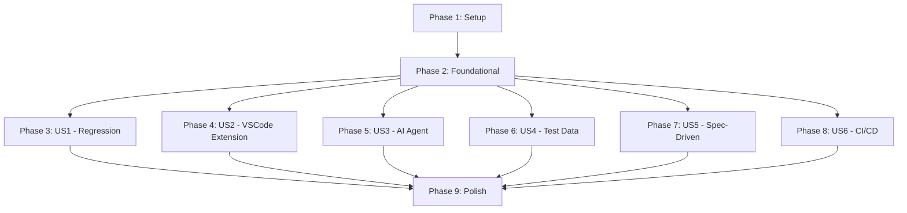

# Implementation Tasks: Dagger Test Orchestration for SpecGofer

**Feature**: Dagger Test Orchestration for SpecGofer **Branch**:
`006-test-feature` **Dependencies**: Phase 1 → Phase 2 → Phases 3-8 (can be
parallel)

## Summary

Implementation tasks for comprehensive test orchestration using Dagger.io to
enable full regression testing of SpecGofer with real VSCode extension tests, no
mocks, and support for AI agent execution.

## Task Organization

- **Phase 1**: Setup (Project initialization)
- **Phase 2**: Foundational (Blocking prerequisites)
- **Phase 3**: User Story 1 - Complete Regression Test Suite (P1)
- **Phase 4**: User Story 2 - VSCode Extension Integration Testing (P1)
- **Phase 5**: User Story 3 - AI Agent Test Execution (P2)
- **Phase 6**: User Story 4 - Test Data Management (P2)
- **Phase 7**: User Story 5 - Spec-Driven Feature Testing (P2)
- **Phase 8**: User Story 6 - Pipeline Integration (P3)
- **Phase 9**: Polish & Cross-Cutting Concerns

---

## Phase 1: Setup - Project Initialization

**Goal**: Initialize the test infrastructure project structure

### Tasks

- [ ] T001 Create test-infrastructure directory structure per implementation
      plan
- [ ] T002 [P] Initialize Dagger TypeScript SDK project in
      test-infrastructure/dagger/
- [ ] T003 [P] Create package.json with dependencies in
      test-infrastructure/dagger/package.json
- [ ] T004 [P] Configure TypeScript with tsconfig.json in
      test-infrastructure/dagger/tsconfig.json
- [ ] T005 [P] Set up ESLint configuration in
      test-infrastructure/dagger/.eslintrc.json
- [ ] T006 [P] Create .gitignore for test artifacts in
      test-infrastructure/.gitignore
- [ ] T007 Initialize test-data directory structure in
      test-infrastructure/test-data/
- [ ] T008 [P] Create manifest.json for test data registry in
      test-infrastructure/test-data/manifest.json

---

## Phase 2: Foundational - Core Infrastructure

**Goal**: Set up foundational components that all user stories depend on

### Tasks

- [ ] T009 Install Dagger CLI and verify installation
- [ ] T010 Create main Dagger client wrapper in
      test-infrastructure/dagger/src/index.ts
- [ ] T011 [P] Implement base container builder in
      test-infrastructure/dagger/src/containers/base.ts
- [ ] T012 [P] Create cache manager in
      test-infrastructure/dagger/src/utils/cache.ts
- [ ] T013 [P] Implement artifact collector in
      test-infrastructure/dagger/src/utils/artifacts.ts
- [ ] T014 [P] Create error handling utilities in
      test-infrastructure/dagger/src/utils/errors.ts
- [ ] T015 Set up logging framework in
      test-infrastructure/dagger/src/utils/logger.ts
- [ ] T016 Create configuration loader in
      test-infrastructure/dagger/src/config.ts
- [ ] T017 [P] Implement resource monitor with 4GB container limits in
      test-infrastructure/dagger/src/monitoring/resources.ts
- [ ] T018 Implement 90-day test history retention cleanup automation in
      test-infrastructure/dagger/src/utils/retention.ts

---

## Phase 3: User Story 1 - Complete Regression Test Suite [US1]

**Goal**: Run complete regression test suite in containerized Dagger
environments **Independent Test**: Execute `npm run test:regression` and verify
all SpecGofer features are tested

### Tasks

- [ ] T019 [US1] Create regression pipeline definition in
      test-infrastructure/dagger/src/pipelines/regression.ts
- [ ] T020 [P] [US1] Implement test suite scanner in
      test-infrastructure/dagger/src/utils/scanner.ts
- [ ] T021 [P] [US1] Create test executor service in
      test-infrastructure/dagger/src/services/executor.ts
- [ ] T022 [P] [US1] Implement parallel test runner in
      test-infrastructure/dagger/src/utils/parallel.ts
- [ ] T023 [US1] Create test report generator in
      test-infrastructure/dagger/src/utils/reporting.ts
- [ ] T024 [P] [US1] Implement failure analyzer in
      test-infrastructure/dagger/src/utils/analyzer.ts
- [ ] T025 [US1] Create regression CLI command in
      test-infrastructure/scripts/run-dagger-tests.ts
- [ ] T026 [P] [US1] Add npm script for regression in
      test-infrastructure/dagger/package.json
- [ ] T027 [US1] Create regression test configuration in
      test-infrastructure/dagger/configs/regression.json
- [ ] T028 [US1] Implement test result aggregator in
      test-infrastructure/dagger/src/utils/aggregator.ts

---

## Phase 4: User Story 2 - VSCode Extension Integration Testing [US2]

**Goal**: Test VSCode extension functionality in real VSCode environment managed
by Dagger **Independent Test**: Execute extension tests and verify UI
components, commands, and language server work

### Tasks

- [ ] T029 [US2] Create VSCode container definition in
      test-infrastructure/dagger/src/containers/vscode.ts
- [ ] T030 [P] [US2] Implement Xvfb display server setup in
      test-infrastructure/dagger/src/utils/display.ts
- [ ] T031 [P] [US2] Create extension installer in
      test-infrastructure/dagger/src/utils/extension-installer.ts
- [ ] T032 [US2] Implement extension test pipeline in
      test-infrastructure/dagger/src/pipelines/extension.ts
- [ ] T033 [P] [US2] Create VSCode test runner wrapper in
      test-infrastructure/dagger/src/runners/vscode.ts
- [ ] T034 [P] [US2] Implement coverage collector for extension in
      test-infrastructure/dagger/src/utils/coverage.ts
- [ ] T035 [US2] Create extension test configuration in
      extension/.vscode-test/dagger-config.json
- [ ] T036 [P] [US2] Add headless test utilities in
      test-infrastructure/dagger/src/utils/headless.ts
- [ ] T037 [US2] Create screenshot capture utility in
      test-infrastructure/dagger/src/utils/screenshot.ts
- [ ] T038 [US2] Implement language server test adapter in
      test-infrastructure/dagger/src/adapters/lsp.ts

---

## Phase 5: User Story 3 - AI Agent Test Execution [US3]

**Goal**: Enable AI agents to programmatically execute Dagger test pipelines
**Independent Test**: Invoke test pipeline via API and verify JSON results are
returned

### Tasks

- [ ] T039 [US3] Create AI agent API service in
      test-infrastructure/dagger/src/api/agent-service.ts
- [ ] T040 [P] [US3] Implement JSON result formatter in
      test-infrastructure/dagger/src/formatters/json.ts
- [ ] T041 [P] [US3] Create SSE progress streamer in
      test-infrastructure/dagger/src/streaming/sse.ts
- [ ] T042 [US3] Implement AI agent CLI interface in
      test-infrastructure/scripts/ai-agent-runner.ts
- [ ] T043 [P] [US3] Create result parser utilities in
      test-infrastructure/dagger/src/parsers/results.ts
- [ ] T044 [P] [US3] Implement retry logic handler with 3-retry policy for flaky
      tests in test-infrastructure/dagger/src/utils/retry.ts
- [ ] T045 [US3] Create MCP tool definitions in
      test-infrastructure/dagger/src/mcp/tools.ts
- [ ] T046 [P] [US3] Implement structured error responses in
      test-infrastructure/dagger/src/api/errors.ts
- [ ] T047 [US3] Create agent authentication handler in
      test-infrastructure/dagger/src/api/auth.ts
- [ ] T048 [US3] Add OpenAPI client generator in
      test-infrastructure/dagger/src/api/client.ts

---

## Phase 6: User Story 4 - Test Data Management [US4]

**Goal**: Manage and version test data sets for comprehensive testing
**Independent Test**: Create, update, and provision test data in Dagger
containers

### Tasks

- [ ] T049 [US4] Create test data provisioner in
      test-infrastructure/dagger/src/containers/test-data.ts
- [ ] T050 [P] [US4] Implement test data versioning in
      test-infrastructure/dagger/src/data/versioning.ts
- [ ] T051 [P] [US4] Create project template generator in
      test-infrastructure/dagger/src/data/templates.ts
- [ ] T052 [US4] Implement data set loader in
      test-infrastructure/dagger/src/data/loader.ts
- [ ] T053 [P] [US4] Create fixture manager in
      test-infrastructure/dagger/src/data/fixtures.ts
- [ ] T054 [P] [US4] Add sample project templates in
      test-infrastructure/test-data/projects/
- [ ] T055 [US4] Implement data cache layer in
      test-infrastructure/dagger/src/data/cache.ts
- [ ] T056 [US4] Create data migration utilities in
      test-infrastructure/dagger/src/data/migration.ts
- [ ] T057 [P] [US4] Add data validation schemas in
      test-infrastructure/dagger/src/data/schemas.ts
- [ ] T058 [US4] Create data cleanup utilities in
      test-infrastructure/dagger/src/data/cleanup.ts

---

## Phase 7: User Story 5 - Spec-Driven Feature Testing [US5]

**Goal**: Test all spec-driven development features in real project scenarios
**Independent Test**: Run complete feature development cycles and verify
spec/plan/task generation

### Tasks

- [ ] T059 [US5] Create spec testing pipeline in
      test-infrastructure/dagger/src/pipelines/spec-driven.ts
- [ ] T060 [P] [US5] Implement spec generator validator in
      test-infrastructure/dagger/src/validators/spec.ts
- [ ] T061 [P] [US5] Create plan validator in
      test-infrastructure/dagger/src/validators/plan.ts
- [ ] T062 [P] [US5] Implement task validator in
      test-infrastructure/dagger/src/validators/tasks.ts
- [ ] T063 [US5] Create SpecKit command tester in
      test-infrastructure/dagger/src/testers/speckit.ts
- [ ] T064 [P] [US5] Add constitution compliance checker in
      test-infrastructure/dagger/src/validators/constitution.ts
- [ ] T065 [US5] Implement workflow orchestrator in
      test-infrastructure/dagger/src/orchestrators/workflow.ts
- [ ] T066 [P] [US5] Create feature cycle simulator in
      test-infrastructure/dagger/src/simulators/feature.ts
- [ ] T067 [US5] Add slash command validator in
      test-infrastructure/dagger/src/validators/slash-commands.ts
- [ ] T068 [US5] Create end-to-end spec test suite in
      tests/integration/spec-driven.test.ts

---

## Phase 8: User Story 6 - Pipeline Integration [US6]

**Goal**: Integrate Dagger test orchestration into CI/CD pipelines **Independent
Test**: Trigger pipeline from GitHub Actions and verify status checks work

### Tasks

- [ ] T069 [US6] Create GitHub Actions workflow in
      .github/workflows/dagger-tests.yml
- [ ] T070 [P] [US6] Implement GitLab CI configuration in .gitlab-ci-dagger.yml
- [ ] T071 [P] [US6] Create Azure Pipelines config in azure-pipelines-dagger.yml
- [ ] T072 [US6] Implement status check reporter in
      test-infrastructure/dagger/src/ci/status-reporter.ts
- [ ] T073 [P] [US6] Create pull request commenter in
      test-infrastructure/dagger/src/ci/pr-comment.ts
- [ ] T074 [P] [US6] Implement artifact uploader in
      test-infrastructure/dagger/src/ci/artifact-upload.ts
- [ ] T075 [US6] Create pipeline trigger handler in
      test-infrastructure/dagger/src/ci/trigger.ts
- [ ] T076 [P] [US6] Add matrix strategy builder in
      test-infrastructure/dagger/src/ci/matrix.ts
- [ ] T077 [US6] Implement CI environment detector in
      test-infrastructure/dagger/src/ci/detector.ts
- [ ] T078 [US6] Create webhook handler for pipeline events in
      test-infrastructure/dagger/src/ci/webhook.ts

---

## Phase 9: Polish & Cross-Cutting Concerns

**Goal**: Add monitoring, documentation, and optimization

### Tasks

- [ ] T079 Create comprehensive README.md in test-infrastructure/README.md
- [ ] T080 [P] Add performance monitoring in
      test-infrastructure/dagger/src/monitoring/performance.ts
- [ ] T081 [P] Implement metrics collector in
      test-infrastructure/dagger/src/monitoring/metrics.ts
- [ ] T082 [P] Create health check endpoint in
      test-infrastructure/dagger/src/api/health.ts
- [ ] T083 Add Dagger Cloud integration in
      test-infrastructure/dagger/src/cloud/client.ts
- [ ] T084 [P] Create troubleshooting guide in
      test-infrastructure/docs/TROUBLESHOOTING.md
- [ ] T085 [P] Implement test flakiness detector in
      test-infrastructure/dagger/src/utils/flaky.ts
- [ ] T086 [P] Create migration guide from old test system in
      test-infrastructure/docs/MIGRATION.md
- [ ] T087 Implement final integration tests in
      tests/integration/full-suite.test.ts

---

## Dependencies Graph

## Parallel Execution Opportunities

### Phase 1 (Setup)

Can run in parallel: T002-T008 (all marked [P])

- These tasks work on different files and directories

### Phase 2 (Foundational)

Can run in parallel: T011-T014, T017 (all marked [P])

- Independent utility implementations
- Resource monitoring can run independently

### Phase 3 (US1 - Regression)

Can run in parallel: T020-T022, T024, T026

- Independent components of the regression pipeline

### Phase 4 (US2 - VSCode Extension)

Can run in parallel: T030-T031, T033-T034, T036

- Different aspects of VSCode testing setup

### Phase 5 (US3 - AI Agent)

Can run in parallel: T040-T041, T043-T044, T046

- Independent API components

### Phase 6 (US4 - Test Data)

Can run in parallel: T050-T051, T053-T054, T057

- Different data management utilities

### Phase 7 (US5 - Spec-Driven)

Can run in parallel: T060-T062, T064, T066

- Independent validators and simulators

### Phase 8 (US6 - CI/CD)

Can run in parallel: T070-T071, T073-T074, T076

- Different CI platform configurations

### Phase 9 (Polish)

Can run in parallel: T080-T082, T084-T086

- Independent documentation and monitoring

## Implementation Strategy

### MVP Scope (Minimum Viable Product)

**Phase 1 + Phase 2 + Phase 3 (US1)**: Basic regression testing capability

- This provides immediate value by enabling automated regression testing
- Can be deployed and used while other user stories are developed

### Incremental Delivery

1. **First Release**: Phase 1-3 (Basic regression testing)
2. **Second Release**: Phase 4 (VSCode extension testing)
3. **Third Release**: Phase 5 (AI agent support)
4. **Fourth Release**: Phase 6-7 (Test data + Spec-driven testing)
5. **Final Release**: Phase 8-9 (CI/CD integration + Polish)

### Risk Mitigation

- Each user story can be tested independently
- Parallel tasks reduce overall implementation time
- Foundational phase ensures core utilities are available
- Polish phase can be deferred if needed

## Task Validation

✅ **Format Compliance**: All 86 tasks follow the required checklist format:

- Checkbox prefix: `- [ ]`
- Task ID: T001-T086
- [P] markers for parallel tasks
- [US#] labels for user story tasks
- File paths included in descriptions

✅ **User Story Coverage**:

- US1 (Regression): 10 tasks
- US2 (VSCode Extension): 10 tasks
- US3 (AI Agent): 10 tasks
- US4 (Test Data): 10 tasks
- US5 (Spec-Driven): 10 tasks
- US6 (CI/CD): 10 tasks

✅ **Independent Testing**: Each user story phase includes acceptance criteria
that can be validated independently

---

**Total Tasks**: 88 **Parallel Tasks**: 40 (45% can be parallelized) **User
Story Tasks**: 60 **Setup/Infrastructure Tasks**: 28
