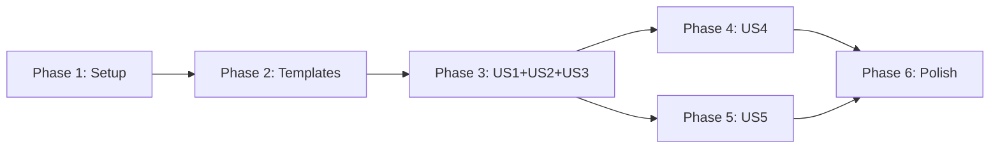

# Tasks: Default AI Instruction Files for New Repositories

**Input**: Design documents from `.specify/specs/010-addclaudeinstructions/`

## Overview

- **Total Tasks**: 41
- **Parallel Opportunities**: 20 tasks marked [P]
- **User Stories**: 5 (US1-US5) across 6 phases

## Dependencies

---

## Phase 1: Setup & Project Detection Engine

**Purpose**: Create ProjectDetector class that scans workspace for project
characteristics (FR2)

- [x] T001 Create ProjectInfo interface with detected properties in
      extension/src/services/ProjectDetector.ts
- [x] T002 Implement ProjectDetector.detect(workspacePath) static method in
      extension/src/services/ProjectDetector.ts
- [x] T003 [P] Add language detection from manifest files (package.json,
      tsconfig.json, pyproject.toml, go.mod, Cargo.toml, pom.xml, build.gradle)
      in extension/src/services/ProjectDetector.ts
- [x] T004 [P] Add test runner detection from config files (vitest.config._,
      jest.config._, pytest markers) in
      extension/src/services/ProjectDetector.ts
- [x] T005 [P] Add linter/formatter detection (.eslintrc*, eslint.config.*,
      .prettierrc\*) in extension/src/services/ProjectDetector.ts
- [x] T006 [P] Add build/test/lint/format command detection from package.json
      scripts in extension/src/services/ProjectDetector.ts
- [x] T007 [P] Add framework detection from dependencies (react, next, express,
      django, flask, gin, actix) in extension/src/services/ProjectDetector.ts
- [x] T008 [P] Add package manager detection (npm/yarn/pnpm from lock files,
      pip/poetry from Python markers) in
      extension/src/services/ProjectDetector.ts
- [x] T009 Write unit tests for ProjectDetector covering 6 language scenarios +
      unknown project + edge cases in
      tests/unit/services/ProjectDetector.test.ts

**Verification**: ProjectDetector returns correct ProjectInfo for TypeScript,
Python, Go, Rust, Java, and unknown projects

---

## Phase 2: Template Fragment System

**Purpose**: Create composable template fragments for instruction file
generation (FR1, FR3, FR7)

### Base Templates

- [x] T010 [P] Create base AGENTS.md template with placeholder sections
      ({{commands}}, {{structure}}, {{codeStyle}}, {{testing}}, {{gitWorkflow}},
      {{boundaries}}, {{principles}}) in
      extension/resources/instruction-templates/base/agents-base.md
- [x] T011 [P] Create base CLAUDE.md template with @AGENTS.md import, Gofer
      pipeline section, workflow section, context management section (target <
      60 lines) in extension/resources/instruction-templates/base/claude-base.md
- [x] T012 [P] Create base copilot-instructions.md template with project
      overview, available commands, code quality section in
      extension/resources/instruction-templates/base/copilot-base.md

### Language Fragments

- [x] T013 [P] Create TypeScript language fragment (strict mode, ESM imports,
      type annotations) in
      extension/resources/instruction-templates/languages/typescript.md
- [x] T014 [P] Create Python language fragment (type hints, docstrings, virtual
      envs) in extension/resources/instruction-templates/languages/python.md
- [x] T015 [P] Create Go language fragment (error handling, naming, package
      structure) in extension/resources/instruction-templates/languages/go.md
- [x] T016 [P] Create Rust language fragment (ownership, error handling, cargo
      conventions) in
      extension/resources/instruction-templates/languages/rust.md
- [x] T017 [P] Create Java language fragment (Maven/Gradle conventions, naming)
      in extension/resources/instruction-templates/languages/java.md
- [x] T018 [P] Create generic language fragment (minimal safe defaults for
      unknown projects) in
      extension/resources/instruction-templates/languages/generic.md

### Gofer & Workflow Fragments

- [x] T019 [P] Create Gofer-specific fragment for CLAUDE.md with pipeline
      commands and available slash commands in
      extension/resources/instruction-templates/gofer/gofer-claude.md
- [x] T020 [P] Create Gofer-specific fragment for copilot-instructions.md with
      available prompts in
      extension/resources/instruction-templates/gofer/gofer-copilot.md
- [x] T021 Create workflow principles fragment based on example.md content (plan
      mode, subagent strategy, self-improvement, verification, elegance,
      autonomous bug fixing, core principles) in
      extension/resources/instruction-templates/workflow/principles.md

**Verification**: All template files are valid Markdown. CLAUDE.md base +
fragments < 60 lines, AGENTS.md 80-150 lines, copilot-instructions.md 60-120
lines.

---

## Phase 3: US1 + US2 + US3 - Instruction Generator & Core Generation (P1)

**Goal**: Create InstructionGenerator that assembles templates with project
data, wire into UpgradeService for auto-generation during initialization

**Stories**: US1 (Initialize AI Instructions), US2 (Project-Aware Templates),
US3 (Workflow Principles)

**Independent Test**: Run "Gofer: Initialize Repository" on a fresh TypeScript
workspace → verify AGENTS.md, CLAUDE.md, .github/copilot-instructions.md are
created with correct project-specific content and workflow principles

### InstructionGenerator

- [x] T022 [US1] Create InstructionGenerator class with
      generateAgentsMd(projectInfo), generateClaudeMd(projectInfo),
      generateCopilotMd(projectInfo) methods in
      extension/src/services/InstructionGenerator.ts
- [x] T023 [US2] Implement template loading from
      extension/resources/instruction-templates/ using
      vscode.extensions.getExtension() path resolution in
      extension/src/services/InstructionGenerator.ts
- [x] T024 [US2] Implement language fragment selection based on
      projectInfo.language and {{placeholder}} substitution with detected values
      in extension/src/services/InstructionGenerator.ts
- [x] T025 [US3] Implement workflow principles assembly in generateClaudeMd()
      mapping example.md sections to brief CLAUDE.md lines in
      extension/src/services/InstructionGenerator.ts
- [x] T026 [US3] Implement core principles assembly in generateAgentsMd()
      (simplicity first, find root causes, minimal impact, verify before done)
      in extension/src/services/InstructionGenerator.ts
- [x] T026b [US1] Implement project overview assembly in generateCopilotMd()
      using projectInfo.name, projectInfo.language, projectInfo.framework for
      copilot-instructions.md project overview section in
      extension/src/services/InstructionGenerator.ts

### UpgradeService Integration (FR4, FR5)

- [x] T027 [US1] Add setupDefaultInstructions(): Promise<void> to
      IResourceOperations interface in
      extension/src/services/migration/UpgradeService.ts (after
      setupCopilotInstructions, line ~53)
- [x] T028 [US1] Add setupDefaultInstructions() call in UpgradeService.upgrade()
      after setupCopilotInstructions() step (line ~209) with progress reporting
      in extension/src/services/migration/UpgradeService.ts
- [x] T029 [US1] Implement setupDefaultInstructions() in ResourceSyncer:
      instantiate ProjectDetector + InstructionGenerator, check
      FileUtils.exists() for each file, use FileUtils.ensureDirectory() for
      .github/, write via FileUtils.writeTextFile() in
      extension/src/services/migration/ResourceSyncer.ts
- [x] T030 [US1] Add setupDefaultInstructions() call in
      UpgradeService.updateGoferTemplates() (line ~320) in
      extension/src/services/migration/UpgradeService.ts

### Tests

- [x] T031 [P] [US1] Write unit tests for InstructionGenerator: verify assembly
      for TypeScript, Python, Go projects + line count constraints + content
      partitioning in tests/unit/services/InstructionGenerator.test.ts
- [x] T032 [P] [US1] Write integration test: fresh workspace → upgrade → verify
      all 3 files created at correct locations in
      tests/unit/services/setupDefaultInstructions.test.ts
- [x] T033 [P] [US1] Write integration test: workspace with existing CLAUDE.md →
      upgrade → verify CLAUDE.md untouched in
      tests/unit/services/setupDefaultInstructions.test.ts

**Checkpoint**: Running Gofer initialize on a fresh workspace creates all 3
instruction files with project-aware content and workflow principles. Existing
files are never overwritten.

---

## Phase 4: US4 - Regenerate Instructions Command (P2)

**Goal**: Add VS Code command for re-generating instruction files after project
changes

**Story**: US4 (Regenerate Instructions After Changes)

**Independent Test**: Run "Gofer: Regenerate AI Instructions" from Command
Palette with existing files → verify prompt and backup behavior

- [x] T034 [US4] Add gofer.regenerateInstructions command contribution to
      extension/package.json contributes.commands array
- [x] T035 [US4] Register gofer.regenerateInstructions command in
      CommandRegistry.registerAll() with ProjectDetector re-detection, existing
      file prompt (Overwrite/Skip/Backup & Replace), and summary notification in
      extension/src/services/CommandRegistry.ts
- [x] T035b [P] [US4] Write integration test verifying regenerate command
      re-detects project characteristics after manifest file changes (e.g.,
      adding tsconfig.json to JS project → regenerated files reflect TypeScript)
      in tests/integration/instruction-generation.test.ts

**Checkpoint**: "Gofer: Regenerate AI Instructions" appears in Command Palette,
prompts for existing files, creates backup when requested, re-detects project
changes.

---

## Phase 5: US5 - Existing Installation Sync (P2)

**Goal**: Detect and offer to create missing instruction files for existing
Gofer installations

**Story**: US5 (Existing Installation Sync)

**Independent Test**: Existing Gofer workspace without instruction files →
syncMissingResources detects and prompts → generates files when accepted

- [x] T036 [US5] Add public setupDefaultInstructions() facade method to
      GoferMigrator (delegates to ResourceSyncer) in
      extension/src/goferMigrator.ts
- [x] T037 [US5] Add AGENTS.md and CLAUDE.md to checkMissingResources() critical
      paths check (line ~371) in extension/src/goferMigrator.ts
- [x] T038 [US5] Add instruction file sync to syncMissingResources() using same
      pattern as other resources (line ~458) in extension/src/goferMigrator.ts

**Checkpoint**: Existing installations detect missing instruction files and
offer to generate them during sync.

---

## Phase 6: Polish & Cross-Cutting Concerns

**Purpose**: Final validation and cleanup

- [x] T039 Verify AGENTS.md contains no Claude-specific or Copilot-specific
      syntax (cross-tool compatibility check)
- [x] T040 [P] Verify CLAUDE.md uses @AGENTS.md import correctly and stays under
      60 lines for all language types
- [x] T041 [P] Verify all generated files use LF line endings on all platforms
- [x] T042 [P] Verify workflow principles fragment content matches example.md
      mapping (plan-first, subagent strategy, self-improvement, verification,
      elegance, autonomous bug fixing, core principles all present)
- [x] T043 Run full test suite to confirm no regressions in existing
      upgrade/sync flows

**Verification**: All tests pass, no regressions, cross-tool compatibility
confirmed.

---

## Parallel Execution Guide

Tasks marked [P] can run concurrently if they modify different files:

**Phase 1 parallel groups**:

- T003, T004, T005, T006, T007, T008 (all detection methods in same file but
  independent logic)

**Phase 2 parallel groups**:

- T010, T011, T012 (three base templates, different files)
- T013, T014, T015, T016, T017, T018 (six language fragments, different files)
- T019, T020 (two Gofer fragments, different files)

**Phase 3 parallel groups**:

- T031, T032, T033 (three test files, independent)

---

## Implementation Strategy

1. **Foundation First**: Complete Phase 1 (ProjectDetector) + Phase 2
   (Templates)
2. **MVP**: Complete Phase 3 (US1+US2+US3) — core generation working
3. **Incremental**: Phase 4 (US4 regenerate) and Phase 5 (US5 sync) can proceed
   in parallel
4. **Polish Last**: Phase 6 for cross-cutting validation
