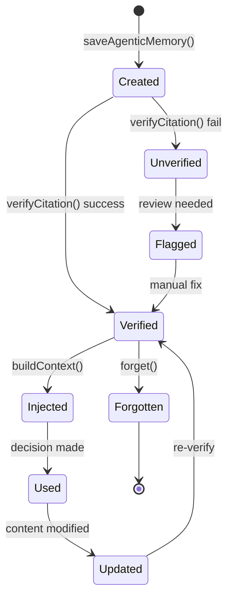
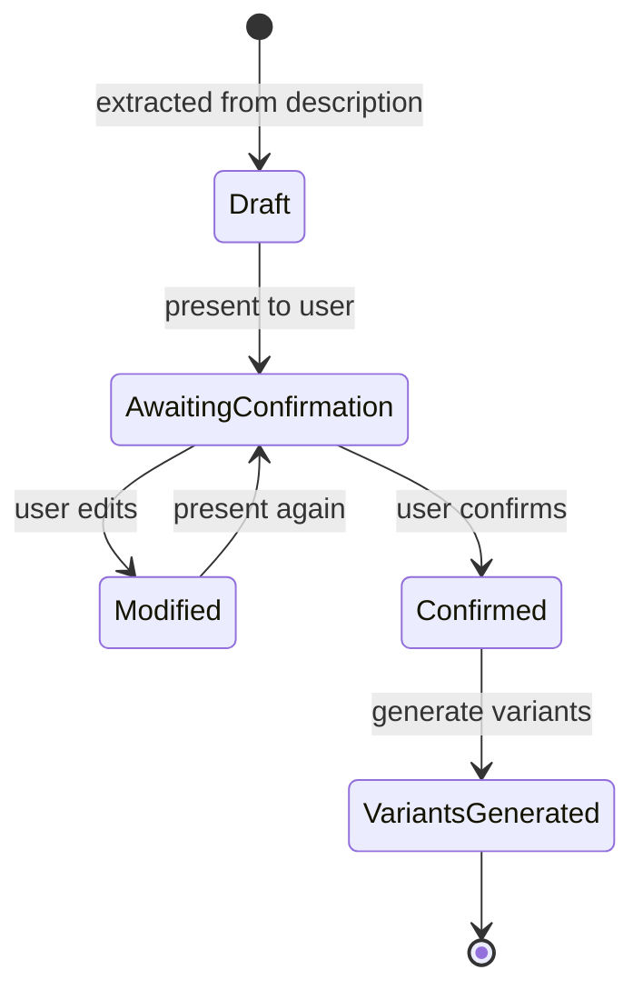

# Data Model: Gofer Memory and Journey System

## Entities

### AgenticMemory

Extends the existing `Memory` interface with agentic capabilities.

| Field            | Type                                                    | Required | Description                                           |
| ---------------- | ------------------------------------------------------- | -------- | ----------------------------------------------------- |
| id               | string (UUID)                                           | Yes      | Unique identifier                                     |
| category         | string                                                  | Yes      | Memory category (e.g., "api_patterns", "preferences") |
| tags             | string[]                                                | Yes      | Tags for search                                       |
| scope            | 'local' \| 'global'                                     | Yes      | Memory scope                                          |
| content          | string                                                  | Yes      | Memory content (1-10,000 characters)                  |
| created          | number                                                  | Yes      | Unix timestamp (ms) when created                      |
| lastUsed         | number                                                  | Yes      | Unix timestamp (ms) of last use                       |
| usedCount        | number                                                  | Yes      | Total usage count (legacy)                            |
| learnedFrom      | string                                                  | Yes      | Source: spec-id or "user_interaction"                 |
| citations        | Citation[]                                              | Yes      | Code locations referenced                             |
| verified         | boolean                                                 | Yes      | Last verification status                              |
| verifiedAt       | number                                                  | Yes      | Unix timestamp of last verification                   |
| confidence       | 'high' \| 'medium' \| 'low'                             | Yes      | Confidence level                                      |
| memoryType       | 'pattern' \| 'decision' \| 'constraint' \| 'preference' | Yes      | Type of memory                                        |
| priorityIndex    | number                                                  | Yes      | Priority for surfacing (higher = more important)      |
| decisionUseCount | number                                                  | Yes      | Times used in agent decisions                         |
| updateCount      | number                                                  | Yes      | Times content was modified                            |

**Validation Rules**:

- `content` must be 1-10,000 characters
- `priorityIndex` must be >= 0
- `citations` can be empty array but not null
- `memoryType` must be one of the enum values

**Priority Index Rules**:

- Increments by 1 when memory is used in an agent decision
- Increments by 1 when memory content is updated
- Does NOT increment when retrieved for context injection

---

### Citation

Reference to a specific code location for verification.

| Field   | Type   | Required | Description                                                  |
| ------- | ------ | -------- | ------------------------------------------------------------ |
| file    | string | Yes      | Relative file path from project root                         |
| line    | number | Yes      | Line number (1-indexed)                                      |
| snippet | string | Yes      | Code snippet at citation (max 500 chars)                     |
| hash    | string | Yes      | SHA256 hash (first 16 chars) of snippet for change detection |

**Validation Rules**:

- `file` must be a valid relative path
- `line` must be > 0
- `snippet` must be <= 500 characters
- `hash` must be 16 characters (truncated SHA256)

---

### Journey

Customer/user journey definition.

| Field       | Type          | Required | Description                     |
| ----------- | ------------- | -------- | ------------------------------- |
| id          | string (UUID) | Yes      | Unique identifier               |
| featureId   | string        | Yes      | Associated feature ID           |
| name        | string        | Yes      | Journey name/title              |
| description | string        | Yes      | Journey description             |
| actors      | Actor[]       | Yes      | Participants in the journey     |
| steps       | JourneyStep[] | Yes      | Ordered steps in the journey    |
| touchpoints | string[]      | No       | Key interaction points          |
| confirmedAt | number        | No       | Unix timestamp when confirmed   |
| confirmedBy | string        | No       | Who confirmed (user identifier) |

**Validation Rules**:

- `actors` must have at least 1 actor
- `steps` must have at least 1 step
- `confirmedAt` required if journey is confirmed

---

### Actor

Participant in a journey.

| Field       | Type                                           | Required | Description                               |
| ----------- | ---------------------------------------------- | -------- | ----------------------------------------- |
| id          | string                                         | Yes      | Unique identifier within journey          |
| name        | string                                         | Yes      | Actor name (e.g., "Customer", "AI Agent") |
| type        | 'user' \| 'ai_agent' \| 'system' \| 'external' | Yes      | Actor type                                |
| description | string                                         | No       | Actor description                         |

---

### JourneyStep

Single step in a journey.

| Field           | Type   | Required | Description                       |
| --------------- | ------ | -------- | --------------------------------- |
| order           | number | Yes      | Step order (1-indexed)            |
| actorId         | string | Yes      | Actor performing the step         |
| action          | string | Yes      | What the actor does               |
| target          | string | No       | Target actor/system of the action |
| expectedOutcome | string | No       | Expected result                   |

---

### JourneyVariant

Industry-adapted variant of a base journey.

| Field          | Type          | Required | Description                              |
| -------------- | ------------- | -------- | ---------------------------------------- |
| id             | string (UUID) | Yes      | Unique identifier                        |
| baseJourneyId  | string        | Yes      | Reference to base journey                |
| featureId      | string        | Yes      | Associated feature ID                    |
| industry       | Industry      | Yes      | Industry this variant is for             |
| variantNumber  | number        | Yes      | Variant number within industry           |
| name           | string        | Yes      | Variant name                             |
| adaptations    | string[]      | Yes      | How journey was adapted for industry     |
| innovations    | string[]      | Yes      | Industry-specific innovations discovered |
| mermaidDiagram | string        | No       | Mermaid sequence diagram                 |

**Validation Rules**:

- `industry` must be one of the 10 defined industries
- `adaptations` must have at least 1 entry
- `innovations` must have at least 1 entry

---

### Industry (Enum)

```typescript
type Industry =
  | 'retail'
  | 'healthcare'
  | 'finance'
  | 'education'
  | 'hospitality'
  | 'logistics'
  | 'manufacturing'
  | 'legal'
  | 'real_estate'
  | 'entertainment';
```

---

### SequenceDiagramOption

One of 5 implementation approach options.

| Field            | Type                                                         | Required | Description                             |
| ---------------- | ------------------------------------------------------------ | -------- | --------------------------------------- |
| id               | string (UUID)                                                | Yes      | Unique identifier                       |
| featureId        | string                                                       | Yes      | Associated feature ID                   |
| optionNumber     | 1 \| 2 \| 3 \| 4 \| 5                                        | Yes      | Option number (1=Minimal, 5=Innovative) |
| name             | string                                                       | Yes      | Option name                             |
| description      | string                                                       | Yes      | Option description                      |
| mermaidDiagram   | string                                                       | Yes      | Mermaid sequence diagram code           |
| actors           | string[]                                                     | Yes      | Actors/systems in the diagram           |
| genAiTouchpoints | string[]                                                     | Yes      | Points where Gen AI is involved         |
| efficiencyScore  | number                                                       | Yes      | Efficiency score (0-100)                |
| complexityScore  | 'low' \| 'medium-low' \| 'medium' \| 'medium-high' \| 'high' | Yes      | Complexity level                        |
| innovationScore  | number                                                       | Yes      | Innovation score (0-100)                |
| estimatedEffort  | string                                                       | Yes      | Effort estimate (e.g., "1-2 days")      |
| risks            | string[]                                                     | Yes      | Identified risks                        |
| tradeoffs        | string[]                                                     | Yes      | Key trade-offs                          |

**Validation Rules**:

- `optionNumber` must be 1-5
- `efficiencyScore` + `innovationScore` should approximate 100 (inverse
  relationship)
- `mermaidDiagram` must be valid Mermaid syntax

**Option Spectrum**:

| Option | Name       | Efficiency | Innovation | Complexity  |
| ------ | ---------- | ---------- | ---------- | ----------- |
| 1      | Minimal    | 95%        | 10%        | low         |
| 2      | Efficient  | 80%        | 30%        | medium-low  |
| 3      | Standard   | 60%        | 50%        | medium      |
| 4      | Enhanced   | 40%        | 70%        | medium-high |
| 5      | Innovative | 20%        | 95%        | high        |

---

### MemoryLogEntry

JSONL log entry for memory operations.

| Field            | Type                                                                 | Required | Description                                |
| ---------------- | -------------------------------------------------------------------- | -------- | ------------------------------------------ |
| timestamp        | string (ISO-8601)                                                    | Yes      | When operation occurred                    |
| operation        | 'save' \| 'retrieve' \| 'update' \| 'delete' \| 'verify' \| 'inject' | Yes      | Operation type                             |
| memoryId         | string                                                               | Yes      | Memory ID affected                         |
| category         | string                                                               | No       | Memory category                            |
| priorityBefore   | number                                                               | No       | Priority before operation                  |
| priorityAfter    | number                                                               | No       | Priority after operation                   |
| verified         | boolean                                                              | No       | Verification result (for verify operation) |
| contextBudget    | number                                                               | No       | Context budget used (for inject operation) |
| memoriesInjected | number                                                               | No       | Number of memories injected                |
| memoriesExcluded | number                                                               | No       | Number excluded due to budget              |

---

## State Transitions

### Memory Lifecycle



### Journey State



---

## Storage Locations

| Entity                | Storage Location                                                    | Format                         |
| --------------------- | ------------------------------------------------------------------- | ------------------------------ |
| AgenticMemory         | `.specify/memory/agentic-memories.json`                             | JSON (array)                   |
| Memory Notes          | `.specify/memory/memory-notes/{uuid}.md`                            | Markdown                       |
| Memory Log            | `.specify/memory/memory-log.jsonl`                                  | JSONL                          |
| Journey               | `.specify/specs/{feature}/journeys/base-journey.md`                 | Markdown with YAML frontmatter |
| JourneyVariant        | `.specify/specs/{feature}/journeys/variants/{industry}-{number}.md` | Markdown                       |
| SequenceDiagramOption | `.specify/specs/{feature}/sequence-diagrams/option-{N}-{name}.md`   | Markdown with Mermaid          |
| Selected Option       | `.specify/specs/{feature}/sequence-diagrams/selected-option.md`     | Markdown (copy of selected)    |

---

## Database/Storage Considerations

### File-Based Storage

- **JSON for structured data**: `agentic-memories.json` enables queries and
  sorting
- **Markdown for human readability**: Memory notes, journeys, and diagrams are
  readable/editable
- **JSONL for append-only logs**: Memory operations logged efficiently

### Performance

- **Memory retrieval**: Sort by priorityIndex in memory, no database indexes
  needed
- **Citation verification**: Cache verification results to avoid repeated file
  reads
- **Context budget**: Enforce budget during injection, not storage

### Migration

- **Backward compatible**: Existing Memory interface unchanged
- **AgenticMemory extends Memory**: Old memories work, new fields have defaults
