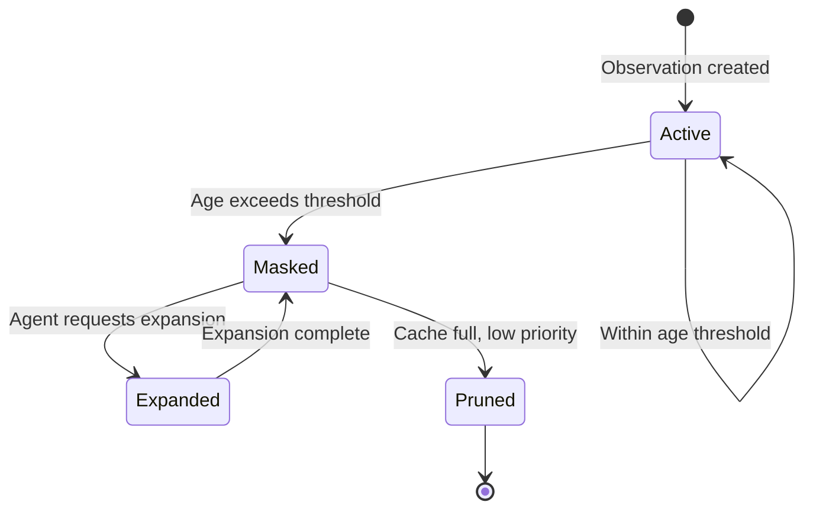
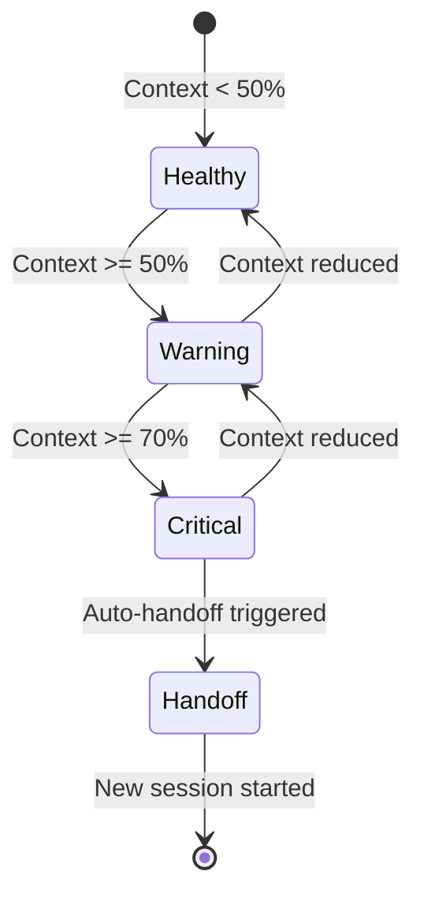

# Data Model: Context Health and Recursive Memory Enhancement

## Entities

### ObservationEntry

Represents a tracked observation from tool output that can be masked.

| Field           | Type                    | Required | Description                                    |
| --------------- | ----------------------- | -------- | ---------------------------------------------- |
| id              | string (UUID)           | Yes      | Unique identifier for the observation          |
| timestamp       | number                  | Yes      | Unix milliseconds when observation was created |
| turnNumber      | number                  | Yes      | Conversation turn when observation occurred    |
| type            | ObservationType         | Yes      | Type of observation                            |
| contentHash     | string                  | Yes      | SHA-256 hash of original content               |
| tokenEstimate   | number                  | Yes      | Estimated token count of original content      |
| originalContent | string                  | Yes      | Full original content (stored in cache)        |
| summary         | string                  | No       | Brief summary for placeholder display          |
| metadata        | Record<string, unknown> | No       | Additional context (file path, command, etc.)  |
| masked          | boolean                 | Yes      | Whether observation is currently masked        |
| maskedAt        | number                  | No       | Unix milliseconds when masked                  |

**ObservationType Enum**:

- `file_read` - File content read operation
- `command_output` - Shell command execution result
- `api_response` - API call response
- `search_result` - Search/grep operation result
- `test_output` - Test execution output

**Validation Rules**:

- id must be valid UUID v4
- timestamp must be positive integer
- turnNumber must be non-negative integer
- contentHash must be 64-character hex string
- tokenEstimate must be positive integer
- originalContent must be 1-10,000,000 characters

**Relationships**:

- Many observations belong to one Session

---

### ContextHealthStatus

Represents a point-in-time context health measurement.

| Field              | Type           | Required | Description                        |
| ------------------ | -------------- | -------- | ---------------------------------- |
| status             | HealthStatus   | Yes      | Overall health status              |
| utilizationPercent | number         | Yes      | Percentage of context used (0-100) |
| tokensUsed         | number         | Yes      | Total tokens currently in context  |
| tokensLimit        | number         | Yes      | Effective context limit            |
| breakdown          | TokenBreakdown | Yes      | Token usage by category            |
| recommendations    | string[]       | Yes      | List of recommended actions        |
| timestamp          | number         | Yes      | Unix milliseconds of measurement   |
| sessionId          | string         | No       | Associated session ID              |

**HealthStatus Enum**:

- `healthy` - Below warning threshold (<50%)
- `warning` - Between warning and critical (50-70%)
- `critical` - Above critical threshold (>70%)

**TokenBreakdown Type**:

```typescript
{
  specArtifacts: number; // spec.md, plan.md, etc.
  memories: number; // Loaded memories
  hints: number; // Coding hints
  observations: number; // Tool outputs
  systemFiles: number; // Constitution, templates
  conversation: number; // User/assistant messages
}
```

**Validation Rules**:

- utilizationPercent must be 0-100
- tokensUsed must be non-negative
- tokensLimit must be positive
- All breakdown values must be non-negative

---

### StageContextProfile

Configuration for context budget allocation per Gofer stage.

| Field             | Type       | Required | Description                            |
| ----------------- | ---------- | -------- | -------------------------------------- |
| stage             | GoferStage | Yes      | Gofer pipeline stage                   |
| researchBudget    | number     | Yes      | Fraction of context for research (0-1) |
| memoryBudget      | number     | Yes      | Fraction of context for memories (0-1) |
| codeBudget        | number     | Yes      | Fraction of context for code (0-1)     |
| observationWindow | number     | Yes      | Number of turns to keep observations   |
| description       | string     | No       | Human-readable description             |

**GoferStage Enum**:

- `research` - /1_gofer_research
- `specify` - /2_gofer_specify
- `plan` - /3_gofer_plan
- `tasks` - /4_gofer_tasks
- `implement` - /5_gofer_implement
- `validate` - /6_gofer_validate

**Validation Rules**:

- All budget fractions must be 0-1
- Sum of budgets should not exceed 1.0
- observationWindow must be positive integer (1-50)

---

### ResearchChunk

A semantic chunk of a research document.

| Field             | Type     | Required | Description                     |
| ----------------- | -------- | -------- | ------------------------------- |
| id                | string   | Yes      | Unique chunk identifier         |
| sourceFile        | string   | Yes      | Path to source research.md      |
| sectionTitle      | string   | Yes      | Markdown heading for this chunk |
| content           | string   | Yes      | Chunk content                   |
| tokenEstimate     | number   | Yes      | Estimated token count           |
| relevanceKeywords | string[] | Yes      | Keywords for relevance matching |
| order             | number   | Yes      | Order in original document      |
| headingLevel      | number   | Yes      | Markdown heading level (1-6)    |

**Validation Rules**:

- sectionTitle must not be empty
- content must be 1-50,000 characters
- tokenEstimate must be positive
- order must be non-negative
- headingLevel must be 1-6

**Relationships**:

- Many chunks belong to one ResearchIndex

---

### ResearchIndex

Index of all chunks for a research document.

| Field       | Type           | Required | Description                              |
| ----------- | -------------- | -------- | ---------------------------------------- |
| sourceFile  | string         | Yes      | Path to source research.md               |
| totalTokens | number         | Yes      | Total tokens across all chunks           |
| chunkCount  | number         | Yes      | Number of chunks                         |
| created     | number         | Yes      | Unix milliseconds when index was created |
| chunks      | ChunkSummary[] | Yes      | Summary of each chunk                    |

**ChunkSummary Type**:

```typescript
{
  id: string;
  title: string;
  tokens: number;
  keywords: string[];
}
```

---

### ContextUsageLogEntry

JSONL log entry for context usage tracking.

| Field              | Type           | Required | Description                  |
| ------------------ | -------------- | -------- | ---------------------------- |
| timestamp          | string         | Yes      | ISO-8601 timestamp           |
| sessionId          | string         | Yes      | Session identifier           |
| stage              | string         | Yes      | Current Gofer stage          |
| status             | HealthStatus   | Yes      | Health status at time of log |
| tokensUsed         | number         | Yes      | Tokens used                  |
| tokensLimit        | number         | Yes      | Context limit                |
| utilizationPercent | number         | Yes      | Usage percentage             |
| action             | string         | No       | Recommended or taken action  |
| breakdown          | TokenBreakdown | No       | Optional detailed breakdown  |
| maskedObservations | number         | No       | Count of masked observations |
| tokensSaved        | number         | No       | Tokens saved from masking    |

---

### ObservationMaskerConfig

Configuration for observation masking behavior.

| Field                 | Type     | Required | Default                             | Description                  |
| --------------------- | -------- | -------- | ----------------------------------- | ---------------------------- |
| ageThresholdTurns     | number   | No       | 10                                  | Turns before masking         |
| preserveErrorMessages | boolean  | No       | true                                | Keep error output visible    |
| preservePatterns      | string[] | No       | []                                  | Regex patterns to never mask |
| maxCacheSize          | number   | No       | 100                                 | Max observations in cache    |
| cacheDirectory        | string   | No       | `.specify/memory/observation-cache` | Cache storage path           |

---

### ContextHealthConfig

Configuration for context health monitoring.

| Field                 | Type    | Required | Default | Description           |
| --------------------- | ------- | -------- | ------- | --------------------- |
| warningThreshold      | number  | No       | 0.5     | Warning at 50%        |
| criticalThreshold     | number  | No       | 0.7     | Critical at 70%       |
| effectiveContextLimit | number  | No       | 120000  | Effective token limit |
| checkIntervalMs       | number  | No       | 5000    | Check interval in ms  |
| autoHandoffEnabled    | boolean | No       | true    | Auto-trigger handoff  |
| logToJsonl            | boolean | No       | true    | Enable JSONL logging  |

---

## State Transitions

### Observation Lifecycle



### Context Health States



---

## Database Considerations

### File-Based Storage

All data stored in files (no external database):

| Data            | Storage Format | Location                                       |
| --------------- | -------------- | ---------------------------------------------- |
| Observations    | JSON           | `.specify/memory/observation-cache/{id}.json`  |
| Context logs    | JSONL          | `.specify/logs/context-usage.jsonl`            |
| Stage profiles  | YAML           | `.specify/memory/context-profiles.yaml`        |
| Research index  | JSON           | `.specify/specs/{feature}/research-index.json` |
| Research chunks | Markdown       | Original file, accessed by line range          |

### Indexing Strategy

- Observations indexed by ID in memory (Map<string, ObservationEntry>)
- Context logs append-only, tail for recent entries
- Research chunks cached in memory after first load
- Stage profiles cached with file watcher for live updates

### Migration Approach

- Schema version field in all JSON storage
- Automatic migration on load if version mismatch
- Backward-compatible changes preferred
- Breaking changes require explicit migration script
