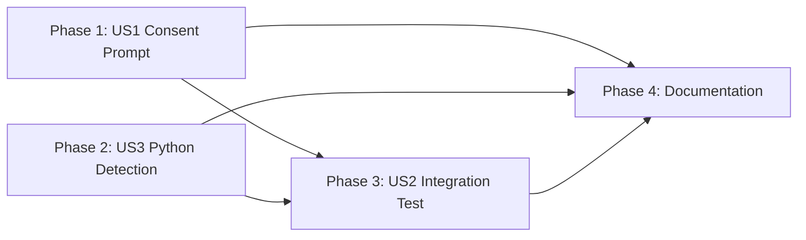

# Tasks: Validation Fixes from 010-addclaudeinstructions

## Overview

- **Total Tasks**: 18
- **Parallel Opportunities**: 8 tasks marked [P]
- **User Stories**: 6 (US1-US6) across 4 phases
- **Estimated Scope**: Surgical fixes across 8 files; 1 new file created

## Dependencies

Note: Phases 1 and 2 are independent and can run in parallel. Phase 3 depends on
Phase 2 (Python detection must be in place for the integration test to exercise
re-detection). Phase 4 is documentation-only and can run in parallel with Phases
1-3 but is sequenced last for logical ordering.

---

## Phase 1: User Consent Prompt (US1 - P1, RED)

**Goal**: Add user consent prompt in `syncMissingResources()` before generating
AI instruction files, with session-scoped decline tracking.

**Story**: As a developer, I want to be prompted before AI instruction files are
generated in my workspace, so that I have control over what files are created.

**Independent Test Criteria**:

- Open a workspace lacking AI instruction files and verify a prompt appears
- Selecting "Yes" generates files; selecting "No" prevents generation and
  suppresses future prompts for the session

### Implementation

- [x] T001 [US1] Add `private instructionPromptDeclined = false` instance
      variable to `GoferMigrator` class in `extension/src/goferMigrator.ts`
      (line 34 area, alongside other private fields)
- [x] T002 [US1] Modify `syncMissingResources()` in
      `extension/src/goferMigrator.ts` at line 472-475 to: (1) check
      `this.instructionPromptDeclined` first -- if true, skip silently; (2) show
      `vscode.window.showInformationMessage()` with "Yes"/"No" options; (3) if
      "Yes", proceed with `this.resourceSyncer.setupDefaultInstructions()`; (4)
      if "No", set `this.instructionPromptDeclined = true` and skip; (5) if
      dismissed (undefined), skip this invocation but do NOT set the decline
      flag
- [x] T003 [US1] Write unit test: prompt is shown when AI instructions are
      missing, in `tests/unit/extension/GoferMigrator.test.ts`
- [x] T004 [P] [US1] Write unit test: files are generated when user selects
      "Yes", in `tests/unit/extension/GoferMigrator.test.ts`
- [x] T005 [P] [US1] Write unit test: files are NOT generated when user selects
      "No", in `tests/unit/extension/GoferMigrator.test.ts`
- [x] T006 [P] [US1] Write unit test: no prompt shown on second call after
      decline (session persistence), in
      `tests/unit/extension/GoferMigrator.test.ts`
- [x] T007 [P] [US1] Write unit test: dismissed prompt (undefined response) does
      not set decline flag -- prompt reappears on next call, in
      `tests/unit/extension/GoferMigrator.test.ts`

**Verification**:

- [x] All 5 new GoferMigrator unit tests pass
- [x] Existing GoferMigrator tests still pass
- [x] `npm run lint` passes

---

## Phase 2: Python Detection (US3 - P2, YELLOW)

**Goal**: Add `setup.py` and `requirements.txt` to Python language detection in
`ProjectDetector.detectLanguage()`.

**Story**: As a developer with a Python project that uses setuptools or pip, I
want my project to be correctly detected as Python, so that the generated AI
instruction files include Python-specific guidance.

**Independent Test Criteria**:

- Create a workspace with only `setup.py` -- detected language is "python"
- Create a workspace with only `requirements.txt` -- detected language is
  "python"
- Priority order preserved: `tsconfig.json` > `pyproject.toml` > `setup.py` >
  `requirements.txt` > `go.mod`

### Implementation

- [x] T008 [US3] Add `{ file: 'setup.py', language: 'python' }` and
      `{ file: 'requirements.txt', language: 'python' }` to the `checks` array
      in `detectLanguage()` at line 69 of
      `extension/src/services/ProjectDetector.ts` (after `pyproject.toml`,
      before `go.mod`)
- [x] T009 [P] [US3] Write unit test: workspace with only `setup.py` detects as
      "python", in `tests/unit/services/ProjectDetector.test.ts`
- [x] T010 [P] [US3] Write unit test: workspace with only `requirements.txt`
      detects as "python", in `tests/unit/services/ProjectDetector.test.ts`
- [x] T011 [P] [US3] Write unit test: workspace with `pyproject.toml` AND
      `setup.py` detects via `pyproject.toml` (priority order preserved), in
      `tests/unit/services/ProjectDetector.test.ts`
- [x] T012 [US3] Write unit test: workspace with `tsconfig.json` AND
      `requirements.txt` detects as "typescript" (higher priority wins), in
      `tests/unit/services/ProjectDetector.test.ts`

**Verification**:

- [x] All 4 new ProjectDetector unit tests pass
- [x] Existing ProjectDetector tests still pass
- [x] Priority order verified: `tsconfig.json` > `pyproject.toml` > `setup.py` >
      `requirements.txt` > `go.mod` > ... > `package.json`

---

## Phase 3: Integration Test for Regeneration Re-Detection (US2 - P1, RED)

**Goal**: Create the missing integration test that verifies regenerate command
correctly re-detects project characteristics after manifest file changes.

**Story**: As a QA engineer, I want an integration test verifying that the
regenerate command re-detects project characteristics when manifest files
change, so that the T035b test gap is closed.

**Independent Test Criteria**:

- The integration test file exists at
  `tests/integration/instruction-generation.test.ts`
- The test passes when run with `npm test`

### Implementation

- [x] T013 [US2] Create `tests/integration/instruction-generation.test.ts` with
      test structure: (1) Setup temp workspace with `package.json` only
      (JavaScript project); (2) Run `ProjectDetector.detect()` and
      `InstructionGenerator.generateClaudeMd()` -- verify content references
      "JavaScript"; (3) Write `tsconfig.json` to workspace; (4) Re-run
      `ProjectDetector.detect()` and `InstructionGenerator.generateClaudeMd()`
      -- verify content now references "TypeScript"; (5) Cleanup temp workspace
- [x] T014 [US2] Verify the integration test uses real `FileUtils` (unmocked fs)
      since this is an integration test operating on actual temp directories,
      following existing patterns from
      `tests/integration/command-registration.test.ts`

**Verification**:

- [x] Integration test passes with `npm test`
- [x] Test is discovered by Vitest test runner
- [x] Test exercises real file I/O (no mocked filesystem)

---

## Phase 4: Documentation Fixes (US4, US5, US6)

**Goal**: Align spec text, test descriptions, and documentation with actual
implementation behavior.

### US4: Line Count Threshold Alignment (P2, YELLOW)

- [x] T015 [P] [US4] Update test description in
      `tests/unit/services/InstructionGenerator.test.ts` line 169: change "under
      60 lines" to "under 80 lines" (assertion at line 174 already uses
      `toBeLessThan(80)` -- no assertion change needed)
- [x] T016 [P] [US4] Update `.specify/specs/010-addclaudeinstructions/spec.md`
      line 283: change `< 60 lines` to `< 80 lines` in the Success Criteria
      table; and line 348: change `CLAUDE.md < 60 lines optimal` to
      `CLAUDE.md < 80 lines optimal` in the Research Traceability table

### US5: File Conflict Options (P2, YELLOW)

- [x] T017 [P] [US5] Update `.specify/specs/010-addclaudeinstructions/spec.md`
      lines 106-107: change "overwrite, merge (append new sections), or skip" to
      "overwrite, skip, or backup & replace"

### US6: MEMORY.md Pipeline Orchestration (P3, Architecture)

- [x] T018 [US6] Update
      `~/.claude/projects/-Users-douglaswross-Code-gofer/memory/MEMORY.md`
      section "DEPRECATED: Pipeline auto-chaining via Skill invocation (replaced
      by sub-agent architecture)" to: (1) Change the section title to remove
      "DEPRECATED" since Skill-based chaining is the current active pattern; (2)
      Clarify that Skill-based AUTO-CHAIN is the current implementation; (3)
      Note that sub-agent dispatch is planned for a future feature
      (012-subagent-migration); (4) Reference ADR-011-003 for the deferral
      decision

**Verification**:

- [x] All existing tests pass (no assertion changes needed)
- [x] Spec text matches implementation behavior
- [x] MEMORY.md accurately describes current pipeline orchestration pattern

---

## Parallel Execution Guide

Tasks marked [P] can run concurrently if they modify different files or have no
dependencies on incomplete tasks.

**Phase 1 parallel groups**:

- T004, T005, T006, T007 (independent test cases in same test file, but can be
  written in a single pass after T003 establishes the test structure)

**Phase 2 parallel groups**:

- T009, T010, T011 (independent test cases in same test file, can be written in
  a single pass after T008)

**Phase 4 parallel groups**:

- T015, T016, T017 (all modify different files)

**Cross-phase parallelism**:

- Phase 1 (T001-T007) and Phase 2 (T008-T012) are fully independent
- Phase 4 (T015-T018) can run in parallel with Phases 1-3

---

## Implementation Strategy

1. **Start with RED findings**: Phase 1 (US1) and Phase 2 (US3) address the two
   RED and one YELLOW blocking findings. These should be implemented first.
2. **Integration test second**: Phase 3 (US2) depends on Phase 2 completing
   since the re-detection flow exercises ProjectDetector.
3. **Documentation last**: Phase 4 (US4, US5, US6) is pure text changes with no
   code dependencies. Safe to do at any point.
4. **Commit after each phase**: Each phase produces independently verifiable
   results.

---

## Plan Phase Coverage (GAP-02)

| Plan Phase                                   | Task Count | Task IDs  | Status  |
| -------------------------------------------- | ---------- | --------- | ------- |
| Phase 1: User Consent Prompt (US1)           | 7          | T001-T007 | COVERED |
| Phase 2: Python Detection (US3)              | 5          | T008-T012 | COVERED |
| Phase 3: Integration Test (US2)              | 2          | T013-T014 | COVERED |
| Phase 4: Documentation Fixes (US4, US5, US6) | 4          | T015-T018 | COVERED |

All 4 plan phases have implementing tasks. VALIDATION PASSED.

## Acceptance Criteria Traceability (GAP-03)

| User Story | Acceptance Criterion                                 | Task(s)                    | Status  |
| ---------- | ---------------------------------------------------- | -------------------------- | ------- |
| US1        | Prompt shown before generation                       | T001, T002, T003           | COVERED |
| US1        | "Yes" generates files                                | T002, T004                 | COVERED |
| US1        | "No" prevents generation + suppresses future prompts | T002, T005, T006           | COVERED |
| US1        | Declined session does not re-prompt                  | T001, T006                 | COVERED |
| US1        | New session re-prompts (instance variable reset)     | T001 (instance var design) | COVERED |
| US1        | Dismissed prompt does not set decline flag           | T002, T007                 | COVERED |
| US2        | JS project detected as JavaScript                    | T013                       | COVERED |
| US2        | Adding tsconfig.json changes detection to TypeScript | T013                       | COVERED |
| US2        | Test exists and passes                               | T013, T014                 | COVERED |
| US3        | `setup.py` detected as python                        | T008, T009                 | COVERED |
| US3        | `requirements.txt` detected as python                | T008, T010                 | COVERED |
| US3        | `pyproject.toml` takes priority over `setup.py`      | T008, T011                 | COVERED |
| US3        | Higher-priority manifest wins                        | T008, T012                 | COVERED |
| US4        | Spec says `< 80 lines`                               | T016                       | COVERED |
| US4        | Tests say `< 80 lines`                               | T015                       | COVERED |
| US5        | Spec says "backup & replace"                         | T017                       | COVERED |
| US6        | MEMORY.md reflects current Skill-based chaining      | T018                       | COVERED |
| US6        | Reference to 012-subagent-migration exists           | T018                       | COVERED |

All 18 acceptance criteria map to at least one task. VALIDATION PASSED.

## File Structure Alignment

| Task       | File Path                                                            | In Plan Structure? |
| ---------- | -------------------------------------------------------------------- | ------------------ |
| T001, T002 | `extension/src/goferMigrator.ts`                                     | Yes                |
| T003-T007  | `tests/unit/extension/GoferMigrator.test.ts`                         | Yes                |
| T008       | `extension/src/services/ProjectDetector.ts`                          | Yes                |
| T009-T012  | `tests/unit/services/ProjectDetector.test.ts`                        | Yes                |
| T013-T014  | `tests/integration/instruction-generation.test.ts`                   | Yes (new file)     |
| T015       | `tests/unit/services/InstructionGenerator.test.ts`                   | Yes                |
| T016, T017 | `.specify/specs/010-addclaudeinstructions/spec.md`                   | Yes                |
| T018       | `~/.claude/projects/-Users-douglaswross-Code-gofer/memory/MEMORY.md` | Yes                |

All file paths match the plan.md file structure section. VALIDATION PASSED.

## Coverage Summary

- Plan Phases: 4/4 covered (100%)
- User Stories: 6/6 covered (100%)
- Acceptance Criteria: 18/18 covered (100%)
- Functional Requirements: 7/7 covered (FR-001 through FR-007)

**Status**: VALIDATION PASSED
