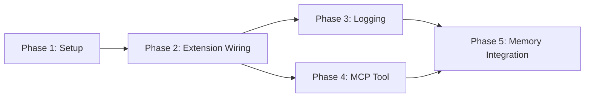

# Tasks: Context Health Integration

## Overview

- **Total Tasks**: 24
- **Parallel Opportunities**: 12 tasks marked [P]
- **User Stories**: 7 (US1-US7)
- **Phases**: 5

## Dependencies

---

## Phase 1: Setup

**Goal**: Prepare exports and imports for integration

- [x] T001 Add component exports to extension/src/autonomous/index.ts
- [x] T002 [P] Add ContextHealthStatusBar export to extension/src/ui/index.ts
      (create if needed)

**Verification**: All components importable from index files ✓

---

## Phase 2: Extension Activation Wiring (US1, US2, US3)

**Goal**: Wire context health components to extension activation

**Stories Covered**:

- US1: Extension Activation
- US2: Status Bar Display
- US3: Automatic Handoff Notification

### Implementation

- [x] T003 [US1] Add module-level variables for context health components in
      extension/src/extension.ts
- [x] T004 [US1] Add imports for ContextHealthMonitor, AutoHandoffTrigger,
      ContextUsageLogger in extension/src/extension.ts
- [x] T005 [US2] Create ContextHealthStatusBar in registerTreeViews() in
      extension/src/extension.ts
- [x] T006 [US1] Initialize ContextUsageLogger in initializeForWorkspace() in
      extension/src/extension.ts
- [x] T007 [US1] Initialize ContextHealthMonitor in initializeForWorkspace() in
      extension/src/extension.ts
- [x] T008 [US3] Initialize AutoHandoffTrigger in initializeForWorkspace() in
      extension/src/extension.ts
- [x] T009 [US2] Connect ContextHealthStatusBar to ContextHealthMonitor in
      extension/src/extension.ts
- [x] T010 [US3] Connect AutoHandoffTrigger to ContextHealthMonitor and logger
      in extension/src/extension.ts
- [x] T011 [US1] Start monitoring and register disposal in
      extension/src/extension.ts

**Verification**:

- [x] Extension activates without errors
- [x] Status bar appears with health indicator
- [x] Components dispose on deactivation

---

## Phase 3: JSONL Logging (US4, US6)

**Goal**: Activate JSONL logging for context health and memory events

**Stories Covered**:

- US4: JSONL Logging
- US6: Memory System Integration (partial)

### Implementation

- [x] T012 [US4] Connect health monitor events to logger in
      extension/src/extension.ts
- [x] T013 [P] [US6] Add logMemorySave method to
      extension/src/autonomous/ContextUsageLogger.ts
- [x] T014 [P] [US6] Add logMemorySearch method to
      extension/src/autonomous/ContextUsageLogger.ts
- [x] T015 [P] [US6] Add logMemoryLoad method to
      extension/src/autonomous/ContextUsageLogger.ts
- [x] T016 [P] [US6] Add logLoadingDecision method to
      extension/src/autonomous/ContextUsageLogger.ts

**Verification**:

- [x] .specify/logs/context-usage.jsonl created on first event
- [x] Health check events logged with correct schema

---

## Phase 4: MCP Tool Real Data (US5)

**Goal**: Replace placeholder values with real context health data

**Story Covered**: US5: MCP Tool Integration

### Implementation

- [x] T017 [US5] Add persistState method to
      extension/src/autonomous/ContextHealthMonitor.ts
- [x] T018 [US5] Call persistState on status changes in
      extension/src/autonomous/ContextHealthMonitor.ts
- [x] T019 [US5] Read state file in getContextHealth() in
      language-server/src/mcp/toolHandler.ts
- [x] T020 [P] [US5] Add calculateContextHealthFromFiles fallback in
      language-server/src/mcp/toolHandler.ts

**Verification**:

- [x] .specify/memory/context-health-state.json created
- [x] MCP tool returns real values (not 50000 placeholder)

---

## Phase 5: Memory Integration (US6, US7)

**Goal**: Log memory operations and loading decisions

**Stories Covered**:

- US6: Memory System Integration (complete)
- US7: Pipeline Memory Awareness

### Implementation

- [x] T021 [US6] Add setUsageLogger method to
      extension/src/autonomous/MemoryManager.ts
- [x] T022 [US6] Log memory operations in MemoryManager save/search/load methods
- [x] T023 [US7] Log loading decisions in
      extension/src/autonomous/ContextBuilder.ts
- [x] T024 [US6] Wire logger to MemoryManager in extension/src/extension.ts

**Verification**:

- [x] memory_save events logged
- [x] memory_search events logged with timing
- [x] loading_decision events show coverage %

---

## Parallel Execution Guide

Tasks marked [P] can run concurrently:

| Group          | Tasks                  | Description                      |
| -------------- | ---------------------- | -------------------------------- |
| Setup          | T001, T002             | Export updates                   |
| Logger methods | T013, T014, T015, T016 | Independent method additions     |
| MCP fallback   | T020                   | Independent of state persistence |

---

## Acceptance Criteria Traceability

| User Story | Acceptance Criteria                                   | Task(s)                               |
| ---------- | ----------------------------------------------------- | ------------------------------------- |
| US1        | Monitor created on activation                         | T003, T004, T007                      |
| US1        | Monitor starts with default config                    | T007                                  |
| US1        | Monitor stops on deactivation                         | T011                                  |
| US2        | StatusBar registered on activation                    | T005                                  |
| US2        | Status bar shows color-coded health                   | T009                                  |
| US2        | Status updates in real-time                           | T009                                  |
| US3        | AutoHandoff connects to monitor events                | T008, T010                            |
| US3        | Notification at critical threshold                    | T010                                  |
| US3        | 5-minute cooldown                                     | T010 (inherent in AutoHandoffTrigger) |
| US4        | Logger writes to JSONL                                | T012                                  |
| US4        | Logs health_check, masking, stage_transition, handoff | T012                                  |
| US5        | MCP returns actual token counts                       | T017, T018, T019                      |
| US5        | MCP returns real breakdown                            | T019, T020                            |
| US6        | MemoryManager initialized                             | Already done (line 1064)              |
| US6        | Memory loading decisions logged                       | T015, T22                             |
| US6        | Memory operations tracked                             | T21, T22                              |
| US7        | Pipeline can access MemoryManager                     | Already done via ContextBuilder       |
| US7        | Memory coverage in health breakdown                   | T23                                   |

---

## Implementation Strategy

1. **Phase 1-2 First**: Get core wiring working
2. **Phase 3**: Enable logging to see what's happening
3. **Phase 4**: Fix MCP tool for AI assistants
4. **Phase 5**: Complete memory integration

Each phase can be verified independently before proceeding.

---

## Notes

- Components already exist and are tested
- This is integration work, not new feature development
- MemoryManager is already initialized at extension.ts:1064
- All 1333 existing tests must continue to pass
