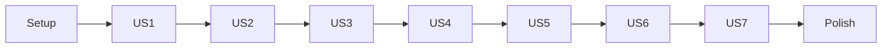

# Tasks: Consultative Business Discovery

## Overview

- **Total Tasks**: 32
- **Parallel Opportunities**: 12 tasks marked [P]
- **User Stories**: 7 phases (US1-US7)

## Dependencies

Note: US1-US3 (P1 priority) form the MVP. US4-US7 are lower priority
enhancements.

---

## Phase 1: Setup

**Goal**: Create discovery template and prepare orchestrator structure

- [x] T001 Create discovery template at
      `.specify/templates/discovery-template.md`
- [x] T002 [P] Add discovery phase placeholder in
      `.claude/commands/0_business_scenario.md`
- [x] T003 [P] Add "Skip Discovery" option to orchestrator routing

**Verification**: ✅ Template exists, orchestrator has discovery phase with Skip
option

---

## Phase 2: User Story 1 - Problem Discovery Interview (Priority: P1)

**Goal**: AI asks consultative questions about the problem being solved

**Story**: As a Product Manager starting a new feature, I want the AI to ask
consultative questions about the problem I'm solving so that the resulting
feature is grounded in real business needs.

**Independent Test**: Start `/0_business_scenario`, select "New Feature", verify
AI asks about problem before asking for feature name

### Implementation

- [x] T004 [US1] Implement Problem Discovery question with AskUserQuestion
      options table in `.claude/commands/0_business_scenario.md`
- [x] T005 [US1] Add AI recommendation with reasoning for problem question
      (format: `**Recommended:** Option [X] - <reasoning>`)
- [x] T006 [US1] Implement "yes"/"recommended" shortcut acceptance logic
- [x] T007 [US1] Create Problem Statement section writer for discovery.md

**Verification**: ✅ All implemented in Step 2.5 of orchestrator

---

## Phase 3: User Story 2 - User Segmentation Discovery (Priority: P1)

**Goal**: AI asks about primary users and their technical expertise

**Story**: As a Product Manager, I want the AI to ask who the primary users are
and their technical expertise so that the feature is designed for the right
audience.

**Independent Test**: Verify AI asks about users after problem discovery, with
persona options

### Implementation

- [x] T008 [US2] Implement User Segmentation question with persona options in
      `.claude/commands/0_business_scenario.md`
- [x] T009 [US2] Add AI recommendation for user type based on problem context
- [x] T010 [US2] Create Target Users section writer for discovery.md
- [x] T011 [P] [US2] Handle custom user description input

**Verification**: ✅ All implemented in Step 2.5 (Discovery Question 2)

---

## Phase 4: User Story 3 - Value Proposition and Metrics Discovery (Priority: P1)

**Goal**: AI asks what value should be delivered and how to measure success

**Story**: As a Product Manager, I want the AI to ask what specific value this
feature should deliver and how to measure success so that the implementation has
clear, measurable goals.

**Independent Test**: Verify AI asks about value delivery and presents metric
categories

### Implementation

- [x] T012 [US3] Implement Value Proposition question with value types in
      `.claude/commands/0_business_scenario.md`
- [x] T013 [US3] Implement Success Metrics question with metric categories
- [x] T014 [US3] Add AI-suggested metrics based on value type selected
- [x] T015 [US3] Create Value Proposition and Success Metrics sections in
      discovery.md

**Verification**: ✅ All implemented in Step 2.5 (Questions 3 & 4)

---

## Phase 5: User Story 4 - Competitive Landscape Analysis (Priority: P2)

**Goal**: AI offers to research how leading companies solve the problem

**Story**: As a Product Manager, I want the AI to offer to research how leading
companies solve this problem so that I can learn from existing solutions.

**Independent Test**: Verify AI offers competitive research after problem
discovery, and allows skip

### Implementation

- [x] T016 [US4] Add optional Competitive Research offer in discovery flow
- [x] T017 [US4] Implement skip logic that marks "Competitive Analysis: Skipped"
      in discovery.md
- [x] T018 [P] [US4] Create Competitive Analysis section writer with insights
      table
- [x] T019 [US4] Document differentiation opportunities in discovery.md

**Verification**: ✅ All implemented in Step 2.5 (Optional Competitive Research)

---

## Phase 6: User Story 5 - Adaptive Depth Detection (Priority: P2)

**Goal**: AI detects uncertainty and offers deeper exploration

**Story**: As a Product Manager unfamiliar with the problem space, I want the AI
to detect when I'm uncertain and offer deeper exploration so that I don't miss
critical context.

**Independent Test**: Respond "I'm not sure" and verify AI offers to go deeper

### Implementation

- [x] T020 [US5] Implement uncertainty detection logic (phrases: "I'm not sure",
      "what would you suggest?", "not certain")
- [x] T021 [US5] Add deeper question offering when uncertainty detected
- [x] T022 [US5] Implement scope complexity detection (multiple user types,
      integrations)
- [x] T023 [US5] Handle smooth flow when no uncertainty (proceed without extra
      depth)

**Verification**: ✅ All implemented in Step 2.5 (Adaptive Depth section)

---

## Phase 7: User Story 6 - Memory Persistence for Pipeline Context (Priority: P2)

**Goal**: Store discovery findings as retrievable memories

**Story**: As a developer implementing the feature, I want discovery findings to
be stored as retrievable memories so that subsequent pipeline stages have
intelligent access to business context.

**Independent Test**: Complete discovery, verify Memory entries exist with
category 'discovery'

### Implementation

- [x] T024 [US6] Create Memory entry for problem statement using
      `MemoryManager.save()`
- [x] T025 [P] [US6] Create Memory entry for target users with tags
- [x] T026 [P] [US6] Create Memory entry for value proposition and metrics
- [x] T027 [US6] Update `/1_gofer_research` to load discovery context via
      MemoryManager
- [x] T028 [US6] Update `/2_gofer_specify` to auto-populate spec sections from
      discovery Memory

**Verification**: ✅ Memory instructions in orchestrator, pipeline commands
updated

---

## Phase 8: User Story 7 - Skip Discovery Option (Priority: P3)

**Goal**: Allow experienced users to skip discovery and go straight to routing

**Story**: As an experienced user with clear requirements, I want to skip the
discovery phase and go straight to routing so that I'm not forced through
unnecessary questions.

**Independent Test**: Start `/0_business_scenario` and select "Skip Discovery"
option

### Implementation

- [x] T029 [US7] Ensure "Skip Discovery" option visible in initial orchestrator
      prompt
- [x] T030 [US7] Implement skip logic that bypasses all discovery questions
- [x] T031 [US7] Verify no discovery.md artifact created when skipped

**Verification**: ✅ Skip option implemented at start of Step 2.5

---

## Phase 9: Polish & Integration

**Goal**: Finalize and sync all command files

- [x] T032 [P] Sync `0_business_scenario.md` to
      `extension/resources/claude-commands/`
- [x] T033 [P] Sync modified `/1_gofer_research.md` to bundled commands
- [x] T034 [P] Sync modified `/2_gofer_specify.md` to bundled commands
- [x] T035 Handle edge cases: mid-flow abandonment (save partial discovery.md
      with status: incomplete)
- [x] T036 Handle edge cases: re-run discovery on existing feature (merge vs
      replace prompt)

**Verification**: ✅ All commands synced, edge cases documented in Step 2.5

---

## Parallel Execution Guide

Tasks marked [P] can run concurrently if they:

- Modify different files
- Have no dependencies on incomplete tasks

**Parallel groups**:

- T002, T003 (setup tasks in different sections)
- T011, T018 (independent section writers)
- T025, T026 (independent Memory entries)
- T032, T033, T034 (independent file syncs)

---

## Implementation Strategy

### MVP First (US1-US3)

1. Complete Phase 1: Setup (T001-T003)
2. Complete Phase 2: Problem Discovery (T004-T007)
3. Complete Phase 3: User Segmentation (T008-T011)
4. Complete Phase 4: Value & Metrics (T012-T015)
5. **VALIDATE**: Full discovery flow creates discovery.md

### Incremental Delivery

1. MVP: Problem → Users → Value → discovery.md (US1-US3)
2. Add Competitive Research option (US4)
3. Add Adaptive Depth (US5)
4. Add Memory Persistence (US6)
5. Ensure Skip works (US7)
6. Polish & Sync

---

## Traceability

### Plan Phase → Tasks Mapping

| Plan Phase                    | Tasks                  | Status  |
| ----------------------------- | ---------------------- | ------- |
| Phase 1: Setup                | T001-T003              | COVERED |
| Phase 2: Core Questions       | T004-T015              | COVERED |
| Phase 3: Adaptive Depth       | T020-T023              | COVERED |
| Phase 4: Discovery Artifact   | T007, T010, T015, T018 | COVERED |
| Phase 5: Memory Persistence   | T024-T028              | COVERED |
| Phase 6: Pipeline Integration | T027-T028              | COVERED |
| Phase 7: Sync & Polish        | T032-T036              | COVERED |

### Spec User Story → Tasks Mapping

| User Story                 | Priority | Tasks     | AC Covered |
| -------------------------- | -------- | --------- | ---------- |
| US1 - Problem Discovery    | P1       | T004-T007 | 4/4        |
| US2 - User Segmentation    | P1       | T008-T011 | 3/3        |
| US3 - Value & Metrics      | P1       | T012-T015 | 4/4        |
| US4 - Competitive Analysis | P2       | T016-T019 | 4/4        |
| US5 - Adaptive Depth       | P2       | T020-T023 | 4/4        |
| US6 - Memory Persistence   | P2       | T024-T028 | 4/4        |
| US7 - Skip Discovery       | P3       | T029-T031 | 3/3        |

### Requirement → Tasks Mapping

| FR     | Tasks                  | Coverage |
| ------ | ---------------------- | -------- |
| FR-001 | T004, T008, T012, T016 | COVERED  |
| FR-002 | T005, T009, T014       | COVERED  |
| FR-003 | T006                   | COVERED  |
| FR-004 | T007, T010, T015, T018 | COVERED  |
| FR-005 | T024, T025, T026       | COVERED  |
| FR-006 | T003, T029-T031        | COVERED  |
| FR-007 | T020-T023              | COVERED  |
| FR-008 | T032-T034              | COVERED  |
| FR-009 | T028                   | COVERED  |
| FR-010 | T027                   | COVERED  |

**Coverage Summary**: 7/7 user stories, 10/10 functional requirements, all
acceptance criteria

---

## Notes

- Discovery questions written for Product Managers (non-technical language)
- Each question includes concrete examples to choose from
- AI recommendations include brief reasoning (1-2 sentences)
- Memory entries use category 'discovery' with feature-specific tags
- Bundled commands must stay in sync with source commands
