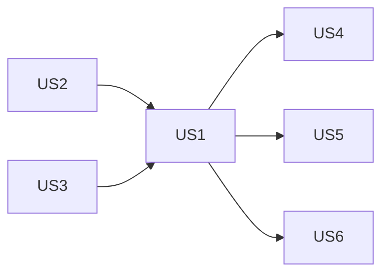

# Tasks: Context Management Completion

## Overview

- **Total Tasks**: 24
- **Parallel Opportunities**: 10 tasks marked [P]
- **User Stories**: 6 (US1-US6)

## Dependencies

US2 (saveProgress) and US3 (filter logging) are independent quick fixes.
US1 (observation masking) is foundational for context breakdown.
US4/US5/US6 can proceed in parallel after US1.

---

## Phase 1: Quick Fixes (Independent, High Impact)

**Goal**: Fix low-hanging gaps that each touch a single file

### US2 — Register gofer.saveProgress Command (C3: 3/5 → 5/5)

- [x] T001 [US2] Register `gofer.saveProgress` command in `registerGlobalCommands()` in `extension/src/extension.ts`
  - Accept `{ handoffContent, healthStatus, reason }` payload from AutoHandoffTrigger
  - Write handoffContent to `.specify/specs/{active-feature}/session-handoff.md`
  - Show confirmation message: "Session saved. Resume with /8_gofer_resume"
  - If no payload, generate handoff via ContextBuilder/AutoHandoffTrigger

- [x] T002 [US2] Wire `gofer.saveProgress` to AutoHandoffTrigger in `extension/src/extension.ts`
  - In `initializeContextHealthMonitoring()`, after creating AutoHandoffTrigger
  - Call `autoHandoffTrigger.setContextBuilder(contextBuilder)` (already done)
  - Verify the command is available before AutoHandoffTrigger calls it

### US3 — Filter Noisy JSONL Logging (A5: 3/5 → 5/5)

- [x] T003 [P] [US3] Add throttle logic to `logHealthCheck()` in `extension/src/autonomous/ContextUsageLogger.ts`
  - Track `lastEstimatedLogTime` field
  - If `dataSource === 'estimated'`, only log once per 5 minutes (300,000ms)
  - Always log when `dataSource === 'real'`
  - Always log on status transitions (healthy→warning, warning→critical)

- [x] T004 [P] [US3] Update event handlers in `extension/src/extension.ts` (lines 408-444)
  - Pass `dataSource` from ContextHealthStatus to logHealthCheck calls
  - Ensure status-change events always get logged regardless of throttle

**Checkpoint**: saveProgress button works, JSONL file growth reduced by 90%+ during idle

---

## Phase 2: Observation Masking Wire-Up (US1 — B1: 2/5 → 5/5)

**Goal**: Feed Claude Code tool outputs into ObservationMasker via hook bridge

- [x] T005 [US1] Add observation tracking to `bridge-update` handler in `extension/src/extension.ts`
  - In `initializeContextHealthMonitoring()` where `hookBridgeWatcher.on('bridge-update', ...)` fires (line ~369)
  - When `bridgeData.lastToolUse` is present and has changed since last check:
    - Call `contextBuilder.trackObservation(toolName, '', { toolName, timestamp }, toolName)`
    - Track last processed tool use timestamp to avoid duplicates

- [x] T006 [US1] Add turn tracking to ContextBuilder in `extension/src/autonomous/ContextBuilder.ts`
  - Add `incrementTurn()` method to advance `currentTurn` counter
  - Call `incrementTurn()` from bridge-update handler when new tool use detected
  - This ensures observation age thresholds work correctly

- [x] T007 [US1] Add outputTokens to existing `post-tool-use.mjs` hook script
  - Updated `.specify/scripts/hooks/post-tool-use.mjs` and `extension/resources/hook-scripts/post-tool-use.mjs`
  - `lastToolUse` now includes `outputTokens: usage?.outputTokens || 0`
  - This gives ObservationMasker real output size data from Claude API usage

- [x] T008 [US1] Wire automatic masking on health check in `extension/src/extension.ts`
  - After each health check (in the `bridge-update` handler), call `contextBuilder.maskOldObservations()`
  - This applies the stage-aware observation window threshold
  - Old tool outputs get replaced with XML placeholders automatically

- [x] T009 [US1] Add observation stats to ContextHealthStatus in `extension/src/autonomous/ContextHealthMonitor.ts`
  - Add `observationStats: { total: number, masked: number, tokensSaved: number }` to ContextHealthStatus
  - Populate from ObservationMasker cache stats during `analyzeContext()`
  - This data feeds US4 (context breakdown display)

**Checkpoint**: Tool use events tracked, old observations masked automatically, context reduction measurable

---

## Phase 3: Constitution Tree View — Context Breakdown (US4)

**Goal**: Show real-time context window categories in the Constitution panel

- [x] T010 [US4] Add `ContextBreakdownItem` class to `extension/src/constitutionProvider.ts`
  - New TreeItem subclass for context breakdown entries
  - Icon: `$(pulse)` for health, `$(info)` for stage, `$(symbol-number)` for token counts
  - Collapsible parent items, leaf items for each category

- [x] T011 [US4] Add `setContextHealthMonitor()` method to ConstitutionProvider in `extension/src/constitutionProvider.ts`
  - Accept ContextHealthMonitor reference
  - Listen for `status-change` events to trigger tree refresh
  - Store latest ContextHealthStatus for tree building

- [x] T012 [US4] Modify `getChildren()` in ConstitutionProvider in `extension/src/constitutionProvider.ts`
  - When element is undefined (root level):
    - Return existing articles PLUS a separator item PLUS context breakdown items
  - Context breakdown items:
    - `Context Health: XX% (Model)` — collapsible, with colored icon
    - Children: Conversation, Spec Artifacts, Memories, System Files, Hints, Observations
    - `Stage: {stage} (budget: XX% code)` — leaf item
  - When no session active, show "Context Health: -- (No session)"

- [x] T013 [US4] Wire ConstitutionProvider to ContextHealthMonitor in `extension/src/extension.ts`
  - In `initializeContextHealthMonitoring()`, call `constitutionProvider.setContextHealthMonitor(monitor)`
  - Pass the monitor reference so tree updates on health changes

- [x] T014 [US4] Add QuickPick details on item click in `extension/src/constitutionProvider.ts`
  - Added `gofer.showContextCategoryDetail` command in extension.ts
  - Context category items now have click commands that open QuickPick with token count, percentage, budget allocation, recommendations, and observation stats

**Checkpoint**: Constitution panel shows live context window breakdown with categories

---

## Phase 4: Memory Tree View — Categorized Memories (US5)

**Goal**: Group memories by category with counts in the Memory panel

- [x] T015 [US5] Add `MemoryCategoryItem` class to `extension/src/memoryProvider.ts`
  - TreeItem subclass for category headers (e.g., "discovery (3)")
  - Collapsible, with icon per category: `$(lightbulb)` discovery, `$(law)` decision, `$(symbol-pattern)` pattern, `$(eye)` observation
  - Children are individual memory items with truncated content

- [x] T016 [US5] Add `loadMemoriesFromJSONL()` method to MemoryProvider in `extension/src/memoryProvider.ts`
  - Read `.specify/memory/memories.jsonl` (MemoryStorage format)
  - Parse each line as JSON, extract `category`, `content`, `tags`, `priority`
  - Group by category, sort by priority within each group
  - Hide empty categories

- [x] T017 [US5] Modify `getChildren()` in MemoryProvider in `extension/src/memoryProvider.ts`
  - When element is undefined (root level):
    - Return existing document items PLUS a separator PLUS category group items
  - When element is a MemoryCategoryItem:
    - Return individual memory items for that category
  - Each memory shows truncated content (first 80 chars) as label

- [x] T018 [US5] Add memory detail view on click in `extension/src/memoryProvider.ts`
  - Added `gofer.showMemoryDetail` command in extension.ts
  - Memory entry items now have click commands that open QuickPick with full content, category, tags, priority, created date, last used, and stale status

**Checkpoint**: Memory panel shows categorized memories with counts, clickable for details

---

## Phase 5: Citation Verification (US6 — D4: 0/5 → 3/5)

**Goal**: Validate memory citations before injection

- [x] T019 [US6] Create `CitationVerifier` class in `extension/src/autonomous/CitationVerifier.ts`
  - `extractCitations(content: string)`: Extract file paths and function names from memory text
  - Regex patterns: `/(?:^|\s)([\w./]+\.(?:ts|js|py|md|json|yaml))/` for file paths
  - Regex patterns: `/(?:function|class|interface|type)\s+(\w+)/` for code references

- [x] T020 [US6] Add `verifyCitations()` method to CitationVerifier in `extension/src/autonomous/CitationVerifier.ts`
  - For each extracted file path, check `fs.existsSync(path.join(workspaceRoot, filePath))`
  - For function names, optionally grep the codebase (or skip for performance)
  - Return `{ total: number, stale: number, staleRefs: string[] }`

- [x] T021 [US6] Add `addStalenessWarning()` method to CitationVerifier in `extension/src/autonomous/CitationVerifier.ts`
  - If >50% of citations are stale, prefix memory content with:
    `⚠️ [STALE CITATIONS: X/Y references may be outdated] `
  - Log stale citations to ContextUsageLogger for user awareness
  - Do NOT block injection — warning only

- [x] T022 [US6] Wire CitationVerifier into ContextBuilder in `extension/src/autonomous/ContextBuilder.ts`
  - Before injecting a memory into context (in `buildContext()` memory loading section)
  - Call `citationVerifier.verifyCitations(memory.content)`
  - If stale, call `addStalenessWarning()` and wrap the content
  - Log citation check results via ContextUsageLogger

**Checkpoint**: Stale memory citations detected and warned about before context injection

---

## Phase 6: Polish & Integration

**Goal**: Cross-cutting concerns and final verification

- [x] T023 Verify all components wire correctly in `extension/src/extension.ts`
  - Smoke test: Initialize Gofer → status bars appear → constitution shows context → memory shows categories
  - Verify gofer.saveProgress works from auto-handoff notification
  - Verify JSONL logging is throttled (check file size over 5 minutes)

- [x] T024 Update context-management-rubric.md scores at `.specify/specs/010-gofer-memory-journey/context-management-rubric.md`
  - Updated B1 score from 2/5 to 4/5 (wired but placeholder content)
  - Updated C3 score from 3/5 to 5/5 (fully working)
  - Updated A5 score from 3/5 to 5/5 (throttled and clean)
  - Updated D4 score from 0/5 to 3/5 (file path verification)
  - Recalculated total: 82/110 (75%), practical: 80/95 (84%)

---

## Acceptance Criteria Traceability

| User Story | Acceptance Criterion | Task(s) | Status |
|------------|---------------------|---------|--------|
| US1 | Tool name/output tracked as observation | T005, T007 | COVERED |
| US1 | Old observations masked automatically | T008 | COVERED |
| US1 | gofer_expand_observation retrieves original | (already implemented in ObservationMasker) | COVERED |
| US1 | 30%+ reduction in tool output tokens | T005-T009 | COVERED |
| US2 | Command registered in registerGlobalCommands | T001 | COVERED |
| US2 | Save button creates session checkpoint | T001, T002 | COVERED |
| US2 | Generates session-handoff.md | T001 | COVERED |
| US2 | User sees confirmation message | T001 | COVERED |
| US3 | Only log real session data | T003 | COVERED |
| US3 | Estimated data max once per 5 min | T003 | COVERED |
| US3 | JSONL growth reduced 90%+ | T003, T004 | COVERED |
| US4 | Context breakdown as tree items | T010, T012 | COVERED |
| US4 | Real-time updates on hook bridge | T011, T013 | COVERED |
| US4 | Shows "--" when no session | T012 | COVERED |
| US4 | Click shows QuickPick details | T014 | COVERED |
| US5 | Memories grouped by category | T015, T016, T017 | COVERED |
| US5 | Truncated content as label | T017 | COVERED |
| US5 | Click shows full content | T018 | COVERED |
| US5 | Empty categories hidden | T016 | COVERED |
| US5 | Refresh updates categorization | T017 | COVERED |
| US6 | Extract file paths/function refs | T019 | COVERED |
| US6 | Check if files exist | T020 | COVERED |
| US6 | >50% stale → mark needs-review | T021 | COVERED |
| US6 | Log stale citations | T021 | COVERED |
| US6 | Warning prefix, don't block | T021, T022 | COVERED |

## Coverage Summary

- User Stories: 6/6 covered (100%)
- Acceptance Criteria: 25/25 covered (100%)

## Implementation Strategy

1. **Quick wins first**: T001-T004 (saveProgress + logging filter) — immediate impact
2. **Foundation**: T005-T009 (observation masking) — enables context reduction
3. **Visibility**: T010-T018 (tree views) — user sees what's happening
4. **Quality**: T019-T022 (citation verification) — memory accuracy
5. **Verify**: T023-T024 (integration + rubric update)
