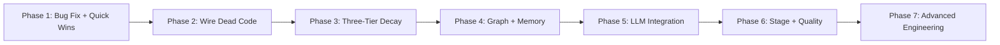

# Tasks: Context Management Rubric — 100% Completion

## Overview

- **Total Tasks**: 74
- **Parallel Opportunities**: 30 tasks marked [P]
- **User Stories**: 8 (US1-US8)
- **Phases**: 7 (ordered by dependency chain and impact)

## Dependencies

## Phase 1: Critical Bug Fix + Quick Wins (+20 points → 175/300)

**Goal**: Fix the turn counter bug that disables all observation masking, persist cache to disk, wire checkpoint validation, add status bar indicator

- [x] T001 [US1] Add `sharedContextBuilder.incrementTurn()` after `trackObservation()` in hook bridge `bridge-update` handler in extension/src/extension.ts
- [x] T002 [P] [US1] Call `this.observationMasker.saveCacheToDisk()` after `maskOldObservations()` in extension/src/autonomous/ContextBuilder.ts (async, fire-and-forget)
- [x] T003 [P] [US1] Call `saveCacheToDisk()` after `trackObservation()` in hook bridge handler in extension/src/extension.ts (debounced, max once per 5s)
- [x] T004 [P] [US1] Expand default `preservePatterns` in extension/src/autonomous/ObservationMasker.ts to include `failure`, `critical`, `fatal`, `panic`, `unhandled`, `stack\s?trace`
- [x] T005 [P] [US1] Add cache size and eviction count to `MaskResult` return type in extension/src/autonomous/ObservationMasker.ts; log eviction events via ContextUsageLogger
- [x] T006 [US2] Instantiate `CheckpointValidator` in `AutoHandoffTrigger` constructor in extension/src/autonomous/AutoHandoffTrigger.ts. Call `validate()` in `generateHandoffDocument()` before return; log warnings
- [x] T007 [P] Append data-source indicator `(real)`/`(est)` to status bar text in extension/src/ui/ContextHealthStatusBar.ts
- [x] T008 [US1] Add unit tests in tests/unit/autonomous/observation-tracking.test.ts: turn counter advances on bridge-update; observations mask after exceeding stage window; cache persisted to disk; checkpoint validation warns on missing sections

**Verification**:
- [x] Turn counter increments on each bridge-update event
- [x] Observations older than stage window are masked
- [x] `.specify/memory/observation-cache/index.json` written after masking
- [x] Status bar shows `(real)` or `(est)` suffix
- [x] `npm test` — no new failures (1558 pass, 5 pre-existing failures only)

---

## Phase 2: Wire Dead Code Components (+20 points → 195/300)

**Goal**: Instantiate CitationVerifier, ScopeGuard, SlopDetector and wire them to production code paths. First KnowledgeGraph producer.

- [x] T009 [US2] Instantiate `CitationVerifier(workspacePath)` in extension/src/extension.ts component init block
- [x] T010 [US2] Add `setCitationVerifier()` setter to extension/src/autonomous/ContextBuilder.ts. In `buildContext()` after memory loading, call `verifyCitations()` on formatted memories; prepend staleness warning if `needsReview`
- [x] T011 [P] [US2] Call `verifyCodeSymbols()` alongside `verifyCitations()` in extension/src/autonomous/ContextBuilder.ts; log missing symbols via `console.warn()`
- [x] T012 [US2] Instantiate `ScopeGuard(workspacePath)` in extension/src/extension.ts. In hook bridge handler, after extracting `toolInput.file_path`, call `scopeGuard.check(filePath)`; log violations
- [x] T013 [P] [US2] Pass `ScopeGuard` to `ContextBuilder` via setter in extension/src/autonomous/ContextBuilder.ts. In `trackObservation()`, call `scopeGuard.check(metadata.filePath)` when filePath is available
- [x] T014 [US8] Instantiate `SlopDetector()` in extension/src/extension.ts. Register `gofer.checkForSlop` command that scans `extension/src/` and shows output channel with results
- [x] T015 [US3] In hook bridge handler in extension/src/extension.ts, after extracting `toolInput.file_path` for Read tools, call `knowledgeGraph.recordFileAccess(filePath)`
- [x] T016 [US2] Add unit tests in tests/unit/autonomous/: CitationVerifier warns on non-existent paths; ScopeGuard detects boundary violations; SlopDetector finds disabled tests; graph has file nodes after reads

**Verification**:
- [x] CitationVerifier logs warnings for stale file citations in memories
- [x] ScopeGuard logs when protected boundary files are accessed
- [x] `gofer.checkForSlop` command produces scan report in output channel
- [x] KnowledgeGraph has file nodes after file read observations
- [x] `npm test` — no new failures (1570 pass, 5 pre-existing failures only)

---

## Phase 3: Three-Tier Observation Decay (+10 points → 205/300)

**Goal**: Replace binary masking with graduated three-tier decay (full → key-points → masked) with type-specific extractors

- [x] T017 [US1] Add `DecayTier` type (`'full' | 'key-points' | 'masked'`) to extension/src/autonomous/ObservationMasker.ts. Add `keyPointsContent`, `keyPointsAt` fields to `ObservationEntry`. Add migration function for legacy `masked: boolean` entries
- [x] T018 [P] [US1] Add `keyPointsAgeFraction: number` (default 0.6) to `ObservationMaskerConfig` in extension/src/autonomous/ObservationMasker.ts
- [x] T019 [US1] Rewrite `maskOldObservations()` in extension/src/autonomous/ObservationMasker.ts: two transition points — `full→key-points` at `ageThreshold * fraction`, `key-points→masked` at `ageThreshold`
- [x] T020 [US1] Implement `generateKeyPoints(observation)` dispatcher with 4 type-specific extractors in extension/src/autonomous/ObservationMasker.ts: extractFileKeyPoints (first 3 + last 2 lines), extractCommandKeyPoints (first 5 + last 5), extractSearchKeyPoints (file paths + count), extractTestKeyPoints (pass/fail summary)
- [x] T021 [P] [US1] Update `MaskResult` to include `keyPointsCount` and per-tier stats in extension/src/autonomous/ObservationMasker.ts
- [x] T022 [US1] Add VSCode setting `gofer.observationPreservePatterns` (string array) in extension/package.json. Load in extension/src/extension.ts and pass to ContextBuilder maskerConfig as RegExp array
- [x] T023 [P] [US1] Add `loadCacheFromDisk()` migration in extension/src/autonomous/ObservationMasker.ts: convert legacy `masked: boolean` entries to `decayTier: 'masked'` on load
- [x] T024 [P] [US1] Update status bar in extension/src/ui/ContextHealthStatusBar.ts and context health to show per-tier observation counts (full/key-points/masked)
- [x] T025 [US1] Add unit tests in tests/unit/autonomous/observation-tracking.test.ts: decay transitions at correct turn thresholds; key-point extractors produce expected summaries; legacy migration works; preserve patterns from VSCode setting applied

**Verification**:
- [x] Observation at turn 0, threshold 10: transitions to key-points at turn 6, masked at turn 10
- [x] File read key-points show first 3 + last 2 lines
- [x] Legacy cache files load without errors
- [x] Custom preserve patterns from VSCode settings applied
- [x] `npm test` — no new failures (1591 pass, 5 pre-existing failures only)

---

## Phase 4: Knowledge Graph & Memory Enhancements (+30 points → 235/300)

**Goal**: Populate graph from data flows, enhance memory matching, add related memories, improve stage detection

- [x] T026 [US3] In hook bridge handler in extension/src/extension.ts, parse `import`/`from` statements from file_read observation content. Call `knowledgeGraph.recordImport(currentFile, importedFile)` for each resolved import
- [x] T027 [P] [US3] In extension/src/autonomous/ContinuousMemoryWriter.ts, when saving memory with `category === 'pattern'`, call `knowledgeGraph.recordPattern(memory.content, memory.tags)`
- [x] T028 [P] [US3] In extension/src/autonomous/ContinuousMemoryWriter.ts, when saving memory with `category === 'decision'`, call `knowledgeGraph.recordDecision(memory.content, memory.tags)`
- [x] T029 [US5] Call `memoryManager.recordUsage(memory.id)` from extension/src/autonomous/ContextBuilder.ts after loading memories in buildContext()
- [x] T030 [US5] Replace substring keyword matching in `calculateMemoryCoverage()` in extension/src/autonomous/ContextBuilder.ts with trigram Jaccard similarity
- [x] T031 [US5] Add `research-complete` event to extension/src/autonomous/ContextBuilder.ts. In extension/src/autonomous/ContinuousMemoryWriter.ts, listen for event and create discovery memories
- [x] T032 [P] [US5] Implement dual storage in MemoryManager.save(): when `content.length > 500`, write companion file to `.specify/memory/memory-notes/{uuid}.md`. Store `notePath` in memory entry
- [x] T033 [P] [US5] Add `relatedMemories` computation in MemoryManager.save(): compute Jaccard (keyword overlap + category weight) against top 20 recent memories. Store top 3 related IDs
- [x] T034 [US5] In extension/src/autonomous/MemoryConsolidator.ts, wire CitationVerifier: during consolidation cycle, check citations. If >50% stale, reduce priority by 2
- [x] T035 [US6] In extension/src/autonomous/WorkspaceContextProvider.ts `detectCurrentStage()`, validate file content (size > 100 bytes, contains expected heading) not just existence
- [x] T036 [P] [US8] In autonomousCommands.ts routing, validate `tasks.md` frontmatter has `status: approved` or `status: ready` before routing to `/5_gofer_implement`
- [x] T037 [US5] Add unit tests in tests/unit/autonomous/observation-tracking.test.ts: import edges, useMemory, trigram matching, research-complete, related memories, stage detection, tasks frontmatter, current-stage.json
- [x] T069 [US6] In extension/src/autonomous/ContextBuilder.ts `setCurrentStage()`, write `{ stage, timestamp, source: 'explicit' }` to `.specify/memory/current-stage.json`. In WorkspaceContextProvider `detectCurrentStage()`, read this file first — if fresh (<30 min), use it; otherwise fall back to heuristic

**Verification**:
- [x] KnowledgeGraph has file + import nodes after coding session
- [x] Memory priority increments when used in context building
- [x] Trigram matching produces better coverage than substring
- [x] Empty spec.md doesn't trigger "plan" stage
- [x] `npm test` — no new failures (1612 pass, 5 pre-existing failures only)

---

## Phase 5: LLM Integration (+18 points → 253/300)

**Goal**: Wire real LLM (Haiku) calls for observation compression, research summarization, and context compaction. All degrade gracefully without API key.

- [x] T038 [US4] Create extension/src/autonomous/LLMProvider.ts: wraps `@anthropic-ai/sdk`, reads `gofer.anthropicApiKey` from VSCode settings, provides `summarize(prompt, maxTokens)` method, rate limits to 10 calls/min, logs usage to context-usage JSONL
- [x] T039 [US4] Add optional `llmProvider` to ObservationMasker in extension/src/autonomous/ObservationMasker.ts. In `generateKeyPoints()`, when LLM provider available, call `summarize()` instead of deterministic extractors. Fall back on error or missing key
- [x] T040 [US4] Create extension/src/autonomous/ResearchSummarizer.ts: accepts ResearchChunker + LLMProvider + MemoryManager. Method `summarizeSpec(specId)` iterates research chunks, calls `summarize()`, saves as discovery memory with tags. Cache summaries to avoid re-summarization
- [x] T041 [P] [US4] Wire `ResearchSummarizer` to `ContextBuilder` `research-complete` event in extension/src/extension.ts as higher-priority handler before deterministic handler
- [x] T042 [US4] In extension/src/autonomous/ContextCompactor.ts `summarizeTasks()`, replace `generateFallbackSummary()` with `llmProvider.summarize()` call using existing prompt template. Keep fallback on error
- [x] T043 [P] [US4] Wire `LLMProvider` into ContextCompactor constructor via extension/src/extension.ts initialization block
- [x] T044 [US4] Add unit tests in tests/unit/autonomous/: LLM provider rate limits correctly; observation compression uses LLM when key present, falls back when absent; research summarizer creates memories; compactor calls LLM; JSONL usage logged
- [x] T070 [US4] Wire `monitorAndCompactContext()` in extension/src/autonomous/ContextCompactor.ts to ContextHealthMonitor `critical` event in extension/src/extension.ts. When context hits critical threshold, auto-compact by summarizing oldest observations and low-priority memories

**Verification**:
- [x] With API key: LLM-generated summaries produced
- [x] Without API key: deterministic fallbacks used (no errors)
- [x] Research summarizer creates discovery memories from chunks
- [x] Rate limit prevents >10 calls/min per component
- [x] `npm test` — 1640 pass, 5 pre-existing failures only

---

## Phase 6: Stage Management, Delegation & Quality (+24 points → 277/300)

**Goal**: Budget caps, transition checkpoints, progressive delegation, feedback loops, error recovery, brownfield template

- [x] T045 [US6] In extension/src/autonomous/ContextBuilder.ts `buildContext()`, add `enforceBudgetCaps` config option. When true, truncate context sections exceeding stage budget allocation (preserve first N tokens)
- [x] T046 [US6] In extension/src/autonomous/ContextBuilder.ts `setCurrentStage()`, when stage changes: validate previous stage completion, auto-save checkpoint via `gofer.saveProgress`, log transition to context-usage JSONL
- [x] T047 [US7] Create extension/src/autonomous/SubAgentDispatcher.ts: listen to ContextHealthMonitor events. When utilization exceeds `delegationPolicy.subAgentThreshold`, generate delegation recommendation (agent type, task category, reason). Expose `getRecommendation()` returning `DelegationRecommendation | null`. Log to JSONL
- [x] T048 [P] [US7] Wire SubAgentDispatcher in extension/src/extension.ts initialization. In ContextBuilder.buildContext(), when `dispatcher.getRecommendation()` returns non-null, append a `## Delegation Advisory` section to the built context with the recommendation text (e.g. "Context at 68%. Consider delegating file search to a codebase-locator sub-agent via the Task tool."). Claude Code sees this via MCP and naturally follows the suggestion
- [x] T049 [P] [US6] Enhance session save in extension/src/autonomous/AutoHandoffTrigger.ts: include observation cache summary (count per tier, total tokens), knowledge graph stats, memory count
- [x] T050 [US6] Enhance session resume: on startup in extension/src/extension.ts, call `loadCacheFromDisk()` to restore observation cache. Verify loaded entries have valid content
- [x] T051 [P] [US6] Add reseed metrics to extension/src/autonomous/ContextUsageLogger.ts: observation count cleared, memories preserved, reseed timestamp
- [x] T052 [P] [US7] In `.claude/agents/` prompt templates, add instruction "Return results in <2000 tokens. Summarize if longer." Add token count validation
- [x] T053 [US8] Create .specify/templates/brownfield-analysis.md with sections: Constraints, Tech Debt, Caution Areas, Integration Requirements, Downstream Dependencies, Checklist
- [x] T054 [US8] Add per-stage cost tracking to extension/src/autonomous/ContextUsageLogger.ts: LLM token counts, stage duration, quality metrics (slop count). Add `cost` and `quality` fields
- [x] T055 [US8] In extension/src/autonomousCommands.ts, after task completion: if test command available, run tests and record result. On failure, block next task and record error pattern as memory
- [x] T056 [P] [US8] Before risky file modifications (detected via tool type) in extension/src/autonomousCommands.ts, create git stash. On error, pop stash. Log recovery pattern
- [x] T057 [US8] Add unit tests in tests/unit/autonomous/: budget truncation works; stage transition saves checkpoint; delegation recommendation injected into context at threshold; brownfield template exists; cost tracking logged
- [x] T071 [US8] Extend T055 feedback loop in extension/src/autonomousCommands.ts: before running tests, run `npm run compile` (build verification). On build failure, block task and record compiler error as memory. Only proceed to tests if build succeeds
- [x] T072 [US8] Extend T056 error recovery in extension/src/autonomousCommands.ts: after git stash pop recovery, retry the failed operation once. If retry also fails, log both errors as memory and skip task with `blocked` status

**Verification**:
- [x] Over-budget context sections truncated when `enforceBudgetCaps: true`
- [x] Stage transition logs to JSONL
- [x] SubAgentDispatcher recommendation appears in buildContext() output at threshold
- [x] Brownfield template exists at `.specify/templates/brownfield-analysis.md`
- [x] `npm test` — 1673 pass, 5 pre-existing failures only

---

## Phase 7: Advanced Context Engineering (+25 points → 295/300)

**Goal**: RLM context folding, MemGPT three-layer architecture, parallel analysis framework, research→graph integration, context REPL

- [x] T058 [US7] In extension/resources/hook-scripts/post-tool-use.mjs, ensure `tool_response` content (not just tool name) is written to per-observation files. Verify extension/src/extension.ts reads real content
- [x] T059 [US7] Add fold level tracking to extension/src/autonomous/ObservationMasker.ts: each observation has `foldLevel: 'collapsed' | 'summary' | 'expanded'`. Add `setFoldLevel(id, level)` method
- [x] T060 [US7] Enhance MCP tool handler in language-server/src/mcp/toolHandler.ts: implement `gofer_expand_observation` reading from disk cache. Add `gofer_peek_observation`, `gofer_fold_observation`, `gofer_grep_observations`
- [x] T061 [P] [US7] Persist fold state alongside observation cache in extension/src/autonomous/ObservationMasker.ts. On startup, restore fold levels from disk
- [x] T062 [US7] Create extension/src/autonomous/MemoryLayerManager.ts with `getCoreMemory()`, `searchArchival(query)`, `getRecallMemory(limit)`, `demoteMemories()` methods
- [x] T063 [P] [US7] Wire MemoryLayerManager into extension/src/autonomous/ContextBuilder.ts as alternative to direct memory/observation access. Use layer manager when `useLayeredMemory: true`
- [x] T064 [US3] Create extension/src/autonomous/ResearchGraphBuilder.ts: parse research.md for entity names (headers, bold terms, code references). Create graph nodes and link to mentioned files
- [x] T065 [P] [US3] Wire ResearchGraphBuilder to `research-complete` event in extension/src/extension.ts. Run after ResearchSummarizer
- [x] T066 [US7] Create extension/src/autonomous/ParallelAnalysisFramework.ts: generates partition recommendations (by directory depth or file type) and formats them as context hints for Claude Code. When included in buildContext() output, recommends which sub-agents to spawn via the Task tool and what each should search for. Pure advisory — Claude Code decides whether to act on the recommendations
- [x] T067 [US7] Create context REPL MCP tools in language-server/src/mcp/toolHandler.ts: `gofer_context_peek(section)`, `gofer_context_grep(pattern)`, `gofer_context_fold(section)`, `gofer_context_expand(section)`
- [x] T068 [US7] Add unit tests in tests/unit/autonomous/: fold levels persist across restart; MCP tools return real content; layer manager returns core/archival/recall; research graph has entities; parallel framework produces recommendations; REPL tools find content
- [x] T073 [US7] In extension/src/autonomous/MemoryLayerManager.ts `demoteMemories()`, when LLMProvider is available, use `summarize()` to score each candidate memory's relevance to current task. Demote lowest-scoring memories to archival layer. Fall back to priority-based demotion without LLM
- [x] T074 [US7] Add `gofer_context_undo` and `gofer_context_history` MCP tools in language-server/src/mcp/toolHandler.ts. `undo` reverts last fold/expand operation (stack of max 10). `history` shows last 10 context operations with timestamps

**Verification**:
- [x] MCP `gofer_expand_observation` returns real file content
- [x] Fold state survives extension restart (foldLevel serialized with cache)
- [x] `getCoreMemory()` returns constitution + task
- [x] Research entities appear in knowledge graph
- [x] Context REPL grep finds text within context sections
- [x] `npm test` — 1729 pass, 5 pre-existing failures only

---

## Parallel Execution Guide

Tasks marked [P] can run concurrently within their phase:

| Phase | Parallel Group | Tasks |
|-------|---------------|-------|
| 1 | Cache persistence | T002, T003 |
| 1 | Observation config | T004, T005, T007 |
| 2 | Symbol + scope validation | T011, T013 |
| 3 | Config + migration | T018, T023, T024 |
| 3 | Result type | T021 |
| 4 | Graph producers | T027, T028 |
| 4 | Memory features | T032, T033, T036 |
| 5 | Wiring | T041, T043 |
| 6 | Enhancements | T048, T049, T051, T052, T056 |
| 7 | Wiring + state | T061, T063, T065 |

## Implementation Strategy

1. **Phase 1 is highest-ROI**: +20 points from 8 tasks (most are 1-5 line changes)
2. **Phases 1-3 form MVP**: Fix masking + wire validators + three-tier decay (205/300 = 68%)
3. **Phases 4-5 build intelligence**: Knowledge graph + LLM features (255/300 = 85%)
4. **Phases 6-7 complete the system**: Stage management + advanced engineering (~295/300 = 98%)
5. **Remaining 5 points**: H4 (semantic similarity) and I2 (automatic parallel execution) require architectural changes beyond current scope
6. **Each phase verified independently**: Run `npm test` after each phase
