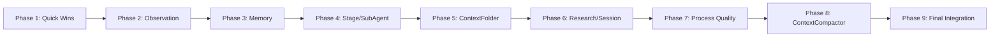

# Tasks: Context Management Rubric 100%

## Overview

- **Total Tasks**: 74
- **Parallel Opportunities**: 28 tasks marked [P]
- **Phases**: 9 (Setup through Final Integration)

## Dependencies

## Protected Files

- `extension/src/autonomous/ContextHealthMonitor.ts` — minimal changes only
- `extension/src/autonomous/ClaudeSessionReader.ts` — do not modify
- `.specify/scripts/hooks/post-tool-use.mjs` — minimal changes only

## Phase 1: Quick Wins — Wiring and Registration

**Goal**: Register dead code, enable disabled features, add missing settings. (+20 rubric points)

- [X] T001 [P] Register `gofer_peek_observation` tool in language-server/src/server.ts tools/list array
- [X] T002 [P] Register `gofer_fold_observation` tool in language-server/src/server.ts tools/list array
- [X] T003 [P] Register `gofer_grep_observations` tool in language-server/src/server.ts tools/list array
- [X] T004 [P] Register `gofer_context_peek` tool in language-server/src/server.ts tools/list array
- [X] T005 [P] Register `gofer_context_grep` tool in language-server/src/server.ts tools/list array
- [X] T006 [P] Register `gofer_context_fold` tool in language-server/src/server.ts tools/list array
- [X] T007 [P] Register `gofer_context_expand` tool in language-server/src/server.ts tools/list array
- [X] T008 [P] Register `gofer_context_undo` tool in language-server/src/server.ts tools/list array
- [X] T009 [P] Register `gofer_context_history` tool in language-server/src/server.ts tools/list array
- [X] T010 Add 9 case statements in server.ts tools/call switch for all REPL tools
- [X] T011 Add `gofer.useLayeredMemory` boolean setting (default: false) to extension/package.json
- [X] T012 Read `gofer.useLayeredMemory` setting in extension/src/extension.ts and pass to MemoryLayerManager
- [X] T013 Add ParallelAnalysisFramework setter in extension/src/autonomous/ContextBuilder.ts
- [X] T014 Instantiate and wire ParallelAnalysisFramework in extension/src/extension.ts
- [X] T015 Add ParallelAnalysisFramework section to buildContext() output in extension/src/autonomous/ContextBuilder.ts
- [X] T016 Add data-source indicator "(real)" / "(est)" to status bar text in extension/src/statusBar/ContextHealthStatusBar.ts
- [X] T017 Add LRU eviction telemetry logging in extension/src/autonomous/ObservationMasker.ts

**Verification**: `npm run compile` passes. 20 MCP tools registered.

## Phase 2: Observation Management Improvements

**Goal**: Complete observation debounce, LLM triggers, configuration. (+10 rubric points)

- [X] T018 Change debounce from leading-edge to trailing-edge in extension/src/extension.ts
- [X] T019 Add `saveCacheToDisk()` call in deactivate() in extension/src/extension.ts
- [X] T020 Clear debounce timer in deactivate() in extension/src/extension.ts
- [X] T021 Add warning-level LLM compression trigger in extension/src/extension.ts (on 'warning' event)
- [X] T022 Add observation-count trigger: compress when >50 observations in extension/src/autonomous/ObservationMasker.ts
- [X] T023 Add `gofer.observationPreservePatterns` runtime reload via onDidChangeConfiguration in extension/src/extension.ts
- [X] T024 [P] Add YAML config support: read observation config from .specify/memory/observation-config.yaml in extension/src/autonomous/ObservationMasker.ts

**Verification**: deactivate() flushes cache and clears timer. LLM compression fires on warning.

## Phase 3: Memory System Enhancements

**Goal**: Consolidation, limits, dual storage, bidirectional links, citations. (+18 rubric points)

- [X] T025 Add periodic consolidation timer (30 min) in extension/src/autonomous/MemoryManager.ts
- [X] T026 Add consolidation trigger on session-start event in extension/src/extension.ts
- [X] T027 Implement MAX_MEMORY_COUNT (200) check in save() in extension/src/autonomous/MemoryManager.ts
- [X] T028 Auto-archive lowest-priority memories when MAX exceeded in extension/src/autonomous/MemoryManager.ts
- [X] T029 Enhance markdown note format with YAML frontmatter in extension/src/autonomous/MemoryManager.ts
- [X] T030 Truncate JSONL entry for memories with markdown notes (store notePath ref) in extension/src/autonomous/MemoryManager.ts
- [X] T031 Add read-back from markdown notes in extension/src/autonomous/MemoryStorage.ts
- [X] T032 Add backReferences field to memory entries in extension/src/autonomous/MemoryManager.ts
- [X] T033 Maintain bidirectional links on save in extension/src/autonomous/MemoryManager.ts
- [X] T034 Add BFS traversal method for Zettelkasten navigation in extension/src/autonomous/MemoryManager.ts
- [X] T035 Make CitationVerifier file search async in extension/src/autonomous/CitationVerifier.ts
- [X] T036 [P] Add relative path resolution to file citations in extension/src/autonomous/CitationVerifier.ts
- [X] T037 Add symbol staleness `[STALE]` prefix in extension/src/autonomous/CitationVerifier.ts
- [X] T038 Wire symbol staleness to consolidator in extension/src/autonomous/CitationVerifier.ts
- [X] T039 Add consolidation timer cleanup in deactivate() in extension/src/extension.ts

**Verification**: Consolidation timer fires. save() enforces limits. Markdown notes have frontmatter.

## Phase 4: Stage-Aware Context and Sub-Agent Improvements

**Goal**: Stage detection, auto-checkpoints, delegation enforcement. (+14 rubric points)

- [X] T040 Add configurable staleness threshold setting to extension/package.json
- [X] T041 Read staleness setting in extension/src/autonomous/WorkspaceContextProvider.ts
- [X] T042 Add hook-bridge command detection as primary stage source in extension/src/autonomous/WorkspaceContextProvider.ts
- [X] T043 Listen to `stage-change` event for auto-checkpoint in extension/src/extension.ts
- [X] T044 Save lightweight checkpoint on stage transition in extension/src/extension.ts
- [X] T045 Wire SubAgentDispatcher enforcement: threshold-based blocking in extension/src/autonomous/SubAgentDispatcher.ts
- [X] T046 Add `tokenBudget` field to DelegationRecommendation in extension/src/autonomous/SubAgentDispatcher.ts
- [X] T047 Add `truncateResult()` utility for sub-agent result truncation in extension/src/autonomous/SubAgentDispatcher.ts
- [X] T048 Wire SubAgentDispatcher to ContextHealthMonitor for dynamic escalation in extension/src/extension.ts

**Verification**: Stage detection uses hook-bridge. Stage changes trigger checkpoints.

## Phase 5: Create ContextFolder

**Goal**: Section-level folding for context output. (+2 rubric points)

- [X] T049 Create `ContextFolder.ts` with fold-state-aware rendering in extension/src/autonomous/ContextFolder.ts
- [X] T050 Read fold state from `.specify/hooks/context-fold-state.json` in extension/src/autonomous/ContextFolder.ts
- [X] T051 Implement collapsed/summary/expanded rendering modes in extension/src/autonomous/ContextFolder.ts
- [X] T052 Add ContextFolder setter in extension/src/autonomous/ContextBuilder.ts
- [X] T053 Wire ContextFolder in extension/src/extension.ts
- [X] T054 Apply fold state in mergeContextSections() in extension/src/autonomous/ContextBuilder.ts

**Verification**: Collapsed sections render as summaries. Missing fold-state = passthrough.

## Phase 6: Research and Session Management

**Goal**: Research pipeline, session continuity. (+10 rubric points)

- [X] T055 Add deterministic fallback to ResearchSummarizer in extension/src/autonomous/ResearchSummarizer.ts
- [X] T056 Add hierarchical summarization (chapter → section → paragraph) in extension/src/autonomous/ResearchSummarizer.ts
- [X] T057 Auto-trigger research-to-memory on research-complete event in extension/src/extension.ts
- [X] T058 [P] Add AST-aware import extraction to KnowledgeGraph in extension/src/autonomous/KnowledgeGraph.ts
- [X] T059 [P] Add entity deduplication to KnowledgeGraph in extension/src/autonomous/KnowledgeGraph.ts
- [X] T060 Wire CheckpointValidator into session save flow in extension/src/extension.ts
- [X] T061 Add git state capture (branch, status, stash) to checkpoints in extension/src/autonomous/CheckpointValidator.ts
- [X] T062 Add programmatic SessionResumeCommand with state validation in extension/src/extension.ts
- [X] T063 Add required fields validation to CheckpointValidator in extension/src/autonomous/CheckpointValidator.ts

**Verification**: Summarization works without API key. research-complete triggers memories.

## Phase 7: Process Quality Improvements

**Goal**: ScopeGuard, SlopDetector, feedback, checkpoints, observability. (+18 rubric points)

- [X] T064 Add enforcement modes (advisory/warning/blocking) to ScopeGuard in extension/src/autonomous/ScopeGuard.ts
- [X] T065 [P] Wire ScopeGuard to VSCode diagnostics collection in extension/src/extension.ts
- [X] T066 Register SlopDetector as MCP tool `gofer_check_slop` in language-server/src/server.ts
- [X] T067 [P] Add `gofer.checkForSlop` to package.json contributes.commands in extension/package.json
- [X] T068 Add SlopDetector auto-trigger on task completion in extension/src/extension.ts
- [X] T069 Add post-task feedback hook: detect task checkbox changes in extension/src/extension.ts
- [X] T070 [P] Add PreOperationCheckpoint with git stash in extension/src/autonomous/CheckpointValidator.ts
- [X] T071 [P] Add rollback command for PreOperationCheckpoint in extension/src/extension.ts
- [X] T072 Populate ContextUsageLogger LLM token fields in extension/src/autonomous/ContextUsageLogger.ts
- [X] T073 [P] Add per-stage cost aggregation to ContextUsageLogger in extension/src/autonomous/ContextUsageLogger.ts
- [X] T074 Add brownfield auto-detection from workspace analysis in extension/src/autonomous/ScopeGuard.ts
- [X] T075 [P] Auto-trigger test runner on test-related task completion in extension/src/extension.ts

**Verification**: ScopeGuard shows diagnostics. SlopDetector is MCP tool. Feedback hooks fire.

## Phase 8: Wire ContextCompactor

**Goal**: Connect existing compaction code to production events. (+5 rubric points)

- [X] T076 Call contextCompactor.setLLMProvider() when API key is available in extension/src/extension.ts
- [X] T077 Wire monitorAndCompactContext() to critical health events in extension/src/extension.ts
- [X] T078 Add debounce/cooldown to prevent rapid compaction cycles in extension/src/autonomous/ContextCompactor.ts
- [X] T079 [P] Add compaction telemetry logging in extension/src/autonomous/ContextCompactor.ts
- [X] T080 Promote contextCompactor to module-level variable in extension/src/extension.ts
- [X] T081 Add contextCompactor cleanup in deactivate() in extension/src/extension.ts

**Verification**: Compaction triggers on critical events. Telemetry logged. Clean deactivate.

## Phase 9: Final Integration and Cleanup

**Goal**: Ensure clean compilation, test stability, rubric update.

- [X] T082 Audit all new setInterval/setTimeout calls for deactivate() cleanup in extension/src/extension.ts
- [X] T083 Audit all new event listeners for removal in deactivate() in extension/src/extension.ts
- [X] T084 Run full TypeScript compilation (npm run compile)
- [X] T085 Run existing test suite (npm test)
- [X] T086 Update consolidated rubric at .specify/research/context-management-rubric.md

**Verification**: Zero new compilation errors. Test suite stable. Rubric updated to 300/300.

## Parallel Execution Guide

Tasks marked [P] can run concurrently if they modify different files:

- T001-T009 (all 9 REPL tool registrations in server.ts — can be done as one batch)
- T036, T037 (CitationVerifier changes)
- T058, T059 (KnowledgeGraph changes)
- T065, T067, T070, T071, T073, T075 (independent extension.ts commands/wiring)

## Implementation Strategy

1. **Phase 1 first**: Highest ROI — ~20 points for simple wiring
2. **Compile after each phase**: Catch TS errors early
3. **Phase 8 last (before cleanup)**: ContextCompactor is riskiest change
4. **Group by file**: Many tasks touch extension.ts — batch together within each phase
