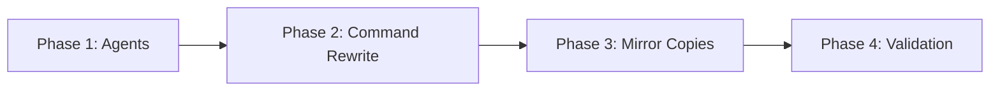

# Tasks: Validation Engineering Rubric

## Overview

- **Total Tasks**: 16
- **Parallel Opportunities**: 8 tasks marked [P]
- **User Stories**: 6 (US1-US6 mapped across 4 phases)
- **Architecture**: Prompt-only (markdown files, no TypeScript)

## Dependencies

## Phase 1: Create Specialist Validation Agents

**Goal**: Create 6 agent definition files following existing `.claude/agents/` conventions

**Covers**: US2 (Specialist Agent Review)

- [X] T001 [P] [US2] Create correctness validation agent at .claude/agents/validation-correctness.md — focuses on spec compliance, acceptance criteria verification, logic error detection. Input: spec.md acceptance criteria + source files. Output: list of unmet criteria with evidence. Blocks if any acceptance criterion unmet.
- [X] T002 [P] [US2] Create security validation agent at .claude/agents/validation-security.md — focuses on hardcoded secrets, disabled security features, auth bypass, client-side keys. Input: source files + plan.md security reqs. Output: security findings with Red/Yellow/Gray severity. Blocks if any Red finding.
- [X] T003 [P] [US2] Create performance validation agent at .claude/agents/validation-performance.md — focuses on sync I/O in async paths, cyclomatic complexity, unbounded loops, N+1 patterns. Input: new/modified source files. Output: performance findings with complexity scores. Blocks if complexity > 12 or sync I/O in async.
- [X] T004 [P] [US2] Create test quality validation agent at .claude/agents/validation-test-quality.md — focuses on placeholder assertions, skipped tests, mock ratio, mutation score. Input: test files. Output: test authenticity report. Blocks if expect(true).toBe(true) found, mock ratio > 30%, or mutation score < 60%.
- [X] T005 [P] [US2] Create integration validation agent at .claude/agents/validation-integration.md — focuses on contract compliance, API boundary validation, dependency verification. Input: contract definitions + implementation files. Output: contract compliance report. Blocks if any contract violation.
- [X] T006 [P] [US2] Create standards validation agent at .claude/agents/validation-standards.md — focuses on constitution compliance, naming conventions, architecture patterns, AI slop detection. Input: constitution.md + research.md patterns + source files. Output: standards report with deviations. Blocks if unjustified pattern deviation.

**Verification**:
- [ ] All 6 files exist in `.claude/agents/`
- [ ] Each follows the format of existing `codebase-analyzer.md`
- [ ] Each has: role description, tools list, input spec, output format, blocking criteria

## Phase 2: Rewrite Validation Command

**Goal**: Replace 6_gofer_validate.md with rubric-based approach

**Covers**: US1 (Rubric Scoring), US3 (Brownfield Restart), US4 (Test Authenticity), US5 (Slop Detection), US6 (Attribution Logging)

- [X] T007 [US1] Rewrite .claude/commands/6_gofer_validate.md with complete rubric-based validation — must include all 12 steps: (0) context health, (1) load context, (2) spawn 6 specialist agents in parallel, (3) automated checks (build/test/lint/typecheck), (4) mutation testing gate (check for Stryker, run if available), (5) mock ratio analysis (count vi.mock/vi.fn vs real assertions), (6) semantic slop detection (severity-tiered patterns), (7) score 10-category rubric, (8) generate enhanced validation report, (9) determine PASS/FAIL outcome, (10) brownfield restart on failure, (11) attribution logging to JSONL, (12) memory update check.
- [X] T008 [US1] Define the 10-category rubric scoring table within T007's command — categories: Functional Correctness (15pts), Test Authenticity (15pts), UI/E2E Verification (10pts), Security Posture (10pts), Integration Reality (10pts), Error Path Coverage (10pts), Architecture Compliance (10pts), Performance Baseline (5pts), Code Hygiene (10pts), Specification Traceability (5pts). Include point redistribution logic when no UI.
- [X] T009 [US3] Implement brownfield restart loop within T007's command — on score < 100: generate remediation-report.md listing failed categories with evidence and specific fixes; output routing instruction for /0_business_scenario; track iteration count (max 3); generate escalation-report.md if 3rd iteration fails.
- [X] T010 [US5] Implement semantic slop detection within T007's command — check for: expect(true).toBe(true) (Red), test.skip/it.skip (Red), TODO/FIXME placeholders (Yellow), empty catch blocks (Yellow), redundant comments (Yellow via agent), over-engineered abstractions (Gray via agent), magic numbers (Gray via agent). Severity tiers: Red blocks, Yellow must-address, Gray informational.
- [X] T011 [US6] Implement attribution logging within T007's command — append each finding to .specify/logs/validation-findings.jsonl with fields: finding_id, timestamp, feature, category, severity, description, file, line, resolution, iteration. Reference historical findings for repeat patterns.

**Verification**:
- [ ] Command file is valid markdown with all 12 steps
- [ ] Rubric produces numeric score per category
- [ ] Agent spawning uses Task tool with 6 parallel calls
- [ ] Brownfield restart generates remediation-report.md on failure
- [ ] Findings log appends to validation-findings.jsonl

## Phase 3: Update Mirror Copies

**Goal**: Sync all distribution copies of the validate command

**Covers**: NFR (Consistency)

- [X] T012 [P] Copy rewritten command to extension/resources/claude-commands/6_gofer_validate.md — direct copy from .claude/commands/6_gofer_validate.md
- [X] T013 [P] Adapt and copy to extension/resources/copilot-prompts/6_gofer_validate.prompt.md — adjust frontmatter format for Copilot prompt convention if needed
- [X] T014 [P] Adapt and copy to .github/prompts/6_gofer_validate.prompt.md — adjust frontmatter format for GitHub Prompts convention if needed

**Verification**:
- [ ] All 4 copies contain identical rubric and scoring logic
- [ ] Diff shows only frontmatter/format differences
- [ ] No stale references to old 3-agent approach in any copy

## Phase 4: Validation & Documentation

**Goal**: Verify the feature works and update docs

**Covers**: Success criteria verification

- [X] T015 Run /6_gofer_validate against current codebase as self-test — expected result: FAIL with score ~25/100. Verify each rubric category produces a score, remediation report is generated, findings are logged to JSONL. This confirms the rubric correctly detects known issues (81 placeholders, 17 skips, heavy mocking).
- [X] T016 Update CLAUDE.md Command Framework Overview section — add brief note about rubric-based validation, 6 specialist agents, and brownfield restart loop. Keep addition concise (5-10 lines).

**Verification**:
- [ ] Self-test produces FAIL with detailed per-category scores
- [ ] Remediation report lists actionable items
- [ ] CLAUDE.md documents the new validation approach

## Parallel Execution Guide

Tasks marked [P] can run concurrently:

**Group 1** (Phase 1 — all parallel):
- T001, T002, T003, T004, T005, T006 — six independent agent files

**Group 2** (Phase 3 — all parallel, after Phase 2):
- T012, T013, T014 — three independent mirror copies

**Sequential dependencies**:
- T007 depends on T001-T006 (agents must exist before command references them)
- T008-T011 are sub-tasks within T007 (written as part of the same file)
- T012-T014 depend on T007 (command must be written before copying)
- T015 depends on T012-T014 (all copies must be in place for full test)
- T016 depends on T015 (verify feature works before documenting)

## Implementation Strategy

1. **Phase 1 first** — all 6 agents can be written in parallel
2. **Phase 2 is the critical path** — the command rewrite is the main deliverable
3. **Phase 3 is mechanical** — copy and adapt
4. **Phase 4 confirms everything works** — self-test validates the rubric

## Plan Coverage Validation

### Plan Phase Coverage

| Plan Phase | Task Count | Task IDs | Status |
|------------|------------|----------|--------|
| Phase 1: Create Agents | 6 | T001-T006 | COVERED |
| Phase 2: Rewrite Command | 5 | T007-T011 | COVERED |
| Phase 3: Mirror Copies | 3 | T012-T014 | COVERED |
| Phase 4: Validation & Docs | 2 | T015-T016 | COVERED |

### Acceptance Criteria Traceability

| User Story | Criterion | Task(s) |
|------------|-----------|---------|
| US1 | Numeric score across 10 categories | T007, T008 |
| US1 | Each category has pass criteria | T008 |
| US1 | Report shows per-category scores | T007 (Step 8) |
| US1 | 100/100 required to pass | T007 (Step 9) |
| US1 | Rubric defined in command | T008 |
| US2 | 6 agent files exist | T001-T006 |
| US2 | Each agent has scoped focus | T001-T006 |
| US2 | All 6 run in parallel | T007 (Step 2) |
| US2 | Coordinator consolidates | T007 (Step 7) |
| US2 | Severity tiers Red/Yellow/Gray | T001-T006 |
| US3 | Remediation report on failure | T009 |
| US3 | Lists failed categories + evidence | T009 |
| US3 | Signals orchestrator restart | T009 |
| US3 | Scoped to failed areas | T009 |
| US3 | Max 3 iterations | T009 |
| US3 | Each score logged | T011 |
| US4 | Detects test.skip | T004, T010 |
| US4 | Detects placeholder assertions | T004, T010 |
| US4 | Measures mock ratio | T004, T007 (Step 5) |
| US4 | Checks mutation score | T007 (Step 4) |
| US4 | Flags mock-only assertions | T004 |
| US5 | Redundant comments | T006, T010 |
| US5 | Unnecessary defensive checks | T006 |
| US5 | Over-engineered abstractions | T006 |
| US5 | Empty catch blocks | T010 |
| US5 | TODO/FIXME | T010 |
| US5 | Severity tiers | T010 |
| US6 | Findings logged to JSONL | T011 |
| US6 | Fields: id, category, severity, etc | T011 |
| US6 | Remediation outcomes tracked | T011 |
| US6 | Historical findings referenced | T011 |

Coverage: 4/4 plan phases, 6/6 user stories, 30/30 acceptance criteria
