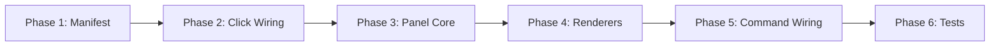

# Tasks: Context Item Click-to-View

## Overview

- **Total Tasks**: 18
- **Parallel Opportunities**: 8 tasks marked [P]
- **User Stories**: 7 (US1-US7)
- **Phases**: 6

## Dependencies

## Phase 1: Package Manifest

**Goal**: Declare the new command so VSCode recognizes it

- [x] T001 Add `gofer.showContextCategoryContent` command to
      `extension/package.json` contributes.commands array (after the existing
      `gofer.refreshContextWindow` entry around line 80)

**Verification**: Extension compiles, command declared in manifest

## Phase 2: Tree Item Click Wiring

**Goal**: Make category items clickable by adding .command property

- [x] T002 [US1] Modify `getCategoryItems(sessionId)` in
      `extension/src/contextWindowProvider.ts` to accept `sessionId` parameter
      and set
      `.command = { command: 'gofer.showContextCategoryContent', arguments: [sessionId, cat.name] }`
      on each category item
- [x] T003 [US1] Update `getChildren()` in
      `extension/src/contextWindowProvider.ts` to pass `element.sessionId` when
      calling `getCategoryItems()` so category-level items have session context

**Verification**: Category items have `.command` set, `sessionId` propagated
from session parent

## Phase 3: ContextContentPanel Core

**Goal**: Create the singleton webview panel that displays category content

- [x] T004 [US1] Create `extension/src/ui/ContextContentPanel.ts` with singleton
      `createOrShow(extensionUri, workspacePath)` pattern following
      `extension/src/ui/MemoryPanel.ts` — includes panel creation, dispose
      cleanup, and static `currentPanel` reference
- [x] T005 [US1] Implement `showCategory(sessionId, categoryName, bridgeData)`
      method in ContextContentPanel that updates `panel.title` and calls the
      appropriate category renderer to regenerate `panel.webview.html`
- [x] T006 [P] [US1] Implement shared CSS styles function in ContextContentPanel
      using VSCode theme variables (`var(--vscode-font-family)`,
      `var(--vscode-foreground)`, `var(--vscode-editor-background)`,
      `var(--vscode-sideBar-background)`, `var(--vscode-panel-border)`, etc.)
- [x] T007 [P] [US1] Implement `escapeHtml()` utility method and shared HTML
      shell generator (DOCTYPE, head with meta charset, styles, breadcrumb
      header showing category name + session info, main content area)

**Verification**: Panel opens on first call, reuses on subsequent, title updates
per category

## Phase 4: Category Content Renderers

**Goal**: Implement the 6 category-specific content renderers inside
ContextContentPanel

- [x] T008 [P] [US2] Implement `renderSpecArtifacts(workspacePath)` — reads
      `.specify/specs/*/` directories via `fs.promises.readdir`, for each spec
      dir lists files with `fs.promises.stat` for size, reads first 500 chars as
      content preview, renders as card-based HTML with file name, size, and
      preview text
- [x] T009 [P] [US3] Implement `renderMemoriesHints(workspacePath)` — reads
      `.specify/memory/memories.jsonl` and `.specify/memory/hints.jsonl` (if
      they exist), parses each JSONL line as a memory object, groups by
      `.category`, renders grouped cards with content, category badge, tags, and
      priority indicator
- [x] T010 [P] [US4] Implement `renderSystemFiles(workspacePath)` — checks for
      CLAUDE.md, AGENTS.md, and `.specify/memory/constitution.md` using
      `fs.promises.access`, for each existing file reads up to 50KB via
      `fs.promises.readFile`, renders as file cards with name, size (from stat),
      and content preview (first 500 chars)
- [x] T011 [P] [US6] Implement `renderConversationHistory(bridgeData)` — uses
      BridgeData.context to render session metadata (model, sessionId,
      displayName), token breakdown table (input, cacheRead, cacheCreation,
      output), utilization percentage with color-coded progress bar, and
      explanatory note that full conversation is not inspectable
- [x] T012 [P] [US5] Implement `renderToolOutputs(workspacePath)` — reads
      `.specify/hooks/observations/*.json` files, parses each as
      `{id, toolName, toolInput, toolResponse, timestamp, truncated}`, sorts by
      timestamp desc, limits to 20 most recent, renders as timeline cards with
      tool name, timestamp, input summary (JSON.stringify of toolInput truncated
      to 200 chars), and response preview (first 500 chars with truncation
      indicator if original was truncated)
- [x] T013 [P] [US7] Implement `renderMaskedObservations(workspacePath)` — reads
      same `.specify/hooks/observations/*.json` files but filters for those with
      timestamp older than 5 minutes, renders as faded/dimmed cards with tool
      name and age indicator, shows empty state "No masked observations — all
      observations are recent" if none qualify

**Verification**: Each renderer produces valid HTML, handles empty/missing data,
HTML-escapes content

## Phase 5: Command Registration & Wiring

**Goal**: Connect the tree item click to the panel via command handler

- [x] T014 [US1] Register `gofer.showContextCategoryContent` command in
      `registerGlobalCommands()` in `extension/src/extension.ts` (after the
      existing `gofer.refreshContextWindow` block around line 920) — handler
      receives `(sessionId: string, categoryName: string)`, uses lazy
      `await import('./ui/ContextContentPanel')`, calls
      `ContextContentPanel.createOrShow()`, retrieves BridgeData from
      `multiSessionWatcher.getSessions().get(sessionId)`, and calls
      `panel.showCategory(sessionId, categoryName, bridgeData)`
- [x] T015 [US1] Ensure `multiSessionWatcher` reference is accessible in the
      command handler scope — verify it's available as a module-level variable
      in `extension.ts` (it already is, declared at file scope and assigned in
      `handleGoferFormat()`)

**Verification**: Clicking any category opens/updates panel with correct content
for that session

## Phase 6: Unit Tests

**Goal**: Verify panel behavior and content rendering

- [x] T016 Write unit tests for ContextContentPanel in
      `tests/unit/contextContentPanel.test.ts` — test singleton behavior
      (createOrShow returns same instance), showCategory updates html, dispose
      resets currentPanel, escapeHtml handles special characters
- [x] T017 [P] Write unit tests for category renderers in
      `tests/unit/contextContentPanel.test.ts` — test each of the 6 render
      methods with mock data (valid content, empty content, missing files, large
      files)
- [x] T018 [P] Update `tests/unit/contextWindowProvider.test.ts` to verify
      `.command` property is set on category items returned by `getChildren()`
      with correct command name and arguments array `[sessionId, categoryName]`

**Verification**: All tests pass, linting clean, no regressions

## Parallel Execution Guide

Tasks marked [P] can run concurrently if they modify different files:

**Group 1** (Phase 3): T006, T007 — CSS styles and HTML utilities (same file,
but independent sections) **Group 2** (Phase 4): T008, T009, T010, T011, T012,
T013 — All 6 renderers are independent methods in the same file **Group 3**
(Phase 6): T017, T018 — Different test files

## Implementation Strategy

1. **MVP First**: Phase 1-5 (T001-T015) delivers a working click-to-view for all
   6 categories
2. **Tests After**: Phase 6 (T016-T018) adds test coverage
3. **Each phase blocks the next**: manifest → wiring → panel → renderers →
   command → tests
