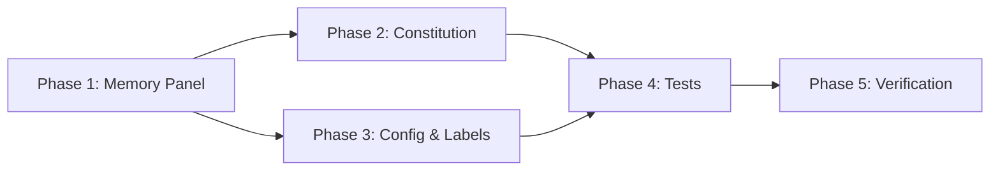

# Tasks: Memory System Categorization Cleanup

## Overview

- **Total Tasks**: 20
- **Parallel Opportunities**: 8 tasks marked [P]
- **User Stories**: 4 (US1-US4 across 5 phases)

## Dependencies

## Phase 1: Memory Panel Cleanup (US1)

**Goal**: Remove non-memory concerns from the Memory panel

**Story**: As a Gofer extension user, I want the Memory panel to show only
learned knowledge (memories, decisions) so that I have a clear mental model of
what "Memory" means.

### Implementation

- [x] T001 [US1] Update file docstring in extension/src/memoryProvider.ts to
      reflect new 2-section structure (Memories, Decisions only)
- [x] T002 [US1] In extension/src/memoryProvider.ts `getRootItems()`, remove the
      Observations section (lines 142-154) and Checkpoints section (lines
      156-168) — keep only Memories and Decisions
- [x] T003 [US1] In extension/src/memoryProvider.ts `getSectionChildren()`,
      remove the `case 'observations'` and `case 'checkpoints'` switch branches
- [x] T004 [P] [US1] Remove `getObservationInfo()` method and
      `countObservations()` method from extension/src/memoryProvider.ts
- [x] T005 [P] [US1] Remove `getCheckpointItems()` method and
      `listCheckpoints()` method from extension/src/memoryProvider.ts
- [x] T006 [US1] In extension/package.json `menus.view/title`, remove the
      `gofer.showConstitution` entry where `when: "view == goferMemory"` and
      update `gofer.refreshMemory` group to `navigation` (no ordering suffix
      needed)

**Verification**:

- [ ] `getRootItems()` returns exactly 2 items (Memories, Decisions)
- [ ] No references to observations or checkpoints remain in memoryProvider.ts
- [ ] Memory panel title bar shows only the Refresh button

## Phase 2: Constitution Decoupling (US2)

**Goal**: Make constitution independent from the memory system

**Story**: As a developer maintaining the Gofer codebase, I want constitution to
have its own identity separate from the memory system so that I can reason about
each system independently.

### Implementation

- [x] T007 [US2] In extension/package.json `menus.view/title`, add entry for
      `gofer.showConstitution` with `when: "view == goferProgress"` and
      `group: "navigation@3"`
- [x] T008 [US2] In extension/src/autonomous/ContextBuilder.ts
      `calculateBudgetUsage()`, separate constitution from memory — give
      constitution its own key in the usage object and update total calculation
      and comment
- [x] T009 [US2] In extension/src/autonomous/ContextBuilder.ts, add budget check
      for constitution category against a reasonable limit (e.g., 20% of
      memoryBudget or a fixed token cap)
- [x] T010 [US2] In extension/src/autonomous/MemoryLayerManager.ts
      `getCoreMemory()`, remove the entire constitution loading block (lines
      127-142) — constitution is loaded by ContextBuilder directly
- [x] T011 [US2] In extension/src/autonomous/MemoryLayerManager.ts
      `DEFAULT_CONFIG`, remove `'#constitution'` from coreTags and
      `'constitution'` from coreCategories. Update class docstring to remove
      constitution mention.

**Verification**:

- [ ] Specifications panel shows Constitution button
- [ ] Budget usage has separate `constitution` key
- [ ] `getCoreMemory()` does not return any item with `id: 'core:constitution'`
- [ ] Constitution loaded only once (via ContextBuilder)

## Phase 3: Configuration & Labels (US3, US4)

**Goal**: Fix stale constants and misleading labels

**Story US3**: As a Gofer extension user, I want the Context Window panel to be
the single source of truth for context health information.

**Story US4**: As a developer, I want config.ts constants to accurately reflect
registered views.

### Implementation

- [x] T012 [P] [US4] In extension/src/config.ts, update VIEWS constant: remove
      `constitution: 'goferConstitution'`, add
      `contextWindow: 'goferContextWindow'`
- [x] T013 [P] [US3] In extension/src/contextWindowProvider.ts
      `CONTEXT_CATEGORIES`, rename `'Memories/Hints'` to `'Memories & Hints'`

**Verification**:

- [ ] VIEWS constant has 4 keys: progress, contextWindow, memory, container
- [ ] Context Window panel shows "Memories & Hints" label

## Phase 4: Test Updates

**Goal**: Update tests to match new behavior

### Implementation

- [x] T014 [P] Update tests/unit/memoryProvider.test.ts: change root section
      count assertions from 4 to 2, remove tests for Observations and
      Checkpoints sections
- [x] T015 [P] Update tests/unit/autonomous/ContextBuilder.test.ts: verify
      separate `constitution` and `memory` keys in budget usage, add test that
      constitution tokens are NOT in memory usage
- [x] T016 [P] Update tests/unit/autonomous/MemoryLayerManager.test.ts: verify
      no `core:constitution` item in getCoreMemory() result, remove/update
      constitution-in-core assertions

**Verification**:

- [ ] All unit tests pass
- [ ] `npm test` succeeds (except pre-existing failures in
      agent-stop-extraction.test.ts)

## Phase 5: Final Verification

**Goal**: Ensure no regressions and clean build

### Implementation

- [x] T017 Run full test suite: `npm test`
- [x] T018 [P] Run linter: `npm run lint`
- [x] T019 [P] Verify compile: `cd extension && npm run compile`
- [x] T020 Verify no other files reference removed sections or stale VIEWS
      entries (grep for `goferConstitution`, `countObservations`,
      `listCheckpoints`)

**Verification**:

- [ ] All tests pass (except pre-existing failures)
- [ ] Linting clean
- [ ] Compile succeeds
- [ ] No stale references found

## Parallel Execution Guide

Tasks marked [P] can run concurrently when they modify different files:

**Phase 1 parallel group**: T004 + T005 (different methods in same file, safe to
combine) **Phase 3 parallel group**: T012 + T013 (different files — config.ts
and contextWindowProvider.ts) **Phase 4 parallel group**: T014 + T015 + T016
(different test files) **Phase 5 parallel group**: T018 + T019 (independent
verification commands)

## Implementation Strategy

1. **Phase 1 first**: Clean up Memory panel (highest visibility change)
2. **Phase 2 next**: Decouple constitution from memory backend
3. **Phase 3 in parallel**: Config and labels can run alongside Phase 2
4. **Phase 4 after code changes**: Update tests to match new behavior
5. **Phase 5 last**: Full verification sweep

## Protected Files (DO NOT MODIFY)

- `extension/src/autonomous/memory.ts` — MemoryType union must not change
- `extension/src/autonomous/StageContextProfile.ts` — Interface unchanged
- `.specify/memory/constitution.md` — File path and format unchanged
- `.specify/memory/memories.jsonl` — Format unchanged
