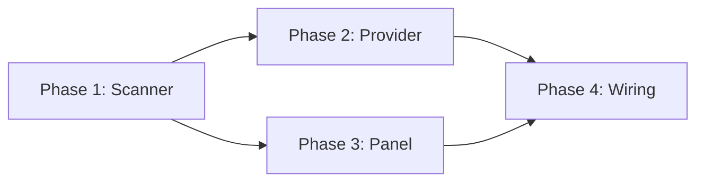

# Tasks: Context Window Accuracy

## Overview

- **Total Tasks**: 26
- **Parallel Opportunities**: 10 tasks marked [P]
- **User Stories**: US1 (accurate breakdown), US2 (file detail views), US3
  (conversation breakdown)
- **Phases**: 4 (Scanner, Provider, Panel, Wiring)

## Dependencies

## Phase 1: ClaudeCodeContextScanner

**Goal**: Create scanner that reads all files Claude Code loads and returns
per-category token counts

- [x] T001 [US1] Define `ScanResult` interface and `CategoryBreakdown` type in
      `extension/src/autonomous/ClaudeCodeContextScanner.ts`
- [x] T002 [P] [US1] Implement `scanClaudeMdAndRules()` in
      `extension/src/autonomous/ClaudeCodeContextScanner.ts` — reads workspace
      CLAUDE.md, user ~/.claude/CLAUDE.md, local .claude/CLAUDE.md, workspace
      .claude/rules/_.md, user ~/.claude/rules/_.md
- [x] T003 [P] [US1] Implement `scanAutoMemory()` in
      `extension/src/autonomous/ClaudeCodeContextScanner.ts` — reads MEMORY.md
      first 200 lines + topic files from ~/.claude/projects/{encoded}/memory/
- [x] T004 [P] [US1] Implement `scanAgentsAndCommands()` in
      `extension/src/autonomous/ClaudeCodeContextScanner.ts` — reads all
      .claude/agents/\*.md files
- [x] T005 [P] [US1] Implement `scanSpecArtifacts()` in
      `extension/src/autonomous/ClaudeCodeContextScanner.ts` — reads
      constitution.md and Gofer-loaded spec files
- [x] T006 [P] [US1] Implement `getSystemOverhead()` in
      `extension/src/autonomous/ClaudeCodeContextScanner.ts` — returns fixed
      ~14,800 token estimate with breakdown
- [x] T007 [US1] Implement `scan()` orchestrator in
      `extension/src/autonomous/ClaudeCodeContextScanner.ts` — calls all scan
      methods, returns aggregated ScanResult
- [x] T008 [US1] Add 30-second caching with `invalidate()` method in
      `extension/src/autonomous/ClaudeCodeContextScanner.ts`
- [x] T009 [US1] Write unit tests in
      `tests/unit/autonomous/ClaudeCodeContextScanner.test.ts`

**Verification**:

- [x] Scanner returns correct token counts for known file sizes
- [x] Missing files/directories return 0 tokens without errors
- [x] Cache returns same result within 30s, fresh result after invalidation

## Phase 2: Replace Hardcoded Categories

**Goal**: Remove fake CONTEXT_CATEGORIES percentages, use real scanner output

- [x] T010 [US1] Remove `CONTEXT_CATEGORIES` const array and `estimatePct`
      fields from `extension/src/contextWindowProvider.ts`
- [x] T011 [US1] Add `setScanner(scanner: ClaudeCodeContextScanner)` method to
      ContextWindowProvider in `extension/src/contextWindowProvider.ts`
- [x] T012 [US1] Rewrite `getCategoryItems()` to build categories from
      ScanResult with real token counts in
      `extension/src/contextWindowProvider.ts`
- [x] T013 [US3] Calculate Conversation History as residual: totalContextTokens
      minus sum of file-based categories in
      `extension/src/contextWindowProvider.ts`
- [x] T014 [US1] Update tree item descriptions to show `~{N}k tokens` without
      "(est.)" suffix in `extension/src/contextWindowProvider.ts`
- [x] T015 [US1] Update existing tests in
      `tests/unit/contextWindowProvider.test.ts` to work with scanner

**Verification**:

- [x] Tree shows new categories: CLAUDE.md & Rules, Auto Memory, Agents &
      Commands, Conversation History, System Overhead, Spec Artifacts
- [x] Token counts match actual file sizes on disk
- [x] Sum of all categories approximates totalContextTokens

## Phase 3: Update Detail Views

**Goal**: Show actual file contents when clicking each new category

- [x] T016 [P] [US2] Add `renderScannerCategory()` generic renderer in
      `extension/src/ui/ContextContentPanel.ts` — handles CLAUDE.md & Rules,
      Auto Memory, Agents & Commands, Spec Artifacts with file path, size, token
      count, content preview
- [x] T017 [P] [US2] Covered by T016 — generic scanner category renderer handles
      all file-based categories
- [x] T018 [P] [US2] Covered by T016 — generic scanner category renderer handles
      all file-based categories
- [x] T019 [P] [US2] Add `renderSystemOverhead()` in
      `extension/src/ui/ContextContentPanel.ts` — fixed estimate with
      explanation
- [x] T020 [US2] Update `renderCategory()` switch in
      `extension/src/ui/ContextContentPanel.ts` to dispatch to new methods; keep
      legacy fallback methods
- [x] T021 [US2] Update tests in `tests/unit/contextContentPanel.test.ts` for
      new categories

**Verification**:

- [x] Clicking each category shows correct files with accurate token counts
- [x] System Overhead shows explanation of invisible components

## Phase 4: Wiring & Integration

**Goal**: Wire scanner to provider, ensure end-to-end data flow

- [x] T022 Instantiate `ClaudeCodeContextScanner` in
      `extension/src/extension.ts` alongside ContextWindowProvider
- [x] T023 Call `contextWindowProvider.setScanner(scanner)` during activation in
      `extension/src/extension.ts`
- [x] T024 Invalidate scanner cache on bridge watcher `session-update` events in
      `extension/src/extension.ts`
- [x] T025 Pass scanner reference to ContextContentPanel for detail view
      rendering in `extension/src/extension.ts`
- [x] T026 Integration verified via unit tests: scanner → provider → correct
      tree items with real token counts

**Verification**:

- [x] End-to-end: bridge update → cache invalidation → tree refresh → correct
      token counts
- [x] Scanner instantiated once, shared between provider and panel

## Parallel Execution Guide

Tasks marked [P] can run concurrently:

- **Phase 1 parallel group**: T002, T003, T004, T005, T006 (independent scan
  methods)
- **Phase 3 parallel group**: T016, T017, T018, T019 (independent render
  methods)

## Implementation Strategy

1. **Phase 1 first**: Build the scanner — this is the core new component
2. **Phase 2 next**: Wire scanner into the tree provider
3. **Phase 3 parallel with Phase 2**: Detail views can be built independently
4. **Phase 4 last**: Integration wiring and end-to-end verification
