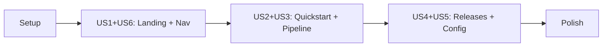

# Tasks: Documentation Website

## Overview

- **Total Tasks**: 27
- **Parallel Opportunities**: 14 tasks marked [P]
- **User Stories**: 6 (US1-US6)
- **Phases**: 5 (Setup, Landing Page, Core Docs, Guides, Polish)
- **Constitution**: TDD exemption - this feature is static HTML/CSS/Markdown
  with no executable TypeScript code, so no automated tests are required

**Plan Phase Mapping**: Plan.md uses 4 phases; tasks.md splits Plan Phase 1 into
Setup + Landing for finer granularity:

- Plan Phase 1 (Docsify Setup & Landing Page) = Tasks Phase 1 + Phase 2
- Plan Phase 2 (Core Documentation Pages) = Tasks Phase 3
- Plan Phase 3 (Guides & Configuration) = Tasks Phase 4
- Plan Phase 4 (Search, Polish & Responsive Design) = Tasks Phase 5

## Dependencies

## Phase 1: Setup

**Goal**: Create Docsify infrastructure and shared assets

- [x] T001 Create docs/.nojekyll file to prevent GitHub Pages Jekyll processing
- [x] T002 Create docs/assets/css/custom.css with theme overrides matching
      existing purple gradient design
- [x] T003 Create docs/\_navbar.md with top navigation (Home, Docs, Releases,
      GitHub)

**Verification**: Docsify infrastructure files exist

## Phase 2: US1 + US6 - Landing Page & Navigation (P1)

**Goal**: Transform index.html into landing page with Docsify + create
navigation

**Stories**:

- US1: First-time visitor learns about Gofer
- US6: User navigates documentation efficiently

### Implementation

- [x] T004 [US6] Create docs/\_sidebar.md with full documentation hierarchy
- [x] T005 [US1] Transform docs/index.html into Docsify app shell with landing
      page hero, feature highlights, latest release card, and Docsify script
      tags
- [x] T006 [US1] Rewrite docs/README.md as documentation home page (what Docsify
      renders at #/)

**Verification**:

- [ ] Landing page renders with hero section and feature highlights
- [ ] Sidebar navigation appears and shows document hierarchy
- [ ] Top nav links work (Home, Docs, Releases, GitHub)

## Phase 3: US2 + US3 - Quickstart & Pipeline Documentation (P1/P2)

**Goal**: Write core documentation content

**Stories**:

- US2: User follows quickstart to install and run first pipeline
- US3: User understands the Gofer pipeline

### Implementation

- [x] T007 [US2] Write docs/quickstart.md - installation through first pipeline
      run (prerequisites, download VSIX, install, initialize repo, run
      /0_business_scenario)
- [x] T008 [US3] Write docs/pipeline/README.md - pipeline overview with 6-stage
      diagram, auto-chaining explanation, artifacts table
- [x] T009 [P] [US3] Write docs/pipeline/research.md - what /1_gofer_research
      does, when to use it, expected output
- [x] T010 [P] [US3] Write docs/pipeline/specify.md - what /2_gofer_specify
      does, user stories format, acceptance criteria
- [x] T011 [P] [US3] Write docs/pipeline/plan.md - what /3_gofer_plan does,
      architecture decisions, implementation phases
- [x] T012 [P] [US3] Write docs/pipeline/tasks.md - what /4_gofer_tasks does,
      task format, parallel execution
- [x] T013 [P] [US3] Write docs/pipeline/implement.md - what /5_gofer_implement
      does, phase execution, verification
- [x] T014 [P] [US3] Write docs/pipeline/validate.md - what /6_gofer_validate
      does, 10-category rubric, scoring

**Verification**:

- [ ] Quickstart is followable start to finish
- [ ] Pipeline overview has visual diagram
- [ ] Each stage page explains purpose, inputs, outputs, and usage
- [ ] All pages render in Docsify with working navigation

## Phase 4: US4 + US5 - Releases & Configuration (P2/P3)

**Goal**: Migrate releases page and create configuration reference

**Stories**:

- US4: User downloads and installs a specific release
- US5: User configures Gofer settings

### Implementation

- [x] T015 [US4] Create docs/releases.html as standalone releases page (migrate
      content from old index.html JavaScript + styles)
- [x] T016 [P] [US5] Write docs/guides/README.md - guides index page
- [x] T017 [P] [US5] Write docs/guides/configuration.md - all extension settings
      with name, type, default, description, grouped by category
- [x] T018 [P] Write docs/guides/session-management.md - /7_gofer_save and
      /8_gofer_resume workflow
- [x] T019 [P] Write docs/guides/auxiliary-commands.md - /9_gofer_tests,
      /10_gofer_cloud, /gofer_hydrate, /gofer_constitution

**Verification**:

- [ ] Releases page loads release data from releases.json
- [ ] All VSIX download buttons work
- [ ] Configuration page lists all settings from extension/package.json
- [ ] releases.json is still accessible at its original path

## Phase 5: Polish & Integration

**Goal**: Search, responsive design, final verification

- [x] T020 Enable Docsify search plugin in index.html configuration
- [x] T021 [P] Add responsive design fixes to custom.css for mobile viewports
      (320px, 375px, 768px)
- [x] T022 [P] Add noscript fallback message in index.html for
      JavaScript-disabled browsers
- [x] T023 [P] Add Open Graph meta tags to index.html for link previews
- [x] T024 Test all navigation paths, deep links (e.g., /#/quickstart,
      /#/pipeline/research), and fix broken links
- [x] T025 Verify all protected files unchanged via git diff: releases.json,
      releases/\*.vsix, update-releases.js, release-auto.sh, pages.yml. Test
      releases.json accessible, VSIX downloads work, error handling preserved on
      releases page
- [x] T026 Verify edge cases: noscript fallback renders, releases.json load
      failure shows error, deep links route correctly, content readable at 320px
      width
- [x] T027 Manual acceptance test against all 7 success criteria from spec.md:
      landing page understandable in <30s, quickstart completable in <5min, any
      page reachable in <2 clicks, search finds "pipeline"/"install"/"validate",
      releases 100% backward compatible, mobile readable at 375px, zero changes
      to pages.yml

**Verification**:

- [ ] Search returns results for "pipeline", "install", "validate"
- [ ] Site usable at 375px and 320px viewport widths
- [ ] All release download links work
- [ ] releases.json returns valid JSON
- [ ] All 7 spec success criteria verified
- [ ] All 4 edge cases handled

## Parallel Execution Guide

Tasks marked [P] can run concurrently:

**Group 1** (Phase 3 - pipeline stage docs):

- T009, T010, T011, T012, T013, T014 (independent markdown files)

**Group 2** (Phase 4 - guides):

- T016, T017, T018, T019 (independent markdown files)

**Group 3** (Phase 5 - polish):

- T021, T022, T023 (independent CSS/HTML changes)

## Implementation Strategy

1. **MVP First**: Phases 1-3 deliver a usable documentation site with landing
   page, quickstart, and pipeline docs
2. **Incremental**: Each phase adds independently valuable content
3. **Risk-free**: No changes to releases.json, VSIX files, release-auto.sh, or
   pages.yml
4. **Polish Last**: Search and responsive design in final phase

## Protected Files (DO NOT MODIFY)

- `docs/releases.json` - Auto-updater API
- `docs/releases/*.vsix` - Extension packages
- `docs/update-releases.js` - Release updater script
- `release-auto.sh` - Release automation
- `.github/workflows/pages.yml` - Deployment workflow
