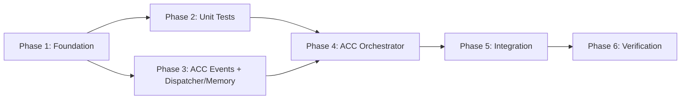

# Tasks: Wire ContextBuilder + ACC

## Overview

- **Total Tasks**: 48
- **Parallel Opportunities**: 20 tasks marked [P]
- **User Stories**: 6 (US1-US6)
- **Phases**: 6 (Foundation → Unit Tests → ACC Events + Dispatcher/Memory → ACC Orchestrator → Integration → Verification)

## Testing Strategy

- **Mocking approach**: Use manual stubs (no mocking framework) following existing test patterns in `extension/src/test/suite/`. Use `fs.mkdtemp()` for temp directories, real filesystem I/O where possible.
- **Mock ratio target**: < 30%. Mock only MemoryManager and HintLoader (external I/O boundaries). Use real ObservationMasker, StageContextProfileLoader, SubAgentDispatcher instances with test data.
- **Integration tests**: Split into 3 focused tests (not one god test) to enable targeted debugging.

## Dependencies

---

## Phase 1: Wire Shared ContextBuilder (Foundation)

**Goal**: Activate ~3,700 LOC of dead code by calling `setSharedContextBuilder()` during workspace initialization

**Covers**: US1 (P1), US2 (P1), US6 (P3) — FR-001 through FR-006, FR-012 through FR-015

### Implementation

- [X] T001 [US1] [US2] Create shared ContextBuilder instance in `initializeForWorkspace()` in `extension/src/extension.ts` — insert AFTER MemoryManager creation (line 362) and BEFORE CommandRegistry.registerAll() (line 424). Construct with `workspacePath`, `state.memoryManager`, `new HintLoader(workspacePath)`. Call `setSharedContextBuilder(contextBuilder)` from autonomousCommands.ts. Assign `state.sharedContextBuilder = contextBuilder`.
- [X] T002 [US1] [US2] Wire optional dependencies to shared ContextBuilder incrementally in `extension/src/extension.ts` — call `setUsageLogger(state.contextUsageLogger)` immediately after T001 (contextUsageLogger exists from InitializationService at line 299); call `setScopeGuard(scopeGuard)` AFTER ScopeGuard creation at line 378; call `setCostBudgetEnforcer(costBudgetEnforcer)` AFTER CostBudgetEnforcer creation at line 399. Each setter must be placed AFTER its dependency is created.
- [X] T003 [US1] Wire AutoHandoffTrigger to shared ContextBuilder in `extension/src/extension.ts` — call `state.autoHandoffTrigger.setContextBuilder(state.sharedContextBuilder)` AFTER both ContextBuilder and AutoHandoffTrigger exist. AutoHandoffTrigger is created by InitializationService (line 344-352) before we reach line 362, so the setter call goes after T001.
- [X] T004 [US1] [US2] Verify reinitialize cleanup in `extension/src/extension.ts` — confirm `reinitializeExtension()` disposes old builder at `state.sharedContextBuilder = undefined` (line 295) BEFORE `initializeForWorkspace()` re-creates new one. Add integration test verifying: (1) old builder disposal triggers `saveCacheToDisk()`, (2) new builder is created with fresh state, (3) disposal-then-creation order prevents memory leak per v1.12.3 pattern.

### Tests

- [X] T005 [P] [US1] Write wiring integration test in `extension/src/autonomous/__tests__/contextbuilder-wiring.test.ts` — call REAL `initializeForWorkspace()` with minimal real dependencies (real StateManager, real MemoryManager with temp dir, real HintLoader). Verify `state.sharedContextBuilder` is assigned and non-null. Verify `getSharedContextBuilder()` from autonomousCommands.ts returns the same instance. Do NOT mock initializeForWorkspace itself.
- [X] T006 [P] [US1] Write AutoHandoffTrigger regression test in `extension/src/autonomous/__tests__/contextbuilder-wiring.test.ts` — create real AutoHandoffTrigger, wire ContextBuilder via `setContextBuilder()`, connect to real ContextHealthMonitor. Simulate utilization crossing 65% and 70%, verify auto-save and critical events still fire correctly with ContextBuilder wired.
- [X] T007 [P] [US6] Write EventHandlers config reload test in `extension/src/autonomous/__tests__/contextbuilder-wiring.test.ts` — verify `reloadObservationPatterns()` and `reloadLayeredMemorySetting()` no longer early-return when `sharedContextBuilder` is set. Also test: set invalid regex in `observationPreservePatterns`, verify warning logged and extension does not crash (US6-AC4).

**Checkpoint**: Build passes, all existing tests pass, dead code paths now execute. EventHandlers config reloads work (US6 complete).

---

## Phase 2: ContextBuilder + ObservationMasker Unit Tests

**Goal**: Add test coverage for the now-live ContextBuilder, ObservationMasker, and StageContextProfileLoader

**Covers**: US1 (P1) acceptance criteria, US2 (P1) acceptance criteria

### ContextBuilder Tests

- [ ] T008 [P] [US2] Test `buildContext()` with stub MemoryManager in `extension/src/autonomous/__tests__/ContextBuilder.test.ts` — provide stub MemoryManager returning 3 known memories and 2 hints, verify context sections are populated with expected content and token estimates are non-zero
- [ ] T009 [P] [US2] Test `setCurrentStage()` loads correct profiles in `extension/src/autonomous/__tests__/ContextBuilder.test.ts` — switch to research stage, verify 40% research / 20% memory / 10% code allocation; switch to implement stage, verify 10% research / 20% memory / 40% code allocation. Assert exact budget percentages from profile.
- [ ] T010 [P] [US1] Test `trackObservation()` records and returns ID in `extension/src/autonomous/__tests__/ContextBuilder.test.ts` — track a file_read observation, verify UUID returned, verify retrievable via `getObservationMasker().getObservation(id)`
- [ ] T011 [P] [US2] Test budget enforcement in truncate mode in `extension/src/autonomous/__tests__/ContextBuilder.test.ts` — set `enforceBudgetCaps: true` with `budgetEnforcementMode: 'truncate'`, provide oversized content, verify sections are trimmed to stay within budget limits
- [ ] T012 [P] [US1] Test empty memories produce valid context in `extension/src/autonomous/__tests__/ContextBuilder.test.ts` — stub MemoryManager returning empty array, verify `buildContext()` succeeds, verify memory section exists with 0 token estimate (not null/undefined), verify returned BuiltContext has all expected section keys

### ObservationMasker Tests

- [ ] T013 [P] [US1] Test three-tier decay in `extension/src/autonomous/__tests__/ObservationMasker.test.ts` — track 15 observations, advance 12 turns via `maskOldObservations(12)`. With default ageThreshold=10 and keyPointsAgeFraction=0.6: observations at turn 0 (age 12) should be masked, observations at turn 6 (age 6, within key-points window) should show key-points, observations at turn 10 (age 2) should remain full.
- [ ] T014 [P] [US1] Test error preservation in `extension/src/autonomous/__tests__/ObservationMasker.test.ts` — track observation containing `"Error: Cannot read property 'x' of undefined\n    at Object.<anonymous>"`, advance 15 turns past all thresholds, verify it remains in full tier due to preserveErrorMessages=true
- [ ] T015 [P] [US1] Test per-type decay rates in `extension/src/autonomous/__tests__/ObservationMasker.test.ts` — track test_output (default threshold 12) and search_result (default threshold 6), advance 8 turns, verify search_result is masked (age 8 > threshold 6) but test_output is still in key-points (age 8 < threshold 12)
- [ ] T016 [P] [US1] Test cache persistence round-trip in `extension/src/autonomous/__tests__/ObservationMasker.test.ts` — track 5 observations in temp dir, call `saveCacheToDisk()`, create new ObservationMasker instance pointing to same dir, call `loadCacheFromDisk()`, verify all 5 observations restored with correct content and metadata
- [ ] T017 [P] [US1] Test LRU eviction in `extension/src/autonomous/__tests__/ObservationMasker.test.ts` — create with maxCacheSize=100, track 101 observations sequentially, verify cache size is 100, verify oldest (first) observation is evicted while newest (101st) exists
- [ ] T018 [P] [US1] Test cache corruption handling in `extension/src/autonomous/__tests__/ObservationMasker.test.ts` — write `"{{invalid json"` to cache index.json in temp dir, call `loadCacheFromDisk()`, verify cache is empty (cleared) and no exception thrown

### StageContextProfileLoader Tests

- [ ] T019 [P] [US2] Test YAML loading in `extension/src/autonomous/__tests__/StageContextProfileLoader.test.ts` — write valid context-profiles.yaml to temp dir with known budgets, verify profiles loaded correctly matching YAML values
- [ ] T020 [P] [US2] Test fallback to defaults in `extension/src/autonomous/__tests__/StageContextProfileLoader.test.ts` — provide temp dir with NO context-profiles.yaml, verify hardcoded defaults returned: research stage gets 40/20/10, implement gets 10/20/40
- [ ] T021 [P] [US2] Test validation in `extension/src/autonomous/__tests__/StageContextProfileLoader.test.ts` — write YAML with budgets summing to 1.5, verify validation rejects it and falls back to hardcoded defaults with warning

**Checkpoint**: All US1 and US2 acceptance criteria have test coverage. Components proven correct before ACC is layered on.

---

## Phase 3: ACC Events + SubAgentDispatcher + MemoryLayerManager

**Goal**: Add ACC threshold events to ContextHealthMonitor AND wire SubAgentDispatcher and MemoryLayerManager. These are done together so ACCOrchestrator (Phase 4) has all its dependencies available.

**Covers**: US3 (P2) FR-010, US4 (P2) FR-011, US5 (P3)

### ACC Event Implementation

- [ ] T022 [US3] Add ACC event types to `ContextHealthEvents` interface in `extension/src/autonomous/ContextHealthMonitor.ts` (lines 103-110) — add `'acc-delegation-advisory'` (70%), `'acc-observation-masking'` (80%), `'acc-fast-pruning'` (85%), `'acc-aggressive-masking'` (90%), `'acc-full-compaction'` (99%). Note: `'acc-delegation-advisory'` is a SEPARATE event from `'critical'` to avoid racing with AutoHandoffTrigger's critical handler.
- [ ] T023 [US3] Add ACC threshold config to `ContextHealthConfig` interface in `extension/src/autonomous/ContextHealthMonitor.ts` (lines 82-98) — add `accDelegationAdvisoryThreshold: 0.70`, `accObservationMaskingThreshold: 0.80`, `accFastPruningThreshold: 0.85`, `accAggressiveMaskingThreshold: 0.90`, `accFullCompactionThreshold: 0.99` with defaults
- [ ] T024 [US3] Add threshold crossing detection in `emitStatusEvents()` in `extension/src/autonomous/ContextHealthMonitor.ts` — follow existing pattern: `utilizationRatio >= threshold && previousRatio < threshold && dataSource === 'real'`. Emit ALL ACC events AFTER existing auto-save and critical events to preserve event ordering. ACC events fire in threshold order (70% before 80% before 85% etc).

### SubAgentDispatcher + MemoryLayerManager Wiring

- [ ] T037 [US4] Wire SubAgentDispatcher in `initializeForWorkspace()` in `extension/src/extension.ts` — create instance with `workspacePath`, call `state.sharedContextBuilder.setSubAgentDispatcher(dispatcher)`, subscribe to ContextHealthMonitor status-change events to call `dispatcher.updateUtilization()` on each health check
- [ ] T038 [US5] Wire MemoryLayerManager in `initializeForWorkspace()` in `extension/src/extension.ts` — create instance with `workspacePath`, call `layerManager.setMemoryManager(state.memoryManager)`, wire to ContextBuilder via `state.sharedContextBuilder.setMemoryLayerManager(layerManager, false)` (disabled by default, togglable via `gofer.useLayeredMemory`)

### ACC Event Tests

- [ ] T025 [P] [US3] Test ACC threshold crossing events in `extension/src/autonomous/__tests__/ContextHealthMonitor.acc-events.test.ts` — simulate utilization ramp from 0→100% in 5% increments, verify `acc-delegation-advisory` fires once at 70%, `acc-observation-masking` at 80%, `acc-fast-pruning` at 85%, `acc-aggressive-masking` at 90%, `acc-full-compaction` at 99%. Verify each fires exactly once (crossing detection).
- [ ] T026 [P] [US3] Test existing events unaffected in `extension/src/autonomous/__tests__/ContextHealthMonitor.acc-events.test.ts` — verify auto-save at 65% and critical at 70% still fire correctly with ACC events added. Verify AutoHandoffTrigger's critical handler and ACC's delegation-advisory handler are independent events (no race condition).
- [ ] T027 [P] [US3] Test event ordering in `extension/src/autonomous/__tests__/ContextHealthMonitor.acc-events.test.ts` — record event emission order when utilization jumps from 60% to 75%. Verify order: auto-save → critical → acc-delegation-advisory. No ACC event fires before its prerequisite existing events.

### SubAgentDispatcher Tests

- [ ] T039a [P] [US4] Test delegation thresholds in `extension/src/autonomous/__tests__/SubAgentDispatcher.test.ts` — call `updateUtilization(50)`, verify recommendation returns `codebase-locator` agent type with `advisory` enforcement; call `updateUtilization(60)`, verify `codebase-analyzer` with `warning` enforcement; call `updateUtilization(70)`, verify `codebase-pattern-finder` with `blocking` enforcement
- [ ] T039b [P] [US4] Test `formatAsContextSection()` in `extension/src/autonomous/__tests__/SubAgentDispatcher.test.ts` — set utilization to 65%, call `formatAsContextSection()`, verify returns markdown string containing "## Delegation Warning", the agent type recommendation, and token budget
- [ ] T039c [P] [US4] Test result truncation in `extension/src/autonomous/__tests__/SubAgentDispatcher.test.ts` — call `truncateResult()` with a 10,000 char string and maxTokens=1500. Verify output is ~6,000 chars (1500*4), with 70% from head and 20% from tail with truncation marker in between

### MemoryLayerManager Tests

- [ ] T040a [P] [US5] Test core/recall/archival layer separation in `extension/src/autonomous/__tests__/MemoryLayerManager.test.ts` — create stub MemoryManager returning 10 memories: 2 tagged `#core`, 5 recent (last hour), 3 old. Verify `getCoreMemory()` returns only the 2 core memories, `getRecallMemory()` returns only the 5 recent ones, `searchArchival("keyword")` searches all.
- [ ] T040b [P] [US5] Test archival is search-only in `extension/src/autonomous/__tests__/MemoryLayerManager.test.ts` — create 3 archival memories (old, no core tags). Call `formatAsContextSection()` with NO search query. Verify archival memories are NOT included in output. Only core+recall appear.
- [ ] T040c [P] [US5] Test recall layer limits in `extension/src/autonomous/__tests__/MemoryLayerManager.test.ts` — create stub MemoryManager returning 30 recent memories (all within 1 hour). Verify `getRecallMemory()` returns at most 20 entries (recallLimit default). Verify the 10 excluded are the lowest-priority ones.
- [ ] T040d [P] [US5] Test priority-based demotion in `extension/src/autonomous/__tests__/MemoryLayerManager.test.ts` — create 25 recall memories, call `demoteMemories()`, verify bottom half by priority are marked stale

**Checkpoint**: ContextHealthMonitor emits all ACC events. SubAgentDispatcher produces correct advisories at each threshold (US4 complete). MemoryLayerManager correctly separates layers and excludes archival from default context (US5 complete).

---

## Phase 4: Implement ACCOrchestrator

**Goal**: Create the ACCOrchestrator that connects to ContextHealthMonitor and delegates compaction to existing components. All dependencies (SubAgentDispatcher, MemoryLayerManager, ContextBuilder) are already wired from Phases 1+3.

**Covers**: US3 (P2) — FR-007, FR-008, FR-009

### Implementation

- [ ] T028 [US3] Create ACCOrchestrator class in `extension/src/autonomous/ACCOrchestrator.ts` — implement `connect(monitor: ContextHealthMonitor)` following AutoHandoffTrigger pattern. Constructor takes: shared ContextBuilder (required), ObservationMasker (required, from `builder.getObservationMasker()`), SubAgentDispatcher (optional, null-safe), ContextCompactor (optional, null-safe for no-LLM case). Implement `dispose()` cleaning up event listeners via disposables array.
- [ ] T029 [US3] Implement stage handlers in `extension/src/autonomous/ACCOrchestrator.ts` — Stage 1 (70%, listens to `acc-delegation-advisory`): log warning + call `subAgentDispatcher?.updateUtilization(70)` (null-safe). Stage 2 (80%, listens to `acc-observation-masking`): call `observationMasker.maskOldObservations()` with reduced age thresholds. Stage 3 (85%, listens to `acc-fast-pruning`): update ContextBuilder config to `enforceBudgetCaps: true, budgetEnforcementMode: 'truncate'`. Stage 4 (90%, listens to `acc-aggressive-masking`): force all observations to masked tier. Stage 5 (99%, listens to `acc-full-compaction`): if `contextCompactor` is non-null, call `contextCompactor.compact()` with aggressive strategy; if null, log warning and skip.
- [ ] T030 [US3] Implement cooldown logic in `extension/src/autonomous/ACCOrchestrator.ts` — minimum 30s between same-stage actions tracked via `lastStageTimestamps: Map<number, number>`. Higher stages supersede lower (stage 4 at 90% runs even if stage 2 at 80% is in cooldown). All stage handlers wrapped in try/catch: errors logged as warnings, never thrown.
- [ ] T031 [US3] Wire ACCOrchestrator in `initializeForWorkspace()` in `extension/src/extension.ts` — create AFTER Phase 3 dependencies exist (ContextBuilder, SubAgentDispatcher, ContextHealthMonitor). Pass `state.sharedContextBuilder`, `state.sharedContextBuilder.getObservationMasker()`, SubAgentDispatcher instance, null for ContextCompactor (wired later when autonomous session starts). Call `accOrchestrator.connect(contextHealthMonitor)`. Store in `state.accOrchestrator` for disposal.

### Tests

- [ ] T032 [P] [US3] Test each stage fires and ACTS at correct threshold in `extension/src/autonomous/__tests__/ACCOrchestrator.test.ts` — create real ACCOrchestrator with real ObservationMasker (temp dir) and real SubAgentDispatcher. Mock ContextHealthMonitor to emit events. At 70%: verify `SubAgentDispatcher.updateUtilization()` was called. At 80%: verify `ObservationMasker.maskOldObservations()` ran (track observations first, verify some are masked after). At 85%: verify ContextBuilder budget enforcement switched to truncate. At 90%: verify all observations forced to masked. At 99% with null compactor: verify warning logged.
- [ ] T033 [P] [US3] Test cooldown prevents rapid re-triggering in `extension/src/autonomous/__tests__/ACCOrchestrator.test.ts` — emit `acc-observation-masking` twice within 30s, verify `maskOldObservations()` called only once. Wait 31s (use fake timers), emit again, verify called a second time.
- [ ] T034 [P] [US3] Test higher stages supersede lower in `extension/src/autonomous/__tests__/ACCOrchestrator.test.ts` — emit `acc-observation-masking` (80%), then immediately emit `acc-aggressive-masking` (90%) while stage 2 is in cooldown. Verify stage 4 handler executes despite stage 2 cooldown being active.
- [ ] T035 [P] [US3] Test all stages non-fatal in `extension/src/autonomous/__tests__/ACCOrchestrator.test.ts` — create ACCOrchestrator where ObservationMasker.maskOldObservations() throws. Emit `acc-observation-masking`, verify error is logged but no exception escapes the handler. Test stage 5 with ContextCompactor=null, verify warning "No ContextCompactor available, skipping LLM compaction" logged and no crash.
- [ ] T035b [P] [US3] Test stage 5 happy path with mocked compactor in `extension/src/autonomous/__tests__/ACCOrchestrator.test.ts` — create stub ContextCompactor with `compact()` returning a CompactionSummary. Emit `acc-full-compaction`, verify `compact()` called with aggressive strategy (preserveLastN=5, targetReduction=60)
- [ ] T036 [P] [US3] Test dispose cleans up listeners in `extension/src/autonomous/__tests__/ACCOrchestrator.test.ts` — call `dispose()`, emit all ACC events, verify no handlers fire after disposal

**Checkpoint**: ACCOrchestrator fires all 5 stages correctly with real behavior (not just mock interactions). Stage 1 uses separate `acc-delegation-advisory` event (no race with AutoHandoffTrigger). US3 complete.

---

## Phase 5: Integration Testing

**Goal**: End-to-end verification that all components work together. Split into 3 focused tests.

**Covers**: All user stories, all FRs — final validation

### Integration Tests

- [ ] T041a [US3] Write ACC pipeline integration test in `extension/src/autonomous/__tests__/acc-integration.test.ts` — test full utilization ramp (0→100%) with real ACCOrchestrator, real ObservationMasker, real SubAgentDispatcher. Verify: stage 1 injects delegation advisory, stage 2 masks observations, stage 3 enables truncation, stage 4 forces aggressive masking, stage 5 attempts compaction. Verify no exceptions at any stage.
- [ ] T041b Write coexistence integration test in `extension/src/autonomous/__tests__/acc-integration.test.ts` — create BOTH AutoHandoffTrigger and ACCOrchestrator connected to the same ContextHealthMonitor. Simulate utilization crossing 70%. Verify AutoHandoffTrigger receives `critical` event AND ACCOrchestrator receives `acc-delegation-advisory` event independently. Neither blocks the other.
- [ ] T041c Write dead-code activation integration test in `extension/src/autonomous/__tests__/acc-integration.test.ts` — verify the 5 auto-activating dead code paths work after wiring: (1) EventHandlers `reloadObservationPatterns()` executes (line 215), (2) EventHandlers `reloadLayeredMemorySetting()` executes (line 245), (3) DisposalService `saveCacheToDisk()` runs on cleanup (line 87), (4) observation tracking activates at `autonomousCommands.ts:1008` (verify non-null builder), (5) KnowledgeGraph save path at `autonomousCommands.ts:1117` (verify non-null builder)

**Checkpoint**: All components work together. Dead code paths verified alive.

---

## Phase 6: Verification

**Goal**: Final build/test/lint verification

- [ ] T042 Verify build passes — run `cd extension && npm run compile`
- [ ] T043 Verify all tests pass — run `cd extension && npm test`
- [ ] T044 Verify lint passes — run `cd extension && npm run lint && npm run format`

**Checkpoint**: All tests pass, build succeeds, lint clean. Feature complete.

---

## Parallel Execution Guide

Tasks marked [P] can run concurrently if they modify different files and have no dependencies on incomplete tasks.

**Phase 1 parallel groups**: T005, T006, T007 (all in same test file, different test cases)

**Phase 2 parallel groups** (all independent test files):
- Group A: T008, T009, T010, T011, T012 (ContextBuilder tests)
- Group B: T013, T014, T015, T016, T017, T018 (ObservationMasker tests)
- Group C: T019, T020, T021 (StageContextProfileLoader tests)

**Phase 3 parallel groups**:
- Group A: T025, T026, T027 (ACC event tests)
- Group B: T039a, T039b, T039c (SubAgentDispatcher tests)
- Group C: T040a, T040b, T040c, T040d (MemoryLayerManager tests)

**Phase 4 parallel groups**: T032, T033, T034, T035, T035b, T036 (ACCOrchestrator tests)

## Implementation Strategy

1. **MVP First**: Complete Phases 1-2 (Foundation + Tests) — activates ~3,700 LOC, proves observation masking and stage budgets work (US1+US2)
2. **Dependencies**: Complete Phase 3 — adds ACC events, dispatcher, and memory layers (US4+US5)
3. **ACC Orchestrator**: Complete Phase 4 — adds progressive compaction (US3). All dependencies available from Phase 3.
4. **Integration**: Phase 5 — cross-component verification
5. **Ship**: Phase 6 — final build/test/lint verification
