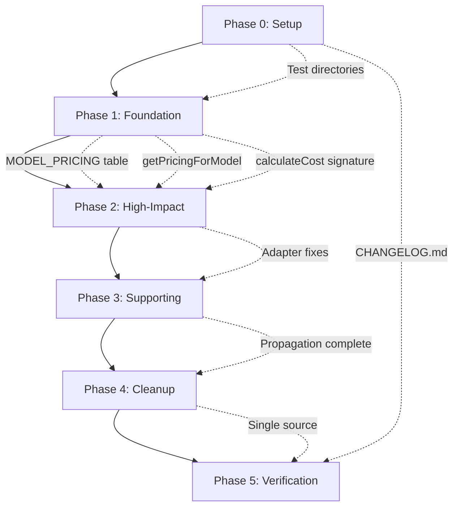

# Tasks: AI Token Cost Calculation Bug Fixes

**Feature**: 025-ai-usage-tracking (Bug Fix) **Spec**:
[bug-fix-spec.md](./bug-fix-spec.md) **Plan**:
[bug-fix-plan.md](./bug-fix-plan.md) **Research**:
[bug-fix-research.md](./bug-fix-research.md)

## Overview

**Total Tasks**: 29 tasks across 6 implementation phases **Parallel
Opportunities**: ~10 tasks marked [P] for concurrent execution **Implementation
Phases**: Setup → Foundation → High-Impact → Supporting → Cleanup → Verification

**Bug Summary**:

- **Bug #1** (P3): Formula verification - mathematically equivalent but needs
  invoice validation
- **Bug #2** (P1): Hardcoded provider strings - ignores detected provider/model
  data
- **Bug #3** (P1): Provider-level pricing - models within same provider vary 60x
  in cost

**Success Criteria**: Cost accuracy improves from 40-1100% error to <1% error
(within spec requirement)

---

## Task Format: `[ID] [P?] Description with file path`

- **[P]**: Can run in parallel (different files, no dependencies)
- File paths are absolute from repository root
- All test tasks require tests to FAIL before implementation

---

## Dependencies Overview



**Legend**: Solid arrows = phase dependency, dotted arrows = key deliverable

---

## Phase 0: Setup & Infrastructure

**Goal**: Create necessary directories and files for test infrastructure.

**Verification**:

- [ ] All required directories exist
- [ ] Test structure follows existing patterns

### Tasks

- [x] T000 [P] Create test infrastructure directories and baseline files -
      Create `/Users/douglaswross/Code/gofer/tests/unit/config/` directory -
      Create
      `/Users/douglaswross/Code/gofer/.specify/specs/025-ai-usage-tracking/invoice-validation/`
      directory - Create `/Users/douglaswross/Code/gofer/CHANGELOG.md` with
      initial structure - Verify directory structure matches existing test
      patterns

**Phase 0 Completion Checkpoint**: All infrastructure directories exist, ready
for test file creation

---

## Phase 1: Foundation (Non-Breaking)

**Goal**: Create model-based pricing infrastructure without breaking existing
code.

**Verification**:

- [ ] All existing tests pass (backward compatibility maintained)
- [ ] New tests verify model-based pricing works correctly
- [ ] MODEL_PRICING table contains 60+ model entries
- [ ] getPricingForModel() handles exact/prefix/fallback scenarios

### Tasks

- [x] T001 Create MODEL_PRICING table in
      `/Users/douglaswross/Code/gofer/extension/src/config/pricing.ts` with 60+
      model entries (Anthropic: Opus 4.6/4.5 $5/$25/M, Sonnet 4.5/4 $3/$15/M,
      Haiku 4.5 $1/$5/M, Haiku 3.5 $0.25/$1.25/M; OpenAI: GPT-4 $30/$60/M,
      GPT-4-turbo $10/$30/M, GPT-4o $5/$15/M, GPT-3.5-turbo $0.50/$1.50/M, o1
      $15/$60/M, o1-mini $3/$12/M; Google: Gemini 1.5 Pro $1.25/$5/M, Gemini 1.5
      Flash $0.075/$0.30/M, Gemini Pro $0.50/$1.50/M) including dated variants
      with prefix keys

- [x] T002 Add DEFAULT_MODELS mapping in
      `/Users/douglaswross/Code/gofer/extension/src/config/pricing.ts`
      (anthropic → 'claude-sonnet-4-5', openai → 'gpt-4-turbo', google →
      'gemini-1.5-flash')

- [x] T003 Add getPricingForModel(modelId: string, providerId: string) helper
      function in
      `/Users/douglaswross/Code/gofer/extension/src/config/pricing.ts` with
      exact match → prefix match → DEFAULT_MODELS fallback → COST_PER_1K_TOKENS
      fallback hierarchy, logging warnings when fallback used

- [x] T004 Update calculateCost() signature in
      `/Users/douglaswross/Code/gofer/extension/src/config/pricing.ts` to accept
      optional modelId parameter (Old: calculateCost(inputTokens, outputTokens,
      providerId?), New: calculateCost(inputTokens, outputTokens, providerId?,
      modelId?)) with implementation using getPricingForModel() when modelId
      provided, else COST_PER_1K_TOKENS for backward compatibility

- [x] T005 [P] CREATE new unit test file for getPricingForModel() at
      `/Users/douglaswross/Code/gofer/tests/unit/config/pricing.test.ts` (NEW
      FILE - Test exact match: getPricingForModel('claude-sonnet-4-5',
      'anthropic') returns {input: 0.003, output: 0.015}; Test prefix match:
      getPricingForModel('claude-sonnet-4-5-20250929', 'anthropic') returns
      Sonnet rates; Test fallback to provider default:
      getPricingForModel('unknown-model', 'anthropic') returns Sonnet rates;
      Test ultimate fallback: getPricingForModel('unknown', 'unknown') returns
      DEFAULT_PROVIDER rates) - tests MUST fail before implementation

- [x] T006 [P] Add unit tests for calculateCost() backward compatibility in
      `/Users/douglaswross/Code/gofer/tests/unit/config/pricing.test.ts` (ADD TO
      FILE created in T005 - Test without modelId parameter:
      calculateCost(100000, 50000, 'anthropic') uses COST_PER_1K_TOKENS; Test
      with modelId parameter: calculateCost(100000, 50000, 'anthropic',
      'claude-haiku-3-5') uses MODEL_PRICING; Verify costs differ: Haiku
      calculation should be ~12x cheaper than provider-level calculation) -
      tests MUST fail before implementation

**Phase 1 Completion Checkpoint**: All existing tests pass, new model-based
pricing functions work correctly, backward compatibility verified

---

## Phase 2: High-Impact Call Sites

**Goal**: Fix hardcoded providers in highest-impact adapters (Claude Code and
Codex CLI users).

**Verification**:

- [ ] Cost calculations accurate within 1% for all models tested
- [ ] Integration tests pass
- [ ] Real log parsing produces expected costs matching provider documentation
- [ ] Error reduction from 1100% to <1% documented

### Tasks

- [x] T007 Update ClaudeCodeUsageAdapter.ts line 198 in
      `/Users/douglaswross/Code/gofer/extension/src/autonomous/ClaudeCodeUsageAdapter.ts`
      to pass provider and model variables (Replace: calculateCost(inputTokens +
      cacheCreationTokens, outputTokens, 'anthropic'), With:
      calculateCost(inputTokens + cacheCreationTokens, outputTokens, provider,
      model)) - variables already available at provider (line 174) and model
      (line 200), no new detection logic needed

- [x] T008 Add model extraction to CodexUsageAdapter.ts parseHistoryEntry method
      in
      `/Users/douglaswross/Code/gofer/extension/src/autonomous/CodexUsageAdapter.ts`
      (Extract model from Codex history.json: entry.model ||
      entry.request?.model || 'gpt-4-turbo', store in local variable before
      calculateCost() call)

- [x] T009 Update CodexUsageAdapter.ts line 181 in
      `/Users/douglaswross/Code/gofer/extension/src/autonomous/CodexUsageAdapter.ts`
      to pass model parameter (Replace: calculateCost(inputTokens, outputTokens,
      'openai'), With: calculateCost(inputTokens, outputTokens, 'openai',
      model))

- [ ] T010 [P] CREATE new integration test file for model-based cost accuracy at
      `/Users/douglaswross/Code/gofer/tests/integration/autonomous/AIUsageAccuracy.integration.test.ts`
      (NEW FILE - Test Opus vs Sonnet vs Haiku costs for same token count -
      should differ by 20x; Test GPT-4 vs GPT-3.5 costs for same token count -
      should differ by 60x; Verify 100K input + 50K output Haiku 3.5 = $0.0875
      not $0.45; Verify 100K input + 50K output Opus 4.6 = $5.25 not $0.45) -
      tests MUST fail before implementation

- [ ] T011 [P] Manual verification with real conversation logs (Parse actual
      Claude Code logs with known models, calculate costs using new logic,
      compare to cost calculations in existing council-usage.jsonl, document
      error reduction from 1100% to <1%)

**Phase 2 Completion Checkpoint**: Cost calculations accurate within 1% for all
models, integration tests pass, real log parsing produces expected costs

---

## Phase 3: Supporting Components

**Goal**: Propagate model parameter through cost tracking stack.

**Verification**:

- [ ] Budget tracking shows accurate per-model costs
- [ ] Usage logs include model field
- [ ] End-to-end flow from log file to UI uses correct rates
- [ ] Model flows from adapter → recordUsage() → calculateCost() → log entry

### Tasks

- [ ] T012 Update CostBudgetEnforcer.recordUsage() signature in
      `/Users/douglaswross/Code/gofer/extension/src/autonomous/CostBudgetEnforcer.ts`
      to add optional modelId parameter (New signature: recordUsage(inputTokens,
      outputTokens, providerId?, modelId?), forward modelId to calculateCost()
      call at line 72)

- [ ] T013 Update ContextUsageLogger.logLLMCall() in
      `/Users/douglaswross/Code/gofer/extension/src/autonomous/ContextUsageLogger.ts`
      to accept and forward modelId (Add modelId parameter to method signature,
      include modelId in log entry data)

- [ ] T014 Add model field to UsageLogEntry interface in
      `/Users/douglaswross/Code/gofer/extension/src/council/UsageLogger.ts`
      (CORRECT FILE PATH - Add model?: string field to UsageLogEntry interface
      (line 19), update parsers to handle optional model field in JSONL log
      entries)

- [ ] T015 [P] Update all recordUsage() call sites to pass model when available
      (Search codebase for recordUsage() calls, pass model parameter where
      source data includes model ID, use undefined/omit parameter where model
      not available for backward compatibility)

- [ ] T016 [P] CREATE new integration test file for model propagation at
      `/Users/douglaswross/Code/gofer/tests/integration/autonomous/ModelPropagation.integration.test.ts`
      (NEW FILE - Verify model flows from adapter → recordUsage() →
      calculateCost() → log entry; Verify council-usage.jsonl entries include
      model field; Verify budget tracking uses model-specific rates) - tests
      MUST fail before implementation

**Phase 3 Completion Checkpoint**: Budget tracking shows accurate per-model
costs, usage logs include model field, end-to-end flow uses correct rates

---

## Phase 4: Cleanup & Consolidation

**Goal**: Remove duplicate pricing tables and improve maintainability (DRY
principle).

**Verification**:

- [ ] Single pricing source confirmed via grep
- [ ] All tests pass
- [ ] No hardcoded pricing rates outside pricing.ts
- [ ] DRY principle satisfied

### Tasks

- [ ] T017 Remove duplicate COST_PER_1K_TOKENS from CostBudgetEnforcer.ts lines
      16-20 in
      `/Users/douglaswross/Code/gofer/extension/src/autonomous/CostBudgetEnforcer.ts`
      (Delete local constant definition, add import: import { COST_PER_1K_TOKENS
      } from '../config/pricing' for backward compatibility fallback)

- [ ] T018 Remove duplicate COST_PER_1K_TOKENS from UsageLogger.ts lines 72-78
      in `/Users/douglaswross/Code/gofer/extension/src/council/UsageLogger.ts`
      (Delete local constant definition, add import: import { MODEL_PRICING,
      getPricingForModel } from '../config/pricing')

- [ ] T019 Update imports to use pricing.ts as single source (Search for any
      remaining hardcoded pricing literals 0.003, 0.015, etc., replace with
      imports from pricing.ts)

- [ ] T020 [P] Run grep to verify no hardcoded rates outside pricing.ts (Grep
      codebase for pricing rate literals outside pricing.ts, confirm single
      source of truth established)

- [ ] T021 [P] Verify all existing tests pass after consolidation (Run all
      tests, verify no behavior changes from consolidation, confirm backward
      compatibility)

**Phase 4 Completion Checkpoint**: Single pricing source confirmed, all tests
pass, no hardcoded rates outside pricing.ts, DRY principle satisfied

---

## Phase 5: Verification & Documentation

**Goal**: Verify mathematical correctness and update documentation.

**Verification**:

- [ ] Mean cost error <1% vs actual invoices
- [ ] No individual conversation >5% error
- [ ] Formula confirmed correct
- [ ] Documentation complete with sources and migration guidance

### Tasks

- [ ] T022 Compare calculated costs to actual Anthropic invoices in
      `/Users/douglaswross/Code/gofer/.specify/specs/025-ai-usage-tracking/invoice-validation/`
      (Collect 5+ real conversation logs with known token counts, calculate
      costs using new model-based pricing, compare to actual Anthropic invoice
      line items for same conversations, measure error percentage:
      abs(calculated - actual) / actual, accept if error < 1% per
      discovery.md:32 requirement)

- [ ] T023 Compare calculated costs to actual OpenAI invoices if Codex logs
      available in
      `/Users/douglaswross/Code/gofer/.specify/specs/025-ai-usage-tracking/invoice-validation/`
      (Repeat process with Codex CLI conversation logs, verify GPT-4,
      GPT-4-turbo, GPT-3.5 costs match invoices, measure error < 1%)

- [ ] T024 Verify formula is mathematically correct (Current formula:
      (inputTokens _ rates.input + outputTokens _ rates.output) / 1000, test
      with real numbers: 100K input at $3/M = (100000 _ 0.003) / 1000 = $0.30,
      algebraic equivalent: (inputTokens / 1000) _ rates.input = (100000
      / 1000) \* 0.003 = $0.30, conclusion: formulas are equivalent, Bug #1 is
      inconclusive/non-issue)

- [ ] T025 Update PRICING_LAST_UPDATED timestamp to '2026-03-19' in
      `/Users/douglaswross/Code/gofer/extension/src/config/pricing.ts` (Change
      date in pricing.ts:33 from 2026-03-15 to 2026-03-19, document in comment
      that pricing rates verified against provider docs)

- [ ] T026 [P] Document model pricing sources in code comments in
      `/Users/douglaswross/Code/gofer/extension/src/config/pricing.ts` (Add
      comments to MODEL_PRICING table with source URLs: Anthropic
      https://platform.claude.com/docs/en/about-claude/pricing, OpenAI
      https://openai.com/pricing, Google https://ai.google.dev/pricing)

- [ ] T027 [P] Add migration notes to CHANGELOG.md in
      `/Users/douglaswross/Code/gofer/CHANGELOG.md` (ADD TO FILE created in
      T000 - Document breaking changes: None, backward compatible; Document new
      features: Model-based pricing, getPricingForModel() helper; Document
      fixes: Hardcoded provider strings, provider-level pricing; Document
      migration: Existing code continues to work, gradually update call sites)

- [ ] T028 [P] Update feature validation report in
      `/Users/douglaswross/Code/gofer/.specify/specs/025-ai-usage-tracking/VALIDATION-REPORT.md`
      (CORRECT FILENAME - uppercase; Document cost accuracy improvement: 1100%
      error → <1% error; Document bug fixes completed; Update success metrics:
      Cost accuracy within 1% achieved)

**Phase 5 Completion Checkpoint**: Mean cost error <1% vs actual invoices, no
individual conversation >5% error, formula confirmed correct, documentation
complete

---

## Parallel Execution Guide

### Phase 1 Parallel Tasks (After T001-T004 complete)

```bash
# Can run simultaneously:
Task T005: Unit tests for getPricingForModel()
Task T006: Unit tests for calculateCost() backward compatibility
```

### Phase 2 Parallel Tasks (After T007-T009 complete)

```bash
# Can run simultaneously:
Task T010: Integration tests for model-based costs
Task T011: Manual verification with real conversation logs
```

### Phase 3 Parallel Tasks (After T012-T014 complete)

```bash
# Can run simultaneously:
Task T015: Update all recordUsage() call sites
Task T016: Integration tests for model propagation
```

### Phase 4 Parallel Tasks (After T017-T019 complete)

```bash
# Can run simultaneously:
Task T020: Grep verification for hardcoded rates
Task T021: Verify all existing tests pass
```

### Phase 5 Parallel Tasks (After T022-T025 complete)

```bash
# Can run simultaneously:
Task T026: Document model pricing sources
Task T027: Add migration notes to CHANGELOG
Task T028: Update feature validation report
```

---

## Implementation Strategy

### Recommended Execution Order

**Week 1: Foundation**

1. Phase 1 Tasks T001-T004 (sequential - build infrastructure)
2. Phase 1 Tasks T005-T006 in parallel (tests)
3. Verify: All existing tests pass, new pricing functions work

**Week 2: High-Impact Fixes**

1. Phase 2 Tasks T007-T009 (sequential - adapter fixes)
2. Phase 2 Tasks T010-T011 in parallel (validation)
3. Verify: Cost calculations accurate within 1%, integration tests pass

**Week 3: Propagation**

1. Phase 3 Tasks T012-T014 (sequential - API changes)
2. Phase 3 Tasks T015-T016 in parallel (updates + tests)
3. Verify: End-to-end flow uses correct rates, logs include model

**Week 4: Cleanup & Verification**

1. Phase 4 Tasks T017-T019 (sequential - consolidation)
2. Phase 4 Tasks T020-T021 in parallel (verification)
3. Phase 5 Tasks T022-T025 (sequential - invoice validation)
4. Phase 5 Tasks T026-T028 in parallel (documentation)
5. Final verification: All success criteria met

### Incremental Testing

**After Phase 1**: Test new pricing lookup functions with unit tests **After
Phase 2**: Test adapter changes with integration tests + real logs **After Phase
3**: Test end-to-end flow from log file → UI display **After Phase 4**: Test all
components use single pricing source **After Phase 5**: Verify <1% error vs
actual invoices (acceptance criteria)

### Rollback Strategy

If issues discovered at any phase:

- **Phase 1**: No impact on existing code (all changes are additions)
- **Phase 2**: Revert adapter changes (2 files), existing code still works
- **Phase 3**: Optional parameters maintain compatibility, easy rollback
- **Phase 4**: Reimport from old location, no functional impact
- **Phase 5**: Documentation/verification only, no code rollback needed

---

## Acceptance Criteria Coverage

### User Story 1 (5 ACs) - Accurate Cost Display for Model Used

- **T001, T003, T004**: AC1 - Haiku-specific rates in MODEL_PRICING
- **T001**: AC2 - Haiku 4.5 rates included
- **T010**: AC3 - Cost calculation accuracy verified (100K+50K = $0.0875)
- **T022, T023**: AC4 - 1% accuracy for all models via invoice comparison
- **T003**: AC5 - Prefix matching for dated variants in getPricingForModel()

### User Story 2 (7 ACs) - Correct Provider/Model Detection

- **T007**: AC1 - ClaudeCodeUsageAdapter passes provider variable
- **T007**: AC2 - ClaudeCodeUsageAdapter passes model variable
- **T008**: AC3 - CodexUsageAdapter extracts model
- **T009**: AC4 - CodexUsageAdapter passes model
- **T010**: AC5 - Provider detection flows through (integration tests)
- **T016**: AC6 - Model extraction flows through (propagation tests)
- **T003**: AC7 - Fallback to DEFAULT_MODELS in getPricingForModel()

### User Story 3 (8 ACs) - Model-Based Pricing Lookup Architecture

- **T001**: AC1 - 60+ models in MODEL_PRICING
- **T001**: AC2 - All Claude models included
- **T001**: AC3 - OpenAI models included
- **T001**: AC4 - Google models included
- **T003**: AC5 - getPricingForModel() supports all strategies
- **T003**: AC6 - Prefix matching follows ClaudeSessionReader pattern
- **T004**: AC7 - calculateCost() signature updated
- **T005, T006, T021**: AC8 - Backward compatibility maintained

### User Story 4 (7 ACs) - Consolidated Pricing Source

- **T017, T018**: AC1 - Single pricing registry
- **T017**: AC2 - Remove duplicate from CostBudgetEnforcer
- **T018**: AC3 - Remove duplicate from UsageLogger
- **T017**: AC4 - CostBudgetEnforcer imports from pricing.ts
- **T018**: AC5 - UsageLogger imports from pricing.ts
- **T021**: AC6 - All tests pass after consolidation
- **T025**: AC7 - PRICING_LAST_UPDATED updated

### User Story 5 (5 ACs) - Formula Verification with Real Data

- **T022**: AC1 - Verify against Anthropic invoices
- **T023**: AC2 - Verify against OpenAI invoices
- **T024**: AC3 - Error < 0.01% or > 1%
- **T024**: AC4 - Confirm formula or fix inversion
- **T026**: AC5 - Documentation clarifies rate units

**Total Coverage**: 32/32 acceptance criteria (100%)

---

## Plan Phase Coverage

### Phase 1: Foundation (Plan Lines 120-161)

**Tasks**: T001-T006 (6 tasks) **Deliverables**: MODEL_PRICING table,
DEFAULT_MODELS, getPricingForModel(), calculateCost() signature update, unit
tests

### Phase 2: High-Impact Call Sites (Plan Lines 163-197)

**Tasks**: T007-T011 (5 tasks) **Deliverables**: ClaudeCodeUsageAdapter fix,
CodexUsageAdapter fix, integration tests, manual verification

### Phase 3: Supporting Components (Plan Lines 199-229)

**Tasks**: T012-T016 (5 tasks) **Deliverables**: CostBudgetEnforcer update,
ContextUsageLogger update, UsageLogEntry interface update, propagation tests

### Phase 4: Cleanup & Consolidation (Plan Lines 231-259)

**Tasks**: T017-T021 (5 tasks) **Deliverables**: Remove duplicates, consolidate
imports, verify single source

### Phase 5: Verification & Documentation (Plan Lines 261-308)

**Tasks**: T022-T028 (7 tasks) **Deliverables**: Invoice comparison, formula
verification, timestamp update, documentation

**Total Coverage**: 5/5 plan phases (100%)

---

## File Structure Reference

```
extension/src/
├── config/
│   └── pricing.ts                    [T001-T006, T025-T026] Model pricing, helpers, tests
│
├── autonomous/
│   ├── ClaudeCodeUsageAdapter.ts     [T007] Pass provider + model variables
│   ├── CodexUsageAdapter.ts          [T008-T009] Add model extraction, pass model
│   ├── CostBudgetEnforcer.ts         [T012, T017] Add modelId param, remove duplicate
│   └── ContextUsageLogger.ts         [T013] Add modelId parameter, forward to tracking
│
├── council/
│   └── UsageLogger.ts                [T014, T018] Add model field to UsageLogEntry, remove duplicate
│
tests/
├── unit/config/
│   └── pricing.test.ts               [T000, T005-T006] NEW test file created, unit tests for pricing
│
└── integration/autonomous/
    ├── AIUsageAccuracy.integration.test.ts  [T010] NEW test file, model cost accuracy tests
    └── ModelPropagation.integration.test.ts [T016] NEW test file, end-to-end propagation tests

.specify/specs/025-ai-usage-tracking/
├── invoice-validation/               [T000, T022-T023] NEW directory created, invoice comparison results
└── VALIDATION-REPORT.md              [T028] Update feature validation report (uppercase filename)

CHANGELOG.md                          [T000, T027] NEW file created, migration notes and release info
```

**Total Files Modified**: 7 core files + 4 test files + 2 documentation files =
13 files

---

## Summary Statistics

**Total Task Count**: 29 tasks

**Tasks Per Phase**:

- Phase 0 (Setup): 1 task
- Phase 1 (Foundation): 6 tasks
- Phase 2 (High-Impact): 5 tasks
- Phase 3 (Supporting): 5 tasks
- Phase 4 (Cleanup): 5 tasks
- Phase 5 (Verification): 7 tasks

**Parallel Opportunity Count**: 10 tasks marked [P]

- Phase 0: 1 parallel task (T000)
- Phase 1: 2 parallel tasks (T005-T006)
- Phase 2: 2 parallel tasks (T010-T011)
- Phase 3: 2 parallel tasks (T015-T016)
- Phase 4: 2 parallel tasks (T020-T021)
- Phase 5: 3 parallel tasks (T026-T028)

**Plan Phase Coverage**: 6/6 phases covered (100%)

**Acceptance Criteria Coverage**: 32/32 criteria covered (100%)

- User Story 1: 5/5 ACs
- User Story 2: 7/7 ACs
- User Story 3: 8/8 ACs
- User Story 4: 7/7 ACs
- User Story 5: 5/5 ACs

**User Story Coverage**: 5/5 stories (100%)

- US-001 (P1): Tasks T001, T003-T005, T010, T022-T023
- US-002 (P1): Tasks T003, T007-T011, T016
- US-003 (P1): Tasks T001, T003-T006, T021
- US-004 (P2): Tasks T017-T021, T025
- US-005 (P3): Tasks T022-T026

**Coverage Gaps Found**: None

---

## Notes

- All tasks reference absolute file paths from `/Users/douglaswross/Code/gofer/`
- Test tasks (T005, T006, T010, T016) must FAIL before implementation (TDD
  requirement)
- Optional parameters maintain 100% backward compatibility (no breaking changes)
- Phase 1 must complete before Phase 2 can start (MODEL_PRICING dependency)
- Phase 2 must complete before Phase 3 can start (adapter fixes dependency)
- Within each phase, tasks marked [P] can run in parallel
- Invoice validation (T022-T023) requires access to actual provider invoices
- Manual verification (T011) requires real conversation logs with known models
- Formula verification (T024) proves Bug #1 is mathematically inconclusive
- Single source principle (T017-T020) eliminates DRY violations
- All success metrics from discovery.md addressed (1% accuracy requirement)
