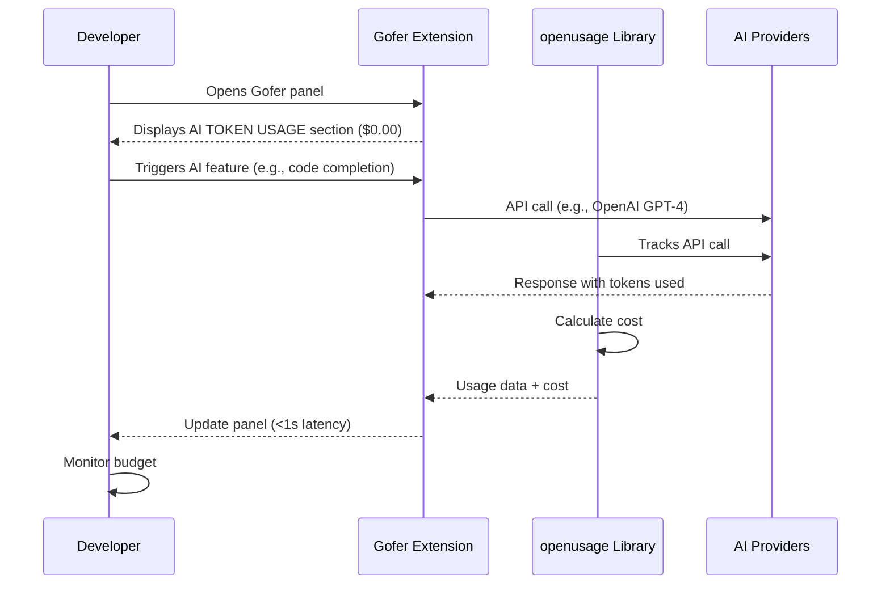

# Customer Journey: AI Usage Tracking

## Overview

Developers need real-time visibility into their AI API costs across multiple providers (OpenAI, Anthropic, etc.) directly within the VSCode Gofer panel. This replaces the current CONTEXT WINDOW section with a comprehensive AI TOKEN USAGE section powered by the openusage library.

## Actors

| ID | Name | Type | Role |
|----|------|------|------|
| developer | Developer | user | Primary user viewing AI usage data in VSCode |
| gofer | Gofer Extension | system | VSCode extension managing the panel UI |
| openusage | openusage Library | system | Tracks and calculates AI provider usage/costs |
| ai-providers | AI Providers | external | OpenAI, Anthropic, Google, etc. API services |

## Journey Steps

### Step 1: Developer opens Gofer panel

**Actor**: developer
Developer opens the Gofer sidebar panel in VSCode to view project status and AI usage.

### Step 2: Panel displays AI TOKEN USAGE section

**Actor**: gofer
The Gofer extension renders the panel with a new AI TOKEN USAGE section (replacing CONTEXT WINDOW), initially showing $0.00 or cached session data.

### Step 3: Developer triggers AI API calls

**Actor**: developer
Developer uses AI features (code completion, chat, refactoring) which trigger API calls to various AI providers.

### Step 4: openusage tracks API calls

**Actor**: openusage
The openusage library intercepts/monitors AI provider API calls, calculates token usage, and computes costs based on provider pricing.

### Step 5: Panel updates with real-time costs

**Actor**: gofer
The panel refreshes (<1 second latency) to display:
- Current session total cost
- Cost breakdown by provider (OpenAI, Anthropic, etc.)
- Token usage counts (input/output)
- Cost trends (if applicable)

### Step 6: Developer monitors budget

**Actor**: developer
Developer reviews usage data to understand AI spending patterns and stay within budget.

## Journey Diagram

## Touchpoints

| ID | Type | Description | Actors | Steps |
|----|------|-------------|--------|-------|
| gofer-panel | ui | Gofer sidebar panel in VSCode | developer, gofer | 1, 2, 5, 6 |
| ai-usage-section | ui | AI TOKEN USAGE section (replaces CONTEXT WINDOW) | developer, gofer | 2, 5 |
| ai-api-calls | api | Calls to OpenAI, Anthropic, etc. | gofer, openusage, ai | 3, 4 |
| usage-tracking | system | openusage library tracking layer | openusage | 4 |
| cost-calculation | system | openusage cost calculation engine | openusage | 4, 5 |

## Confirmation

- [x] Actors confirmed (Developer, Gofer Extension, openusage Library, AI Providers)
- [x] Steps confirmed (6-step flow from panel open to budget monitoring)
- [x] Touchpoints identified (UI panel, API calls, tracking system)
- [x] Flow validated: Developer → Gofer Panel → openusage tracking → Real-time cost display
