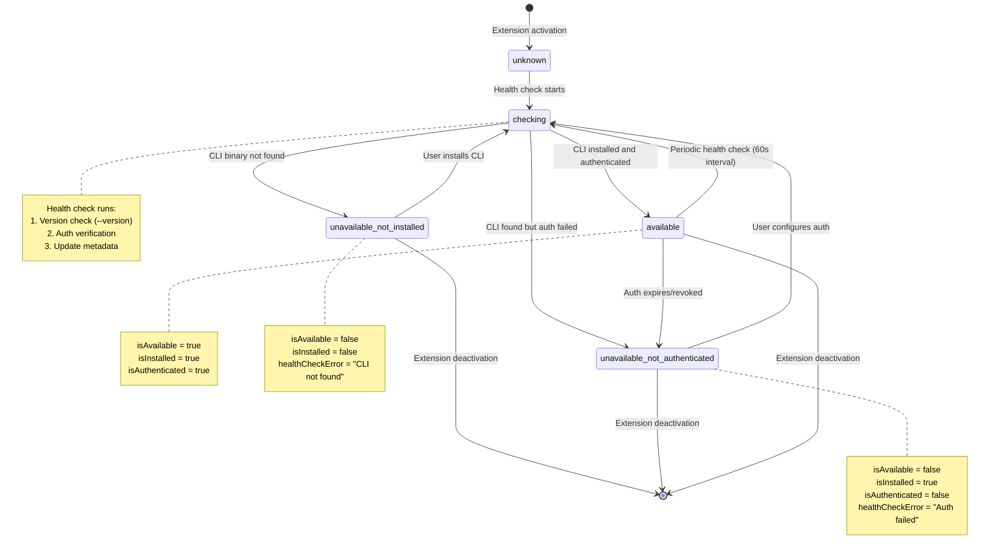
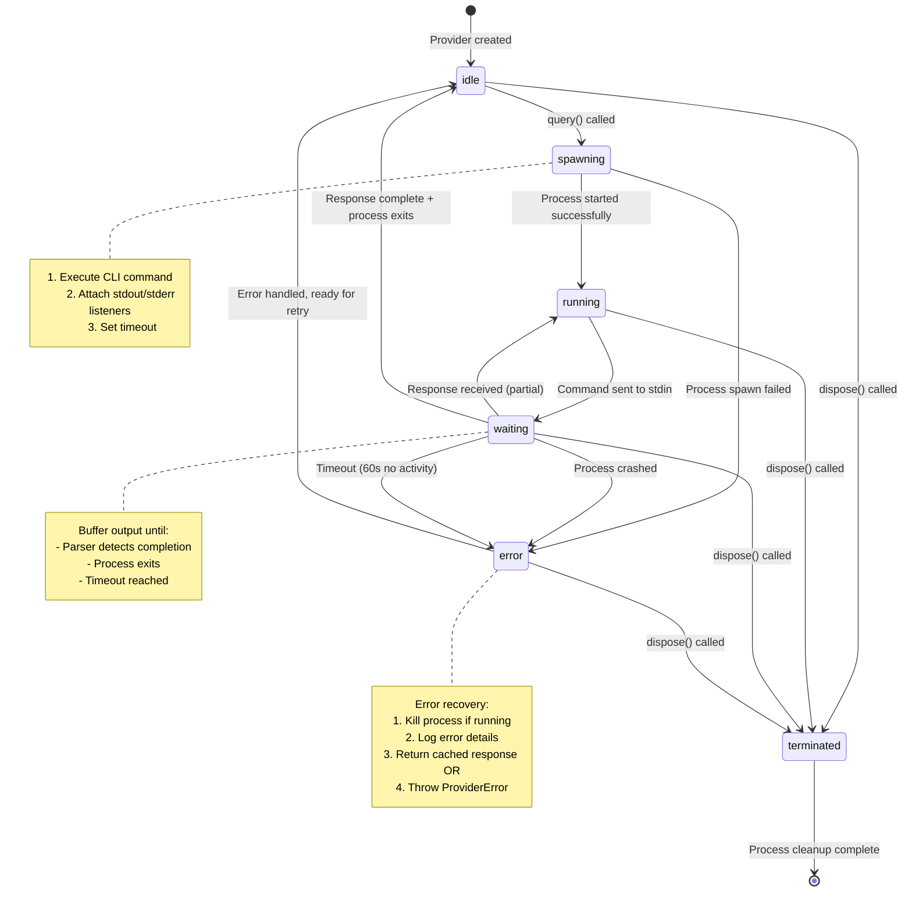

# Data Model: Multi-Provider CLI Support (Feature 027)

## Executive Summary

This document defines the data structures for Feature 027 (Multi-Provider CLI Support). The feature enables Gofer to work with multiple AI CLI providers (Claude Code CLI and Codex CLI) through a unified abstraction layer.

**Key principle**: CLI providers implement the existing `LLMProvider` interface through an **adapter pattern**, enabling transparent provider switching without changes to downstream consumers (autonomous mode, validation, pipeline stages).

---

## Entity Overview

| Entity | Purpose | Location | Created/Modified | Scope |
|--------|---------|----------|------------------|-------|
| `CLIProviderAdapter` | Base adapter for CLI providers | `extension/src/providers/cli/CLIProviderAdapter.ts` | NEW | Feature 027 |
| `ClaudeCodeCLIProvider` | Claude CLI implementation | `extension/src/providers/cli/ClaudeCodeCLIProvider.ts` | NEW | Feature 027 |
| `CodexCLIProvider` | Codex CLI implementation | `extension/src/providers/cli/CodexCLIProvider.ts` | NEW | Feature 027 |
| `CLIProviderConfig` | Provider configuration wrapper | Same as adapter files | NEW | Feature 027 |
| `CLIProviderMetadata` | Provider capability/status info | Same as adapter files | NEW | Feature 027 |
| `CLIProcessState` | CLI process lifecycle tracking | Same as adapter files | NEW | Feature 027 |
| `CLIOutputParser` | Provider-specific output parsers | Same as adapter files | NEW | Feature 027 |
| `LLMProvider` (existing) | Abstract provider contract | `extension/src/council/providers/LLMProvider.ts` | UNCHANGED | Feature 025 |
| `ProviderFactory` (existing) | Provider instantiation registry | `extension/src/council/providers/ProviderFactory.ts` | EXTENDED | Feature 025 |

**Total new entities**: 7 | **Total modified entities**: 1 | **Total unchanged contracts**: 1

---

## 1. Entity Definitions with Field Tables

### 1.1 CLIProviderConfig

**Purpose**: Encapsulates CLI provider configuration from VSCode settings and environment, following the `ConfigManager` pattern.

**Scope**: In-memory configuration object, derived from VSCode settings on demand.

| Field | Type | Required | Description |
|-------|------|----------|-------------|
| `providerId` | `'claude-cli' \| 'codex-cli'` | Yes | Unique CLI provider identifier |
| `command` | `string` | Yes | CLI command to execute (e.g., `"claude"`, `"codex"`) |
| `commandPath` | `string \| undefined` | No | Custom path to CLI binary (overrides PATH lookup) |
| `defaultModel` | `string` | Yes | Default model for queries (e.g., `"claude-opus-4-6"`, `"gpt-5.4"`) |
| `authMethod` | `'api-key' \| 'session' \| 'config-file'` | Yes | Authentication method used by CLI |
| `configPath` | `string` | Yes | Path to CLI config file (e.g., `~/.claude/config.json`) |
| `logPath` | `string` | Yes | Path to CLI usage logs (e.g., `~/.claude/history.jsonl`) |
| `versionCheckArgs` | `string[]` | Yes | Arguments for version check (e.g., `["--version"]`) |
| `minVersion` | `string` | Yes | Minimum required CLI version (e.g., `"1.0.0"`) |
| `capabilities` | `CLIProviderCapabilities` | Yes | Provider-specific feature support |

**Validation Rules**:
- `command` must be a valid executable name or absolute path
- `commandPath`, if provided, must point to an executable file
- `minVersion` must follow semver format (x.y.z)
- `configPath` and `logPath` must expand `~` to user home directory

**Usage Pattern**:
```typescript
const config = CLIProviderConfig.forProvider('claude-cli', configManager);
if (await config.isAvailable()) {
  // Create provider instance
}
```

---

### 1.2 CLIProviderCapabilities

**Purpose**: Declare provider-specific features for graceful degradation and feature detection.

| Field | Type | Required | Description |
|-------|------|----------|-------------|
| `streaming` | `boolean` | Yes | Supports streaming responses via stdout |
| `fileOperations` | `boolean` | Yes | Supports file read/write/edit operations |
| `toolUse` | `boolean` | Yes | Supports external tool invocation |
| `mcpServers` | `boolean` | Yes | Supports MCP server integration (Claude-specific) |
| `webSearch` | `boolean` | Yes | Supports web search queries (Codex-specific) |
| `multiTurn` | `boolean` | Yes | Supports conversation history management |
| `contextWindow` | `number` | Yes | Maximum context window size in tokens |

**Capability Matrix** (from research.md):

| Capability | Claude Code CLI | Codex CLI | Notes |
|-----------|----------------|-----------|-------|
| `streaming` | `true` | `true` | Both support stdout streaming |
| `fileOperations` | `true` | `true` | Common capability |
| `toolUse` | `true` | `true` | Both support tool invocation |
| `mcpServers` | `true` | `false` | Claude-specific (FR-014) |
| `webSearch` | `false` | `true` | Codex-specific (FR-015) |
| `multiTurn` | `true` | `true` | Both support conversation history |
| `contextWindow` | `200000` | `128000` | Model-specific limits |

---

### 1.3 CLIProviderMetadata

**Purpose**: Runtime status and availability information for a CLI provider.

| Field | Type | Required | Description |
|-------|------|----------|-------------|
| `providerId` | `'claude-cli' \| 'codex-cli'` | Yes | Provider identifier |
| `name` | `string` | Yes | Human-readable name (e.g., `"Claude Code CLI"`) |
| `installedVersion` | `string \| undefined` | No | Detected CLI version (undefined if not installed) |
| `isInstalled` | `boolean` | Yes | CLI binary is available on system PATH or commandPath |
| `isAuthenticated` | `boolean` | Yes | CLI authentication is configured and valid |
| `isAvailable` | `boolean` | Yes | CLI is ready to use (installed + authenticated) |
| `lastHealthCheck` | `number` | Yes | Unix timestamp (ms) of last health check |
| `healthCheckError` | `string \| undefined` | No | Error message from last health check (if failed) |
| `capabilities` | `CLIProviderCapabilities` | Yes | Provider-specific features |

**Validation Rules**:
- `isAvailable` = `isInstalled && isAuthenticated`
- `installedVersion` must match semver format if defined
- `lastHealthCheck` must be within last 60 seconds for fresh data
- If `healthCheckError` is set, `isAvailable` must be `false`

**State Transitions**: See section 4.1 (Provider Availability States)

---

### 1.4 CLIProcessState

**Purpose**: Track lifecycle and status of spawned CLI processes.

| Field | Type | Required | Description |
|-------|------|----------|-------------|
| `processId` | `number \| undefined` | No | OS process ID (undefined if not running) |
| `status` | `CLIProcessStatus` | Yes | Current process status (see state machine) |
| `pty` | `IPty \| undefined` | No | Node-pty terminal instance (if active) |
| `commandQueue` | `string[]` | Yes | Queued commands waiting to be sent to stdin |
| `outputBuffer` | `string` | Yes | Accumulated stdout/stderr output |
| `startedAt` | `number \| undefined` | No | Unix timestamp (ms) when process started |
| `lastActivityAt` | `number` | Yes | Unix timestamp (ms) of last I/O activity |
| `exitCode` | `number \| undefined` | No | Process exit code (undefined if still running) |
| `error` | `ProviderError \| undefined` | No | Error object if process failed |

**CLIProcessStatus Enum**:
```typescript
type CLIProcessStatus =
  | 'idle'          // Not running, ready to start
  | 'spawning'      // Process creation in progress
  | 'running'       // Active and accepting commands
  | 'waiting'       // Waiting for response to complete
  | 'error'         // Process failed or crashed
  | 'terminated';   // Process exited gracefully
```

**Validation Rules**:
- If `status === 'running'`, `processId` and `pty` must be defined
- If `status === 'terminated'`, `exitCode` must be defined
- If `status === 'error'`, `error` must be defined
- `lastActivityAt` must be updated on every stdin write or stdout read
- If no activity for >60 seconds, consider process hung

**State Transitions**: See section 4.2 (CLI Process Lifecycle)

---

### 1.5 CLIOutputParser

**Purpose**: Provider-specific logic for parsing CLI stdout/stderr into structured responses.

**Interface Contract**:
```typescript
interface CLIOutputParser {
  parseResponse(output: string): QueryResponse;
  parseTokenUsage(output: string): { inputTokens: number; outputTokens: number };
  parseError(output: string): ProviderError;
  isResponseComplete(output: string): boolean;
}
```

**Claude Code CLI Parser**:

| Method | Input | Output | Description |
|--------|-------|--------|-------------|
| `parseResponse` | Markdown output | `QueryResponse` | Extracts text from markdown blocks |
| `parseTokenUsage` | Output with usage footer | `{ inputTokens, outputTokens }` | Parses usage from footer annotations |
| `parseError` | Error message text | `ProviderError` | Maps error text to ProviderError type |
| `isResponseComplete` | Partial output | `boolean` | Detects `---` separator or prompt return |

**Claude Output Format** (from research.md):
```markdown
<response text>

---
Usage: 12,500 input tokens, 3,400 output tokens
```

**Codex CLI Parser**:

| Method | Input | Output | Description |
|--------|-------|--------|-------------|
| `parseResponse` | TUI-formatted output | `QueryResponse` | Extracts content from TUI structure |
| `parseTokenUsage` | JSON status line | `{ inputTokens, outputTokens }` | Parses JSON metadata |
| `parseError` | Exit code + stderr | `ProviderError` | Maps exit codes to error types |
| `isResponseComplete` | Partial output | `boolean` | Detects JSON close bracket or prompt |

**Codex Output Format** (from research.md):
```json
{
  "type": "response",
  "content": "<response text>",
  "usage": { "input_tokens": 8500, "output_tokens": 2100 }
}
```

**Validation Rules**:
- `parseResponse` must handle incomplete output gracefully (buffer until complete)
- `parseTokenUsage` must return `{ inputTokens: 0, outputTokens: 0 }` if parsing fails
- `parseError` must never throw exceptions (return generic error if unparseable)

---

### 1.6 CLIProviderAdapter (Base Class)

**Purpose**: Abstract base class implementing `LLMProvider` interface with shared CLI logic.

**Abstract Methods** (must be implemented by subclasses):
```typescript
abstract getParser(): CLIOutputParser;
abstract getConfig(): CLIProviderConfig;
abstract formatPrompt(request: QueryRequest): string;
abstract formatSystemPrompt(systemPrompt: string): string;
```

**Concrete Methods** (shared implementation):
```typescript
async query(request: QueryRequest): Promise<QueryResponse>;
async healthCheck(): Promise<boolean>;
isAvailable(): boolean;
isRateLimited(): boolean;
```

**Implementation Strategy**:
- `query()` spawns CLI process via TerminalManager, sends formatted prompt, captures output
- `healthCheck()` runs version check and auth verification
- `isAvailable()` returns cached metadata status
- `isRateLimited()` checks exit codes and error messages for rate limit signals

---

### 1.7 ClaudeCodeCLIProvider

**Purpose**: Claude Code CLI implementation of `LLMProvider` interface.

| Field | Type | Required | Description |
|-------|------|----------|-------------|
| `id` | `'claude-cli'` | Yes | Provider ID (from LLMProvider interface) |
| `name` | `'Claude Code CLI'` | Yes | Human-readable name |
| `model` | `string` | Yes | Current model (e.g., `"claude-opus-4-6"`) |
| `status` | `ProviderStatus` | Yes | Provider status (from LLMProvider interface) |
| `config` | `CLIProviderConfig` | Yes | Configuration instance |
| `metadata` | `CLIProviderMetadata` | Yes | Runtime metadata |
| `processState` | `CLIProcessState` | Yes | Process tracking |
| `parser` | `ClaudeCodeOutputParser` | Yes | Output parser instance |

**Specific Behavior**:
- Command format: `claude --prompt "<prompt>" --model <model>`
- Authentication: Checks `ANTHROPIC_API_KEY` env var or `~/.claude/config.json`
- Output parsing: Markdown with `---` separator and usage footer
- MCP servers: Available (capability flag `mcpServers: true`)
- Log format: JSONL at `~/.claude/history.jsonl`

---

### 1.8 CodexCLIProvider

**Purpose**: Codex CLI implementation of `LLMProvider` interface.

| Field | Type | Required | Description |
|-------|------|----------|-------------|
| `id` | `'codex-cli'` | Yes | Provider ID |
| `name` | `'Codex CLI'` | Yes | Human-readable name |
| `model` | `string` | Yes | Current model (e.g., `"gpt-5.4"`) |
| `status` | `ProviderStatus` | Yes | Provider status |
| `config` | `CLIProviderConfig` | Yes | Configuration instance |
| `metadata` | `CLIProviderMetadata` | Yes | Runtime metadata |
| `processState` | `CLIProcessState` | Yes | Process tracking |
| `parser` | `CodexOutputParser` | Yes | Output parser instance |

**Specific Behavior**:
- Command format: `codex exec "<prompt>"` or `codex` (TUI mode)
- Authentication: ChatGPT session or `OPENAI_API_KEY` env var
- Output parsing: JSON response with structured fields
- Web search: Available (capability flag `webSearch: true`)
- Log format: JSON at `~/.codex/history.json`

---

## 2. Relationships Between Entities

### 2.1 Entity Relationship Diagram

```
┌─────────────────────────────────────────────────────────────┐
│ ProviderFactory (existing)                                   │
│ - createProvider(id, config)                                 │
│ - registerProvider(id, constructor)                          │
└─────────────────────────────────────────────────────────────┘
                          ↓ creates
        ┌─────────────────┴────────────────┐
        ↓                                   ↓
┌────────────────────┐           ┌────────────────────┐
│ ClaudeCodeCLI      │           │ CodexCLIProvider   │
│ Provider           │           │                    │
└────────────────────┘           └────────────────────┘
        ↓ extends                        ↓ extends
        └─────────────────┬──────────────┘
                          ↓
        ┌────────────────────────────────┐
        │ CLIProviderAdapter (abstract)  │
        │ - query()                      │
        │ - healthCheck()                │
        └────────────────────────────────┘
                ↓ implements
        ┌────────────────────────────────┐
        │ LLMProvider (interface)        │
        │ - query(request)               │
        │ - healthCheck()                │
        │ - isAvailable()                │
        └────────────────────────────────┘
                          ↑ used by
        ┌─────────────────┴────────────────┐
        ↓                                   ↓
┌────────────────────┐           ┌────────────────────┐
│ AutonomousDriver   │           │ Validation Agents  │
│ (autonomous mode)  │           │ (6 validation)     │
└────────────────────┘           └────────────────────┘

┌─────────────────────────────────────────────────────────────┐
│ Component Composition (within CLI Provider)                  │
└─────────────────────────────────────────────────────────────┘

  CLIProviderAdapter
         │
         ├─ has-a → CLIProviderConfig
         │            ├─ contains → CLIProviderCapabilities
         │
         ├─ has-a → CLIProviderMetadata
         │            ├─ contains → CLIProviderCapabilities
         │
         ├─ has-a → CLIProcessState
         │            ├─ contains → IPty (from TerminalManager)
         │            └─ contains → ProviderError (on failure)
         │
         └─ has-a → CLIOutputParser
                      ├─ parses → QueryResponse
                      └─ parses → ProviderError
```

### 2.2 Dependency Graph

| Consumer | Depends On | Cardinality | Description |
|----------|-----------|-------------|-------------|
| `ProviderFactory` | `ClaudeCodeCLIProvider` | 1:1 | Factory creates instances on demand |
| `ProviderFactory` | `CodexCLIProvider` | 1:1 | Factory creates instances on demand |
| `ClaudeCodeCLIProvider` | `CLIProviderAdapter` | 1:1 | Extends base adapter |
| `CodexCLIProvider` | `CLIProviderAdapter` | 1:1 | Extends base adapter |
| `CLIProviderAdapter` | `LLMProvider` | 1:1 | Implements interface contract |
| `CLIProviderAdapter` | `CLIProviderConfig` | 1:1 | Configuration composition |
| `CLIProviderAdapter` | `CLIProviderMetadata` | 1:1 | Metadata composition |
| `CLIProviderAdapter` | `CLIProcessState` | 1:1 | Process tracking composition |
| `CLIProviderAdapter` | `CLIOutputParser` | 1:1 | Output parsing composition |
| `CLIProviderAdapter` | `TerminalManager` | 1:1 | Terminal spawning (existing service) |
| `AutonomousDriver` | `LLMProvider` | 1:1 | Receives provider via DI |
| `ValidationAgents` | `LLMProvider` | 1:many | Each agent uses provider interface |

**Relationship Count**: 12 relationships (7 internal, 5 external)

---

## 3. Validation Rules for Each Entity

### 3.1 CLIProviderConfig Validation

```typescript
function validateCLIProviderConfig(config: CLIProviderConfig): ValidationResult {
  const errors: string[] = [];

  // Command validation
  if (!config.command || config.command.trim().length === 0) {
    errors.push('Command must be a non-empty string');
  }

  // Version validation
  if (!/^\d+\.\d+\.\d+$/.test(config.minVersion)) {
    errors.push('minVersion must follow semver format (x.y.z)');
  }

  // Path validation
  if (config.commandPath && !isExecutable(config.commandPath)) {
    errors.push(`commandPath ${config.commandPath} is not executable`);
  }

  // Auth method validation
  const validAuthMethods = ['api-key', 'session', 'config-file'];
  if (!validAuthMethods.includes(config.authMethod)) {
    errors.push(`authMethod must be one of: ${validAuthMethods.join(', ')}`);
  }

  return { isValid: errors.length === 0, errors };
}
```

### 3.2 CLIProviderMetadata Validation

```typescript
function validateCLIProviderMetadata(metadata: CLIProviderMetadata): ValidationResult {
  const errors: string[] = [];

  // Availability consistency
  if (metadata.isAvailable && (!metadata.isInstalled || !metadata.isAuthenticated)) {
    errors.push('isAvailable requires both isInstalled and isAuthenticated to be true');
  }

  // Version format
  if (metadata.installedVersion && !/^\d+\.\d+\.\d+/.test(metadata.installedVersion)) {
    errors.push('installedVersion must follow semver format');
  }

  // Health check freshness
  const now = Date.now();
  if (now - metadata.lastHealthCheck > 60000) {
    errors.push('Health check data is stale (>60s old)');
  }

  // Error consistency
  if (metadata.healthCheckError && metadata.isAvailable) {
    errors.push('Cannot have healthCheckError and isAvailable=true');
  }

  return { isValid: errors.length === 0, errors };
}
```

### 3.3 CLIProcessState Validation

```typescript
function validateCLIProcessState(state: CLIProcessState): ValidationResult {
  const errors: string[] = [];

  // Running state requires process ID and pty
  if (state.status === 'running' && (!state.processId || !state.pty)) {
    errors.push('Running status requires processId and pty to be defined');
  }

  // Terminated state requires exit code
  if (state.status === 'terminated' && state.exitCode === undefined) {
    errors.push('Terminated status requires exitCode to be defined');
  }

  // Error state requires error object
  if (state.status === 'error' && !state.error) {
    errors.push('Error status requires error object to be defined');
  }

  // Activity timeout check
  const now = Date.now();
  if (state.status === 'running' && now - state.lastActivityAt > 60000) {
    errors.push('Process appears hung (no activity for >60s)');
  }

  return { isValid: errors.length === 0, errors };
}
```

---

## 4. State Transition Diagrams

### 4.1 Provider Availability States



**State Definitions**:

| State | isAvailable | isInstalled | isAuthenticated | Description |
|-------|------------|------------|----------------|-------------|
| `unknown` | `false` | `false` | `false` | Initial state before health check |
| `checking` | `false` | `false` | `false` | Health check in progress |
| `unavailable_not_installed` | `false` | `false` | `false` | CLI binary not found on PATH |
| `unavailable_not_authenticated` | `false` | `true` | `false` | CLI installed but auth missing |
| `available` | `true` | `true` | `true` | Ready to use |

**Transition Rules**:
- `unknown → checking`: Triggered on extension activation or manual refresh
- `checking → unavailable_not_installed`: Version check command fails (exit code 127 or ENOENT)
- `checking → unavailable_not_authenticated`: Version succeeds but auth check fails (exit code 1 or auth error message)
- `checking → available`: Both version and auth checks succeed
- `available → checking`: Triggered by periodic health check (60s interval) or config change
- `unavailable_* → checking`: Triggered when user manually retries or config changes

---

### 4.2 CLI Process Lifecycle



**State Definitions**:

| State | processId | pty | exitCode | error | Description |
|-------|----------|-----|----------|-------|-------------|
| `idle` | `undefined` | `undefined` | `undefined` | `undefined` | No active process |
| `spawning` | `undefined` | `defined` | `undefined` | `undefined` | Creating process |
| `running` | `defined` | `defined` | `undefined` | `undefined` | Active, ready for commands |
| `waiting` | `defined` | `defined` | `undefined` | `undefined` | Waiting for response |
| `error` | `defined/undefined` | `defined/undefined` | `defined/undefined` | `defined` | Process failed |
| `terminated` | `defined` | `undefined` | `defined` | `undefined` | Process exited gracefully |

**Transition Rules**:
- `idle → spawning`: Triggered when `query()` is called
- `spawning → running`: Process starts successfully (processId assigned)
- `spawning → error`: Spawn fails (e.g., command not found, permission denied)
- `running → waiting`: Command sent to stdin, awaiting response
- `waiting → running`: Partial response received but not complete (parser returns false from `isResponseComplete`)
- `waiting → idle`: Response complete AND process exits cleanly (exit code 0)
- `waiting → error`: Process crashes (exit code non-zero) OR timeout (60s)
- `error → idle`: Error handled, provider ready for next query
- Any state → `terminated`: `dispose()` called (cleanup method)

---

## 5. Database Considerations

### 5.1 VSCode Settings Storage

**Provider Selection**:
```json
{
  "gofer.cliProvider": {
    "type": "string",
    "enum": ["claude", "codex", "auto"],
    "enumDescriptions": [
      "Use Claude Code CLI",
      "Use Codex CLI",
      "Auto-detect based on installed CLI tools"
    ],
    "default": "auto",
    "description": "AI CLI provider for Gofer autonomous mode"
  }
}
```

**Custom CLI Paths**:
```json
{
  "gofer.claudeCodeCommand": {
    "type": "string",
    "default": "claude",
    "description": "Path to Claude Code CLI binary (default: 'claude' from PATH)"
  },
  "gofer.codexCommand": {
    "type": "string",
    "default": "codex",
    "description": "Path to Codex CLI binary (default: 'codex' from PATH)"
  }
}
```

**Storage Scope**: User or workspace settings (VSCode `scope: 'resource'`)

**Access Pattern**: Read via `ConfigManager.getPreferredCLIProvider()`, `ConfigManager.getClaudeCodeCommand()`, `ConfigManager.getCodexCommand()`

---

### 5.2 Provider Metadata Caching

**Cache Location**: In-memory only (no disk persistence)

**Cache Structure**:
```typescript
class ProviderMetadataCache {
  private cache: Map<ProviderId, CLIProviderMetadata> = new Map();
  private CACHE_TTL_MS = 60000; // 60 seconds

  get(providerId: ProviderId): CLIProviderMetadata | undefined {
    const entry = this.cache.get(providerId);
    if (!entry) return undefined;

    const age = Date.now() - entry.lastHealthCheck;
    if (age > this.CACHE_TTL_MS) {
      this.cache.delete(providerId); // Stale, remove
      return undefined;
    }

    return entry;
  }

  set(providerId: ProviderId, metadata: CLIProviderMetadata): void {
    this.cache.set(providerId, metadata);
  }
}
```

**Cache Invalidation**:
- Automatic: After 60 seconds (health check TTL)
- Manual: On VSCode settings change (`onDidChangeConfiguration`)
- Manual: On user-triggered refresh command

---

### 5.3 CLI Usage Logs (Existing Files)

**Claude Code CLI**:
- **Format**: JSONL (JSON Lines)
- **Location**: `~/.claude/history.jsonl`
- **Parser**: `ClaudeCodeUsageAdapter` (existing, from Feature 026)
- **Schema**:
  ```json
  {
    "timestamp": "2026-03-16T10:30:00Z",
    "model": "claude-opus-4-6",
    "input_tokens": 12500,
    "output_tokens": 3400,
    "cost_usd": 0.39
  }
  ```

**Codex CLI**:
- **Format**: JSON (single object with array)
- **Location**: `~/.codex/history.json`
- **Parser**: `CodexUsageAdapter` (NEW, follows ClaudeCodeUsageAdapter pattern)
- **Schema**:
  ```json
  {
    "sessions": [
      {
        "timestamp": "2026-03-16T10:30:00Z",
        "model": "gpt-5.4",
        "input_tokens": 8500,
        "output_tokens": 2100,
        "cost_usd": 1.85
      }
    ]
  }
  ```

**Usage Tracking Integration** (from spec.md FR-017 to FR-020):
- `UsageLogger` extended with CLI log adapters
- `AIUsagePanel` displays provider name alongside token counts
- Token usage tracked separately per provider
- Export functionality includes provider breakdown

---

## 6. Entity-to-UserStory Mapping

| Entity | User Story | Requirements | Description |
|--------|-----------|-------------|-------------|
| **CLIProviderConfig** | US1 (Provider Selection) | FR-002 | Stores user's provider choice from dropdown |
| **CLIProviderConfig** | US3 (Auto-Detection) | FR-003 | Enables auto-detection logic via config |
| **CLIProviderMetadata** | US3 (Auto-Detection) | FR-011, FR-012 | Provides availability status for error messages |
| **CLIProviderMetadata** | US1 (Provider Selection) | FR-006 | Displays status indicator in settings UI |
| **CLIProviderCapabilities** | US4 (Feature Degradation) | FR-014, FR-015, FR-016 | Declares provider-specific features (MCP, web search) |
| **CLIProcessState** | US2 (Transparent Switching) | FR-004, FR-013 | Tracks process for immediate provider changes |
| **CLIOutputParser** | US2 (Transparent Switching) | FR-007, FR-008, FR-009, FR-010 | Enables identical behavior across providers |
| **ClaudeCodeCLIProvider** | US2 (Transparent Switching) | FR-007 to FR-010 | Implements provider abstraction for Claude |
| **CodexCLIProvider** | US2 (Transparent Switching) | FR-007 to FR-010 | Implements provider abstraction for Codex |
| **CLIProviderAdapter** | US2 (Transparent Switching) | FR-001, FR-005 | Base abstraction for provider-agnostic workflows |
| **CLIProviderConfig.logPath** | US5 (Usage Tracking) | FR-017, FR-018, FR-019 | Points to usage logs for parsing |
| **CLIProviderMetadata.healthCheckError** | US3 (Auto-Detection) | FR-011, FR-012 | Provides actionable error messages |

**Coverage Summary**:
- **User Story 1** (Provider Selection): 3 entities (Config, Metadata, Adapter)
- **User Story 2** (Transparent Switching): 7 entities (all core abstractions)
- **User Story 3** (Auto-Detection): 3 entities (Config, Metadata, Adapter)
- **User Story 4** (Feature Degradation): 2 entities (Capabilities, Metadata)
- **User Story 5** (Usage Tracking): 2 entities (Config, OutputParser)

---

## 7. TypeScript Interface Definitions

### 7.1 Core Configuration Types

```typescript
/**
 * CLI provider configuration from VSCode settings
 */
interface CLIProviderConfig {
  providerId: 'claude-cli' | 'codex-cli';
  command: string;
  commandPath?: string;
  defaultModel: string;
  authMethod: 'api-key' | 'session' | 'config-file';
  configPath: string;
  logPath: string;
  versionCheckArgs: string[];
  minVersion: string;
  capabilities: CLIProviderCapabilities;
}

/**
 * Provider capability flags for feature detection
 */
interface CLIProviderCapabilities {
  streaming: boolean;
  fileOperations: boolean;
  toolUse: boolean;
  mcpServers: boolean;
  webSearch: boolean;
  multiTurn: boolean;
  contextWindow: number;
}

/**
 * Static factory for CLI provider configurations
 */
namespace CLIProviderConfig {
  export function forProvider(
    providerId: 'claude-cli' | 'codex-cli',
    configManager: ConfigManager
  ): CLIProviderConfig {
    if (providerId === 'claude-cli') {
      return {
        providerId: 'claude-cli',
        command: configManager.getClaudeCodeCommand() || 'claude',
        defaultModel: 'claude-opus-4-6',
        authMethod: 'api-key',
        configPath: '~/.claude/config.json',
        logPath: '~/.claude/history.jsonl',
        versionCheckArgs: ['--version'],
        minVersion: '1.0.0',
        capabilities: {
          streaming: true,
          fileOperations: true,
          toolUse: true,
          mcpServers: true,
          webSearch: false,
          multiTurn: true,
          contextWindow: 200000,
        },
      };
    } else {
      return {
        providerId: 'codex-cli',
        command: configManager.getCodexCommand() || 'codex',
        defaultModel: 'gpt-5.4',
        authMethod: 'session',
        configPath: '~/.codex/config.json',
        logPath: '~/.codex/history.json',
        versionCheckArgs: ['--version'],
        minVersion: '2.0.0',
        capabilities: {
          streaming: true,
          fileOperations: true,
          toolUse: true,
          mcpServers: false,
          webSearch: true,
          multiTurn: true,
          contextWindow: 128000,
        },
      };
    }
  }
}
```

### 7.2 Metadata and State Types

```typescript
/**
 * Runtime provider metadata
 */
interface CLIProviderMetadata {
  providerId: 'claude-cli' | 'codex-cli';
  name: string;
  installedVersion?: string;
  isInstalled: boolean;
  isAuthenticated: boolean;
  isAvailable: boolean;
  lastHealthCheck: number;
  healthCheckError?: string;
  capabilities: CLIProviderCapabilities;
}

/**
 * CLI process lifecycle state
 */
interface CLIProcessState {
  processId?: number;
  status: CLIProcessStatus;
  pty?: IPty;
  commandQueue: string[];
  outputBuffer: string;
  startedAt?: number;
  lastActivityAt: number;
  exitCode?: number;
  error?: ProviderError;
}

/**
 * Process status enum
 */
type CLIProcessStatus =
  | 'idle'
  | 'spawning'
  | 'running'
  | 'waiting'
  | 'error'
  | 'terminated';
```

### 7.3 Parser Interface

```typescript
/**
 * Output parser for CLI responses
 */
interface CLIOutputParser {
  parseResponse(output: string): QueryResponse;
  parseTokenUsage(output: string): { inputTokens: number; outputTokens: number };
  parseError(output: string): ProviderError;
  isResponseComplete(output: string): boolean;
}

/**
 * Claude Code CLI parser implementation
 */
class ClaudeCodeOutputParser implements CLIOutputParser {
  parseResponse(output: string): QueryResponse {
    // Extract text before "---" separator
    const textMatch = output.match(/^([\s\S]*?)\n---/);
    const text = textMatch ? textMatch[1].trim() : output.trim();

    const usage = this.parseTokenUsage(output);

    return {
      text,
      inputTokens: usage.inputTokens,
      outputTokens: usage.outputTokens,
      model: 'claude-opus-4-6', // From config
      providerId: 'claude-cli',
    };
  }

  parseTokenUsage(output: string): { inputTokens: number; outputTokens: number } {
    // Parse footer: "Usage: 12,500 input tokens, 3,400 output tokens"
    const usageMatch = output.match(/Usage: ([\d,]+) input tokens, ([\d,]+) output tokens/);
    if (!usageMatch) {
      return { inputTokens: 0, outputTokens: 0 };
    }

    return {
      inputTokens: parseInt(usageMatch[1].replace(/,/g, ''), 10),
      outputTokens: parseInt(usageMatch[2].replace(/,/g, ''), 10),
    };
  }

  parseError(output: string): ProviderError {
    // Map common error patterns to ProviderError types
    if (output.includes('authentication') || output.includes('API key')) {
      return new ProviderError('Authentication failed', 'claude-cli', true);
    }
    if (output.includes('rate limit')) {
      return new ProviderError('Rate limited', 'claude-cli', true);
    }
    return new ProviderError('CLI error: ' + output.slice(0, 200), 'claude-cli', false);
  }

  isResponseComplete(output: string): boolean {
    // Response complete if contains separator or prompt return
    return output.includes('\n---') || output.endsWith('> ');
  }
}

/**
 * Codex CLI parser implementation
 */
class CodexOutputParser implements CLIOutputParser {
  parseResponse(output: string): QueryResponse {
    try {
      const json = JSON.parse(output);
      return {
        text: json.content,
        inputTokens: json.usage?.input_tokens || 0,
        outputTokens: json.usage?.output_tokens || 0,
        model: json.model || 'gpt-5.4',
        providerId: 'codex-cli',
      };
    } catch (err) {
      throw new ProviderError('Failed to parse Codex response', 'codex-cli', false);
    }
  }

  parseTokenUsage(output: string): { inputTokens: number; outputTokens: number } {
    try {
      const json = JSON.parse(output);
      return {
        inputTokens: json.usage?.input_tokens || 0,
        outputTokens: json.usage?.output_tokens || 0,
      };
    } catch {
      return { inputTokens: 0, outputTokens: 0 };
    }
  }

  parseError(output: string): ProviderError {
    if (output.includes('authentication') || output.includes('login')) {
      return new ProviderError('Not authenticated. Run: codex login', 'codex-cli', true);
    }
    if (output.includes('rate limit')) {
      return new ProviderError('Rate limited', 'codex-cli', true);
    }
    return new ProviderError('Codex error: ' + output.slice(0, 200), 'codex-cli', false);
  }

  isResponseComplete(output: string): boolean {
    // Check for complete JSON object
    return output.trim().endsWith('}');
  }
}
```

---

## 8. Summary Statistics

| Aspect | Count |
|--------|-------|
| **New Entity Definitions** | 7 (Config, Capabilities, Metadata, ProcessState, Parser, ClaudeCLI, CodexCLI) |
| **Extended Existing Classes** | 1 (ProviderFactory) |
| **Unchanged Contracts** | 1 (LLMProvider interface) |
| **Total Relationships** | 12 (7 internal composition, 5 external dependencies) |
| **Entities with State Machines** | 2 (CLIProviderMetadata: availability states, CLIProcessState: lifecycle states) |
| **New Configuration Settings** | 3 (gofer.cliProvider, gofer.claudeCodeCommand, gofer.codexCommand) |
| **Provider-Specific Parsers** | 2 (ClaudeCodeOutputParser, CodexOutputParser) |
| **User Stories Covered** | 5 (all user stories from spec.md) |

**Key Data Flow**:
- VSCode Settings → ConfigManager → CLIProviderConfig → CLIProviderAdapter → LLMProvider Interface → Downstream Consumers

**Principles**:
- ✅ Adapter pattern bridges CLI workflow to API-like interface
- ✅ No changes to existing LLMProvider interface (backward compatible)
- ✅ Provider-agnostic consumers (AutonomousDriver, ValidationAgents use same interface)
- ✅ Graceful degradation for provider-specific features (capability flags)
- ✅ In-memory metadata caching with 60s TTL
- ✅ Separate parsers per provider (clean separation of concerns)

---

## 9. Implementation Checklist

### 9.1 Type Definitions

- [ ] `CLIProviderConfig` interface + factory
- [ ] `CLIProviderCapabilities` interface
- [ ] `CLIProviderMetadata` interface
- [ ] `CLIProcessState` interface + `CLIProcessStatus` enum
- [ ] `CLIOutputParser` interface
- [ ] `ClaudeCodeOutputParser` implementation
- [ ] `CodexOutputParser` implementation

### 9.2 Core Abstractions

- [ ] `CLIProviderAdapter` abstract base class
  - [ ] `query()` method (spawns CLI, sends prompt, captures output)
  - [ ] `healthCheck()` method (version + auth verification)
  - [ ] `isAvailable()` method (cached metadata check)
  - [ ] `isRateLimited()` method (error/exit code detection)

### 9.3 Provider Implementations

- [ ] `ClaudeCodeCLIProvider` class (extends CLIProviderAdapter)
  - [ ] `getConfig()` implementation
  - [ ] `getParser()` implementation
  - [ ] `formatPrompt()` implementation
  - [ ] `formatSystemPrompt()` implementation

- [ ] `CodexCLIProvider` class (extends CLIProviderAdapter)
  - [ ] `getConfig()` implementation
  - [ ] `getParser()` implementation
  - [ ] `formatPrompt()` implementation
  - [ ] `formatSystemPrompt()` implementation

### 9.4 Factory Integration

- [ ] Extend `ProviderFactory` with CLI provider registration
- [ ] Add `createCLIProvider()` method
- [ ] Register `ClaudeCodeCLIProvider` and `CodexCLIProvider`

### 9.5 Configuration

- [ ] Add `gofer.cliProvider` dropdown to `package.json`
- [ ] Add `gofer.claudeCodeCommand` string setting
- [ ] Add `gofer.codexCommand` string setting
- [ ] Extend `ConfigManager` with `getPreferredCLIProvider()` getter
- [ ] Extend `ConfigManager` with `getCodexCommand()` getter

### 9.6 Usage Tracking (Feature 027 Extension)

- [ ] `CodexUsageAdapter` class (parses `~/.codex/history.json`)
- [ ] Update `UsageLogger` to support CLI log adapters
- [ ] Update `AIUsagePanel` to display provider name

---

## 10. Testing Data Shapes

### 10.1 Example: Claude Code CLI Response

**Input** (CLI stdout):
```markdown
Here is a detailed analysis of the data model:

The data structures follow consistent patterns...

---
Usage: 12,500 input tokens, 3,400 output tokens
```

**Parsed Output** (QueryResponse):
```typescript
{
  text: 'Here is a detailed analysis of the data model:\n\nThe data structures follow consistent patterns...',
  inputTokens: 12500,
  outputTokens: 3400,
  model: 'claude-opus-4-6',
  providerId: 'claude-cli'
}
```

### 10.2 Example: Codex CLI Response

**Input** (CLI stdout):
```json
{
  "type": "response",
  "content": "The data model uses a clear entity-relationship structure...",
  "model": "gpt-5.4",
  "usage": {
    "input_tokens": 8500,
    "output_tokens": 2100
  }
}
```

**Parsed Output** (QueryResponse):
```typescript
{
  text: 'The data model uses a clear entity-relationship structure...',
  inputTokens: 8500,
  outputTokens: 2100,
  model: 'gpt-5.4',
  providerId: 'codex-cli'
}
```

### 10.3 Example: Health Check Metadata

**Claude Code CLI** (available):
```typescript
{
  providerId: 'claude-cli',
  name: 'Claude Code CLI',
  installedVersion: '1.2.0',
  isInstalled: true,
  isAuthenticated: true,
  isAvailable: true,
  lastHealthCheck: 1710586200000,
  healthCheckError: undefined,
  capabilities: {
    streaming: true,
    fileOperations: true,
    toolUse: true,
    mcpServers: true,
    webSearch: false,
    multiTurn: true,
    contextWindow: 200000
  }
}
```

**Codex CLI** (not authenticated):
```typescript
{
  providerId: 'codex-cli',
  name: 'Codex CLI',
  installedVersion: '2.1.0',
  isInstalled: true,
  isAuthenticated: false,
  isAvailable: false,
  lastHealthCheck: 1710586200000,
  healthCheckError: 'Not authenticated. Run: codex login',
  capabilities: {
    streaming: true,
    fileOperations: true,
    toolUse: true,
    mcpServers: false,
    webSearch: true,
    multiTurn: true,
    contextWindow: 128000
  }
}
```
