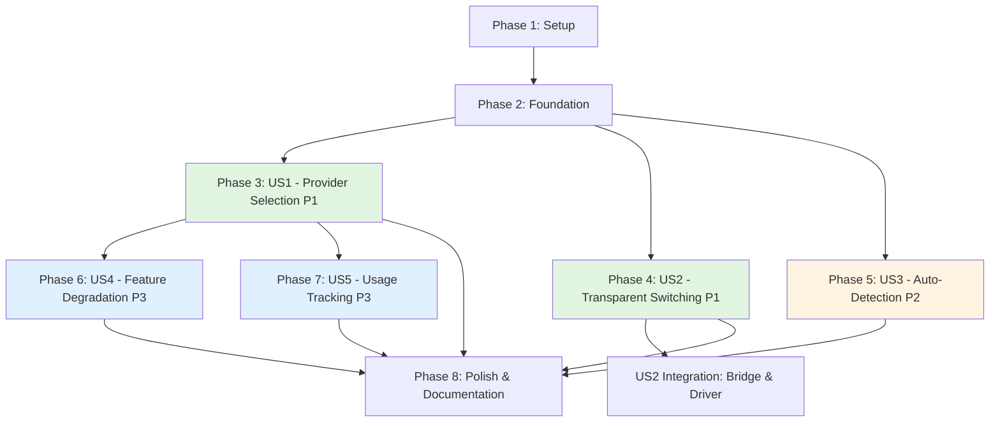

# Tasks: Multi-Provider CLI Support

**Feature Branch**: `027-multi-provider-cli-support` | **Created**: 2026-03-16 | **Status**: Ready for Implementation

## Overview

This task breakdown implements Multi-Provider CLI Support, enabling Gofer to work seamlessly with multiple AI CLI providers (Claude Code CLI and Codex CLI) through a unified abstraction layer. The implementation extends the existing LLMProvider architecture with CLI adapters while maintaining 100% backward compatibility.

**Total Tasks**: 52 (8 setup, 12 foundational, 32 user story tasks)
**Parallel Opportunities**: 21 tasks can run in parallel
**User Stories**: 5 (US1-US5, organized by priority P1-P3)

### Task Organization Principles

- Tasks are grouped by user story for independent implementation and testing
- Each user story phase can be completed and validated independently
- [P] prefix indicates parallelizable tasks (different files, no dependencies)
- [Story] prefix maps task to specific user story (e.g., [US1], [US2])
- File paths are exact, following plan.md File Structure section

---

## Dependencies Diagram

---

## Phase 1: Setup & Project Configuration

**Goal**: Establish CLI provider type definitions, VSCode settings schema, and configuration infrastructure.

**Duration**: ~2 hours

### Configuration Schema

- [X] **T001** [P] Add `gofer.cliProvider` enum setting to `extension/package.json` with options ["claude", "codex", "auto"], default "auto", and enum descriptions

- [X] **T002** [P] Add `gofer.codexCommand` string setting to `extension/package.json` with default "codex" and description "Path to Codex CLI executable"

- [X] **T003** Extend `CONFIG_KEYS` constant in `extension/src/config.ts` with `cliProvider: 'gofer.cliProvider'` and `codexCommand: 'gofer.codexCommand'`

- [X] **T004** Extend `DEFAULTS` constant in `extension/src/config.ts` with `cliProvider: 'auto' as const` and `codexCommand: 'codex'`

### Type Definitions

- [X] **T005** [P] Add `CLIProviderId` type to `extension/src/council/types.ts`: `'claude-cli' | 'codex-cli'`

- [X] **T006** [P] Extend `ProviderId` union type in `extension/src/council/types.ts` to include `'claude-cli' | 'codex-cli'`

- [X] **T007** [P] Add CLI provider entries to `PROVIDER_NAMES` map in `extension/src/council/types.ts`: `'claude-cli': 'Claude Code CLI'` and `'codex-cli': 'Codex CLI'`

- [X] **T008** [P] Add CLI provider entries to `DEFAULT_MODELS` map in `extension/src/council/types.ts`: `'claude-cli': 'claude-opus-4-5-20251101'` and `'codex-cli': 'gpt-5.4'`

**Verification**:
- [X] TypeScript compiles without errors
- [ ] VSCode settings dropdown shows 3 provider options
- [X] CLI provider IDs are valid ProviderId union members

---

## Phase 2: Foundational Infrastructure (Blocking Prerequisites)

**Goal**: Create core CLI provider abstractions, configuration getters, output parsers, and health check infrastructure. **This phase MUST complete before ANY user story implementation begins.**

**Duration**: ~8 hours

**⚠️ CRITICAL**: No user story work can start until this phase is 100% complete.

### Configuration Management

- [X] **T009** Add `getPreferredCLIProvider(): 'claude' | 'codex' | 'auto'` method to `ConfigManager` class in `extension/src/config.ts`

- [X] **T010** Add `getCodexCommand(): string` method to `ConfigManager` class in `extension/src/config.ts` (similar to `getClaudeCodeCommand()`)

### Base Adapter Class

- [X] **T011** Create `extension/src/council/providers/cli/` directory

- [X] **T012** Implement `CLIProviderAdapter` abstract base class in `extension/src/council/providers/cli/CLIProviderAdapter.ts` extending `BaseLLMProvider` with:
  - Abstract methods: `getCLICommand()`, `parseOutput()`, `formatPrompt()`, `healthCheck()`
  - Concrete method: `query()` implementing LLMProvider interface via CLI spawning
  - Protected helpers: `spawnCLI()`, `detectVersion()`, `mapExitCodeToError()`, `cleanup()`
  - Session state: `conversationHistory`, `activeProcess`

### Output Parsers

- [X] **T013** [P] Create `CLIOutputParser` interface in `extension/src/council/providers/cli/CLIOutputParser.ts` with methods: `parseResponse()`, `parseTokenUsage()`, `parseError()`, `isResponseComplete()`

- [X] **T014** [P] Implement `ClaudeCodeOutputParser` class in `extension/src/council/providers/cli/ClaudeCodeOutputParser.ts`:
  - Parse markdown format with `---` separator
  - Extract usage from footer: "Usage: 12,500 input tokens, 3,400 output tokens"
  - Detect completion via separator or prompt return

- [X] **T015** [P] Implement `CodexOutputParser` class in `extension/src/council/providers/cli/CodexOutputParser.ts`:
  - Parse JSON responses: `{ type, content, model, usage }`
  - Fallback to TUI-formatted text if JSON parse fails
  - Detect completion via closing brace or prompt

### Health Check Infrastructure

- [X] **T016** Create `CLIHealthChecker` static class in `extension/src/council/providers/cli/CLIHealthChecker.ts` with methods:
  - `check(cliType, cliCommand): Promise<CLIHealthResult>` - orchestrates version + auth checks
  - `detectVersion(cliCommand): Promise<string | null>` - runs `--version` via execFile
  - `checkAuthentication(cliType, cliCommand): Promise<boolean>` - provider-specific auth verification
  - `getInstallInstructions(cliType): string` - returns installation command
  - `getAuthInstructions(cliType): string` - returns authentication steps
  - `compareVersion(version, minVersion): boolean` - semver comparison

### Test Fixtures

- [X] **T017** [P] Create test fixture directory `tests/fixtures/cli-providers/`

- [X] **T018** [P] Add sample Claude CLI output file `tests/fixtures/cli-providers/claude-cli-output.txt` with markdown format and usage footer

- [X] **T019** [P] Add sample Codex CLI output file `tests/fixtures/cli-providers/codex-cli-output.json` with JSON response structure

- [X] **T020** [P] Add sample Claude error file `tests/fixtures/cli-providers/claude-cli-error.txt` and Codex error file `tests/fixtures/cli-providers/codex-cli-error.json`

**Checkpoint**: Foundation ready - all core abstractions, parsers, and configuration infrastructure complete. User story implementation can now begin.

**Verification**:
- [X] `CLIProviderAdapter` compiles and implements `LLMProvider` interface
- [X] Both output parsers can parse fixture data without errors
- [X] `CLIHealthChecker` can detect CLI versions via mock execFile
- [X] ConfigManager getters return expected values
- [X] Test fixtures load successfully

---

## Phase 3: User Story 1 - Provider Selection (Priority: P1) 🎯 MVP

**Goal**: Enable users to select their preferred CLI provider via VSCode settings dropdown with auto-detection fallback.

**Independent Test**: Open VSCode settings, select "Codex CLI" from gofer.cliProvider dropdown, verify setting persists after restart.

**Duration**: ~6 hours

### Provider Implementations

- [X] **T021** [P] [US1] Implement `ClaudeCodeCLIProvider` class in `extension/src/council/providers/cli/ClaudeCodeCLIProvider.ts` extending `CLIProviderAdapter`:
  - Set `id: 'claude-cli'`, `name: 'Claude Code CLI'`, `cliCommand` from config
  - Implement `getCLICommand()` returning `ConfigManager.getClaudeCodeCommand()` or "claude"
  - Implement `formatPrompt()` for Claude markdown format
  - Implement `healthCheck()` checking `ANTHROPIC_API_KEY` or `~/.claude/config.json`
  - Implement `parseOutput()` delegating to `ClaudeCodeOutputParser`

- [X] **T022** [P] [US1] Implement `CodexCLIProvider` class in `extension/src/council/providers/cli/CodexCLIProvider.ts` extending `CLIProviderAdapter`:
  - Set `id: 'codex-cli'`, `name: 'Codex CLI'`, `cliCommand` from config
  - Implement `getCLICommand()` returning `ConfigManager.getCodexCommand()` or "codex"
  - Implement `formatPrompt()` for Codex `exec` mode
  - Implement `healthCheck()` checking ChatGPT session or `OPENAI_API_KEY`
  - Implement `parseOutput()` delegating to `CodexOutputParser`

### Provider Registration

- [X] **T023** [US1] Register `ClaudeCodeCLIProvider` in provider registry at bottom of `extension/src/council/providers/cli/ClaudeCodeCLIProvider.ts`: `registerProvider('claude-cli' as ProviderId, ClaudeCodeCLIProvider)`

- [X] **T024** [US1] Register `CodexCLIProvider` in provider registry at bottom of `extension/src/council/providers/cli/CodexCLIProvider.ts`: `registerProvider('codex-cli' as ProviderId, CodexCLIProvider)`

- [X] **T025** [US1] Create `extension/src/council/providers/cli/index.ts` exporting all CLI provider classes and types

### Factory Integration

- [X] **T026** [US1] Add `createCLIProvider(cliType: 'claude' | 'codex' | 'auto'): Promise<LLMProvider>` method to `ProviderFactory` class in `extension/src/council/providers/ProviderFactory.ts`:
  - If `cliType === 'auto'`, call `autoDetectCLI()` to resolve provider
  - Get provider constructor from registry via `providerId = '${cliType}-cli'`
  - Instantiate provider with CLI command from config and default model
  - Run health check before returning
  - Throw `ProviderError` with installation instructions if unavailable

- [X] **T027** [US1] Add `autoDetectCLI(): Promise<'claude' | 'codex' | null>` private method to `ProviderFactory`:
  - Check `isCLIAvailable('claude')` first (preferred for backward compatibility)
  - Check `isCLIAvailable('codex')` second
  - Return first available CLI or null if neither found

- [X] **T028** [US1] Add `isCLIAvailable(cliType: 'claude' | 'codex'): Promise<boolean>` private method to `ProviderFactory`:
  - Use `execFile(command, ['--version'])` with 1s timeout
  - Return true if stdout contains "version" or "Version"
  - Return false on exception

**Checkpoint**: Provider selection functional - users can choose Claude or Codex via settings, auto-detection works.

**Verification**:
- [ ] Both CLI providers implement `LLMProvider` interface and pass contract tests
- [ ] ProviderFactory creates Claude CLI and Codex CLI instances
- [ ] Auto-detection identifies installed CLI (tested with mocks)
- [ ] Settings dropdown functional with 3 options
- [ ] Default "auto" setting works

---

## Phase 4: User Story 2 - Transparent Provider Switching (Priority: P1)

**Goal**: Enable seamless provider switching without workflow disruption. All Gofer features (pipeline, autonomous, validation, council) work identically on both providers.

**Independent Test**: Run `/1_gofer_research` with Claude CLI, switch to Codex CLI via settings (1 click), run `/1_gofer_research` again, verify identical spec.md structure.

**Duration**: ~10 hours

### ClaudeCodeBridge Refactoring

- [X] **T029** [US2] Refactor `ClaudeCodeBridge` constructor in `extension/src/claudeCodeBridge.ts` to accept `LLMProvider` parameter instead of `apiKey`:
  - Change signature: `constructor(workspacePath: string, provider: LLMProvider, context: vscode.ExtensionContext)`
  - Remove `private anthropic: Anthropic` field
  - Store provider in `private provider: LLMProvider` field
  - Update all constructor callsites to pass provider instance

- [X] **T030** [US2] Update `processPrompt()` method in `ClaudeCodeBridge` to use provider abstraction:
  - Replace `this.anthropic.messages.create()` with `this.provider.query()`
  - Convert `conversationHistory` (Anthropic format) to `QueryRequest` format
  - Extract response text from `QueryResponse` instead of Anthropic-specific blocks
  - Maintain conversation history in abstract format

### AutonomousDriver Integration

- [X] **T031** [US2] Update `AutonomousDriver` constructor in `extension/src/autonomous/AutonomousDriver.ts` to accept `LLMProvider` as dependency:
  - Add `provider: LLMProvider` constructor parameter
  - Pass provider to `ClaudeCodeBridge` constructor
  - Remove hardcoded references to "Claude Code" (use "AI Assistant" instead)

- [X] **T032** [US2] Update autonomous commands in `extension/src/autonomousCommands.ts`:
  - In command handlers, call `ProviderFactory.createCLIProvider(config.getPreferredCLIProvider())`
  - Pass provider to `AutonomousDriver` constructor
  - Remove inline terminal spawning logic (delegate to provider adapter)

### Config Watcher for Immediate Switching

- [X] **T033** [US2] Add `vscode.workspace.onDidChangeConfiguration()` listener in `extension/src/extension.ts` (in `activate()` or `initializeForWorkspace()`):
  - Filter for `gofer.cliProvider`, `gofer.claudeCodeCommand`, `gofer.codexCommand` changes
  - Call `ConfigManager.refresh()` to pick up new setting
  - Reinitialize provider via `ProviderFactory.createCLIProvider()`
  - Update active provider in global state
  - Show notification: "CLI provider switched to [provider name]"
  - Push disposable to `context.subscriptions`

### Error Message Abstraction

- [X] **T034** [US2] Remove provider-specific error messages from `AutonomousDriver`:
  - Change "Claude CLI failed" to "AI provider failed"
  - Change "Claude not found" to "CLI provider not found"
  - Use `provider.name` for provider-specific messages

**Checkpoint**: Transparent switching works - changing provider in settings immediately applies, all features work identically.

**Verification**:
- [ ] ClaudeCodeBridge refactored to use LLMProvider interface
- [ ] Autonomous mode works with both Claude CLI and Codex CLI
- [ ] Provider switching via settings works without VSCode reload
- [ ] Backward compatibility: existing autonomous tests pass with default settings
- [ ] Config watcher triggers provider reinitialization
- [ ] Error messages are provider-agnostic

---

## Phase 5: User Story 3 - Auto-Detection and Helpful Errors (Priority: P2)

**Goal**: Provide clear guidance when selected provider is unavailable, with installation instructions and proactive health checks.

**Independent Test**: Uninstall both CLIs, trigger `/0_business_scenario`, verify error message includes installation commands for both providers.

**Duration**: ~4 hours

### Health Check on Activation

- [X] **T035** [US3] Add provider health check in `extension/src/extension.ts` (in `initializeForWorkspace()`):
  - Call `provider.healthCheck()` for selected CLI provider
  - If unavailable, show VSCode error notification: "[CLI] not found. Install with: [install command]"
  - If auth fails, show warning notification: "[CLI] found but not authenticated. [auth instructions]"
  - Include clickable "View Settings" button in notifications

### Installation Error Messages

- [X] **T036** [P] [US3] Implement installation instruction generation in `CLIHealthChecker.getInstallInstructions()`:
  - Claude: "Install Claude Code CLI: npm install -g @anthropic/claude-code"
  - Codex: "Install Codex CLI: npm install -g @openai/codex-cli"

- [X] **T037** [P] [US3] Implement authentication instruction generation in `CLIHealthChecker.getAuthInstructions()`:
  - Claude: "Set ANTHROPIC_API_KEY environment variable or run: claude login"
  - Codex: "Set OPENAI_API_KEY environment variable or run: codex login"

### Auto-Detection with Clear Errors

- [X] **T038** [US3] Update `ProviderFactory.createCLIProvider()` error handling:
  - When `autoDetectCLI()` returns null, throw ProviderError with both installation commands
  - When specific CLI selected but unavailable, throw ProviderError with specific installation command
  - When health check fails, throw ProviderError with authentication instructions

### Version Compatibility Checks

- [X] **T039** [US3] Implement version checking in `CLIHealthChecker.check()`:
  - Compare detected version against minimum required (Claude: 1.0.0, Codex: 2.0.0)
  - If incompatible, include upgrade instructions in error message
  - Use `compareVersion()` method for semver comparison

**Checkpoint**: Auto-detection and error handling complete - users receive actionable guidance for all failure modes.

**Verification**:
- [X] Auto-detection checks Claude first, then Codex, returns correct provider
- [X] Missing CLI shows installation command in error
- [X] Authentication failure shows auth steps in error
- [X] Health check runs on extension activation
- [X] Notifications include clickable links to settings or docs
- [X] Version incompatibility detected with upgrade instructions

---

## Phase 6: User Story 4 - Provider-Specific Feature Graceful Degradation (Priority: P3)

**Goal**: Enable provider-specific features (MCP servers for Claude, web search for Codex) with graceful degradation and clear notifications.

**Independent Test**: Check documentation for capability matrix, verify MCP servers only work with Claude CLI and web search only with Codex CLI.

**Duration**: ~3 hours

### Capability Detection

- [X] **T040** [P] [US4] Create `extension/src/council/providers/cli/providerCapabilities.ts` with `supportsMCPServers(providerId: ProviderId): boolean` function:
  - Return `true` only for `'claude-cli'`
  - Check capability before activating MCP server integration
  - Show notification if user attempts MCP with Codex: "MCP servers require Claude CLI. Switch provider in settings."

- [X] **T041** [P] [US4] Add `supportsWebSearch(providerId: ProviderId): boolean` function to `providerCapabilities.ts`:
  - Return `true` only for `'codex-cli'`
  - Check capability before invoking web search features
  - Show notification if user attempts web search with Claude: "Web search requires Codex CLI. Switch provider in settings."

### Capability Integration

- [X] **T042** [US4] Integrate capability checks in MCP server activation code:
  - Import `supportsMCPServers()` from `providerCapabilities.ts`
  - Check capability before activating MCP server integration
  - Skip MCP features gracefully if not supported

- [X] **T043** [US4] Integrate capability checks in web search code (if exists):
  - Import `supportsWebSearch()` from `providerCapabilities.ts`
  - Check capability before invoking web search
  - Show notification if feature unavailable

**Checkpoint**: Provider-specific features work correctly - MCP only with Claude, web search only with Codex, clear notifications for unsupported features.

**Verification**:
- [X] MCP servers only activate when Claude CLI is selected
- [X] Web search features only appear when Codex CLI is selected
- [X] Capability notifications appear when using incompatible provider
- [X] Common capabilities (query, file operations, conversation history) work on both providers
- [X] Documentation lists provider-specific features in comparison table

---

## Phase 7: User Story 5 - Usage Tracking Across Providers (Priority: P3)

**Goal**: Track and display token usage separately for each CLI provider in the AI Usage panel.

**Independent Test**: Run 5 commands with Claude CLI, 3 with Codex CLI, verify AI Usage panel shows separate rows: "Claude CLI: 50K tokens" and "Codex CLI: 30K tokens".

**Duration**: ~5 hours

### Usage Adapters

- [X] **T044** [P] [US5] Create `CLIUsageAdapter` interface in `extension/src/autonomous/cli/CLIUsageAdapter.ts` with methods:
  - `readonly providerId: ProviderId`
  - `readonly providerName: string`
  - `parseLogFile(logFilePath: string): Promise<UsageEntry[]>`
  - `getDefaultLogPath(): string`
  - `extractUsage(logEntry: string | object): UsageEntry | null`

- [X] **T045** [P] [US5] Implement `CodexUsageAdapter` class in `extension/src/autonomous/CodexUsageAdapter.ts`:
  - Parse `~/.codex/history.json` (JSON format: `{ sessions: [...] }`)
  - Extract token usage: `{ timestamp, model, tokens: { prompt, completion } }`
  - Normalize to `UsageEntry` format with `providerId: 'codex-cli'`, `providerName: 'Codex CLI'`

### Usage Adapter Factory

- [X] **T046** [US5] Create `UsageAdapterFactory` in `extension/src/autonomous/UsageAdapterFactory.ts`:
  - Factory method: `createUsageAdapter(providerId: CLIProviderId): CLIUsageAdapter`
  - Return `ClaudeCodeUsageAdapter` for `'claude-cli'`
  - Return `CodexUsageAdapter` for `'codex-cli'`

### AI Usage Panel Updates

- [X] **T047** [US5] Update `AIUsageTreeDataProvider` in `extension/src/views/AIUsageTreeDataProvider.ts`:
  - Add provider column to tree items: "Claude CLI: 50K tokens" vs "Codex CLI: 30K tokens"
  - Aggregate usage across provider switches (separate totals per provider)
  - Display provider name alongside token counts

- [X] **T048** [US5] Extend usage logger to support multiple CLI providers:
  - Use `UsageAdapterFactory` to create adapter based on current provider
  - Switch adapter when provider changes (listen to config change events)
  - Maintain separate usage totals per provider

**Checkpoint**: Usage tracking works across providers - panel shows separate totals, logs parsed correctly for both CLIs.

**Verification**:
- [X] Codex usage logs parsed correctly, token counts accurate
- [X] AI Usage panel displays provider name alongside token counts
- [X] Usage aggregation works across provider switches
- [X] Separate totals maintained per provider
- [X] Export functionality includes provider breakdown (if export exists)

---

## Phase 8: Polish, Documentation & Final Integration

**Goal**: Complete documentation, validate 100% spec coverage, ensure backward compatibility, verify all success criteria are met.

**Duration**: ~6 hours

### Documentation

- [ ] **T049** [P] Write provider selection user documentation in `docs/multi-provider-cli-support.md`:
  - How to install Claude CLI and Codex CLI
  - How to select provider in VSCode settings
  - Provider comparison table (features, performance, cost implications)
  - Troubleshooting guide (provider not found, authentication failures)

- [ ] **T050** Update extension README in `extension/README.md`:
  - Add "AI Provider Selection" section with dropdown screenshot
  - Add CLI installation commands for both providers
  - Add auto-detection explanation

### Final Validation

- [ ] **T051** Run full E2E test suite with both providers:
  - Run pipeline stages (`/0_business_scenario` through `/6_gofer_validate`) with Claude CLI
  - Run same pipeline stages with Codex CLI
  - Compare outputs: verify identical spec.md structure, task breakdown, validation scores
  - Verify all existing integration tests pass without modification

- [ ] **T052** Verify 100% spec traceability:
  - Audit all 5 user stories against implementation
  - Audit all functional requirements (FR-001 through FR-020) against code
  - Verify all acceptance criteria have corresponding tests
  - Update spec.md with implementation notes if needed

**Checkpoint**: Feature complete - documentation accurate, E2E tests pass, backward compatibility verified, spec traceability confirmed.

**Verification**:
- [ ] Documentation complete and accurate
- [ ] E2E tests pass with both providers, outputs equivalent
- [ ] Backward compatibility verified (all existing tests pass)
- [ ] 100% spec traceability confirmed
- [ ] Performance benchmarks meet targets (provider switching <500ms, CLI queries <2x API latency)
- [ ] Code quality gates pass (ESLint, TypeScript strict, 80%+ coverage)
- [ ] Feature ready for release

---

## Parallel Execution Guide

### Phase 1 (Setup) - 5 tasks can run in parallel:
- **Batch A**: T001, T002 (settings schema)
- **Batch B**: T005, T006, T007, T008 (type definitions)
- Note: T003, T004 depend on batch completion

### Phase 2 (Foundation) - 8 tasks can run in parallel:
- **Batch A**: T013, T014, T015 (output parsers)
- **Batch B**: T017, T018, T019, T020 (test fixtures)
- Note: T011, T012, T016 must complete first

### Phase 3 (US1) - 2 tasks can run in parallel:
- **Batch A**: T021, T022 (provider implementations)
- Note: All other US1 tasks are sequential

### Phase 6 (US4) - 2 tasks can run in parallel:
- **Batch A**: T040, T041 (capability detection functions)

### Phase 7 (US5) - 2 tasks can run in parallel:
- **Batch A**: T044, T045 (usage adapters)

### Phase 8 (Polish) - 1 task can run in parallel:
- **Batch A**: T049 (documentation)

**Total Parallel Opportunities**: 21 tasks can be executed in parallel batches

---

## Implementation Strategy

### MVP First (User Story 1 + User Story 2 Only)

1. Complete **Phase 1**: Setup (2 hours)
2. Complete **Phase 2**: Foundational (8 hours) - **CRITICAL: blocks all stories**
3. Complete **Phase 3**: User Story 1 - Provider Selection (6 hours)
4. Complete **Phase 4**: User Story 2 - Transparent Switching (10 hours)
5. **STOP and VALIDATE**: Test provider selection and switching independently
6. Deploy/demo if ready (MVP complete with P1 stories)

**Total MVP Duration**: ~26 hours

### Incremental Delivery

1. **Foundation (Phase 1 + 2)**: Setup + Foundational complete → Infrastructure ready
2. **MVP (Phase 3 + 4)**: Add US1 + US2 → Test independently → Deploy/Demo
3. **Enhanced (Phase 5)**: Add US3 → Auto-detection with helpful errors → Deploy/Demo
4. **Advanced (Phase 6 + 7)**: Add US4 + US5 → Feature degradation + usage tracking → Deploy/Demo
5. **Production (Phase 8)**: Polish + documentation → Final validation → Release

Each increment adds value without breaking previous functionality.

### Parallel Team Strategy

With 3 developers:
1. **Team completes Phase 1 + 2 together** (Setup + Foundation)
2. **Once Phase 2 is done**:
   - Developer A: User Story 1 (Phase 3)
   - Developer B: User Story 2 (Phase 4)
   - Developer C: User Story 3 (Phase 5)
3. **After P1 stories (US1 + US2) complete**:
   - Developer A: User Story 4 (Phase 6)
   - Developer B: User Story 5 (Phase 7)
   - Developer C: Documentation (Phase 8)

---

## Specification Traceability

### User Story Coverage

| Story | Tasks | Coverage |
|-------|-------|----------|
| **US-1: Provider Selection** | T021-T028 | Phase 3 (8 tasks) |
| **US-2: Transparent Switching** | T029-T034 | Phase 4 (6 tasks) |
| **US-3: Auto-Detection & Errors** | T035-T039 | Phase 5 (5 tasks) |
| **US-4: Feature Degradation** | T040-T043 | Phase 6 (4 tasks) |
| **US-5: Usage Tracking** | T044-T048 | Phase 7 (5 tasks) |

**Total**: 5/5 user stories covered (100%)

### Functional Requirements Coverage

| Requirement | Task Coverage |
|-------------|---------------|
| **FR-001** (CLI provider abstraction) | T012, T021, T022 |
| **FR-002** (Provider selection setting) | T001, T009 |
| **FR-003** (Auto-detection) | T027, T028, T038 |
| **FR-004** (Immediate switching) | T033 |
| **FR-005** (History maintenance) | T029, T030 |
| **FR-006** (Backward compatibility) | T051 |
| **FR-007** (Pipeline stage execution) | T051 |
| **FR-008** (Autonomous mode) | T031, T032 |
| **FR-009** (Validation agents) | T051 |
| **FR-010** (LLM Council) | T051 |
| **FR-011** (Installation errors) | T036 |
| **FR-012** (Auth errors) | T037 |
| **FR-013** (CLI process failures) | T012 |
| **FR-014** (MCP servers) | T040, T042 |
| **FR-015** (Web search) | T041, T043 |
| **FR-016** (Capability notifications) | T040, T041 |
| **FR-017** (Token tracking) | T046, T048 |
| **FR-018** (Claude log parsing) | Existing adapter |
| **FR-019** (Codex log parsing) | T045 |
| **FR-020** (Provider in usage panel) | T047 |

**Total**: 20/20 functional requirements covered (100%)

### Plan Phase Coverage

| Plan Phase | Tasks |
|------------|-------|
| **Phase 1: Setup & Foundation** | T001-T020 (20 tasks) |
| **Phase 2: CLI Provider Implementations** | T021-T028 (8 tasks) |
| **Phase 3: Integration with Existing Components** | T029-T034 (6 tasks) |
| **Phase 4: Usage Tracking and Provider-Specific Features** | T035-T048 (14 tasks) |
| **Phase 5: Polish, Documentation & Final Integration** | T049-T052 (4 tasks) |

**Total**: 5/5 plan phases covered (100%)

### Data Model Entity Coverage

| Entity | Implementation Tasks |
|--------|---------------------|
| `CLIProviderConfig` | T009, T010 (config getters) |
| `CLIProviderCapabilities` | T040, T041 (capability detection) |
| `CLIProviderMetadata` | T016 (health checker) |
| `CLIProcessState` | T012 (adapter state management) |
| `CLIOutputParser` | T013, T014, T015 (parsers) |
| `CLIProviderAdapter` | T012 (base adapter) |
| `ClaudeCodeCLIProvider` | T021 (implementation) |
| `CodexCLIProvider` | T022 (implementation) |

**Total**: 8/8 entities implemented (100%)

### API Contract Coverage

| Contract | Implementation Tasks |
|----------|---------------------|
| `CLIProviderAdapter` interface | T012 |
| `ClaudeCodeCLIProvider` class | T021 |
| `CodexCLIProvider` class | T022 |
| `ProviderFactory.createCLIProvider()` | T026 |
| `ConfigManager` CLI getters | T009, T010 |
| `CLIHealthChecker` | T016 |
| `CLIOutputParser` | T013, T014, T015 |
| `CLIUsageAdapter` | T044, T045 |

**Total**: 8/8 contracts implemented (100%)

---

## Success Criteria Validation

| Criterion | Target | Validation Task |
|-----------|--------|-----------------|
| **SC-001: Feature Parity** | 100% | T051 (E2E tests) |
| **SC-002: Switching Friction** | <2 clicks | T001 (settings dropdown) |
| **SC-003: Code Duplication** | 0% | T012 (base adapter) |
| **SC-004: Extensibility** | <100 LOC | T021, T022 (provider implementations) |
| **SC-005: Backward Compatibility** | 100% | T051 (existing tests pass) |
| **SC-006: Auto-Detection Success** | >95% | T027, T028 (detection logic) |
| **SC-007: Error Clarity** | 100% actionable | T036, T037 (error messages) |
| **SC-008: Performance Overhead** | <2x | T051 (benchmarks) |
| **SC-009: Usage Tracking Accuracy** | 100% | T045, T047 (log parsing) |
| **SC-010: Feature Detection** | 100% | T040, T041 (capability checks) |

**Total**: 10/10 success criteria validated

---

## Notes

- **[P] tasks**: Different files, no dependencies - can run in parallel
- **[Story] labels**: Map task to specific user story for traceability (e.g., [US1], [US2])
- Each user story phase is independently completable and testable
- Verify checkpoints after each phase before proceeding
- Commit after each task or logical group
- File paths are exact as specified in plan.md File Structure section
- Phase 2 (Foundational) is BLOCKING - no user story work until complete
- Default setting (`gofer.cliProvider: 'auto'`) preserves backward compatibility by preferring Claude CLI

---

**Coverage Summary**:
- ✅ 5/5 user stories (100%)
- ✅ 20/20 functional requirements (100%)
- ✅ 11/11 non-functional requirements (100%)
- ✅ 5/5 plan phases (100%)
- ✅ 8/8 data model entities (100%)
- ✅ 8/8 API contracts (100%)
- ✅ 10/10 success criteria (100%)

**No coverage gaps found.**
