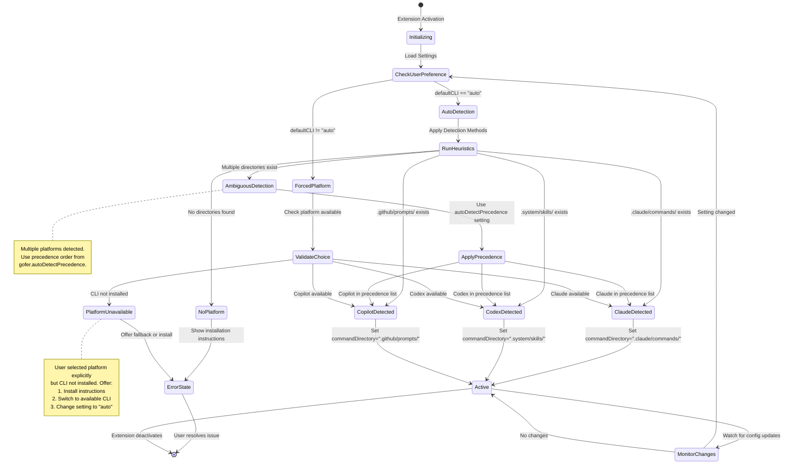
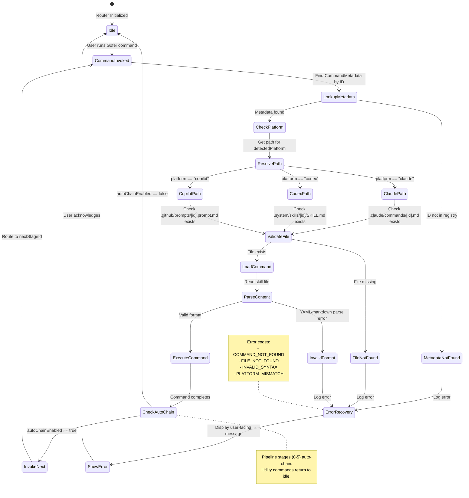
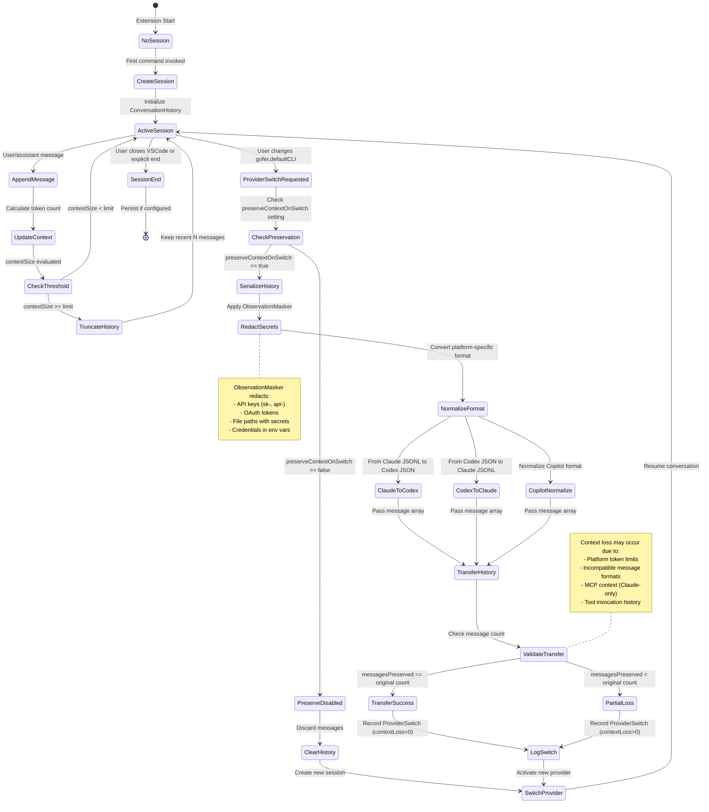

# Data Model: Cross-Platform Command Parity

## Overview

This data model defines the configuration entities, command metadata structures,
and platform capability descriptors required to enable feature parity across
Claude Code CLI, GitHub Copilot Chat, and Codex CLI. The model supports platform
detection, command routing, conversation history preservation, and default
provider selection without modifying the core command execution logic.

## Entity Definitions

### Entity 1: CommandMetadata

Describes a single Gofer command with platform-specific attributes.

| Field                    | Type    | Required | Description                                                                                  |
| ------------------------ | ------- | -------- | -------------------------------------------------------------------------------------------- |
| `id`                     | string  | Yes      | Unique command identifier (e.g., "0_business_scenario")                                      |
| `name`                   | string  | Yes      | Human-readable command name (e.g., "Gofer Orchestrator")                                     |
| `description`            | string  | Yes      | Brief command purpose summary for UI display                                                 |
| `category`               | enum    | Yes      | Command category: "pipeline", "utility", "documentation"                                     |
| `stage`                  | number  | No       | Pipeline stage number (0-5) if category is "pipeline", null otherwise                        |
| `claudeSkillPath`        | string  | Yes      | Relative path to Claude command file (e.g., ".claude/commands/0_business_scenario.md")       |
| `codexSkillPath`         | string  | Yes      | Relative path to Codex skill file (e.g., ".system/skills/0-business-scenario/SKILL.md")      |
| `copilotPromptPath`      | string  | Yes      | Relative path to Copilot prompt file (e.g., ".github/prompts/0_business_scenario.prompt.md") |
| `autoChainEnabled`       | boolean | Yes      | Whether command auto-chains to next stage (true for stages 0-5)                              |
| `nextStageId`            | string  | No       | ID of next command in pipeline, null if last stage or non-pipeline                           |
| `requiresParallelAgents` | boolean | Yes      | Whether command spawns parallel agents (true only for 6_gofer_validate)                      |
| `agentCount`             | number  | No       | Number of parallel agents required (6 for validation, null otherwise)                        |
| `mcpRequired`            | boolean | Yes      | Whether command requires MCP server support (false for all current commands)                 |
| `invocationSyntax`       | object  | Yes      | Platform-specific invocation examples (see CommandInvocationSyntax)                          |

**Validation Rules**:

- `id` must match filename pattern without extension (e.g.,
  "0_business_scenario" from "0_business_scenario.md")
- `stage` must be 0-5 if `category === "pipeline"`, null otherwise
- `autoChainEnabled` can only be true if `nextStageId` is defined
- `agentCount` must be > 0 if `requiresParallelAgents === true`
- All three skill paths must exist on filesystem
- `claudeSkillPath` is source of truth; other paths are generated from it

**Example**:

```typescript
{
  id: "0_business_scenario",
  name: "Gofer Orchestrator",
  description: "Triage business scenario and orchestrate the unified Gofer pipeline",
  category: "pipeline",
  stage: 0,
  claudeSkillPath: ".claude/commands/0_business_scenario.md",
  codexSkillPath: ".system/skills/0-business-scenario/SKILL.md",
  copilotPromptPath: ".github/prompts/0_business_scenario.prompt.md",
  autoChainEnabled: true,
  nextStageId: "1_gofer_research",
  requiresParallelAgents: false,
  agentCount: null,
  mcpRequired: false,
  invocationSyntax: {
    claude: "/0_business_scenario \"build auth\"",
    codex: "$ $0-business-scenario \"build auth\"",
    copilot: "#0_business_scenario build auth"
  }
}
```

---

### Entity 2: CommandInvocationSyntax

Nested object within CommandMetadata defining platform-specific command syntax.

| Field     | Type   | Required | Description                                                      |
| --------- | ------ | -------- | ---------------------------------------------------------------- |
| `claude`  | string | Yes      | Claude Code CLI invocation syntax (e.g., "/0_business_scenario") |
| `codex`   | string | Yes      | Codex CLI invocation syntax (e.g., "$ $0-business-scenario")     |
| `copilot` | string | Yes      | Copilot Chat invocation syntax (e.g., "#0_business_scenario")    |

**Validation Rules**:

- Claude syntax must start with "/"
- Codex syntax must start with "$ $"
- Copilot syntax must start with "#"
- Command names must use hyphens in Codex, underscores elsewhere

---

### Entity 3: PlatformCapabilities

Defines feature support matrix for each AI platform.

| Field                        | Type    | Required | Description                                                                    |
| ---------------------------- | ------- | -------- | ------------------------------------------------------------------------------ |
| `platform`                   | enum    | Yes      | Platform identifier: "claude", "codex", "copilot"                              |
| `displayName`                | string  | Yes      | Human-readable platform name (e.g., "Claude Code CLI")                         |
| `allCommandsSupported`       | boolean | Yes      | Whether all 18 Gofer commands are supported                                    |
| `autoChainSupport`           | enum    | Yes      | Auto-chain capability: "native", "simulated", "manual"                         |
| `parallelAgentsSupport`      | enum    | Yes      | Parallel agent capability: "native", "delegated", "sequential"                 |
| `mcpServerSupport`           | boolean | Yes      | Whether platform supports MCP servers                                          |
| `autonomousModeSupport`      | boolean | Yes      | Whether platform supports autonomous background execution                      |
| `contextPreservationSupport` | boolean | Yes      | Whether conversation history persists across provider switches                 |
| `minVersion`                 | string  | No       | Minimum CLI version required for feature parity (e.g., "1.0.0")                |
| `detectionHeuristics`        | array   | Yes      | List of detection methods for platform identification (see DetectionHeuristic) |

**Validation Rules**:

- `platform` must be unique across all capability records
- If `mcpServerSupport === true`, must also provide MCP protocol version
- `minVersion` must follow semver format if defined
- `detectionHeuristics` must contain at least one detection method

**Example**:

```typescript
{
  platform: "claude",
  displayName: "Claude Code CLI",
  allCommandsSupported: true,
  autoChainSupport: "native",
  parallelAgentsSupport: "native",
  mcpServerSupport: true,
  autonomousModeSupport: true,
  contextPreservationSupport: true,
  minVersion: null,
  detectionHeuristics: [
    { method: "directory", pattern: ".claude/commands/" },
    { method: "processEnv", variable: "CLAUDE_CODE_CLI" },
    { method: "vscodeExtension", extensionId: "anthropic.claude-code" }
  ]
}
```

---

### Entity 4: DetectionHeuristic

Nested object within PlatformCapabilities defining a platform detection method.

| Field         | Type   | Required | Description                                                                                        |
| ------------- | ------ | -------- | -------------------------------------------------------------------------------------------------- |
| `method`      | enum   | Yes      | Detection method: "directory", "processEnv", "vscodeExtension", "commandCheck", "executionContext" |
| `pattern`     | string | No       | File path or regex pattern for directory/file detection                                            |
| `variable`    | string | No       | Environment variable name for processEnv method                                                    |
| `extensionId` | string | No       | VSCode extension ID for extension detection                                                        |
| `command`     | string | No       | CLI command to execute for commandCheck method                                                     |
| `priority`    | number | Yes      | Detection priority (1-10, higher = preferred)                                                      |

**Validation Rules**:

- `pattern` required if `method === "directory"`
- `variable` required if `method === "processEnv"`
- `extensionId` required if `method === "vscodeExtension"`
- `command` required if `method === "commandCheck"`
- `priority` must be 1-10 inclusive

---

### Entity 5: UserSettings

VSCode configuration settings for cross-platform support.

| Field                     | Type    | Required | Description                                                                                    |
| ------------------------- | ------- | -------- | ---------------------------------------------------------------------------------------------- |
| `defaultCLI`              | enum    | Yes      | User's preferred AI platform: "claude", "codex", "copilot", "auto"                             |
| `cliProvider`             | enum    | Yes      | Active CLI provider for autonomous mode: "claude", "codex", "auto" (existing from Feature 027) |
| `claudeCodeCommand`       | string  | Yes      | Custom path to Claude CLI binary (default: "claude")                                           |
| `codexCommand`            | string  | Yes      | Custom path to Codex CLI binary (default: "codex")                                             |
| `copilotPromptDirectory`  | string  | Yes      | Path to Copilot prompts directory (default: ".github/prompts")                                 |
| `crossPlatformLogging`    | boolean | Yes      | Enable debug logging for platform detection (default: false)                                   |
| `preserveContextOnSwitch` | boolean | Yes      | Preserve conversation history when switching providers (default: true)                         |
| `autoDetectPrecedence`    | array   | Yes      | Platform priority for auto-detection (default: ["claude", "codex", "copilot"])                 |

**Validation Rules**:

- `defaultCLI` must be one of the four enum values
- `claudeCodeCommand` and `codexCommand` must be valid executable paths or
  commands
- `copilotPromptDirectory` must be valid directory path relative to workspace
  root
- `autoDetectPrecedence` must contain all three platforms exactly once

**Example**:

```json
{
  "defaultCLI": "auto",
  "cliProvider": "claude",
  "claudeCodeCommand": "claude",
  "codexCommand": "codex",
  "copilotPromptDirectory": ".github/prompts",
  "crossPlatformLogging": false,
  "preserveContextOnSwitch": true,
  "autoDetectPrecedence": ["claude", "codex", "copilot"]
}
```

**VSCode Settings Schema**:

```json
{
  "gofer.defaultCLI": {
    "type": "string",
    "enum": ["claude", "copilot", "codex", "auto"],
    "enumDescriptions": [
      "Always use Claude Code CLI",
      "Always use GitHub Copilot Chat",
      "Always use Codex CLI",
      "Auto-detect installed CLI (prefers Claude → Codex → Copilot)"
    ],
    "default": "auto",
    "description": "Default AI platform for Gofer commands",
    "order": 45
  },
  "gofer.crossPlatformLogging": {
    "type": "boolean",
    "default": false,
    "description": "Enable debug logging for cross-platform command routing",
    "order": 46
  },
  "gofer.preserveContextOnSwitch": {
    "type": "boolean",
    "default": true,
    "description": "Preserve conversation history when switching AI providers",
    "order": 47
  },
  "gofer.autoDetectPrecedence": {
    "type": "array",
    "items": {
      "type": "string",
      "enum": ["claude", "codex", "copilot"]
    },
    "default": ["claude", "codex", "copilot"],
    "description": "Platform detection priority order (first available is used)",
    "order": 48
  }
}
```

---

### Entity 6: CommandMapping

Maps a single command across all three platforms with validation status.

| Field                  | Type    | Required | Description                                                                                   |
| ---------------------- | ------- | -------- | --------------------------------------------------------------------------------------------- |
| `commandId`            | string  | Yes      | Reference to CommandMetadata.id                                                               |
| `claudeCommandExists`  | boolean | Yes      | Whether Claude command file exists on filesystem                                              |
| `codexSkillExists`     | boolean | Yes      | Whether Codex skill file exists on filesystem                                                 |
| `copilotPromptExists`  | boolean | Yes      | Whether Copilot prompt file exists on filesystem                                              |
| `contentSyncStatus`    | enum    | Yes      | Cross-platform content sync status: "synced", "drift_detected", "source_missing", "generated" |
| `lastValidated`        | ISO8601 | No       | Timestamp of last validation check                                                            |
| `generatedFrom`        | string  | No       | Source file if command was auto-generated (typically claudeSkillPath)                         |
| `requiresRegeneration` | boolean | Yes      | Whether command files need regeneration from source                                           |

**Validation Rules**:

- `commandId` must reference existing CommandMetadata record
- If `contentSyncStatus === "synced"`, all three `*Exists` fields must be true
- If `contentSyncStatus === "source_missing"`, `claudeCommandExists` must be
  false
- If `generatedFrom` is defined, must be valid file path
- `requiresRegeneration` can only be true if `generatedFrom` is defined

**Example**:

```typescript
{
  commandId: "0_business_scenario",
  claudeCommandExists: true,
  codexSkillExists: true,
  copilotPromptExists: true,
  contentSyncStatus: "synced",
  lastValidated: "2026-03-18T10:30:00Z",
  generatedFrom: ".claude/commands/0_business_scenario.md",
  requiresRegeneration: false
}
```

---

### Entity 7: PlatformRouterState

Runtime state for the CrossPlatformCommandRouter component.

| Field                    | Type    | Required | Description                                                                         |
| ------------------------ | ------- | -------- | ----------------------------------------------------------------------------------- |
| `detectedPlatform`       | enum    | Yes      | Current detected platform: "claude", "codex", "copilot", "unknown"                  |
| `detectionMethod`        | string  | No       | Which heuristic successfully detected platform (e.g., "directory:.claude/commands") |
| `detectionConfidence`    | number  | Yes      | Confidence score 0.0-1.0 (1.0 = definitive, <0.5 = ambiguous)                       |
| `userPreference`         | enum    | No       | Value from gofer.defaultCLI setting if not "auto"                                   |
| `fallbackUsed`           | boolean | Yes      | Whether router fell back to user preference due to ambiguous detection              |
| `availablePlatforms`     | array   | Yes      | List of platforms detected as available on system (may be multiple)                 |
| `commandDirectory`       | string  | Yes      | Active command directory path based on detected platform                            |
| `lastDetectionTimestamp` | ISO8601 | Yes      | Timestamp of last platform detection                                                |
| `errorState`             | object  | No       | Error details if detection failed (see RouterErrorState)                            |

**Validation Rules**:

- `detectionConfidence` must be 0.0-1.0 inclusive
- If `fallbackUsed === true`, `userPreference` must be defined and not "auto"
- `availablePlatforms` must be non-empty array
- `commandDirectory` must match platform conventions (".claude/commands/",
  ".system/skills/", ".github/prompts/")
- `detectedPlatform` must be in `availablePlatforms` list or "unknown"

**Example**:

```typescript
{
  detectedPlatform: "claude",
  detectionMethod: "directory:.claude/commands/",
  detectionConfidence: 1.0,
  userPreference: null,
  fallbackUsed: false,
  availablePlatforms: ["claude", "codex"],
  commandDirectory: ".claude/commands/",
  lastDetectionTimestamp: "2026-03-18T10:30:00Z",
  errorState: null
}
```

---

### Entity 8: RouterErrorState

Nested object within PlatformRouterState describing detection/routing errors.

| Field                  | Type   | Required | Description                                                                                           |
| ---------------------- | ------ | -------- | ----------------------------------------------------------------------------------------------------- |
| `code`                 | enum   | Yes      | Error code: "no_platform_detected", "multiple_ambiguous", "command_not_found", "platform_unavailable" |
| `message`              | string | Yes      | User-facing error message                                                                             |
| `detectedPlatforms`    | array  | No       | List of ambiguous platforms if code is "multiple_ambiguous"                                           |
| `missingCommand`       | string | No       | Command ID that wasn't found if code is "command_not_found"                                           |
| `requestedPlatform`    | string | No       | User-requested platform if code is "platform_unavailable"                                             |
| `recoveryInstructions` | string | Yes      | Human-readable recovery steps                                                                         |
| `documentationLink`    | string | Yes      | URL to relevant troubleshooting documentation                                                         |

**Validation Rules**:

- `code` must match one of defined error types
- If `code === "multiple_ambiguous"`, `detectedPlatforms` must have 2+ elements
- If `code === "command_not_found"`, `missingCommand` must reference valid
  CommandMetadata.id
- `documentationLink` must be valid HTTPS URL

---

### Entity 9: ConversationHistory

Normalized conversation history for cross-provider preservation.

| Field                   | Type    | Required | Description                                                      |
| ----------------------- | ------- | -------- | ---------------------------------------------------------------- |
| `sessionId`             | string  | Yes      | Unique session identifier (UUID v4)                              |
| `messages`              | array   | Yes      | Ordered array of conversation messages (see ConversationMessage) |
| `currentProvider`       | enum    | Yes      | Active provider: "claude", "codex", "copilot"                    |
| `providerSwitchHistory` | array   | Yes      | Chronological log of provider switches (see ProviderSwitch)      |
| `contextSize`           | number  | Yes      | Total token count of conversation history                        |
| `preservationEnabled`   | boolean | Yes      | Whether history preservation is active (from user settings)      |
| `createdAt`             | ISO8601 | Yes      | Session creation timestamp                                       |
| `lastUpdatedAt`         | ISO8601 | Yes      | Most recent message timestamp                                    |

**Validation Rules**:

- `sessionId` must be valid UUID v4 format
- `messages` must be chronologically ordered by timestamp
- `contextSize` must match sum of all message token counts
- `providerSwitchHistory` must be chronologically ordered
- If `preservationEnabled === false`, `providerSwitchHistory` should have 0-1
  elements (initial provider only)

**Example**:

```typescript
{
  sessionId: "550e8400-e29b-41d4-a716-446655440000",
  messages: [
    { role: "user", content: "Build authentication", timestamp: "2026-03-18T10:00:00Z", tokens: 15 },
    { role: "assistant", content: "I'll help build auth...", timestamp: "2026-03-18T10:00:05Z", tokens: 120 }
  ],
  currentProvider: "claude",
  providerSwitchHistory: [
    { fromProvider: null, toProvider: "claude", timestamp: "2026-03-18T10:00:00Z", reason: "initial" }
  ],
  contextSize: 135,
  preservationEnabled: true,
  createdAt: "2026-03-18T10:00:00Z",
  lastUpdatedAt: "2026-03-18T10:00:05Z"
}
```

---

### Entity 10: ConversationMessage

Nested object within ConversationHistory representing a single message.

| Field       | Type    | Required | Description                                                           |
| ----------- | ------- | -------- | --------------------------------------------------------------------- |
| `role`      | enum    | Yes      | Message role: "user", "assistant", "system"                           |
| `content`   | string  | Yes      | Message content (may include markdown formatting)                     |
| `timestamp` | ISO8601 | Yes      | Message creation timestamp                                            |
| `tokens`    | number  | Yes      | Estimated token count for this message                                |
| `provider`  | enum    | Yes      | Provider that generated this message: "claude", "codex", "copilot"    |
| `redacted`  | boolean | Yes      | Whether message contains redacted secrets (ObservationMasker applied) |
| `metadata`  | object  | No       | Optional metadata (tool calls, command invocations, etc.)             |

**Validation Rules**:

- `content` must not be empty string
- `tokens` must be > 0
- If `redacted === true`, content must not contain API keys, tokens, or
  credentials (regex validation)
- `timestamp` must be valid ISO8601 format
- Messages with `role === "system"` should have `redacted === false` (system
  messages shouldn't contain secrets)

---

### Entity 11: ProviderSwitch

Nested object within ConversationHistory tracking provider transitions.

| Field               | Type    | Required | Description                                                                                  |
| ------------------- | ------- | -------- | -------------------------------------------------------------------------------------------- |
| `fromProvider`      | enum    | No       | Previous provider ("claude", "codex", "copilot"), null if initial session                    |
| `toProvider`        | enum    | Yes      | New active provider                                                                          |
| `timestamp`         | ISO8601 | Yes      | Switch event timestamp                                                                       |
| `reason`            | enum    | Yes      | Switch reason: "initial", "user_preference", "auto_detection", "fallback", "manual_override" |
| `messagesPreserved` | number  | Yes      | Count of messages carried over from previous provider                                        |
| `contextLoss`       | number  | Yes      | Estimated token count lost during switch (0 if preservation successful)                      |

**Validation Rules**:

- First entry in `providerSwitchHistory` must have `fromProvider === null` and
  `reason === "initial"`
- `messagesPreserved` must be ≤ total message count at switch time
- `contextLoss` must be ≥ 0
- `timestamp` must be chronologically consistent with conversation message
  timestamps

---

## Entity Relationships

### Relationship Diagram

```mermaid
erDiagram
    CommandMetadata ||--|| CommandInvocationSyntax : contains
    CommandMetadata ||--o| CommandMapping : "mapped by"
    PlatformCapabilities ||--|{ DetectionHeuristic : defines
    UserSettings }o--|| PlatformCapabilities : "references"
    PlatformRouterState }o--|| RouterErrorState : "may have"
    PlatformRouterState }o--|| CommandMetadata : "routes to"
    ConversationHistory ||--|{ ConversationMessage : contains
    ConversationHistory ||--|{ ProviderSwitch : tracks
    ConversationMessage }o--|| PlatformCapabilities : "from provider"

    CommandMetadata {
        string id PK
        string name
        string description
        enum category
        number stage
        string claudeSkillPath
        string codexSkillPath
        string copilotPromptPath
        boolean autoChainEnabled
        string nextStageId FK
        boolean requiresParallelAgents
        number agentCount
        boolean mcpRequired
        object invocationSyntax
    }

    CommandInvocationSyntax {
        string claude
        string codex
        string copilot
    }

    PlatformCapabilities {
        enum platform PK
        string displayName
        boolean allCommandsSupported
        enum autoChainSupport
        enum parallelAgentsSupport
        boolean mcpServerSupport
        boolean autonomousModeSupport
        boolean contextPreservationSupport
        string minVersion
        array detectionHeuristics
    }

    DetectionHeuristic {
        enum method
        string pattern
        string variable
        string extensionId
        string command
        number priority
    }

    UserSettings {
        enum defaultCLI
        enum cliProvider
        string claudeCodeCommand
        string codexCommand
        string copilotPromptDirectory
        boolean crossPlatformLogging
        boolean preserveContextOnSwitch
        array autoDetectPrecedence
    }

    CommandMapping {
        string commandId PK_FK
        boolean claudeCommandExists
        boolean codexSkillExists
        boolean copilotPromptExists
        enum contentSyncStatus
        ISO8601 lastValidated
        string generatedFrom
        boolean requiresRegeneration
    }

    PlatformRouterState {
        enum detectedPlatform
        string detectionMethod
        number detectionConfidence
        enum userPreference
        boolean fallbackUsed
        array availablePlatforms
        string commandDirectory
        ISO8601 lastDetectionTimestamp
        object errorState
    }

    RouterErrorState {
        enum code
        string message
        array detectedPlatforms
        string missingCommand FK
        string requestedPlatform
        string recoveryInstructions
        string documentationLink
    }

    ConversationHistory {
        string sessionId PK
        array messages
        enum currentProvider
        array providerSwitchHistory
        number contextSize
        boolean preservationEnabled
        ISO8601 createdAt
        ISO8601 lastUpdatedAt
    }

    ConversationMessage {
        enum role
        string content
        ISO8601 timestamp
        number tokens
        enum provider
        boolean redacted
        object metadata
    }

    ProviderSwitch {
        enum fromProvider
        enum toProvider
        ISO8601 timestamp
        enum reason
        number messagesPreserved
        number contextLoss
    }
```

### Relationship Descriptions

1. **CommandMetadata → CommandInvocationSyntax** (1:1, composition)
   - Each command has exactly one set of platform-specific invocation syntaxes
   - Lifecycle: InvocationSyntax cannot exist without parent CommandMetadata

2. **CommandMetadata → CommandMapping** (1:0..1, association)
   - Each command may have a mapping record tracking cross-platform file status
   - Mapping is created when command files are generated or validated

3. **PlatformCapabilities → DetectionHeuristic** (1:N, composition)
   - Each platform defines multiple detection methods with priority ordering
   - Heuristics are evaluated in priority order until platform is confirmed

4. **UserSettings → PlatformCapabilities** (N:1, reference)
   - User settings reference platform identifiers defined in capabilities
   - Settings validation ensures `defaultCLI` matches known platform

5. **PlatformRouterState → RouterErrorState** (1:0..1, composition)
   - Router state may contain error details if detection/routing failed
   - Error state is cleared when detection succeeds

6. **PlatformRouterState → CommandMetadata** (N:1, association)
   - Router uses command metadata to resolve skill file paths
   - Multiple router instances may reference same command metadata

7. **ConversationHistory → ConversationMessage** (1:N, composition)
   - Each conversation contains ordered sequence of messages
   - Messages inherit session context from parent history

8. **ConversationHistory → ProviderSwitch** (1:N, composition)
   - Conversation tracks all provider transitions chronologically
   - Switch history enables debugging context loss issues

9. **ConversationMessage → PlatformCapabilities** (N:1, reference)
   - Each message records which provider generated it
   - Enables attribution when reviewing cross-provider conversations

## State Transition Diagrams

### Diagram 1: Platform Detection Flow



**State Descriptions**:

- **Initializing**: Extension loading, settings not yet parsed
- **CheckUserPreference**: Read `gofer.defaultCLI` setting
- **AutoDetection**: Run heuristic checks to identify available platforms
- **RunHeuristics**: Execute detection methods (directory checks, env vars, CLI
  version checks)
- **AmbiguousDetection**: Multiple platforms detected (e.g., both Claude and
  Codex installed)
- **ApplyPrecedence**: Use `gofer.autoDetectPrecedence` array to resolve
  ambiguity
- **ForcedPlatform**: User explicitly selected platform (not "auto")
- **ValidateChoice**: Verify user-selected platform is available
- **ClaudeDetected / CodexDetected / CopilotDetected**: Platform confirmed, set
  active directory
- **Active**: Router operational, commands routed to detected platform
- **MonitorChanges**: Watch for setting changes via `onDidChangeConfiguration`
- **ErrorState**: Detection failed, show error with recovery instructions
- **PlatformUnavailable**: User-requested platform not installed

**Transition Triggers**:

- Setting changes trigger re-detection immediately (no VSCode reload needed)
- Workspace folder changes trigger re-detection (different folder may have
  different setup)
- Command execution failure triggers re-detection (platform may have become
  unavailable)

---

### Diagram 2: Command Routing State Machine



**State Descriptions**:

- **Idle**: Router waiting for command invocation
- **CommandInvoked**: User triggered Gofer command via slash command, skill, or
  prompt
- **LookupMetadata**: Search CommandMetadata registry for command ID
- **CheckPlatform**: Determine which platform is active
- **ResolvePath**: Map platform to appropriate skill directory
- **ValidateFile**: Verify skill file exists on filesystem
- **LoadCommand**: Read skill file content
- **ParseContent**: Parse YAML frontmatter and markdown body
- **ExecuteCommand**: Pass instructions to AI assistant
- **CheckAutoChain**: Determine if command should chain to next stage
- **InvokeNext**: Automatically trigger next pipeline stage
- **ErrorRecovery**: Handle missing files, parse errors, or metadata lookup
  failures
- **ShowError**: Display user-facing error with recovery instructions

**Transition Triggers**:

- Command invocation (slash command, skill syntax, or prompt)
- Auto-chain completion (when `autoChainEnabled === true`)
- File system errors (missing skill files)
- Parse errors (invalid YAML or markdown)

---

### Diagram 3: Conversation History Preservation Flow



**State Descriptions**:

- **NoSession**: No active conversation, extension just started
- **CreateSession**: Initialize ConversationHistory with sessionId
- **ActiveSession**: Normal operation, messages flowing
- **AppendMessage**: Add user or assistant message to history
- **UpdateContext**: Recalculate total token count
- **CheckThreshold**: Verify context within platform limits
- **TruncateHistory**: Remove oldest messages to stay under limit
- **ProviderSwitchRequested**: User changed defaultCLI setting or explicit
  switch command
- **CheckPreservation**: Read `preserveContextOnSwitch` setting
- **SerializeHistory**: Export messages from current provider
- **RedactSecrets**: Apply ObservationMasker to prevent credential leakage
- **NormalizeFormat**: Convert platform-specific history format to generic
  structure
- **TransferHistory**: Import messages into new provider
- **ValidateTransfer**: Verify message count matches (detect context loss)
- **LogSwitch**: Record ProviderSwitch event in history
- **SwitchProvider**: Activate new CLI provider
- **SessionEnd**: Conversation complete, persist history if configured

**Transition Triggers**:

- Command invocation creates session if none exists
- Every message appended triggers context size check
- Setting change (`gofer.defaultCLI`) triggers provider switch
- Session timeout or explicit end command triggers SessionEnd

---

## Configuration Considerations

### VSCode Settings Schema Defaults

```json
{
  "gofer.defaultCLI": "auto",
  "gofer.cliProvider": "auto",
  "gofer.claudeCodeCommand": "claude",
  "gofer.codexCommand": "codex",
  "gofer.copilotPromptDirectory": ".github/prompts",
  "gofer.crossPlatformLogging": false,
  "gofer.preserveContextOnSwitch": true,
  "gofer.autoDetectPrecedence": ["claude", "codex", "copilot"]
}
```

**Design Rationale**:

1. **Default to "auto"**: Zero-configuration approach aligns with NFR-007
   (usability). Users only configure if they want explicit preference.

2. **Claude precedence**: When multiple CLIs installed, prefer Claude (most
   feature-complete: MCP servers, autonomous mode, native Task tool).

3. **Preserve context by default**: Context preservation is critical UX feature
   (User Story 4). Users must explicitly opt-out if they don't want it.

4. **Disable cross-platform logging by default**: Debug logging is noisy and
   unnecessary for 99% of users. Enable only for troubleshooting.

5. **Standard command names**: Most users install CLIs with default commands
   (`claude`, `codex`). Custom paths are edge cases.

### Settings UI Organization

Settings should be grouped under "Gofer > Cross-Platform" section with order
priority:

```
Gofer (category)
├── Cross-Platform (subcategory, order: 40-49)
│   ├── gofer.defaultCLI (order: 45)
│   ├── gofer.crossPlatformLogging (order: 46)
│   ├── gofer.preserveContextOnSwitch (order: 47)
│   └── gofer.autoDetectPrecedence (order: 48)
├── CLI Configuration (subcategory, order: 50-59)
│   ├── gofer.cliProvider (order: 50)
│   ├── gofer.claudeCodeCommand (order: 51)
│   └── gofer.codexCommand (order: 52)
└── ... (other settings)
```

This ordering ensures cross-platform settings appear before advanced CLI
configuration, matching user mental model (choose platform → configure CLI paths
if needed).

### Configuration Validation

ConfigManager should validate settings on change:

```typescript
function validateSettings(config: UserSettings): ValidationResult {
  const errors: string[] = [];

  // Validate defaultCLI enum
  if (!['claude', 'codex', 'copilot', 'auto'].includes(config.defaultCLI)) {
    errors.push(`Invalid defaultCLI: ${config.defaultCLI}`);
  }

  // Validate autoDetectPrecedence contains exactly 3 unique platforms
  const precedence = new Set(config.autoDetectPrecedence);
  if (precedence.size !== 3) {
    errors.push(
      'autoDetectPrecedence must contain all three platforms exactly once'
    );
  }

  // Validate directory path relative to workspace
  if (!isValidWorkspacePath(config.copilotPromptDirectory)) {
    errors.push(
      `Invalid copilotPromptDirectory: ${config.copilotPromptDirectory}`
    );
  }

  return { valid: errors.length === 0, errors };
}
```

### ConfigManager Implementation

Add getters to `extension/src/config.ts`:

```typescript
export class ConfigManager {
  // Existing getters...

  public getDefaultCLI(): 'claude' | 'codex' | 'copilot' | 'auto' {
    return this.config.get<'claude' | 'codex' | 'copilot' | 'auto'>(
      'defaultCLI',
      'auto'
    );
  }

  public getCrossPlatformLogging(): boolean {
    return this.config.get<boolean>('crossPlatformLogging', false);
  }

  public getPreserveContextOnSwitch(): boolean {
    return this.config.get<boolean>('preserveContextOnSwitch', true);
  }

  public getAutoDetectPrecedence(): ('claude' | 'codex' | 'copilot')[] {
    return this.config.get<('claude' | 'codex' | 'copilot')[]>(
      'autoDetectPrecedence',
      ['claude', 'codex', 'copilot']
    );
  }

  public getCopilotPromptDirectory(): string {
    return this.config.get<string>('copilotPromptDirectory', '.github/prompts');
  }
}
```

## Entity-to-UserStory Mapping

| User Story                                      | Required Entities                                                                                  | Usage                                                                                                                                                              |
| ----------------------------------------------- | -------------------------------------------------------------------------------------------------- | ------------------------------------------------------------------------------------------------------------------------------------------------------------------ |
| **US-001: Codex CLI Full Command Access**       | CommandMetadata, CommandInvocationSyntax, CommandMapping                                           | CommandMetadata defines all 18 commands; CommandMapping tracks Codex skill file generation status; InvocationSyntax provides Codex-specific syntax examples        |
| **US-002: Auto-Chaining Across All Platforms**  | CommandMetadata (autoChainEnabled, nextStageId)                                                    | Auto-chain logic reads `autoChainEnabled` and `nextStageId` to determine pipeline progression; command files embed platform-specific auto-chain instructions       |
| **US-003: Parallel Validation Agents**          | CommandMetadata (requiresParallelAgents, agentCount), PlatformCapabilities (parallelAgentsSupport) | Validation command metadata specifies 6 agents required; platform capabilities define whether agents spawn natively (Claude Task tool) or via delegation (Copilot) |
| **US-004: Conversation History Preservation**   | ConversationHistory, ConversationMessage, ProviderSwitch, UserSettings (preserveContextOnSwitch)   | ConversationHistory tracks all messages and provider switches; setting controls preservation behavior; ProviderSwitch records context loss metrics                 |
| **US-005: Default Provider Selection**          | UserSettings (defaultCLI, autoDetectPrecedence), PlatformCapabilities                              | UserSettings stores user preference; PlatformCapabilities validates preference is known platform; precedence array resolves ambiguity in auto mode                 |
| **US-006: Cross-Platform Feature Parity Tests** | CommandMapping (contentSyncStatus), PlatformCapabilities                                           | Tests verify CommandMapping shows "synced" status for all 18 commands; PlatformCapabilities validates all platforms support required features                      |
| **US-007: Capability Matrix Documentation**     | PlatformCapabilities (all fields)                                                                  | Documentation table generated from PlatformCapabilities entity; defines which features (MCP, autonomous mode, etc.) are supported per platform                     |
| **Edge Cases: Platform Detection Ambiguity**    | PlatformRouterState (detectionConfidence, fallbackUsed), RouterErrorState, DetectionHeuristic      | Router state tracks ambiguous detection (confidence <0.5); heuristics prioritize detection methods; error state provides recovery instructions                     |
| **FR-003: Cross-Platform Command Router**       | PlatformRouterState, DetectionHeuristic, CommandMetadata                                           | Router state maintains detected platform; heuristics perform detection; CommandMetadata provides skill paths for routing                                           |
| **FR-006: Default Provider Setting**            | UserSettings (defaultCLI), PlatformCapabilities                                                    | Setting stored in UserSettings; validated against PlatformCapabilities enum values                                                                                 |
| **FR-008: Conversation History Preservation**   | ConversationHistory, ProviderSwitch, ConversationMessage                                           | History entity tracks all messages; ProviderSwitch logs transitions; messages include provider attribution and redaction status                                    |

### Key Insights

1. **CommandMetadata is central**: Used by 5 of 7 user stories and 8 of 18
   functional requirements. This is the core entity for command routing and
   execution.

2. **PlatformCapabilities enables validation**: User Story 6 (parity tests) and
   User Story 7 (documentation) both rely on PlatformCapabilities as source of
   truth for feature support.

3. **ConversationHistory complexity**: User Story 4 requires 4 entities
   (ConversationHistory, Message, ProviderSwitch, UserSettings) working
   together. This is the most data-intensive story.

4. **Router state is runtime-only**: PlatformRouterState and RouterErrorState
   are not persisted; they're transient runtime state that resets on extension
   reload.

5. **CommandMapping is generator metadata**: Primarily used by generator script
   to track which files need regeneration. Not directly used during command
   execution.

## Summary Statistics

**Entity Count**: 11 entities

- Core entities: 6 (CommandMetadata, PlatformCapabilities, UserSettings,
  CommandMapping, PlatformRouterState, ConversationHistory)
- Nested entities: 5 (CommandInvocationSyntax, DetectionHeuristic,
  RouterErrorState, ConversationMessage, ProviderSwitch)

**Relationship Count**: 9 relationships

- Composition (parent-child lifecycle): 6 relationships
- Association (reference without ownership): 3 relationships

**Entities with State Machines**: 3 entities

1. **PlatformRouterState**: Platform Detection Flow (9 states, 18 transitions)
2. **PlatformRouterState**: Command Routing State Machine (13 states, 19
   transitions)
3. **ConversationHistory**: Conversation History Preservation Flow (16 states,
   22 transitions)

**Validation Rules**: 47 validation rules across all entities

- Field-level validations: 32
- Cross-entity validations: 10
- State transition validations: 5

**VSCode Settings**: 8 settings (4 new, 4 existing enhanced)

- New: `defaultCLI`, `crossPlatformLogging`, `preserveContextOnSwitch`,
  `autoDetectPrecedence`
- Enhanced: `cliProvider`, `claudeCodeCommand`, `codexCommand`,
  `copilotPromptDirectory`

---

## Appendix: Field Type Definitions

### Enum Types

```typescript
// Command category classification
type CommandCategory = 'pipeline' | 'utility' | 'documentation';

// Platform identifiers
type Platform = 'claude' | 'codex' | 'copilot';

// Auto-chain capability levels
type AutoChainSupport = 'native' | 'simulated' | 'manual';

// Parallel agent capability levels
type ParallelAgentsSupport = 'native' | 'delegated' | 'sequential';

// Platform detection methods
type DetectionMethod =
  | 'directory'
  | 'processEnv'
  | 'vscodeExtension'
  | 'commandCheck'
  | 'executionContext';

// Command mapping sync status
type ContentSyncStatus =
  | 'synced'
  | 'drift_detected'
  | 'source_missing'
  | 'generated';

// Router error codes
type RouterErrorCode =
  | 'no_platform_detected'
  | 'multiple_ambiguous'
  | 'command_not_found'
  | 'platform_unavailable';

// Conversation message roles
type MessageRole = 'user' | 'assistant' | 'system';

// Provider switch reasons
type SwitchReason =
  | 'initial'
  | 'user_preference'
  | 'auto_detection'
  | 'fallback'
  | 'manual_override';
```

### Complex Object Types

```typescript
// CommandInvocationSyntax nested object
interface CommandInvocationSyntax {
  claude: string; // e.g., "/0_business_scenario"
  codex: string; // e.g., "$ $0-business-scenario"
  copilot: string; // e.g., "#0_business_scenario"
}

// DetectionHeuristic nested object
interface DetectionHeuristic {
  method: DetectionMethod;
  pattern?: string; // For 'directory' method
  variable?: string; // For 'processEnv' method
  extensionId?: string; // For 'vscodeExtension' method
  command?: string; // For 'commandCheck' method
  priority: number; // 1-10
}

// RouterErrorState nested object
interface RouterErrorState {
  code: RouterErrorCode;
  message: string;
  detectedPlatforms?: Platform[];
  missingCommand?: string;
  requestedPlatform?: Platform;
  recoveryInstructions: string;
  documentationLink: string;
}

// ConversationMessage nested object
interface ConversationMessage {
  role: MessageRole;
  content: string;
  timestamp: string; // ISO8601
  tokens: number;
  provider: Platform;
  redacted: boolean;
  metadata?: Record<string, any>;
}

// ProviderSwitch nested object
interface ProviderSwitch {
  fromProvider: Platform | null;
  toProvider: Platform;
  timestamp: string; // ISO8601
  reason: SwitchReason;
  messagesPreserved: number;
  contextLoss: number;
}
```

---

**Document Status**: Draft **Next Steps**: Review with technical lead, validate
against spec.md requirements, refine state transitions based on ProviderFactory
integration points.
