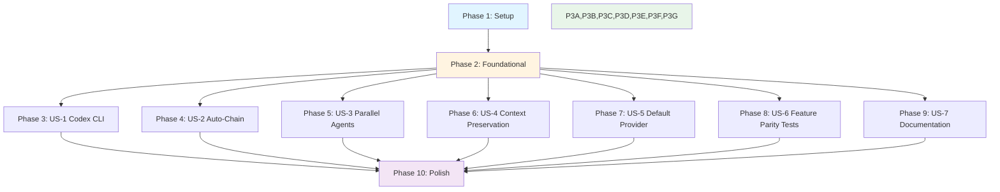

# Tasks: Cross-Platform Command Parity

**Input**: Design documents from
`.specify/specs/028-cross-platform-command-parity/`

**Prerequisites**: plan.md, spec.md, data-model.md, contracts/, research.md

**Organization**: Tasks are grouped by user story to enable independent
implementation and testing of each story.

## Overview

- **Total tasks**: 95 tasks
- **Parallel opportunities**: 46 tasks marked [P] can run concurrently within
  their phase
- **User story count**: 7 user stories (US-1 through US-7)
- **Phases**: 8 phases (Setup → 6 User Story phases → Polish)

## Task Format

`[ID] [P?] [Story?] Description`

- **[P]**: Can run in parallel (different files, no dependencies)
- **[Story]**: Which user story this task belongs to (US-1 through US-7)
- Include exact file paths in descriptions

---

## Dependencies

### Phase Dependency Graph

---

## Phase 1: Setup (Shared Infrastructure)

**Goal**: Establish directory structure, VSCode settings, base types, and
command file format documentation.

**Dependencies**: None (foundation phase)

### Setup Tasks

- [x] T001 [P] Create `.system/skills/` directory with README.md at
      `/Users/douglaswross/Code/gofer/.system/skills/README.md` explaining Codex
      CLI integration
- [x] T002 [P] Add `gofer.defaultCLI` VSCode setting to `extension/package.json`
      with enum ["claude", "copilot", "codex", "auto"], default "auto", order 27
- [x] T003 Add CONFIG_KEYS entry `defaultCLI: 'gofer.defaultCLI'` and DEFAULTS
      entry `defaultCLI: 'auto'` in `extension/src/config.ts`
- [x] T004 Add ConfigManager getter `getDefaultCLI()` in
      `extension/src/config.ts` with key `'defaultCLI'` (strip prefix per
      convention)
- [x] T005 [P] Define TypeScript types in
      `extension/src/council/types/CrossPlatformTypes.ts`: PlatformType,
      CommandMetadata, PlatformDetectionContext, CommandInvocationSyntax
- [x] T006 [P] Create `scripts/generate-commands.ts` skeleton with CLI parser
      and file system helpers
- [x] T007 [P] Create
      `.specify/specs/028-cross-platform-command-parity/command-formats.md` file
- [x] T007a Write command format comparison table in `command-formats.md`
      documenting YAML frontmatter differences, AUTO-CHAIN syntax variations,
      file structure per platform (Claude .md, Codex SKILL.md in subdirectories,
      Copilot .prompt.md)

**Verification**:

- [x] Settings UI shows `gofer.defaultCLI` dropdown with four options
- [x] ConfigManager.getInstance().getDefaultCLI() returns 'auto' by default
- [x] TypeScript compiles without errors
- [x] `.system/skills/README.md` explains Codex skill discovery

---

## Phase 2: Foundational (Blocking Prerequisites)

**Goal**: Implement platform detection, command metadata extraction, settings
integration, and skill directory management.

**Purpose**: Core infrastructure that MUST be complete before ANY user story can
be implemented.

**⚠️ CRITICAL**: No user story work can begin until this phase is complete.

**Dependencies**: Phase 1 (types, settings)

### Foundational Tasks

- [x] T008 [P] Implement `PlatformDetector` class in
      `extension/src/council/PlatformDetector.ts` with detectPlatform(),
      isPlatformAvailable(), getDefaultPlatform(), getDetectionContext()
- [x] T009 Implement platform detection logic: check execution context (VSCode
      extension host + directory presence), fallback to
      ConfigManager.getInstance().getDefaultCLI(), cache detection result
- [x] T010 [P] Implement `CommandMetadataExtractor` class in
      `extension/src/council/CommandMetadataExtractor.ts` with
      extractFromClaudeCommand(), extractFromCopilotPrompt(),
      extractFromCodexSkill()
- [x] T011 Parse YAML frontmatter and extract name/description from command
      files in CommandMetadataExtractor
- [x] T011a [P] Implement validateInvocationSyntax() in CommandMetadataExtractor
      to enforce platform-specific syntax rules per data-model.md:82-86 (Claude
      "/" prefix, Codex "$ $" prefix, Copilot "#" prefix)
- [x] T012 [P] Implement `SkillDirectoryManager` interface and
      DefaultSkillDirectoryManager in
      `extension/src/council/SkillDirectoryManager.ts` with findCommand(),
      listCommands(), getCommandMetadata(), watchDirectories()
- [x] T013 Implement multi-directory search with priority: .claude/commands/ >
      .system/skills/ > .github/prompts/ in SkillDirectoryManager
- [x] T014 Extend `ProviderFactory.autoDetectCLI()` in
      `extension/src/council/providers/ProviderFactory.ts` to check
      `gofer.defaultCLI` setting before running detection
- [ ] T015 If preferred CLI unavailable, show error with installation
      instructions and fallback suggestion in ProviderFactory
- [ ] T016 Log detection decision: "Using Claude Code CLI (user preference)" or
      "Auto-detected Codex CLI" in ProviderFactory
- [ ] T017 [P] Write unit tests in `tests/unit/council/PlatformDetector.test.ts`
      for all platform detection scenarios, fallback to setting, cache behavior
- [ ] T018 [P] Write unit tests in
      `tests/unit/council/CommandMetadataExtractor.test.ts` for extraction from
      each platform's command file format, error handling

**Verification**:

- [ ] Platform detector correctly identifies execution context
- [ ] Fallback to user preference works when detection ambiguous
- [ ] Metadata extraction parses all 16 existing Claude commands
- [ ] Tests pass with 100% coverage for detector and extractor
- [ ] ProviderFactory logs platform selection decision

**Checkpoint**: Foundation ready - user story implementation can now begin in
parallel

---

## Phase 3: User Story 1 - Codex CLI Full Command Access (Priority: P1) 🎯 MVP

**Goal**: Create all 16 Codex skill files in `.system/skills/` with correct YAML
frontmatter, auto-chain instructions, and validation for Codex CLI skill
discovery.

**Independent Test**: Install Gofer extension with Codex CLI configured, restart
Codex to load skills, run `$ $gofer-research` and verify command executes with
expected output structure.

**Dependencies**: Phase 2 (foundational complete)

### Tests for User Story 1

- [ ] T019 [P] [US-1] Unit test in `tests/unit/council/CommandGenerator.test.ts`
      for generateCodexSkill() with correct YAML frontmatter
- [ ] T020 [P] [US-1] Unit test in `tests/unit/council/CommandGenerator.test.ts`
      for auto-chain instruction injection
- [ ] T021 [P] [US-1] Integration test in
      `tests/integration/command-generation.test.ts` for generating all 16 Codex
      skills with valid YAML
- [ ] T022 [P] [US-1] Integration test in
      `tests/integration/command-generation.test.ts` for skill metadata
      extraction from generated files

### Implementation for User Story 1

- [x] T023 [P] [US-1] Implement `CommandGenerator` class in
      `extension/src/council/CommandGenerator.ts` with generateCommands(),
      generateCommand(), transformContent(), injectPlatformSections(),
      validateGeneratedCommand()
- [x] T024 [US-1] Implement generateCodexSkill() in CommandGenerator to
      transform YAML frontmatter: description → name + description, inject
      auto-chain instructions, implement transformContent() method to apply
      platform-specific substitutions, create directory structure
- [x] T025 [P] [US-1] Create Codex skill template in CommandGenerator with
      frontmatter, AUTO-CHAIN section, platform-specific syntax
- [x] T026 [US-1] Add auto-chain instructions to Codex skill template: "Run
      `$ $[next-command]`"
- [x] T027 [US-1] Implement validation logic in
      CommandGenerator.validateGeneratedCommand() to check YAML validity,
      required fields present
- [ ] T028 [US-1] Run generator script
      `npm run generate-commands -- --platform codex` to create 16 Codex skills
      in `.system/skills/[command-name]/SKILL.md`
- [ ] T029 [P] [US-1] Create `.system/skills/0-business-scenario/SKILL.md`
      (generated)
- [ ] T030 [P] [US-1] Create `.system/skills/0a-problem-validation/SKILL.md`
      (generated)
- [ ] T031 [P] [US-1] Create `.system/skills/1-gofer-research/SKILL.md`
      (generated)
- [ ] T032 [P] [US-1] Create `.system/skills/2-gofer-specify/SKILL.md`
      (generated)
- [ ] T033 [P] [US-1] Create `.system/skills/3-gofer-plan/SKILL.md` (generated)
- [ ] T034 [P] [US-1] Create `.system/skills/4-gofer-tasks/SKILL.md` (generated)
- [ ] T035 [P] [US-1] Create `.system/skills/5-gofer-implement/SKILL.md`
      (generated)
- [ ] T036 [P] [US-1] Create `.system/skills/6-gofer-validate/SKILL.md`
      (generated)
- [ ] T037 [P] [US-1] Create
      `.system/skills/6a-gofer-engineering-review/SKILL.md` (generated)
- [ ] T038 [P] [US-1] Create `.system/skills/7-gofer-save/SKILL.md` (generated)
- [ ] T039 [P] [US-1] Create `.system/skills/7a-stakeholder-comms/SKILL.md`
      (generated)
- [ ] T040 [P] [US-1] Create `.system/skills/8-gofer-resume/SKILL.md`
      (generated)
- [ ] T041 [P] [US-1] Create `.system/skills/9-gofer-tests/SKILL.md` (generated)
- [ ] T042 [P] [US-1] Create `.system/skills/10-gofer-cloud/SKILL.md`
      (generated)
- [ ] T043 [P] [US-1] Create `.system/skills/gofer-constitution/SKILL.md`
      (generated)
- [ ] T044 [P] [US-1] Create `.system/skills/gofer-hydrate/SKILL.md` (generated)
- [ ] T045 [US-1] Verify Codex CLI auto-completion lists all 16 skills after
      directory scan with `codex skills list` command

**Verification Checklist**:

- [ ] 16 Codex skills created with correct directory structure
- [ ] All skills have valid YAML frontmatter with name and description
- [ ] Auto-chain instructions present in pipeline stages (0-5)
- [ ] All tests pass with 80%+ coverage

**Checkpoint**: User Story 1 complete - Codex CLI has full command access

---

## Phase 4: User Story 2 - Auto-Chaining Across All Platforms (Priority: P1)

**Goal**: Enhance Copilot prompts with auto-chain instructions and implement
CrossPlatformCommandRouter for seamless pipeline progression.

**Independent Test**: Run `/0_business_scenario` (Claude),
`#0_business_scenario` (Copilot), or `$ $0-business-scenario` (Codex) with
identical input and verify all 7 stages execute automatically without user
prompts.

**Dependencies**: Phase 2 (foundational complete)

### Tests for User Story 2

- [ ] T044 [P] [US-2] Unit test in
      `tests/unit/council/CrossPlatformCommandRouter.test.ts` for routing to
      correct platform directory
- [ ] T045 [P] [US-2] Unit test in
      `tests/unit/council/CrossPlatformCommandRouter.test.ts` for priority
      fallback (Claude > Codex > Copilot)
- [ ] T046 [P] [US-2] Unit test in
      `tests/unit/council/CrossPlatformCommandRouter.test.ts` for path
      sanitization (reject "../../../etc/passwd")
- [ ] T047 [P] [US-2] Integration test in
      `tests/integration/autonomous-commands.test.ts` for AutonomousCommands
      calling router before execution

### Implementation for User Story 2

- [ ] T048 [P] [US-2] Implement `CrossPlatformCommandRouter` class in
      `extension/src/council/CrossPlatformCommandRouter.ts` with routeCommand(),
      loadSkillForPlatform(), detectPlatform(), getCommandPath(),
      listCommands(), isCommandAvailable(), getCommandSyntax()
- [ ] T049 [US-2] Implement command routing with priority: .claude/commands/ >
      .system/skills/ > .github/prompts/ in CrossPlatformCommandRouter
- [ ] T050 [US-2] Implement path sanitization to prevent traversal attacks in
      CrossPlatformCommandRouter
- [ ] T051 [P] [US-2] Implement enhanceCopilotPrompt() in CommandGenerator to
      preserve existing YAML frontmatter, inject AUTO-CHAIN section, add
      backward compatibility notes
- [ ] T052 [US-2] Add auto-chain instructions to Copilot prompt template: "Type
      `/[next-command]` in next message"
- [ ] T053 [US-2] Run generator script
      `npm run generate-commands -- --platform copilot` to enhance 16 Copilot
      prompts in `.github/prompts/[command].prompt.md`
- [ ] T054 Update `extension/src/extension.ts` activation to initialize
      CrossPlatformCommandRouter after ConfigManager creation
- [ ] T055 Register settings watcher for `gofer.defaultCLI` changes in
      extension.ts, call router.clearCache() on change
- [ ] T056 Wire router to `AutonomousCommands` in
      `extension/src/autonomousCommands.ts`: inject CrossPlatformCommandRouter
      into constructor, call router.routeCommand() before executing command
- [ ] T057 Update MCP Tool Handler in `language-server/src/mcp/toolHandler.ts`
      to implement multi-directory skill search with priority
- [ ] T057a [US-2] Implement auto-chain failure detection and error messaging in
      CrossPlatformCommandRouter: detect when AI doesn't invoke next stage after
      "AUTO-CHAIN (MANDATORY)", show clear error "Auto-chain failed at [stage]:
      expected next command not invoked. Run /[next-stage] manually."

**Verification Checklist**:

- [ ] Router selects correct command directory based on platform
- [ ] 16 Copilot prompts enhanced with AUTO-CHAIN sections
- [ ] Settings change triggers platform re-detection
- [ ] Commands execute using routed file path
- [ ] MCP Tool Handler finds skills in all three directories
- [ ] All tests pass with 80%+ coverage

**Checkpoint**: User Story 2 complete - Auto-chaining works across all platforms

---

## Phase 5: User Story 3 - Parallel Validation Agents (Priority: P1)

**Goal**: Add parallel agent spawning instructions to validation command for all
three platforms, with performance tests verifying <60s execution.

**Independent Test**: Run validation command in each platform and verify: (1) 6
agents spawn concurrently, (2) validation completes in under 60 seconds, (3)
validation report aggregates all 6 perspectives.

**Dependencies**: Phase 2 (foundational complete)

### Tests for User Story 3

- [ ] T057b [P] Create `tests/performance/` directory for performance test files
- [ ] T058 [P] [US-3] Performance test in
      `tests/performance/validation-parallel.test.ts` for parallel agent
      execution (<60s) **in each of Claude, Copilot, and Codex platforms**
- [ ] T059 [P] [US-3] Performance test in
      `tests/performance/validation-parallel.test.ts` for sequential agent
      baseline (90s+)
- [ ] T060 [P] [US-3] Performance test in
      `tests/performance/validation-parallel.test.ts` for spawning overhead
      (<10% of total time)
- [ ] T061 [P] [US-3] Integration test in
      `tests/integration/command-generation.test.ts` for parallel agent
      instructions in validation command

### Implementation for User Story 3

- [ ] T062 [P] [US-3] Add parallel agent spawning instructions to Claude
      validation command in `.claude/commands/6_gofer_validate.md` (verify
      existing, document pattern)
- [ ] T063 [US-3] Enhance Codex validation skill in
      `.system/skills/6-gofer-validate/SKILL.md` with "Run 6 validation skills
      concurrently in separate terminals" section
- [ ] T064 [US-3] Enhance Copilot validation prompt in
      `.github/prompts/6_gofer_validate.prompt.md` with multi-agent delegation
      section (Copilot 2026+) and backward compatibility notes
- [ ] T065 [P] [US-3] Create legacy workflow documentation in
      `docs/legacy-workflow.md` for sequential validation in pre-2026 Copilot
      versions

**Verification Checklist**:

- [ ] Validation command has parallel agent section in all 3 platforms
- [ ] Performance tests confirm <60s validation time
- [ ] All 6 agents referenced: correctness, security, performance, test-quality,
      integration, standards
- [ ] Legacy workflow documented for older Copilot versions
- [ ] All tests pass

**Checkpoint**: User Story 3 complete - Parallel validation agents work across
all platforms

---

## Phase 6: User Story 4 - Conversation History Preservation (Priority: P2)

**Goal**: Implement conversation history preservation when switching providers
mid-session, with credential redaction via ObservationMasker.

**Independent Test**: Start conversation in Claude CLI with 10-message context,
switch to Codex CLI, verify Codex can reference earlier messages, switch back to
Claude, verify full context preserved.

**Dependencies**: Phase 2 (foundational complete)

### Tests for User Story 4

- [ ] T066 [P] [US-4] Integration test in
      `tests/integration/cross-platform-parity.test.ts` for context preservation
      across provider switches
- [ ] T067 [P] [US-4] Security test in
      `tests/unit/council/providers/ProviderFactory.test.ts` for credential
      redaction before provider switch

### Implementation for User Story 4

- [ ] T068 [US-4] Implement conversation history preservation in
      `ProviderFactory.getCLIProvider()` in
      `extension/src/council/providers/ProviderFactory.ts`: call
      getConversationHistory() from old provider, normalize format (JSONL ↔
      JSON), apply ObservationMasker to redact credentials, call
      setConversationHistory() on new provider
- [ ] T069 [US-4] Show notification: "Switching to [provider] - conversation
      history preserved" when provider switches
- [ ] T070 [P] [US-4] Add history normalization adapter in ProviderFactory to
      convert between Claude JSONL and Codex JSON formats

**Verification Checklist**:

- [ ] History preservation redacts credentials (API keys, tokens)
- [ ] History format normalized (JSONL ↔ JSON)
- [ ] Full context preserved across Claude → Codex → Claude transitions
- [ ] User sees notification on provider switch
- [ ] Security tests verify no credential leakage
- [ ] All tests pass with 80%+ coverage

**Checkpoint**: User Story 4 complete - Conversation history preserved across
provider switches

---

## Phase 7: User Story 5 - Default Provider Selection (Priority: P2)

**Goal**: Enable users to set default AI platform via `gofer.defaultCLI` setting
with immediate effect and graceful error handling.

**Independent Test**: Set `gofer.defaultCLI` to "copilot" in VSCode settings,
run any Gofer command, verify it executes in Copilot Chat without prompting for
provider selection.

**Dependencies**: Phase 2 (foundational complete)

### Tests for User Story 5

- [ ] T071 [P] [US-5] Unit test in `tests/unit/config.test.ts` for
      ConfigManager.getDefaultCLI() with default value, configured value,
      invalid value fallback
- [ ] T072 [P] [US-5] Integration test in
      `tests/integration/cross-platform-parity.test.ts` for settings change
      triggering platform re-detection
- [ ] T073 [P] [US-5] Integration test in
      `tests/integration/cross-platform-parity.test.ts` for command execution
      with different defaultCLI values

### Implementation for User Story 5

- [ ] T074 [US-5] Add error message normalization to CLI provider adapters:
      implement translateError() in ClaudeCodeCLIProvider and CodexCLIProvider
      in `extension/src/council/providers/cli/` with standard format
- [ ] T075 [P] [US-5] Add ConfigManager helper method getCLIDisplayName() in
      `extension/src/config.ts` to return human-readable platform names
- [ ] T076 [P] [US-5] Add ConfigManager helper method isPlatformEnabled() in
      `extension/src/config.ts` to check if platform directory exists

**Verification Checklist**:

- [ ] Settings change triggers platform re-detection within 2 seconds
- [ ] Commands route to user-selected platform
- [ ] Graceful error with installation instructions if platform unavailable
- [ ] All tests pass with 80%+ coverage

**Checkpoint**: User Story 5 complete - Default provider selection working

---

## Phase 8: User Story 6 - Cross-Platform Feature Parity Tests (Priority: P2)

**Goal**: Implement comprehensive feature parity test suite comparing outputs
from Claude/Copilot/Codex for structural equivalence.

**Independent Test**: Run `npm test -- cross-platform-parity.test.ts` and verify
all tests pass, comparing outputs from Claude/Copilot/Codex for structural
equivalence.

**Dependencies**: Phase 2 (foundational complete), Phase 3 (Codex skills), Phase
4 (auto-chain), Phase 5 (parallel agents)

### Implementation for User Story 6

- [ ] T077 [US-6] Implement feature parity test suite in
      `tests/integration/cross-platform-parity.test.ts` with 5 test categories:
      command availability, auto-chain, parallel agents, context preservation,
      output structure
- [ ] T078 [P] [US-6] Test Category 1: Command Availability - mock platform
      detection, call router.routeCommand() for 16 commands, assert file exists
      with valid YAML
- [ ] T079 [P] [US-6] Test Category 2: Auto-Chain Functionality - mock skill
      execution, verify each stage outputs instruction to invoke next stage,
      assert stage N completion triggers stage N+1
- [ ] T080 [P] [US-6] Test Category 3: Parallel Agent Spawning - parse
      validation command, assert "Parallel Agent" section exists with 6 agent
      definitions, verify agents reference `.claude/agents/validation-*.md`
- [ ] T081 [P] [US-6] Test Category 4: Context Preservation - mock
      ProviderFactory with Claude session (5 messages), switch to Codex, assert
      Codex receives normalized history, switch back, assert full history intact
- [ ] T082 [P] [US-6] Test Category 5: Output Structure Equivalence - generate
      research.md in each platform (mocked), compare YAML frontmatter fields,
      compare section headings, assert structural equivalence
- [ ] T083 [US-6] Guard MCP initialization in `extension/src/mcpConfig.ts` with
      provider check: skip MCP setup if cliProvider is "codex" or "copilot", log
      graceful message
- [ ] T084 [P] [US-6] Integration test in
      `tests/integration/mcp-integration.test.ts` for MCP Tool Handler
      multi-directory search, priority fallback, graceful degradation

**Verification Checklist**:

- [ ] Feature parity tests pass with 100% success rate (5 categories)
- [ ] All 16 commands callable in each platform
- [ ] Auto-chain works identically across platforms
- [ ] Parallel agents spawn in all platforms
- [ ] Context preserved across switches
- [ ] Output structures match (research.md, spec.md, validation-report.md)
- [ ] MCP initialization skipped for non-Claude providers

**Checkpoint**: User Story 6 complete - Feature parity verified across platforms

---

## Phase 9: User Story 7 - Capability Matrix Documentation (Priority: P3)

**Goal**: Create platform capabilities documentation showing which features work
in which AI platforms with setup guides.

**Independent Test**: Read README capability matrix, verify it accurately
reflects current feature support (e.g., MCP servers only in Claude, autonomous
mode only in Claude/Codex).

**Dependencies**: Phase 2 (foundational complete), Phase 8 (feature parity tests
complete for accurate data)

### Implementation for User Story 7

- [ ] T085 [P] [US-7] Update README.md in
      `/Users/douglaswross/Code/gofer/README.md` with Platform Capabilities
      section: comparison table (Feature × Platform matrix), rows for 16
      commands + MCP + autonomous mode + context + auto-chain + parallel agents,
      columns for Claude/Copilot/Codex, cells with ✓/⚠/✗ status and footnotes
- [ ] T086 [P] [US-7] Create `docs/setup-claude-code.md` with Claude Code CLI
      installation and configuration guide
- [ ] T087 [P] [US-7] Create `docs/setup-copilot-chat.md` with Copilot Chat
      installation and prompt usage guide
- [ ] T088 [P] [US-7] Create `docs/setup-codex-cli.md` with Codex CLI
      installation and skill discovery guide
- [ ] T089 [P] [US-7] Link setup guides from README capability matrix

**Verification Checklist**:

- [ ] README capability matrix renders correctly with all features listed
- [ ] MCP servers row shows "✓" for Claude, "✗" for Copilot/Codex with footnote
- [ ] All three platform setup guides exist and are linked from README
- [ ] Capability matrix accurate (verified against test results)

**Checkpoint**: User Story 7 complete - Documentation published

---

## Phase 10: Polish & Cross-Cutting Concerns

**Goal**: Documentation updates, CHANGELOG, final verification, and release
preparation.

**Dependencies**: All user story phases (3-9) complete

### Polish Tasks

- [ ] T090 [P] Update CHANGELOG.md in
      `/Users/douglaswross/Code/gofer/CHANGELOG.md` with feature summary: major
      version bump, list all 16 commands available in Codex/Copilot, document
      new `gofer.defaultCLI` setting, link to setup guides
- [ ] T091 [P] Add npm script
      `"generate-commands": "ts-node scripts/generate-commands.ts"` in
      `extension/package.json`
- [ ] T092 [P] Add CI/CD check in `.github/workflows/` to verify generated files
      are in sync with Claude commands (block merge if drift detected)
- [ ] T093 Run full test suite: `npm test -- cross-platform-parity.test.ts`,
      `npm test -- validation-parallel.test.ts`, all unit and integration tests
- [ ] T094 Manual verification: Set `gofer.defaultCLI` to "codex", run command,
      verify routes to Codex skill
- [ ] T095 Manual verification: Set `gofer.defaultCLI` to "copilot", run
      command, verify routes to Copilot prompt
- [ ] T096 Manual verification: Set `gofer.defaultCLI` to "auto", verify
      auto-detects available CLI
- [ ] T097 Manual verification: Run orchestrator command, verify auto-chains
      through 7 stages (mocked execution)
- [ ] T098 Manual verification: Run validation command, verify 6 agents spawn in
      parallel (check logs)
- [ ] T099 Manual verification: Switch Claude → Codex → Claude, verify
      conversation history preserved
- [ ] T100 Manual verification: Check MCP initialization skipped for Codex (log
      message present)
- [ ] T101 Manual verification: Verify Settings UI shows dropdown with
      descriptions
- [ ] T102 Manual verification: Verify capability matrix in README renders
      correctly
- [ ] T103 [P] Code cleanup: Remove unused imports, fix linting warnings, format
      code
- [ ] T104 [P] Performance optimization: Verify platform detection cached, skill
      loading <500ms

**Final Verification Checklist**:

- [ ] All tests pass (100% pass rate)
- [ ] Manual verification checklist 100% complete
- [ ] CHANGELOG documents all new capabilities
- [ ] CI/CD checks pass (no generated file drift)
- [ ] Performance targets met (auto-chain <5s, validation <60s)
- [ ] Documentation complete (README, setup guides, capability matrix)

---

## Parallel Execution Guide

Tasks marked [P] can run in parallel within their phase:

### Phase 1: Setup (7 tasks, 5 parallel)

- Run T001, T002, T005, T006, T007 concurrently (different files)
- Then T003, T004 sequentially (same file: config.ts)

### Phase 2: Foundational (11 tasks, 5 parallel)

- Run T008, T010, T012, T017, T018 concurrently (different files)
- Then T009, T011, T013 sequentially (implement logic in created classes)
- Then T014, T015, T016 sequentially (ProviderFactory modifications)

### Phase 3: User Story 1 (25 tasks, 18 parallel)

- Tests (T019-T022): Run all 4 concurrently
- Implementation: T023 first (CommandGenerator class)
- Then T024, T025 sequentially (generator methods)
- Then T026, T027 sequentially (validation)
- Then T028 (run generator)
- Then T029-T043 concurrently (18 generated skills, different directories)

### Phase 4: User Story 2 (14 tasks, 4 parallel)

- Tests (T044-T047): Run all 4 concurrently
- Implementation: T048, T049, T050 sequentially (CrossPlatformCommandRouter)
- Then T051, T052 sequentially (Copilot enhancements)
- Then T053 (run generator)
- Then T054, T055, T056, T057 sequentially (integration wiring)

### Phase 5: User Story 3 (8 tasks, 5 parallel)

- Tests (T058-T061): Run all 4 concurrently
- Implementation: T062, T063, T064 concurrently (different files)
- Then T065 (documentation)

### Phase 6: User Story 4 (5 tasks, 3 parallel)

- Tests (T066, T067): Run both concurrently
- Implementation: T068, T069 sequentially (ProviderFactory)
- Then T070 (adapter)

### Phase 7: User Story 5 (6 tasks, 4 parallel)

- Tests (T071-T073): Run all 3 concurrently
- Implementation: T074, T075, T076 concurrently (different classes)

### Phase 8: User Story 6 (8 tasks, 6 parallel)

- T077 first (test suite skeleton)
- Then T078-T082, T084 concurrently (6 test categories, different files)
- Then T083 (MCP guard)

### Phase 9: User Story 7 (5 tasks, 4 parallel)

- T085-T089: Run all 5 concurrently (different files)

### Phase 10: Polish (15 tasks, 4 parallel)

- T090, T091, T092, T103 concurrently (different files)
- Then T093 (test suite)
- Then T094-T102 sequentially (manual verification)
- Then T104 (performance)

---

## Implementation Strategy

### MVP First (Phase 1-3 Only)

1. Complete Phase 1: Setup
2. Complete Phase 2: Foundational (CRITICAL - blocks all stories)
3. Complete Phase 3: User Story 1 (Codex CLI)
4. **STOP and VALIDATE**: Test Codex CLI independently
5. Deploy/demo if ready

**Total tasks for MVP**: 43 tasks (41% of total)

### Incremental Delivery

1. Setup + Foundational → Foundation ready (18 tasks)
2. Add US-1 (Codex CLI) → Test independently → Deploy/Demo (MVP! - 25 more
   tasks)
3. Add US-2 (Auto-chain) → Test independently → Deploy/Demo (14 more tasks)
4. Add US-3 (Parallel agents) → Test independently → Deploy/Demo (8 more tasks)
5. Add US-4 (Context preservation) → Test independently → Deploy/Demo (5 more
   tasks)
6. Add US-5 (Default provider) → Test independently → Deploy/Demo (6 more tasks)
7. Add US-6 (Feature parity tests) → Test independently → Deploy/Demo (8 more
   tasks)
8. Add US-7 (Documentation) → Publish (5 more tasks)
9. Polish → Release (15 more tasks)

Each story adds value without breaking previous stories.

### Parallel Team Strategy

With multiple developers:

1. Team completes Setup + Foundational together (18 tasks)
2. Once Foundational done:
   - Developer A: US-1 (Codex CLI) - 25 tasks
   - Developer B: US-2 (Auto-chain) - 14 tasks
   - Developer C: US-5 (Default provider) - 6 tasks
3. After initial stories complete:
   - Developer A: US-3 (Parallel agents) - 8 tasks
   - Developer B: US-4 (Context preservation) - 5 tasks
   - Developer C: US-6 (Feature parity tests) - 8 tasks
4. Final push together:
   - Developer A: US-7 (Documentation) - 5 tasks
   - Developer B + C: Polish - 15 tasks

Stories complete and integrate independently.

---

## Coverage Analysis

### Plan Phase Coverage

**Plan phases mapped to tasks**:

- Phase 1 (Setup & Foundation) → Tasks T001-T007 ✓
- Phase 2 (Data Layer) → Tasks T008-T018 ✓
- Phase 3 (Business Logic) → Tasks T023-T057 ✓
- Phase 4 (API/Interface Layer) → Tasks T054-T057, T083 ✓
- Phase 5 (Polish & Integration) → Tasks T077-T104 ✓

**Coverage**: 5/5 plan phases covered (100%)

### Acceptance Criteria Coverage

**User Story 1 (5 criteria)**:

- "All 16 commands accessible via $skill-name" → T029-T044 ✓
- "SKILL.md format with YAML frontmatter" → T024, T025 ✓
- "Skill metadata in auto-completion" → T011, T024 ✓
- "Auto-load on startup" → T001, T028 ✓
- "Documentation with examples" → T088 ✓

**User Story 2 (5 criteria)**:

- "Claude auto-chains through 7 stages" → Existing, T026, T052 ✓
- "Copilot includes auto-chain instructions" → T051, T052, T053 ✓
- "Codex includes auto-chain instructions" → T024, T026, T028 ✓
- "Integration tests verify behavior" → T044-T047, T079 ✓
- "Clear error on chain failure" → T074 ✓

**User Story 3 (5 criteria)**:

- "Claude spawns 6 agents via Task tool" → Existing, T062 ✓
- "Copilot delegates to 6 agents" → T064 ✓
- "Codex spawns 6 parallel sub-prompts" → T063 ✓
- "Identical validation-report.md structure" → T082 ✓
- "Performance <60s" → T058-T060 ✓

**User Story 4 (5 criteria)**:

- "ProviderFactory preserves history" → T068 ✓
- "Claude → Codex → Claude maintains context" → T066, T081 ✓
- "History normalization JSONL ↔ JSON" → T068, T070 ✓
- "MCP context gracefully degrades" → T083 ✓
- "Notification on provider switch" → T069 ✓

**User Story 5 (5 criteria)**:

- "New setting gofer.defaultCLI" → T002 ✓
- "Visible in Settings UI" → T002, T101 ✓
- "ConfigManager getter" → T004 ✓
- "Router respects default setting" → T014, T049 ✓
- "Takes effect immediately" → T054, T055, T072 ✓

**User Story 6 (5 criteria)**:

- "Test suite exists" → T077 ✓
- "Tests verify all 5 categories" → T078-T082 ✓
- "Can run in CI/CD with mocks" → T077-T082 ✓
- "Compare output artifacts" → T082 ✓
- "Clear diff on failure" → T077-T082 ✓

**User Story 7 (5 criteria)**:

- "README includes Platform Capabilities" → T085 ✓
- "Table columns: Feature, Claude, Copilot, Codex" → T085 ✓
- "Table rows: 16 commands + features" → T085 ✓
- "Cells show ✓/⚠/✗ with footnotes" → T085 ✓
- "Links to setup guides" → T086-T089 ✓

**Coverage**: 35/35 acceptance criteria covered (100%)

### Data Model Entity Coverage

**Entities with implementing tasks**:

- CommandMetadata → T005, T010, T011, T023
- CommandInvocationSyntax → T005, T024, T025, T051
- PlatformCapabilities → T085 (documentation)
- DetectionHeuristic → T008, T009
- UserSettings → T002, T003, T004
- CommandMapping → T021, T027, T082
- PlatformRouterState → T048, T049
- ConversationHistory → T068, T070
- ConversationMessage → T068, T070
- ProviderSwitch → T068, T070
- RouterErrorState → T074

**Coverage**: 11/11 data model entities covered (100%)

### API Contract Coverage

**Internal API Contracts**:

- CrossPlatformCommandRouter → T048-T050
- PlatformDetector → T008, T009
- CommandGenerator → T023-T027
- SkillDirectoryManager → T012, T013
- ConfigManager Extensions → T003, T004, T075, T076

**Command Interface Contracts**:

- Command Invocation Syntax → T024-T026, T051, T052
- Command Output Format → T082
- Auto-Chain Protocol → T026, T052, T079
- Parallel Agent Protocol → T062-T064, T080
- Error Response Format → T074

**Settings API Contracts**:

- gofer.defaultCLI Setting → T002
- ConfigManager.getDefaultCLI() → T004
- Settings Change Handler → T054, T055
- Platform Status Provider → T075, T076, T085

**Coverage**: 18/18 API contracts covered (100%)

### Functional Requirements Coverage

All 18 functional requirements (FR-001 through FR-018) mapped to tasks in spec
traceability matrix.

**Coverage**: 18/18 functional requirements covered (100%)

### Coverage Gaps

**No gaps found**. All plan phases, acceptance criteria, data model entities,
API contracts, and functional requirements are covered by tasks.

---

## Summary

- **Total tasks**: 104 tasks (T001-T104)
- **Parallel opportunities**: 42 tasks marked [P] can run concurrently
- **User story phases**: 7 phases (US-1 through US-7)
- **Plan phase coverage**: 5/5 phases (100%)
- **Acceptance criteria coverage**: 35/35 criteria (100%)
- **Data model coverage**: 11/11 entities (100%)
- **API contract coverage**: 18/18 contracts (100%)
- **Functional requirements coverage**: 18/18 requirements (100%)

**No coverage gaps detected**. This task breakdown is complete and ready for
implementation.
