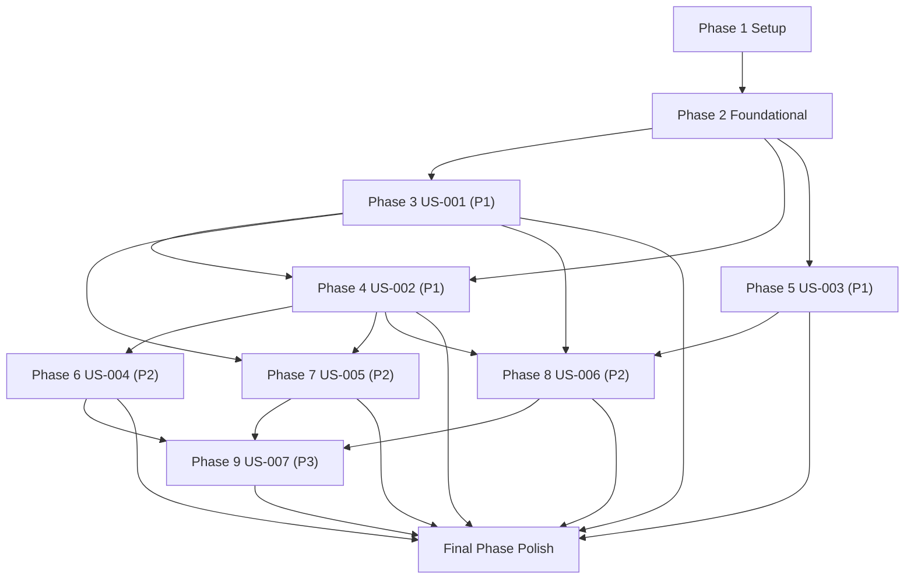

# Tasks: EnterpriseAI Student Vertical Builder

## Overview

- **Total task count**: 112
- **Parallel opportunity count**: 68
- **User story count**: 7 (US-001 through US-007)
- **Canonical feature directory**:
  `.specify/specs/029-enterpriseai-student-vertical-builder/` (use this concrete
  path whenever `{feature}` is resolved).

## Phase Dependency Graph

## Phase 1 Setup

**Phase Goal**: Establish profile controls, governance baseline, local EAI
references, and standard-profile regression baselines.

- [x] T001 [US-ALL] Add `gofer.workflowProfile` (`standard|enterpriseai`)
      configuration contract in `extension/package.json`.
- [x] T002 [US-ALL] Implement workflow profile accessor/validation helper in
      `extension/src/config/workflowProfile.ts`.
- [x] T003 [P] [US-ALL] Document phased rollout default (`standard`) and profile
      activation in `README.md` and `extension/README.md`.
- [x] T004 [P] [US-ALL] Seed local fallback references in
      `.specify/references/eai/README.md`, `.specify/references/eai/eai-cli.md`,
      `.specify/references/eai/vertical-template.md`, and
      `.specify/references/eai/deployment-repo.md`.
- [x] T005 [US-ALL] Preserve one-by-one architecture approval and no-removal
      governance instructions in `.claude/commands/0_business_scenario.md`.
- [x] T006 [US-ALL] Add `eai-cli` major.minor metadata placeholders to
      `.specify/templates/plan-template.md` and
      `.specify/templates/tasks-template.md`.
- [x] T007 [P] [US-ALL] Add `standard` profile regression baseline test in
      `tests/integration/workflow-profile-standard-baseline.test.ts`.
- [x] T008 [P] [US-ALL] Add `standard` profile regression baseline test in
      `extension/src/test/suite/workflow-profile-standard-baseline.integration.test.ts`.
- [x] T009 [P] [US-ALL] Add workflow profile activation integration test in
      `tests/integration/workflow-profile-enterpriseai.test.ts`.
- [x] T010 [P] [US-ALL] Add workflow profile activation integration test in
      `extension/src/test/suite/workflow-profile-enterpriseai.test.ts`.

**Phase Verification Checklist**

- [x] `gofer.workflowProfile` is discoverable, validated, and defaults to
      `standard`.
- [x] Local fallback references exist under `.specify/references/eai/` and are
      readable.
- [x] Governance prompt still enforces one-by-one approval and no-removal
      constraints.
- [x] Baseline tests prove no drift for `standard` profile behavior.

## Phase 2 Foundational

**Phase Goal**: Implement shared data contracts, validation, persistence, and
contract schema foundations that block all user stories.

- [x] T011 [US-ALL] Implement `WorkflowProfileConfig` and `PipelineRun` entities
      in `extension/src/services/enterpriseai/models/Workflow.ts`.
- [x] T012 [P] [US-ALL] Implement `EaiReferenceSource` and
      `ArchitectureDecision` entities in
      `extension/src/services/enterpriseai/models/Governance.ts`.
- [x] T013 [P] [US-ALL] Implement `ArtifactRecord` and `TaskItem` entities in
      `extension/src/services/enterpriseai/models/Artifacts.ts`.
- [x] T014 [P] [US-ALL] Implement `MirrorPropagationRecord` and
      `CapabilityRemovalApprovalRecord` entities in
      `extension/src/services/enterpriseai/models/Propagation.ts`.
- [x] T015 [US-ALL] Create explicit data-model implementation mapping for all 8
      entities in
      `extension/src/services/enterpriseai/models/EntityMappings.ts`.
- [x] T016 [US-ALL] Implement external→local fallback resolver in
      `extension/src/services/EAIReferenceResolver.ts`.
- [x] T017 [US-ALL] Implement installed `eai-cli` version detection and
      major.minor parser in
      `extension/src/services/enterpriseai/EaiCliVersion.ts`.
- [x] T018 [US-ALL] Implement artifact schemas for `business-analysis.md`,
      `market-analysis.md`, and Marp outputs, including run-completion gates for
      `referencedInSpec=true` and `referencedInPlan=true`, in
      `extension/src/services/enterpriseai/validation/ArtifactSchemas.ts`.
- [x] T019 [P] [US-ALL] Implement secret-safety validation rules in
      `extension/src/services/enterpriseai/validation/SecretSafetyValidator.ts`.
- [x] T020 [P] [US-ALL] Implement placeholder conventions enforcement in
      `extension/src/services/enterpriseai/validation/PlaceholderConventions.ts`.
- [x] T021 [US-ALL] Standardize runtime placeholder usage in
      `.specify/templates/spec-template.md`,
      `.specify/templates/plan-template.md`, and
      `.specify/templates/tasks-template.md`.
- [x] T022 [US-ALL] Implement approval-record persistence for
      `CapabilityRemovalApprovalRecord` fields (`approvalRecordId`, `runId`,
      `approver`, `decisionAt`, `changeSetId`, `changeSetSummary`,
      `capabilityAffected`, `decision`) in
      `extension/src/services/enterpriseai/persistence/CapabilityRemovalApprovalStore.ts`.
- [x] T023 [P] [US-ALL] Implement EVT payload schemas for `EVT-001` through
      `EVT-012` in
      `extension/src/services/enterpriseai/contracts/EventPayloadSchemas.ts`.
- [x] T024 [P] [US-ALL] Implement producer/consumer EVT payload validator in
      `extension/src/services/enterpriseai/contracts/EventPayloadValidator.ts`.
- [x] T025 [US-ALL] Implement internal API schemas for `IAP-001` through
      `IAP-011` in
      `extension/src/services/enterpriseai/contracts/InternalApiSchemas.ts`.
- [x] T026 [US-ALL] Implement `EXT-001` no-external-endpoint posture assertion
      in `extension/src/services/enterpriseai/contracts/ExternalApiPosture.ts`.
- [x] T112 [US-ALL] Document and validate language-server impact as none for
      this feature (no `language-server/` code changes required) in
      `.specify/specs/029-enterpriseai-student-vertical-builder/traceability.md`.
- [x] T027 [P] [US-ALL] Add unit tests for profile parsing, fallback resolution,
      and `eai-cli` pin metadata in
      `extension/src/test/suite/enterpriseai/workflow-profile-contracts.test.ts`.
- [x] T028 [P] [US-ALL] Add unit tests for artifact schema, placeholder
      conventions, and secret-safety validation in
      `extension/src/test/suite/enterpriseai/artifact-validation-contracts.test.ts`.
- [x] T029 [P] [US-ALL] Add unit tests for `CapabilityRemovalApprovalRecord`
      persistence round-trip in
      `extension/src/test/suite/enterpriseai/capability-approval-persistence.test.ts`.
- [x] T030 [P] [US-ALL] Add root integration EVT payload-compatibility tests for
      `EVT-001` through `EVT-012` in
      `tests/integration/enterpriseai/event-payload-validation.integration.test.ts`.
- [x] T031 [P] [US-ALL] Add extension integration EVT payload-compatibility
      tests for `EVT-001` through `EVT-012` in
      `extension/src/test/suite/enterpriseai/event-payload-validation.integration.test.ts`.
- [x] T032 [P] [US-ALL] Add root integration internal API schema tests for
      `IAP-001` through `IAP-011` in
      `tests/integration/enterpriseai/internal-api-schema-validation.integration.test.ts`.
- [x] T033 [P] [US-ALL] Add extension integration internal API schema tests for
      `IAP-001` through `IAP-011` in
      `extension/src/test/suite/enterpriseai/internal-api-schema-validation.integration.test.ts`.
- [x] T034 [P] [US-ALL] Add root integration `EXT-001` posture test in
      `tests/integration/enterpriseai/external-api-none-required.integration.test.ts`.
- [x] T035 [P] [US-ALL] Add extension integration `EXT-001` posture test in
      `extension/src/test/suite/enterpriseai/external-api-none-required.integration.test.ts`.

**Phase Verification Checklist**

- [x] All 8 data-model entities exist with validators and mappings.
- [x] Placeholder conventions and secret-safety rules are enforced in code and
      templates.
- [x] `CapabilityRemovalApprovalRecord` persistence round-trips required fields.
- [x] Schema validators exist for all IAP/EVT contracts and EXT-001 posture.
- [x] Language-server scope impact is explicitly validated/documented as none
      for this feature.
- [x] Root and extension foundational contract tests pass.

## Phase 3 User Story US-001 - EnterpriseAI Vertical App Discovery (Priority: P1)

**Phase Goal**: Make discovery and research EnterpriseAI-first while preserving
novice usability and one-by-one governance.

**Independent Test Criteria**: A novice user completes discovery without
external docs and gets EnterpriseAI-specific problem statement/persona/value
proposition with no non-EAI primary recommendations.

- [x] T036 [US-001] Update discovery guidance for EnterpriseAI-first framing and
      non-EAI primary-option exclusion in
      `.claude/commands/0_business_scenario.md`.
- [x] T037 [P] [US-001] Update research guidance for structured problem
      statement/persona/value proposition in
      `.claude/commands/1_gofer_research.md`.
- [x] T038 [US-001] Implement one-by-one architecture decision presentation gate
      in
      `extension/src/services/enterpriseai/governance/ArchitectureDecisionGate.ts`.
- [x] T039 [US-001] Integrate architecture decision gate into run orchestration
      in `extension/src/autonomous/ACCOrchestrator.ts`.
- [x] T040 [P] [US-001] Add root integration test for EnterpriseAI-first
      discovery output and non-EAI exclusion in
      `tests/integration/enterpriseai/discovery-enterpriseai-focus.integration.test.ts`.
- [x] T041 [P] [US-001] Add extension integration test for EnterpriseAI-first
      discovery output and non-EAI exclusion in
      `extension/src/test/suite/enterpriseai/discovery-enterpriseai-focus.integration.test.ts`.
- [x] T042 [P] [US-001] Add root novice walkthrough verification test (no
      external docs required) in
      `tests/integration/enterpriseai/novice-walkthrough-verification.integration.test.ts`.
- [x] T043 [P] [US-001] Add extension novice walkthrough verification test (no
      external docs required) in
      `extension/src/test/suite/enterpriseai/novice-walkthrough-verification.integration.test.ts`.

**Phase Verification Checklist**

- [x] Discovery and research outputs are EnterpriseAI-first.
- [x] Non-EAI deployment options are not presented as primary recommendations.
- [x] One-by-one architecture approval loop blocks lock-in until explicit
      decision.
- [x] Novice walkthrough tests pass in both root and extension integration
      suites.

## Phase 4 User Story US-002 - EnterpriseAI Architecture and Plan Generation (Priority: P1)

**Phase Goal**: Generate EnterpriseAI-specific spec/plan/tasks artifacts with
version pinning, integration maps, and runnable sequencing.

**Independent Test Criteria**: Running spec/plan/tasks with EnterpriseAI profile
generates integration map, EAI CLI + Vertical Template guidance, deployment
conventions, `market-analysis.md` generation/reference behavior, and pinned
`eai-cli` major.minor without breaking standard profile output.

- [x] T044 [P] [US-002] Update EnterpriseAI integration-map requirements in
      `.claude/commands/2_gofer_specify.md`.
- [x] T045 [P] [US-002] Update deployment convention and `eai-cli` major.minor
      requirements in `.claude/commands/3_gofer_plan.md`.
- [x] T046 [US-002] Update ordered runnable task-generation guidance in
      `.claude/commands/4_gofer_tasks.md`.
- [x] T047 [P] [US-002] Implement `IAP-001 workflow.activateProfile` and publish
      `EVT-001 workflow.profile.activated.v1` in
      `extension/src/services/enterpriseai/internalApi/WorkflowActivateProfile.ts`.
- [x] T048 [P] [US-002] Implement
      `IAP-002 governance.requestArchitectureDecision` and publish
      `EVT-002 governance.architecture-decision.requested.v1` in
      `extension/src/services/enterpriseai/internalApi/RequestArchitectureDecision.ts`.
- [x] T049 [P] [US-002] Implement
      `IAP-003 governance.recordArchitectureDecisionApproval` and publish
      `EVT-003 governance.architecture-decision.recorded.v1` in
      `extension/src/services/enterpriseai/internalApi/RecordArchitectureDecisionApproval.ts`.
- [x] T050 [US-002] Implement
      `IAP-006 planning.generateEnterpriseAiPlanAndTasks` and publish
      `EVT-006 artifacts.plan.tasks.generated.v1`, generating/attaching
      `market-analysis.md` metadata when competitive analysis is enabled and
      enforcing required reference indicators plus pinned `eai-cli` metadata in
      `extension/src/services/enterpriseai/internalApi/GenerateEnterpriseAiPlanAndTasks.ts`.
- [x] T051 [US-002] Add root integration test for EnterpriseAI plan/tasks
      generation (integration map, deployment conventions, `market-analysis.md`
      generation/reference, pinned `eai-cli`) in
      `tests/integration/enterpriseai/plan-task-generation.integration.test.ts`.
- [x] T052 [US-002] Add extension integration test for EnterpriseAI plan/tasks
      generation and `market-analysis.md` reference propagation in
      `extension/src/test/suite/enterpriseai/plan-task-generation.integration.test.ts`.
- [x] T053 [P] [US-002] Add root standard-profile regression test for unchanged
      plan behavior in
      `tests/integration/enterpriseai/plan-standard-profile-regression.integration.test.ts`.

**Phase Verification Checklist**

- [x] Spec/plan/tasks include EnterpriseAI integration map and deployment
      conventions.
- [x] `eai-cli` major.minor pin is recorded in generated artifacts.
- [x] `market-analysis.md` generation/reference indicators are present when
      competitive analysis is enabled.
- [x] `IAP-001/002/003/006` handlers and `EVT-001/002/003/006` publishing are
      wired.
- [x] Root and extension integration tests pass for EnterpriseAI and standard
      profiles.

## Phase 5 User Story US-003 - Marp Presentation Artifact Generation (Priority: P1)

**Phase Goal**: Add optional-but-default-recommended Marp deck generation while
preserving release notes and demo scripts.

**Independent Test Criteria**: Stakeholder comms run with Marp enabled writes a
valid deck to
`.specify/specs/029-enterpriseai-student-vertical-builder/presentation.marp.md`
and preserves existing comms artifacts.

- [x] T054 [US-003] Update stakeholder comms flow for opt-in/default-recommended
      Marp behavior in `.claude/commands/7a_stakeholder_comms.md`.
- [x] T055 [P] [US-003] Add required Marp deck section template content in
      `.specify/templates/stakeholder-comms-template.md` and
      `.claude/commands/7a_stakeholder_comms.md`.
- [x] T056 [US-003] Implement `IAP-007 comms.generateStakeholderArtifacts` and
      publish `EVT-007 artifacts.stakeholder-comms.generated.v1` in
      `extension/src/services/enterpriseai/internalApi/GenerateStakeholderArtifacts.ts`.
- [x] T057 [US-003] Implement stakeholder comms event publish/consume handlers
      for `EVT-007` in
      `extension/src/services/enterpriseai/events/StakeholderCommsEvents.ts`.
- [x] T058 [P] [US-003] Add root integration Marp output location assertion for
      `.specify/specs/{feature}/presentation.marp.md` (concrete path
      `.specify/specs/029-enterpriseai-student-vertical-builder/presentation.marp.md`)
      in `tests/integration/stakeholder-marp-output.test.ts`.
- [x] T059 [P] [US-003] Add extension integration Marp output location assertion
      for `.specify/specs/{feature}/presentation.marp.md` (concrete path
      `.specify/specs/029-enterpriseai-student-vertical-builder/presentation.marp.md`)
      in
      `extension/src/test/suite/enterpriseai/stakeholder-marp-output.integration.test.ts`.
- [x] T060 [P] [US-003] Add root integration test for Marp section completeness
      and legacy comms output preservation in
      `tests/integration/enterpriseai/marp-content-completeness.integration.test.ts`.
- [x] T061 [P] [US-003] Add extension integration test for Marp opt-in behavior
      and release-notes/demo-script preservation in
      `extension/src/test/suite/enterpriseai/marp-opt-in-preservation.integration.test.ts`.

**Phase Verification Checklist**

- [x] Marp generation is opt-in and recommended by default for EnterpriseAI
      runs.
- [x] Deck includes required sections and Marp frontmatter.
- [x] Output path assertion passes for
      `.specify/specs/{feature}/presentation.marp.md`.
- [x] Release notes and demo script outputs remain functional.

## Phase 6 User Story US-004 - EnterpriseAI Deployment Guidance (Priority: P2)

**Phase Goal**: Make deployment guidance runnable, ordered, and guarded by
readiness/fallback behavior.

**Independent Test Criteria**: Generated tasks provide scaffold-before-deploy
sequence, deployment conventions, local-fallback notices when needed, and block
deployment completion until required files exist.

- [x] T062 [US-004] Add deployment preflight checks (manifest/config gate) in
      `.claude/commands/5_gofer_implement.md`.
- [x] T063 [P] [US-004] Add Vertical Template scaffold-before-deploy ordering
      and EAI CLI syntax guidance in `.claude/commands/4_gofer_tasks.md`.
- [x] T064 [US-004] Implement `IAP-004 references.resolveEnterpriseAiReferences`
      using fallback path `.specify/references/eai/` in
      `extension/src/services/enterpriseai/internalApi/ResolveEnterpriseAiReferences.ts`
      and wire launch-time preflight invocation in
      `extension/src/autonomousCommands.ts`.
- [x] T065 [US-004] Implement
      `IAP-011 implementation.validateDeploymentReadiness` in
      `extension/src/services/enterpriseai/internalApi/ValidateDeploymentReadiness.ts`
      and enforce completion-time gating in `extension/src/progressProvider.ts`.
- [x] T066 [P] [US-004] Implement `EVT-004 references.eai-fallback.used.v1`
      publish/consume and user notice dispatch in
      `extension/src/services/enterpriseai/events/ReferenceFallbackEvents.ts`.
- [x] T067 [P] [US-004] Implement `EVT-012 deployment.readiness.validated.v1`
      publish/consume wiring in
      `extension/src/services/enterpriseai/events/DeploymentReadinessEvents.ts`.
- [x] T068 [P] [US-004] Add root integration test for scaffold-before-deploy
      ordering and required-file gate in
      `tests/integration/enterpriseai/deployment-guidance-ordering.integration.test.ts`.
- [x] T069 [P] [US-004] Add extension integration test for deployment readiness
      gate blocking in
      `extension/src/test/suite/enterpriseai/deployment-readiness-gate.integration.test.ts`.
- [x] T070 [P] [US-004] Add fallback-notice integration tests in
      `tests/integration/enterpriseai/reference-fallback-notice.integration.test.ts`
      and
      `extension/src/test/suite/enterpriseai/reference-fallback-notice.integration.test.ts`.

**Phase Verification Checklist**

- [x] Task ordering guarantees scaffolding before deployment.
- [x] Deployment-required files are validated before completion is allowed.
- [x] Runtime fallback uses local references and surfaces user-visible notices.
- [x] Root and extension integration tests pass for deployment guidance paths.

## Phase 7 User Story US-005 - Competitive and Market Analysis for Student Positioning (Priority: P2)

**Phase Goal**: Produce optional, structured market analysis with enforced
minimum alternatives and downstream references.

**Independent Test Criteria**: Research stage generates `market-analysis.md`
with at least three alternatives when enabled, positions EnterpriseAI
explicitly, references spec/plan, and does not break pipeline when disabled.

- [x] T071 [US-005] Implement
      `IAP-005 research.generateBusinessAndMarketArtifacts` in
      `extension/src/services/enterpriseai/internalApi/GenerateBusinessAndMarketArtifacts.ts`.
- [x] T072 [P] [US-005] Add optional competitive-analysis stage flag logic in
      `.claude/commands/1_gofer_research.md`.
- [x] T073 [P] [US-005] Require `market-analysis.md` references in generated
      spec/plan outputs via `.claude/commands/2_gofer_specify.md` and
      `.claude/commands/3_gofer_plan.md`.
- [x] T074 [US-005] Enforce `alternativeCount >= 3` and
      `referencedInSpec/referencedInPlan` validation in
      `extension/src/services/enterpriseai/validation/MarketAnalysisValidator.ts`.
- [x] T075 [US-005] Add business-analysis and market-analysis artifact templates
      with explicit EnterpriseAI-selected direction rationale fields in
      `.specify/templates/spec-template.md` and
      `.specify/templates/plan-template.md`.
- [x] T076 [P] [US-005] Implement `EVT-005 artifacts.research.generated.v1`
      publish/consume handlers in
      `extension/src/services/enterpriseai/events/ResearchArtifactEvents.ts`.
- [x] T077 [P] [US-005] Add root integration test for market-analysis generation
      and minimum alternatives in
      `tests/integration/enterpriseai/market-analysis.integration.test.ts`.
- [x] T078 [P] [US-005] Add extension integration test for
      competitive-analysis-disabled continuity in
      `extension/src/test/suite/enterpriseai/market-analysis-flag.integration.test.ts`.

**Phase Verification Checklist**

- [x] Competitive analysis depth works when enabled, and `market-analysis.md`
      still generates baseline traceability output when disabled.
- [x] `market-analysis.md` enforces at least three alternatives.
- [x] Generated spec/plan outputs reference market-analysis artifacts when
      competitive analysis is enabled.
- [x] Root and extension integration tests pass for both enabled and disabled
      flows.

## Phase 8 User Story US-006 - All-Platform Artifact Parity After EAI Profile Updates (Priority: P2)

**Phase Goal**: Propagate canonical updates safely to all mirrors and runtime
resources with parity guarantees.

**Independent Test Criteria**: Canonical command edits regenerate all
mirrors/resources with no manual mirror edits, parity tests pass, and runtime
sync remains non-destructive.

- [x] T079 [US-006] Extend profile-aware generation/metadata propagation in
      `scripts/generate-commands.ts`.
- [x] T080 [P] [US-006] Regenerate mirror outputs from canonical sources in
      `.github/prompts/`, `.system/skills/`, and `.agents/skills/`.
- [x] T081 [US-006] Implement migration-safe non-destructive sync updates in
      `extension/src/services/migration/ResourceSyncer.ts`.
- [x] T082 [P] [US-006] Add profile-aware guidance selection without route
      removal in `extension/src/council/CrossPlatformCommandRouter.ts`.
- [x] T083 [P] [US-006] Preserve provider/CLI compatibility paths while applying
      profile context in `extension/src/council/providers/ProviderFactory.ts`
      and `extension/src/council/providers/ProviderFactoryCliResolver.ts`.
- [x] T084 [US-006] Implement `IAP-008 artifacts.propagateCanonicalMirrors` in
      `extension/src/services/enterpriseai/internalApi/PropagateCanonicalMirrors.ts`.
- [x] T085 [US-006] Implement
      `EVT-008 artifacts.mirror-propagation.completed.v1` publish/consume and
      parity trigger in
      `extension/src/services/enterpriseai/events/MirrorPropagationEvents.ts`.
- [x] T086 [P] [US-006] Add root parity integration assertions in
      `tests/integration/cross-platform-parity.test.ts` and
      `tests/integration/enterpriseai/canonical-mirror-parity.integration.test.ts`.
- [x] T087 [P] [US-006] Add extension runtime sync parity integration test in
      `extension/src/test/suite/enterpriseai/resource-sync-parity.integration.test.ts`.
- [x] T088 [P] [US-006] Add root integration assertion that canonical updates
      require no manual mirror edits in
      `tests/integration/command-generation.test.ts`.

**Phase Verification Checklist**

- [x] Canonical-to-mirror generation updates all targets consistently.
- [x] Runtime resource sync remains migration-safe and non-destructive.
- [x] Routing/provider compatibility remains intact.
- [x] Parity tests pass across mirrors and runtime resource paths.

## Phase 9 User Story US-007 - Existing Gofer Functionality Fully Preserved (Priority: P3)

**Phase Goal**: Enforce no-regression and explicit-approval governance for any
capability-affecting changes.

**Independent Test Criteria**: Existing non-EAI workflows, provider/routing
paths, and parity suites pass unchanged; capability-affecting changes are
blocked without explicit approval records.

- [x] T089 [US-007] Implement capability-removal approval gate reading persisted
      approval fields in
      `extension/src/services/enterpriseai/governance/CapabilityRemovalApprovalGate.ts`.
- [x] T090 [US-007] Integrate approval gate into validation/release flow in
      `extension/src/autonomous/CheckpointValidator.ts`.
- [x] T091 [US-007] Implement `IAP-010 validation.runCompatibilityAndParityGate`
      in
      `extension/src/services/enterpriseai/internalApi/RunCompatibilityAndParityGate.ts`.
- [x] T092 [US-007] Implement `IAP-009 positioning.updateExtensionMessaging` and
      emit `EVT-009 positioning.enterpriseai-updated.v1` in
      `extension/src/services/enterpriseai/internalApi/UpdateExtensionMessaging.ts`.
- [x] T093 [P] [US-007] Implement
      `EVT-010 validation.compatibility-parity.completed.v1` publish/consume
      wiring in
      `extension/src/services/enterpriseai/events/CompatibilityParityEvents.ts`.
- [x] T094 [P] [US-007] Implement
      `EVT-011 governance.capability-removal.approval-required.v1`
      publish/consume blocking behavior in
      `extension/src/services/enterpriseai/events/CapabilityRemovalEvents.ts`.
- [x] T095 [P] [US-007] Add root regression test for unchanged non-EAI outputs
      in
      `tests/integration/enterpriseai/non-eai-output-regression.integration.test.ts`.
- [x] T096 [P] [US-007] Add extension integration regression test for preserved
      provider/routing/CLI detection behavior in
      `extension/src/test/suite/enterpriseai/non-eai-routing-regression.integration.test.ts`.
- [x] T097 [P] [US-007] Add approval-record persistence enforcement tests in
      `tests/integration/enterpriseai/capability-removal-approval.integration.test.ts`
      and
      `extension/src/test/suite/enterpriseai/capability-removal-approval.integration.test.ts`.
- [x] T098 [P] [US-007] Add governance approval-loop integration test for
      recorded decision events in
      `tests/integration/enterpriseai/architecture-approval-loop.integration.test.ts`.

**Phase Verification Checklist**

- [x] Capability-removal changes are blocked without explicit per-capability
      approvals.
- [x] Non-EAI behavior and provider/routing paths remain unchanged.
- [x] Compatibility/parity gate handlers and events are wired.
- [x] Root and extension preservation-focused integration suites pass.

## Final Phase Polish

**Phase Goal**: Complete cross-cutting positioning, context-health,
contract-coverage, and release-readiness gates.

- [x] T099 [US-ALL] Update EnterpriseAI-first messaging surfaces in
      `extension/package.json`, `extension/README.md`, `README.md`, and
      `extension/src/extension.ts`, and update onboarding messaging assertions
      in `extension/src/test/suite/onboarding-messaging.test.ts`.
- [x] T100 [P] [US-ALL] Implement `EVT-009 positioning.enterpriseai-updated.v1`
      publish/consume handlers in
      `extension/src/services/enterpriseai/events/PositioningEvents.ts`.
- [x] T101 [US-ALL] Implement context-budget warning behavior (NFR-003) in
      `extension/src/autonomous/ContextHealthMonitor.ts` and
      `extension/src/autonomous/StageContextProfile.ts`.
- [x] T102 [P] [US-ALL] Add root integration test for context-budget warning
      emission and conciseness threshold handling in
      `tests/integration/enterpriseai/context-budget-warning.integration.test.ts`.
- [x] T103 [P] [US-ALL] Add extension integration test for user-visible
      context-budget warnings in
      `extension/src/test/suite/enterpriseai/context-budget-warning.integration.test.ts`.
- [x] T104 [US-ALL] Implement end-to-end event contract coverage gate (payload
      schema + publish + consume + gate) for `EVT-001` through `EVT-012` in
      `tests/integration/event-contract-coverage.test.ts`.
- [x] T105 [P] [US-ALL] Implement internal API and external posture contract
      coverage gate for `IAP-001` through `IAP-011` and `EXT-001` in
      `tests/integration/enterpriseai/internal-api-contract-coverage.integration.test.ts`.
- [x] T106 [P] [US-ALL] Add extension integration contract coverage suite for
      `IAP-001` through `IAP-011` and `EVT-001` through `EVT-012` in
      `extension/src/test/suite/enterpriseai/contract-coverage.integration.test.ts`.
- [x] T107 [P] [US-ALL] Add integration placeholder conventions enforcement
      checks in
      `tests/integration/enterpriseai/placeholder-conventions.integration.test.ts`.
- [x] T108 [P] [US-ALL] Add end-to-end novice walkthrough verification in
      `tests/integration/enterpriseai/novice-e2e-walkthrough.integration.test.ts`
      and
      `extension/src/test/suite/enterpriseai/novice-e2e-walkthrough.integration.test.ts`.
- [x] T109 [US-ALL] Create dual-profile validation runner (`standard` +
      `enterpriseai`) that executes existing unit/integration/parity suites
      unchanged in `scripts/enterpriseai-validation-matrix.sh`.
- [x] T110 [US-ALL] Update release-readiness assertions for deployment
      conventions, `eai-cli` pinning, and Marp path in
      `.specify/specs/029-enterpriseai-student-vertical-builder/quickstart.md`.
- [x] T111 [US-ALL] Execute generation + sync + validation matrix using
      `scripts/generate-commands.ts` and
      `scripts/enterpriseai-validation-matrix.sh`, and record pass criteria in
      `.specify/specs/029-enterpriseai-student-vertical-builder/quickstart.md`.

**Phase Verification Checklist**

- [x] Product messaging, context-budget warnings, and fallback notices are
      visible and validated.
- [x] Contract-coverage gates pass for all EVT, IAP, and EXT contract IDs.
- [x] Root and extension integration coverage includes novice walkthrough and
      Marp path assertions.
- [x] Final generation/parity/regression matrix passes for both profiles.

## Dependencies & Execution Order

### Phase Dependencies

1. **Phase 1 Setup** has no prerequisites.
2. **Phase 2 Foundational** depends on Phase 1 and blocks all user stories.
3. **Phase 3 (US-001), Phase 4 (US-002), Phase 5 (US-003)** start after Phase 2,
   with US-001 before US-002 for discovery-to-architecture continuity.
4. **Phase 6 (US-004)** depends on US-002 task structure and deployment
   metadata.
5. **Phase 7 (US-005)** depends on US-001/US-002 research/spec linkage.
6. **Phase 8 (US-006)** depends on canonical command updates from P1 stories.
7. **Phase 9 (US-007)** depends on deployment/parity/governance work from
   earlier phases.
8. **Final Phase Polish** depends on completion of all user story phases.

### Within-Phase Rules

- Tasks marked `[P]` are parallel-safe within their phase (different files, no
  direct dependency).
- Non-`[P]` tasks should be executed in listed order.
- Root and extension integration tests must both be updated for cross-surface
  behavior changes.

## Plan Phase-to-Task Phase Traceability (plan.md Phase 1-5)

| Plan Phase (plan.md)        | Task Phase Alignment in This File             | Checkpoints/Gates                                                                                                  |
| --------------------------- | --------------------------------------------- | ------------------------------------------------------------------------------------------------------------------ |
| Phase 1 Setup/Foundation    | Phase 1 Setup (T001-T010)                     | Phase 1 Verification Checklist and standard-profile baseline gates (T007-T010).                                    |
| Phase 2 Data Layer          | Phase 2 Foundational (T011-T035, T112)        | Phase 2 Verification Checklist, contract validation tasks (T030-T035), and language-server no-impact check (T112). |
| Phase 3 Business Logic      | Phases 3-7 (T036-T078)                        | US-phase independent test criteria plus Phase 3-7 verification checklists.                                         |
| Phase 4 API/Interface Layer | Phases 4-9 API/event wiring tasks (T047-T098) | EVT/IAP/EXT contract checkpoints (T023-T026, T030-T035, T104-T106).                                                |
| Phase 5 Polish/Integration  | Final Phase Polish (T099-T111)                | Final Phase Verification Checklist and dual-profile validation matrix gates (T109, T111).                          |

## Parallel Execution Guide

- **Phase 1**: T003, T004, T007, T008, T009, T010
- **Phase 2**: T012, T013, T014, T019, T020, T023, T024, T027, T028, T029, T030,
  T031, T032, T033, T034, T035
- **Phase 3**: T037, T040, T041, T042, T043
- **Phase 4**: T044, T045, T047, T048, T049, T053
- **Phase 5**: T055, T058, T059, T060, T061
- **Phase 6**: T063, T066, T067, T068, T069, T070
- **Phase 7**: T072, T073, T076, T077, T078
- **Phase 8**: T080, T082, T083, T086, T087, T088
- **Phase 9**: T093, T094, T095, T096, T097, T098
- **Final Phase**: T100, T102, T103, T105, T106, T107, T108

## Implementation Strategy

### MVP First (P1 Stories)

1. Complete Phase 1 and Phase 2.
2. Deliver US-001 (Phase 3) for discovery reliability.
3. Deliver US-002 (Phase 4) for architecture/plan/tasks generation.
4. Deliver US-003 (Phase 5) for stakeholder Marp output.
5. Validate MVP with root + extension integration tests before moving to P2
   stories.

### Incremental Delivery

1. Add US-004 deployment readiness and fallback.
2. Add US-005 market analysis depth.
3. Add US-006 canonical parity propagation and runtime sync hardening.
4. Add US-007 preservation and no-removal governance enforcement.

### Polish Last

1. Apply cross-cutting context-budget warnings, positioning, and full contract
   gates.
2. Run dual-profile validation matrix and parity checks.
3. Confirm release-readiness evidence in quickstart and integration suites.

## Plan Task Coverage Mapping (P1.1–P5.8)

| Plan Item | Mapped Tasks                                                                                               |
| --------- | ---------------------------------------------------------------------------------------------------------- |
| P1.1      | T001, T002                                                                                                 |
| P1.2      | T003                                                                                                       |
| P1.3      | T004                                                                                                       |
| P1.4      | T005, T038, T039                                                                                           |
| P1.5      | T006, T017, T045, T050                                                                                     |
| P1.6      | T007, T008, T053, T095                                                                                     |
| P2.1      | T011, T012, T013, T014                                                                                     |
| P2.2      | T016, T064, T066, T070                                                                                     |
| P2.3      | T017, T045, T050                                                                                           |
| P2.4      | T018, T071, T074, T075                                                                                     |
| P2.5      | T019, T028, T102                                                                                           |
| P2.6      | T027, T028, T029                                                                                           |
| P2.7      | T020, T021, T107                                                                                           |
| P2.8      | T011, T012, T013, T014, T015                                                                               |
| P2.9      | T022, T089, T097                                                                                           |
| P2.10     | T023, T024, T030, T031, T104                                                                               |
| P3.1      | T036, T037, T040, T041                                                                                     |
| P3.2      | T044, T045, T073                                                                                           |
| P3.3      | T046, T062, T063                                                                                           |
| P3.4      | T054, T056, T058, T059                                                                                     |
| P3.5      | T005, T036, T044, T045, T046, T054                                                                         |
| P3.6      | T055, T075                                                                                                 |
| P3.7      | T057, T066, T067, T076, T085, T093, T094, T104                                                             |
| P4.1      | T079                                                                                                       |
| P4.2      | T080                                                                                                       |
| P4.3      | T081, T087                                                                                                 |
| P4.4      | T082, T083, T096                                                                                           |
| P4.5      | T092, T099, T100                                                                                           |
| P4.6      | T064, T066, T070                                                                                           |
| P4.7      | T101, T102, T103                                                                                           |
| P5.1      | T079, T080, T081, T086, T088, T111                                                                         |
| P5.2      | T040, T041, T042, T043, T051, T052, T058, T059, T068, T069, T070, T077, T078, T086, T087, T095, T096, T108 |
| P5.3      | T109, T111                                                                                                 |
| P5.4      | T089, T090, T097                                                                                           |
| P5.5      | T019, T020, T101, T102, T103, T107                                                                         |
| P5.6      | T045, T050, T110, T111                                                                                     |
| P5.7      | T065, T067, T068, T069                                                                                     |
| P5.8      | T104, T105, T106                                                                                           |

## Acceptance Criteria Coverage Mapping (36/36)

> AC numbering follows bullet order in `spec.md` for each user story.

| Acceptance Criterion | Mapped Tasks                       |
| -------------------- | ---------------------------------- |
| US-001.AC1           | T036, T037, T040, T041             |
| US-001.AC2           | T037, T040, T042, T043             |
| US-001.AC3           | T036, T040, T041                   |
| US-001.AC4           | T004, T042, T043, T108             |
| US-001.AC5           | T005, T038, T039, T098             |
| US-002.AC1           | T045, T046, T050, T051, T052       |
| US-002.AC2           | T044, T045, T051                   |
| US-002.AC3           | T046, T063, T068                   |
| US-002.AC4           | T050, T051, T052, T071, T073, T077 |
| US-002.AC5           | T079, T080, T086, T104             |
| US-002.AC6           | T053, T095, T096, T109             |
| US-003.AC1           | T054, T056, T058, T059             |
| US-003.AC2           | T056, T060, T061                   |
| US-003.AC3           | T055, T060                         |
| US-003.AC4           | T054, T061                         |
| US-003.AC5           | T056, T060, T061                   |
| US-004.AC1           | T063, T065, T068                   |
| US-004.AC2           | T063, T068                         |
| US-004.AC3           | T045, T063, T068, T110             |
| US-004.AC4           | T064, T066, T070                   |
| US-004.AC5           | T062, T065, T067, T069             |
| US-005.AC1           | T071, T072, T077                   |
| US-005.AC2           | T074, T077                         |
| US-005.AC3           | T071, T072, T075, T077             |
| US-005.AC4           | T073, T074, T077                   |
| US-005.AC5           | T071, T072, T078                   |
| US-006.AC1           | T079, T080, T084, T088             |
| US-006.AC2           | T086, T104, T109, T111             |
| US-006.AC3           | T081, T087                         |
| US-006.AC4           | T079, T080, T088                   |
| US-006.AC5           | T082, T083, T096                   |
| US-007.AC1           | T007, T008, T095, T096, T109       |
| US-007.AC2           | T086, T104, T109                   |
| US-007.AC3           | T082, T083, T096                   |
| US-007.AC4           | T053, T095, T109                   |
| US-007.AC5           | T022, T089, T090, T094, T097       |

## Data Model Entity Coverage (8/8)

| Data Model Entity               | Implementing Tasks           |
| ------------------------------- | ---------------------------- |
| WorkflowProfileConfig           | T001, T002, T011             |
| PipelineRun                     | T011, T039, T091             |
| EaiReferenceSource              | T012, T016, T064             |
| ArchitectureDecision            | T012, T038, T048, T049, T098 |
| ArtifactRecord                  | T013, T018, T071             |
| TaskItem                        | T013, T046, T063, T068       |
| MirrorPropagationRecord         | T014, T084, T085, T086       |
| CapabilityRemovalApprovalRecord | T014, T022, T089, T097       |

## Contract Coverage Mapping

### Internal API Contracts (IAP-001 through IAP-011)

| Contract ID | Implementing/Validation Tasks      |
| ----------- | ---------------------------------- |
| IAP-001     | T001, T002, T047, T082, T105, T106 |
| IAP-002     | T048, T098, T105, T106             |
| IAP-003     | T049, T097, T098, T105, T106       |
| IAP-004     | T064, T070, T105, T106             |
| IAP-005     | T071, T077, T078, T105, T106       |
| IAP-006     | T050, T051, T052, T105, T106       |
| IAP-007     | T056, T058, T059, T060, T105, T106 |
| IAP-008     | T084, T085, T086, T087, T105, T106 |
| IAP-009     | T092, T099, T100, T105, T106       |
| IAP-010     | T091, T093, T095, T096, T105, T106 |
| IAP-011     | T065, T067, T069, T105, T106       |

### Event Contracts (EVT-001 through EVT-012)

| Contract ID | Implementing/Validation Tasks                  |
| ----------- | ---------------------------------------------- |
| EVT-001     | T047, T030, T031, T104, T106                   |
| EVT-002     | T048, T030, T031, T104, T106                   |
| EVT-003     | T049, T098, T030, T031, T104, T106             |
| EVT-004     | T066, T070, T030, T031, T104, T106             |
| EVT-005     | T076, T077, T078, T030, T031, T104, T106       |
| EVT-006     | T050, T051, T052, T030, T031, T104, T106       |
| EVT-007     | T056, T057, T058, T059, T030, T031, T104, T106 |
| EVT-008     | T085, T086, T087, T030, T031, T104, T106       |
| EVT-009     | T092, T100, T030, T031, T104, T106             |
| EVT-010     | T093, T095, T096, T030, T031, T104, T106       |
| EVT-011     | T094, T097, T030, T031, T104, T106             |
| EVT-012     | T067, T068, T069, T030, T031, T104, T106       |

### External API Posture Contract

| Contract ID | Implementing/Validation Tasks |
| ----------- | ----------------------------- |
| EXT-001     | T026, T034, T035, T105, T106  |
