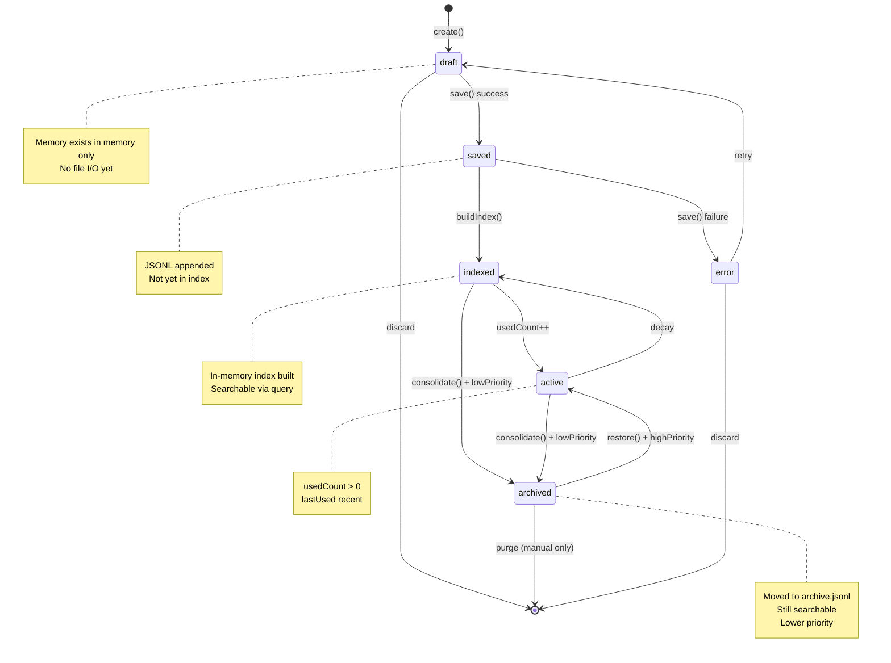
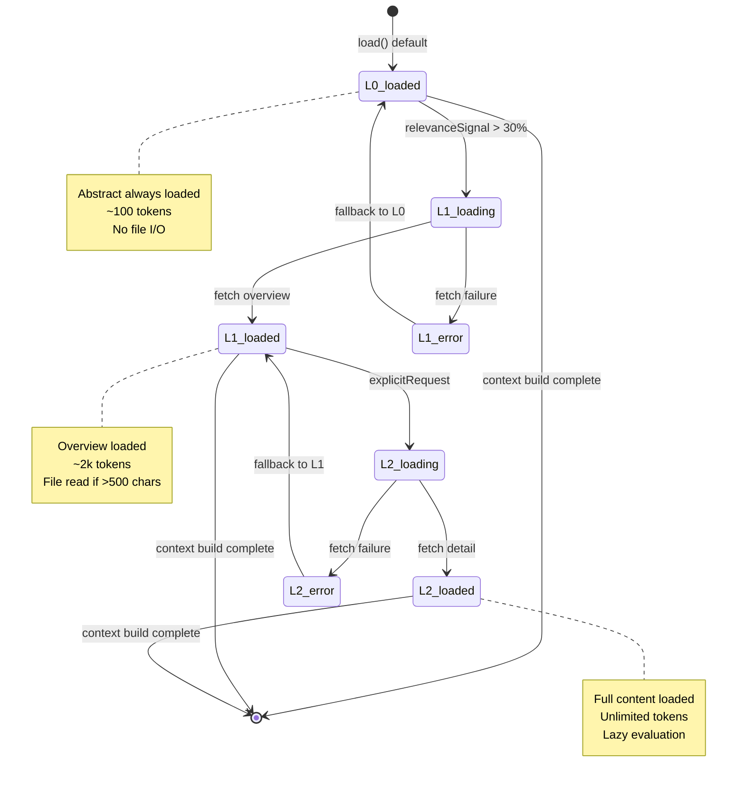
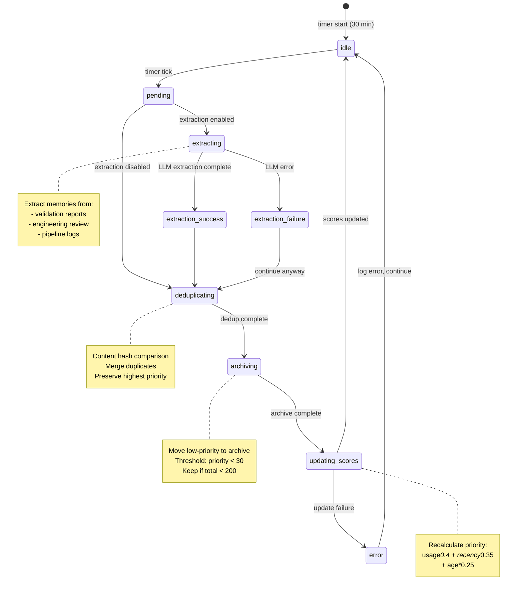

# Data Model: Memory System v2

## 1. Entity Definitions

### 1.1 Memory (Enhanced)

Memory represents a persistent unit of knowledge that can be retrieved and
applied across pipeline stages and sub-agent dispatches.

#### Fields

| Field             | Type                | Required | Description                                                                                                                    |
| ----------------- | ------------------- | -------- | ------------------------------------------------------------------------------------------------------------------------------ |
| `id`              | string              | Yes      | Content hash-based unique identifier (SHA-256 first 16 chars)                                                                  |
| `category`        | MemoryCategory      | Yes      | Classification: validation_pattern \| lesson \| codebase_pattern \| decision \| user_preference \| task_context \| observation |
| `type`            | MemoryCognitiveType | Yes      | Cognitive type: procedural \| episodic \| semantic \| prospective                                                              |
| `content`         | string              | Yes      | Full memory content (stored in .md file if >500 chars)                                                                         |
| `layers`          | ContextLayer        | No       | Tiered loading layers (L0/L1/L2). If absent, backward-compatible loading via detail tier                                       |
| `tags`            | string[]            | No       | Freeform tags with # prefix (e.g., #validation, #security)                                                                     |
| `citations`       | Citation[]          | No       | File/line references where pattern applies                                                                                     |
| `scope`           | MemoryScope         | Yes      | Visibility: local (workspace) \| global (cross-workspace) \| agent (agent-specific) \| session (temporary)                     |
| `priority`        | number              | No       | Computed priority score (0-100). Default: 50                                                                                   |
| `usedCount`       | number              | No       | Usage counter for importance weighting. Default: 0                                                                             |
| `lastUsed`        | ISO8601             | No       | Last access timestamp                                                                                                          |
| `createdAt`       | ISO8601             | Yes      | Creation timestamp                                                                                                             |
| `createdBy`       | string              | No       | Agent ID or user identifier                                                                                                    |
| `relatedMemories` | RelatedMemory[]     | No       | Zettelkasten-style bidirectional links                                                                                         |
| `archived`        | boolean             | No       | Whether memory is in archive tier. Default: false                                                                              |
| `schemaVersion`   | number              | Yes      | JSONL schema version for migration tracking. Current: 2                                                                        |

#### Types

```typescript
type MemoryCategory =
  | 'validation_pattern' // Recurring validation issues
  | 'lesson' // Learnings from corrections
  | 'codebase_pattern' // Architectural patterns found
  | 'decision' // Design decisions made
  | 'user_preference' // User-specific preferences
  | 'task_context' // Task-specific context
  | 'observation'; // Runtime observations

type MemoryCognitiveType =
  | 'procedural' // How-to patterns (e.g., "check for SQL injection via grep")
  | 'episodic' // Past events (e.g., "feature 027 had auth bug")
  | 'semantic' // Facts and concepts (e.g., "JWT tokens expire in 24h")
  | 'prospective'; // Future intentions (e.g., "migrate to OAuth2 in v3")

type MemoryScope =
  | 'local' // .specify/memory/memories.jsonl
  | 'global' // VSCode globalState (cross-workspace)
  | 'agent' // .specify/memory/agent/{agent-id}.jsonl
  | 'session'; // .specify/specs/{feature}/session-*.jsonl
```

#### Citation Structure

```typescript
interface Citation {
  file: string; // Absolute or workspace-relative path
  line?: number; // Optional line number
  context?: string; // Optional 1-line context snippet
}
```

#### Related Memory Structure

```typescript
interface RelatedMemory {
  id: string; // Memory ID
  similarity: number; // Jaccard similarity score (0-1)
  reason?: string; // Optional explanation
}
```

#### Example JSON (JSONL Storage)

```json
{
  "id": "a1b2c3d4e5f6g7h8",
  "category": "validation_pattern",
  "type": "procedural",
  "content": "SQL injection via string concatenation in queries. Grep for `\"SELECT.*\" + var` or `${var}` in SQL.",
  "layers": {
    "abstract": "SQL injection via string concatenation detected in queries.",
    "overview": "Pattern found in features 023, 024, 027. Detection: grep for string concatenation in SQL queries. Citation: extension/src/db/queries.ts:45",
    "detail": null
  },
  "tags": ["#validation", "#security", "#sql-injection", "#red"],
  "citations": [
    {
      "file": "extension/src/db/queries.ts",
      "line": 45,
      "context": "const query = \"SELECT * FROM users WHERE id=\" + userId;"
    }
  ],
  "scope": "local",
  "priority": 87.3,
  "usedCount": 5,
  "lastUsed": "2026-03-19T21:45:00Z",
  "createdAt": "2026-02-15T14:30:00Z",
  "createdBy": "validation-security",
  "relatedMemories": [
    {
      "id": "b2c3d4e5f6g7h8i9",
      "similarity": 0.68,
      "reason": "Both security patterns"
    }
  ],
  "archived": false,
  "schemaVersion": 2
}
```

#### Example Markdown File (>500 chars)

````markdown
---
id: a1b2c3d4e5f6g7h8
category: validation_pattern
type: procedural
tags:
  - '#validation'
  - '#security'
  - '#sql-injection'
scope: local
priority: 87.3
usedCount: 5
lastUsed: 2026-03-19T21:45:00Z
createdAt: 2026-02-15T14:30:00Z
createdBy: validation-security
archived: false
schemaVersion: 2
---

# L0: Abstract (~100 tokens)

SQL injection via string concatenation detected in queries.

# L1: Overview (~2k tokens)

## Pattern Description

SQL injection vulnerability found via string concatenation in database queries.
Detected in features 023, 024, and 027.

## Detection Method

```bash
grep -r '"SELECT.*" + ' extension/src/db/
grep -r '\${.*}' extension/src/db/*.sql
```
````

## Affected Files

- extension/src/db/queries.ts:45
- extension/src/api/userController.ts:89

## Remediation

Use parameterized queries or prepared statements.

# L2: Detail (unlimited)

[Full content from `content` field loaded lazily]

````

#### Validation Rules

1. `id` MUST be 16-char lowercase hex (SHA-256 hash prefix)
2. `category` and `type` MUST be valid enum values
3. `tags` MUST start with `#` prefix
4. `priority` MUST be 0-100 inclusive
5. `usedCount` MUST be non-negative integer
6. `citations[].file` MUST be valid path (absolute or relative)
7. If `content.length > 500`, content MUST be stored in `.specify/memory/memory-notes/{id}.md`
8. `schemaVersion` MUST be 2 for layered memories, 1 for legacy
9. If `layers` is present, `layers.abstract` MUST be ≤500 chars
10. If `layers` is present, `layers.overview` MUST be ≤10000 chars (~2500 tokens)

---

### 1.2 ContextLayer (New)

ContextLayer provides tiered access to memory and spec content, enabling progressive loading based on relevance signals.

#### Fields

| Field | Type | Required | Description |
|-------|------|----------|-------------|
| `abstract` | string | Yes | L0 tier: One-sentence summary (~100 tokens / ~400 chars) |
| `overview` | string | Yes | L1 tier: Key points and navigation (~2k tokens / ~8000 chars) |
| `detail` | () => string | Yes | L2 tier: Lazy-loaded full content (unlimited) |

#### Example TypeScript Interface

```typescript
interface ContextLayer {
  abstract: string;           // Always loaded
  overview: string;           // Loaded on relevance signal (>30% coverage)
  detail: () => string;       // Loaded on explicit request only
}

class LayeredContent {
  private _layers: ContextLayer;
  private _detailLoader: () => Promise<string>;

  constructor(
    abstract: string,
    overview: string,
    detailLoader: () => Promise<string>
  ) {
    this._layers = {
      abstract,
      overview,
      detail: () => {
        // Synchronous wrapper for async loader
        throw new Error('Use getDetail() for async access');
      }
    };
    this._detailLoader = detailLoader;
  }

  getAbstract(): string {
    return this._layers.abstract;
  }

  getOverview(): string {
    return this._layers.overview;
  }

  async getDetail(): Promise<string> {
    return await this._detailLoader();
  }
}
````

#### Example JSON

```json
{
  "abstract": "Feature adds memory system v2 with L0/L1/L2 tiered loading.",
  "overview": "Memory System v2 implements:\n- Tiered context loading (L0/L1/L2)\n- gofer:// URI abstraction\n- Sub-agent memory injection\n- Automatic pattern extraction\n\nTarget: 95-100/100 validation scores, <50k context tokens by stage 5.",
  "detail": null
}
```

#### Validation Rules

1. `abstract` MUST be ≤500 chars (~125 tokens)
2. `overview` MUST be ≤10000 chars (~2500 tokens)
3. `detail` loader MUST return full content on demand
4. All three tiers MUST be present (no partial layers)

---

### 1.3 GoferURI (New)

GoferURI provides a semantic addressing scheme for memory and spec artifacts,
abstracting filesystem layout and enabling scoped queries.

#### Fields

| Field    | Type     | Required | Description                                                      |
| -------- | -------- | -------- | ---------------------------------------------------------------- |
| `scheme` | 'gofer'  | Yes      | URI scheme (always 'gofer')                                      |
| `scope`  | URIScope | Yes      | Top-level namespace: specs \| memory \| agent \| session \| user |
| `path`   | string   | Yes      | Hierarchical path within scope (may contain glob patterns)       |

#### Types

```typescript
type URIScope =
  | 'specs' // .specify/specs/
  | 'memory' // .specify/memory/
  | 'agent' // .specify/memory/agent/
  | 'session' // .specify/specs/{feature}/session-*
  | 'user'; // ~/.claude/projects/.../memory/

interface GoferURI {
  scheme: 'gofer';
  scope: URIScope;
  path: string;
}
```

#### Scope Mapping

| Scope     | Filesystem Path                      | Purpose                          | Example                                          |
| --------- | ------------------------------------ | -------------------------------- | ------------------------------------------------ |
| `specs`   | `.specify/specs/{feature}/`          | Feature specifications           | `gofer://specs/029-memory-system-v2/research.md` |
| `memory`  | `.specify/memory/`                   | Project-wide memories            | `gofer://memory/core/task-context.md`            |
| `agent`   | `.specify/memory/agent/`             | Agent-specific learned patterns  | `gofer://agent/validation-security/patterns.md`  |
| `session` | `.specify/specs/{feature}/session-*` | Active session state             | `gofer://session/current/checkpoint.md`          |
| `user`    | `~/.claude/projects/{hash}/memory/`  | Cross-workspace user preferences | `gofer://user/preferences/code-style.md`         |

#### Example URI Strings

```typescript
// Exact path
'gofer://memory/core/task-context.md';

// Glob pattern
'gofer://specs/029-*/research.md';

// Scoped search
'gofer://agent/validation-*/patterns.md';

// Session-relative
'gofer://session/current/checkpoint.md';
```

#### Resolution Algorithm

```typescript
class GoferURIResolver {
  async resolve(uriString: string): Promise<string | string[]> {
    const uri = this.parse(uriString);
    const basePath = this.getBasePath(uri.scope);
    const fullPath = path.join(basePath, uri.path);

    // Check if path contains glob pattern
    if (this.hasGlobPattern(uri.path)) {
      return await glob(fullPath); // Returns string[]
    }

    // Exact path lookup
    if (await fs.pathExists(fullPath)) {
      return fullPath; // Returns string
    }

    // Fuzzy match suggestions
    const suggestions = await this.fuzzyMatch(fullPath);
    throw new Error(
      `URI not found: ${uriString}. Did you mean: ${suggestions.join(', ')}?`
    );
  }

  private parse(uriString: string): GoferURI {
    const match = uriString.match(/^gofer:\/\/([^/]+)\/(.+)$/);
    if (!match) {
      throw new Error(`Invalid gofer:// URI: ${uriString}`);
    }
    return {
      scheme: 'gofer',
      scope: match[1] as URIScope,
      path: match[2],
    };
  }

  private getBasePath(scope: URIScope): string {
    const workspaceRoot = vscode.workspace.workspaceFolders?.[0]?.uri.fsPath;
    switch (scope) {
      case 'specs':
        return path.join(workspaceRoot, '.specify', 'specs');
      case 'memory':
        return path.join(workspaceRoot, '.specify', 'memory');
      case 'agent':
        return path.join(workspaceRoot, '.specify', 'memory', 'agent');
      case 'session':
        return path.join(
          workspaceRoot,
          '.specify',
          'specs',
          this.currentFeature
        );
      case 'user':
        return this.getUserMemoryPath();
    }
  }
}
```

#### Validation Rules

1. URI MUST start with `gofer://` scheme
2. `scope` MUST be valid enum value
3. `path` MUST NOT start with `/` (relative to scope root)
4. `path` MAY contain glob patterns (`*`, `**`, `?`)
5. Resolution MUST be lazy (no I/O at parse time)
6. Resolution errors MUST include fuzzy-matched suggestions

---

### 1.4 LoadingDecision (Enhanced)

LoadingDecision tracks context loading decisions for observability, enabling
debugging of "why didn't the agent see this context?" questions.

#### Fields

| Field       | Type                 | Required | Description                                                                         |
| ----------- | -------------------- | -------- | ----------------------------------------------------------------------------------- |
| `source`    | LoadingSource        | Yes      | Source type: memory \| research \| hints \| knowledge-graph \| observations \| spec |
| `sourceId`  | string               | No       | Specific item ID (e.g., memory ID, file path)                                       |
| `decision`  | LoadingOutcome       | Yes      | Outcome: loaded \| skipped \| blocked                                               |
| `reason`    | string               | Yes      | Human-readable rationale (e.g., "priority score 87.3", "coverage met")              |
| `tokens`    | number               | No       | Estimated token count for this item                                                 |
| `layer`     | 'L0' \| 'L1' \| 'L2' | No       | For tiered content, which layer was loaded                                          |
| `timestamp` | ISO8601              | Yes      | Decision timestamp                                                                  |
| `stage`     | string               | No       | Pipeline stage context (research, specify, plan, tasks, implement, validate)        |
| `agentId`   | string               | No       | Agent making the decision (for sub-agents)                                          |

#### Types

```typescript
type LoadingSource =
  | 'memory'
  | 'research'
  | 'hints'
  | 'knowledge-graph'
  | 'observations'
  | 'spec';

type LoadingOutcome =
  | 'loaded' // Item was loaded into context
  | 'skipped' // Item was evaluated but not loaded (coverage met, low priority, etc.)
  | 'blocked'; // Item could not be loaded (error, missing file, etc.)
```

#### Example JSON (context-usage.jsonl)

```json
{
  "eventType": "loading_decision",
  "source": "memory",
  "sourceId": "a1b2c3d4e5f6g7h8",
  "decision": "loaded",
  "reason": "Priority score 87.3 above threshold 70",
  "tokens": 450,
  "layer": "L1",
  "timestamp": "2026-03-19T21:45:00Z",
  "stage": "validate",
  "agentId": "validation-security"
}
```

```json
{
  "eventType": "loading_decision",
  "source": "research",
  "sourceId": "gofer://specs/029-memory-system-v2/research.md",
  "decision": "skipped",
  "reason": "Coverage 85.3% meets threshold 30%",
  "tokens": 0,
  "layer": null,
  "timestamp": "2026-03-19T21:45:30Z",
  "stage": "implement",
  "agentId": null
}
```

```json
{
  "eventType": "loading_decision",
  "source": "memory",
  "sourceId": "b2c3d4e5f6g7h8i9",
  "decision": "blocked",
  "reason": "Memory file not found: .specify/memory/memory-notes/b2c3d4e5f6g7h8i9.md",
  "tokens": 0,
  "layer": null,
  "timestamp": "2026-03-19T21:46:00Z",
  "stage": "validate",
  "agentId": "validation-correctness"
}
```

#### Validation Rules

1. `decision` and `reason` are REQUIRED
2. `tokens` MUST be non-negative integer
3. `layer` is REQUIRED when `source` is 'memory' or 'spec'
4. `timestamp` MUST be ISO8601 format
5. `stage` SHOULD be present for pipeline events
6. `agentId` SHOULD be present for sub-agent events

---

### 1.5 SubAgentContext (New)

SubAgentContext aggregates all memory and context passed to a sub-agent during
dispatch, ensuring consistent and targeted context injection.

#### Fields

| Field                | Type               | Required | Description                                                                                               |
| -------------------- | ------------------ | -------- | --------------------------------------------------------------------------------------------------------- |
| `agentId`            | string             | Yes      | Agent identifier (e.g., validation-security, codebase-analyzer)                                           |
| `agentType`          | AgentType          | Yes      | Type: validation \| research \| multi-perspective                                                         |
| `validationCategory` | ValidationCategory | No       | For validation agents: correctness \| security \| performance \| integration \| test-quality \| standards |
| `researchDomain`     | ResearchDomain     | No       | For research agents: locator \| analyzer \| pattern-finder                                                |
| `memories`           | Memory[]           | Yes      | Prioritized memories (5-10 items, L1 tier)                                                                |
| `patterns`           | Memory[]           | No       | Category-specific patterns (3-5 items)                                                                    |
| `specAbstract`       | ContextLayer       | Yes      | Feature spec loaded at L1 tier                                                                            |
| `planAbstract`       | ContextLayer       | No       | Implementation plan loaded at L1 tier                                                                     |
| `tokenBudget`        | number             | Yes      | Total token budget for this context (5k-10k)                                                              |
| `tokenUsed`          | number             | Yes      | Actual tokens used                                                                                        |
| `loadingDecisions`   | LoadingDecision[]  | Yes      | Observability trail of what was loaded/skipped                                                            |
| `createdAt`          | ISO8601            | Yes      | Context assembly timestamp                                                                                |

#### Types

```typescript
type AgentType = 'validation' | 'research' | 'multi-perspective';

type ValidationCategory =
  | 'correctness'
  | 'security'
  | 'performance'
  | 'integration'
  | 'test-quality'
  | 'standards';

type ResearchDomain =
  | 'locator' // Find relevant code locations
  | 'analyzer' // Deep analysis of patterns
  | 'pattern-finder'; // Identify reusable patterns
```

#### Example JSON

```json
{
  "agentId": "validation-security",
  "agentType": "validation",
  "validationCategory": "security",
  "researchDomain": null,
  "memories": [
    {
      "id": "a1b2c3d4e5f6g7h8",
      "category": "validation_pattern",
      "type": "procedural",
      "layers": {
        "abstract": "SQL injection via string concatenation detected in queries.",
        "overview": "Pattern found in features 023, 024, 027...",
        "detail": null
      },
      "tags": ["#validation", "#security", "#sql-injection"],
      "priority": 87.3
    }
  ],
  "patterns": [
    {
      "id": "c3d4e5f6g7h8i9j0",
      "category": "validation_pattern",
      "type": "procedural",
      "layers": {
        "abstract": "Missing input sanitization before database operations.",
        "overview": "Found in features 019, 023. Check user input flows...",
        "detail": null
      },
      "tags": ["#validation", "#security", "#input-sanitization"],
      "priority": 76.2
    }
  ],
  "specAbstract": {
    "abstract": "Feature adds memory system v2 with L0/L1/L2 tiered loading.",
    "overview": "Memory System v2 implements:\n- Tiered context loading...",
    "detail": null
  },
  "planAbstract": null,
  "tokenBudget": 8000,
  "tokenUsed": 6843,
  "loadingDecisions": [
    {
      "source": "memory",
      "sourceId": "a1b2c3d4e5f6g7h8",
      "decision": "loaded",
      "reason": "Priority score 87.3",
      "tokens": 450,
      "layer": "L1"
    }
  ],
  "createdAt": "2026-03-19T21:45:00Z"
}
```

#### Formatted Context Output (Markdown)

```markdown
# Validation Task: Security

You are validating **security** for feature **029-memory-system-v2**.

## Feature Spec Overview (L1)

Feature adds memory system v2 with L0/L1/L2 tiered loading.

Memory System v2 implements:

- Tiered context loading (L0/L1/L2)
- gofer:// URI abstraction
- Sub-agent memory injection
- Automatic pattern extraction

Target: 95-100/100 validation scores, <50k context tokens by stage 5.

## Past Validation Patterns

### SQL Injection via String Concatenation

Pattern found in features 023, 024, 027. Detection: grep for string
concatenation in SQL queries. Citation: extension/src/db/queries.ts:45

### Missing Input Sanitization

Found in features 019, 023. Check user input flows to sensitive sinks without
validation. Citation: extension/src/api/handlers.ts:89

## Relevant Memories

- [Memory a1b2c3d4] SQL injection via string concatenation (priority: 87.3)
- [Memory c3d4e5f6] Missing input sanitization (priority: 76.2)

## Your Task

Evaluate the implementation against the spec for **security** concerns.
Reference the patterns above in your analysis. Produce a structured markdown
report with Red/Yellow/Green findings.

## Metadata

- Token Budget: 8000
- Token Used: 6843 (85.5%)
- Context Generated: 2026-03-19T21:45:00Z
```

#### Validation Rules

1. `agentId` MUST be unique per dispatch
2. `tokenUsed` MUST NOT exceed `tokenBudget`
3. `memories` MUST be prioritized (sorted by priority DESC)
4. `memories` array length MUST be 5-10 items (configurable)
5. `validationCategory` is REQUIRED when `agentType` is 'validation'
6. `researchDomain` is REQUIRED when `agentType` is 'research'
7. All `Memory` objects MUST have `layers` loaded at L1 tier
8. `loadingDecisions` MUST include entries for all loaded/skipped memories

---

## 2. Relationships

### 2.1 Memory ↔ ContextLayer (Composition)

**Type**: 1:1 composition

**Description**: Each Memory MAY contain a ContextLayer for tiered loading. If
absent, memory uses backward-compatible loading (full content as L2).

```typescript
class Memory {
  layers?: ContextLayer;

  getAbstract(): string {
    return this.layers?.abstract ?? this.content.substring(0, 400);
  }

  getOverview(): string {
    return this.layers?.overview ?? this.content.substring(0, 8000);
  }

  async getDetail(): Promise<string> {
    if (this.layers) {
      return await this.layers.detail();
    }
    return this.content; // Backward-compatible
  }
}
```

**Cardinality**:

- Memory (1) → ContextLayer (0..1)
- ContextLayer lifecycle is bound to Memory (deleted when memory deleted)

---

### 2.2 Memory ↔ Memory (Zettelkasten Links)

**Type**: M:N self-referential relationship

**Description**: Memories can reference related memories via bidirectional links
based on keyword overlap (Jaccard similarity).

```typescript
class Memory {
  relatedMemories: RelatedMemory[]; // Outgoing links

  async getRelatedMemories(depth: number = 1): Promise<Memory[]> {
    if (depth === 0) return [];

    const related = await Promise.all(
      this.relatedMemories.map((r) => memoryManager.load(r.id))
    );

    if (depth > 1) {
      const transitive = await Promise.all(
        related.map((m) => m.getRelatedMemories(depth - 1))
      );
      return [...related, ...transitive.flat()];
    }

    return related;
  }
}
```

**Relationship Attributes**:

- `similarity`: Jaccard similarity score (0-1)
- `reason`: Optional explanation (e.g., "Both security patterns")

**Maintenance**:

- Links computed at save time via keyword overlap
- Bidirectional back-references maintained (A → B implies B → A)
- Top 3 related memories stored per memory
- BFS traversal up to depth 3 for multi-hop queries

**Cardinality**:

- Memory (M) ↔ Memory (N) via RelatedMemory association table

---

### 2.3 GoferURI → Memory | FilePath (Resolution)

**Type**: Logical reference (resolved at runtime)

**Description**: GoferURI abstracts memory and file access. Resolution may
return Memory objects or file paths depending on context.

```typescript
class GoferURIResolver {
  async resolve(uri: GoferURI): Promise<Memory | Memory[] | string | string[]> {
    if (uri.scope === 'memory') {
      // Resolve to Memory object(s)
      const memories = await memoryManager.search({
        path: uri.path,
        scope: 'local',
      });
      return memories;
    }

    if (uri.scope === 'specs') {
      // Resolve to file path(s)
      const basePath = path.join(workspaceRoot, '.specify', 'specs');
      return glob(path.join(basePath, uri.path));
    }

    // ... other scopes
  }
}
```

**Cardinality**:

- GoferURI (1) → Memory | FilePath (0..N) (resolved lazily)

---

### 2.4 SubAgentContext → Memory (Aggregation)

**Type**: 1:N aggregation

**Description**: SubAgentContext aggregates multiple Memory instances for
sub-agent dispatch. Memories are NOT owned by context (shared across contexts).

```typescript
class SubAgentContext {
  memories: Memory[]; // Aggregated references (not owned)

  static async build(
    agentId: string,
    agentType: AgentType,
    category?: ValidationCategory
  ): Promise<SubAgentContext> {
    const memories = await memoryManager.loadByPriority({
      taskContext: `Validate ${category}`,
      limit: 10,
      scope: 'local',
    });

    const patterns = await memoryManager.search({
      category: 'validation_pattern',
      tags: [`#${category}`],
      limit: 5,
    });

    return new SubAgentContext({
      agentId,
      agentType,
      validationCategory: category,
      memories,
      patterns,
      tokenBudget: 8000,
    });
  }
}
```

**Cardinality**:

- SubAgentContext (1) → Memory (5..10) typical, 0..N maximum
- Memories can be referenced by multiple SubAgentContexts concurrently

---

### 2.5 LoadingDecision → Memory (Tracking)

**Type**: 1:1 observation relationship

**Description**: Each LoadingDecision tracks a single context loading attempt
for a Memory or spec artifact.

```typescript
class ContextBuilder {
  async loadMemories(taskContext: string): Promise<Memory[]> {
    const candidates = await this.memoryManager.loadByPriority({
      taskContext,
      limit: 10,
      scope: 'local',
    });

    const loaded: Memory[] = [];

    for (const memory of candidates) {
      if (memory.priority >= 70) {
        loaded.push(memory);
        this.logDecision({
          source: 'memory',
          sourceId: memory.id,
          decision: 'loaded',
          reason: `Priority score ${memory.priority} above threshold 70`,
          tokens: this.estimateTokens(memory.layers.overview),
          layer: 'L1',
        });
      } else {
        this.logDecision({
          source: 'memory',
          sourceId: memory.id,
          decision: 'skipped',
          reason: `Priority score ${memory.priority} below threshold 70`,
          tokens: 0,
          layer: null,
        });
      }
    }

    return loaded;
  }
}
```

**Cardinality**:

- LoadingDecision (1) → Memory (0..1)
- Memory can have multiple LoadingDecisions over time (historical tracking)

---

## 3. State Transition Diagrams

### 3.1 Memory Lifecycle



**Transitions**:

1. **draft → saved**: `MemoryManager.save()` appends to JSONL
2. **saved → indexed**: Consolidation timer rebuilds in-memory index
3. **indexed → active**: Memory accessed via `load()` or `search()`
4. **active → archived**: Consolidation moves low-priority (priority < 30) to
   archive
5. **archived → active**: User restores memory or priority score increases
6. **\* → [*]**: Memory deleted (manual only, never automatic)

---

### 3.2 ContextLayer Loading (Progressive Disclosure)



**Transitions**:

1. **[*] → L0_loaded**: Default tier, abstract always loaded
2. **L0 → L1**: Relevance signal triggers overview load (coverage > 30%)
3. **L1 → L2**: Explicit agent request or memory is primary context
4. **L1_error → L0**: Fallback to abstract if overview load fails
5. **L2_error → L1**: Fallback to overview if detail load fails

**Relevance Signal**:

```typescript
function shouldLoadL1(memory: Memory, taskKeywords: string[]): boolean {
  const memoryKeywords = extractKeywords(memory.layers.overview);
  const coverage = calculateCoverage(taskKeywords, memoryKeywords);
  return coverage >= 0.3; // 30% threshold
}
```

---

### 3.3 Memory Consolidation States



**Consolidation Phases**:

1. **Extraction** (optional, ~2-5s): LLM extracts memories from logs
2. **Deduplication** (~1s): Content hash comparison, merge duplicates
3. **Archival** (~0.5s): Move low-priority memories to archive.jsonl
4. **Score Update** (~1s): Recalculate priority scores based on usage

**Non-Blocking**: Consolidation errors are logged but do not crash extension

**Timer**: `setInterval(consolidate, 30 * 60 * 1000)` (30 minutes)

---

## 4. Database Considerations

### 4.1 Storage Strategy

**Primary Storage**: JSONL (append-only)

- **File**: `.specify/memory/memories.jsonl`
- **Format**: One JSON object per line
- **Benefits**: Git-friendly, human-readable, naturally concurrent (append-only)
- **Schema Version**: Track via `schemaVersion` field for migrations

**Secondary Storage**: Markdown files

- **Path**: `.specify/memory/memory-notes/{id}.md`
- **Trigger**: When `content.length > 500` chars
- **Format**: YAML frontmatter + Markdown sections (L0/L1/L2)
- **Benefits**: Supports longer content, syntax highlighting, external editing

**Archive Storage**: JSONL (append-only)

- **File**: `.specify/memory/archive.jsonl`
- **Purpose**: Low-priority memories (priority < 30, total > 200)
- **Access**: Still searchable, but lower priority in results

**In-Memory Index**: Hash map

- **Structure**: `Map<string, Memory>`
- **Rebuild**: On startup and consolidation (O(n) scan)
- **Size**: Scales to ~1000 memories before performance degrades
- **Persistence**: None (rebuilt from JSONL)

---

### 4.2 No SQL Database Required

**Rationale**:

- Current JSONL + in-memory index handles ~1000 memories efficiently
- Git-friendly storage is critical for version control
- Avoid external dependencies (no SQLite, PostgreSQL, etc.)
- Simplifies backup and sync (just copy files)

**When to Reconsider**:

- Memory count exceeds 5000 (index rebuild > 5 seconds)
- Complex graph queries needed (multi-hop entity relationships)
- Real-time collaboration required (concurrent writes across machines)

---

### 4.3 Query Patterns

**Priority-Based Retrieval**:

```typescript
async loadByPriority(options: {
  taskContext: string;
  limit: number;
  scope: 'local' | 'global';
}): Promise<Memory[]> {
  const keywords = extractKeywords(options.taskContext);
  const candidates = this.index.values();

  const scored = candidates
    .filter(m => m.scope === options.scope)
    .map(m => ({
      memory: m,
      score: this.calculateRelevance(m, keywords)
    }))
    .sort((a, b) => b.score - a.score);

  return scored.slice(0, options.limit).map(s => s.memory);
}
```

**Tag-Based Search**:

```typescript
async search(options: {
  category?: MemoryCategory;
  tags?: string[];
  limit?: number;
}): Promise<Memory[]> {
  const candidates = this.index.values();

  return candidates
    .filter(m => {
      if (options.category && m.category !== options.category) return false;
      if (options.tags && !options.tags.some(t => m.tags.includes(t))) return false;
      return true;
    })
    .slice(0, options.limit ?? 50);
}
```

**Coverage Calculation**:

```typescript
function calculateCoverage(
  taskKeywords: string[],
  memoryKeywords: string[]
): number {
  let matched = 0;
  for (const taskKw of taskKeywords) {
    for (const memKw of memoryKeywords) {
      if (trigramSimilarity(taskKw, memKw) >= 0.3) {
        matched++;
        break;
      }
    }
  }
  return matched / taskKeywords.length;
}
```

---

### 4.4 Concurrency Model

**Writes**: Optimistic locking (last-writer-wins)

- JSONL append is atomic at OS level
- In-memory index updates are mutex-protected
- 6 validation agents can write concurrently without conflicts

**Reads**: Lock-free

- In-memory index supports concurrent reads
- JSONL file is read-only after startup (append-only)
- No read locks required

**Index Rebuild**: Single-threaded

- Consolidation timer acquires mutex before rebuild
- Blocks writes during rebuild (~1-2 seconds)
- Reads continue from stale index until rebuild completes

---

## 5. Migration Strategy

### 5.1 Schema Versioning

**Current Version**: 2 (layered memories)

**Version 1** (legacy, non-layered):

```json
{
  "id": "abc123",
  "category": "lesson",
  "content": "Always check null before accessing array elements",
  "schemaVersion": 1
}
```

**Version 2** (current, layered):

```json
{
  "id": "abc123",
  "category": "lesson",
  "content": "Always check null before accessing array elements",
  "layers": {
    "abstract": "Null check before array access prevents crashes.",
    "overview": "Pattern: if (arr && arr.length > 0) { ... }",
    "detail": null
  },
  "schemaVersion": 2
}
```

---

### 5.2 Backward-Compatible Reads

**Strategy**: If `schemaVersion` is 1 or `layers` is absent, generate layers
on-the-fly

```typescript
class MemoryManager {
  async load(id: string): Promise<Memory> {
    const raw = await this.storage.load(id);

    if (raw.schemaVersion === 1 || !raw.layers) {
      // Auto-generate layers for backward compatibility
      raw.layers = {
        abstract: raw.content.substring(0, 400), // First 400 chars
        overview: raw.content.substring(0, 8000), // First 8000 chars
        detail: () => raw.content, // Full content
      };
    }

    return new Memory(raw);
  }
}
```

**No Write-Back**: On-the-fly layer generation does NOT update JSONL. Memory
remains schema v1 until explicitly migrated.

---

### 5.3 Explicit Migration Tool

**Command**: `gofer.migrateMemoriesToLayered`

**Algorithm**:

1. Read all memories from JSONL (both memories.jsonl and archive.jsonl)
2. Filter to schema v1 only (`schemaVersion === 1` or `!layers`)
3. For each memory:
   - Generate L0 abstract (one-sentence summary via LLM)
   - Generate L1 overview (key points via LLM)
   - Keep L2 detail as-is (existing `content` field)
4. Write updated memory back to JSONL with `schemaVersion: 2`
5. Preserve original memories in `.specify/memory/backup-v1/memories.jsonl`

**LLM Prompt** (Claude Haiku for cost):

```markdown
Summarize this memory in one sentence (~100 tokens):

{{content}}

Output JSON: { "abstract": "One-sentence summary here", "overview": "Key points
(2-3 bullet points, ~500 tokens)" }
```

**Progress Tracking**:

```typescript
interface MigrationProgress {
  total: number;
  migrated: number;
  failed: number;
  errors: Array<{ id: string; error: string }>;
}
```

**UI Notification**:

```
Migration in progress: 23/150 memories migrated...
Migration complete: 150 memories migrated, 0 failed. Backup: .specify/memory/backup-v1/
```

---

### 5.4 Opt-In Migration

**Default Behavior**: Automatic layer generation on read (no file writes)

**Explicit Migration**: User runs command `gofer.migrateMemoriesToLayered`

**Rationale**:

- Avoids surprise file changes on startup
- Gives user control over when LLM calls happen (costs money)
- Non-destructive (backups created before migration)

---

### 5.5 Rollback Strategy

**If Migration Fails**:

1. Restore original JSONL from `.specify/memory/backup-v1/memories.jsonl`
2. Delete migrated memories (schema v2)
3. Notify user via error dialog

**Manual Rollback**:

```bash
# User can manually revert if needed
cp .specify/memory/backup-v1/memories.jsonl .specify/memory/memories.jsonl
```

**Preserves Original Data**: Backup MUST be created BEFORE any writes

---

## 6. Entity-to-UserStory Mapping

### US-P1-01: Sub-Agent Memory Injection

**Entities Used**:

- **Memory** (enhanced with layers, priority scoring)
- **SubAgentContext** (aggregates memories for dispatch)
- **LoadingDecision** (tracks which memories were loaded)

**Flow**:

1. Validation agent dispatched with category (e.g., security)
2. SubAgentContext.build() loads 5-10 prioritized memories
3. Memories filtered by tags (`#validation`, `#security`)
4. Memories loaded at L1 tier (~2k tokens each)
5. Context formatted as markdown and passed to agent
6. LoadingDecisions logged to context-usage.jsonl

---

### US-P1-02: Automatic Pattern Extraction

**Entities Used**:

- **Memory** (extracted from validation reports)
- **LoadingDecision** (logged during extraction)

**Flow**:

1. After /6_gofer_validate completes, extract findings
2. Red findings → create Memory with category `validation_pattern`
3. Yellow findings → create Memory with category `lesson`
4. Each Memory includes: pattern, citations, agent ID
5. Write-back non-blocking (pipeline continues)
6. Extraction count logged to context-usage.jsonl

---

### US-P1-03: Tiered Context Loading (L0/L1/L2)

**Entities Used**:

- **ContextLayer** (L0/L1/L2 tiered access)
- **LoadingDecision** (tracks which layer was loaded)

**Flow**:

1. ContextBuilder loads memories by default at L0 (abstract)
2. If relevance signal (coverage > 30%), upgrade to L1 (overview)
3. If explicit request, load L2 (full detail)
4. Layer selection logged to context-usage.jsonl
5. Token savings: 30-60% reduction at stage 5

---

### US-P1-04: gofer:// URI Abstraction

**Entities Used**:

- **GoferURI** (semantic addressing)
- **Memory** (resolved from URIs)

**Flow**:

1. Agent references `gofer://memory/core/task-context.md`
2. GoferURIResolver.resolve() maps to `.specify/memory/core/task-context.md`
3. Memory loaded via MemoryManager
4. URI scheme abstracts storage backend (future-proof)

---

### US-P2-01: Research Agent Memory Access

**Entities Used**:

- **Memory** (filtered by `#codebase_pattern` tag)
- **SubAgentContext** (aggregates research memories)

**Flow**:

1. Research agent dispatched with domain (e.g., analyzer)
2. SubAgentContext.build() loads memories tagged `#codebase_pattern`
3. Memories include past architectural decisions, integration points
4. Token budget: 5k-10k per research agent

---

### US-P2-02: Memory Coverage Calculation

**Entities Used**:

- **LoadingDecision** (logs coverage calculation)

**Flow**:

1. Extract task keywords via TF-IDF
2. Calculate coverage: (matched keywords / total keywords) \* 100
3. IF coverage >= 30%: skip research docs, load memories only
4. Coverage logged to context-usage.jsonl

---

### US-P2-03: Memory Consolidation with Extraction

**Entities Used**:

- **Memory** (extracted during consolidation)

**Flow**:

1. Consolidation timer runs every 30 minutes
2. Extraction phase: read validation reports, pipeline logs
3. Extract patterns → create Memory objects
4. Deduplication phase: merge duplicate memories
5. Archival phase: move low-priority to archive.jsonl

---

### US-P2-04: Observable Memory Loading

**Entities Used**:

- **LoadingDecision** (tracks every memory evaluated)

**Flow**:

1. ContextBuilder evaluates 20 candidate memories
2. For each memory: decide (loaded/skipped/blocked)
3. Emit LoadingDecision event with rationale
4. Events logged to .specify/logs/context-usage.jsonl
5. Memory panel UI shows "Last loaded" timestamp

---

### US-P3-01: Hybrid Directory + Semantic Search

**Entities Used**:

- **GoferURI** (scoped queries)
- **Memory** (retrieved via hybrid search)

**Flow**:

1. Query: "authentication patterns in feature 027"
2. GoferURI: `gofer://specs/027-*/`
3. Hybrid retrieval: find directory first, then keyword search within
4. Preserve hierarchy in results

---

### US-P3-02: Real-Time Memory Updates

**Entities Used**:

- **Memory** (saved immediately during task)

**Flow**:

1. Agent discovers reusable utility during implementation
2. Call `memoryManager.saveImmediate(memory)`
3. Memory written to JSONL immediately (non-blocking)
4. Tagged with `#real-time`, `#implement`, stage

---

### US-P3-03: Transient vs. Durable Memory

**Entities Used**:

- **Memory** (durable storage)
- (New: Transient storage API, not modeled above)

**Flow**:

1. Agent sets transient variable: `setTransient('currentFile', path)`
2. Agent saves durable memory: `save({ category: 'pattern', ... })`
3. Transient cleared at session end
4. Durable persisted to JSONL

---

### US-P3-04: Stage-Specific Memory Profiles

**Entities Used**:

- **Memory** (budget-constrained loading)
- **SubAgentContext** (token budget enforcement)

**Flow**:

1. Load context for "research" stage
2. Memory budget: 40% of total context
3. Load top-priority memories until budget met
4. Truncate low-priority if budget exceeded

---

## Summary

**5 Entities Defined**:

1. Memory (enhanced with layers, citations, priority)
2. ContextLayer (L0/L1/L2 tiered access)
3. GoferURI (semantic addressing)
4. LoadingDecision (observability)
5. SubAgentContext (sub-agent memory injection)

**4 Key Relationships**:

1. Memory ↔ ContextLayer (composition)
2. Memory ↔ Memory (Zettelkasten)
3. GoferURI → Memory (resolution)
4. SubAgentContext → Memory (aggregation)

**3 State Machines**:

1. Memory lifecycle (draft → saved → indexed → active → archived)
2. ContextLayer loading (L0 → L1 → L2 progressive disclosure)
3. Memory consolidation (extraction → dedup → archival → score update)

**Migration Strategy**:

- Schema versioning (v1 → v2)
- Backward-compatible reads (auto-generate layers)
- Explicit migration tool (`gofer.migrateMemoriesToLayered`)
- Non-destructive backups
- Opt-in (user controls when LLM calls happen)

**Database Approach**:

- JSONL append-only (git-friendly, concurrent)
- In-memory index (fast queries, scales to ~1000 memories)
- Markdown files for long content (>500 chars)
- No SQL database (simplicity, avoid dependencies)

**User Story Coverage**: 14 user stories mapped to entities and flows
