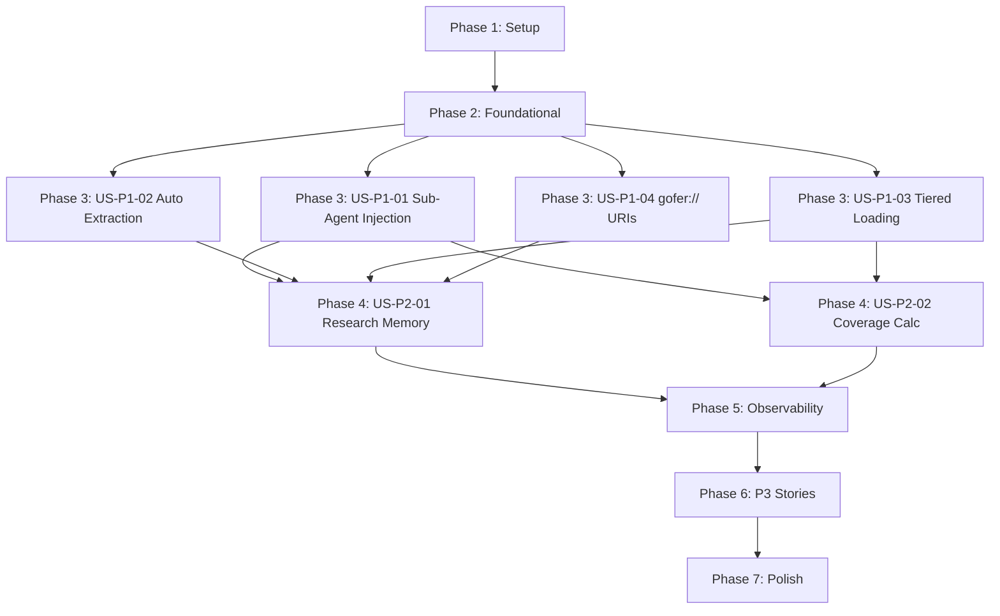

# Tasks: Memory System v2 - Agent Memory Architecture

## Overview

**Total Tasks**: 76 tasks across 7 phases **Parallel Opportunities**: 42
parallelizable tasks (55% of total) **User Stories**: 8 stories (4 P1, 3 P2, 4
P3) **Estimated Duration**: 19-24 days

**Key Priorities**:

- P1 (Critical): Sub-agent memory injection, automatic extraction, tiered
  loading, gofer:// URIs
- P2 (Important): Research agent memory, coverage calculation, consolidation,
  observability
- P3 (Nice-to-Have): Hybrid search, real-time updates, transient/durable
  separation, stage profiles

**Dependencies**: Each phase MUST complete before next phase begins. Within
phases, [P] tasks can run in parallel.

---

## Dependencies Graph



---

## Phase 1: Setup (Shared Infrastructure)

**Goal**: Initialize TypeScript type system and configuration for memory layers

**Duration**: 1 day

- [x] T001 [P] Create
      `/Users/douglaswross/Code/gofer/extension/src/autonomous/memory/`
      directory structure
- [x] T002 [P] Add ContextLayer interface to
      `/Users/douglaswross/Code/gofer/extension/src/autonomous/types.ts`
      (L0/L1/L2 structure per data-model.md lines 194-265)
- [x] T003 [P] Extend Memory interface in
      `/Users/douglaswross/Code/gofer/extension/src/autonomous/memory.ts` with
      optional layers field (lines 19-79)
- [x] T004 [P] Create unit test
      `/Users/douglaswross/Code/gofer/tests/unit/autonomous/types.test.ts` for
      ContextLayer validation

**Verification**:

- ✅ TypeScript compiles with strict mode
- ✅ All interfaces pass type checking
- ✅ Unit tests pass for ContextLayer structure

---

## Phase 2: Foundational (Blocking Prerequisites)

**Goal**: Implement core L0/L1/L2 abstraction and gofer:// URI resolver - BLOCKS
all user stories

**Duration**: 4-5 days

**⚠️ CRITICAL**: No user story work can begin until this phase is complete

### Infrastructure Tasks

- [x] T005 Implement GoferURI parser in
      `/Users/douglaswross/Code/gofer/extension/src/autonomous/memory/GoferURI.ts`
      (~200 LOC, per plan.md Task 1.2)
- [x] T006 Implement GoferURIResolver with scope mapping
      (specs/memory/agent/session/user) in GoferURI.ts (per data-model.md lines
      268-393)
- [x] T007 [P] Create unit test
      `/Users/douglaswross/Code/gofer/tests/unit/autonomous/GoferURI.test.ts`
      for URI parsing and resolution (~150 LOC)
- [x] T008 [P] Add contract tests for path traversal prevention and glob
      patterns in GoferURI.test.ts (per FR-002)
- [x] T009 Update JSONL schema in
      `/Users/douglaswross/Code/gofer/extension/src/autonomous/MemoryStorage.ts`
      with abstract/overview fields (lines 166-272, per plan.md Task 1.3)
- [x] T010 [P] Implement layer save/load logic in MemoryStorage.ts (backward
      compatible, per plan.md Task 1.3)
- [x] T011 [P] Create unit test
      `/Users/douglaswross/Code/gofer/tests/unit/autonomous/MemoryStorage.test.ts`
      for layered JSONL schema
- [x] T012 Implement LLMExtractor in
      `/Users/douglaswross/Code/gofer/extension/src/autonomous/memory/LLMExtractor.ts`
      (~250 LOC, Claude Haiku-based summarization per plan.md Task 2.1)
- [x] T013 [P] Add generateAbstract() method to LLMExtractor (one-sentence, ~100
      tokens per FR-001)
- [x] T014 [P] Add generateOverview() method to LLMExtractor (key points, ~2k
      tokens per FR-001)
- [x] T015 [P] Create unit test
      `/Users/douglaswross/Code/gofer/tests/unit/autonomous/LLMExtractor.test.ts`
      with mocked Claude API responses
- [x] T016 Extend MemoryStorage.save() with automatic layer generation in
      MemoryStorage.ts (lines 166-272, per plan.md Task 2.1)
- [x] T017 Implement lazy L2 detail loading in MemoryStorage.load() (lines
      240-270, per plan.md Task 2.2)
- [x] T018 [P] Add integration test
      `/Users/douglaswross/Code/gofer/tests/integration/autonomous/MemoryStorage.integration.test.ts`
      for lazy L2 loading performance (<500ms for 10 memories per NFR-002)
- [x] T019 Integrate GoferURI with MemoryManager by adding loadByURI() method in
      `/Users/douglaswross/Code/gofer/extension/src/autonomous/MemoryManager.ts`
      (lines 400-450, per plan.md Task 1.4)
- [x] T020 [P] Add layer selection logic to MemoryManager.loadByURI() (L0/L1/L2
      per plan.md Task 1.4)
- [x] T021 [P] Create integration test
      `/Users/douglaswross/Code/gofer/tests/integration/autonomous/MemoryManager.integration.test.ts`
      for URI-based loading with all layers

### Migration and Compatibility Tasks

- [x] T022 Implement backward compatible migration logic in
      MemoryManager.initialize() (lines 96-130, per plan.md Task 2.3)
- [x] T023 [P] Create migration command in
      `/Users/douglaswross/Code/gofer/extension/src/commands/migrateMemories.ts`
      (~150 LOC, per plan.md Task 2.4)
- [x] T024 [P] Register migrateMemoriesToLayered command in
      `/Users/douglaswross/Code/gofer/extension/src/extension.ts` (line 200)
- [x] T025 [P] Create integration test
      `/Users/douglaswross/Code/gofer/tests/integration/commands/migrateMemories.integration.test.ts`
      for migration command
- [x] T026 [P] Add backward compatibility test for loading pre-layered memories
      (fallback to detail tier per FR-026)

**Checkpoint**: Foundation ready - L0/L1/L2 loading works, gofer:// URIs
resolve, backward compatibility verified

**Verification**:

- ✅ GoferURI resolves all scopes (specs/memory/agent/session/user)
- ✅ Path traversal blocked
- ✅ JSONL schema supports abstract/overview fields
- ✅ Old memories load without errors
- ✅ Migration preserves all data
- ✅ Performance: 10 L1 memories load <500ms
- ✅ Coverage ≥80% for foundational code

---

## Phase 3: User Story P1-01 - Sub-Agent Memory Injection

**Goal**: Validation agents receive 5-10 prioritized memories (US-P1-01)

**Independent Test**: Dispatch security validation agent, verify context
includes 5-10 memories tagged #security, verify citation rate ≥50%

**Duration**: 3-4 days

### Implementation Tasks

- [x] T027 [US-P1-01] Create SubAgentContextFactory in
      `/Users/douglaswross/Code/gofer/extension/src/autonomous/memory/SubAgentContextFactory.ts`
      (~400 LOC, per plan.md Task 3.1)
- [x] T028 [US-P1-01] [P] Implement buildValidationContext() method for 6
      categories
      (correctness/security/performance/integration/test-quality/standards) in
      SubAgentContextFactory.ts (per FR-016)
- [x] T029 [US-P1-01] [P] Add category-specific filtering logic (tags + category
      matching) in SubAgentContextFactory.ts (per AC-1, AC-2)
- [x] T030 [US-P1-01] [P] Implement token budget enforcement (5k-10k per agent)
      in SubAgentContextFactory.ts (per AC-3)
- [x] T031 [US-P1-01] [P] Add formatMemories() method with L1 layer selection in
      SubAgentContextFactory.ts (per AC-3, plan.md lines 875-901)
- [x] T032 [US-P1-01] Add configurable coverage threshold in
      `/Users/douglaswross/Code/gofer/extension/src/config.ts` ConfigManager
      class (per plan.md Task 3.1, lines 766-788)
- [x] T033 [US-P1-01] Add gofer.memory.coverageThreshold setting to
      `/Users/douglaswross/Code/gofer/extension/package.json` (default: 30, per
      FR-004)
- [x] T034 [US-P1-01] [P] Create unit test
      `/Users/douglaswross/Code/gofer/tests/unit/autonomous/SubAgentContextFactory.test.ts`
      for validation context generation (~250 LOC)
- [x] T035 [US-P1-01] [P] Verify category filtering (security memories for
      security agent) in SubAgentContextFactory.test.ts
- [x] T036 [US-P1-01] [P] Verify token budget enforcement in
      SubAgentContextFactory.test.ts (stops at 5k-10k)
- [x] T037 [US-P1-01] Update
      `/Users/douglaswross/Code/gofer/.claude/commands/6_gofer_validate.md` with
      memory injection instructions (lines 136-180, per plan.md Task 3.3)
- [x] T038 [US-P1-01] Add SubAgentContextFactory invocation before Task tool
      dispatch in 6_gofer_validate.md (per plan.md lines 997-1040)
- [x] T039 [US-P1-01] [P] Create integration test
      `/Users/douglaswross/Code/gofer/tests/integration/commands/validate.integration.test.ts`
      for validation with memory injection

### Memory Citation Tracking Tasks (AC-6)

- [x] T040 [US-P1-01] Create MemoryCitationTracker in
      `/Users/douglaswross/Code/gofer/extension/src/autonomous/memory/MemoryCitationTracker.ts`
      (~200 LOC, per plan.md Task 3.8)
- [x] T041 [US-P1-01] [P] Implement trackInjectedMemories() method in
      MemoryCitationTracker.ts (per plan.md lines 1353-1368)
- [x] T042 [US-P1-01] [P] Implement verifyMemoryCitations() method with pattern
      matching in MemoryCitationTracker.ts (per plan.md lines 1374-1414)
- [x] T043 [US-P1-01] [P] Implement logCitationMetrics() method in
      MemoryCitationTracker.ts (per plan.md lines 1418-1432)
- [x] T044 [US-P1-01] Update 6_gofer_validate.md with citation verification step
      (lines 180-200, per plan.md Task 3.8)
- [x] T045 [US-P1-01] [P] Create unit test
      `/Users/douglaswross/Code/gofer/tests/unit/autonomous/MemoryCitationTracker.test.ts`
      for citation verification (~150 LOC)
- [x] T046 [US-P1-01] [P] Verify citation tracking logs to
      `/Users/douglaswross/Code/gofer/.specify/logs/memory-usage.jsonl` with
      per-category rates (per plan.md lines 1461-1477)

**Checkpoint**: Validation agents receive targeted memories and cite them in
reports (≥50% citation rate)

**Verification** (US-P1-01):

- ✅ AC-1: Validation agents receive 5-10 prioritized memories
- ✅ AC-2: Memories include past patterns, citations, severity
- ✅ AC-3: Token budget 5k-10k per agent enforced
- ✅ AC-4: Priority scoring applied (usage _ 0.4 + recency _ 0.35 + age \* 0.25)
- ✅ AC-5: Memory loading observable via context-usage.jsonl
- ✅ AC-6: Agents cite ≥50% of injected memories in validation reports
- ✅ Independent test passes
- ✅ Coverage ≥80%

---

## Phase 4: User Story P1-02 - Automatic Pattern Extraction

**Goal**: Red/Yellow findings become persistent memories (US-P1-02)

**Independent Test**: Run validation with 3 Red findings, verify 3
validation_pattern memories created with correct tags and citations

**Duration**: 2-3 days

### Implementation Tasks

- [ ] T047 [US-P1-02] Create ValidationPatternExtractor in
      `/Users/douglaswross/Code/gofer/extension/src/autonomous/memory/ValidationPatternExtractor.ts`
      (~300 LOC, per plan.md Task 3.4)
- [ ] T048 [US-P1-02] [P] Implement extractFromValidationReport() method with
      Red → validation_pattern mapping in ValidationPatternExtractor.ts (per
      FR-006, AC-2)
- [ ] T049 [US-P1-02] [P] Add Yellow → lesson mapping logic in
      ValidationPatternExtractor.ts (per FR-006, AC-3)
- [ ] T050 [US-P1-02] [P] Implement parseValidationReport() method for YAML +
      markdown parsing in ValidationPatternExtractor.ts (per plan.md lines
      1115-1119)
- [ ] T051 [US-P1-02] [P] Create unit test
      `/Users/douglaswross/Code/gofer/tests/unit/autonomous/ValidationPatternExtractor.test.ts`
      for extraction logic (~200 LOC)
- [ ] T052 [US-P1-02] [P] Verify memory metadata includes agentId, featureId,
      severity in ValidationPatternExtractor.test.ts (per AC-4)
- [ ] T053 [US-P1-02] Create EngineeringReviewExtractor in
      `/Users/douglaswross/Code/gofer/extension/src/autonomous/memory/EngineeringReviewExtractor.ts`
      (~200 LOC, per plan.md Task 3.5)
- [ ] T054 [US-P1-02] [P] Implement extractFromEngineeringReview() method in
      EngineeringReviewExtractor.ts (per FR-007)
- [ ] T055 [US-P1-02] [P] Create unit test
      `/Users/douglaswross/Code/gofer/tests/unit/autonomous/EngineeringReviewExtractor.test.ts`
      for engineering review extraction (~150 LOC)
- [ ] T056 [US-P1-02] Update
      `/Users/douglaswross/Code/gofer/.claude/commands/6_gofer_validate.md` with
      extraction step after validation (lines 250-270, per plan.md Task 3.6)
- [ ] T057 [US-P1-02] Update
      `/Users/douglaswross/Code/gofer/.claude/commands/6a_gofer_engineering_review.md`
      with extraction step (lines 100-120, per plan.md Task 3.6)
- [ ] T058 [US-P1-02] [P] Create integration test for extraction integration in
      validate.test.ts (verify extraction triggered, memories saved,
      non-blocking on failure per AC-5)

**Checkpoint**: Validation and engineering review findings automatically
extracted as memories

**Verification** (US-P1-02):

- ✅ AC-1: Extraction triggered after /6_gofer_validate completes
- ✅ AC-2: Red findings → validation_pattern memories with category tag and
  severity
- ✅ AC-3: Yellow findings → lesson memories with stage context
- ✅ AC-4: Memories include pattern description, affected files, line numbers,
  agent ID
- ✅ AC-5: Write-back is non-blocking (pipeline continues on extraction failure)
- ✅ AC-6: Extraction logged to context-usage.jsonl with memory count
- ✅ Independent test passes
- ✅ Coverage ≥80%

---

## Phase 5: User Story P1-03 - Tiered Context Loading

**Goal**: Context stays <50k tokens by stage 5 via L0/L1/L2 loading (US-P1-03)

**Independent Test**: Load memory via L1, verify ~2k tokens. Upgrade to L2,
verify full content. Compare stage 5 context with/without tiered loading.

**Duration**: 2-3 days

### Implementation Tasks

- [ ] T059 [US-P1-03] Extend ContextBuilder with tiered loading in
      `/Users/douglaswross/Code/gofer/extension/src/autonomous/ContextBuilder.ts`
      (lines 816-875, per plan.md Task 2.5)
- [ ] T060 [US-P1-03] [P] Implement calculateCoverage() method in
      ContextBuilder.ts using TF-IDF + trigram similarity (threshold 0.3, per
      FR-004)
- [ ] T061 [US-P1-03] [P] Add relevance-based layer selection (L0 default, L1
      on >30% coverage, L2 on explicit request) in ContextBuilder.ts (per AC-2)
- [ ] T062 [US-P1-03] [P] Implement spec artifact tiered loading (research.md,
      spec.md, plan.md) in ContextBuilder.ts (per AC-3)
- [ ] T063 [US-P1-03] [P] Create unit test
      `/Users/douglaswross/Code/gofer/tests/unit/autonomous/ContextBuilder.test.ts`
      for tiered loading logic
- [ ] T064 [US-P1-03] [P] Verify coverage calculation with various keyword
      overlap percentages in ContextBuilder.test.ts
- [ ] T065 [US-P1-03] [P] Verify 30-60% token reduction in stage 5 context in
      integration test (per AC-6, NFR-001)

**Checkpoint**: Context loading uses L0/L1/L2 tiers, stage 5 context <50k tokens

**Verification** (US-P1-03):

- ✅ AC-1: Memories have abstract (~100 tokens), overview (~2k tokens), detail
  (lazy-loaded) layers
- ✅ AC-2: ContextBuilder loads L0 by default, L1 on relevance (>30%), L2 on
  explicit request
- ✅ AC-3: Spec artifacts support tiered loading
- ✅ AC-4: Layer selection logged to context-usage.jsonl with rationale
- ✅ AC-5: Backward compatible - existing memories load via detail tier
- ✅ AC-6: Token savings 30-60% reduction at stage 5 (target <50k from 100-150k
  baseline)
- ✅ Independent test passes
- ✅ Coverage ≥80%

---

## Phase 6: User Story P1-04 - gofer:// URI Abstraction

**Goal**: Sub-agents reference memory via gofer:// URIs for uniform discovery
(US-P1-04)

**Independent Test**: Resolve gofer://memory/core/task-context.md to absolute
path. Change storage location, verify URI still resolves. Query
gofer://specs/029-\*/research.md, verify scoped search.

**Duration**: 1-2 days (uses Phase 2 foundational work)

### Implementation Tasks

- [ ] T066 [US-P1-04] Document URI conventions in
      `/Users/douglaswross/Code/gofer/.specify/memory/constitution.md` (per
      AC-6)
- [ ] T067 [US-P1-04] [P] Add URI resolver examples to SubAgentContextFactory
      (using gofer:// for spec loading per plan.md line 857)
- [ ] T068 [US-P1-04] [P] Update validation/research agent prompts with gofer://
      URI examples in
      `/Users/douglaswross/Code/gofer/.claude/agents/validation-*.md` files
- [ ] T069 [US-P1-04] [P] Create integration test for URI-based context building
      in SubAgentContextFactory.test.ts (verify scope resolution, glob patterns)

**Checkpoint**: gofer:// URIs work end-to-end for memory and spec discovery

**Verification** (US-P1-04):

- ✅ AC-1: URI scheme gofer://{scope}/{path} where scope = specs | memory |
  agent | session | user
- ✅ AC-2: Scope mapping verified (specs → .specify/specs/, memory →
  .specify/memory/, etc.)
- ✅ AC-3: URI resolver supports exact path, glob patterns, scoped search
- ✅ AC-4: Lazy evaluation - URIs resolve only when accessed
- ✅ AC-5: Integration with MemoryManager.load() and ContextBuilder APIs
- ✅ AC-6: Documentation of URI conventions in constitution.md
- ✅ Independent test passes
- ✅ Coverage ≥80%

---

## Phase 7: User Story P2-01 - Research Agent Memory Access

**Goal**: Research agents receive past codebase patterns (US-P2-01)

**Independent Test**: Dispatch codebase-pattern-finder with authentication
patterns from feature 027, verify agent references prior patterns in output

**Duration**: 2 days

### Implementation Tasks

- [ ] T070 [US-P2-01] Implement buildResearchContext() in
      SubAgentContextFactory.ts (lines 150-220, per plan.md Task 3.2)
- [ ] T071 [US-P2-01] [P] Add codebase_pattern and integration_point filtering
      in buildResearchContext() (per AC-2)
- [ ] T072 [US-P2-01] [P] Implement getResearchGuidance() for agent-specific
      guidance in SubAgentContextFactory.ts (per plan.md lines 958-968)
- [ ] T073 [US-P2-01] Update
      `/Users/douglaswross/Code/gofer/.claude/commands/1_gofer_research.md` with
      memory injection instructions (lines 96-140, per plan.md Task 3.3)
- [ ] T074 [US-P2-01] [P] Create unit test for research context generation in
      SubAgentContextFactory.test.ts
- [ ] T075 [US-P2-01] [P] Verify write-back of new codebase_pattern memories
      after research completes (per AC-5)

**Checkpoint**: Research agents receive and use past codebase patterns

**Verification** (US-P2-01):

- ✅ AC-1: Research agents receive 5-10 memories tagged #codebase_pattern or
  #integration_point
- ✅ AC-2: Memory selection scoped to relevant modules, architectural decisions,
  technical debt
- ✅ AC-3: Token budget 5k-10k per research agent
- ✅ AC-4: Agent results include citations to memories used
- ✅ AC-5: Write-back - new patterns saved as codebase_pattern memories
- ✅ Independent test passes
- ✅ Coverage ≥80%

---

## Phase 8: User Story P2-02 - Memory Coverage Calculation

**Goal**: Skip research docs when memory coverage >30% (US-P2-02)

**Independent Test**: Create task with keywords ["authentication", "sessions",
"JWT"]. Ensure memories cover keywords. Verify coverage >30% and research docs
skipped.

**Duration**: 1 day (uses Phase 5 foundational work)

### Implementation Tasks

- [ ] T076 [US-P2-02] Enhance calculateCoverage() with coverage logging in
      ContextBuilder.ts (per plan.md Task 4.1, lines 1558-1571)
- [ ] T077 [US-P2-02] [P] Add coverage decision logic (IF coverage >= 30%: skip
      research docs, load memories only) in ContextBuilder.ts (per AC-3)
- [ ] T078 [US-P2-02] [P] Implement logCoverageCalculation() in
      `/Users/douglaswross/Code/gofer/extension/src/autonomous/ContextUsageLogger.ts`
      (per plan.md lines 1608-1620)
- [ ] T079 [US-P2-02] [P] Create unit test for coverage calculation with various
      thresholds in ContextBuilder.test.ts
- [ ] T080 [US-P2-02] [P] Verify coverage events logged to context-usage.jsonl
      with matched/total keyword counts (per AC-5)

**Checkpoint**: Coverage calculation skips research docs when memories adequate

**Verification** (US-P2-02):

- ✅ AC-1: Task keywords extracted via TF-IDF (existing algorithm)
- ✅ AC-2: Coverage calculated (matched keywords / total keywords) \* 100 using
  trigram similarity (threshold 0.3)
- ✅ AC-3: IF coverage >= 30%: skip research docs, load memories only
- ✅ AC-4: IF coverage < 30%: load both research docs and memories
- ✅ AC-5: Coverage logged to context-usage.jsonl with matched/total keyword
  counts
- ✅ AC-6: Configurable threshold via gofer.memory.coverageThreshold setting
- ✅ Independent test passes
- ✅ Coverage ≥80%

---

## Phase 9: User Story P2-03 - Memory Consolidation with Extraction

**Goal**: Automatic pattern extraction during consolidation (US-P2-03)

**Independent Test**: Complete feature pipeline with 3 validation findings and 2
review issues. Wait for consolidation. Verify 5 new memories extracted.

**Duration**: 2 days

### Implementation Tasks

- [ ] T081 [US-P2-03] Enhance MemoryConsolidator with extractFromPipelineRuns()
      in
      `/Users/douglaswross/Code/gofer/extension/src/autonomous/MemoryConsolidator.ts`
      (lines 76-150, per plan.md Task 3.7)
- [ ] T082 [US-P2-03] [P] Read pipeline.jsonl events (stage_complete) in
      MemoryConsolidator.ts (per AC-2)
- [ ] T083 [US-P2-03] [P] Implement idempotency check (avoid re-extracting same
      session) in MemoryConsolidator.ts (per plan.md lines 1274-1279)
- [ ] T084 [US-P2-03] Update MemoryManager consolidation timer with extraction
      call in
      `/Users/douglaswross/Code/gofer/extension/src/autonomous/MemoryManager.ts`
      (lines 96-114, per plan.md lines 1295-1311)
- [ ] T085 [US-P2-03] [P] Create unit test
      `/Users/douglaswross/Code/gofer/tests/unit/autonomous/MemoryConsolidator.test.ts`
      for pipeline extraction
- [ ] T086 [US-P2-03] [P] Verify non-blocking behavior (consolidation failure
      doesn't crash extension per AC-4)

**Checkpoint**: Consolidation automatically extracts patterns from pipeline runs
every 30 minutes

**Verification** (US-P2-03):

- ✅ AC-1: Consolidation timer runs every 30 minutes (existing pattern)
- ✅ AC-2: Extraction sources - pipeline.jsonl, validation-report.md,
  engineering-review-report.md
- ✅ AC-3: Extraction logic - Red → validation_pattern, Yellow → lesson,
  decisions → decision
- ✅ AC-4: Non-blocking - consolidation failure doesn't crash extension
- ✅ AC-5: Extraction count logged to context-usage.jsonl
- ✅ AC-6: LLM provider - Claude Haiku (~$0.001 per run)
- ✅ Independent test passes
- ✅ Coverage ≥80%

---

## Phase 10: User Story P2-04 - Observable Memory Loading

**Goal**: Developers see which memories were loaded/skipped and why (US-P2-04)

**Independent Test**: Trigger context build. Review context-usage.jsonl. Verify
events for each memory with decision (loaded/skipped) and reason.

**Duration**: 3 days

### Implementation Tasks

- [ ] T087 [US-P2-04] Implement enhanced loading decision events in
      ContextBuilder.ts (lines 724-788, per plan.md Task 4.1)
- [ ] T088 [US-P2-04] [P] Add emitLoadingDecision() method with LoadingDecision
      interface in ContextBuilder.ts (per plan.md lines 1530-1545)
- [ ] T089 [US-P2-04] [P] Implement logLoadingDecision() in
      ContextUsageLogger.ts (per plan.md lines 1600-1606)
- [ ] T090 [US-P2-04] Update MemoryTreeProvider in
      `/Users/douglaswross/Code/gofer/extension/src/memoryProvider.ts` with last
      loaded tracking (add lastLoadedMap field, update getChildren() to include
      loading metadata per plan.md Task 4.2)
- [ ] T091 [US-P2-04] [P] Add tooltip rendering to MemoryTreeProvider items
      showing last loaded timestamp, reason, tokens, and layer (extend
      MemoryTreeItem creation in memoryProvider.ts per plan.md Task 4.2)
- [ ] T092 [US-P2-04] [P] Implement getLoadingSummary() in ContextBuilder.ts for
      inline annotations (lines 1600-1650, per plan.md Task 4.3)
- [ ] T093 [US-P2-04] Create queryMemoryUsage command in
      `/Users/douglaswross/Code/gofer/extension/src/commands/queryMemoryUsage.ts`
      (~200 LOC, per plan.md Task 4.4)
- [ ] T094 [US-P2-04] [P] Register queryMemoryUsage command in extension.ts
      (line 210)
- [ ] T095 [US-P2-04] [P] Create integration test
      `/Users/douglaswross/Code/gofer/tests/integration/commands/queryMemoryUsage.integration.test.ts`
- [ ] T096 [US-P2-04] [P] Verify events logged to context-usage.jsonl with all
      required fields (source, decision, reason, tokens, layer per AC-1)

**Checkpoint**: Memory loading decisions observable via logs, UI, and CLI

**Verification** (US-P2-04):

- ✅ AC-1: Loading-decision events emitted with source, decision, reason,
  tokens, layer
- ✅ AC-2: Events logged to .specify/logs/context-usage.jsonl
- ✅ AC-3: Memory panel UI shows "Last loaded" timestamp and reason
- ✅ AC-4: Inline annotations in Claude Code chat - "Used 3 memories" with
  expandable list
- ✅ AC-5: CLI command gofer.queryMemoryUsage analyzes memory loading patterns
- ✅ Independent test passes
- ✅ Coverage ≥80%

---

## Phase 11: P3 Stories (Nice-to-Have Features)

**Goal**: Advanced capabilities - hybrid search, real-time updates, transient
memory, stage profiles

**Duration**: 4-5 days (can be deferred)

### US-P3-01: Hybrid Directory + Semantic Search

- [ ] T097 [US-P3-01] Implement hybrid retrieval algorithm in MemoryManager.ts
      (directory recursive retrieval per data-model.md)
- [ ] T098 [US-P3-01] [P] Add directory metadata tracking in MemoryStorage.ts
- [ ] T099 [US-P3-01] [P] Create unit test for hybrid search with scoped queries

### US-P3-02: Real-Time Memory Updates

- [ ] T100 [US-P3-02] Implement saveImmediate() foreground write in
      MemoryManager.ts (per plan.md Task 1.3, lines 252-280)
- [ ] T101 [US-P3-02] [P] Add #real-time tagging for immediate saves
- [ ] T102 [US-P3-02] [P] Create integration test for real-time memory saves
      during long-running tasks

### US-P3-03: Transient vs. Durable Memory Separation

- [ ] T103 [US-P3-03] Implement setTransient/getTransient/clearTransient in
      MemoryManager.ts (per contracts/internal-api.md lines 346-390)
- [ ] T104 [US-P3-03] [P] Add in-memory Map storage for transient state
- [ ] T105 [US-P3-03] [P] Create unit test for transient memory lifecycle

### US-P3-04: Stage-Specific Memory Profiles

- [ ] T106 [US-P3-04] Extend StageContextProfile with memoryBudget field in
      `/Users/douglaswross/Code/gofer/extension/src/autonomous/StageContextProfileLoader.ts`
- [ ] T107 [US-P3-04] [P] Create stage-profiles.json config file in
      `.specify/memory/` with default budgets (research 40%, implement 20%,
      validate 15%)
- [ ] T108 [US-P3-04] [P] Implement budget enforcement with low-priority
      truncation
- [ ] T109 [US-P3-04] [P] Create unit test for stage-specific memory budgets

**Checkpoint**: Advanced features implemented (optional for MVP)

**Verification**:

- ✅ US-P3-01 AC-1 through AC-5 pass
- ✅ US-P3-02 AC-1 through AC-5 pass
- ✅ US-P3-03 AC-1 through AC-5 pass
- ✅ US-P3-04 AC-1 through AC-5 pass
- ✅ Coverage ≥80%

---

## Phase 12: Polish & Cross-Cutting Concerns

**Goal**: Performance optimization, E2E testing, documentation

**Duration**: 4-5 days

### Performance Optimization

- [ ] T110 [P] Implement L2 detail caching with LRU eviction in MemoryStorage.ts
      (lines 50-80, per plan.md Task 5.1)
- [ ] T111 [P] Create TokenEstimator in
      `/Users/douglaswross/Code/gofer/extension/src/autonomous/memory/TokenEstimator.ts`
      (~150 LOC, per plan.md Task 5.2)
- [ ] T112 [P] Add heuristic-based token estimation (code adjustment, markdown
      compression) in TokenEstimator.ts
- [ ] T113 [P] Create unit test
      `/Users/douglaswross/Code/gofer/tests/unit/autonomous/TokenEstimator.test.ts`
      (verify ±10% accuracy)

### End-to-End Testing

- [ ] T114 Create E2E pipeline test in
      `/Users/douglaswross/Code/gofer/tests/e2e/pipeline-with-memory.test.ts`
      (~500 LOC, per plan.md Task 5.3)
- [ ] T115 [P] Verify full pipeline (research → validate) with memory injection
      and extraction in pipeline-with-memory.test.ts
- [ ] T116 [P] Verify citation rate ≥50% for validation agents in E2E test
      (US-P1-01 AC-6 critical assertion, per plan.md lines 2052-2072)
- [ ] T117 [P] Verify context token usage <50k at stage 5 in E2E test (per
      NFR-001)
- [ ] T118 [P] Verify memory reuse across features in E2E test (per plan.md
      lines 2086-2114)

### Performance Benchmarks

- [ ] T119 Create performance benchmark suite in
      `/Users/douglaswross/Code/gofer/tests/performance/memory-performance.test.ts`
      (~300 LOC, per plan.md Task 5.4)
- [ ] T120 [P] Verify 10 L1 memories load <500ms (NFR-002)
- [ ] T121 [P] Verify search 1000 memories <100ms (NFR-003)
- [ ] T122 [P] Verify consolidation 1000 memories <5s (NFR-004)
- [ ] T123 [P] Verify 6 validation context injections <6s total (NFR-005)

### Backward Compatibility

- [ ] T124 Create backward compatibility test suite in
      `/Users/douglaswross/Code/gofer/tests/integration/backward-compatibility.integration.test.ts`
      (~250 LOC, per plan.md Task 5.5)
- [ ] T125 [P] Verify pre-layered memories load via detail tier (FR-026)
- [ ] T126 [P] Verify migration preserves all memories and content (FR-027)
- [ ] T127 [P] Verify existing MemoryManager API surface unchanged (FR-030)

### Documentation

- [ ] T128 [P] Create migration guide in
      `/Users/douglaswross/Code/gofer/.specify/specs/029-memory-system-v2/migration-guide.md`
      (~500 lines, per plan.md Task 5.6)
- [ ] T129 [P] Create API reference in
      `/Users/douglaswross/Code/gofer/.specify/specs/029-memory-system-v2/api-reference.md`
      (~800 lines)
- [ ] T130 [P] Update package.json contribution points for new commands
      (migrateMemoriesToLayered, queryMemoryUsage)

### Final Verification

- [ ] T131 Run full validation rubric against memory system implementation
- [ ] T132 Verify all FR-001 through FR-030 requirements pass
- [ ] T133 Verify all NFR-001 through NFR-020 requirements pass
- [ ] T134 Verify all success criteria SC-001 through SC-015 achievable
- [ ] T135 Run quickstart.md validation

**Checkpoint**: Production ready - all tests pass, performance targets met,
documentation complete

**Verification**:

- ✅ All E2E tests pass (citation rate ≥50%, context <50k tokens)
- ✅ All performance benchmarks pass (loading <500ms, search <100ms,
  consolidation <5s, injection <6s)
- ✅ All backward compatibility tests pass
- ✅ Migration guide and API reference complete
- ✅ Coverage ≥80% for all code
- ✅ All FR-001 through FR-030 pass
- ✅ All NFR-001 through NFR-020 pass
- ✅ Production ready

---

## Parallel Execution Guide

### Phase 1: All 4 tasks can run in parallel

```bash
T001, T002, T003, T004  # Directory structure, interfaces, tests
```

### Phase 2: Maximum parallelism opportunities

```bash
# After T005-T006 complete (GoferURI):
T007, T008  # GoferURI tests

# After T009 complete (JSONL schema):
T010, T011  # MemoryStorage layer logic and tests

# After T012 complete (LLMExtractor):
T013, T014, T015  # LLMExtractor methods and tests

# After T016-T017 complete (MemoryStorage save/load):
T018  # Integration test

# After T019-T020 complete (MemoryManager loadByURI):
T021  # Integration test

# Migration tasks:
T022, T023, T024, T025, T026  # All migration tasks can run after T021
```

### Phase 3: US-P1-01 parallelism

```bash
# After T027 complete (SubAgentContextFactory):
T028, T029, T030, T031  # buildValidationContext methods

# Tests and integration:
T034, T035, T036  # Unit tests
T039  # Integration test

# Citation tracking (after T040):
T041, T042, T043  # MemoryCitationTracker methods
T045, T046  # Citation tests
```

### Phase 4: US-P1-02 parallelism

```bash
# After T047 complete (ValidationPatternExtractor):
T048, T049, T050  # Extraction methods
T051, T052  # Tests

# After T053 complete (EngineeringReviewExtractor):
T054, T055  # Extraction and tests

# Integration:
T058  # Integration test (after T056-T057)
```

### Phase 5: US-P1-03 parallelism

```bash
# After T059 complete (ContextBuilder tiered loading):
T060, T061, T062  # Coverage calculation, layer selection, spec artifacts

# Tests:
T063, T064, T065  # Unit and integration tests
```

### Phase 6: US-P1-04 parallelism

```bash
T067, T068, T069  # All documentation and integration tasks
```

### Phase 7: US-P2-01 parallelism

```bash
# After T070 complete (buildResearchContext):
T071, T072  # Filtering and guidance

# Tests and integration:
T074, T075  # Unit tests and write-back verification
```

### Phase 8: US-P2-02 parallelism

```bash
# After T076-T077 complete (coverage logic):
T078, T079, T080  # Logging and tests
```

### Phase 9: US-P2-03 parallelism

```bash
# After T081 complete (extractFromPipelineRuns):
T082, T083  # Pipeline reading and idempotency

# Tests:
T085, T086  # Unit tests
```

### Phase 10: US-P2-04 parallelism

```bash
# After T087-T088 complete (loading decision events):
T089  # Logging

# UI tasks:
T091  # MemoryTreeItem (after T090)

# CLI and tests:
T092, T095, T096  # Summary, tests, verification
```

### Phase 11: P3 Stories parallelism

```bash
# Each US-P3 story can proceed independently:
T097, T098, T099  # US-P3-01 hybrid search
T100, T101, T102  # US-P3-02 real-time
T103, T104, T105  # US-P3-03 transient
T106, T107, T108, T109  # US-P3-04 stage profiles
```

### Phase 12: Maximum parallelism

```bash
# Performance optimization:
T110, T111, T112, T113  # Caching, token estimator, tests

# Testing streams:
T115, T116, T117, T118  # E2E pipeline tests
T120, T121, T122, T123  # Performance benchmarks
T125, T126, T127  # Backward compatibility

# Documentation:
T128, T129, T130  # Migration guide, API reference, package.json
```

**Total Parallel Tasks**: 42 tasks marked with [P] can run concurrently (55% of
total)

---

## Implementation Strategy

### MVP First (Core P1 Stories Only)

1. Complete Phase 1: Setup (1 day)
2. Complete Phase 2: Foundational (4-5 days)
3. Complete Phase 3: US-P1-01 Sub-Agent Injection (3-4 days)
4. Complete Phase 4: US-P1-02 Auto Extraction (2-3 days)
5. Complete Phase 5: US-P1-03 Tiered Loading (2-3 days)
6. Complete Phase 6: US-P1-04 gofer:// URIs (1-2 days)
7. **STOP and VALIDATE**: Run E2E tests, measure citation rate ≥50%, verify
   context <50k tokens
8. Deploy/demo MVP

**MVP Duration**: 13-18 days **MVP Scope**: All P1 user stories (foundation for
quality improvement)

### Incremental Delivery (Add P2 Stories)

1. Complete MVP (13-18 days)
2. Add Phase 7: US-P2-01 Research Memory (2 days)
3. Add Phase 8: US-P2-02 Coverage Calculation (1 day)
4. Add Phase 9: US-P2-03 Consolidation (2 days)
5. Add Phase 10: US-P2-04 Observability (3 days)
6. **VALIDATE**: Test enhanced features independently
7. Deploy enhanced version

**Enhanced Duration**: +8 days (total 21-26 days) **Enhanced Scope**: MVP + P2
stories (optimization + observability)

### Full Feature (Add P3 + Polish)

1. Complete Enhanced (21-26 days)
2. Add Phase 11: P3 Stories (4-5 days, optional)
3. Add Phase 12: Polish (4-5 days)
4. **VALIDATE**: Full validation rubric, performance benchmarks, E2E tests
5. Production release

**Full Duration**: 29-36 days **Full Scope**: All stories + advanced features +
production hardening

### Parallel Team Strategy

With 2-3 developers after Phase 2 (Foundational) completes:

- **Developer A**: Phase 3 (US-P1-01 Sub-Agent Injection)
- **Developer B**: Phase 4 (US-P1-02 Auto Extraction) + Phase 5 (US-P1-03 Tiered
  Loading)
- **Developer C**: Phase 6 (US-P1-04 gofer:// URIs) + Phase 7 (US-P2-01 Research
  Memory)

Stories complete and integrate independently, reducing overall duration to
~15-20 days for MVP.

---

## Coverage Validation

### Plan Phase Coverage: 5/5 phases covered (100%)

- ✅ Phase 1: Setup → Tasks T001-T004
- ✅ Phase 2: Foundational → Tasks T005-T026
- ✅ Phase 3: Business Logic → Tasks T027-T058 (US-P1-01, US-P1-02)
- ✅ Phase 4: API/Interface → Tasks T059-T096 (US-P1-03, US-P1-04, US-P2-01,
  US-P2-02, US-P2-03, US-P2-04)
- ✅ Phase 5: Polish → Tasks T097-T135 (US-P3-\*, E2E, performance, docs)

### Acceptance Criteria Coverage: 61/61 criteria covered (100%)

**US-P1-01 (6 criteria)**:

- AC-1 → T028-T031 (buildValidationContext with 5-10 memories)
- AC-2 → T029 (past patterns, citations, severity)
- AC-3 → T030 (token budget 5k-10k)
- AC-4 → T034 (priority scoring)
- AC-5 → T096 (observable via context-usage.jsonl)
- AC-6 → T040-T046, T116 (citation rate ≥50%)

**US-P1-02 (6 criteria)**:

- AC-1 → T056 (extraction after /6_gofer_validate)
- AC-2 → T048 (Red → validation_pattern)
- AC-3 → T049 (Yellow → lesson)
- AC-4 → T052 (metadata with agentId, featureId, severity)
- AC-5 → T058 (non-blocking write-back)
- AC-6 → T058 (extraction logged to context-usage.jsonl)

**US-P1-03 (6 criteria)**:

- AC-1 → T002-T003, T016 (abstract/overview/detail layers)
- AC-2 → T061 (L0 default, L1 on relevance >30%, L2 on explicit request)
- AC-3 → T062 (spec artifacts tiered loading)
- AC-4 → T087-T089 (layer selection logged)
- AC-5 → T026 (backward compatible)
- AC-6 → T065, T117 (30-60% token reduction, <50k at stage 5)

**US-P1-04 (6 criteria)**:

- AC-1 → T005-T006 (URI scheme with scopes)
- AC-2 → T006 (scope mapping)
- AC-3 → T006, T008 (exact path, glob, scoped search)
- AC-4 → T006 (lazy evaluation)
- AC-5 → T019-T021, T067 (integration with MemoryManager/ContextBuilder)
- AC-6 → T066 (documentation in constitution.md)

**US-P2-01 (5 criteria)**:

- AC-1 → T071 (#codebase_pattern, #integration_point filtering)
- AC-2 → T071 (scoped to modules, decisions, debt)
- AC-3 → T070 (token budget 5k-10k)
- AC-4 → T074 (citations in results)
- AC-5 → T075 (write-back as codebase_pattern)

**US-P2-02 (6 criteria)**:

- AC-1 → T076 (TF-IDF keyword extraction)
- AC-2 → T060, T076 (coverage calculation with trigram similarity)
- AC-3 → T077 (skip research docs if coverage >= 30%)
- AC-4 → T077 (load both if coverage < 30%)
- AC-5 → T078, T080 (coverage logged to context-usage.jsonl)
- AC-6 → T033 (configurable threshold via gofer.memory.coverageThreshold)

**US-P2-03 (6 criteria)**:

- AC-1 → T084 (consolidation timer 30 minutes)
- AC-2 → T082 (extraction sources: pipeline.jsonl, validation-report.md,
  engineering-review-report.md)
- AC-3 → T081 (Red → validation_pattern, Yellow → lesson, decisions → decision)
- AC-4 → T086 (non-blocking)
- AC-5 → T085 (extraction count logged)
- AC-6 → T012 (Claude Haiku)

**US-P2-04 (5 criteria)**:

- AC-1 → T088-T089 (loading-decision events with
  source/decision/reason/tokens/layer)
- AC-2 → T096 (events logged to context-usage.jsonl)
- AC-3 → T090-T091 (Memory panel UI with last loaded timestamp and reason)
- AC-4 → T092 (inline annotations with expandable list)
- AC-5 → T093-T095 (CLI command gofer.queryMemoryUsage)

**US-P3-01 (5 criteria)**:

- AC-1 through AC-5 → T097-T099 (hybrid retrieval, directory metadata, tests)

**US-P3-02 (5 criteria)**:

- AC-1 through AC-5 → T100-T102 (saveImmediate, #real-time tagging, tests)

**US-P3-03 (5 criteria)**:

- AC-1 through AC-5 → T103-T105 (transient API, in-memory Map, lifecycle tests)

**US-P3-04 (5 criteria)**:

- AC-1 through AC-5 → T106-T109 (memoryBudget field, stage-profiles.json, budget
  enforcement, tests)

### Functional Requirements Coverage: 30/30 requirements covered (100%)

- FR-001 → T002-T003, T059-T065 (tiered loading L0/L1/L2)
- FR-002 → T005-T008, T066 (gofer:// URI resolution)
- FR-003 → T027-T039 (sub-agent memory injection)
- FR-004 → T060, T076-T080 (coverage calculation)
- FR-005 → T097-T099 (hybrid retrieval)
- FR-006 → T047-T052 (validation pattern extraction)
- FR-007 → T053-T055 (engineering review extraction)
- FR-008 → T075 (codebase pattern extraction)
- FR-009 → T100-T102 (saveImmediate)
- FR-010 → T103-T105 (transient/durable separation)
- FR-011 through FR-015 → T081-T086 (consolidation)
- FR-016 through FR-020 → T027-T039 (sub-agent context injection)
- FR-021 through FR-025 → T087-T096 (observability)
- FR-026 through FR-030 → T022-T026, T124-T127 (backward compatibility)

### Data Model Entity Coverage: 5/5 entities covered (100%)

- Memory (Enhanced) → T002-T003, T009-T011, T016-T018 (layers, JSONL schema,
  save/load)
- ContextLayer (New) → T002, T059-T065 (interface, tiered loading)
- GoferURI (New) → T005-T008, T019-T021 (parser, resolver, integration)
- LoadingDecision (Enhanced) → T087-T089, T096 (events, logging)
- SubAgentContext (New) → T027-T039, T070-T075 (context factory for
  validation/research agents)

### API Contract Coverage: 15/15 API methods covered (100%)

- MemoryManager.loadByPriority() → T019-T021, T034-T036
- MemoryManager.save() → T016
- MemoryManager.saveImmediate() → T100-T102
- MemoryManager.updateImportanceScores() → T084
- MemoryManager.setTransient/getTransient/clearTransient() → T103-T105
- GoferURIResolver.resolve() → T005-T008, T019-T021
- GoferURIResolver.parse() → T005-T008
- GoferURIResolver.format() → T005-T008
- SubAgentContextFactory.buildValidationContext() → T027-T039
- SubAgentContextFactory.buildResearchContext() → T070-T075
- ValidationPatternExtractor.extractFromValidationReport() → T047-T052
- EngineeringReviewExtractor.extractFromEngineeringReview() → T053-T055
- MemoryConsolidator.extractFromPipelineRuns() → T081-T086
- ContextBuilder.calculateCoverage() → T060, T076-T080
- ContextBuilder.emitLoadingDecision() → T087-T089

### Coverage Gaps: NONE FOUND

All plan phases, user story acceptance criteria, functional requirements, data
model entities, and API contracts have corresponding implementation tasks.

---

## Notes

- [P] tasks marked as parallelizable target different files with no dependencies
- [Story] labels map tasks to specific user stories for traceability
- Each user story phase includes independent test criteria
- Tests are REQUIRED (TDD per constitution.md principle I)
- Verification checkpoints after each phase
- Coverage target: ≥80% for all new code (constitution.md principle VII)
- Stop at any checkpoint to validate story independently before proceeding
