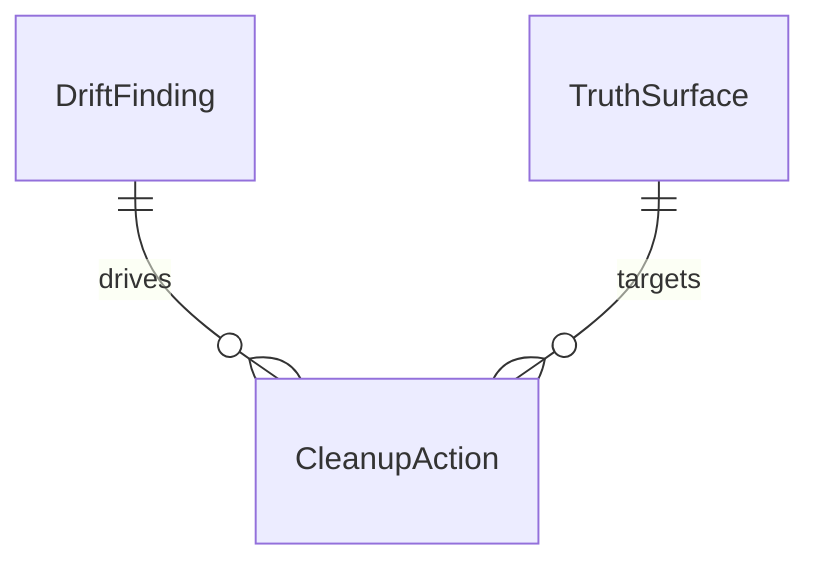
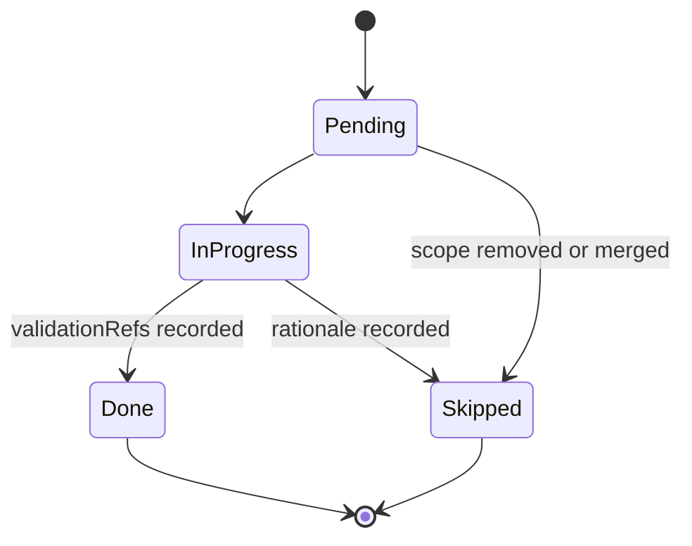

# Data Model: VS Code Surface Truth Cleanup

## Overview

This feature is **repo cleanup**, not a new product/data feature. It introduces
**no new runtime data entities, no new persistence layer, no new API payloads,
and no user-facing records**.

The model below is intentionally minimal. It defines only the planning/audit
entities that help downstream task generation, sequencing, and validation for
truth-alignment work across the VS Code surface.

## Runtime Data Statement

- No new runtime or user-facing entities are required.
- No database tables, indexes, or schema migrations are required.
- Persistence remains the existing repo file set (`spec.md`, `research.md`,
  `audit-history.md`, generated mirrors, tests, and docs).
- Any "records" in this model are planning artifacts backed by markdown and
  source files, not application runtime state.

## Entity Definitions

### 1. DriftFinding

Top-level cleanup finding used to group related work. Seed instances come from
`audit-history.md` and remain stable across planning, implementation, and
validation.

| Field | Type | Required | Description |
| ----- | ---- | -------- | ----------- |
| `id` | string | Yes | Stable finding ID such as `VS-TRUTH-001` |
| `category` | enum | Yes | `DocumentationDrift` \| `ConfigurationDrift` \| `MirrorDrift` \| `LegacyScopeDrift` \| `ResourceNamingDrift` \| `ConfigDefaultDrift` |
| `description` | string | Yes | One-sentence statement of the drift problem |
| `status` | enum | Yes | `Open` \| `Resolved` \| `ExceptionAccepted` |
| `owner` | string \| null | No | Maintainer responsible for closure or exception |
| `reviewCadence` | string | Yes | Review frequency for the finding (for this feature: per stage) |

**Validation Rules**:

- `id` must match `^VS-TRUTH-[0-9]{3}$`.
- `id` is immutable once referenced by downstream actions.
- `ExceptionAccepted` requires an `owner`.
- `Resolved` should only be used when all linked cleanup actions are `Done` or
  explicitly `Skipped` with rationale.

**Seed Records**:

- `VS-TRUTH-001` — Documentation drift
- `VS-TRUTH-002` — Configuration drift
- `VS-TRUTH-003` — Mirror drift
- `VS-TRUTH-004` — Legacy scope drift
- `VS-TRUTH-005` — Resource naming drift
- `VS-TRUTH-006` — Config default drift

### 2. TruthSurface

A concrete repo surface that must either act as the authoritative baseline or
be audited against that baseline.

| Field | Type | Required | Description |
| ----- | ---- | -------- | ----------- |
| `id` | string | Yes | Stable short identifier such as `manifest-contract` |
| `repoPaths` | string[] | Yes | Repo-relative file or directory paths covered by the surface |
| `surfaceType` | enum | Yes | `AuthoritativeContract` \| `RuntimeWiring` \| `ConfigHelper` \| `Documentation` \| `CanonicalCommandSource` \| `GeneratedMirror` \| `BundledResource` \| `ParityTest` \| `LegacySpec` |
| `authoritySource` | string | Yes | What this surface must agree with (`self`, `manifest+runtime`, `manifest+documentation+runtime+mirrors`, `canonical+manifest`, `archive-boundary`) |
| `userFacing` | boolean | Yes | Whether the surface makes a claim visible to users or contributors |
| `trustState` | enum | Yes | `Authoritative` \| `NeedsAudit` \| `Verified` \| `Archived` |

**Validation Rules**:

- `repoPaths` must be non-empty.
- Exact repo path entries must not be duplicated across surface records; nested
  paths are allowed only when a subpath needs distinct tracking.
- `surfaceType = AuthoritativeContract` requires `trustState = Authoritative`.
- `surfaceType = LegacySpec` requires `trustState = Archived`.
- `surfaceType = Documentation`, `ConfigHelper`, `CanonicalCommandSource`, and
  `GeneratedMirror` must not use `authoritySource = self`.
- `userFacing = false` for internal-only/runtime-only surfaces unless they are
  part of the public contract or validation boundary.

**Expected Seed Surfaces**:

| `id` | `repoPaths` | `surfaceType` | `authoritySource` |
| ---- | ----------- | ------------- | ----------------- |
| `manifest-contract` | `["extension/package.json"]` | `AuthoritativeContract` | `self` |
| `runtime-wiring` | `["extension/src/extension.ts", "extension/src/services/CommandRegistry.ts", "extension/src/commands/"]` | `RuntimeWiring` | `self` |
| `documentation-set` | `["extension/README.md", "README.md", "docs/API_KEY_SETUP.md", "docs/guides/configuration.md", "docs/guides/session-management.md", "docs/agentic-coding/AGENT_TOOLING_REFERENCE.md"]` | `Documentation` | `manifest+runtime` |
| `config-helper` | `["extension/src/config.ts"]` | `ConfigHelper` | `manifest+runtime` |
| `canonical-commands` | `[".specify/commands/"]` | `CanonicalCommandSource` | `manifest+runtime` |
| `generated-mirror-set` | `[".claude/", ".github/", ".gemini/", ".agents/", ".system/", "extension/resources/claude-agents/", "extension/resources/claude-commands/", "extension/resources/copilot-prompts/", "extension/resources/gemini/"]` | `GeneratedMirror` | `canonical+manifest` |
| `resource-reference` | `["extension/src/commands/specCommands.ts", "extension/resources/"]` | `BundledResource` | `manifest+runtime` |
| `parity-tests` | `["tests/integration/command-registration.test.ts", "tests/integration/command-generation.test.ts"]` | `ParityTest` | `manifest+documentation+runtime+mirrors` |
| `legacy-spec-root` | `[".specify/specs/", ".specify/specs/_archived/"]` | `LegacySpec` | `archive-boundary` |

### 3. CleanupAction

A bounded unit of work that applies a finding to a specific surface. This is the
entity downstream task generation should consume directly.

| Field | Type | Required | Description |
| ----- | ---- | -------- | ----------- |
| `id` | string | Yes | Task-ready action ID such as `align-documentation-set` |
| `contractRef` | string \| null | No | Optional reference to a higher-level contract item such as `IAP-030-01` |
| `findingId` | string | Yes | Foreign key to `DriftFinding.id` |
| `surfaceId` | string | Yes | Foreign key to `TruthSurface.id` |
| `actionType` | enum | Yes | `Remove` \| `Correct` \| `Align` \| `Archive` \| `Regenerate` \| `ExtendTest` |
| `specRefs` | string[] | Yes | Relevant spec references such as `US-001`, `FR-003`, `FR-012` |
| `validationRefs` | string[] | No | Acceptance or test references such as `AT-001`, `AT-006` |
| `status` | enum | Yes | `Pending` \| `InProgress` \| `Done` \| `Skipped` |
| `notes` | string \| null | No | Rationale for exceptions, skips, or implementation caveats |

**Validation Rules**:

- `findingId` must resolve to an existing `DriftFinding`.
- `surfaceId` must resolve to an existing `TruthSurface`.
- `contractRef`, when present, must match `^IAP-030-[0-9]{2}$`.
- `status = Done` requires at least one `validationRefs` entry.
- `status = Skipped` requires non-empty `notes`.
- `surfaceType = LegacySpec` may only use `actionType = Archive`.
- `surfaceType = AuthoritativeContract` may use `actionType = Remove` only when
  the cleanup is deleting unsupported public contract entries proven absent from
  runtime support and active user-facing documentation.

**Seed Actions from Existing Contract IDs**:

| `id` | `contractRef` | `findingId` | `surfaceId` | `actionType` | Purpose |
| ---- | ------------- | ----------- | ----------- | ------------ | ------- |
| `align-documentation-set` | `IAP-030-01` | `VS-TRUTH-001` | `documentation-set` | `Align` | Remove or correct stale command, setting, and workflow claims |
| `prune-canonical-commands` | `IAP-030-02` | `VS-TRUTH-003` | `canonical-commands` | `Align` | Keep canonical command descriptions inside the supported contract |
| `regenerate-generated-mirrors` | `IAP-030-02` | `VS-TRUTH-003` | `generated-mirror-set` | `Regenerate` | Ensure mirrors do not exceed the supported contract |
| `align-config-helper` | `IAP-030-03` | `VS-TRUTH-002` | `config-helper` | `Align` | Match config keys/defaults to the manifest contract |
| `prune-unsupported-autonomous-settings` | `IAP-030-03` | `VS-TRUTH-002` | `manifest-contract` | `Remove` | Delete unsupported public autonomous notification-route settings from the manifest contract and align dependent surfaces |
| `correct-config-helper-defaults` | `IAP-030-03` | `VS-TRUTH-006` | `config-helper` | `Correct` | Match manifest-backed defaults in `config.ts` and dependent expectations |
| `correct-documented-defaults` | `—` | `VS-TRUTH-006` | `documentation-set` | `Correct` | Remove or correct manifest-backed default claims in active docs |
| `correct-resource-reference` | `IAP-030-04` | `VS-TRUTH-005` | `resource-reference` | `Correct` | Fix bundled resource naming drift for hydrate command support |
| `archive-legacy-spec-root` | `—` | `VS-TRUTH-004` | `legacy-spec-root` | `Archive` | Preserve `_archived/` as the only location for inactive legacy specs |
| `extend-doc-settings-parity-tests` | `IAP-030-03` | `VS-TRUTH-006` | `parity-tests` | `ExtendTest` | Add only the narrow missing documentation/settings parity assertions when existing coverage is insufficient |
| `extend-mirror-scope-guard` | `IAP-030-02` | `VS-TRUTH-003` | `parity-tests` | `ExtendTest` | Add only the narrow missing mirror-scope assertion when existing coverage is insufficient |

### 4. AcceptedException

An explicitly tracked, reviewable exception recorded in `audit-history.md` when
the cleanup intentionally does not "fix" a surface because the repo scope,
environment, or packaging boundary makes the deviation acceptable.

| Field | Type | Required | Description |
| ----- | ---- | -------- | ----------- |
| `id` | string | Yes | Stable exception ID such as `EX-030-01` |
| `findingId` | string \| null | No | Optional related `DriftFinding.id` when the exception narrows a known finding |
| `surfaceId` | string \| null | No | Optional related `TruthSurface.id` when the exception is surface-specific |
| `rationale` | string | Yes | Why the exception is acceptable for this feature |
| `owner` | string | Yes | Maintainer responsible for re-review |
| `reviewCadence` | string | Yes | How often the exception should be revisited |
| `status` | enum | Yes | `Accepted` \| `Expired` \| `Superseded` |

**Validation Rules**:

- `id` must match `^EX-030-[0-9]{2}$`.
- At least one of `findingId` or `surfaceId` must be present.
- `status = Expired` or `Superseded` requires updated rationale text explaining
  the transition.

**Seed Records**:

- `EX-030-01` — Non-application workflow exception for EnterpriseAI app-delivery tasks
- `EX-030-02` — Non-git workspace exception for git-based task wording and checks

## Relationships

| Relationship | Cardinality | Description |
| ------------ | ----------- | ----------- |
| `DriftFinding` → `CleanupAction` | 1:N | One finding category can produce multiple task-ready cleanup actions |
| `TruthSurface` → `CleanupAction` | 1:N | One surface can require multiple actions across phases |
| `DriftFinding` ↔ `TruthSurface` | M:N via `CleanupAction` | Findings affect many surfaces, and surfaces can participate in more than one finding |
| `DriftFinding` → `AcceptedException` | 1:N | A finding can be narrowed or deferred by an accepted exception |
| `TruthSurface` → `AcceptedException` | 1:N | A surface can carry a scoped exception record in `audit-history.md` |

## State Transition

Only `CleanupAction` needs an explicit lifecycle state machine. `DriftFinding`
closure is derived from the completion state of its linked actions.

**Derived Rule**:

- A `DriftFinding` can move to `Resolved` only when every linked
  `CleanupAction` is `Done` or `Skipped` with rationale.

## Entity-to-Story Mapping

| Entity | Primary Use | Story / Requirement Coverage |
| ------ | ----------- | ---------------------------- |
| `DriftFinding` | Groups cleanup by stable problem area | US-001 to US-005, especially audit and regression tracking |
| `TruthSurface` | Identifies concrete files/directories to inspect and update | US-001 to US-005, FR-001 to FR-016 |
| `CleanupAction` | Converts findings + surfaces into task-ready work items | US-001 to US-005, FR-001 to FR-016, AT-001 to AT-010 |
| `AcceptedException` | Preserves approved non-fix rationales with owner and review cadence | T005/T024 closure evidence; plan/task exceptions `EX-030-01`, `EX-030-02` |

## Storage and Migration Considerations

- **Storage model**: file-system only; the authoritative records remain repo
  files and spec artifacts.
- **Indexing**: no database indexes are needed; stable IDs and repo paths are
  sufficient lookup keys.
- **Migration approach**: text edits, archival moves, and regeneration of
  existing artifacts only; no runtime data migration exists for this feature.
- **Operational note**: this model is for planning and validation traceability,
  not for introducing new code-level persistence structures.
