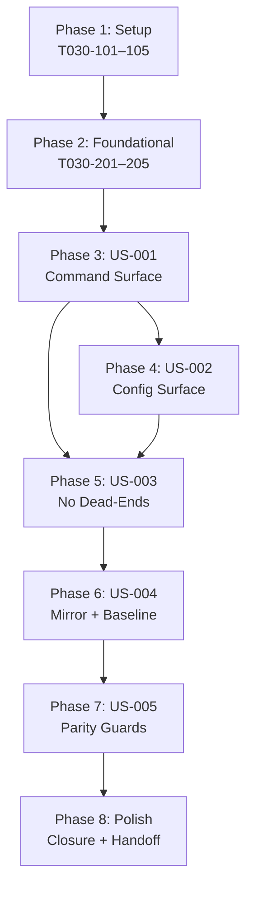

# Tasks: VS Code Surface Truth Cleanup (030)

**Input**: `.specify/specs/030-vscode-surface-truth-cleanup/`

**Prerequisites**: `plan.md` ✅ · `spec.md` ✅ · `data-model.md` ✅ · `contract-pack.md` ✅

> **Non-Application Exception**: This feature is repo maintenance cleanup, not
> application delivery. No EnterpriseAI scaffold, validate, deploy, eai-cli, or
> AI-journey tasks are included. `eai-cli` is not installed locally. This
> exception is recorded in `plan.md` (EnterpriseAI Profile Metadata section).

> **Traceability**: Every task cites its plan task ID(s) (T030-101 through
> T030-506) in brackets. Every plan task maps to at least one task below.

---

## Overview

26 tasks across 8 phases. Authority flows downward:
`extension/package.json` + runtime → config helpers + docs + canonical commands
→ generated mirrors. Each phase must reach its **Checkpoint** before the next
begins, except where **[P]** marks parallel-safe execution within a phase.

**Acceptance tests covered**: AT-001 through AT-010
**User stories covered**: US-001 (P1) · US-002 (P1) · US-003 (P2) · US-004 (P2) · US-005 (P3)
**Plan phases mapped**: Phase 1 (T030-101–105) → Phase 2 (T030-201–205) → Phase 3 (T030-301–305) →
Phase 4 (T030-401–405) → Phase 5 (T030-501–506)

> **Story-tag note**: Task story tags indicate the primary execution phase, not
> exclusive requirement ownership. Cross-story validation and mirror tasks may
> satisfy acceptance criteria outside their primary phase tag; the matrices below
> are the authoritative coverage map.

---

## Dependencies Graph



---

## Phase 1: Setup — Baseline Truth Audit

**Purpose**: Freeze the authoritative contract, classify public versus internal
behavior, and populate the stable-finding registry. No runtime or doc edits
until this phase is complete.

**⚠️ CRITICAL**: All downstream tasks require the evidence produced here.

- [X] T001 [US-004] **Archive stray specs** — Verify
      `/Users/douglaswross/Code/eai/eai-tools/gofer/.specify/specs/` contains
      only `_archived/` and `030-vscode-surface-truth-cleanup/` (ignore `.DS_Store`
      and other hidden OS files). If any active non-archived spec directory other
      than 030 is present, move it into `_archived/` without modifying its
      content and record the directory name(s) moved. Closes AT-007, FR-016.
      *(Plan: T030-101)*

- [X] T002 [P] [US-001,US-002] **Freeze manifest baseline** — Read
      `/Users/douglaswross/Code/eai/eai-tools/gofer/extension/package.json` and
      produce an authoritative inventory of: all `contributes.commands[].command`
      IDs and titles, all `contributes.configuration.properties` keys and
      defaults, all `contributes.menus` command references, all
      `contributes.keybindings` command references, and all `contributes.views`
      entries. Record counts and key lists in task notes. Do **not** modify the
      file. Provides the authority baseline for T003, T004, T007, T015, and
      T021. *(Plan: T030-102)*

- [X] T003 [US-001] **Trace runtime registrations** — Read
      `/Users/douglaswross/Code/eai/eai-tools/gofer/extension/src/extension.ts`,
      `/Users/douglaswross/Code/eai/eai-tools/gofer/extension/src/services/CommandRegistry.ts`,
      `/Users/douglaswross/Code/eai/eai-tools/gofer/extension/src/commands/specCommands.ts`,
      and companion command/status-bar modules. For each
      `vscode.commands.registerCommand` call, record the command ID and whether
      it is a manifest contribution (from T002 baseline). Classify each ID as
      **Public** (manifest-contributed + visible UI contribution point + non-placeholder
      runtime behavior) or **Internal** (registered but not contributed, lacks a
      visible UI entry, or only exposes placeholder/non-meaningful behavior). In
      the same pass, verify each manifest-contributed `contributes.views` entry
      from T002 has an implemented provider/wiring path in the runtime code and
      record any missing provider as contract drift. Requires T002.
      *(Plan: T030-103)*

- [X] T004 [US-001,US-004] **Build cross-surface evidence matrix** — Compare the
      T002 manifest baseline and T003 runtime classification against:
      `/Users/douglaswross/Code/eai/eai-tools/gofer/extension/README.md`,
      `/Users/douglaswross/Code/eai/eai-tools/gofer/README.md`,
      `/Users/douglaswross/Code/eai/eai-tools/gofer/docs/API_KEY_SETUP.md`,
      `/Users/douglaswross/Code/eai/eai-tools/gofer/docs/guides/configuration.md`,
      `/Users/douglaswross/Code/eai/eai-tools/gofer/docs/guides/session-management.md`,
      `/Users/douglaswross/Code/eai/eai-tools/gofer/docs/agentic-coding/AGENT_TOOLING_REFERENCE.md`,
      all files matching
      `/Users/douglaswross/Code/eai/eai-tools/gofer/.specify/commands/*.md`,
      all files matching
      `/Users/douglaswross/Code/eai/eai-tools/gofer/.claude/commands/*.md`,
      `/Users/douglaswross/Code/eai/eai-tools/gofer/.github/prompts/*.prompt.md`,
      `/Users/douglaswross/Code/eai/eai-tools/gofer/.gemini/**`,
      `/Users/douglaswross/Code/eai/eai-tools/gofer/.agents/skills/**/SKILL.md`,
      `/Users/douglaswross/Code/eai/eai-tools/gofer/.system/skills/**/SKILL.md`,
      and bundled resources under
      `/Users/douglaswross/Code/eai/eai-tools/gofer/extension/resources/`.
      For each surface, record every command or setting reference that does not
      match the manifest baseline, mapping each confirmed drift item to
      `VS-TRUTH-001` through `VS-TRUTH-006` as defined in `data-model.md`. Use
      `/Users/douglaswross/Code/eai/eai-tools/gofer/.specify/specs/030-vscode-surface-truth-cleanup/research.md`,
      `context-bundle.md`, and `contract-pack.md` as supporting references.
      Requires T002, T003. *(Plan: T030-104)*

- [X] T005 [US-001,US-004] **Update audit-history.md and initialize CleanupAction register** — Write confirmed
      findings, owners, review cadence, and accepted exceptions `EX-030-01` and
      `EX-030-02` into
      `/Users/douglaswross/Code/eai/eai-tools/gofer/.specify/specs/030-vscode-surface-truth-cleanup/audit-history.md`
      using the drift items identified in T004. Each `DriftFinding` record
      (VS-TRUTH-001 through VS-TRUTH-006) must have `category`, `description`,
      `status`, `owner`, and `reviewCadence`. In the same file, initialize a
      `TruthSurface` register for each seed surface from `data-model.md` with
      `repoPaths`, `surfaceType`, `authoritySource`, `userFacing`, and starting
      `trustState`; also initialize a `CleanupAction` register for the seed
      actions from `data-model.md` with fields for `id`, `contractRef`,
      `findingId`, `surfaceId`, `actionType`, `specRefs`, `validationRefs`,
      `status`, and `notes` starting in `Pending`. Initialize
      `AcceptedException` records for `EX-030-01` and `EX-030-02` with
      `findingId` or `surfaceId`, `rationale`, `owner`, `reviewCadence`, and
      starting `status = Accepted`. Requires T004. *(Plan: T030-105)*

**Checkpoint**: `.specify/specs/` has no stray active spec. Every later edit can
cite evidence from T002–T004. `audit-history.md` has specific, trackable
findings.

---

## Phase 2: Foundational — Runtime, Config & Resource Alignment

**Purpose**: Correct proven code drift while preserving activation safety and
non-destructive sync behavior. These changes block all documentation cleanup and
mirror work.

**⚠️ CRITICAL**: Run
`cd /Users/douglaswross/Code/eai/eai-tools/gofer/extension && npm run compile-tests && npm run compile`
after any TypeScript or manifest-adjacent edits in this phase. Run
`npx vitest run tests/integration/command-registration.test.ts tests/integration/command-generation.test.ts`
at phase end. No new user-facing commands or settings may be added.

- [X] T006 [P] [US-004] **Fix hydrate resource path in specCommands.ts** —
      Update `/Users/douglaswross/Code/eai/eai-tools/gofer/extension/src/commands/specCommands.ts`
      to load `gofer_hydrate.md` (underscore convention) instead of the
      incorrect dot-named legacy reference `gofer.hydrate.md`. Confirm the target
      file exists under
      `/Users/douglaswross/Code/eai/eai-tools/gofer/extension/resources/` before
      changing the reference. Do not alter any other resource reference in this
      file. Closes AT-006, FR-012, IAP-030-04. *(Plan: T030-201)*

- [X] T007 [P] [US-002] **Align config.ts keys and defaults** — In
      `/Users/douglaswross/Code/eai/eai-tools/gofer/extension/src/config.ts`,
      compare every `CONFIG_KEYS` entry and every `DEFAULTS` value against the
      T002 manifest baseline. For each confirmed mismatch (e.g. `gofer.preferredAI`
      default drift), correct the helper to match the manifest. Remove any
      user-facing key or default absent from `extension/package.json`
      `contributes.configuration.properties`. Internal-only keys must remain
      absent from user-facing material. If manifest-backed defaults change,
      update the corresponding expectation in
      `/Users/douglaswross/Code/eai/eai-tools/gofer/tests/unit/extension/Config.test.ts`
      in the same change so the unit suite reflects the manifest contract.
      Retain strict TypeScript types; no `any`. Requires T002. Closes IAP-030-03,
      FR-006. *(Plan: T030-202)*

- [X] T008 [US-002] **Audit direct getConfiguration reads** — Using repo-wide
      search for `vscode.workspace.getConfiguration('gofer')` and
      `getConfiguration('gofer')`, inspect all matching files including:
      `/Users/douglaswross/Code/eai/eai-tools/gofer/extension/src/extension.ts`,
      `/Users/douglaswross/Code/eai/eai-tools/gofer/extension/src/services/CommandRegistry.ts`,
      `/Users/douglaswross/Code/eai/eai-tools/gofer/extension/src/autonomousCommands.ts`,
      `/Users/douglaswross/Code/eai/eai-tools/gofer/extension/src/autonomous/`,
      `/Users/douglaswross/Code/eai/eai-tools/gofer/extension/src/config/workflowProfile.ts`,
      `/Users/douglaswross/Code/eai/eai-tools/gofer/extension/src/mcpConfig.ts`,
      `/Users/douglaswross/Code/eai/eai-tools/gofer/extension/src/webviewHelpers.ts`,
      `/Users/douglaswross/Code/eai/eai-tools/gofer/extension/src/ui/AIUsageStatusBar.ts`,
      `/Users/douglaswross/Code/eai/eai-tools/gofer/extension/src/ui/GoferActivityStatusBar.ts`,
      `/Users/douglaswross/Code/eai/eai-tools/gofer/extension/src/ui/ContextHealthStatusBar.ts`,
      `/Users/douglaswross/Code/eai/eai-tools/gofer/extension/src/council/providers/ProviderFactory.ts`,
      `/Users/douglaswross/Code/eai/eai-tools/gofer/extension/src/council/providers/ProviderFactoryCliResolver.ts`,
      `/Users/douglaswross/Code/eai/eai-tools/gofer/extension/src/services/EventHandlers.ts`, and
      `/Users/douglaswross/Code/eai/eai-tools/gofer/extension/src/services/InitializationService.ts`.
      For each direct read, compare the key against the T002 manifest baseline.
      Correct only user-facing key/default mismatches proven by T004. When the
      audit proves a public-contract defect in `extension/package.json`
      (for example an unsupported autonomous setting still exposed to users),
      remove that manifest-backed setting and update the coupled docs/tests in
      the same change. Treat any additional consumer using the same
      manifest-schema/runtime comparison rule. Requires T004. Closes FR-007,
      IAP-030-03. *(Plan: T030-203)*

- [X] T009 [CONDITIONAL] [US-001] **Repair supported command parity gaps** — If
      this feature removes, renames, or repairs a supported manifest-contributed
      command because T003/T004 (or later cleanup work) proves a runtime parity
      gap, update the implementation or the paired manifest entry plus every
      coupled menu reference, keybinding, view action, and tree action reference
      in the same change. Check
      `/Users/douglaswross/Code/eai/eai-tools/gofer/extension/src/progressProvider.ts`
      for downstream consumers such as `gofer.showTaskDetails`. Do **not** add
      new public commands. If no supported-command parity gap is found across the
      feature, mark this task Skipped with note "No supported-command parity gap
      required coupled reference updates." Requires T003. Closes FR-002.
      *(Skipped: No supported-command parity gap required coupled reference
      updates. Plan: T030-204)*

- [X] T010 [CONDITIONAL] [US-004] **Re-check ResourceSyncer rename impact** —
      Read `/Users/douglaswross/Code/eai/eai-tools/gofer/extension/src/services/migration/ResourceSyncer.ts`
      and verify whether the hydrate resource rename from T006 requires a bounded
      update to preserve non-destructive sync behavior (backup-before-replace
      pattern). If a change is required, apply the minimum necessary edit while
      keeping the sync non-destructive. If no change is needed, mark this task
      Skipped with note "ResourceSyncer backup behavior unaffected by T006
      rename." Requires T006. Closes FR-012 (ResourceSyncer side), IAP-030-04.
      *(Skipped: ResourceSyncer backup behavior unaffected by T006 rename. Plan:
      T030-205)*

**Checkpoint**: Extension compile passes. Parity tests still green. No new
commands or settings added.

---

## Phase 3: US-001 — Trustworthy Command Surface (Priority: P1) 🎯 MVP

**Goal**: Every VS Code command named in any documentation or generated mirror
corresponds to a manifest-contributed, runtime-registered command.

**Independent Test**: Compare all documentation surfaces against T002 manifest
inventory and T003 runtime classification; confirm zero undocumented or stale
command references.

- [X] T011 [US-001,US-002,US-003] **Rewrite extension/README.md** — Edit
      `/Users/douglaswross/Code/eai/eai-tools/gofer/extension/README.md` so that:
      (1) every named command maps to the T002 manifest baseline; (2) every
      documented setting name and default matches the manifest; (3) all
      WhatsApp, memory, or similar feature claims are verified against the
      manifest or removed; (4) every setup path and onboarding step reflects only
      current behavior; (5) stale command-palette actions and unsupported workflow
      guidance are removed. Do not remove still-supported behaviors. Requires
      Phase 2 complete. Closes AT-001, AT-003, AT-008, FR-001, FR-003, FR-004,
      FR-005, FR-008, US-001, US-002, US-003 (extension README coverage).
      *(Plan: T030-301)*

- [X] T012 [P] [US-001,US-003] **Trim root README.md** — Edit
      `/Users/douglaswross/Code/eai/eai-tools/gofer/README.md` only where it
      overstates VS Code extension commands, documented setting defaults, or
      setup/workflow claims not backed by the T002 manifest baseline. Preserve
      all cross-platform guidance that accurately reflects current runtime
      behavior. After T011 and T012 are complete, rerun
      `npx vitest run tests/integration/command-registration.test.ts tests/integration/command-generation.test.ts`
      and record the result before moving to Phase 4. Requires Phase 2 complete.
      Closes FR-003, FR-004, FR-008 (root README). *(Plan: T030-303)*

**Checkpoint**: `extension/README.md` and `README.md` contain zero stale command
references. Remaining active-doc command surfaces (`docs/API_KEY_SETUP.md` and
`docs/agentic-coding/AGENT_TOOLING_REFERENCE.md`) are validated in later phases.

---

## Phase 4: US-002 — Trustworthy Configuration Surface (Priority: P1)

**Goal**: Every setting documented in VS Code-facing material maps to a current
manifest key and a truthful default.

**Independent Test**: Compare every setting key and default in
`docs/guides/configuration.md`, `docs/guides/session-management.md`, and
`extension/README.md` against T002 manifest
`contributes.configuration.properties` and confirmed config.ts values from T007.

- [X] T015 [US-002] **Update active settings docs** — Edit
      `/Users/douglaswross/Code/eai/eai-tools/gofer/docs/guides/configuration.md`
      and `/Users/douglaswross/Code/eai/eai-tools/gofer/docs/guides/session-management.md`
      so every documented setting key, default, and enum value matches the T002
      manifest baseline. Remove any setting key absent from
      `extension/package.json` `contributes.configuration.properties`. Correct
      any default value mismatch proven by T007. Remove or rewrite any
      settings-guide setup/workflow guidance that is not supported by the
      cleaned manifest/runtime contract. After the edit, rerun
      `npx vitest run tests/integration/command-registration.test.ts tests/integration/command-generation.test.ts`
      and record the result before moving to Phase 5. Requires T002, T007, and
      Phase 3 complete. Closes AT-003, FR-005, US-002 (configuration/session
      guide coverage).
      *(Plan: T030-302)*

**Checkpoint**: Every setting in the active settings docs
(`docs/guides/configuration.md`, `docs/guides/session-management.md`, and
`extension/README.md`) maps to a manifest key. Any setup/workflow guidance in
those files matches the cleaned manifest/runtime contract.

---

## Phase 5: US-003 — No Dead-End Setup Paths (Priority: P2)

**Goal**: Every workflow step in VS Code-facing documentation is currently
functional. Removals are captured in changelog.

**Independent Test**: Read `extension/README.md`, `README.md`,
`docs/API_KEY_SETUP.md`, `docs/guides/configuration.md`,
`docs/guides/session-management.md`, and
`docs/agentic-coding/AGENT_TOOLING_REFERENCE.md` end-to-end; verify each
described step against the manifest baseline and runtime.

- [X] T016 [US-003] **Record removals in CHANGELOG** — For every command,
      setting, or workflow step removed from VS Code-facing documentation across
      T011, T012, T015, and any later T017 corrections, write a concise entry in
      `/Users/douglaswross/Code/eai/eai-tools/gofer/extension/CHANGELOG.md`.
      Add a note to
      `/Users/douglaswross/Code/eai/eai-tools/gofer/CHANGELOG.md` only if root
      README guidance changes also need repo-level disclosure. Removal notes must
      be specific (name the removed item). Requires T011, T012, T015, and
      verification after T017 if later active-doc corrections remove additional
      guidance. Closes AT-008, FR-009. *(Plan: T030-304)*

- [X] T017 [US-003] **Cross-check and correct remaining active docs against acceptance tests** —
      Re-read and, where the AT audit proves drift, correct `extension/README.md`,
      `README.md`, `docs/API_KEY_SETUP.md`,
      `docs/guides/configuration.md`, `docs/guides/session-management.md`, and
      `docs/agentic-coding/AGENT_TOOLING_REFERENCE.md`.
      Verify AT-001 (every documented command in manifest), AT-003 (every
      documented setting in manifest), and AT-008 (zero stale workflow claims)
      from
      `/Users/douglaswross/Code/eai/eai-tools/gofer/.specify/specs/030-vscode-surface-truth-cleanup/contract-pack.md`.
      Also verify the non-app scope rules from
      `/Users/douglaswross/Code/eai/eai-tools/gofer/.specify/specs/030-vscode-surface-truth-cleanup/context-bundle.md`
      are preserved. Record pass/fail evidence for each AT in task notes. Run
      `npx vitest run tests/integration/command-registration.test.ts tests/integration/command-generation.test.ts`
      and record results. Requires T016. Closes AT-001 (manual), AT-003
      (manual), AT-008, FR-008, FR-009. *(Plan: T030-305)*

**Checkpoint**: Manual review finds zero unsupported commands, settings, or
workflow steps. Parity tests green. Changelog entries present for each removal.

---

## Phase 6: US-004 — Clean Baseline for Future Work (Priority: P2)

**Goal**: Codebase and generated surfaces accurately reflect only supported,
current behavior. No stale assumptions available for contributors to copy.

**Independent Test**: Run both generator dry-runs and confirm zero unexpected
changes; run parity test suite; confirm `.specify/specs/` contains no active
non-hidden spec directories beyond the 030 spec and `_archived/`.

- [X] T013 [US-004] **Audit canonical command sources** — Read all files matching
      `/Users/douglaswross/Code/eai/eai-tools/gofer/.specify/commands/*.md` and
      compare VS Code-facing wording against the cleaned T002 manifest/runtime
      contract after documentation cleanup is complete. Treat
      `/Users/douglaswross/Code/eai/eai-tools/gofer/.claude/commands/*.md` as
      generated output (do **not** hand-edit it). Edit canonical command text
      only when T004 evidence proves drift. Requires T017. Closes FR-010 (audit
      step), FR-004. *(Plan: T030-401)*

- [X] T014 [CONDITIONAL] [US-004] **Run generation pipeline** — If T013 proves
      canonical drift, or if node-emitted outputs are stale against already-
      correct canonical text: (1) run `npm run gofer:generate -- --dry-run` from
      `/Users/douglaswross/Code/eai/eai-tools/gofer/` and review the diff; (2)
      if the diff is expected and bounded, run `npm run gofer:generate`; (3)
      directly review resulting changes under
      `/Users/douglaswross/Code/eai/eai-tools/gofer/.claude/commands/`,
      `/Users/douglaswross/Code/eai/eai-tools/gofer/extension/resources/claude-commands/`,
      `/Users/douglaswross/Code/eai/eai-tools/gofer/extension/resources/copilot-prompts/`,
      `/Users/douglaswross/Code/eai/eai-tools/gofer/.github/prompts/`,
      `/Users/douglaswross/Code/eai/eai-tools/gofer/.gemini/`,
      `/Users/douglaswross/Code/eai/eai-tools/gofer/.agents/skills/gofer/`, and
      `/Users/douglaswross/Code/eai/eai-tools/gofer/.system/skills/gofer/`; (4)
      if packaged extension resources must pick up refreshed surfaces, run
      `./scripts/sync-extension-resources.sh` and verify diffs under
      `/Users/douglaswross/Code/eai/eai-tools/gofer/extension/resources/`,
      especially
      `/Users/douglaswross/Code/eai/eai-tools/gofer/extension/resources/claude-agents/`
      and
      `/Users/douglaswross/Code/eai/eai-tools/gofer/extension/resources/gemini/`.
      If T013 found no canonical drift and outputs are current, mark Skipped with
      note "T013 found no canonical drift; generation not required." Requires
      T013. Closes AT-005, FR-010, FR-011. *(Done: Regenerated mirrors and
      re-synced bundled resources after generator/metadata cleanup, including
      `.gemini/`, `extension/resources/claude-agents/`, and
      `extension/resources/gemini/`. Plan: T030-402)*

- [X] T018 [US-004,US-005] **Verify secondary TS pipeline** — Run
      `npm run generate-commands -- --dry-run --verbose` from
      `/Users/douglaswross/Code/eai/eai-tools/gofer/`. Review the output to
      confirm the secondary TypeScript pipeline from
      `/Users/douglaswross/Code/eai/eai-tools/gofer/.claude/commands/` remains
      bounded against the current manifest scope. If pipeline must write updated
      flat outputs, verify and record the expected change set across
      `/Users/douglaswross/Code/eai/eai-tools/gofer/.github/prompts/`,
      `/Users/douglaswross/Code/eai/eai-tools/gofer/.agents/skills/`, and
      `/Users/douglaswross/Code/eai/eai-tools/gofer/.system/skills/`. Then run
      `npx vitest run tests/integration/command-generation.test.ts` and record
      the result. Requires T014 (or T014 Skipped). Closes FR-014, AT-005
      (secondary TS pipeline side). *(Plan: T030-403)*

- [X] T019 [P] [US-004] **Confirm generators unchanged** — Verify that
      `/Users/douglaswross/Code/eai/eai-tools/gofer/scripts/generate-commands.ts`,
      `/Users/douglaswross/Code/eai/eai-tools/gofer/.specify/scripts/node/generate-commands.mjs`,
      and the review-only bridge
      `/Users/douglaswross/Code/eai/eai-tools/gofer/extension/src/council/CommandGenerator.ts`
      remain unchanged by this cleanup unless a bounded truthful-output fix is
      required. If a bug blocking truthful output was discovered during T014 or
      T018, document it here and confirm whether it requires a bounded fix or an
      out-of-scope plan amendment before proceeding. No generator refactors may
      proceed without re-planning. *(Plan: T030-404)*

- [X] T020 [P] [US-004] **Resolve mirror wording ambiguity** — If T018 revealed
      wording ambiguity in generated mirror surfaces, correct the canonical
      command text in the relevant
      `/Users/douglaswross/Code/eai/eai-tools/gofer/.specify/commands/*.md` file
      (not the downstream generated copy). Re-run `npm run gofer:generate --
      --dry-run` to confirm the fix propagates correctly. If no ambiguity was
      found, mark Skipped with note "T018 found no wording ambiguity." Requires
      T018. Closes FR-010, FR-011 (wording). *(Skipped: T018 found no wording
      ambiguity. Plan: T030-405)*

**Checkpoint**: Canonical sources and mirrors consistent. Both generator dry-runs
produce only expected output. Generator source files unchanged.
`command-generation.test.ts` passes. `.specify/specs/` contains no active
non-hidden spec directories beyond `_archived/` and
`030-vscode-surface-truth-cleanup/`.

---

## Phase 7: US-005 — Machine-Verifiable Surface Truth (Priority: P3)

**Goal**: Parity between documented behavior and shipped behavior is
automatically checkable. Drift caught before it reaches users.

**Independent Test**: Run
`npx vitest run tests/integration/command-registration.test.ts tests/integration/command-generation.test.ts`
and confirm all pass without modifying the existing declared command list.

- [X] T021 [CONDITIONAL] [US-005] **Extend command-registration parity test** —
      If Phases 1–3 exposed a real uncovered documentation/settings parity gap
      that existing tests do not address: add bounded manifest-backed parity
      assertion(s) to
      `/Users/douglaswross/Code/eai/eai-tools/gofer/tests/integration/command-registration.test.ts`
      following the existing manifest-read pattern. Any documentation assertion
      must read manifest schema and compare active documentation, configuration
      examples, or runtime/default consumers against it. Do **not**
      change the existing declared command list expectations. Do **not**
      introduce a new test framework or external dependency. If no real
      documentation/settings parity gap was found, mark Skipped with note "No
      uncovered documentation/settings parity gap confirmed." Requires T004,
      T007, T008. Closes AT-001
      (conditional), AT-003 (conditional), AT-004 (conditional), FR-015.
      *(Plan: T030-501)*

- [X] T022 [US-005] **Run final verification suite** — Execute all of the
      following and record pass/fail evidence for each:
      (1) `npm test` from `/Users/douglaswross/Code/eai/eai-tools/gofer/`;
      (2) `npx vitest run tests/integration/command-registration.test.ts tests/integration/command-generation.test.ts`;
      (3) `cd /Users/douglaswross/Code/eai/eai-tools/gofer/extension && npm test`
      if any manifest or extension runtime files changed (AT-009 activation
      verification). Confirm the targeted parity suite passes, record that the
      declared command list in `tests/integration/command-registration.test.ts`
      remained unchanged, and classify any unrelated broader-suite failures in
      `audit-history.md`.
      Requires all prior phases complete. Closes AT-002, AT-004, AT-009, FR-013,
      FR-014, SC-001, SC-002, SC-005, SC-006, SC-007.
      *(Plan: T030-502)*

- [X] T023 [US-005] **Final mirror drift gates** — Run
      `npm run gofer:generate -- --dry-run` and
      `npm run generate-commands -- --dry-run --verbose` as final
      mirror-drift gates. Confirm both produce only expected output (no
      unintended changes remaining). Archive the dry-run output summary in task
      notes. Requires T018, T020. Closes AT-005, FR-011, SC-007.
      *(Plan: T030-503)*

**Checkpoint**: All targeted parity tests pass, the declared command list
remains unchanged, both generator dry-runs clean, and any broader-suite
baseline failures are classified in `audit-history.md`. Activation test passes
if extension runtime changed.

---

## Phase 8: Polish — Closure & Handoff

**Purpose**: Close all finding records, verify no new dependencies, and confirm
SC-001 through SC-009 have explicit evidence.

- [X] T024 [P] [US-001,US-002,US-003,US-004,US-005] **Finalize audit-history.md and CleanupAction statuses** —
      Update finding statuses in
      `/Users/douglaswross/Code/eai/eai-tools/gofer/.specify/specs/030-vscode-surface-truth-cleanup/audit-history.md`
      to `Resolved` for each `VS-TRUTH-001` through `VS-TRUTH-006` whose linked
      `CleanupAction`s are all `Done` or `Skipped`-with-rationale. In the same
      register initialized by T005, update each `TruthSurface` row’s
      `trustState` to its final value (`Verified`, `Authoritative`, or
      `Archived`) and update each `CleanupAction` row’s `validationRefs`,
      `status`, and `notes` fields to reflect final execution outcomes. Confirm
      `AcceptedException` entries `EX-030-01` and `EX-030-02` include
      `findingId` or `surfaceId`, `owner`, `reviewCadence`, and final `status`
      values. Requires T022. *(Plan: T030-504)*

- [X] T025 [P] [US-005] **Task handoff and no-new-dependency check** — Inspect
      `/Users/douglaswross/Code/eai/eai-tools/gofer/package.json`,
      `/Users/douglaswross/Code/eai/eai-tools/gofer/extension/package.json`,
      `/Users/douglaswross/Code/eai/eai-tools/gofer/language-server/package.json`,
      and any touched lockfiles (`package-lock.json` / `yarn.lock`) against the
      phase-start baseline. Confirm zero new external packages are present and
      record the evidence (expected: no new entries under `dependencies` /
      `devDependencies`). Verify SC-001 through SC-009 each have explicit
      closure evidence cited across tasks T001–T024.
      Closes AT-010, SC-008, SC-009. *(Plan: T030-505)*

- [X] T026 [CONDITIONAL] [US-005] **Conditional mirror-scope guard** — If Phase 6
      (T018–T020) revealed an uncovered mirror-scope gap not yet guarded by an
      existing test: add a bounded recursive removed-surface guard to
      `/Users/douglaswross/Code/eai/eai-tools/gofer/tests/integration/command-generation.test.ts`
      so regenerated repo mirrors and packaged resources remain within contract.
      Do **not** introduce a new test framework or new dependencies. Do **not**
      lower existing expectations. Re-run
      `npx vitest run tests/integration/command-generation.test.ts` and record
      the result. Requires T018 and execution after T022 setup. Closes FR-010
      (regression guard), AT-005. *(Done: Added recursive mirror/package denylist
      guard for removed VS Code surfaces across full generated and packaged
      trees. Plan: T030-506)*

**Checkpoint**: audit-history.md complete. No new dependencies confirmed.
SC-001–SC-009 all have closure evidence.

---

## Dependencies & Execution Order

### Phase Dependencies

- **Phase 1 (Setup)**: No dependencies — start immediately
- **Phase 2 (Foundational)**: Depends on Phase 1 completion — BLOCKS Phases 3–7
- **Phase 3 (US-001)**: Depends on Phase 2
- **Phase 4 (US-002)**: Depends on Phase 3 (T011 updates extension/README.md settings too)
- **Phase 5 (US-003)**: Depends on Phases 3 and 4
- **Phase 6 (US-004)**: Depends on Phase 5 (mirror work should follow doc cleanup)
- **Phase 7 (US-005)**: Depends on Phase 6
- **Phase 8 (Polish)**: Depends on Phase 7

### Within-Phase Parallel Opportunities

| Phase | Parallel Tasks | Constraint |
| ----- | -------------- | ---------- |
| 1 | T001 + T002 | Both read-only; T003 and T004 depend on both |
| 2 | T006 + T007 | Different files; T008 depends on T004 and T010 depends on T006 |
| 3 | T011 + T012 | Different documentation surfaces |
| 4 | T015 alone | Single task |
| 5 | T016 → T017 | Sequential only |
| 6 | T019 + T020 in parallel after T018 | T013 and T014 must complete first; T018 must complete before T019/T020 |
| 7 | T021 can start alongside T022 setup | T022 must run last in phase |
| 8 | T024 + T025 | Both depend on T022; T026 depends on T018 |

### Conditional Task Summary

| Task | Condition to Execute | Condition to Skip |
| ---- | -------------------- | ----------------- |
| T009 | Supported-command parity gap requires coupled reference updates | No supported-command parity gap found → Skipped |
| T010 | T006 rename requires sync update | Sync unaffected → Skipped |
| T014 | T013 finds canonical drift OR outputs stale | Outputs stale after generator/metadata cleanup → Done |
| T020 | T018 finds wording ambiguity | No ambiguity → Skipped |
| T021 | Phases 1–3 expose uncovered parity gap | Documentation/settings parity gap confirmed → Done |
| T026 | Phase 6 finds uncovered mirror-scope gap | Recursive full-tree mirror/package guard added → Done |

---

## Parallel Execution Guide

```bash
# Phase 1: Start T001 and T002 together (both read-only)
Task: "Archive stray specs" (T001)
Task: "Freeze manifest baseline" (T002)

# After T001 + T002:
Task: "Trace runtime registrations" (T003)

# After T003:
Task: "Build cross-surface evidence matrix" (T004)

# After T004:
Task: "Update audit-history.md" (T005)

# Phase 2: T006 + T007 together; T010 needs T006 and T008 needs T004
Task: "Fix hydrate resource path" (T006)
Task: "Align config.ts keys and defaults" (T007)
# --- then after T006: ---
Task: "Re-check ResourceSyncer" (T010) [conditional]
# --- then after T004: ---
Task: "Audit direct getConfiguration reads" (T008)
# --- then: ---
Task: "Repair supported command parity gaps" (T009) [conditional, needs T003]

# Phase 3: T011 + T012 together after Phase 2
Task: "Rewrite extension/README.md" (T011)
Task: "Trim root README.md" (T012)

# Phase 6: T013 then T014, then T018, then T019 + T020
Task: "Audit canonical command sources" (T013)
Task: "Run generation pipeline" (T014) [conditional]
# --- then: ---
Task: "Verify secondary TS pipeline" (T018)
# --- then: ---
Task: "Confirm generators unchanged" (T019)
Task: "Resolve mirror wording ambiguity" (T020) [conditional]

# Phase 8: T024 + T025 together
Task: "Finalize audit-history.md" (T024)
Task: "Task handoff and no-new-dependency check" (T025)
```

---

## Implementation Strategy

### Minimal-Risk Sequential Pass (Recommended for solo maintainer)

1. Complete **Phase 1** (T001–T005) — audit only, no edits
2. Complete **Phase 2** (T006–T010) — runtime/config fixes, compile-verify
3. Complete **Phase 3** (T011–T012) — command surface docs + early parity rerun
4. **STOP and verify**: parity tests green, no stale command references
5. Complete **Phase 4** (T015) — configuration docs
6. Complete **Phase 5** (T016–T017) — changelog + AT cross-check
7. Complete **Phase 6** (T013–T014, T018–T020) — canonical audit + mirror pipeline verification
8. Complete **Phase 7** (T021–T023) — regression guards + final test run
9. Complete **Phase 8** (T024–T026) — closure + handoff

### Incremental Delivery Notes

- **After Phase 3**: US-001 (P1) and most of US-002 (P1) are verifiable; the
  command surface is trustworthy.
- **After Phase 4**: US-002 (P1) is fully closed; the configuration surface is
  trustworthy.
- **After Phase 5**: US-003 (P2) is closed; no dead-end setup paths remain.
- **After Phase 6**: US-004 (P2) is closed; mirrors are truthful.
- **After Phase 7**: US-005 (P3) is closed; parity is machine-verifiable.
- **After Phase 8**: All findings closed; cleanup is done.

### Key Constraints (Do Not Violate)

- No new runtime commands, settings, or dependencies (AT-010, SC-008)
- No feature resurrection to rescue stale docs (FR-008)
- No generator rewrites (T030-404 / T019)
- No modification of `/Users/douglaswross/Code/eai/eai-tools/gofer/.specify/specs/_archived/`
  content (contract-pack.md boundary)
- Non-destructive sync in `ResourceSyncer.ts` must be preserved (EVT-030-03)
- `command-registration.test.ts` expected command counts must **not** be lowered
  (FR-013)

---

## Plan Task Coverage Matrix

| Plan Task | tasks.md Task | Primary / Supporting Stories | AT Coverage |
| --------- | ------------- | ---------------------------- | ----------- |
| T030-101  | T001          | US-004        | AT-007      |
| T030-102  | T002          | US-001/002    | AT-001,003  |
| T030-103  | T003          | US-001        | AT-002      |
| T030-104  | T004          | US-001/004    | AT-001–006  |
| T030-105  | T005          | US-001/004    | —           |
| T030-201  | T006          | US-004        | AT-006      |
| T030-202  | T007          | US-002        | AT-004      |
| T030-203  | T008          | US-002        | AT-004      |
| T030-204  | T009          | US-001        | AT-002      |
| T030-205  | T010          | US-004        | AT-006      |
| T030-301  | T011          | US-001/002/003| AT-001,003,008 |
| T030-302  | T015          | US-002        | AT-003      |
| T030-303  | T012          | US-001/003    | AT-001,008  |
| T030-304  | T016          | US-003        | AT-008      |
| T030-305  | T017          | US-003        | AT-001,003,008 |
| T030-401  | T013          | US-001/004    | AT-005      |
| T030-402  | T014          | US-001/004    | AT-005      |
| T030-403  | T018          | US-004/005    | AT-005      |
| T030-404  | T019          | US-004        | —           |
| T030-405  | T020          | US-004        | AT-005      |
| T030-501  | T021          | US-005        | AT-001,003,004  |
| T030-502  | T022          | US-005        | AT-002,004,009 |
| T030-503  | T023          | US-005        | AT-005      |
| T030-504  | T024          | US-001–005    | —           |
| T030-505  | T025          | US-005        | AT-010      |
| T030-506  | T026          | US-005        | AT-005      |

**Coverage**: 26 plan tasks → 26 tasks.md tasks (1:1). All T030-101 through T030-506 mapped.

---

## Acceptance Criteria Reference Matrix

| AC ID | Acceptance Criterion Summary | Owning Task(s) |
| ----- | ---------------------------- | -------------- |
| US-001 AC-01 | Every documented command maps to a supported public command | T011, T012, T013, T014, T018, T020, T021 |
| US-001 AC-02 | Every supported command has live runtime registration | T003, T009, T022 |
| US-001 AC-03 | Coupled menu/keybinding/view/tree actions update with command changes | T009, T022 |
| US-001 AC-04 | Internal-only commands remain absent from user-facing docs | T003, T011, T012, T017 |
| US-001 AC-05 | Removed manifest commands are removed/corrected across docs | T011, T012, T013, T014, T018, T020, T023, T026 |
| US-001 AC-06 | Existing command-registration test passes after cleanup | T022 |
| US-002 AC-01 | Every documented setting in configuration guide maps to manifest | T015, T021 |
| US-002 AC-02 | Every documented default in VS Code-facing material matches manifest or is removed | T007, T011, T012, T015, T021 |
| US-002 AC-03 | config.ts does not expose/default absent manifest settings | T007, T008 |
| US-002 AC-04 | Stale setting names are removed from docs if absent from manifest | T011, T012, T015, T017 |
| US-002 AC-05 | User-facing settings helper behavior aligns and internal-only keys stay undocumented | T007, T008, T011, T012, T015 |
| US-003 AC-01 | extension/README.md avoids workflow steps requiring absent commands/settings | T011, T017 |
| US-003 AC-02 | WhatsApp, memory, and similar feature claims are verified or removed | T011, T016, T017 |
| US-003 AC-03 | Setup/onboarding sections describe only implemented behavior | T011, T015, T017 |
| US-003 AC-04 | Removed/unsupported workflow guidance is absent and removals are noted | T011, T012, T015, T016, T017 |
| US-004 AC-01 | Only the 030 cleanup spec remains active outside _archived | T001 |
| US-004 AC-02 | specCommands.ts uses the correct bundled resource filename | T006, T010 |
| US-004 AC-03 | Generated CLI and packaged extension mirror surfaces stay within contract | T013, T014, T018, T020, T026 |
| US-004 AC-04 | Generation and bundle-sync steps do not ship removed-manifest command descriptions | T014, T018, T023, T026 |
| US-005 AC-01 | command-registration.test.ts passes without changing declared command list | T021, T022 |
| US-005 AC-02 | command-generation.test.ts passes after mirror regeneration | T018, T022, T026 |
| US-005 AC-03 | A small targeted check is added only when a documentation/settings parity gap is real | T021 |
| US-005 AC-04 | No new test framework/dependency is introduced and new checks follow manifest-read patterns | T021, T025, T026 |
