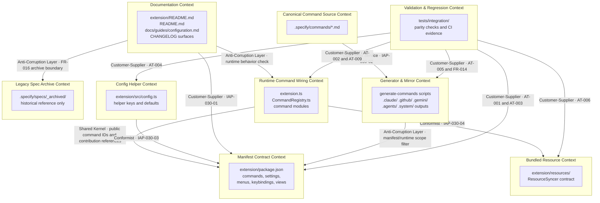

# Bounded Context Map — 030-vscode-surface-truth-cleanup

This cleanup is not introducing new business domains; it is restoring clear
ownership across repo-maintained surfaces. The authoritative boundary is the VS
Code manifest contract, with runtime wiring, config helpers, bundled
resources, documentation, generators, and tests each kept as separate contexts
so drift can be found and corrected without merging responsibilities. User
stories US-001 through US-005 show the main cross-context flows: docs must
follow manifest and live runtime behavior, config helpers must conform to the
manifest, canonical command sources must flow through existing generators into
mirrors, resource references must match shipped files, and tests must verify
each boundary without inventing new truth sources. Archived specs stay isolated
as history only.

## Diagram

## Integration Patterns

| Contract / Relationship | From -> To | Pattern | Purpose |
| --- | --- | --- | --- |
| `IAP-030-01` Command and doc truth alignment | Documentation -> Manifest Contract | Customer-Supplier | User-facing docs consume the published public contract for commands and settings. |
| `IAP-030-01` runtime verification leg | Documentation -> Runtime Command Wiring | Anti-Corruption Layer | Docs are filtered through real runtime behavior so stale or internal-only claims do not leak out. |
| Public command contract coupling | Runtime Command Wiring -> Manifest Contract | Shared Kernel | Command IDs, menu references, keybindings, view actions, and related public identifiers must stay consistent across both contexts. |
| `IAP-030-03` Config helper alignment | Config Helper -> Manifest Contract | Conformist | Helper keys/defaults must match manifest settings rather than redefine them. |
| `IAP-030-04` Resource naming consistency | Runtime Command Wiring -> Bundled Resource | Conformist | Command code must use shipped resource names and preserve non-destructive sync behavior. |
| `IAP-030-02` Canonical-to-mirror generation | Canonical Command Source -> Generator & Mirror | Open Host Service | Canonical command text is authored once and emitted outward through existing generation pipelines. |
| Mirror scope enforcement | Generator & Mirror -> Manifest Contract | Anti-Corruption Layer | Generated mirrors are trimmed to the supported VS Code contract instead of becoming a second truth source. |
| Parity verification | Validation & Regression -> Manifest / Runtime / Config / Generator / Resource | Customer-Supplier | Existing tests consume each upstream context as evidence and fail when drift reappears. |
| Legacy spec isolation | Documentation -> Legacy Spec Archive | Anti-Corruption Layer | Archived specs remain historical inputs only and cannot directly shape active user-facing claims. |

## Notes

- This map reflects **maintenance ownership boundaries**, not product/business
  domains.
- There is **no external API** and **no event bus** for this feature;
  integrations are repo-local authority contracts.
- `Documentation Context` and `Canonical Command Source Context` stay separate
  because one is user-facing guidance and the other is generator input.
- `Legacy Spec Archive Context` is intentionally isolated so US-004 / FR-016 can
  be enforced without historical content leaking back into active surfaces.
