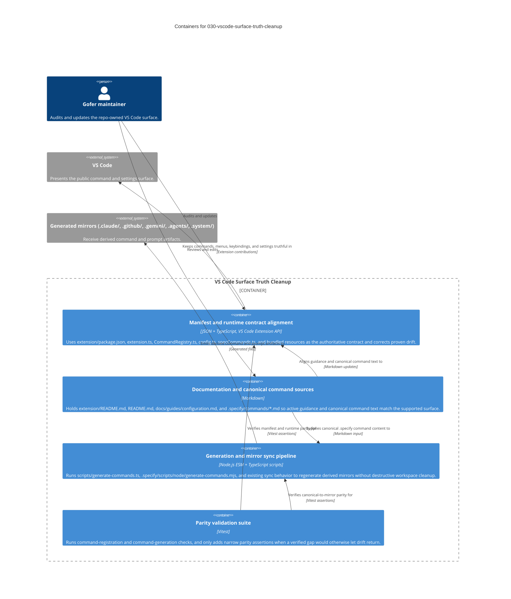

# C4 Container: 030-vscode-surface-truth-cleanup

This container view keeps the maintenance context explicit. The cleanup is
implemented through a small set of repo-owned containers: the manifest and
runtime contract surfaces that define actual behavior, the Markdown
documentation and canonical command sources that must follow that behavior, the
existing generation pipeline that emits mirror artifacts, and the Vitest parity
suite that guards against drift returning. The Gofer maintainer is the only
persona shown because this work is primarily about maintaining a truthful VS
Code extension surface, not introducing new end-user runtime flows or
deployment infrastructure.

## Notes

- The diagram intentionally models repo-maintenance containers instead of new
  app infrastructure.
- No new dependency, datastore, or deployment target is introduced by this
  feature.
- Non-destructive sync behavior remains part of the existing generation and
  resource flow.
