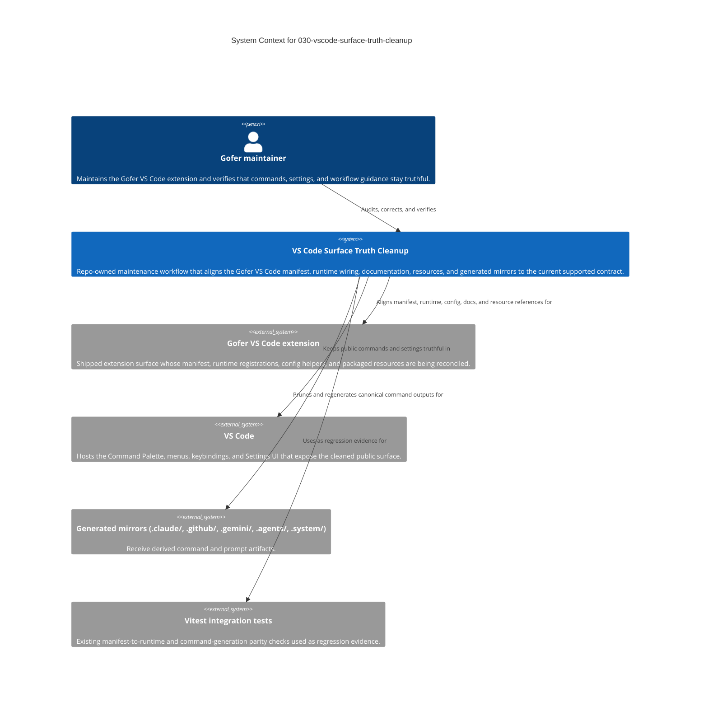

# C4 Context — 030-vscode-surface-truth-cleanup

This diagram treats the feature as repo-owned maintenance work rather than a
new application. The boundary is the VS Code Surface Truth Cleanup effort,
whose job is to keep the shipped Gofer VS Code surface honest by aligning the
manifest, runtime wiring, documentation, bundled resources, and generated
mirrors. The main stakeholder is the Gofer maintainer, who needs a public
command and settings surface that matches current behavior. Surrounding systems
are the extension being cleaned, VS Code as the host UI, generated mirrors that
reflect canonical command text, and the existing Vitest checks that prove drift
has been removed without adding new infrastructure.

## Diagram

## Notes

- This feature is non-application repo cleanup, so the boundary is a
  maintenance workflow, not a new deployed service.
- `extension/package.json` plus live runtime registrations are the
  authoritative public contract.
- Archived specs remain historical reference only and are outside the active
  cleanup boundary.
