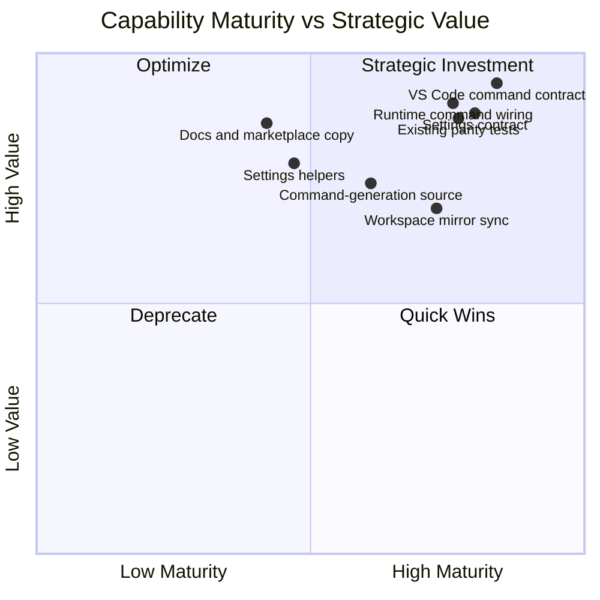

# Capability Heatmap — 030-vscode-surface-truth-cleanup

This heatmap focuses on truth-alignment and drift reduction rather than net-new
product functionality. It shows which existing VS Code surface capabilities are
being corrected, tightened, or lightly extended so the shipped manifest,
runtime wiring, settings guidance, generated mirrors, workspace sync, and
parity checks all describe the same supported behavior. Most capabilities here
are already strategically important because they shape user trust and maintainer
confidence, but several sit at lower maturity because duplicated surfaces have
drifted apart. The goal of this cleanup is to optimize mature high-value
capabilities and selectively strengthen weaker truth surfaces without replacing
the core extension contract.

## Quadrant Chart

## Capabilities Table

| Capability | Action | Current Maturity | Strategic Value | Notes |
| ---------- | ------ | ---------------- | --------------- | ----- |
| VS Code command contract | extend | 0.84 | 0.94 | `extension/package.json` is already the authoritative contributed command/settings surface; cleanup improves truthfulness by trimming stale claims rather than replacing the contract. |
| Runtime command wiring | touch | 0.76 | 0.90 | Registrations already exist across `extension.ts`, `CommandRegistry.ts`, and command modules; this is high-value and fairly mature, but split wiring still creates drift risk. |
| Settings contract | extend | 0.80 | 0.88 | The manifest is the settings schema of record; cleanup aligns documentation and actual usage to it, removing stale keys instead of inventing new settings behavior. |
| Settings helpers | extend | 0.47 | 0.78 | `extension/src/config.ts` partially mirrors settings and defaults, but research found key/default drift, so maturity is lower and targeted correction is needed. |
| Docs and marketplace copy | extend | 0.42 | 0.86 | User-facing READMEs and configuration guidance have high trust impact but lower maturity because they repeat stale commands, settings, and workflow claims. |
| Command-generation source | touch | 0.61 | 0.74 | Existing command generation is reusable and strategically useful for mirror consistency, but duplicated generation paths mean only moderate maturity for drift control. |
| Workspace mirror sync | touch | 0.73 | 0.69 | `ResourceSyncer` already provides a non-destructive sync pattern; the feature mainly preserves truthful mirrored resources rather than changing sync behavior. |
| Existing parity tests | extend | 0.77 | 0.87 | Current tests already verify command parity, making this a mature, high-value safeguard; small extensions help prevent drift from returning. |

## Action Legend

- **touch** — capability is consulted or read by the feature but not changed
- **extend** — capability gains new behaviour while existing behaviour is
  preserved
- **replace** — capability's existing behaviour is superseded by the feature
