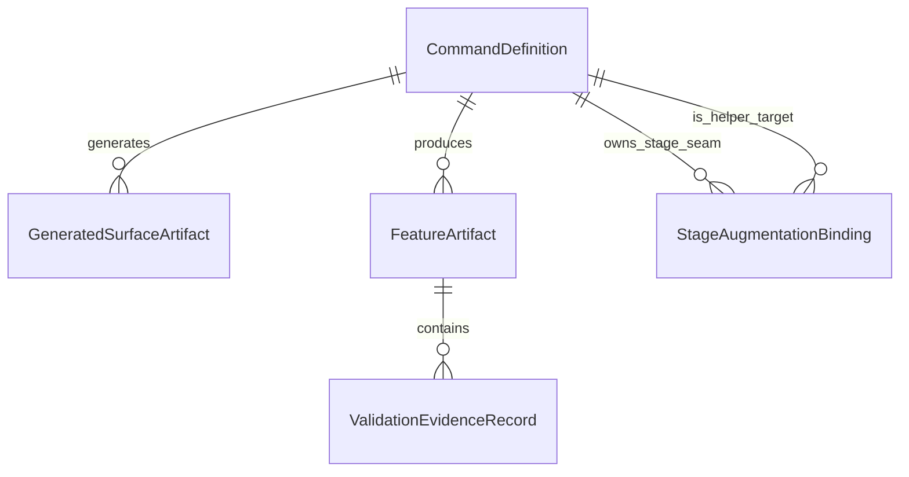

# Data Model: Skills Pipeline Augmentation

## Overview

This feature adds **workflow command contracts and feature-scoped artifacts**, not
application runtime records. The authoritative data lives in Git-tracked command
source files under `.specify/commands/`, generated CLI mirrors derived from those
sources, and per-feature markdown artifacts written under
`.specify/specs/{feature}/`.

The model is therefore intentionally **artifact-first and file-system-oriented**.
It focuses on:

- canonical helper/stage command definitions
- generated cross-CLI surfaces
- optional stage-local augmentation bindings
- feature-scoped helper outputs
- truthful validation evidence records inside `validation-report.md`
- blast-radius output used by rubric Category 11

## Runtime Data Statement

- **No new persistent application/runtime entities are required.**
- **No database tables, queues, indexes, or schema migrations are introduced.**
- The existing numbered pipeline state machine remains authoritative and must stay
  unchanged for this feature (`FR-007`, `NFR-003`).
- Runtime proof is represented only as **evidence references** inside
  `validation-report.md` plus any cited raw outputs (test output, screenshots,
  HTTP transcripts, deployment logs, file references). There is **no standalone
  runtime-proof registry**.

## Entity / Artifact Definitions

### 1. CommandDefinition

Canonical Gofer command contract stored under `.specify/commands/`.

| Field | Type | Required | Description |
| --- | --- | --- | --- |
| `id` | string | Yes | Stable command identifier such as `gofer:vocabulary` or `/6_gofer_validate` |
| `commandType` | enum | Yes | `Helper` \| `NumberedStage` |
| `canonicalPath` | string | Yes | Repo-relative source-of-truth markdown path under `.specify/commands/` |
| `stageNumber` | integer \| null | No | Existing pipeline stage number when `commandType = NumberedStage` |
| `invocationModes` | enum[] | Yes | `Standalone` and/or `StageLocal` |
| `generatedProviders` | enum[] | Yes | `Claude` \| `Copilot` \| `Codex` \| `Gemini` |
| `outputArtifactKinds` | enum[] | No | Artifact kinds this command may write |
| `upstreamConcept` | string \| null | No | Conceptual inspiration only; never a mirrored text source |
| `parityClass` | string | Yes | Cross-CLI behavior class; for this feature always `cross-cli-equivalent` |

**Validation Rules**:

- `canonicalPath` must match `.specify/commands/*.md`.
- `commandType = Helper` requires `id` to match `^gofer:[a-z0-9-]+$`.
- `commandType = NumberedStage` is limited to the existing stage contract; for
  this feature `/6_gofer_validate` is behaviorally hardened and
  `/1_gofer_research`, `/2_gofer_specify`, and `/5_gofer_implement` receive
  additive stage-local seam guidance.
- Every new helper must declare all four `generatedProviders`.
- `stageNumber` must be `null` for helpers and fixed for numbered stages.
- `invocationModes` may include `StageLocal` only when there is a matching
  `StageAugmentationBinding`.
- `upstreamConcept`, when present, is traceability only. The command body must be
  Gofer-owned and must not mirror Matt Pocock skill text verbatim (`FR-017`).
- Provider-specific syntax may vary after generation, but the command's
  observable behavior and output contract must remain equivalent across CLI
  surfaces (`NFR-001`).

**Seed Command Records**:

| `id` | `commandType` | `canonicalPath` | `invocationModes` | `outputArtifactKinds` | `upstreamConcept` |
| --- | --- | --- | --- | --- | --- |
| `gofer:vocabulary` | `Helper` | `.specify/commands/gofer_vocabulary.md` | `Standalone`, `StageLocal` | `Glossary` | `ubiquitous-language` |
| `gofer:diagnose` | `Helper` | `.specify/commands/gofer_diagnose.md` | `Standalone`, `StageLocal` | `DiagnoseReport` | `diagnose` |
| `gofer:tdd` | `Helper` | `.specify/commands/gofer_tdd.md` | `Standalone`, `StageLocal` | `TddSession` | `tdd` |
| `gofer:spec-summary` | `Helper` | `.specify/commands/gofer_spec_summary.md` | `Standalone`, `StageLocal` | `SpecSummary` | `to-prd` |
| `gofer:zoom-out` | `Helper` | `.specify/commands/gofer_zoom_out.md` | `Standalone`, `StageLocal` | `ZoomOutReport` | `zoom-out` |
| `/6_gofer_validate` | `NumberedStage` | `.specify/commands/6_gofer_validate.md` | `Standalone` | `ValidationReport`, `BlastRadiusReport` | `null` |

### 2. GeneratedSurfaceArtifact

Provider-specific mirror derived from a `CommandDefinition`. These are generated
artifacts, never source-of-truth records.

| Field | Type | Required | Description |
| --- | --- | --- | --- |
| `id` | string | Yes | Composite key such as `gofer:vocabulary@codex` |
| `commandId` | string | Yes | Foreign key to `CommandDefinition.id` |
| `provider` | enum | Yes | `Claude` \| `Copilot` \| `Codex` \| `Gemini` |
| `surfaceKind` | enum | Yes | `ClaudeCommand` \| `CopilotSkill` \| `CodexSkill` \| `GeminiCommand` |
| `outputRoot` | string | Yes | Repo-relative root for the generated surface |
| `generatedPathPattern` | string | Yes | Expected emitted file or directory pattern |
| `generatedBy` | string | Yes | For this feature: `.specify/scripts/node/generate-commands.mjs` |
| `manualEditAllowed` | boolean | Yes | Always `false` |
| `parityRequirement` | string | Yes | Statement that generated behavior must remain equivalent to source |

**Validation Rules**:

- `commandId` must resolve to an existing `CommandDefinition`.
- `outputRoot` must remain within an approved generated-surface root:
  `.claude/commands/`, `extension/resources/claude-commands/`,
  `.github/prompts/`, `extension/resources/copilot-prompts/`,
  `.agents/skills/gofer/`, `.system/skills/gofer/`, or
  `.gemini/commands/gofer/`.
- Each helper command must emit the approved generated surface set for this
  repository: one primary provider surface plus any generator-owned mirrors or
  sibling artifacts defined by the contract pack (for example Gemini `.md` +
  `.toml`, Claude/Copilot extension mirrors, and system-skill mirrors).
- `manualEditAllowed` must always be `false`; hand-edited mirrors violate
  `FR-016`.
- Codex helper surfaces participate in the cumulative skill-budget constraint; the
  source-tree canonical-description checks are authoritative and
  `gofer:codex-doctor` acts as the installed-surface smoke check (`NFR-002`).
- Generated surfaces may adapt wrapper syntax, but may not introduce
  provider-specific behavior visible to the invoking actor.

**Provider Surface Matrix**:

| `provider` | `surfaceKind` | `outputRoot` |
| --- | --- | --- |
| `Claude` | `ClaudeCommand` | `.claude/commands/` + `extension/resources/claude-commands/` |
| `Copilot` | `CopilotSkill` | `.github/prompts/` + `extension/resources/copilot-prompts/` |
| `Codex` | `CodexSkill` | `.agents/skills/gofer/` + `.system/skills/gofer/` |
| `Gemini` | `GeminiCommand` | `.gemini/commands/gofer/` (`.md` + `.toml`) |

### 3. StageAugmentationBinding

Optional stage-local seam that allows an existing numbered stage to invoke a
helper without changing stage numbering, routing, or persisted pipeline state.

| Field | Type | Required | Description |
| --- | --- | --- | --- |
| `id` | string | Yes | Stable binding ID such as `implement-tdd` |
| `stageCommandId` | string | Yes | Existing numbered stage that owns the seam |
| `helperCommandId` | string | Yes | Helper command invoked through the seam |
| `activationSelector` | string | Yes | Provider-neutral trigger token or semantic flag such as `tdd-assist` or `zoom-out` |
| `activationMode` | enum | Yes | `Optional` |
| `requiredInputs` | string[] | Yes | Minimum feature artifacts that must exist for the helper to run inline; user-supplied bug context or prompts may supplement these |
| `outputArtifactKind` | enum | Yes | Artifact kind produced by the helper |
| `fallbackBehavior` | enum | Yes | `ContinueWithoutHelper` when inputs are absent |
| `parityRequirement` | string | Yes | Inline output must match standalone helper output contract |
| `stateMutationAllowed` | boolean | Yes | Always `false` |

**Validation Rules**:

- `stageCommandId` must reference an existing numbered stage. For this feature,
   approved seams are limited to `/1_gofer_research`, `/2_gofer_specify`, and
   `/5_gofer_implement`.
- `helperCommandId` must reference a helper `CommandDefinition`.
- `activationSelector` must be stable across CLI providers even if each generated
  surface wraps it with provider-specific syntax or UI affordances.
- Stage-local execution must not change stage IDs, stage order, routing, or
  pipeline-state persistence (`FR-007`, `FR-015`).
- If `requiredInputs` are missing, the stage must continue normally and report
  that the helper was not run.
- The produced artifact format must be identical to the standalone helper's
  contract.

**Approved Bindings**:

| `id` | `stageCommandId` | `helperCommandId` | `activationSelector` | `requiredInputs` | `outputArtifactKind` |
| --- | --- | --- | --- | --- | --- |
| `research-vocabulary` | `/1_gofer_research` | `gofer:vocabulary` | `vocabulary` | `research.md` | `Glossary` |
| `research-zoom-out` | `/1_gofer_research` | `gofer:zoom-out` | `zoom-out` | `research.md` | `ZoomOutReport` |
| `specify-vocabulary` | `/2_gofer_specify` | `gofer:vocabulary` | `vocabulary` | `spec.md` | `Glossary` |
| `specify-spec-summary` | `/2_gofer_specify` | `gofer:spec-summary` | `spec-summary` | `spec.md` | `SpecSummary` |
| `implement-tdd` | `/5_gofer_implement` | `gofer:tdd` | `tdd-assist` | `spec.md`, `tasks.md` | `TddSession` |
| `implement-diagnose` | `/5_gofer_implement` | `gofer:diagnose` | `diagnose` | `spec.md` | `DiagnoseReport` |

> **Scope note**: The approved stage-local seam map matches the feature spec:
> `gofer:vocabulary` and `gofer:zoom-out` in `/1_gofer_research`,
> `gofer:vocabulary` and `gofer:spec-summary` in `/2_gofer_specify`, and
> `gofer:tdd` plus `gofer:diagnose` in `/5_gofer_implement`.

### 4. FeatureArtifact

Feature-scoped markdown file written under `.specify/specs/{feature}/`.

| Field | Type | Required | Description |
| --- | --- | --- | --- |
| `artifactKind` | enum | Yes | `Glossary` \| `DiagnoseReport` \| `TddSession` \| `SpecSummary` \| `ZoomOutReport` \| `ValidationReport` \| `BlastRadiusReport` |
| `fileName` | string | Yes | Fixed artifact file name |
| `featureId` | string | Yes | Feature directory slug such as `031-skills-pipeline-augmentation` |
| `canonicalPath` | string | Yes | Full repo-relative artifact path |
| `producedByCommandId` | string | Yes | Foreign key to `CommandDefinition.id` |
| `format` | enum | Yes | `Markdown` |
| `sourceInputs` | string[] | Yes | Feature-local inputs used to produce the artifact |
| `requiredSections` | string[] | Yes | Minimum required sections for truthful output |
| `provenanceRequirements` | enum[] | Yes | Required provenance fields: `GeneratedAt` \| `SourceCommandId` \| `SourceInputs` \| `OverwriteNoticeWhenApplicable` |
| `overwriteMode` | enum | Yes | `RegenerableWithTraceability` |
| `evidenceEligible` | boolean | Yes | Whether the artifact can be cited by a validation evidence row |

**Validation Rules**:

- `canonicalPath` must match `.specify/specs/{feature}/{fileName}`.
- `producedByCommandId` must resolve to an existing `CommandDefinition`.
- All artifacts remain feature-scoped; no helper may write to repo root or a
  provider-specific directory (`NFR-006`).
- Re-running a helper may replace the same file, but the rewritten artifact should
  preserve traceability through regenerated timestamps, explicit overwrite notes,
  or equivalent invocation context.
- `overwriteMode = RegenerableWithTraceability` requires the generated artifact or
  paired command output to surface all `provenanceRequirements`, including an
  overwrite note when an existing artifact is replaced.
- Every artifact in this feature uses the same minimum provenance schema:
  `GeneratedAt`, `SourceCommandId`, `SourceInputs`, and
  `OverwriteNoticeWhenApplicable`.
- `ValidationReport` is additive to the existing report format; it must not break
  historical report consumers (`NFR-004`).
- `/6_gofer_validate` must persist both `validation-report.md` and
  `blast-radius-report.md` for runs governed by the hardened validation contract.

**Required Provenance Schema**:

| Provenance Field | When Required | Purpose |
| --- | --- | --- |
| `GeneratedAt` | Always | Shows when the artifact was generated or regenerated |
| `SourceCommandId` | Always | Identifies which helper or stage produced the artifact |
| `SourceInputs` | Always | Lists feature-local artifacts used as inputs |
| `OverwriteNoticeWhenApplicable` | Only when replacing an existing file | Makes overwrite behavior explicit to preserve traceability |

**Artifact Contract Matrix**:

| `artifactKind` | `fileName` | `producedByCommandId` | `requiredSections` | `evidenceEligible` |
| --- | --- | --- | --- | --- |
| `Glossary` | `glossary.md` | `gofer:vocabulary` | `term entries`, `definitions`, `source artifacts` | `true` |
| `DiagnoseReport` | `diagnose-report.md` | `gofer:diagnose` | `reproduce`, `minimize`, `instrument`, `fix` | `true` |
| `TddSession` | `tdd-session.md` | `gofer:tdd` | `acceptance criteria linkage`, `red`, `green`, `refactor` | `true` |
| `SpecSummary` | `spec-summary.md` | `gofer:spec-summary` | `what`, `why`, `acceptance criteria`, `out of scope` | `true` |
| `ZoomOutReport` | `zoom-out-report.md` | `gofer:zoom-out` | `current boundary`, `upstream/downstream`, `cross-cutting impact` | `true` |
| `ValidationReport` | `validation-report.md` | `/6_gofer_validate` | `existing validation sections`, `evidence table`, `total score` | `false` |
| `BlastRadiusReport` | `blast-radius-report.md` | `/6_gofer_validate` | `changed surfaces`, `risk vectors`, `containment summary` | `true` |

**Kind-Specific Rules**:

- `Glossary` terms must come from feature-local artifacts such as `spec.md`,
  `plan.md`, or equivalent feature documents.
- `DiagnoseReport` must preserve a real reproduce-minimize-instrument-fix loop;
  vague narrative alone is insufficient.
- `TddSession` must remain acceptance-criteria-aligned and must not replace the
  numbered testing stages.
- `SpecSummary` must remain stakeholder-readable and avoid implementation detail.
- `ZoomOutReport` must describe broader architectural boundaries, not just restate
  the current feature spec.
- `ValidationReport` must include the evidence table on both PASS and FAIL runs.
- `BlastRadiusReport` must remain tied to the current validation run and provide
  the artifact reference used for Category 11 evidence.

### 5. ValidationEvidenceRecord

Ordered record materialized as one row in the `## Evidence Table` section of
`validation-report.md`. This is the only persistent proof structure introduced by
this feature.

| Field | Type | Required | Description |
| --- | --- | --- | --- |
| `reportArtifactPath` | string | Yes | Parent `validation-report.md` path; combined with `categoryId` forms a stable row key |
| `categoryId` | integer | Yes | Fixed rubric category number `1..11` within one validation report |
| `categoryName` | string | Yes | Human-readable rubric category label |
| `score` | integer | Yes | Displayed category score shown in the evidence table |
| `maxScore` | integer | Yes | Nominal category maximum before any redistribution; usually `10` |
| `proofRequirement` | enum | Yes | `None` \| `ExecutedTests` \| `DeploymentRenderWhenInScope` \| `RuntimeIntegration` |
| `scopeState` | enum | Yes | `Required` \| `NotInScope` |
| `scopeSourceArtifacts` | string[] | Yes | Ordered artifact set consulted to determine whether the proof is in scope |
| `scoreNormalization` | enum | Yes | `FixedCategory` \| `RedistributedWhenNotInScope` |
| `effectiveScoreContribution` | number | Yes | Score counted toward the report total after any normalization or redistribution |
| `effectiveMaxScore` | number | Yes | Denominator contribution after any normalization or redistribution |
| `evidenceType` | enum | Yes | `ArtifactPath` \| `CommandOutput` \| `Screenshot` \| `HTTPTranscript` \| `DeploymentLog` \| `AgentFinding` \| `BlastRadiusReference` \| `NotInScope` |
| `evidenceLocator` | string | Yes | Concrete file path, command reference, or explicit `N/A` note |
| `absentReason` | string \| null | No | Required explanation when proof is absent or score is `0` |
| `observedAt` | string \| null | No | Timestamp or session-local execution reference when the proof came from command output |

**Validation Rules**:

- Exactly **11** `ValidationEvidenceRecord` rows must exist per validation report;
  the total row is derived, not a separate record.
- (`reportArtifactPath`, `categoryId`) is the stable row identifier; `categoryId`
  alone is not unique across validation runs or features.
- Every non-zero `score` requires a concrete `evidenceLocator` that points to a
  specific file path or executed command output visible to the current session.
- Categories **1** and **2** require `proofRequirement = ExecutedTests`; absent or
  unverifiable executed test output forces `score = 0` (`FR-010`).
- Category **3** requires deployment/render evidence only when
  `scopeState = Required`; otherwise the row must explicitly record that the proof
  is not in scope (`FR-011`).
- Category **3** must derive `scopeState` from `spec.md`, `plan.md`,
  `contract-pack.md`, and `quickstart.md` when present before it can be marked
  `NotInScope`.
- Category **5** requires `proofRequirement = RuntimeIntegration`; absent runtime
  wiring proof forces `score = 0` (`FR-009`).
- Category **11** should cite `blast-radius-report.md` through
  `evidenceType = BlastRadiusReference` unless the validation contract changes.
- Any absent, unverifiable, fabricated, or implied proof forces `score = 0`
  (`FR-012`).
- `absentReason` is mandatory whenever `score = 0` or `scopeState = NotInScope`.
- The table must be present on both PASS and FAIL runs (`FR-013`, `FR-014`).
- `scoreNormalization` records whether the active `/6_gofer_validate` contract
  kept the category in the fixed denominator or redistributed points when a
  category was not in scope; the persisted report preamble plus the Category 3
  row text must make that policy explicit even though no separate markdown
  columns are required.
- `effectiveScoreContribution` and `effectiveMaxScore` must remain derivable even
  when Category 3 is redistributed out of scope. The persisted report may encode
  them through the active scoring policy, row text, and total row rather than as
  dedicated table columns.

**Category Seed Records**:

| `categoryId` | `categoryName` | `proofRequirement` |
| --- | --- | --- |
| `1` | `Functional Correctness` | `ExecutedTests` |
| `2` | `Test Authenticity` | `ExecutedTests` |
| `3` | `UI/E2E Verification` | `DeploymentRenderWhenInScope` |
| `4` | `Security Posture` | `None` |
| `5` | `Integration Reality` | `RuntimeIntegration` |
| `6` | `Error Path Coverage` | `None` |
| `7` | `Architecture Compliance` | `None` |
| `8` | `Performance Baseline` | `None` |
| `9` | `Code Hygiene` | `None` |
| `10` | `Specification Traceability` | `None` |
| `11` | `Blast Radius Containment` | `None` |

> **Runtime proof note**: There is no separate `RuntimeProofRecord` entity. Runtime
> proof is intentionally scoped to `ValidationEvidenceRecord.evidenceType` +
> `evidenceLocator`, which may point to command output, file paths, screenshots,
> HTTP transcripts, deployment logs, or file:line references.

## Relationships

| Relationship | Cardinality | Description |
| --- | --- | --- |
| `CommandDefinition` → `GeneratedSurfaceArtifact` | `1:N` | One canonical command emits one generated mirror per supported provider |
| `CommandDefinition` → `FeatureArtifact` | `1:N` | One command contract can produce one or more feature-scoped artifacts across invocations |
| `CommandDefinition` → `StageAugmentationBinding` (stage owner) | `1:N` | One numbered stage can expose multiple optional helper seams |
| `CommandDefinition` → `StageAugmentationBinding` (helper target) | `1:N` | One helper can be embedded in zero or more approved numbered stages |
| `FeatureArtifact` → `ValidationEvidenceRecord` | `1:N` | A `ValidationReport` contains 11 ordered evidence rows |
| `ValidationEvidenceRecord` → `FeatureArtifact` | `0:N` | Evidence rows may cite feature-local artifacts such as `glossary.md`, `tdd-session.md`, or `blast-radius-report.md` when those artifacts are part of the proof chain |

## State Transition

No new persistent state machine is required for this feature.

- The numbered Gofer pipeline state machine already exists and is explicitly
  unchanged by this feature.
- `CommandDefinition` and `GeneratedSurfaceArtifact` are Git-tracked source or
  derived files, not long-lived mutable records.
- `FeatureArtifact` outputs are generated files; their lifecycle is file creation
  or regeneration, not a managed state model.
- `ValidationEvidenceRecord` uses field-level truth values (`score`,
  `scopeState`, `absentReason`) rather than a separate lifecycle.

## Entity / Artifact to Story Mapping

| Entity / Artifact | Primary Use | Story / Requirement Coverage |
| --- | --- | --- |
| `CommandDefinition` | Canonical source-of-truth for helper contracts and hardened stage behavior | `US-2`, `FR-001`–`FR-008`, `FR-016`, `FR-017`, `NFR-001`, `NFR-002` |
| `GeneratedSurfaceArtifact` | Enforces derived-surface parity across Claude, Copilot, Codex, and Gemini | `US-2`, `US-4`, `FR-006`, `FR-016`, `NFR-001`, `NFR-002`, `AT-005` |
| `StageAugmentationBinding` | Defines optional inline helper use without altering stage order/state or provider-neutral trigger semantics | `US-4`, `FR-007`, `FR-008`, `FR-015`, `NFR-003`, `AT-007` |
| `FeatureArtifact` | Defines per-feature helper outputs, hardened validation artifacts, and their canonical paths | `US-2`, `US-3`, `FR-001`–`FR-005`, `FR-013`, `FR-014`, `NFR-006`, `AT-003`–`AT-006` |
| `ValidationEvidenceRecord` | Makes validation proof explicit, scorable, and auditable per rubric category | `US-1`, `US-3`, `FR-009`–`FR-014`, `NFR-004`, `NFR-005`, `AT-001`–`AT-004` |

## Storage and Migration Considerations

- **Storage model**: file-system only. The authoritative records remain markdown
  files in `.specify/commands/` and `.specify/specs/{feature}/`.
- **Lookup keys**: `CommandDefinition.id`, `GeneratedSurfaceArtifact.id`,
  `StageAugmentationBinding.id`, `FeatureArtifact.canonicalPath`, and
  composite key (`ValidationEvidenceRecord.reportArtifactPath`,
  `ValidationEvidenceRecord.categoryId`) are sufficient; no indexing layer is
  needed.
- **Migration approach**:
  - add five new helper `CommandDefinition` files
  - modify the existing `/6_gofer_validate` command definition
  - regenerate provider surfaces from source
  - begin writing the evidence table and `blast-radius-report.md` in future
    `/6_gofer_validate` runs
- **Backward compatibility**: existing historical `validation-report.md` files do
  not need to be backfilled. The evidence table is additive for new runs only.
- **No runtime-state migration**: `PipelineStateManager.ts`,
  `pipeline-state.sh`, and stage numbering remain untouched.
- **Operational note**: this model intentionally treats truthful proof as
  embedded report data, not as a separate persistence system.
